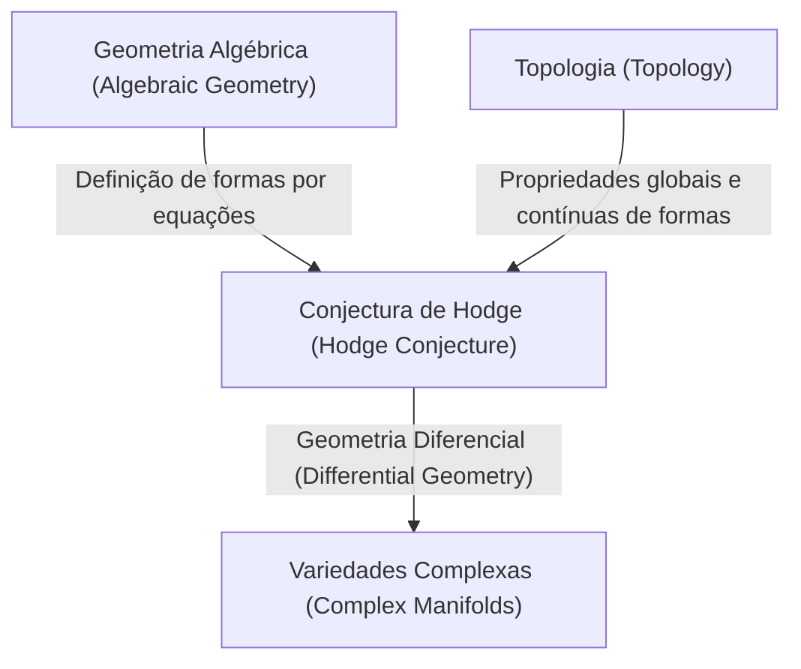
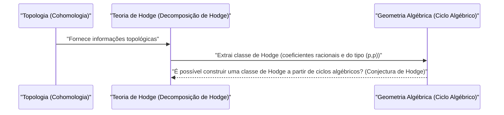

# Introdução

No mundo da matemática, ainda existem muitos mistérios não resolvidos. Entre eles, especialmente importantes e que se erguem como grandes barreiras na matemática moderna, estão os **Problemas do Prêmio Millennium** (Millennium Prize Problems). Os 7 problemas não resolvidos anunciados pelo Clay Mathematics Institute no ano 2000 têm, cada um, um prêmio de 1 milhão de dólares, e matemáticos geniais de todo o mundo estão tentando resolvê-los. Neste artigo, exploraremos profundamente um desses Problemas do Prêmio Millennium, uma conjectura muito bela que conecta a geometria algébrica e a topologia: a **Conjectura de Hodge** ([Hodge Conjecture](https://kenji.blog/pt/p/hodge-conjecture/)).

A Conjectura de Hodge é, em poucas palavras, uma conjectura sobre a profunda relação entre "formas geométricas" e "equações algébricas". Mais precisamente, ela questiona se, em uma variedade algébrica projetiva não singular sobre o corpo dos números complexos, objetos com propriedades topológicas específicas podem ser expressos por uma combinação de subvariedades algébricas.

## 1. A Interseção da Geometria Algébrica e Topologia

Para entender a Conjectura de Hodge, primeiro é necessário conhecer a relação entre duas áreas da matemática: a **Geometria Algébrica** (Algebraic Geometry) e a **Topologia** (Topology).

A geometria algébrica é o campo que estuda formas (variedades algébricas) definidas como os zeros comuns de equações polinomiais. Por exemplo, a equação de um círculo x^2 + y^2 = 1 é uma das variedades algébricas mais simples.

Por outro lado, a topologia é o campo que estuda as propriedades de formas que são preservadas mesmo quando a forma é deformada continuamente. Como no famoso exemplo "uma xícara de café e um donut têm a mesma forma topológica", ela foca em propriedades globais, como o número de buracos e a conectividade.

A Conjectura de Hodge existe no ponto de interseção desses dois campos diferentes.

## 2. Formulação da Conjectura de Hodge

Para afirmar a Conjectura de Hodge com precisão, é necessário introduzir alguns conceitos especializados.

### 2.1 Variedades Projetivas Complexas

O palco é uma **variedade algébrica projetiva não singular sobre o corpo dos números complexos**. Chamaremos isso de X.
Uma variedade complexa é um espaço que pode ser considerado localmente como o espaço complexo \mathbb{C}^n. Ser uma variedade projetiva significa que ela está imersa no espaço projetivo \mathbb{P}^N(\mathbb{C}) como os zeros comuns de alguns polinômios homogêneos. Ser não singular significa que a forma é lisa, sem "singularidades" como cúspides ou auto-interseções.

### 2.2 Cohomologia de De Rham e Decomposição de Hodge

Uma ferramenta poderosa para investigar a topologia de uma variedade X é a **Cohomologia** (Cohomology). Em particular, os grupos de cohomologia de De Rham H^k(X, \mathbb{C}) com coeficientes no corpo dos números reais ou complexos são definidos usando formas diferenciais na variedade.

William Hodge (W. V. D. Hodge) mostrou que esses grupos de cohomologia complexa podem ser decompostos em grupos mais finos que refletem a estrutura complexa. Esta é a **Decomposição de Hodge** (Hodge Decomposition).

 H^k(X, \mathbb{C}) = \bigoplus_{p+q=k} H^{p,q}(X) 

Aqui, H^{p,q}(X) representa a classe de formas diferenciais consistindo do produto exterior de p diferenciais holomorfos e q diferenciais anti-holomorfos.

### 2.3 Ciclos Algébricos e Classes de Hodge

Uma combinação linear formal de variedades algébricas (subvariedades) de dimensões menores dentro de uma variedade X é chamada de **Ciclo Algébrico** (Algebraic Cycle).

Um ciclo algébrico de dimensão k, pela Dualidade de Poincaré (Poincaré Duality), determina um elemento do grupo de cohomologia de grau 2k de X. O importante é o fato de que as classes de cohomologia determinadas por subvariedades algébricas aparecem apenas em componentes específicos na decomposição de Hodge. Especificamente, a classe de cohomologia determinada por uma subvariedade algébrica cuja codimensão (a dimensão total menos a dimensão da subvariedade) é p pertence à componente H^{p,p}(X).

Além disso, como os ciclos algébricos são definidos por equações, seus coeficientes podem ser considerados números racionais (ou inteiros). Portanto, a classe de cohomologia determinada por um ciclo algébrico também pertencerá ao grupo de cohomologia com coeficientes racionais H^{2p}(X, \mathbb{Q}).

As classes de cohomologia que satisfazem essas duas condições, ou seja, elementos pertencentes a

 \text{Hodge}^{p,p}(X) = H^{2p}(X, \mathbb{Q}) \cap H^{p,p}(X) 

são chamadas de **Classes de Hodge** (Hodge Class).

## 3. A Afirmação da Conjectura de Hodge

Estamos prontos. A afirmação da Conjectura de Hodge é extremamente simples, mas surpreendentemente poderosa.

> **[Conjectura de Hodge ([Hodge Conjecture](https://kenji.blog/pt/p/hodge-conjecture/))](https://kenji.blog/p/hodge-conjecture/)**
> Qualquer classe de Hodge em uma variedade algébrica projetiva não singular X sobre o corpo dos números complexos pode ser expressa por uma combinação linear com coeficientes racionais de ciclos algébricos.

Em outras palavras, ela afirma que "classes de cohomologia (classes de Hodge) que parecem algébrico-geométricas do ponto de vista da topologia e da análise complexa são, na verdade, originadas de formas (ciclos algébricos) criadas a partir de equações algébricas".

É a questão de saber se as classes de cohomologia, que são objetos do mundo da topologia, podem ser construídas a partir de equações polinomiais, que são objetos do mundo da geometria algébrica.

## 4. Progresso e Dificuldades da Conjectura de Hodge

A Conjectura de Hodge foi proposta pelo próprio Hodge no Congresso Internacional de Matemáticos em 1950. Desde então, muitos matemáticos têm trabalhado neste problema, mas até hoje, ele não foi completamente resolvido.

### 4.1 Casos Resolvidos

Em alguns casos especiais, foi provado que a Conjectura de Hodge é verdadeira.
- **Caso p=1 (Teorema de Lefschetz)**: Para ciclos algébricos de codimensão 1 (chamados de divisores), isso já havia sido provado na década de 1920 por Solomon Lefschetz, antes da formulação de Hodge. Isso é chamado de **Teorema (1,1) de Lefschetz** (Lefschetz (1,1)-theorem) e pode ser considerado a origem da Conjectura de Hodge.
- **Resultados relativos a variedades específicas**: Por exemplo, foi confirmado que a Conjectura de Hodge se mantém para certas classes de variedades, como variedades abelianas e algumas superfícies K3.

### 4.2 Por que é difícil?

A dificuldade da Conjectura de Hodge reside na dificuldade da prova de existência. Quando uma certa classe de Hodge é dada, deve-se mostrar que um ciclo algébrico correspondente a ela **existe**. No entanto, enquanto a classe de Hodge é dada meramente como dados analíticos/topológicos, como integrais e formas diferenciais, os ciclos algébricos são constituídos a partir de dados algébricos (equações polinomiais).

Um método geral para reconstruir equações algébricas concretas a partir de dados analíticos ainda não foi encontrado na matemática moderna.

## 5. Generalizações da Conjectura de Hodge e Problemas Relacionados

Existem várias generalizações e conjecturas relacionadas à Conjectura de Hodge.

- **Conjectura de Hodge Generalizada (Generalized [Hodge Conjecture](https://kenji.blog/pt/p/hodge-conjecture/))**: Uma tentativa de estender a Conjectura de Hodge para um quadro mais geral (por exemplo, variedades com singularidades ou variedades abertas). Foi formulada por [Alexander Grothendieck](https://kenji.blog/pt/p/grothendieck/) e outros, mas encontrar contra-exemplos, entre outras coisas, tornou a própria formulação adequada um desafio.
- **Conjectura de Tate (Tate Conjecture)**: Conhecida como um análogo da teoria dos números para a Conjectura de Hodge. Ela é formulada usando o conceito de cohomologia étale (Étale Cohomology) para variedades sobre corpos finitos, e não sobre o corpo dos números complexos. Este também é um problema não resolvido extremamente difícil.

## 6. Resumo e Perspectivas Futuras

A Conjectura de Hodge não é um mero quebra-cabeça, mas um problema importante que toca o abismo da matemática. Se essa conjectura for verdadeira, significa que existe uma conexão fundamental e bela entre a topologia e a geometria algébrica que ainda não entendemos.

Com a atrativa recompensa de 1 milhão de dólares estipulada, matemáticos de todo o mundo sem dúvida continuarão a desafiar este problema difícil no futuro. A construção de novas teorias matemáticas ou abordagens de campos completamente inesperados poderão, algum dia, abrir as portas deste Problema do Prêmio Millennium. A resolução da Conjectura de Hodge tem o potencial de trazer um avanço revolucionário para toda a matemática.

Ficaríamos felizes se os leitores também desenvolvessem um pouco de interesse por este profundo mundo da matemática.
## 7. Exemplos Concretos para Compreender a Conjectura de Hodge Mais Profundamente

Pode ser difícil compreender a essência da Conjectura de Hodge apenas a partir da sua definição abstrata. Aqui, embora se torne um pouco mais técnico, vamos nos aprofundar no significado da Conjectura de Hodge através de alguns exemplos concretos.

### 7.1 Toros e Curvas Elípticas

Um dos exemplos mais simples e fáceis de entender é uma variedade complexa de dimensão 1, ou seja, uma **Superfície de Riemann** (Riemann Surface). Entre elas, o toro (em forma de donut) com gênero (número de buracos) 1 é conhecido na geometria algébrica como uma **Curva Elíptica** (Elliptic Curve).

No caso da curva elíptica E, a dimensão complexa é 1 (dimensão real é 2). Considerando os grupos de cohomologia, o que interessa é o grupo de cohomologia de primeiro grau H^1(E, \mathbb{C}), que é de dimensão intermediária, mas a Conjectura de Hodge tem como alvo os grupos de cohomologia de dimensão total par. Portanto, na própria curva elíptica (dimensão complexa 1), não surge nenhuma afirmação não trivial da Conjectura de Hodge.

No entanto, vamos considerar o espaço produto direto de duas curvas elípticas X = E_1 \times E_2. Isso tem dimensão complexa 2 (dimensão real 4) e torna-se um palco interessante. Podemos aplicar a Conjectura de Hodge ao grupo de cohomologia de segundo grau H^2(X, \mathbb{Q}) deste espaço X.

A classe de Hodge em X está relacionada a uma forma de interseção que satisfaz certas condições. Neste caso, o ciclo algébrico correspondente à classe de Hodge torna-se uma curva dentro de X. Se E_1 e E_2 estão em uma relação especial (por exemplo, têm multiplicação complexa), foi provado que muitas curvas não triviais (ciclos algébricos) existem dentro do espaço produto direto, e que elas geram a classe de Hodge. Este é um dos exemplos reais importantes da Conjectura de Hodge.

### 7.2 Superfícies K3 e Espaços de Moduli

Mais complexas e desempenhando um papel extremamente importante na matemática moderna estão as **Superfícies K3** (K3 Surfaces). A superfície K3 é o exemplo mais simples de uma variedade de Calabi-Yau de dimensão complexa 2 (dimensão real 4), e também é um objeto importante na física, como na Teoria das Cordas (String Theory).

A Conjectura de Hodge para superfícies K3 já foi provada. No entanto, a estrutura de Hodge das superfícies K3 é tão poderosa que determina a sua geometria (Teorema de Torelli, Torelli Theorem), e o estabelecimento da Conjectura de Hodge traz uma compreensão profunda das superfícies K3. As classes de Hodge na superfície K3 são completamente realizadas como classes de curvas algébricas que existem nessa superfície.

Além disso, considerando a família de superfícies K3 (o conjunto de superfícies K3 obtidas ao variar os parâmetros), chegamos ao conceito de **Espaço de Moduli** (Moduli Space). A teoria de Hodge sobre espaços de moduli e a conjectura de Hodge para variedades individuais se entrelaçam intimamente, formando a vanguarda da geometria algébrica.

## 8. Conexões com o Grupo de Problemas Não Resolvidos na Geometria Algébrica

A Conjectura de Hodge não é um problema isolado, mas está profundamente conectada a muitas outras importantes conjecturas matemáticas.

### 8.1 Conjecturas Padrão de Grothendieck (Grothendieck's Standard Conjectures)

[Alexander Grothendieck](https://kenji.blog/pt/p/grothendieck/) estabeleceu uma série de conjecturas grandiosas sobre ciclos algébricos em variedades algébricas. Estas são as **Conjecturas Padrão** (Standard Conjectures on Algebraic Cycles).

As Conjecturas Padrão incluem a teoria da interseção de ciclos algébricos e a generalização do Teorema de Lefschetz para dimensões arbitrárias. Acredita-se que, se a Conjectura de Hodge for verdadeira, parte das Conjecturas Padrão se seguirá para variedades sobre o corpo dos números complexos. Inversamente, se as Conjecturas Padrão forem resolvidas, elas fornecerão meios poderosos para a Conjectura de Hodge. Estas são peças essenciais para a conclusão da "Teoria dos Motivos" (Theory of Motives), que é o objetivo final da geometria algébrica.

### 8.2 Conjectura de Milnor e K-Teoria Algébrica (Milnor Conjecture and Algebraic K-Theory)

Com um sabor ligeiramente diferente, a Conjectura de Milnor (Milnor Conjecture), resolvida por Vladimir Voevodsky, e a Conjectura de Bloch-Kato (Bloch-Kato Conjecture), que a generalizou, conectaram a K-teoria algébrica e a cohomologia de Galois.

O trabalho de Voevodsky construiu um novo quadro chamado "Cohomologia Motívica" (Motivic Cohomology), fortalecendo ainda mais a conexão entre a geometria algébrica e a topologia. Essa perspectiva motívica posiciona a Conjectura de Hodge dentro da teoria mais geral dos ciclos algébricos, tornando-se uma abordagem indispensável na pesquisa moderna da Conjectura de Hodge.

## 9. Da Perspectiva da Topologia e da Análise

Também é importante olhar para a Conjectura de Hodge não apenas da geometria algébrica, mas também da perspectiva da topologia e da análise.

### 9.1 Interseção com a Teoria das Singularidades

Quando as singularidades (Singularities) são permitidas em uma variedade, a teoria de Hodge se desenvolve em uma teoria de **Estruturas de Hodge Mistas** (Mixed Hodge Structures). Esta é uma bela teoria construída por Pierre Deligne, e introduz uma nova estrutura hierárquica, chamada peso (Weight), na cohomologia de espaços com singularidades.

A teoria de Estruturas de Hodge Mistas é uma ferramenta poderosa para descrever as mudanças na cohomologia no limite em que a variedade degenera (por exemplo, o processo no qual uma superfície lisa gradualmente colapsa e se torna uma superfície com singularidades). Nas tentativas de estender a Conjectura de Hodge, a teoria das singularidades e as Estruturas de Hodge Mistas desempenham papéis cruciais, e são indispensáveis na apreensão de fenômenos geométricos analiticamente.

### 9.2 Espaço de Twistor e Geometria Diferencial (Twistor Space and Differential Geometry)

A Teoria de Twistor (Twistor Theory) proposta por Roger Penrose é uma tentativa de traduzir a geometria do espaço-tempo na geometria analítica em espaços projetivos complexos. O espaço de Twistor conecta fortemente a geometria diferencial e a teoria das variedades complexas.

Embora a Conjectura de Hodge seja baseada em formas diferenciais (decomposição de Hodge) em variedades complexas, do ponto de vista da geometria diferencial, elas são entendidas como formas harmônicas do operador de Laplace. Um poderoso teorema de análise chamado teoria de integrais harmônicas existe por trás da decomposição de Hodge, e alguns pesquisadores esperam que construções da geometria diferencial, como o espaço de twistor, forneçam no futuro novos métodos analíticos para construir classes de Hodge.

## 10. Perspectivas Futuras: Quando a Conjectura de Hodge Será Resolvida?

Já se passaram mais de 70 anos desde que a Conjectura de Hodge foi proposta. Embora muitos resultados parciais e teorias poderosas relacionadas (como cohomologia motívica e estruturas de Hodge mistas) tenham sido construídas, uma prova completa para a variedade projetiva não singular em geral ainda não foi alcançada.

Alguns matemáticos suspeitam que "possam existir contra-exemplos para a Conjectura de Hodge". Se um contra-exemplo for encontrado, ele por si só chocará o mundo matemático e forçará uma modificação fundamental da nossa compreensão da relação entre topologia e geometria algébrica.

No entanto, a maioria dos matemáticos acredita que a Conjectura de Hodge é verdadeira e está procurando por um novo paradigma matemático em direção à sua prova. A Conjectura de Hodge assenta-se no ponto central onde vários campos convergem: geometria algébrica, topologia, análise complexa, e até mesmo teoria dos números e física matemática.

Ninguém sabe quando chegará o dia em que este problema será resolvido. No entanto, as novas ideias matemáticas geradas no processo de enfrentar a Conjectura de Hodge indubitavelmente enriquecerão o conhecimento humano e se tornarão a base matemática para a próxima geração. O valor de mais de 1 milhão de dólares do Problema do Prêmio Millennium certamente existe ali.
