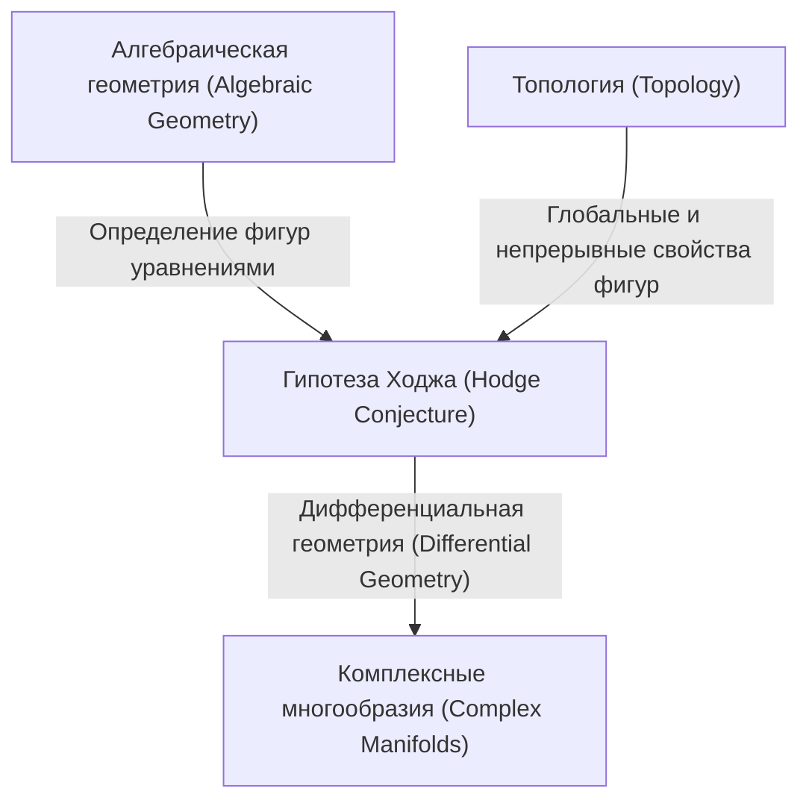
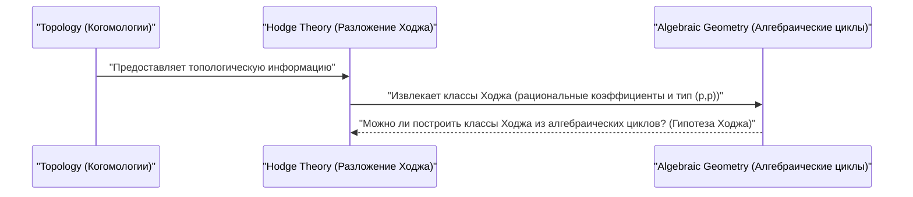

# Введение

В мире математики существует множество еще не разгаданных тайн. Среди них особенно важными, возвышающимися как огромная стена в современной математике, являются **Проблемы тысячелетия** (Millennium Prize Problems). Это 7 нерешенных проблем, представленных Математическим институтом Клэя в 2000 году, за каждую из которых назначена награда в 1 миллион долларов, и гениальные математики со всего мира пытаются их решить. В этой статье мы глубоко погрузимся в одну из Проблем тысячелетия — **Гипотезу Ходжа** ([Hodge Conjecture](https://kenji.blog/ru/p/hodge-conjecture/)), очень красивую гипотезу, связывающую алгебраическую геометрию и топологию.

Словом, гипотеза Ходжа — это гипотеза о глубокой связи между «геометрическими формами» и «алгебраическими уравнениями». Более точно, она задается вопросом, могут ли объекты с определенными топологическими свойствами на несингулярных проективных алгебраических многообразиях над полем комплексных чисел быть выражены комбинациями алгебраических подмногообразий.

## 1. Точка пересечения алгебраической геометрии и топологии

Чтобы понять гипотезу Ходжа, сначала необходимо узнать о связи двух математических областей: **алгебраической геометрии** (Algebraic Geometry) и **топологии** (Topology).

Алгебраическая геометрия — это область, изучающая фигуры (алгебраические многообразия), определяемые как общие нули полиномиальных уравнений. Например, уравнение круга x^2 + y^2 = 1 является одним из простейших алгебраических многообразий.

С другой стороны, топология — это область, изучающая свойства фигур, которые сохраняются при их непрерывных деформациях. Как гласит известная аналогия: «Кофейная чашка и пончик топологически имеют одну и ту же форму», — топология фокусируется на глобальных свойствах, таких как количество дыр или связность.

Гипотеза Ходжа существует на стыке этих двух различных областей.

## 2. Формулировка гипотезы Ходжа

Чтобы точно сформулировать гипотезу Ходжа, необходимо ввести несколько специализированных концепций.

### 2.1 Комплексные проективные многообразия

Сценой действия является **несингулярное проективное алгебраическое многообразие над полем комплексных чисел**. Обозначим его X.
Комплексное многообразие — это пространство, которое локально может рассматриваться как комплексное пространство \mathbb{C}^n. То, что это проективное многообразие, означает, что оно вложено в проективное пространство \mathbb{P}^N(\mathbb{C}) как общий нуль нескольких однородных полиномов. Несингулярность означает, что это гладкая фигура без «особых точек», таких как каспы (точки возврата) или самопересечения.

### 2.2 Когомологии де Рама и разложение Ходжа

Мощным инструментом для изучения топологии многообразия X являются **когомологии** (Cohomology). В частности, группы когомологий де Рама H^k(X, \mathbb{C}) с коэффициентами в поле вещественных или комплексных чисел определяются с использованием дифференциальных форм на многообразии.

Уильям Ходж (W. V. D. Hodge) показал, что эта группа комплексных когомологий может быть разложена на более мелкие группы, отражающие комплексную структуру. Это и есть **разложение Ходжа** (Hodge Decomposition).

$$ H^k(X, \mathbb{C}) = \bigoplus_{p+q=k} H^{p,q}(X) $$

Здесь H^{p,q}(X) представляет класс дифференциальных форм, состоящих из внешнего (клиффордова) произведения p голоморфных дифференциалов и q антиголоморфных дифференциалов.

### 2.3 Алгебраические циклы и классы Ходжа

Формальная линейная комбинация алгебраических многообразий меньшей размерности (подмногообразий), находящихся внутри многообразия X, называется **алгебраическим циклом** (Algebraic Cycle).

Алгебраический цикл размерности k благодаря двойственности Пуанкаре ([Poincaré](https://kenji.blog/ru/p/poincare/) Duality) определяет элемент 2k-й группы когомологий многообразия X. Важно то, что класс когомологий, определяемый алгебраическим подмногообразием, появляется только в определенной компоненте разложения Ходжа. В частности, класс когомологий, определяемый алгебраическим подмногообразием коразмерности p (общая размерность минус размерность подмногообразия), принадлежит компоненте H^{p,p}(X).

Более того, поскольку алгебраические циклы определяются уравнениями, их коэффициенты можно рассматривать как рациональные (или целые) числа. Следовательно, класс когомологий, определяемый алгебраическим циклом, также принадлежит группе когомологий с рациональными коэффициентами H^{2p}(X, \mathbb{Q}).

Класс когомологий, удовлетворяющий этим двум условиям, то есть элемент, принадлежащий:

$$ \text{Ходж}^{p,p}(X) = H^{2p}(X, \mathbb{Q}) \cap H^{p,p}(X) $$

называется **классом Ходжа** (Hodge Class).

## 3. Утверждение гипотезы Ходжа

Подготовка завершена. Утверждение гипотезы Ходжа очень простое, но в то же время удивительно мощное.

> **[Гипотеза Ходжа ([Hodge Conjecture](https://kenji.blog/ru/p/hodge-conjecture/))](https://kenji.blog/p/hodge-conjecture/)**
> Любой класс Ходжа на несингулярном проективном алгебраическом многообразии X над полем комплексных чисел может быть представлен в виде линейной комбинации алгебраических циклов с рациональными коэффициентами.

Иными словами, она утверждает, что «классы когомологий (классы Ходжа), которые с точки зрения топологии и комплексного анализа выглядят алгебро-геометрически, на самом деле происходят от фигур (алгебраических циклов), построенных из алгебраических уравнений».

Это вопрос о том, могут ли классы когомологий, являющиеся объектами топологического мира, быть построены из полиномиальных уравнений, являющихся объектами мира алгебраической геометрии.

## 4. Прогресс и трудности гипотезы Ходжа

Гипотеза Ходжа была предложена самим Ходжем на Международном конгрессе математиков в 1950 году. С тех пор многие математики работали над этой проблемой, но до сих пор она не получила полного решения.

### 4.1 Решенные случаи

Для некоторых частных случаев доказано, что гипотеза Ходжа верна.
- **Случай p=1 (Теорема Лефшеца)**: Для алгебраических циклов коразмерности 1 (называемых дивизорами) она уже была доказана Соломоном Лефшецем (Solomon Lefschetz) в 1920-х годах, еще до формулировки Ходжа. Это называется **теоремой Лефшеца о (1,1)-классах** (Lefschetz (1,1)-theorem), и ее можно считать истоком гипотезы Ходжа.
- **Результаты для определенных многообразий**: Например, было подтверждено, что гипотеза Ходжа выполняется для определенных классов многообразий, таких как абелевы многообразия и некоторые K3-поверхности.

### 4.2 Почему это сложно?

Сложность гипотезы Ходжа заключается в трудности доказательства существования. Если задан некоторый класс Ходжа, необходимо показать, что соответствующий алгебраический цикл **существует**. Однако, в то время как классы Ходжа задаются как аналитические и топологические данные, такие как интегралы и дифференциальные формы, алгебраические циклы строятся из алгебраических данных, то есть полиномиальных уравнений.

Общего метода реконструкции конкретных алгебраических уравнений из аналитических данных в современной математике до сих пор не найдено.

## 5. Обобщения гипотезы Ходжа и связанные с ней проблемы

Существуют различные обобщения гипотезы Ходжа и связанные с ней гипотезы.

- **Обобщенная гипотеза Ходжа (Generalized [Hodge Conjecture](https://kenji.blog/ru/p/hodge-conjecture/))**: Это попытка расширить гипотезу Ходжа на более общие рамки (например, на многообразия с сингулярностями или открытые многообразия). Она была сформулирована Александром Гротендиком ([Alexander Grothendieck](https://kenji.blog/ru/p/grothendieck/)) и другими, но это само по себе стало сложной задачей для правильной формулировки, так как были найдены контрпримеры.
- **Гипотеза Тейта (Tate Conjecture)**: Известна как теоретико-числовой аналог гипотезы Ходжа. Она формулируется с использованием концепции этальных когомологий (Étale Cohomology) для многообразий над конечными полями, а не над полем комплексных чисел. Это также чрезвычайно сложная нерешенная проблема.

## 6. Заключение и перспективы

Гипотеза Ходжа — это не просто головоломка, это важная проблема, затрагивающая глубины математики. Если эта гипотеза верна, то между топологией и алгебраической геометрией существует фундаментальная и красивая связь, которую мы еще не поняли.

Отчасти из-за привлекательного приза в 1 миллион долларов, математики со всего мира будут продолжать бросать вызов этой сложной проблеме. Построение новых математических теорий или подходы из совершенно неожиданных областей могут однажды открыть дверь к решению этой Проблемы тысячелетия. Решение гипотезы Ходжа обладает потенциалом принести революционный прогресс во всей математике.

Я был бы счастлив, если бы читатели заинтересовались этим глубоким математическим миром хотя бы немного.

## 7. Конкретные примеры для более глубокого понимания гипотезы Ходжа

Трудно уловить суть гипотезы Ходжа только из ее абстрактного определения. Здесь, хотя мы немного углубимся в технические детали, давайте подробнее рассмотрим значение гипотезы Ходжа через несколько конкретных примеров.

### 7.1 Торы и эллиптические кривые

Одним из самых простых и понятных примеров является одномерное комплексное многообразие, то есть **риманова поверхность** ([Riemann](https://kenji.blog/ru/p/riemann/) Surface). Среди них тор (в форме пончика) с родом (количеством дыр) равным 1 известен в алгебраической геометрии как **эллиптическая кривая** (Elliptic Curve).

В случае эллиптической кривой E комплексная размерность равна 1 (вещественная размерность равна 2). При рассмотрении групп когомологий интерес представляет 1-я группа когомологий H^1(E, \mathbb{C}), находящаяся в промежуточной размерности, но объектом гипотезы Ходжа являются группы когомологий четной общей размерности. Следовательно, на самой эллиптической кривой (комплексная размерность 1) нетривиальное утверждение гипотезы Ходжа не возникает.

Однако давайте рассмотрим прямое произведение эллиптических кривых X = E_1 \times E_2. Оно будет иметь комплексную размерность 2 (вещественную размерность 4), что становится интересной сценой. Мы можем применить гипотезу Ходжа к 2-й группе когомологий H^2(X, \mathbb{Q}) этого пространства X.

Классы Ходжа на X связаны с формами пересечения, удовлетворяющими определенным условиям. В этом случае алгебраическими циклами, соответствующими классам Ходжа, будут кривые в X. Если E_1 и E_2 находятся в особом отношении (например, имеют комплексное умножение), было доказано, что в пространстве прямого произведения существует множество нетривиальных кривых (алгебраических циклов), которые порождают классы Ходжа. Это один из важных практических примеров гипотезы Ходжа.

### 7.2 K3-поверхности и пространства модулей

Более сложной и играющей чрезвычайно важную роль в современной математике является **K3-поверхность** (K3 Surface). K3-поверхность — это простейший пример многообразия Калаби-Яу с комплексной размерностью 2 (вещественная размерность 4), которое также является важным объектом в физике, такой как теория струн (String Theory).

Гипотеза Ходжа для K3-поверхностей уже доказана. Однако структура Ходжа K3-поверхностей настолько мощна, что определяет ее геометрию (Теорема Торелли, Torelli Theorem), и выполнение гипотезы Ходжа приносит глубокое понимание K3-поверхностей. Классы Ходжа на K3-поверхности полностью реализуются как классы алгебраических кривых, существующих на этой поверхности.

Кроме того, рассматривая семейства K3-поверхностей (наборы K3-поверхностей, полученные при изменении параметров), мы приходим к концепции **пространства модулей** (Moduli Space). Теория Ходжа на пространствах модулей и гипотеза Ходжа для отдельных многообразий тесно переплетаются, образуя передовую линию алгебраической геометрии.

## 8. Связь с нерешенными проблемами в алгебраической геометрии

Гипотеза Ходжа не является изолированной проблемой, она глубоко связана со многими другими важными математическими гипотезами.

### 8.1 Стандартные гипотезы Гротендика (Grothendieck's Standard Conjectures)

[Александр Гротендик](https://kenji.blog/ru/p/grothendieck/) выдвинул серию грандиозных гипотез об алгебраических циклах на алгебраических многообразиях. Это **Стандартные гипотезы** (Standard Conjectures on Algebraic Cycles).

Стандартные гипотезы включают теорию пересечений алгебраических циклов и обобщение теоремы Лефшеца на любую размерность. Считается, что если гипотеза Ходжа верна, то для многообразий над полем комплексных чисел будет следовать часть стандартных гипотез. И наоборот, если стандартные гипотезы будут решены, это предоставит мощный инструмент для гипотезы Ходжа. Это необходимые фрагменты для завершения конечной цели алгебраической геометрии — «теории мотивов» (Theory of Motives).

### 8.2 Гипотеза Милнора и алгебраическая K-теория (Milnor Conjecture and Algebraic K-Theory)

Немного отличающаяся по направленности гипотеза Милнора (Milnor Conjecture), решенная Владимиром Воеводским (Vladimir Voevodsky), и обобщающая ее гипотеза Блоха-Като (Bloch-Kato Conjecture), связывали алгебраическую K-теорию и когомологии Галуа.

Работа Воеводского создала новую концептуальную базу под названием «Мотивные когомологии» (Motivic Cohomology) и еще больше укрепила связь между алгебраической геометрией и топологией. Эта мотивная перспектива помещает гипотезу Ходжа в более общую теорию алгебраических циклов и стала важным подходом в современных исследованиях гипотезы Ходжа.

## 9. С точки зрения топологии и анализа

Важно рассматривать гипотезу Ходжа не только с позиции алгебраической геометрии, но и с позиции топологии и анализа.

### 9.1 Пересечение с теорией сингулярностей

Когда на многообразиях допускаются особые точки (Singularities), теория Ходжа развивается в теорию **смешанной структуры Ходжа** (Mixed Hodge Structure). Это красивая теория, созданная Пьером Делинем (Pierre Deligne), которая вводит новую иерархическую структуру, называемую весом (Weight), в когомологии пространств с особыми точками.

Теория смешанной структуры Ходжа является мощным инструментом для описания изменения когомологий в пределе, когда многообразие вырождается (например, процесс, когда гладкая поверхность постепенно сплющивается и становится поверхностью с особыми точками). При попытках расширить гипотезу Ходжа эта теория сингулярностей и смешанная структура Ходжа играют важную роль, став незаменимыми для аналитического понимания геометрических явлений.

### 9.2 Твисторное пространство и дифференциальная геометрия (Twistor Space and Differential Geometry)

Твисторная теория (Twistor Theory), предложенная Роджером Пенроузом (Roger Penrose), — это попытка перевести геометрию пространства-времени в аналитическую геометрию на комплексном проективном пространстве. Твисторное пространство прочно связывает дифференциальную геометрию и теорию комплексных многообразий.

Гипотеза Ходжа основана на дифференциальных формах (разложении Ходжа) на комплексном многообразии, но с точки зрения дифференциальной геометрии они понимаются как гармонические формы оператора Лапласа. За разложением Ходжа стоит мощная теорема анализа — теория гармонических интегралов, и некоторые исследователи надеются, что дифференциально-геометрические конструкции, подобные твисторным пространствам, в будущем предоставят новые аналитические методы для построения классов Ходжа.

## 10. Взгляд в будущее: когда будет решена гипотеза Ходжа?

Прошло уже более 70 лет с тех пор, как была предложена гипотеза Ходжа. Было построено множество частичных результатов и связанных с ними мощных теорий (таких как мотивные когомологии и смешанные структуры Ходжа), но полного доказательства для общих несингулярных проективных многообразий так и не было получено.

Некоторые математики подозревают, что для гипотезы Ходжа существуют контрпримеры. Если контрпример будет найден, это само по себе станет большим шоком для математического мира и заставит нас фундаментально пересмотреть наше понимание связи между топологией и алгебраической геометрией.

Однако большинство математиков верит, что гипотеза Ходжа верна, и ищет новые математические парадигмы для ее доказательства. Гипотеза Ходжа находится в самом центре пересечения различных областей, таких как алгебраическая геометрия, топология, комплексный анализ, а также теория чисел и математическая физика.

Никто не знает, когда придет день решения этой проблемы. Однако новые математические идеи, рожденные в процессе работы над гипотезой Ходжа, несомненно обогатят человеческие знания и станут краеугольным камнем математики следующего поколения. В этом, безусловно, заключается ценность более 1 миллиона долларов, предложенных за эту Проблему тысячелетия.
