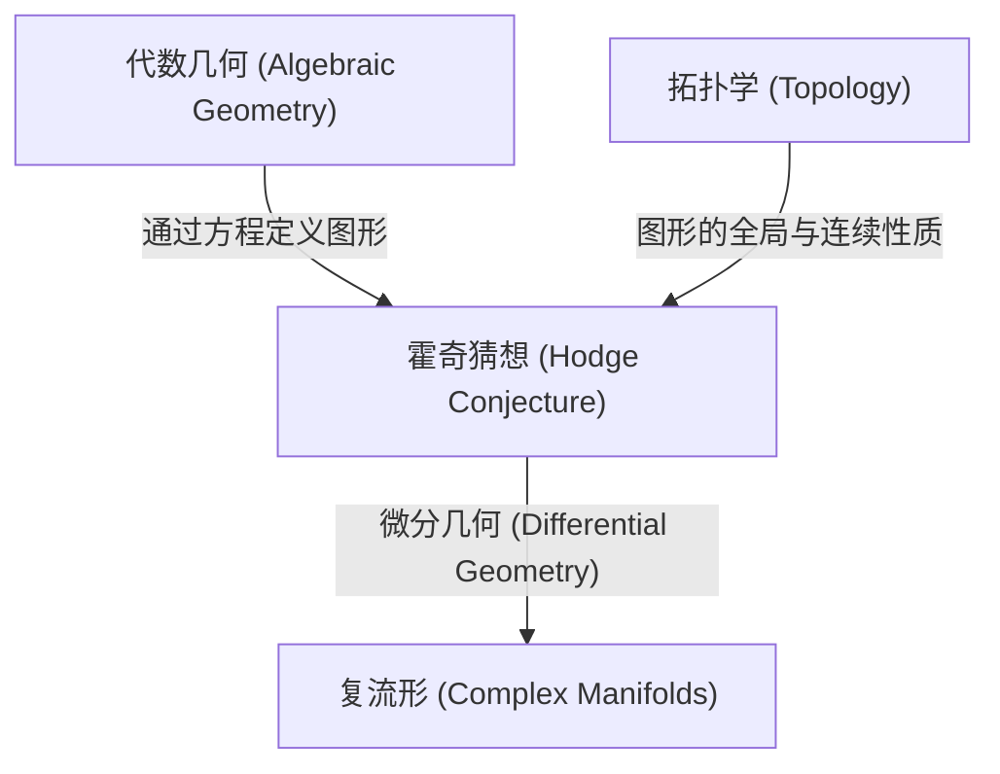
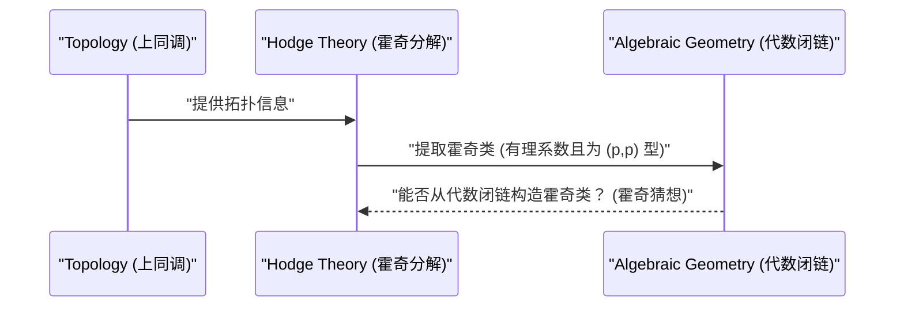

# 引言

数学世界中仍然存在着许多尚未解开的谜团。其中尤为重要，并且作为现代数学巨大障碍横亘在前的，便是**千禧年大奖难题** (Millennium Prize Problems)。2000年由克雷数学研究所公布的这7个未解决问题，每一个都悬赏100万美元，全世界的天才数学家们都在挑战破解它们。在本文中，我们将深入探讨千禧年大奖难题中连接代数几何与拓扑学的一个极其优美的猜想——**霍奇猜想** ([Hodge Conjecture](https://kenji.blog/zh-cn/p/hodge-conjecture/))。

霍奇猜想，一言以蔽之，是关于“几何形状”与“代数方程”之间深层关系的猜想。更准确地说，它探讨的是在复数域上的非奇异射影代数簇中，具有特定拓扑性质的对象是否可以通过代数子簇的组合来表示。

## 1. 代数几何与拓扑学的交汇点

为了理解霍奇猜想，我们首先需要了解**代数几何** (Algebraic Geometry) 与**拓扑学** (Topology) 这两个数学分支之间的关系。

代数几何是研究由多项式方程的公共零点定义的图形（代数簇）的领域。例如，圆的方程 x^2 + y^2 = 1 就是最简单的代数簇之一。

另一方面，拓扑学是研究图形在连续变形下保持不变的性质的领域。正如“咖啡杯和甜甜圈在拓扑学上是相同形状”这个著名的比喻所言，拓扑学关注的是诸如孔洞数量、连通性等全局性质。

霍奇猜想就存在于这两个不同领域的交汇处。

## 2. 霍奇猜想的表述

为了准确陈述霍奇猜想，我们需要引入一些专业概念。

### 2.1 复射影簇

舞台设定在**复数域上的非奇异射影代数簇**。我们将其记为 X。
复流形是指局部上可以看作复空间 \mathbb{C}^n 的空间。射影簇意味着它被嵌入在射影空间 \mathbb{P}^N(\mathbb{C}) 中，作为几个齐次多项式的公共零点。非奇异意味着图形没有尖点或自交等“奇异点”，是一个光滑的图形。

### 2.2 德拉姆上同调与霍奇分解

研究流形 X 拓扑的强大工具是**上同调** (Cohomology)。特别是以实数或复数为系数的德拉姆上同调群 H^k(X, \mathbb{C})，它是使用流形上的微分形式来定义的。

威廉·霍奇 (W. V. D. Hodge) 证明了，这个复上同调群可以分解为反映复结构的更细致的群。这就是**霍奇分解** (Hodge Decomposition)。

 H^k(X, \mathbb{C}) = \bigoplus_{p+q=k} H^{p,q}(X) 

这里，H^{p,q}(X) 表示由 p 个全纯微分和 q 个反全纯微分的楔积组成的微分形式类。

### 2.3 代数闭链与霍奇类

在流形 X 中，较低维度的代数簇（子流形）的形式线性组合被称为**代数闭链** (Algebraic Cycle)。

维度为 k 的代数闭链，通过庞加莱对偶性 (Poincaré Duality)，确定了 X 的 2k 次上同调群中的一个元素。重要的是，由代数子流形确定的上同调类，在霍奇分解中只出现在特定的成分里。具体来说，余维度（总维度减去子流形的维度）为 p 的代数子流形确定的上同调类，属于 H^{p,p}(X) 这个成分。

此外，由于代数闭链是由方程定义的，其系数可以考虑为有理数（或整数）。因此，由代数闭链确定的上同调类也属于有理系数上同调群 H^{2p}(X, \mathbb{Q})。

满足这两个条件的上同调类，即属于

 \text{Hodge}^{p,p}(X) = H^{2p}(X, \mathbb{Q}) \cap H^{p,p}(X) 

的元素，被称为**霍奇类** (Hodge Class)。

## 3. 霍奇猜想的主张

准备工作就绪。霍奇猜想的主张虽然非常简单，但却惊人地强大。

> **[霍奇猜想 ([Hodge Conjecture](https://kenji.blog/zh-cn/p/hodge-conjecture/))](https://kenji.blog/p/hodge-conjecture/)**
> 复数域上的非奇异射影代数簇 X 上的任何霍奇类，都可以表示为代数闭链的有理系数线性组合。

换言之，它主张“从拓扑学和复分析的角度来看像代数几何的上同调类（霍奇类），实际上确实源于由代数方程构成的图形（代数闭链）”。

这是一个探讨属于拓扑学世界对象的上同调类，是否可以由代数几何世界对象的多项式方程构造出来的问题。

## 4. 霍奇猜想的进展与难点

霍奇猜想由霍奇本人在1950年的国际数学家大会上提出。自那以后，许多数学家致力于解决这个问题，但直到今天仍未获得彻底解决。

### 4.1 已解决的情形

在某些特殊情形下，霍奇猜想已被证明是正确的。
- **p=1 的情形 (莱夫谢茨定理)**: 对于余维度为1的代数闭链（称为除子），所罗门·莱夫谢茨 (Solomon Lefschetz) 在霍奇提出表述之前的1920年代就已经证明了。这被称为**莱夫谢茨(1,1)定理** (Lefschetz (1,1)-theorem)，可以说是霍奇猜想的起源。
- **关于特定流形的结果**: 例如，对于某些特定类的流形，如阿贝尔流形和K3曲面的一部分，已经确认霍奇猜想成立。

### 4.2 为什么这么难？

霍奇猜想的困难在于存在性证明的难度。当给定一个霍奇类时，必须证明**存在**与之对应的代数闭链。然而，霍奇类仅仅作为积分或微分形式等解析、拓扑的数据被给出，而代数闭链则是由多项式方程这种代数数据构成的。

即使在现代数学中，尚未发现从解析数据重构具体代数方程的通用方法。

## 5. 霍奇猜想的推广及相关问题

霍奇猜想存在着各种推广和相关的猜想。

- **广义霍奇猜想 (Generalized [Hodge Conjecture](https://kenji.blog/zh-cn/p/hodge-conjecture/))**: 试图将霍奇猜想扩展到更一般的框架（例如，带有奇异点的流形、开流形等）。虽然由[亚历山大·格罗滕迪克](https://kenji.blog/zh-cn/p/grothendieck/) ([Alexander Grothendieck](https://kenji.blog/zh-cn/p/grothendieck/)) 等人进行了表述，但也发现了反例，因此寻找合适的表述本身就成为了一个困难的课题。
- **塔特猜想 (Tate Conjecture)**: 作为霍奇猜想在数论上的类比，著名的是塔特猜想。它不是针对复数域上的流形，而是针对有限域上的流形，使用平展上同调 (Étale Cohomology) 的概念进行表述。这也是一个极其艰深的未解决问题。

## 6. 总结与未来展望

霍奇猜想不仅仅是一个拼图游戏，更是触及数学深渊的重要问题。如果这个猜想为真，那将意味着拓扑学和代数几何之间存在着我们尚未理解的根本而优美的联系。

或许是因为设定了100万美元这一诱人的奖金，全世界的数学家们今后也将继续挑战这个难题。构建新的数学理论，或者从完全意想不到的领域切入，也许终有一天能打开这道千禧年大奖难题的大门。霍奇猜想的解决，蕴含着为整个数学带来革命性进步的可能。

如果读者您也能对这个深奥的数学世界产生哪怕一点点兴趣，我们将不胜荣幸。
## 7. 深入理解霍奇猜想的具体例子

仅凭霍奇猜想的抽象定义，可能很难把握其实质。这里稍微专业一点，让我们通过几个具体例子来进一步探讨霍奇猜想的意义。

### 7.1 环面与椭圆曲线

最简单易懂的例子之一是1维的复流形，即**黎曼面** (Riemann Surface)。其中，亏格（孔的数量）为1的环面（甜甜圈形状），在代数几何中被称为**椭圆曲线** (Elliptic Curve)。

对于椭圆曲线 E，复维度为1（实维度为2）。考虑其上同调群，有趣的是中间维度的1次上同调群 H^1(E, \mathbb{C})，但霍奇猜想的对象是总维度为偶数维的上同调群。因此，在椭圆曲线自身（复维度1）上，不会出现非平凡的霍奇猜想陈述。

然而，让我们考虑椭圆曲线的直积空间 X = E_1 \times E_2。它的复维度变为2（实维度为4），成为一个有趣的舞台。我们可以将霍奇猜想应用于这个空间 X 的2次上同调群 H^2(X, \mathbb{Q})。

X 上的霍奇类与满足特定条件的相交形式相关。在这种情况下，对应于霍奇类的代数闭链将是 X 内的曲线。如果 E_1 和 E_2 之间有特殊的关系（例如，具有复乘等），那么直积空间中会存在大量非平凡的曲线（代数闭链），并且已经证明它们生成了霍奇类。这是霍奇猜想的一个重要实例。

### 7.2 K3曲面与模空间

更加复杂且在现代数学中扮演极其重要角色的是**K3曲面** (K3 Surface)。K3曲面是复维度为2（实维度为4）的卡拉比-丘流形的最简单例子，在弦理论 (String Theory) 等物理学领域也是重要的研究对象。

对于K3曲面的霍奇猜想已经被证明。而且，K3曲面的霍奇结构强大到足以决定其几何性质（特雷利定理，Torelli Theorem），霍奇猜想的成立带来了对K3曲面的深刻理解。K3曲面上的霍奇类完全实现为存在于该曲面上的代数曲线类。

进一步地，通过考虑K3曲面族（改变参数时得到的K3曲面集合），我们到达了**模空间** (Moduli Space) 的概念。模空间上的霍奇理论与个体流形的霍奇猜想密切交织在一起，构成了代数几何的最前沿。

## 8. 与代数几何中未解决问题群的联系

霍奇猜想并非一个孤立的问题，而是与其他许多重要的数学猜想紧密相连。

### 8.1 格罗滕迪克的标准猜想 (Grothendieck's Standard Conjectures)

[亚历山大·格罗滕迪克](https://kenji.blog/zh-cn/p/grothendieck/)建立了一系列关于代数簇上代数闭链的宏伟猜想。这就是**标准猜想** (Standard Conjectures on Algebraic Cycles)。

标准猜想包含了代数闭链的相交理论，以及莱夫谢茨定理向任意维度的推广。如果霍奇猜想为真，那么对于复数域上的流形，标准猜想的一部分将被认为自动成立。反之，如果标准猜想得到解决，将为霍奇猜想提供强有力的工具。这些都是完成代数几何终极目标——“动机理论” (Theory of Motives) 不可或缺的拼图。

### 8.2 米尔诺猜想与代数K理论 (Milnor Conjecture and Algebraic K-Theory)

虽然风格略有不同，由弗拉基米尔·沃埃沃德斯基 (Vladimir Voevodsky) 解决的米尔诺猜想 (Milnor Conjecture) 及其推广的布洛赫-加藤猜想 (Bloch-Kato Conjecture)，是将代数K理论与伽罗华上同调联系起来的理论。

沃埃沃德斯基的工作构建了名为“动机上同调” (Motivic Cohomology) 的新框架，并使代数几何与拓扑学的联系变得更加牢固。这种动机的视角将霍奇猜想置于更一般的代数闭链理论中，成为现代霍奇猜想研究中不可或缺的方法。

## 9. 从拓扑学与分析学的视角

不仅从代数几何，从拓扑学和分析学的视角审视霍奇猜想同样重要。

### 9.1 与奇异点理论的交错

当允许流形具有奇异点 (Singularities) 时，霍奇理论发展成为**混合霍奇结构** (Mixed Hodge Structure) 理论。这是由皮埃尔·德利涅 (Pierre Deligne) 构建的优美理论，它为带有奇异点的空间的上同调引入了称为权重 (Weight) 的新层次结构。

混合霍奇结构理论是描述流形在退化极限下（例如，光滑曲面逐渐塌缩成为具有奇异点的曲面的过程）上同调变化的强大工具。在扩展霍奇猜想的尝试中，这种奇异点理论和混合霍奇结构发挥了重要作用，成为从解析上把握几何现象必不可少的内容。

### 9.2 扭量空间与微分几何 (Twistor Space and Differential Geometry)

由罗杰·彭罗斯 (Roger Penrose) 提出的扭量理论 (Twistor Theory) 是试图将时空的几何学转化为复射影空间上的解析几何学的尝试。扭量空间强有力地将微分几何与复流形论结合在一起。

尽管霍奇猜想是基于复流形上的微分形式（霍奇分解）的，但从微分几何的视角来看，这些被理解为拉普拉斯算子的调和形式。调和积分理论这一强大的分析学定理存在于霍奇分解的背后，一些研究人员期待，像扭量空间这样的微分几何构造，未来能为构造霍奇类提供新的解析方法。

## 10. 走向未来：霍奇猜想何时能解开？

霍奇猜想提出至今已有70多年。虽然已经获得了很多部分结果，并构建了相关的强大理论（如动机上同调和混合霍奇结构等），但尚未达到对一般非奇异射影流形的完全证明。

一些数学家怀疑，“霍奇猜想是否存在反例”。如果发现反例，那将在数学界引发巨大震动，迫使我们从根本上修正对拓扑学和代数几何之间关系的理解。

然而，大多数数学家相信霍奇猜想为真，并在探索新的数学范式以期证明它。霍奇猜想端坐于代数几何、拓扑学、复分析，甚至数论和数学物理等多门学科融合的中心点。

谁也不知道这个问题被解决的那一天何时到来。但是，在挑战霍奇猜想的过程中产生的新数学思想，无疑将丰富人类的知识，并成为下一代数学的基石。悬赏在千禧年大奖难题上的那100多万美元的价值，确实存在于此。
