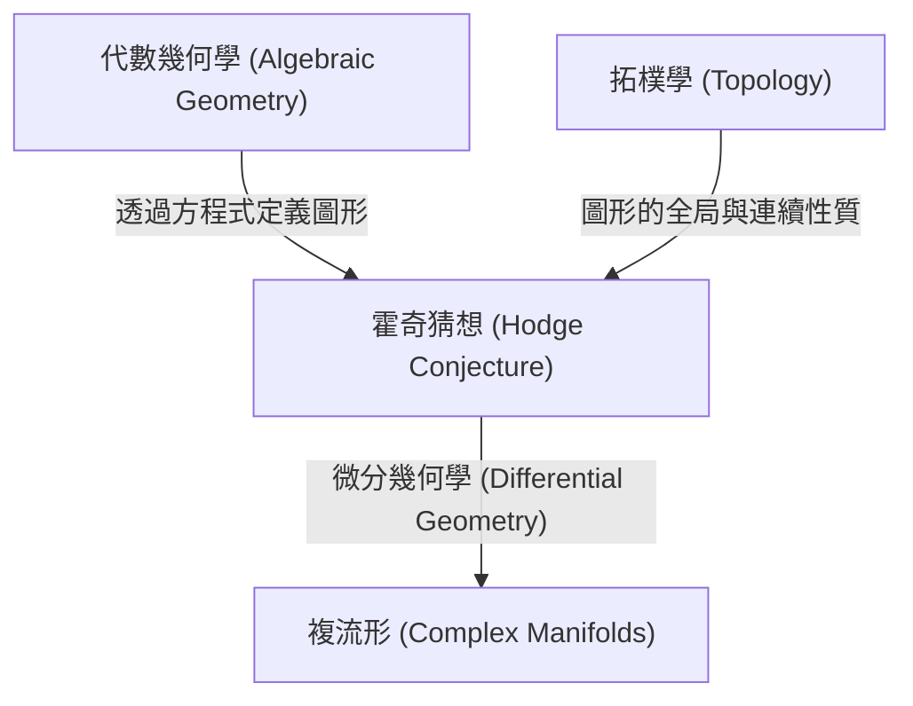
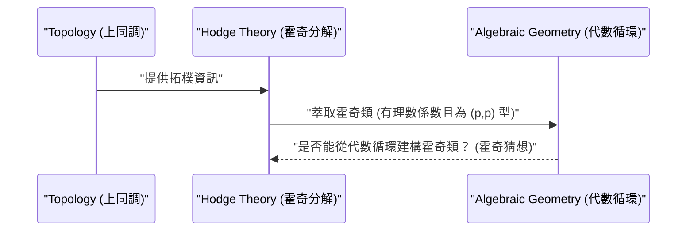

# 簡介

在數學世界中，仍存在許多尚未解開的謎團。其中特別重要、並作為現代數學巨大屏障而存在的，便是**千禧年大獎難題** (Millennium Prize Problems)。2000年由克雷數學研究所發表的七個未解決問題，每個都懸賞了一百萬美元，全世界的天才數學家們都在挑戰解開它們。在本篇文章中，我們將深入探討千禧年大獎難題中，連結代數幾何學與拓樸學 (Topology) 的一個非常美麗的猜想：**霍奇猜想** ([Hodge Conjecture](https://kenji.blog/zh-tw/p/hodge-conjecture/))。

霍奇猜想，簡單來說是一個關於「幾何形狀」與「代數方程式」之間深層關聯性的猜想。更準確地說，它探討在複數體上的非奇異射影代數簇中，具有特定拓樸性質的對象是否可以透過代數子簇的組合來表示。

## 1. 代數幾何學與拓樸學的交會點

為了理解霍奇猜想，首先必須了解**代數幾何學** (Algebraic Geometry) 與**拓樸學** (Topology) 這兩個數學領域之間的關聯。

代數幾何學是研究由多項式方程式的共同零點所定義的圖形 (代數簇) 的領域。例如，圓的方程式 x^2 + y^2 = 1 就是最簡單的代數簇之一。

另一方面，拓樸學是研究即使將圖形連續變形也能保持不變之性質的領域。正如「咖啡杯和甜甜圈在拓樸學上是相同形狀」這個著名的比喻一樣，它著眼於洞的數量和連通性等全局性質。

霍奇猜想就存在於這兩個不同領域交會的地點。

## 2. 霍奇猜想的公式化

為了準確陳述霍奇猜想，必須引入一些專業概念。

### 2.1 複射影簇

舞台是**複數體上的非奇異射影代數簇**。我們將其設為 X。
複流形是指局部可被視為複空間 \mathbb{C}^n 的空間。所謂射影簇，意味著它被嵌入到射影空間 \mathbb{P}^N(\mathbb{C}) 中，作為幾個齊次多項式的共同零點。非奇異意味著圖形沒有尖點或自交等「奇異點」，是一個平滑的圖形。

### 2.2 德拉姆上同調與霍奇分解

研究流形 X 之拓樸學的強大工具是**上同調** (Cohomology)。特別是以實數體或複數體為係數的德拉姆上同調群 H^k(X, \mathbb{C})，是使用流形上的微分形式來定義的。

威廉·霍奇 (W. V. D. Hodge) 證明了這個複上同調群可以分解成反映複結構的更細緻的群。這就是**霍奇分解** (Hodge Decomposition)。

 H^k(X, \mathbb{C}) = \bigoplus_{p+q=k} H^{p,q}(X) 

這裡，H^{p,q}(X) 表示由 p 個全純微分和 q 個反全純微分的楔積組成的微分形式的類。

### 2.3 代數循環與霍奇類

在流形 X 中，維度較低的代數簇 (子流形) 的形式線性組合稱為**代數循環** (Algebraic Cycle)。

根據龐加萊對偶性 ([Poincaré](https://kenji.blog/zh-tw/p/poincare/) Duality)，維度為 k 的代數循環決定了 X 的 2k 次上同調群中的元素。重要的是，由代數子流形決定的上同調類，在霍奇分解中只會出現在特定的成分中。具體來說，餘維度 (總維度減去子流形維度) 為 p 的代數子流形所決定的上同調類，屬於 H^{p,p}(X) 這個成分。

此外，由於代數循環是由方程式定義的，因此其係數可以用有理數 (或整數) 來考慮。因此，由代數循環決定的上同調類，也會屬於有理係數的上同調群 H^{2p}(X, \mathbb{Q})。

滿足這兩個條件的上同調類，即

 \text{霍奇}^{p,p}(X) = H^{2p}(X, \mathbb{Q}) \cap H^{p,p}(X) 

屬於其中的元素稱為**霍奇類** (Hodge Class)。

## 3. 霍奇猜想的主張

準備工作完成了。霍奇猜想的主張雖然非常簡單，卻具有驚人的威力。

> **[霍奇猜想 (Hodge Conjecture)](https://kenji.blog/p/hodge-conjecture/)**
> 複數體上非奇異射影代數簇 X 上的任何霍奇類，都可以表示為代數循環之有理數係數的線性組合。

換句話說，它主張「從拓樸學和複分析的觀點來看，似乎是代數幾何學的上同調類 (霍奇類)，實際上是由代數方程式所構成的圖形 (代數循環) 所產生的」。

這是一個關於拓樸學世界的對象 (上同調類) 是否可以由代數幾何學世界的對象 (多項式方程式) 來構成的問題。

## 4. 霍奇猜想的進展與困難度

霍奇猜想是在1950年的國際數學家大會上由霍奇本人提出的。自那時起，許多數學家致力於解決這個問題，但直到現在仍未完全解決。

### 4.1 已解決的情況

對於一些特殊情況，已證明霍奇猜想是正確的。
- **p=1 的情況 (雷夫謝茨定理)**：關於餘維度為1的代數循環 (稱為除子)，所羅門·雷夫謝茨 (Solomon Lefschetz) 在霍奇公式化之前的1920年代就已經證明了。這被稱為**雷夫謝茨的(1,1)定理** (Lefschetz (1,1)-theorem)，可以說是霍奇猜想的起源。
- **特定流形的相關結果**：例如，對於某些特定類別的流形，如阿貝爾流形或部分K3曲面，已確認霍奇猜想成立。

### 4.2 為什麼困難？

霍奇猜想的困難在於存在性證明的困難。當給定一個霍奇類時，必須證明對應於它的代數循環**存在**。然而，霍奇類終究只是作為積分或微分形式等分析或拓樸數據給出的，而代數循環則是由多項式方程式這種代數數據構成的。

即使在現代數學中，也尚未找到從分析數據重新建構具體代數方程式的一般方法。

## 5. 霍奇猜想的推廣與相關問題

霍奇猜想有各種推廣和相關的猜想。

- **廣義霍奇猜想 (Generalized [Hodge Conjecture](https://kenji.blog/zh-tw/p/hodge-conjecture/))**：試圖將霍奇猜想擴展到更一般的框架 (例如，帶有奇異點的流形或開流形等)。由亞歷山大·格羅滕迪克 ([Alexander Grothendieck](https://kenji.blog/zh-tw/p/grothendieck/)) 等人公式化，但由於發現了反例，尋找適當的公式化本身就成了一個艱難的課題。
- **泰特猜想 (Tate Conjecture)**：作為霍奇猜想的數論類比而為人所知的是泰特猜想。它不使用複數體上的流形，而是針對有限體上的流形，利用平展上同調 (Étale Cohomology) 的概念來公式化。這也是一個極其深奧的未解決問題。

## 6. 總結與未來展望

霍奇猜想不僅僅是一個謎題，而是一個觸及數學深淵的重要問題。如果這個猜想為真，那就意味著在拓樸學和代數幾何學之間，存在著我們尚未理解的根本且美麗的聯繫。

一百萬美元的誘人獎金也設定了，今後世界各地的數學家們無疑將繼續挑戰這個難題。建立新的數學理論，或者從完全意想不到的領域切入，或許有朝一日能開啟這扇千禧年大獎難題的大門。霍奇猜想的解決，蘊藏著為整個數學界帶來革命性進步的可能性。

如果各位讀者也能對這深奧的數學世界產生一點興趣，那就太好了。
## 7. 為了更深入理解霍奇猜想的具體例子

僅憑霍奇猜想的抽象定義，可能很難掌握其實質。這裡，雖然稍微專業一點，我們透過幾個具體例子來進一步探討霍奇猜想的意義。

### 7.1 環面與橢圓曲線

最簡單且最容易理解的例子之一是1維的複流形，也就是**黎曼面** ([Riemann](https://kenji.blog/zh-tw/p/riemann/) Surface)。其中虧格 (洞的數量) 為1的環面 (甜甜圈形狀)，在代數幾何學中被稱為**橢圓曲線** (Elliptic Curve)。

在橢圓曲線 E 的情況下，複維度為1 (實維度為2)。考慮上同調群時，有趣的是中間維度的1次上同調群 H^1(E, \mathbb{C})，但霍奇猜想的對象是總維度為偶數維度的上同調群。因此，在橢圓曲線本身 (複維度1) 中，不會出現非平凡的霍奇猜想陳述。

但是，讓我們考慮橢圓曲線之間的直積空間 X = E_1 \times E_2。這個空間的複維度變成2 (實維度為4)，成為一個有趣的舞台。我們可以將霍奇猜想應用於這個空間 X 的2次上同調群 H^2(X, \mathbb{Q})。

X 上的霍奇類與滿足特定條件的相交形式有關。在這種情況下，對應於霍奇類的代數循環將是 X 內的曲線。如果 E_1 和 E_2 處於特殊關係 (例如，具有虛乘法等)，則在直積空間中會存在許多非平凡的曲線 (代數循環)，並且已經證明它們生成了霍奇類。這是霍奇猜想的重要實例之一。

### 7.2 K3曲面與模空間

更複雜且在現代數學中扮演極其重要角色的是**K3曲面** (K3 Surface)。K3曲面是複維度為2 (實維度為4) 的卡拉比-丘流形的最簡單例子，在弦理論 (String Theory) 等物理學中也是重要的研究對象。

對於K3曲面的霍奇猜想已經被證明。然而，K3曲面的霍奇結構強大到足以決定其幾何學 (托雷利定理，Torelli Theorem)，霍奇猜想的成立帶來了對K3曲面的深入理解。K3曲面上的霍奇類，完全被實現為存在於該曲面上的代數曲線類。

此外，透過考慮K3曲面的族 (變動參數時獲得的K3曲面集合)，我們達到了一個稱為**模空間** (Moduli Space) 的概念。模空間上的霍奇理論與個別流形的霍奇猜想密切交織，形成了代數幾何學的最前線。

## 8. 與代數幾何學中未解決問題群的關聯

霍奇猜想不是一個孤立的問題，它與許多其他重要的數學猜想有著深厚的關聯。

### 8.1 格羅滕迪克的標準猜想 (Grothendieck's Standard Conjectures)

[亞歷山大·格羅滕迪克](https://kenji.blog/zh-tw/p/grothendieck/)提出了一系列關於代數流形上代數循環的宏大猜想。這就是**標準猜想** (Standard Conjectures on Algebraic Cycles)。

標準猜想包含了代數循環的相交理論，以及雷夫謝茨定理推廣到任意維度。如果霍奇猜想為真，那麼對於複數體上的流形，人們認為標準猜想的一部分也會隨之成立。反過來，如果標準猜想被解決，將為霍奇猜想提供強大的工具。這些是完成代數幾何學終極目標「動機理論」 (Theory of Motives) 不可或缺的拼圖。

### 8.2 米爾諾猜想與代數K理論 (Milnor Conjecture and Algebraic K-Theory)

雖然風格略有不同，由弗拉基米爾·沃埃沃德斯基 (Vladimir Voevodsky) 解決的米爾諾猜想 (Milnor Conjecture)，以及其推廣的布洛赫-加藤猜想 (Bloch-Kato Conjecture)，將代數K理論與伽羅瓦上同調連結了起來。

沃埃沃德斯基的工作建立了一個名為「動機上同調」 (Motivic Cohomology) 的新框架，進一步鞏固了代數幾何學與拓樸學之間的聯繫。這個動機性的視角將霍奇猜想置於更普遍的代數循環理論中，並成為現代霍奇猜想研究中不可或缺的方法。

## 9. 從拓樸學與分析學的觀點來看

從拓樸學和分析學的視角來審視霍奇猜想，而不僅僅是從代數幾何學的角度，這也很重要。

### 9.1 與奇異點理論的交錯

當允許流形具有奇異點 (Singularities) 時，霍奇理論發展成了**混合霍奇結構** (Mixed Hodge Structure) 理論。這是一個由皮埃爾·德利涅 (Pierre Deligne) 建立的美麗理論，它甚至為具有奇異點的空間的上同調引入了一個稱為權重 (Weight) 的新層次結構。

混合霍奇結構理論是描述流形退化極限 (例如，平滑曲面逐漸塌陷變成具有奇異點的曲面之過程) 中上同調變化的強大工具。在試圖擴展霍奇猜想的努力中，這個奇異點理論和混合霍奇結構扮演了重要的角色，並且在解析地捕捉幾何現象方面變得不可或缺。

### 9.2 扭量空間與微分幾何學 (Twistor Space and Differential Geometry)

由羅傑·彭羅斯 (Roger Penrose) 提出的扭量理論 (Twistor Theory) 是試圖將時空的幾何學轉化為複射影空間上的解析幾何學。扭量空間強有力地連結了微分幾何學與複流形理論。

霍奇猜想是基於複流形上的微分形式 (霍奇分解)，但從微分幾何學的觀點來看，這些被理解為拉普拉斯算子的調和形式。調和積分論這一分析學的強大定理存在於霍奇分解的背後，一些研究人員期望，像扭量空間這樣的微分幾何學建構，將在未來提供用於建構霍奇類的新分析方法。

## 10. 走向未來的展望：霍奇猜想何時能被解決？

自霍奇猜想被提出以來，已經過去了70多年。儘管已經建立許多部分結果和相關的強大理論 (如動機上同調和混合霍奇結構等)，但仍未達成對一般非奇異射影流形的完全證明。

一些數學家懷疑「霍奇猜想是否可能存在反例」。如果找到了反例，那將對數學界造成巨大的衝擊，並迫使我們從根本上修正對拓樸學與代數幾何學之間關係的理解。

然而，大多數數學家相信霍奇猜想為真，並正在探索新的數學典範以實現其證明。霍奇猜想穩坐在代數幾何學、拓樸學、複分析，乃至數論和數學物理學等多樣化領域融合的中心點。

沒有人知道這個問題何時能被解決。但是，在挑戰霍奇猜想的過程中所產生的新數學思想，無疑將豐富人類的智慧，並成為下一代數學的基石。懸賞在千禧年大獎難題上的超過一百萬美元的價值，確實存在於那裡。
