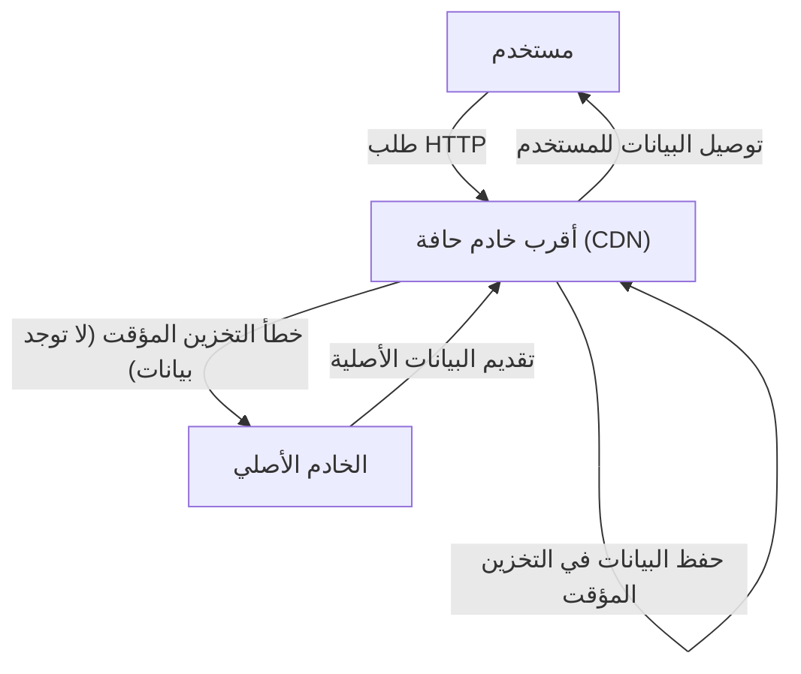
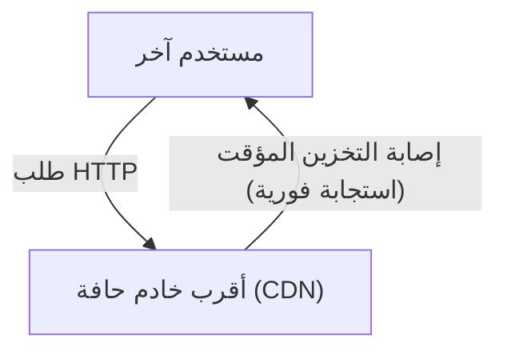

أثناء استخدامك للإنترنت، هل تساءلت يوماً: "كيف يمكن لموقع إلكتروني أجنبي أن يعرض الصور في لحظة؟" أو هل تعرف السبب الذي يجعل الخوادم تتحمل ولا تتعطل بالرغم من إطلاق تحديثات ضخمة للألعاب في جميع أنحاء العالم في نفس الوقت؟

يوجد وراء ذلك بنية تحتية قوية تُعرف باسم **شبكة توصيل المحتوى (CDN)**. في هذه المقالة، سنشرح بالتفصيل كيفية عمل شبكات CDN التي أصبحت لا غنى عنها في الإنترنت الحديث، والتقنيات الأساسية التي تدعمها (التخزين المؤقت، خوادم الحافة، وتوجيه Anycast). هذا الشرح التقني موجه ليس فقط لمهندسي البنية التحتية ومطوري الويب، بل لكل شخص مهتم بما يجري خلف كواليس الإنترنت.

## 1. ما هي الـ CDN؟ ولماذا نحتاجها؟

شبكة توصيل المحتوى (CDN) هي شبكة من الخوادم الموزعة جغرافياً، تهدف إلى توصيل محتوى الويب للمستخدمين بسرعة وكفاءة.

عادةً، يتم تخزين بيانات مواقع الويب (مثل ملفات HTML، الصور، مقاطع الفيديو، جافا سكريبت، وغيرها) في خادم رئيسي يُعرف باسم "الخادم الأصلي" (Origin Server). ومع ذلك، إذا قام جميع المستخدمين من حول العالم بالوصول إلى خادم أصلي واحد، فستحدث مشاكل خطيرة مثل:

*   **التأخير بسبب المسافة الفعلية (Latency):** تنتقل البيانات بسرعة الضوء عبر الألياف البصرية، ولكن لا يزال الاتصال بالجانب الآخر من الكوكب يستغرق وقتاً. على سبيل المثال، عندما يصل مستخدم في طوكيو إلى خادم في نيويورك، قد يحدث تأخير لمئات الأجزاء من الثانية فقط لإنشاء مصافحة TCP أو اتصال TLS.
*   **حمل زائد على الخادم:** عندما تتركز الطلبات في مكان واحد، قد تتجاوز قدرة الخادم الأصلي على المعالجة من حيث وحدة المعالجة المركزية (CPU) والذاكرة وعرض النطاق الترددي للشبكة، مما قد يؤدي إلى بطء الموقع أو تعطله.
*   **ازدحام الشبكة:** قد تزدحم مسارات الإنترنت الوسيطة (مثل أجهزة التوجيه والكابلات البحرية)، مما يتسبب في فقدان الحزم (Packet Loss) وانخفاض سرعة الاتصال.

نشأت شبكات CDN للتغلب على هذه القيود المادية والشبكية ولتحقيق "سرعة الوصول من أي مكان في العالم".

## 2. ثلاث تقنيات أساسية تدعم الـ CDN

لكي تقوم الـ CDN بتوصيل المحتوى بسرعة في جميع أنحاء العالم، تلعب ثلاث تقنيات رئيسية دوراً مهماً: "خوادم الحافة"، و"التخزين المؤقت"، و"توجيه Anycast". دعونا نلقي نظرة تفصيلية على كيفية عمل كل منها.

### 2.1 خوادم الحافة (Edge Servers) ونقاط التواجد (PoP)

خوادم الحافة، كما يوحي اسمها، هي خوادم توضع في أقرب موقع للمستخدم ("الحافة" تعني حدود الشبكة).
يقوم مزودو شبكات CDN (مثل Cloudflare و Akamai و Fastly و AWS CloudFront) بنشر الآلاف إلى عشرات الآلاف من خوادم الحافة في نقاط تبادل الإنترنت الرئيسية (IX) ومراكز البيانات حول العالم. تُعرف هذه المواقع باسم **نقاط التواجد (PoP)**.

عندما يصل مستخدم إلى موقع ويب، فإن الخادم الذي يستجيب هو خادم الحافة الموجود في أقرب نقطة تواجد مادية، وليس الخادم الأصلي البعيد. يقلل هذا من عدد أجهزة التوجيه التي تمر عبرها البيانات (عدد القفزات أو Hops)، مما يحسن بشكل جذري التأخير (Latency) الناتج عن المسافة المادية.

### 2.2 التخزين المؤقت (Caching) والتفريغ (Purge)

الدور الأكثر أهمية لخوادم الحافة هو الاحتفاظ بنسخة من محتوى الخادم الأصلي. تُعرف هذه العملية باسم **التخزين المؤقت** (Caching).

التدفق العام عند تلقي طلب من المستخدم يكون على النحو التالي:

عندما يقوم مستخدم آخر بالوصول إلى نفس البيانات في المرة القادمة، تتم معالجتها كما يلي:

بهذه الطريقة، يتم توصيل المحتوى الذي تم تخزينه مؤقتًا مرة واحدة في خادم الحافة مباشرة إلى المستخدم دون الحاجة إلى الاستعلام من الخادم الأصلي (إصابة التخزين المؤقت أو Cache Hit). هذا يقلل بشكل كبير من الحمل على الخادم الأصلي، ويسمح للمستخدم بتلقي المحتوى بشكل أسرع.

**التحكم في التخزين المؤقت (Cache-Control)**
لا تقوم شبكات CDN بتخزين جميع البيانات مؤقتًا بشكل عشوائي. بل تقرر ما يجب حفظه ومدة الاحتفاظ به (TTL: Time To Live) بناءً على تعليمات مثل `Cache-Control` في ترويسة HTTP. على سبيل المثال، يمكن التحكم بشكل دقيق بحيث يتم تخزين صورة الشعار مؤقتاً لمدة عام واحد، بينما يتم تخزين الصفحة الرئيسية للأخبار لمدة 5 دقائق فقط.

**التفريغ (Purge/Invalidation)**
إذا استمرت ذاكرة التخزين المؤقت القديمة بالبقاء، فسيتم عرض معلومات قديمة للمستخدمين. لذلك، توجد آلية تُسمى "التفريغ" لفرض حذف الذاكرة المؤقتة على الـ CDN عند تحديث البيانات على الخادم الأصلي. في شبكات CDN الحديثة، تم تطوير تقنيات لتفريغ ذاكرة التخزين المؤقت لخوادم الحافة حول العالم في غضون ثوانٍ.

### 2.3 توجيه Anycast (Anycast Routing)

على الرغم من أننا ذكرنا ببساطة "توجيه الوصول إلى أقرب خادم حافة"، إلا أن توجيه المستخدمين تلقائيًا إلى أقرب خادم على الإنترنت يتطلب تقنيات شبكية متقدمة. وهنا يأتي دور **Anycast**.

في اتصالات الإنترنت، يكون عنوان الـ IP عادة هو وجهة البيانات. في طريقة الاتصال الشائعة (Unicast)، يرتبط عنوان IP واحد بخادم واحد محدد في العالم.
ولكن باستخدام Anycast، يمكن **لعدة خوادم موزعة في جميع أنحاء العالم مشاركة نفس "عنوان IP بالضبط"**.

عندما يُرسل المستخدم حزمة بيانات إلى عنوان IP من نوع Anycast، تستخدم أجهزة التوجيه (Routers) على الإنترنت بروتوكول توجيه يسمى BGP (Border Gateway Protocol) لحساب المسار بشكل مستقل وموزع، وتسليم الحزمة إلى الخادم "الأقرب" من الناحية الشبكية (الأقل في عدد القفزات أو تكلفة الوصول).

*   يتم توجيه الاتصالات من المستخدمين في طوكيو تلقائيًا إلى نقطة التواجد (PoP) في طوكيو.
*   يتم توجيه الاتصالات من المستخدمين في لندن إلى نقطة التواجد في لندن، حتى لو كانت موجهة إلى نفس عنوان الـ IP.

إذا تعطلت نقطة التواجد في طوكيو بسبب انقطاع التيار الكهربائي أو فشل في الأجهزة، يتم تحديث معلومات مسار BGP تلقائيًا، ويتم إعادة توجيه الاتصال (Failover) فوراً إلى أقرب نقطة تواجد تالية، مثل أوساكا أو سيول. هذا يحقق توفراً عالياً ومذهلاً وقدرة قوية على تحمل الأخطاء.

## 3. تطور الـ CDN وفوائدها التي تتجاوز مجرد التوصيل

بناءً على ما سبق من آليات، دعونا نلخص الفوائد الملموسة لاعتماد الـ CDN والميزات المتقدمة التي توفرها شبكات CDN الحديثة.

### 3.1 تحسن هائل في الأداء
كما ذُكر سابقًا، يتم تقليل وقت تحميل الصفحة بشكل كبير بفضل التخزين المؤقت وخوادم الحافة. علاوة على ذلك، في شبكات CDN الحديثة، يتم تحسين اتصالات TCP وتنفيذ "تفريغ TLS" (TLS Offloading) عن طريق إنهاء مصافحة TLS/SSL على جانب خادم الحافة، مما يقلل حتى من الأعباء الإضافية للاتصالات المشفرة. إن تحسين الأداء لا يؤدي إلى تحسين تجربة المستخدم (UX) فحسب، بل يرتبط أيضاً بشكل مباشر بتحسين محركات البحث (SEO) وزيادة معدل التحويل (CVR).

### 3.2 التوصيل على نطاق واسع وتقليل تكاليف البنية التحتية
نظرًا لأن شبكة CDN تتحمل الجزء الأكبر من حركة المرور (حيث ليس من النادر أن تتجاوز النسبة 90٪)، يمكنك تقليل تكاليف النطاق الترددي للخادم الأصلي ورسوم نقل بيانات السحابة بشكل كبير. حتى إذا حدثت طفرة مفاجئة في الزيارات بسبب انتشار واسع أو تغطية تلفزيونية (ما يُعرف بـ "تأثير سلاش دوت" Slashdot effect)، فإن القدرة الهائلة لشبكة CDN الموزعة حول العالم ستستوعب حركة المرور، مما يمنع تعطل الموقع.

### 3.3 الخطوط الأمامية للأمان (الحماية من DDoS وجدار حماية تطبيقات الويب WAF)
تلعب شبكات CDN الحديثة أيضاً دوراً كأكبر "درع" في العالم. فحتى في حالة التعرض لهجوم حجب الخدمة الموزع الواسع النطاق (DDoS)، يعمل النطاق الترددي لشبكة CDN والذي يصل إلى مستوى التيرابت على امتصاص وتوزيع حركة المرور الهجومية، مما يحمي الخادم الأصلي ويبقيه سليماً.
بالإضافة إلى ذلك، من خلال تشغيل جدار حماية تطبيقات الويب (WAF) على خوادم الحافة، يمكن حظر الطلبات الضارة مثل حقن SQL (SQL Injection) والبرمجة عبر المواقع (XSS) عند حدود الشبكة قبل أن تصل إلى الخادم الأصلي.

### 3.4 صعود حوسبة الحافة (Edge Computing)
كان الدور الأساسي لشبكات CDN المبكرة هو "التخزين المؤقت للملفات الثابتة"، ولكن في السنوات الأخيرة، أصبحت **حوسبة الحافة (Edge Computing)**، والتي تتضمن تنفيذ البرامج مباشرة على خوادم الحافة، هي الاتجاه السائد.
باستخدام خدمات مثل Cloudflare Workers و AWS Lambda@Edge و Fastly Compute، يمكن للمطورين نشر وتشغيل أكواد مكتوبة بلغات مثل JavaScript و Rust و Go على خوادم الحافة حول العالم.
وقد مكّن هذا من تنفيذ العمليات الديناميكية التالية بالقرب من المستخدمين بزمن انتقال منخفض للغاية، دون الاعتماد على الخادم الأصلي:

*   اختبارات A/B وإعادة التوجيه بناءً على موقع المستخدم أو جهازه
*   المصادقة على الحافة مثل التحقق من رموز JWT
*   التحسين الديناميكي للصور مثل تغيير الحجم وتحويل التنسيقات (مثل التحويل التلقائي إلى WebP)

## 4. بث الفيديو (Streaming) والـ CDN

لا يمكن الحديث عن صعود خدمات بث الفيديو الضخمة مثل Netflix و YouTube و Amazon Prime Video دون الإشارة إلى شبكات CDN.
حيث أن بيانات الفيديو عالية الدقة ضخمة بشكل لا يقارن بصفحات الويب العادية. ولتوصيلها بكفاءة، يتم تقسيم ملفات الفيديو إلى "أجزاء" (Segments أو Chunks) صغيرة بمدة ثوانٍ قليلة عبر بروتوكولات مثل HLS أو MPEG-DASH.
من خلال تخزين أجزاء ملفات الفيديو هذه مؤقتًا على خوادم الحافة لشبكة CDN في جميع أنحاء العالم، يمكن تحقيق تجربة مشاهدة سلسة دون انقطاع حتى عندما يقوم الملايين من المستخدمين بتشغيل مقاطع فيديو بدقة 4K في وقت واحد. وفي بعض الحالات، توجد عمليات تكامل أوثق حيث يتم تضمين خوادم التخزين المؤقت المخصصة مباشرة داخل شبكات مزودي خدمة الإنترنت (ISP).

## 5. الخلاصة: البنية التحتية الخفية التي تدعم الإنترنت

تعتبر شبكات توصيل المحتوى (CDN) تقنية رائعة لتجاوز القيود المادية للمسافات الجغرافية من خلال قوة البرمجيات المتقدمة والبنية التحتية للشبكة.

من خلال الحفظ الموزع للمحتوى عبر **التخزين المؤقت**، ونقل البيانات إلى مكان قريب جداً من المستخدم عبر **خوادم الحافة**، واستنتاج المسار الأمثل بشكل مستقل وفوري عبر **توجيه Anycast**. من خلال التفاعل المعقد لهذه العناصر، يتحقق "الإنترنت السريع وغير المنقطع" الذي نتمتع به كل يوم كأمر مسلم به.

في تطوير خدمات الويب الحديثة، من الضروري فهم آليات CDN بشكل صحيح ودمجها بشكل مناسب من المراحل الأولى لتصميم البنية، من أجل تحقيق توازن عالي المستوى بين الأداء والموثوقية والأمان.
في المرة القادمة التي تفتح فيها متصفحك وتتصفح مواقع الويب من جميع أنحاء العالم في لحظة، خذ لحظة للتفكير في رحلة البيانات التي تدفقت عبر الألياف البصرية ووصلت إليك من أقرب خادم حافة.
