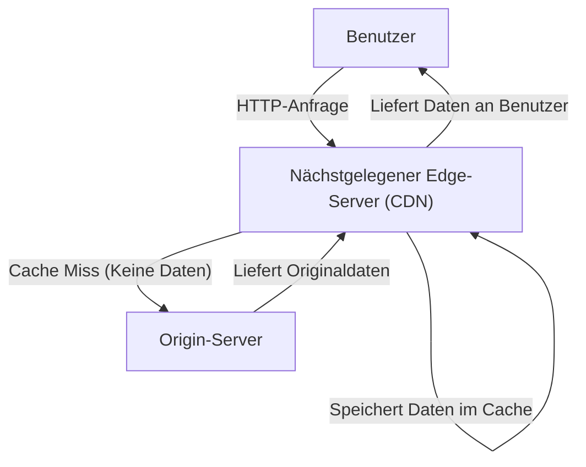
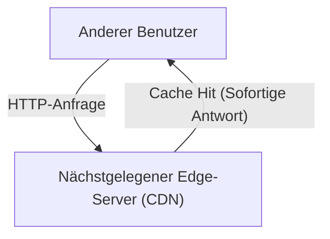

Haben Sie sich beim Surfen im Internet schon einmal gewundert, warum Bilder auf ausländischen Websites fast verzögerungsfrei geladen werden? Oder wissen Sie, warum Server nicht abstürzen, wenn umfangreiche Spiele-Updates gleichzeitig weltweit veröffentlicht werden?

Dahinter verbirgt sich eine leistungsstarke Infrastruktur, das **CDN (Content Delivery Network)**. In diesem Artikel erklären wir detailliert die Funktionsweise von CDNs, die aus dem modernen Internet nicht mehr wegzudenken sind, und die Kerntechnologien (Caching, Edge-Server, Anycast-Routing), die sie unterstützen. Dies ist eine technische Erklärung nicht nur für Infrastruktur-Ingenieure und Webentwickler, sondern für alle, die sich für die verborgenen Mechanismen des Internets interessieren.

## 1. Was ist ein CDN und warum brauchen wir es?

Ein CDN (Content Delivery Network) ist ein Netzwerk aus geografisch verteilten Servern, das entwickelt wurde, um Benutzern Webinhalte schnell und effizient bereitzustellen.

Normalerweise werden die Daten einer Website (HTML, Bilder, Videos, JavaScript usw.) auf einem primären Server gespeichert, der als "Origin-Server" (Ursprungsserver) bezeichnet wird. Wenn jedoch alle Benutzer weltweit auf einen einzigen Origin-Server zugreifen, treten die folgenden schwerwiegenden Probleme auf:

*   **Latenz durch physische Entfernung:** Daten reisen mit Lichtgeschwindigkeit durch Glasfaserkabel, aber die Kommunikation mit der anderen Seite der Welt braucht dennoch ihre Zeit. Wenn ein Benutzer in Tokio auf einen Server in New York zugreift, dauert allein der TCP-Handshake und der Aufbau der TLS-Verbindung Hunderte von Millisekunden.
*   **Serverüberlastung:** Wenn sich die Zugriffe an einem Ort konzentrieren, können die Verarbeitungsfähigkeiten von CPU, Speicher und Netzwerkbandbreite des Origin-Servers überschritten werden, was zu einer Verlangsamung der Website oder sogar zu einem Absturz führen kann.
*   **Netzwerküberlastung:** Das Internet-Routing auf dem Weg (Router und Unterseekabel) kann verstopfen, was zu Paketverlusten und verringerten Kommunikationsgeschwindigkeiten führt.

Um diese physischen und netzwerktechnischen Einschränkungen zu überwinden und ein "schnelles Erlebnis, egal von wo auf der Welt Sie zugreifen" zu realisieren, wurde das CDN erfunden.

## 2. Die 3 Kerntechnologien hinter CDNs

Damit ein CDN Inhalte weltweit mit hoher Geschwindigkeit ausliefern kann, spielen drei Haupttechnologien eine entscheidende Rolle: "Edge-Server", "Caching" und "Anycast-Routing". Lassen Sie uns jeden dieser Mechanismen genauer betrachten.

### 2.1 Edge-Server und PoPs

Edge-Server sind, wie der Name schon sagt, Server, die an dem Ort platziert sind, der dem Benutzer "am nächsten" ist (Edge = Rand des Netzwerks).
CDN-Anbieter (wie Cloudflare, Akamai, Fastly, AWS CloudFront usw.) platzieren Tausende bis Zehntausende von Edge-Servern in großen Internet-Austauschknoten (IX: Internet Exchange) und Rechenzentren auf der ganzen Welt. Diese Standorte werden **PoP (Point of Presence)** genannt.

Wenn ein Benutzer auf eine Website zugreift, antwortet nicht der weit entfernte Origin-Server, sondern der Edge-Server am physisch nächstgelegenen PoP. Dies reduziert die Anzahl der Router (Hops), die die Daten durchlaufen müssen, und verbessert die durch die physische Entfernung verursachte Verzögerung (Latenz) drastisch.

### 2.2 Caching und Purge

Die wichtigste Aufgabe von Edge-Servern besteht darin, Kopien der Inhalte des Origin-Servers zu speichern. Dieser Mechanismus wird als **Caching** bezeichnet.

Der allgemeine Ablauf bei einer Anfrage eines Benutzers sieht wie folgt aus:

Wenn anschließend ein anderer Benutzer auf dieselben Daten zugreift, erfolgt die Verarbeitung so:

Auf diese Weise werden Inhalte, sobald sie auf einem Edge-Server zwischengespeichert wurden, direkt an Benutzer ausgeliefert, ohne den Origin-Server abzufragen (Cache Hit). Dadurch wird die Belastung des Origin-Servers erheblich reduziert und die Benutzer erhalten die Inhalte viel schneller.

**Cache-Steuerung (Cache-Control)**
CDNs speichern nicht wahllos alle Daten zwischen. Sie folgen Anweisungen wie dem `Cache-Control` HTTP-Header, um zu bestimmen, was wie lange gespeichert werden soll (TTL: Time To Live). So ist es beispielsweise möglich, feinkörnige Regeln festzulegen, wie etwa das Caching eines Logo-Bildes für ein Jahr, aber die Startseite von Nachrichten nur für 5 Minuten.

**Purge (Löschen/Invalidierung)**
Wenn alte Caches bestehen bleiben, wird den Benutzern veraltete Informationen angezeigt. Daher gibt es einen Mechanismus namens "Purge", um den Cache im CDN gewaltsam zu löschen, wenn Daten auf dem Origin-Server aktualisiert werden. Bei modernen CDNs ist die Technologie so weit ausgereift, dass Caches auf Edge-Servern weltweit innerhalb weniger Sekunden bereinigt werden können.

### 2.3 Anycast-Routing

Wir haben vereinfacht gesagt, dass Benutzer "zum nächstgelegenen Edge-Server geleitet" werden, aber um Benutzer im Internet automatisch zum optimalen Server zu leiten, bedarf es fortschrittlicher Netzwerktechnologie. Hier kommt **Anycast** ins Spiel.

Bei der Internetkommunikation dient normalerweise eine "IP-Adresse" als Zielort für Daten. Bei der standardmäßigen Kommunikationsmethode (Unicast) ist eine IP-Adresse an einen bestimmten, einzigen Server auf der Welt gebunden.
Mit Anycast können jedoch **mehrere weltweit verteilte Server exakt dieselbe IP-Adresse teilen**.

Wenn ein Benutzer ein Paket an eine Anycast-IP-Adresse sendet, berechnen die Router im Internet selbstständig den Routing-Pfad mithilfe eines Protokolls namens BGP (Border Gateway Protocol) und leiten das Paket an den Server weiter, der im Netzwerk "am nächsten" liegt (mit der geringsten Anzahl von Hops oder Routing-Kosten).

*   Kommunikation von einem Benutzer in Tokio wird automatisch an den PoP in Tokio weitergeleitet.
*   Kommunikation von einem Benutzer in London wird, obwohl sie an dieselbe IP-Adresse gerichtet ist, an den PoP in London weitergeleitet.

Sollte der PoP in Tokio aufgrund eines Stromausfalls oder eines Hardwarefehlers ausfallen, werden die BGP-Routing-Informationen automatisch aktualisiert, und der Datenverkehr wird sofort zum nächstgelegenen PoP, beispielsweise in Osaka oder Seoul, umgeleitet (Failover). Auf diese Weise wird eine erstaunliche Hochverfügbarkeit und Fehlertoleranz erreicht.

## 3. Die Evolution von CDNs und Vorteile jenseits der bloßen Bereitstellung

Lassen Sie uns zusammenfassen, welche konkreten Vorteile die Einführung eines CDNs bietet und welche fortschrittlichen Funktionen moderne CDNs basierend auf den bisherigen Mechanismen bereitstellen.

### 3.1 Massive Leistungssteigerung
Wie bereits erwähnt, verkürzen Caching und Edge-Server die Ladezeiten von Seiten drastisch. Darüber hinaus reduzieren die neuesten CDNs sogar den Overhead der verschlüsselten Kommunikation, indem sie TCP-Verbindungen optimieren und einen "TLS Offload" durchführen, bei dem der TLS/SSL-Handshake auf der Seite des Edge-Servers abgeschlossen wird. Eine verbesserte Leistung führt nicht nur zu einer besseren User Experience (UX), sondern wirkt sich auch direkt auf die Suchmaschinenoptimierung (SEO) und die Konversionsraten (CVR) aus.

### 3.2 Großflächige Auslieferung und Reduzierung der Infrastrukturkosten
Da das CDN den Großteil des Traffics (nicht selten über 90 %) übernimmt, können die Bandbreitenkosten des Origin-Servers und die Datenübertragungsgebühren der Cloud erheblich gesenkt werden. Selbst bei plötzlichen Traffic-Spitzen (dem sogenannten "Slashdot-Effekt"), beispielsweise wenn ein Beitrag viral geht oder im Fernsehen vorgestellt wird, fängt die enorme Kapazität des weltweit verteilten CDNs den Traffic ab, sodass die Website nicht offline geht.

### 3.3 Die vorderste Linie der Sicherheit (DDoS-Schutz und WAF)
Moderne CDNs fungieren auch als die weltweit größten "Schutzschilde". Selbst im Falle eines massiven DDoS-Angriffs (Distributed Denial of Service) absorbiert und verteilt das CDN mit seiner Terabit-Bandbreite den Angriffsverkehr und hält den Origin-Server unbeschadet.
Darüber hinaus ermöglicht der Betrieb einer WAF (Web Application Firewall) auf Edge-Servern das Blockieren von bösartigen Anfragen wie SQL-Injection oder Cross-Site-Scripting (XSS) an der Netzwerkgrenze, noch bevor sie den Origin-Server erreichen.

### 3.4 Der Aufstieg des Edge Computing
Während die Hauptrolle früher CDNs im "Caching statischer Dateien" lag, setzt sich in den letzten Jahren **Edge Computing** durch, bei dem Programme direkt auf Edge-Servern ausgeführt werden.
Mit Diensten wie Cloudflare Workers, AWS Lambda@Edge und Fastly Compute können Entwickler Code in Sprachen wie JavaScript, Rust oder Go auf Edge-Servern weltweit bereitstellen und ausführen.
Dies ermöglicht es, dynamische Verarbeitungen nicht mehr vom Origin-Server abhängig zu machen, sondern sie mit extrem geringer Latenz direkt beim Benutzer auszuführen:

*   A/B-Tests oder Weiterleitungen basierend auf Region oder Gerät des Benutzers
*   Edge-Authentifizierung, wie z.B. die Validierung von JWT-Tokens
*   Dynamische Optimierung, wie Größenänderung von Bildern oder Formatkonvertierung (z.B. automatische Konvertierung nach WebP)

## 4. Video-Streaming und CDN

Der Aufstieg riesiger Video-Streaming-Dienste wie Netflix, YouTube und Amazon Prime Video lässt sich nicht ohne CDNs erklären.
Hochauflösende Videodaten sind unvergleichlich größer als normale Webseiten. Um diese effizient bereitzustellen, werden Videodateien durch Protokolle wie HLS oder MPEG-DASH in kleine "Segmente" (Chunks) von wenigen Sekunden unterteilt.
Indem das CDN diese geteilten Videosegmente auf weltweiten Edge-Servern zwischenspeichert, wird Millionen von Benutzern gleichzeitig ein flüssiges und unterbrechungsfreies Wiedergabeerlebnis von 4K-Videos geboten. In manchen Fällen gibt es sogar noch engere Integrationen, bei denen dedizierte Cache-Server direkt in die Netzwerke der ISPs (Internet Service Provider) eingebettet werden.

## 5. Fazit: Die unsichtbare Infrastruktur, die das Internet stützt

Das CDN (Content Delivery Network) ist eine großartige Technologie, die die physischen Beschränkungen der geografischen Entfernung mit Hilfe fortschrittlicher Software und Netzwerkinfrastruktur überwindet.

**Caching** speichert Inhalte dezentral, **Edge-Server** bringen Daten näher an den Benutzer und **Anycast-Routing** findet autonom und verzögerungsfrei den optimalen Weg. Das komplexe Zusammenspiel dieser Elemente macht das "schnelle und ununterbrochene Internet" möglich, das wir heute als selbstverständlich betrachten.

Bei der Entwicklung moderner Webdienste ist es unerlässlich, die Mechanismen von CDNs genau zu verstehen und sie von Anfang an in das Architekturdesign zu integrieren, um ein hohes Maß an Leistung, Zuverlässigkeit und Sicherheit in Einklang zu bringen.
Wenn Sie das nächste Mal Ihren Browser öffnen und Webseiten aus der ganzen Welt in Sekundenbruchteilen aufrufen, denken Sie einen Moment an die Reise der Daten, die durch Glasfaserkabel sausen und von Ihrem nächstgelegenen Edge-Server zu Ihnen geliefert werden.
