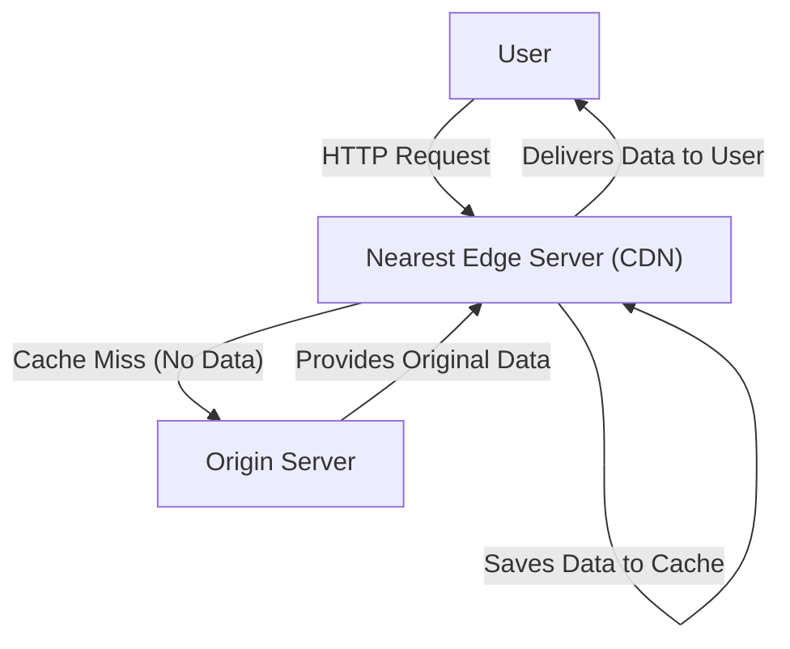
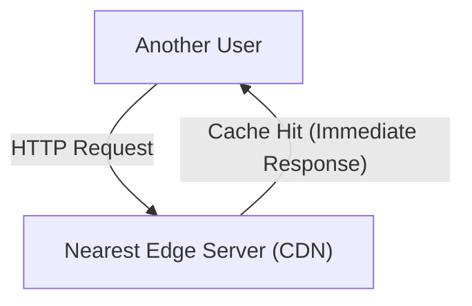

Have you ever wondered why images from overseas websites appear in an instant when using the internet? Or do you know how massive game updates are delivered globally at the same time without crashing the servers?

Behind this lies a powerful infrastructure known as a **CDN (Content Delivery Network)**. In this article, we will explain in detail the mechanisms of CDNs, which have become indispensable in the modern internet, along with their underlying core technologies (caching, edge servers, and Anycast routing). This is a technical overview aimed not only at infrastructure engineers and web developers, but anyone curious about what happens behind the scenes of the internet.

## 1. What is a CDN? Why is it Necessary?

A CDN (Content Delivery Network) is a geographically distributed network of servers designed to deliver web content to users quickly and efficiently.

Normally, website data (HTML, images, videos, JavaScript, etc.) is stored on a master server known as an "origin server." However, if all users around the world access a single origin server, serious issues like the following can occur:

*   **Latency Due to Physical Distance:** While data travels through fiber optic cables at the speed of light, communicating with the other side of the planet still takes time. When a user in Tokyo accesses a server in New York, just establishing a TCP handshake and TLS connection can incur hundreds of milliseconds of latency.
*   **Server Overload:** When traffic is concentrated in one location, it can exceed the processing capacity of the origin server's CPU, memory, and network bandwidth, potentially causing the site to slow down or crash.
*   **Network Congestion:** Internet routes (routers and submarine cables) along the way can become congested, leading to packet loss and decreased communication speeds.

CDNs were created to overcome these physical and network constraints and achieve "fast access from anywhere in the world."

## 2. Three Core Technologies Behind CDNs

For a CDN to deliver content globally at high speed, three technologies play a crucial role: "edge servers," "caching," and "Anycast routing." Let's look at how each of these works in detail.

### 2.1 Edge Servers and PoPs

Edge servers are exactly what they sound like—servers placed at the "edge" (the boundary of the network) closest to the user.
CDN providers (like Cloudflare, Akamai, Fastly, and AWS CloudFront) deploy thousands to tens of thousands of edge servers in major Internet Exchanges (IX) and data centers worldwide. These locations are called **PoPs (Points of Presence)**.

When a user accesses a website, they don't connect to a distant origin server; instead, the edge server at the physically closest PoP responds. This reduces the number of routers the data must pass through (hop count), drastically improving latency caused by physical distance.

### 2.2 Caching and Purging

The most critical role of an edge server is to store copies of the origin server's content. This mechanism is called **caching**.

The general flow when a user makes a request is as follows:

When another user accesses the same data, it is processed like this:

In this way, once content is cached on an edge server, it is delivered directly to the user without querying the origin server (a cache hit). This significantly reduces the load on the origin server and allows users to receive content much faster.

**Cache Control (Cache-Control)**
CDNs do not indiscriminately cache all data. They determine what to store and for how long (TTL: Time To Live) based on instructions like the `Cache-Control` HTTP header. For example, fine-grained control is possible—a logo image might be cached for a year, while a news homepage is cached for only five minutes.

**Purging (Purge/Invalidation)**
If stale caches persist, users will see outdated information. Therefore, a mechanism called "purging" exists to forcefully delete caches on the CDN when data is updated on the origin server. Modern CDNs have established technologies that can purge caches on edge servers worldwide within seconds.

### 2.3 Anycast Routing

We've simply said "directing users to the nearest edge server," but automatically routing users to the closest server over the internet requires advanced networking technology. This is where **Anycast** comes in.

In internet communication, an "IP address" is typically the destination for data. In standard communication (Unicast), one IP address is bound to a single, specific server in the world.
However, with Anycast, **multiple servers distributed globally can share the "exact same IP address."**

When a user sends packets to an Anycast IP address, internet routers use a routing protocol called BGP (Border Gateway Protocol) to autonomously calculate the route, delivering the packets to the server that is "closest" in terms of the network (lowest hop count or reachability cost).

*   Traffic from a user in Tokyo is automatically routed to the Tokyo PoP.
*   Traffic from a user in London, even though destined for the same IP address, is routed to the London PoP.

If the Tokyo PoP goes down due to a power outage or hardware failure, BGP routing information is automatically updated, and traffic is instantly rerouted (failed over) to the next closest PoP, such as Osaka or Seoul. This achieves incredible high availability and fault tolerance.

## 3. The Evolution and Benefits of CDNs Beyond Simple Delivery

Based on the mechanisms discussed so far, let's summarize the concrete benefits of adopting a CDN and the advanced features modern CDNs offer.

### 3.1 Overwhelming Performance Improvements
As mentioned, caching and edge servers dramatically reduce page load times. Furthermore, modern CDNs even reduce the overhead of encrypted communication by optimizing TCP connections and performing "TLS Offloading" (terminating TLS/SSL handshakes at the edge server). Performance improvements directly translate not only to a better User Experience (UX) but also to enhanced Search Engine Optimization (SEO) and higher Conversion Rates (CVR).

### 3.2 Massive Delivery and Infrastructure Cost Reduction
Since CDNs shoulder the vast majority of traffic (often over 90%), bandwidth costs for origin servers and cloud data transfer fees can be drastically reduced. Even during sudden spikes in traffic (the so-called "Slashdot effect")—like when a site goes viral or is featured on TV—the massive distributed capacity of the CDN absorbs the traffic, ensuring the site doesn't crash.

### 3.3 At the Forefront of Security (DDoS Protection and WAF)
Modern CDNs also serve as the world's largest "shields." Even in the face of massive DDoS (Distributed Denial of Service) attacks, a CDN's terabit-scale bandwidth can absorb and distribute the attack traffic, keeping the origin server completely unscathed.
Additionally, running a WAF (Web Application Firewall) on edge servers makes it possible to block malicious requests, such as SQL injections or Cross-Site Scripting (XSS), at the network boundary before they ever reach the origin server.

### 3.4 The Rise of Edge Computing
Early CDNs primarily focused on "caching static files," but in recent years, **Edge Computing**—running programs directly on edge servers—has become mainstream.
By using services like Cloudflare Workers, AWS Lambda@Edge, or Fastly Compute, developers can deploy and execute code (in JavaScript, Rust, Go, etc.) on edge servers worldwide.
This allows dynamic processes to be executed with ultra-low latency right next to the user, without relying on the origin server. Examples include:

*   A/B testing and redirects based on user region or device
*   Edge authentication, such as verifying JWT tokens
*   Dynamic optimization, like image resizing and format conversion (e.g., automatic conversion to WebP)

## 4. Video Streaming and CDNs

The rise of giant video streaming services like Netflix, YouTube, and Amazon Prime Video cannot be discussed without mentioning CDNs.
High-quality video data is enormous compared to regular web pages. To deliver this efficiently, video files are split into small "segments" (or chunks) lasting a few seconds, using protocols like HLS or MPEG-DASH.
By caching these fragmented video pieces on edge servers worldwide, CDNs enable millions of users to stream 4K video simultaneously without buffering, ensuring a smooth viewing experience. In some cases, there is even tighter integration, such as embedding dedicated cache servers directly within the networks of ISPs (Internet Service Providers).

## 5. Conclusion: The Invisible Infrastructure Supporting the Internet

A CDN (Content Delivery Network) is a brilliant technology that overcomes the physical constraint of geographical distance through the power of advanced software and network infrastructure.

**Caching** stores content across multiple locations, **edge servers** bring data right to the user's doorstep, and **Anycast routing** autonomously and instantly finds the optimal path. The complex interplay of these elements makes the "fast and uninterrupted internet" we take for granted every day a reality.

In modern web service development, correctly understanding CDN mechanisms and integrating them appropriately from the early stages of architecture design is essential to balancing performance, reliability, and security at a high level.
The next time you open a browser and instantly view a website from across the globe, take a moment to think about the journey that data made—racing through fiber optic cables, delivered straight from the nearest edge server.
