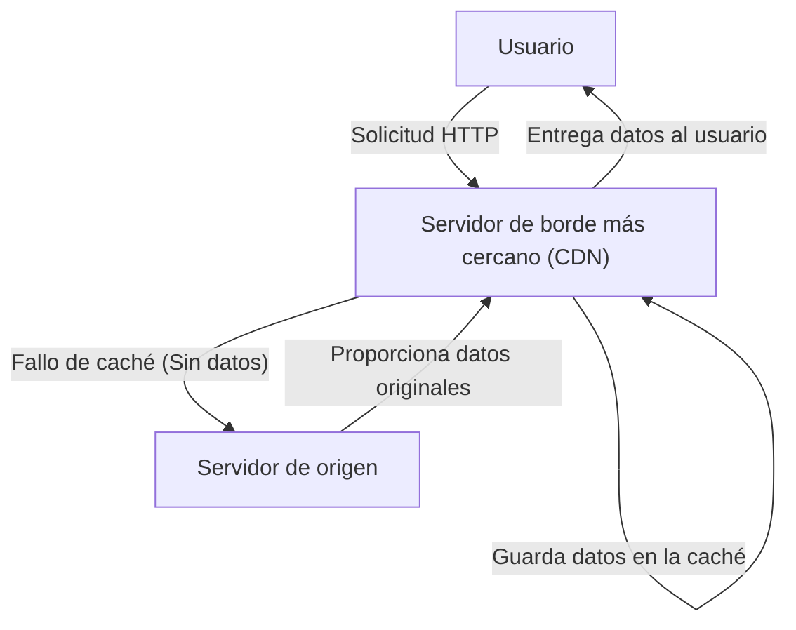
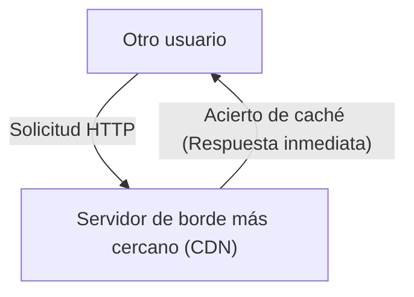

¿Alguna vez te has preguntado mientras navegas por internet, "¿Cómo es que las imágenes de un sitio web en el extranjero se cargan al instante?" O, ¿sabes por qué los servidores no se caen a pesar de que las actualizaciones de juegos masivos se distribuyen globalmente y de forma simultánea?

Detrás de esto existe una poderosa infraestructura llamada **CDN (Content Delivery Network, o Red de Entrega de Contenido)**. En este artículo, explicaremos detalladamente cómo funciona un CDN, el cual se ha vuelto indispensable en el internet moderno, y las tecnologías centrales que lo sustentan (almacenamiento en caché, servidores de borde y enrutamiento Anycast). Esta es una explicación técnica dirigida no solo a ingenieros de infraestructura y desarrolladores web, sino a cualquier persona interesada en el detrás de escena de internet.

## 1. ¿Qué es un CDN? ¿Por qué es necesario?

Un CDN (Red de Entrega de Contenido) es una red de servidores distribuidos geográficamente y diseñados para entregar contenido web a los usuarios de manera rápida y eficiente.

Normalmente, los datos de un sitio web (HTML, imágenes, videos, JavaScript, etc.) se almacenan en un servidor principal llamado "servidor de origen". Sin embargo, si todos los usuarios del mundo acceden a un único servidor de origen, se producen problemas graves como los siguientes:

*   **Retraso (latencia) debido a la distancia física:** Los datos viajan a la velocidad de la luz a través de cables de fibra óptica, pero aun así, toma tiempo comunicarse con el otro lado del mundo. Si un usuario en Tokio accede a un servidor en Nueva York, se produce un retraso de cientos de milisegundos solo para establecer el protocolo de enlace TCP o la conexión TLS.
*   **Sobrecarga del servidor:** Si el acceso se concentra en un solo lugar, puede exceder la capacidad de procesamiento de la CPU, la memoria o el ancho de banda de la red del servidor de origen, lo que puede provocar que el sitio se vuelva lento o se caiga.
*   **Congestión de la red:** Las rutas de internet intermedias (enrutadores y cables submarinos) se congestionan, provocando pérdida de paquetes y disminución de la velocidad de comunicación.

Para superar estas limitaciones físicas y de red, y lograr un internet "rápido sin importar desde dónde accedas en el mundo", nació el CDN.

## 2. Tres tecnologías centrales que sustentan un CDN

Para que un CDN entregue contenido a alta velocidad en todo el mundo, tres tecnologías desempeñan un papel crucial: "Servidores de borde", "Almacenamiento en caché" y "Enrutamiento Anycast". Veamos en detalle cómo funciona cada una.

### 2.1 Servidores de Borde (Edge Servers) y PoP

Los servidores de borde, como su nombre indica, son servidores ubicados "lo más cerca posible" de los usuarios (borde = límite de la red).
Los proveedores de CDN (Cloudflare, Akamai, Fastly, AWS CloudFront, etc.) instalan desde miles hasta decenas de miles de servidores de borde en los principales puntos de intercambio de internet (IX: Internet Exchange) y centros de datos en todo el mundo. Estas ubicaciones se denominan **PoP (Point of Presence, o Puntos de Presencia)**.

Cuando un usuario accede a un sitio web, no responde el servidor de origen remoto, sino el servidor de borde en el PoP más cercano físicamente. Esto reduce la cantidad de enrutadores (saltos) por los que pasan los datos, mejorando drásticamente el retraso (latencia) causado por la distancia física.

### 2.2 Almacenamiento en caché (Caching) y Purga

El papel más importante de un servidor de borde es guardar una copia del contenido del servidor de origen. A este mecanismo se le llama **caché**.

El flujo general cuando hay una solicitud de un usuario es el siguiente:

Luego, si otro usuario accede a los mismos datos, se procesa de la siguiente manera:

De esta manera, una vez que el contenido se almacena en caché en el servidor de borde, se entrega directamente al usuario sin consultar al servidor de origen (acierto de caché). Esto reduce significativamente la carga en el servidor de origen y permite a los usuarios recibir el contenido mucho más rápido.

**Control de caché (Cache-Control)**
Un CDN no almacena en caché todos los datos de forma indiscriminada. Decide qué almacenar y durante cuánto tiempo (TTL: Time To Live) siguiendo las instrucciones en los encabezados HTTP, como `Cache-Control`. Por ejemplo, es posible un control detallado como almacenar la imagen del logotipo durante un año y almacenar la página de inicio de noticias por solo 5 minutos.

**Purga (Purge/Invalidation)**
Si el caché antiguo permanece, se mostrará información desactualizada al usuario. Por ello, existe un mecanismo llamado "purga" para eliminar a la fuerza el caché en el CDN cuando se actualizan los datos en el servidor de origen. Los CDN modernos han establecido tecnología para purgar cachés en servidores de borde en todo el mundo en cuestión de segundos.

### 2.3 Enrutamiento Anycast (Anycast Routing)

Hemos mencionado simplemente "hacer que accedan al servidor de borde más cercano", pero dirigir automáticamente a los usuarios al servidor más cercano en internet requiere tecnología de red avanzada. Aquí es donde se utiliza **Anycast**.

En la comunicación por internet, la "dirección IP" suele ser el destino de los datos. En un método de comunicación general (Unicast), una dirección IP está vinculada a un servidor específico en el mundo.
Sin embargo, al usar Anycast, **múltiples servidores distribuidos por todo el mundo pueden compartir "exactamente la misma dirección IP"**.

Cuando un usuario envía un paquete a una dirección IP Anycast, los enrutadores en internet utilizan un protocolo de enrutamiento llamado BGP (Border Gateway Protocol) para calcular la ruta de forma autónoma y distribuida, y envían el paquete al servidor "más cercano" (con menos saltos o costo de acceso) en términos de red.

*   Las comunicaciones de un usuario en Tokio se enrutan automáticamente al PoP en Tokio.
*   Las comunicaciones de un usuario en Londres, incluso si van a la misma dirección IP, se enrutan al PoP en Londres.

Si el PoP de Tokio se cae debido a un corte de energía o una falla de hardware, la información de enrutamiento BGP se actualiza automáticamente y la comunicación se desvía instantáneamente (conmutación por error) al siguiente PoP más cercano, como Osaka o Seúl. Esto logra una disponibilidad asombrosa y tolerancia a fallos.

## 3. La evolución y los beneficios del CDN más allá de la simple entrega

Basándonos en lo anterior, resumamos los beneficios específicos obtenidos al implementar un CDN y las funciones avanzadas que ofrecen los CDN modernos.

### 3.1 Mejora de rendimiento abrumadora
Como se mencionó, los tiempos de carga de la página se reducen drásticamente debido a las cachés y los servidores de borde. Además, los CDN más recientes optimizan las conexiones TCP y realizan "descarga TLS", que finaliza los protocolos de enlace TLS/SSL en el servidor de borde, reduciendo incluso la sobrecarga de la comunicación cifrada. Las mejoras de rendimiento conducen no solo a una mejor experiencia de usuario (UX), sino también a un mejor SEO (Optimización de Motores de Búsqueda) y tasa de conversión (CVR).

### 3.2 Distribución a gran escala y reducción de costos de infraestructura
Como el CDN asume gran parte del tráfico (no es raro que sea más del 90%), los costos de ancho de banda del servidor de origen y las tarifas de transferencia de datos en la nube pueden reducirse significativamente. Incluso si hay un pico repentino de accesos por volverse viral o aparecer en televisión (el llamado "Efecto Slashdot"), el sitio no se caerá porque la inmensa capacidad del CDN distribuida globalmente absorbe el tráfico.

### 3.3 A la vanguardia de la seguridad (Mitigación de DDoS y WAF)
Los CDN modernos también actúan como los "escudos" más grandes del mundo. Incluso cuando son atacados por DDoS (Ataques de Denegación de Servicio Distribuido) a gran escala, absorben y distribuyen el tráfico malicioso utilizando su ancho de banda de nivel de terabits, protegiendo al servidor de origen intacto.
Además, al operar un WAF (Web Application Firewall) en el servidor de borde, las solicitudes maliciosas como la inyección SQL o Cross-Site Scripting (XSS) pueden bloquearse en el límite de la red antes de que lleguen al servidor de origen.

### 3.4 El auge de la Computación en el Borde (Edge Computing)
Los primeros CDN se encargaban principalmente de "almacenar en caché archivos estáticos", pero en los últimos años, la **Computación en el Borde (Edge Computing)**, que ejecuta programas directamente en los servidores de borde, se está convirtiendo en la norma.
Utilizando herramientas como Cloudflare Workers, AWS Lambda@Edge o Fastly Compute, los desarrolladores pueden implementar y ejecutar código (en JavaScript, Rust, Go, etc.) en servidores de borde de todo el mundo.
Esto permite que procesos dinámicos se ejecuten con una latencia ultrabaja cerca de los usuarios sin depender del servidor de origen, como:

*   Pruebas A/B o redirecciones según la región del usuario o el dispositivo
*   Autenticación en el borde, como la verificación de tokens JWT
*   Optimización dinámica como cambio de tamaño de imagen o conversión de formato (como la conversión automática a WebP)

## 4. Entrega de video (Streaming) y CDN

El surgimiento de servicios de transmisión de video gigantes como Netflix, YouTube y Amazon Prime Video no se puede explicar sin los CDN.
Los datos de video de alta calidad son incomparablemente enormes en comparación con las páginas web normales. Para entregarlos de manera eficiente, los archivos de video se dividen en pequeños "segmentos (chunks)" de unos pocos segundos utilizando protocolos como HLS o MPEG-DASH.
El CDN almacena en caché estas partes divididas de archivos de video en servidores de borde de todo el mundo, proporcionando una experiencia de visualización fluida e ininterrumpida incluso cuando millones de usuarios reproducen videos 4K simultáneamente. En algunos casos, se forman integraciones más estrechas al integrar directamente servidores de caché dedicados dentro de la red del ISP (Proveedor de Servicios de Internet).

## 5. Conclusión: La infraestructura invisible que sostiene internet

Un CDN (Red de Entrega de Contenido) es una tecnología maravillosa que supera la restricción física de la distancia mediante el poder de software e infraestructura de red avanzados.

El **almacenamiento en caché** guarda y distribuye el contenido de forma distribuida, los **servidores de borde** llevan los datos lo más cerca posible de los usuarios, y el **enrutamiento Anycast** guía de manera autónoma e instantánea la ruta óptima. Cuando estas complejas piezas interactúan, hacen posible el "internet rápido e ininterrumpido" del que disfrutamos todos los días.

En el desarrollo de servicios web modernos, para lograr un alto nivel de rendimiento, confiabilidad y seguridad simultáneamente, es esencial comprender cómo funcionan los CDN e integrarlos adecuadamente desde las primeras etapas del diseño arquitectónico.
La próxima vez que abras un navegador y veas un sitio web al instante, piensa un poco en el viaje de esos datos recorriendo cables de fibra óptica y siendo entregados desde tu servidor de borde más cercano.
