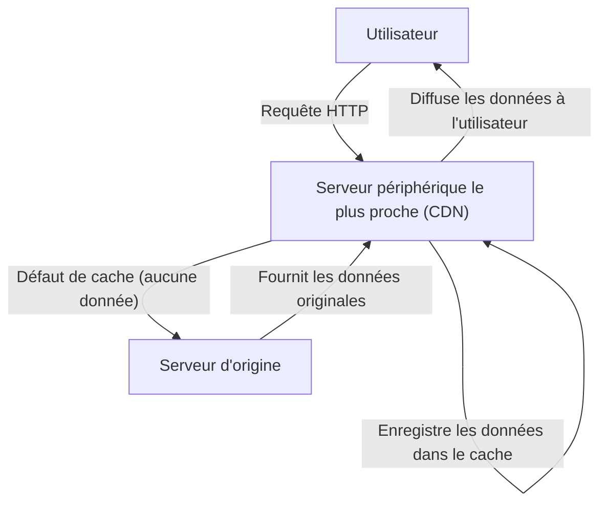
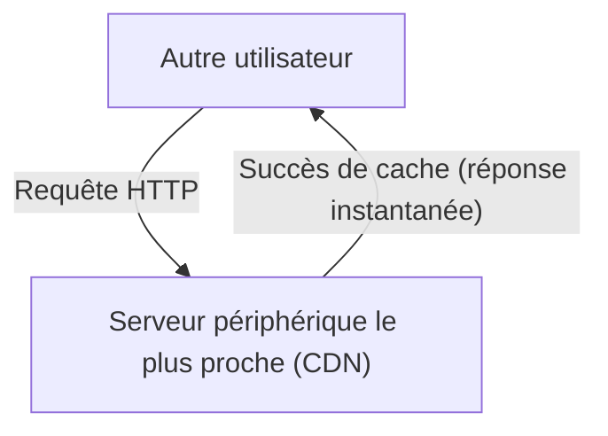

Avez-vous déjà navigué sur Internet et vous êtes-vous demandé : « Comment ce site web étranger affiche-t-il ses images instantanément ? » Ou savez-vous pourquoi les serveurs ne tombent pas en panne lorsqu'une mise à jour de jeu massif est déployée simultanément dans le monde entier ?

Derrière tout cela se cache une infrastructure puissante appelée **CDN (Content Delivery Network - Réseau de diffusion de contenu)**. Dans cet article, nous expliquerons en détail le fonctionnement des CDN, devenus indispensables dans l'Internet moderne, ainsi que les technologies fondamentales qui les soutiennent (mise en cache, serveurs périphériques, routage Anycast). Il s'agit d'une explication technique destinée non seulement aux ingénieurs d'infrastructure et aux développeurs web, mais aussi à tous ceux qui s'intéressent aux coulisses d'Internet.

## 1. Qu'est-ce qu'un CDN ? Pourquoi est-ce nécessaire ?

Un CDN (Content Delivery Network) est un réseau de serveurs répartis géographiquement, conçu pour diffuser du contenu web aux utilisateurs de manière rapide et efficace.

Habituellement, les données d'un site web (HTML, images, vidéos, JavaScript, etc.) sont stockées sur un serveur principal appelé « serveur d'origine ». Cependant, si tous les utilisateurs du monde entier accédaient à un seul serveur d'origine, les problèmes graves suivants surviendraient :

*   **Latence due à la distance physique :** Bien que les données voyagent à la vitesse de la lumière via des fibres optiques, communiquer avec l'autre bout du monde prend toujours du temps. Si un utilisateur à Tokyo accède à un serveur à New York, le simple établissement d'un handshake TCP ou d'une connexion TLS entraîne des centaines de millisecondes de latence.
*   **Surcharge du serveur :** Si les accès se concentrent en un seul point, cela peut dépasser la capacité de traitement du CPU, de la mémoire ou de la bande passante réseau du serveur d'origine, ralentissant le site ou provoquant une panne.
*   **Congestion du réseau :** Le trafic sur les chemins Internet intermédiaires (routeurs et câbles sous-marins) provoque des pertes de paquets et une baisse des vitesses de communication.

Les CDN ont été créés pour surmonter ces contraintes physiques et de réseau, permettant ainsi un accès rapide depuis n'importe quel endroit dans le monde.

## 2. Les 3 technologies fondamentales qui soutiennent un CDN

Pour qu'un CDN puisse diffuser du contenu rapidement à travers le monde, trois technologies jouent un rôle crucial : les « serveurs périphériques (Edge Servers) », la « mise en cache (Caching) » et le « routage Anycast (Anycast Routing) ». Examinons en détail chacun de ces mécanismes.

### 2.1 Serveurs périphériques (Edge Servers) et PoP

Les serveurs périphériques (Edge Servers) sont, comme leur nom l'indique, des serveurs placés le plus près possible des utilisateurs (à la périphérie, ou « edge » du réseau).
Les fournisseurs de CDN (Cloudflare, Akamai, Fastly, AWS CloudFront, etc.) installent des milliers, voire des dizaines de milliers de serveurs périphériques dans les principaux points d'échange Internet (IX : Internet Exchange) et centres de données du monde entier. Ces emplacements sont appelés **PoP (Point of Presence)**.

Lorsqu'un utilisateur accède à un site web, ce n'est pas le serveur d'origine éloigné qui répond, mais le serveur périphérique situé dans le PoP physiquement le plus proche. Cela réduit le nombre de routeurs traversés par les données (nombre de sauts ou hops) et améliore considérablement la latence causée par la distance physique.

### 2.2 Mise en cache (Caching) et purge

Le rôle le plus important d'un serveur périphérique est de stocker une copie du contenu du serveur d'origine. Ce mécanisme est appelé **mise en cache**.

Voici le flux général lorsqu'une requête est effectuée par un utilisateur :

Ensuite, si un autre utilisateur accède aux mêmes données, le traitement est le suivant :

Ainsi, une fois qu'un contenu est mis en cache sur le serveur périphérique, il est directement diffusé aux utilisateurs sans interroger le serveur d'origine (succès de cache ou cache hit). Cela réduit considérablement la charge du serveur d'origine et permet aux utilisateurs de recevoir le contenu plus rapidement.

**Contrôle du cache (Cache-Control)**
Les CDN ne mettent pas en cache toutes les données de manière indiscriminée. Ils suivent des instructions telles que l'en-tête HTTP `Cache-Control` pour déterminer ce qui doit être stocké et pour combien de temps (TTL : Time To Live). Par exemple, il est possible de configurer une image de logo pour être mise en cache pendant un an, tandis que la page d'accueil des actualités ne sera mise en cache que pendant 5 minutes.

**Purge (Purge/Invalidation)**
Si d'anciens caches subsistent, les utilisateurs verront des informations obsolètes. Par conséquent, il existe un mécanisme appelé « purge » qui supprime de force le cache sur le CDN lorsque les données sont mises à jour du côté du serveur d'origine. Les CDN modernes disposent de technologies capables de purger les caches des serveurs périphériques du monde entier en quelques secondes.

### 2.3 Routage Anycast (Anycast Routing)

Bien qu'il soit facile de dire qu'on dirige l'utilisateur vers le serveur périphérique le plus proche, diriger automatiquement les utilisateurs sur Internet vers le serveur le plus proche nécessite des technologies réseau avancées. C'est là qu'intervient **Anycast**.

Dans les communications sur Internet, l'adresse IP sert généralement de destination aux données. Avec la méthode de communication standard (Unicast), une adresse IP est liée à un serveur spécifique et unique au monde.
Cependant, en utilisant Anycast, **plusieurs serveurs répartis dans le monde entier peuvent partager exactement la même adresse IP**.

Lorsqu'un utilisateur envoie un paquet à une adresse IP Anycast, les routeurs sur Internet utilisent un protocole de routage appelé BGP (Border Gateway Protocol) pour calculer les itinéraires de manière autonome et décentralisée, livrant le paquet au serveur le plus proche sur le plan du réseau (avec le nombre de sauts ou le coût d'accès le plus faible).

*   Le trafic d'un utilisateur situé à Tokyo sera automatiquement acheminé vers le PoP de Tokyo.
*   Le trafic d'un utilisateur situé à Londres sera acheminé vers le PoP de Londres, même s'il s'adresse à la même adresse IP.

Si le PoP de Tokyo tombe en panne suite à une coupure de courant ou une défaillance matérielle, les informations de routage BGP sont automatiquement mises à jour et le trafic est instantanément détourné (basculement ou failover) vers le PoP suivant le plus proche, comme Osaka ou Séoul. Cela permet d'obtenir une haute disponibilité et une tolérance aux pannes exceptionnelles.

## 3. L'évolution et les avantages des CDN au-delà de la simple diffusion

Sur la base des mécanismes décrits jusqu'à présent, résumons les avantages concrets de l'introduction d'un CDN et les fonctionnalités avancées offertes par les CDN modernes.

### 3.1 Amélioration exceptionnelle des performances
Comme mentionné précédemment, la mise en cache et les serveurs périphériques réduisent considérablement le temps de chargement des pages. De plus, les CDN récents réduisent même la surcharge des communications chiffrées en optimisant les connexions TCP et en effectuant un déchargement TLS (TLS offload), terminant le handshake TLS/SSL au niveau du serveur périphérique. L'amélioration des performances a un impact direct non seulement sur l'expérience utilisateur (UX), mais aussi sur l'optimisation pour les moteurs de recherche (SEO) et les taux de conversion (CVR).

### 3.2 Diffusion à grande échelle et réduction des coûts d'infrastructure
Étant donné que le CDN prend en charge une grande partie du trafic (souvent plus de 90 %), vous pouvez réduire considérablement les coûts de bande passante de votre serveur d'origine et les frais de transfert de données vers le cloud. Même lors d'un pic soudain de trafic, par exemple après un buzz ou une apparition à la télévision (l'effet Slashdot), la capacité massive du CDN distribué à l'échelle mondiale absorbe le trafic, empêchant ainsi le site de tomber en panne.

### 3.3 À la pointe de la sécurité (Protection DDoS et WAF)
Aujourd'hui, les CDN agissent comme le plus grand bouclier du monde. Même en cas de cyberattaque massive de type DDoS (Distributed Denial of Service), la bande passante de l'ordre du térabit du CDN absorbe et disperse le trafic d'attaque, protégeant ainsi le serveur d'origine de tout dommage.
De plus, en exécutant un WAF (Web Application Firewall) sur les serveurs périphériques, les requêtes malveillantes telles que les injections SQL et le Cross-Site Scripting (XSS) peuvent être bloquées à la périphérie du réseau avant d'atteindre le serveur d'origine.

### 3.4 L'essor de l'Edge Computing (Informatique en périphérie)
Si les premiers CDN se concentraient principalement sur la mise en cache de fichiers statiques, l'exécution de programmes directement sur les serveurs périphériques, connue sous le nom de **Edge Computing**, est en passe de devenir la norme.
En utilisant des solutions telles que Cloudflare Workers, AWS Lambda@Edge ou Fastly Compute, les développeurs peuvent déployer et exécuter du code (JavaScript, Rust, Go, etc.) sur des serveurs périphériques du monde entier.
Cela permet d'exécuter des traitements dynamiques à très faible latence, au plus près de l'utilisateur, sans dépendre du serveur d'origine :

*   Tests A/B et redirections basés sur la localisation de l'utilisateur ou son appareil
*   Authentification en périphérie (ex. vérification de jetons JWT)
*   Optimisation dynamique (ex. redimensionnement d'images ou conversion automatique au format WebP)

## 4. Diffusion vidéo (Streaming) et CDN

L'essor des immenses services de streaming vidéo tels que Netflix, YouTube et Amazon Prime Video serait impossible sans les CDN.
Les données vidéo haute définition sont considérablement plus volumineuses que les pages web habituelles. Pour les diffuser efficacement, les fichiers vidéo sont divisés en petits segments (chunks) de quelques secondes à l'aide de protocoles tels que HLS ou MPEG-DASH.
En mettant en cache ces morceaux de fichiers vidéo sur des serveurs périphériques à travers le monde, les CDN permettent à des millions d'utilisateurs de visionner simultanément des vidéos 4K sans aucune interruption, offrant ainsi une expérience de visionnage fluide. Dans certains cas, une intégration plus poussée est réalisée, avec des serveurs de cache dédiés directement intégrés dans les réseaux des fournisseurs d'accès Internet (FAI).

## 5. Conclusion : L'infrastructure invisible qui soutient Internet

Un CDN (Réseau de diffusion de contenu) est une technologie incroyable qui permet de surmonter les contraintes physiques liées à la distance géographique, grâce à la puissance des logiciels et des infrastructures réseaux avancés.

La **mise en cache** permet de stocker du contenu de manière décentralisée, les **serveurs périphériques** transportent les données au plus près des utilisateurs, et le **routage Anycast** détermine l'itinéraire optimal de manière autonome et instantanée. C'est l'interaction complexe de ces éléments qui rend possible l'Internet « rapide et ininterrompu » dont nous profitons tous les jours comme d'une évidence.

Dans le développement de services web modernes, afin d'atteindre un niveau élevé de performances, de fiabilité et de sécurité, il est essentiel de bien comprendre le fonctionnement des CDN et de les intégrer de manière appropriée dès les premières phases de conception de l'architecture.
La prochaine fois que vous ouvrirez votre navigateur et naviguerez instantanément sur un site web à l'autre bout du monde, prenez un moment pour penser au parcours de ces données circulant dans les fibres optiques et vous parvenant depuis le serveur périphérique le plus proche.
