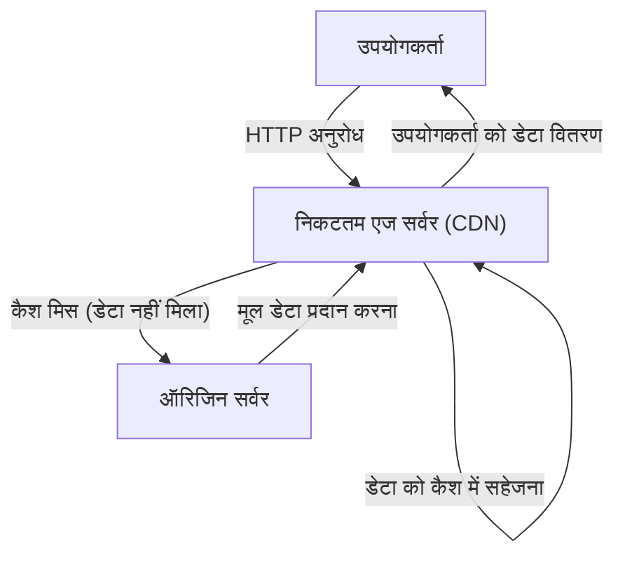
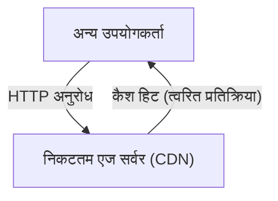

क्या आपने कभी इंटरनेट का उपयोग करते समय यह सोचा है कि "विदेशी वेबसाइट होने के बावजूद चित्र एक पल में कैसे प्रदर्शित हो जाते हैं?" या क्या आप जानते हैं कि जब दुनिया भर में बड़े पैमाने पर गेम अपडेट एक साथ जारी किए जाते हैं, तो सर्वर बिना डाउन हुए इसे कैसे संभाल लेते हैं?

इसके पीछे **CDN (Content Delivery Network)** नामक एक शक्तिशाली इंफ्रास्ट्रक्चर काम करता है। इस लेख में, हम CDN की कार्यप्रणाली और इसे सपोर्ट करने वाली कोर तकनीकों (कैश, एज सर्वर, एनीकास्ट रूटिंग) के बारे में विस्तार से बताएंगे, जो आधुनिक इंटरनेट में अपरिहार्य हो गए हैं। यह तकनीकी स्पष्टीकरण न केवल इंफ्रास्ट्रक्चर इंजीनियरों और वेब डेवलपर्स के लिए है, बल्कि उन सभी लोगों के लिए है जो इंटरनेट के पर्दे के पीछे की दुनिया में रुचि रखते हैं।

## 1. CDN क्या है? इसकी आवश्यकता क्यों है?

CDN (कंटेंट डिलीवरी नेटवर्क) भौगोलिक रूप से वितरित सर्वरों का एक नेटवर्क है जिसे वेब सामग्री को उपयोगकर्ताओं तक तेजी से और कुशलता से पहुंचाने के लिए डिज़ाइन किया गया है।

आमतौर पर, वेबसाइट का डेटा (HTML, चित्र, वीडियो, JavaScript आदि) "ऑरिजिन सर्वर" (Origin Server) नामक एक मुख्य सर्वर पर संग्रहीत होता है। हालाँकि, यदि दुनिया भर के सभी उपयोगकर्ता एक ही ऑरिजिन सर्वर तक पहुँचते हैं, तो निम्नलिखित जैसी गंभीर समस्याएँ उत्पन्न हो सकती हैं:

*   **भौतिक दूरी के कारण विलंब (लेटेंसी):** हालाँकि डेटा फाइबर ऑप्टिक्स के माध्यम से प्रकाश की गति से यात्रा करता है, फिर भी दुनिया के दूसरे छोर के साथ संचार करने में समय लगता है। यदि टोक्यो का कोई उपयोगकर्ता न्यूयॉर्क के सर्वर तक पहुँचता है, तो केवल TCP हैंडशेक या TLS कनेक्शन स्थापित करने में ही सैकड़ों मिलीसेकंड का विलंब हो सकता है।
*   **सर्वर ओवरलोड:** यदि एक्सेस एक ही स्थान पर केंद्रित हो जाता है, तो यह ऑरिजिन सर्वर के CPU, मेमोरी और नेटवर्क बैंडविड्थ की प्रोसेसिंग क्षमता से अधिक हो सकता है, जिससे साइट धीमी हो सकती है या डाउन हो सकती है।
*   **नेटवर्क कंजेशन:** मध्यवर्ती इंटरनेट पथ (राउटर और सबमरीन केबल) भीड़भाड़ वाले हो सकते हैं, जिससे पैकेट लॉस (पैकेट का नुकसान) और संचार गति में कमी आ सकती है।

इन भौतिक और नेटवर्क बाधाओं को दूर करने और "दुनिया में कहीं से भी एक्सेस करने पर गति" सुनिश्चित करने के लिए CDN का जन्म हुआ था।

## 2. CDN का समर्थन करने वाली 3 मुख्य तकनीकें

CDN द्वारा दुनिया भर में तेजी से सामग्री पहुंचाने के लिए, मुख्य रूप से "एज सर्वर", "कैश" और "एनीकास्ट रूटिंग" नामक तीन तकनीकें महत्वपूर्ण भूमिका निभाती हैं। आइए इनमें से प्रत्येक की कार्यप्रणाली पर करीब से नज़र डालें।

### 2.1 एज सर्वर (Edge Servers) और PoP

एज सर्वर वे सर्वर होते हैं जो सचमुच उपयोगकर्ताओं के "सबसे करीब" (एज = नेटवर्क की सीमा) स्थानों पर स्थित होते हैं।
CDN प्रदाता (जैसे Cloudflare, Akamai, Fastly, AWS CloudFront) दुनिया भर के प्रमुख इंटरनेट एक्सचेंज पॉइंट्स (IX: Internet Exchange) और डेटा सेंटरों में हजारों से लेकर दसियों हज़ार एज सर्वर स्थापित करते हैं। इन स्थानों को **PoP (पॉइंट ऑफ प्रेजेंस)** कहा जाता है।

जब कोई उपयोगकर्ता किसी वेबसाइट तक पहुँचता है, तो दूर स्थित ऑरिजिन सर्वर के बजाय भौतिक रूप से सबसे निकटतम PoP पर स्थित एज सर्वर प्रतिक्रिया देता है। इससे डेटा द्वारा पार किए जाने वाले राउटरों (हॉप्स की संख्या) की संख्या कम हो जाती है, और भौतिक दूरी के कारण होने वाले विलंब (लेटेंसी) में नाटकीय रूप से सुधार होता है।

### 2.2 कैशिंग (Caching) और पर्ज (Purge)

एज सर्वर की सबसे महत्वपूर्ण भूमिका ऑरिजिन सर्वर की सामग्री की एक प्रति संग्रहीत करना है। इस तंत्र को **कैश (Cache)** कहा जाता है।

जब किसी उपयोगकर्ता से कोई अनुरोध आता है, तो सामान्य प्रवाह इस प्रकार होता है:

इसके बाद, यदि कोई अन्य उपयोगकर्ता उसी डेटा तक पहुँचता है, तो इसे इस प्रकार संसाधित किया जाता है:

इस तरह, एक बार जब सामग्री एज सर्वर पर कैश हो जाती है, तो इसे ऑरिजिन सर्वर से पूछताछ किए बिना सीधे उपयोगकर्ता तक पहुंचाया जाता है (कैश हिट)। इससे ऑरिजिन सर्वर पर लोड काफी कम हो जाता है, और उपयोगकर्ता बहुत तेज़ी से सामग्री प्राप्त कर सकते हैं।

**कैश नियंत्रण (Cache-Control)**
CDN अंधाधुंध रूप से सभी डेटा को कैश नहीं करता है। यह HTTP हेडर के `Cache-Control` जैसे निर्देशों का पालन करके यह निर्धारित करता है कि क्या संग्रहीत करना है और कितने समय तक (TTL: Time To Live) संग्रहीत करना है। उदाहरण के लिए, विस्तृत नियंत्रण संभव है, जैसे लोगो छवि को 1 वर्ष के लिए कैश करना, और समाचार के मुखपृष्ठ को केवल 5 मिनट के लिए कैश करना।

**पर्ज (Purge / Invalidation)**
यदि पुराना कैश बना रहता है, तो उपयोगकर्ताओं को पुरानी जानकारी दिखाई देगी। इसलिए, ऑरिजिन सर्वर की ओर डेटा अपडेट होने पर CDN पर कैश को जबरन हटाने के लिए "पर्ज" नामक एक तंत्र भी प्रदान किया गया है। आधुनिक CDN में दुनिया भर के एज सर्वरों के कैश को कुछ ही सेकंड में पर्ज करने की तकनीक स्थापित हो चुकी है।

### 2.3 एनीकास्ट रूटिंग (Anycast Routing)

हमने आसानी से कह दिया कि "उपयोगकर्ताओं को निकटतम एज सर्वर तक पहुंचने दें", लेकिन इंटरनेट पर उपयोगकर्ताओं को स्वचालित रूप से निकटतम सर्वर पर निर्देशित करने के लिए उन्नत नेटवर्किंग तकनीक की आवश्यकता होती है। यहीं **एनीकास्ट (Anycast)** का उपयोग किया जाता है।

इंटरनेट संचार में, आमतौर पर "IP एड्रेस" डेटा का गंतव्य होता है। सामान्य संचार पद्धति (यूनिकास्ट) में, एक IP एड्रेस दुनिया में एक विशिष्ट सर्वर से जुड़ा होता है।
हालाँकि, एनीकास्ट का उपयोग करके, **दुनिया भर में फैले कई सर्वर "बिल्कुल समान IP एड्रेस" साझा कर सकते हैं**।

जब कोई उपयोगकर्ता किसी एनीकास्ट IP एड्रेस पर पैकेट भेजता है, तो इंटरनेट पर मौजूद राउटर BGP (Border Gateway Protocol) नामक रूटिंग प्रोटोकॉल का उपयोग करके स्वायत्त और विकेंद्रीकृत रूप से मार्गों की गणना करते हैं, और पैकेट को नेटवर्क के दृष्टिकोण से "निकटतम (हॉप्स की संख्या और पहुंचने की लागत कम हो)" सर्वर तक पहुंचाते हैं।

*   टोक्यो में मौजूद उपयोगकर्ता का संचार स्वचालित रूप से टोक्यो के PoP पर रूट किया जाता है।
*   लंदन में मौजूद उपयोगकर्ता का संचार, भले ही वह उसी IP एड्रेस के लिए हो, लंदन के PoP पर रूट किया जाता है।

यदि बिजली गुल होने या हार्डवेयर विफलता के कारण टोक्यो का PoP डाउन हो जाता है, तो BGP मार्ग की जानकारी स्वचालित रूप से अपडेट हो जाती है, और संचार तुरंत अगले निकटतम ओसाका या सियोल के PoP पर डायवर्ट (फेलओवर) हो जाता है। यह अविश्वसनीय रूप से उच्च उपलब्धता और दोष सहनशीलता (फॉल्ट टॉलरेंस) प्राप्त करता है।

## 3. मात्र वितरण से परे: CDN का विकास और इसके लाभ

अब तक की कार्यप्रणाली के आधार पर, आइए CDN को लागू करने के विशिष्ट लाभों और आधुनिक CDN द्वारा प्रदान की जाने वाली उन्नत सुविधाओं का सारांश दें।

### 3.1 असाधारण प्रदर्शन सुधार
जैसा कि पहले उल्लेख किया गया है, कैश और एज सर्वर पेज लोड होने के समय को नाटकीय रूप से कम करते हैं। इसके अलावा, नवीनतम CDN में, TCP कनेक्शन के अनुकूलन और एज सर्वर की ओर TLS/SSL हैंडशेक को समाप्त करने वाले "TLS ऑफलोड" के माध्यम से एन्क्रिप्टेड संचार के ओवरहेड को भी कम किया जाता है। बेहतर प्रदर्शन सीधे तौर पर न केवल उपयोगकर्ता अनुभव (UX) में सुधार करता है, बल्कि खोज इंजन अनुकूलन (SEO) और रूपांतरण दर (CVR) को भी बढ़ाता है।

### 3.2 बड़े पैमाने पर वितरण और इंफ्रास्ट्रक्चर लागत में कमी
चूंकि CDN अधिकांश ट्रैफ़िक (अक्सर 90% से अधिक) को संभालता है, इसलिए ऑरिजिन सर्वर की बैंडविड्थ लागत और क्लाउड डेटा ट्रांसफर शुल्क को काफी कम किया जा सकता है। यहां तक कि जब अचानक बहुत अधिक ट्रैफ़िक आता है (तथाकथित "स्लैशडॉट प्रभाव"), जैसे कि जब कोई सामग्री वायरल हो जाती है या टीवी पर दिखाई जाती है, तो दुनिया भर में फैले CDN की विशाल क्षमता ट्रैफ़िक को अवशोषित कर लेती है, जिससे यह सुनिश्चित होता है कि साइट डाउन न हो।

### 3.3 सुरक्षा की अग्रिम पंक्ति (DDoS सुरक्षा और WAF)
आधुनिक CDN दुनिया की सबसे बड़ी "ढाल" के रूप में भी कार्य करते हैं। बड़े पैमाने पर DDoS हमले (डिस्ट्रिब्यूटेड डिनायल ऑफ सर्विस अटैक) की स्थिति में भी, CDN की टेराबिट-क्लास बैंडविड्थ हमले वाले ट्रैफ़िक को अवशोषित और वितरित करती है, जिससे ऑरिजिन सर्वर सुरक्षित रहता है।
इसके अलावा, एज सर्वर पर WAF (Web Application Firewall) चलाकर, SQL इंजेक्शन और क्रॉस-साइट स्क्रिप्टिंग (XSS) जैसे दुर्भावनापूर्ण अनुरोधों को नेटवर्क की सीमा पर ही ब्लॉक किया जा सकता है, इससे पहले कि वे ऑरिजिन सर्वर तक पहुंचें।

### 3.4 एज कंप्यूटिंग का उदय
शुरुआती CDN की मुख्य भूमिका "स्थैतिक (static) फ़ाइलों को कैश करना" थी, लेकिन हाल के वर्षों में, **एज कंप्यूटिंग (Edge Computing)**, जो एज सर्वर पर सीधे प्रोग्राम निष्पादित करता है, मुख्यधारा बनता जा रहा है।
Cloudflare Workers, AWS Lambda@Edge और Fastly Compute जैसे प्लेटफॉर्म का उपयोग करके, डेवलपर्स JavaScript, Rust और Go जैसे कोड को दुनिया भर के एज सर्वर पर डिप्लॉय और निष्पादित कर सकते हैं।
इसके परिणामस्वरूप, निम्नलिखित जैसी गतिशील प्रोसेसिंग ऑरिजिन सर्वर पर निर्भर हुए बिना, उपयोगकर्ताओं के बिल्कुल करीब, अति-निम्न विलंबता (अल्ट्रा-लो लेटेंसी) के साथ निष्पादित की जा सकती है:

*   उपयोगकर्ता के क्षेत्र और डिवाइस के अनुसार A/B परीक्षण और रीडायरेक्ट
*   JWT टोकन सत्यापन जैसी एज प्रमाणीकरण (Edge Authentication)
*   छवि आकार बदलना और प्रारूप रूपांतरण (जैसे WebP में स्वचालित रूपांतरण) जैसी गतिशील अनुकूलन

## 4. वीडियो वितरण (स्ट्रीमिंग) और CDN

Netflix, YouTube और Amazon Prime Video जैसी विशाल वीडियो स्ट्रीमिंग सेवाओं के उदय की कल्पना भी CDN के बिना नहीं की जा सकती है।
उच्च-गुणवत्ता वाला वीडियो डेटा बहुत विशाल होता है, जिसकी तुलना सामान्य वेब पेजों से नहीं की जा सकती। इसे कुशलतापूर्वक वितरित करने के लिए, वीडियो फ़ाइलों को HLS और MPEG-DASH जैसे प्रोटोकॉल का उपयोग करके हर कुछ सेकंड के छोटे "सेगमेंट (चंक)" में विभाजित किया जाता है।
इन विभाजित वीडियो फ़ाइल टुकड़ों को दुनिया भर के एज सर्वरों पर कैश करके, CDN एक निर्बाध और सुचारू देखने का अनुभव सुनिश्चित करता है, भले ही लाखों उपयोगकर्ता एक साथ 4K वीडियो चला रहे हों। कुछ मामलों में, इंटरनेट सेवा प्रदाताओं (ISP) के नेटवर्क के भीतर सीधे समर्पित कैश सर्वर एम्बेड करके घनिष्ठ सहयोग भी किया जाता है।

## 5. निष्कर्ष: इंटरनेट का समर्थन करने वाला अदृश्य इंफ्रास्ट्रक्चर

CDN (कंटेंट डिलीवरी नेटवर्क) उन्नत सॉफ़्टवेयर और नेटवर्क इंफ्रास्ट्रक्चर की शक्ति के माध्यम से भौगोलिक दूरी की भौतिक बाधाओं को दूर करने की एक उल्लेखनीय तकनीक है।

**कैश** के माध्यम से सामग्री का वितरित भंडारण, **एज सर्वर** का उपयोग करके डेटा को उपयोगकर्ताओं के करीब लाना, और **एनीकास्ट रूटिंग** के माध्यम से स्वायत्तता और तुरंत इष्टतम पथ निर्धारित करना—जब ये सभी जटिल रूप से जुड़ते हैं, तो वे "तेज और निर्बाध इंटरनेट" को संभव बनाते हैं जिसका हम हर दिन स्वाभाविक रूप से आनंद लेते हैं।

आधुनिक वेब सेवा विकास में, उच्च स्तर के प्रदर्शन, विश्वसनीयता और सुरक्षा को प्राप्त करने के लिए, CDN की कार्यप्रणाली को सही ढंग से समझना और आर्किटेक्चर डिज़ाइन के शुरुआती चरणों से ही इसे उचित रूप से शामिल करना आवश्यक है।
अगली बार जब आप अपना ब्राउज़र खोलें और दुनिया भर की वेबसाइटों को तुरंत ब्राउज़ करें, तो फ़ाइबर ऑप्टिक्स के माध्यम से दौड़ते हुए और निकटतम एज सर्वर से डिलीवर किए गए डेटा की यात्रा के बारे में थोड़ी कल्पना करने के लिए एक पल निकालें।
