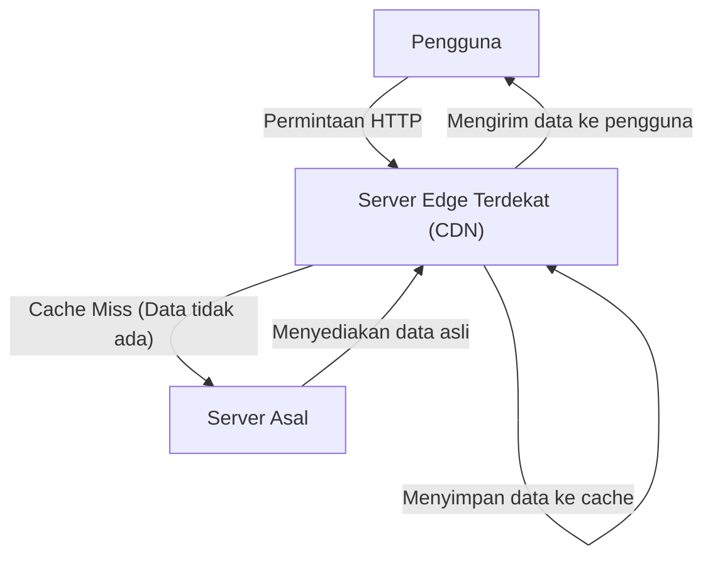
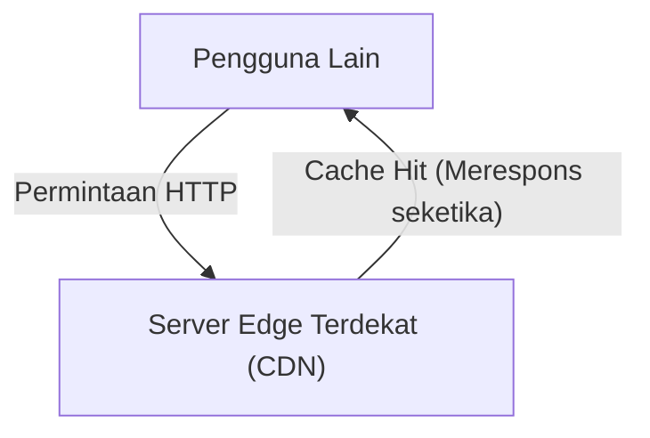

Pernahkah Anda bertanya-tanya saat menggunakan internet, 'Bagaimana bisa gambar dari situs web luar negeri muncul dalam sekejap'? Atau tahukah Anda mengapa server bisa bertahan tanpa mengalami downtime meskipun ada pembaruan game berskala besar yang didistribusikan secara bersamaan di seluruh dunia?

Di baliknya, terdapat infrastruktur tangguh yang disebut **CDN (Content Delivery Network)**. Dalam artikel ini, kami akan menjelaskan secara detail mekanisme CDN yang telah menjadi hal krusial di internet modern, beserta teknologi inti yang mendukunnya (cache, server edge, dan routing Anycast). Ini adalah penjelasan teknis yang ditujukan tidak hanya untuk insinyur infrastruktur dan pengembang web, tetapi juga bagi siapa saja yang tertarik dengan cara kerja di balik layar internet.

## 1. Apa itu CDN? Mengapa Diperlukan?

CDN (Content Delivery Network) adalah jaringan server yang didistribusikan secara geografis untuk mengirimkan konten web kepada pengguna secara cepat dan efisien.

Biasanya, data situs web (seperti HTML, gambar, video, dan JavaScript) disimpan di server utama yang disebut 'server asal' (origin server). Namun, jika semua pengguna di seluruh dunia mengakses satu server asal yang sama, masalah serius berikut dapat terjadi:

*   **Keterlambatan (Latensi) akibat Jarak Fisik:** Data merambat melalui serat optik dengan kecepatan cahaya, namun komunikasi ke belahan dunia lain tetap membutuhkan waktu. Saat pengguna di Tokyo mengakses server di New York, latensi hingga ratusan milidetik dapat terjadi hanya untuk menjalin TCP handshake atau koneksi TLS.
*   **Beban Berlebih pada Server:** Jika akses terkonsentrasi di satu titik, kemampuan pemrosesan CPU, memori, atau bandwidth jaringan dari server asal bisa terlampaui, yang berpotensi membuat situs web menjadi lambat atau bahkan down.
*   **Kemacetan Jaringan:** Jalur internet (seperti router dan kabel bawah laut) dapat mengalami kepadatan, menyebabkan kehilangan paket (packet loss) dan penurunan kecepatan komunikasi.

Untuk mengatasi kendala fisik dan jaringan tersebut serta mewujudkan pengalaman 'cepat diakses dari mana saja di seluruh dunia', CDN pun diciptakan.

## 2. Tiga Teknologi Inti yang Mendukung CDN

Agar CDN dapat mengirimkan konten dengan cepat ke seluruh dunia, tiga teknologi utama memainkan peran penting, yaitu 'server edge', 'cache', dan 'routing Anycast'. Mari kita pelajari cara kerja masing-masing secara lebih rinci.

### 2.1 Server Edge (Edge Servers) dan PoP

Server edge, secara harafiah, adalah server yang ditempatkan di lokasi 'terdekat' (edge = batas jaringan) dengan pengguna.
Penyedia CDN (seperti Cloudflare, Akamai, Fastly, AWS CloudFront, dll.) menempatkan ribuan hingga puluhan ribu server edge di titik-titik pertukaran internet utama (IX: Internet Exchange) dan pusat data di seluruh dunia. Titik-titik lokasi ini disebut **PoP (Point of Presence)**.

Saat pengguna mengakses situs web, yang merespons bukanlah server asal yang jauh, melainkan server edge di PoP yang terdekat secara fisik. Hal ini mengurangi jumlah router yang harus dilewati oleh data (hop count) dan secara dramatis memperbaiki latensi yang disebabkan oleh jarak fisik.

### 2.2 Cache (Caching) dan Purge

Peran paling krusial dari server edge adalah menyimpan salinan konten dari server asal. Mekanisme ini disebut **cache**.

Alur umum saat pengguna membuat permintaan (request) adalah sebagai berikut:

Selanjutnya, jika pengguna lain mengakses data yang sama, prosesnya akan menjadi seperti berikut:

Dengan demikian, konten yang telah di-cache di server edge akan dikirim langsung ke pengguna tanpa perlu menghubungi server asal lagi (cache hit). Hal ini secara signifikan mengurangi beban pada server asal dan memungkinkan pengguna menerima konten dengan lebih cepat.

**Pengendalian Cache (Cache-Control)**
CDN tidak menyimpan semua data secara acak. CDN akan mengikuti instruksi dari header HTTP seperti `Cache-Control` untuk menentukan data apa saja yang disimpan dan seberapa lama durasi penyimpanannya (TTL: Time To Live). Sebagai contoh, dimungkinkan untuk melakukan pengendalian mendetail seperti menyimpan cache gambar logo selama 1 tahun, sementara halaman utama berita hanya di-cache selama 5 menit.

**Pembersihan Cache (Purge/Invalidation)**
Jika cache lama terus tersimpan, pengguna mungkin akan melihat informasi yang usang. Karena itu, terdapat mekanisme yang disebut 'purge' untuk menghapus cache di CDN secara paksa ketika data diperbarui di sisi server asal. Pada CDN modern, teknologi untuk melakukan purge cache di seluruh server edge dunia dalam hitungan detik sudah sangat matang.

### 2.3 Routing Anycast (Anycast Routing)

Meskipun sebelumnya disebutkan 'mengarahkan pengguna ke server edge terdekat' secara sederhana, diperlukan teknologi jaringan canggih untuk mengarahkan pengguna ke server terdekat di internet secara otomatis. Di sinilah **Anycast** digunakan.

Dalam komunikasi internet, 'Alamat IP' biasanya menjadi tujuan data. Pada metode komunikasi umum (Unicast), satu alamat IP terikat pada satu server spesifik di dunia.
Namun dengan menggunakan Anycast, **banyak server yang tersebar di seluruh dunia dapat membagikan 'alamat IP yang persis sama'**.

Saat pengguna mengirim paket ke alamat IP Anycast, router di internet menggunakan protokol kontrol rute yang disebut BGP (Border Gateway Protocol) untuk menghitung rute secara mandiri dan terdistribusi, lalu mengirimkan paket ke server yang secara jaringan 'terdekat' (dengan jumlah hop dan biaya ketercapaian terendah).

*   Komunikasi dari pengguna yang berada di Tokyo akan secara otomatis di-routing ke PoP di Tokyo.
*   Komunikasi dari pengguna di London akan di-routing ke PoP di London, meskipun ditujukan ke alamat IP yang sama.

Jika PoP di Tokyo down karena pemadaman listrik atau kegagalan perangkat keras, informasi rute BGP akan diperbarui secara otomatis, dan komunikasi akan langsung dialihkan (failover) ke PoP terdekat berikutnya seperti Osaka atau Seoul. Hal inilah yang mewujudkan ketersediaan tinggi dan toleransi kesalahan (fault tolerance) yang luar biasa.

## 3. Evolusi dan Manfaat CDN yang Melampaui Sekadar Pengiriman

Berdasarkan mekanisme sejauh ini, mari kita rangkum manfaat nyata yang diperoleh dari penerapan CDN dan fitur canggih yang ditawarkan oleh CDN modern.

### 3.1 Peningkatan Performa yang Signifikan

Seperti yang telah disebutkan, penggunaan cache dan server edge mempersingkat waktu muat (load time) halaman secara drastis. Selain itu, CDN terbaru juga memangkas beban tambahan (overhead) komunikasi terenkripsi melalui pengoptimalan koneksi TCP dan terminasi TLS handshake di sisi server edge yang disebut 'TLS Offloading'. Peningkatan performa tidak hanya berdampak pada User Experience (UX), tetapi juga secara langsung meningkatkan optimisasi mesin pencari (SEO) dan tingkat konversi (CVR).

### 3.2 Distribusi Skala Besar dan Pengurangan Biaya Infrastruktur

Karena CDN mengambil alih sebagian besar trafik (bahkan seringkali lebih dari 90%), biaya bandwidth dari server asal dan biaya transfer data komputasi awan dapat dikurangi secara signifikan. Bahkan jika terjadi lonjakan akses secara tiba-tiba karena viral atau diliput di televisi (yang dikenal dengan istilah 'Slashdot Effect'), kapasitas masif dari CDN yang terdistribusi secara global akan menyerap trafik tersebut, sehingga situs web tidak akan tumbang.

### 3.3 Garis Depan Keamanan (Mitigasi DDoS dan WAF)

CDN modern juga berperan sebagai 'tameng' terbesar di dunia. Bahkan jika terjadi serangan DDoS (Distributed Denial of Service) berskala masif, kapasitas bandwidth kelas terabit yang dimiliki CDN mampu menyerap dan menyebarkan trafik serangan, melindungi server asal tanpa luka sedikit pun.
Selain itu, dengan mengoperasikan WAF (Web Application Firewall) di atas server edge, permintaan berbahaya seperti SQL Injection atau Cross-Site Scripting (XSS) dapat diblokir di perbatasan jaringan sebelum mencapai server asal.

### 3.4 Bangkitnya Komputasi Edge (Edge Computing)

Peran utama CDN pada masa-masa awal adalah sekadar melakukan 'caching file statis', namun belakangan ini eksekusi program secara langsung di atas server edge atau **Komputasi Edge (Edge Computing)** semakin menjadi arus utama.
Dengan memanfaatkan Cloudflare Workers, AWS Lambda@Edge, Fastly Compute, dan sebagainya, pengembang dapat menyebarkan (deploy) dan mengeksekusi kode dari JavaScript, Rust, Go, dll. ke server edge di seluruh dunia.
Ini memungkinkan berbagai pemrosesan dinamis dilakukan di dekat pengguna dengan latensi yang sangat rendah tanpa harus bergantung pada server asal, seperti:

*   Pengujian A/B atau pengalihan rute (redirect) yang disesuaikan dengan wilayah dan perangkat pengguna.
*   Autentikasi di level edge seperti verifikasi token JWT.
*   Optimisasi dinamis pada gambar seperti pengubahan ukuran (resize) dan konversi format (seperti konversi otomatis ke WebP).

## 4. Distribusi Video (Streaming) dan CDN

Kemunculan layanan streaming video raksasa seperti Netflix, YouTube, dan Amazon Prime Video juga tidak dapat dibahas tanpa menyebutkan CDN.
Data video beresolusi tinggi sangatlah masif jika dibandingkan dengan halaman web biasa. Untuk mendistribusikannya secara efisien, file video dipecah ke dalam 'segmen (chunk)' yang berdurasi beberapa detik menggunakan protokol seperti HLS atau MPEG-DASH.
Dengan menempatkan potongan file video yang telah dipecah ini ke dalam cache server edge di seluruh dunia, CDN mewujudkan pengalaman menonton yang mulus dan bebas putus-putus meskipun jutaan pengguna memutar video 4K pada saat yang bersamaan. Terkadang bahkan terdapat integrasi yang lebih erat, seperti penanaman server cache khusus yang diletakkan langsung di dalam jaringan ISP (Penyedia Layanan Internet).

## 5. Kesimpulan: Infrastruktur Tak Terlihat yang Menopang Internet

CDN (Content Delivery Network) adalah teknologi luar biasa yang mampu menaklukkan kendala fisik berupa jarak geografis dengan memanfaatkan kekuatan perangkat lunak canggih dan infrastruktur jaringan.

Menyimpan konten secara terdistribusi menggunakan **cache**, mengirimkan data langsung ke dekat pengguna melalui **server edge**, dan menemukan rute optimal secara mandiri dan sekejap menggunakan **routing Anycast**. Perpaduan kompleks dari seluruh teknologi ini mewujudkan 'internet yang cepat dan tak terputus' yang bisa kita nikmati seolah-olah hal itu terjadi begitu saja setiap harinya.

Dalam pengembangan layanan web modern, guna mengintegrasikan performa, keandalan, serta keamanan pada level tertinggi, memahami cara kerja CDN dengan benar dan mengimplementasikannya dari tahap awal desain arsitektur sangatlah krusial.
Lain kali saat Anda membuka browser dan mengunjungi berbagai situs web di seluruh dunia dalam sekejap mata, cobalah renungkan sejenak mengenai perjalanan data yang melesat melewati serat optik dan dikirim dari server edge terdekat untuk Anda.
