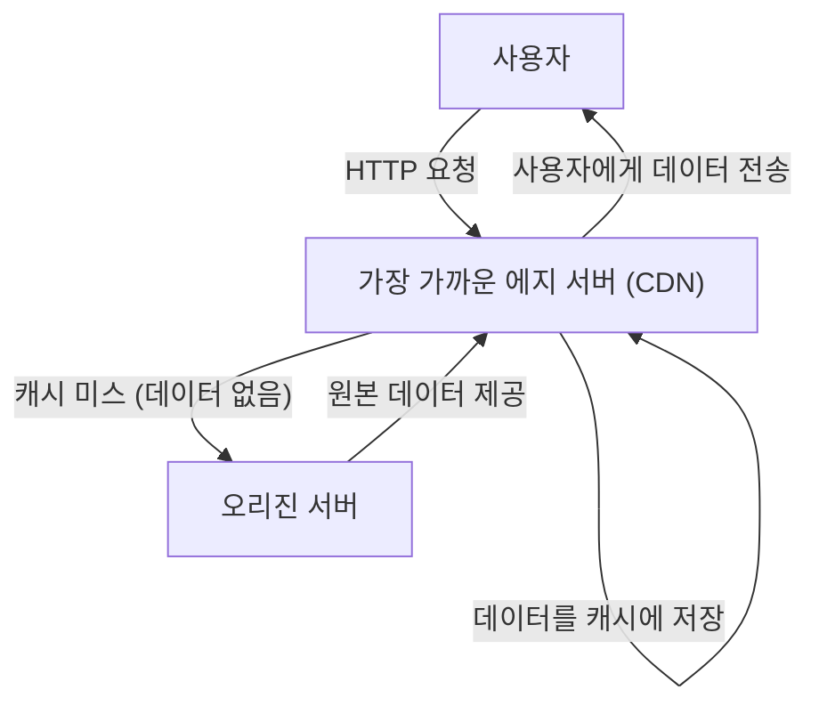
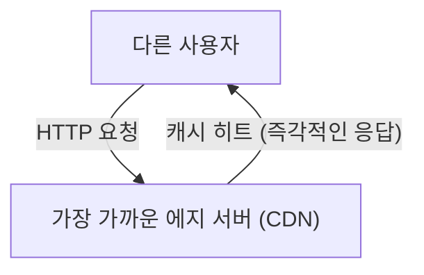

인터넷을 사용하면서 '해외 웹사이트인데도 순식간에 이미지가 표시되네?'라고 신기하게 생각한 적이 없으신가요? 혹은 대규모 게임 업데이트가 전 세계에서 동시에 배포되고 있음에도 불구하고 서버가 다운되지 않고 견뎌내는 이유를 알고 계신가요?

그 이면에는 <strong>CDN(Content Delivery Network, 콘텐츠 전송 네트워크)</strong>이라는 강력한 인프라스트럭처가 존재하고 있습니다. 본 기사에서는 현대 인터넷에서 필수 불가결해진 CDN의 원리와, 이를 뒷받침하는 핵심 기술(캐시, 에지 서버, 애니캐스트 라우팅)에 대해 상세히 해설합니다. 인프라 엔지니어나 웹 개발자뿐만 아니라 인터넷의 이면에 관심이 있는 모든 분들을 위한 기술 해설입니다.

## 1. CDN이란 무엇인가? 왜 필요한가?

CDN(콘텐츠 전송 네트워크)이란 웹 콘텐츠를 사용자에게 빠르고 효율적으로 전달하기 위해 지리적으로 분산 배치된 서버 네트워크를 말합니다.

일반적으로 웹사이트의 데이터(HTML, 이미지, 동영상, JavaScript 등)는 '오리진 서버(Origin Server)'라고 불리는 원본 서버에 저장되어 있습니다. 하지만 전 세계의 모든 사용자가 단일 오리진 서버에 접속하게 되면 다음과 같은 심각한 문제가 발생합니다.

*   **물리적 거리에 따른 지연(레이턴시):** 데이터는 광케이블을 통해 빛의 속도로 전달되지만, 그럼에도 지구 반대편과의 통신에는 시간이 걸립니다. 도쿄의 사용자가 뉴욕의 서버에 접속할 경우 TCP 핸드셰이크나 TLS 연결을 설정하는 데만 수백 밀리초의 지연이 발생합니다.
*   **서버 과부하:** 접속이 한 곳에 집중되면 오리진 서버의 CPU나 메모리, 네트워크 대역폭의 처리 능력을 초과하여 사이트가 느려지거나 다운될 수 있습니다.
*   **네트워크 혼잡:** 중간의 인터넷 경로(라우터나 해저 케이블)가 혼잡해져 패킷 손실이나 통신 속도 저하를 유발합니다.

이러한 물리적, 네트워크적 제약을 극복하고 '전 세계 어디에서 접속해도 빠른' 속도를 실현하기 위해 CDN이 탄생했습니다.

## 2. CDN을 지탱하는 3가지 핵심 기술

CDN이 전 세계로 빠르게 콘텐츠를 전달하기 위해서는 주로 '에지 서버', '캐시', '애니캐스트 라우팅'이라는 3가지 기술이 중요한 역할을 합니다. 각각의 원리를 자세히 살펴보겠습니다.

### 2.1 에지 서버 (Edge Servers) 와 PoP

에지 서버는 말 그대로 사용자에게 '가장 가까운(에지 = 네트워크의 경계)' 장소에 배치된 서버를 의미합니다.
CDN 제공업체(Cloudflare, Akamai, Fastly, AWS CloudFront 등)는 전 세계의 주요 인터넷 교환 노드(IX: Internet Exchange)나 데이터 센터에 수천에서 수만 대의 에지 서버를 설치해 두고 있습니다. 이러한 거점을 <strong>PoP(Point of Presence)</strong>라고 부릅니다.

사용자가 웹사이트에 접속할 때, 멀리 떨어진 오리진 서버가 아닌 물리적으로 가장 가까운 PoP에 있는 에지 서버가 응답합니다. 이를 통해 데이터가 경유하는 라우터의 수(홉 수)가 줄어들고, 물리적 거리에 기인한 지연(레이턴시)이 획기적으로 개선됩니다.

### 2.2 캐시 (Caching) 와 퍼지

에지 서버의 가장 중요한 역할은 오리진 서버의 콘텐츠 복사본을 저장해 두는 것입니다. 이 방식을 **캐시**라고 부릅니다.

사용자의 요청이 있을 때의 일반적인 흐름은 다음과 같습니다.

다음으로 다른 사용자가 같은 데이터에 접속할 경우에는 다음과 같이 처리됩니다.

이처럼 한 번 에지 서버에 캐시된 콘텐츠는 오리진 서버에 질의하지 않고 사용자에게 직접 전송됩니다(캐시 히트). 이를 통해 오리진 서버의 부하는 대폭 경감되고, 사용자는 더 빠르게 콘텐츠를 받아볼 수 있습니다.

**캐시 제어 (Cache-Control)**
CDN은 무분별하게 모든 데이터를 캐시하지 않습니다. HTTP 헤더의 `Cache-Control` 등의 지시에 따라 무엇을 얼마 동안(TTL: Time To Live) 저장할지 결정합니다. 예를 들어 로고 이미지는 1년 동안 캐시하고, 뉴스 메인 페이지는 5분 동안만 캐시하는 등 세밀한 제어가 가능합니다.

**퍼지 (Purge/Invalidation)**
오래된 캐시가 계속 남아 있으면 사용자에게 예전 정보가 표시됩니다. 그래서 오리진 서버 측에서 데이터가 업데이트되었을 때, CDN 상의 캐시를 강제로 삭제하는 '퍼지(Purge)'라는 기능도 마련되어 있습니다. 최신 CDN에서는 전 세계 에지 서버의 캐시를 몇 초 이내에 퍼지하는 기술이 확립되어 있습니다.

### 2.3 애니캐스트 라우팅 (Anycast Routing)

'가장 가까운 에지 서버에 접속하게 한다'고 간단히 말했지만, 인터넷 상에서 사용자를 가장 가까운 서버로 자동 유도하려면 고도의 네트워크 기술이 필요합니다. 이때 사용되는 것이 <strong>애니캐스트(Anycast)</strong>입니다.

인터넷 통신에서는 일반적으로 'IP 주소'가 데이터의 목적지가 됩니다. 일반적인 통신 방식(Unicast)에서는 하나의 IP 주소가 전 세계에서 단 한 대의 특정 서버에 연결되어 있습니다.
하지만 애니캐스트를 이용하면 **전 세계에 분산된 여러 대의 서버가 '완전히 동일한 IP 주소'를 공유**할 수 있습니다.

사용자가 애니캐스트 IP 주소로 패킷을 전송하면, 인터넷 상의 라우터는 BGP(Border Gateway Protocol)라는 경로 제어 프로토콜을 사용하여 자율 분산적으로 경로를 계산하고, 네트워크적으로 '가장 가까운(홉 수나 도달 비용이 낮은)' 서버로 패킷을 전달합니다.

*   도쿄에 있는 사용자의 통신은 자동으로 도쿄의 PoP로 라우팅됩니다.
*   런던에 있는 사용자의 통신은 같은 IP 주소 목적지라도 런던의 PoP로 라우팅됩니다.

만약 도쿄의 PoP가 정전이나 하드웨어 장애로 다운될 경우, BGP의 경로 정보가 자동으로 업데이트되어 다음으로 가까운 오사카나 서울의 PoP로 통신이 순식간에 우회(페일오버)됩니다. 이를 통해 경이로운 고가용성과 내결함성을 실현하고 있습니다.

## 3. 단순한 전송을 넘어선 CDN의 진화와 장점

지금까지의 원리를 바탕으로, CDN을 도입함으로써 얻을 수 있는 구체적인 장점과 현대의 CDN이 제공하는 고급 기능에 대해 정리해 보겠습니다.

### 3.1 압도적인 성능 향상
앞서 언급했듯이 캐시와 에지 서버를 통해 페이지 로드 시간은 획기적으로 단축됩니다. 또한 최신 CDN에서는 TCP 커넥션 최적화나, TLS/SSL 핸드셰이크를 에지 서버 측에서 종료하는 'TLS 오프로드'를 수행하여 암호화 통신의 오버헤드조차도 줄이고 있습니다. 성능 향상은 사용자 경험(UX)의 향상뿐만 아니라 검색 엔진 최적화(SEO)와 전환율(CVR) 향상에도 직결됩니다.

### 3.2 대규모 전송 및 인프라 비용 절감
트래픽의 대부분(90% 이상이 되는 경우도 흔합니다)을 CDN이 대신 처리하기 때문에, 오리진 서버의 대역폭 비용이나 클라우드 데이터 전송 비용을 크게 절감할 수 있습니다. 화제가 되거나 TV에 소개되는 등 돌발적인 접속 집중(일명 '슬래시닷 효과')이 발생해도, 전 세계에 분산된 CDN의 거대한 캐퍼시티가 트래픽을 흡수하므로 사이트가 다운되는 일은 없습니다.

### 3.3 보안의 최전선 (DDoS 방어와 WAF)
현대의 CDN은 세계에서 가장 거대한 '방패'로서의 역할도 담당하고 있습니다. 대규모 DDoS 공격(분산 서비스 거부 공격)을 받더라도, CDN이 가진 테라비트급 대역폭을 통해 공격 트래픽을 흡수하고 분산시켜 오리진 서버를 온전히 지켜냅니다.
또한, WAF(Web Application Firewall)를 에지 서버에서 구동시킴으로써 SQL 인젝션이나 크로스 사이트 스크립팅(XSS) 같은 악의적인 요청을 오리진 서버에 도달하기 전 네트워크 경계에서 차단할 수 있습니다.

### 3.4 에지 컴퓨팅의 대두
초기 CDN은 '정적 파일의 캐시'가 주요 역할이었지만, 최근에는 에지 서버에서 직접 프로그램을 실행하는 **에지 컴퓨팅(Edge Computing)**이 주류가 되어가고 있습니다.
Cloudflare Workers나 AWS Lambda@Edge, Fastly Compute 등을 사용하면 개발자는 JavaScript, Rust, Go 등의 코드를 전 세계 에지 서버에 배포하고 실행할 수 있습니다.
이를 통해 다음과 같은 동적 처리를 오리진 서버에 의존하지 않고 사용자의 바로 곁에서 초저지연으로 실행할 수 있게 되었습니다.

*   사용자의 지역이나 디바이스에 따른 A/B 테스트 및 리다이렉트
*   JWT 토큰 검증 등의 에지 인증
*   이미지 리사이징이나 포맷 변환(WebP 자동 변환 등)의 동적 최적화

## 4. 동영상 스트리밍과 CDN

Netflix, YouTube, Amazon Prime Video와 같은 거대한 동영상 스트리밍 서비스의 부상도 CDN 없이는 설명할 수 없습니다.
고화질 동영상 데이터는 일반적인 웹페이지와 비교할 수 없을 정도로 거대합니다. 이를 효율적으로 전송하기 위해 동영상 파일은 HLS나 MPEG-DASH 같은 프로토콜을 통해 몇 초 단위의 잘게 쪼개진 '세그먼트(청크)'로 분할됩니다.
이렇게 분할된 동영상 파일 조각을 CDN이 전 세계 에지 서버에 캐시함으로써, 수백만 명의 사용자가 동시에 4K 동영상을 재생해도 끊김 없는 원활한 시청 경험을 실현하고 있습니다. ISP(인터넷 서비스 제공자)의 네트워크 내에 직접 전용 캐시 서버를 심어두는 등 더욱 긴밀하게 연동하는 사례도 있습니다.

## 5. 요약: 인터넷을 지탱하는 보이지 않는 인프라

CDN(콘텐츠 전송 네트워크)은 지리적 거리라는 물리적 제약을 고도의 소프트웨어와 네트워크 인프라의 힘으로 극복하기 위한 훌륭한 기술입니다.

**캐시**를 통해 콘텐츠를 분산 저장하고, **에지 서버**를 통해 사용자 바로 곁까지 데이터를 운반하며, **애니캐스트 라우팅**을 통해 자율적이고 즉각적으로 최적의 경로를 도출해냅니다. 이것들이 복잡하게 얽힘으로써 우리가 매일 당연하게 누리고 있는 '빠르고 끊김 없는 인터넷'이 실현되고 있습니다.

현대의 웹 서비스 개발에 있어 성능, 신뢰성, 그리고 보안을 높은 차원에서 양립시키기 위해서는 CDN의 원리를 올바르게 이해하고 아키텍처 설계의 초기 단계부터 적절히 반영하는 것이 필수적입니다.
다음번에 브라우저를 열고 전 세계의 웹사이트를 순식간에 열람할 때면, 광케이블 속을 누비며 가장 가까운 에지 서버로부터 전달된 데이터의 여정을 조금이나마 상상해 보시기 바랍니다.
