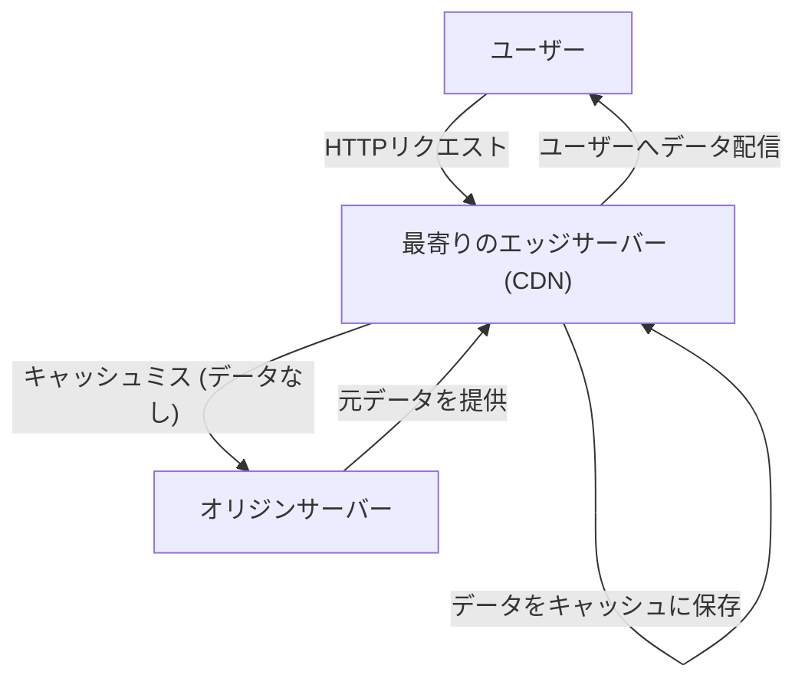
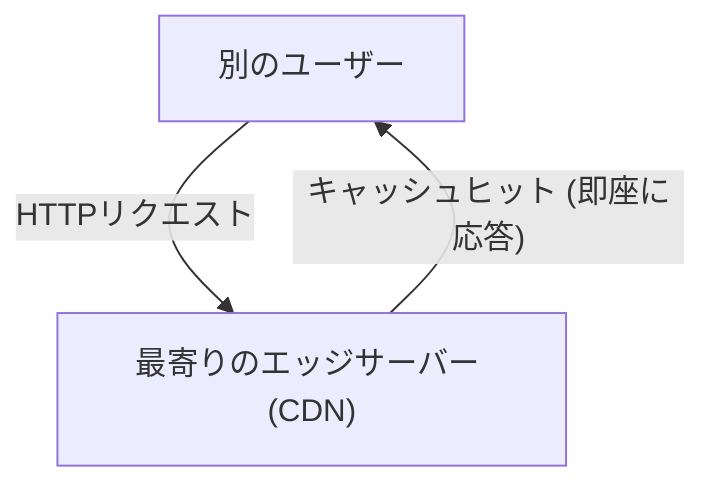

インターネットを利用していて、「海外のウェブサイトなのに一瞬で画像が表示される」と不思議に思ったことはありませんか？あるいは、大規模なゲームのアップデートが世界中で同時に配信されているのにも関わらず、サーバーがダウンせずに耐えられている理由を知っていますか？

その背後には**CDN (Content Delivery Network)**という強力なインフラストラクチャが存在しています。本記事では、現代のインターネットにおいて不可欠となったCDNの仕組みと、それを支えるコア技術（キャッシュ、エッジサーバー、Anycastルーティング）について詳細に解説します。インフラエンジニアやウェブ開発者だけでなく、インターネットの裏側に興味があるすべての方に向けた技術解説です。

## 1. CDNとは何か？なぜ必要なのか？

CDN（コンテンツ・デリバリー・ネットワーク）とは、ウェブコンテンツをユーザーに高速かつ効率的に配信するために、地理的に分散して配置されたサーバーのネットワークのことです。

通常、ウェブサイトのデータ（HTML、画像、動画、JavaScriptなど）は「オリジンサーバー」と呼ばれる大元のサーバーに保存されています。しかし、世界中のすべてのユーザーが単一のオリジンサーバーにアクセスすると、以下のような深刻な問題が発生します。

*   **物理的な距離による遅延（レイテンシ）：** データは光ファイバーを通じて光の速さで伝わりますが、それでも地球の裏側との通信には時間がかかります。東京のユーザーがニューヨークのサーバーにアクセスする場合、TCPハンドシェイクやTLS接続の確立だけで数百ミリ秒の遅延が発生します。
*   **サーバーの過負荷：** アクセスが1箇所に集中すると、オリジンサーバーのCPUやメモリ、ネットワーク帯域の処理能力を超え、サイトが重くなったりダウンしたりする可能性があります。
*   **ネットワークの渋滞：** 途中のインターネット経路（ルーターや海底ケーブル）が混雑し、パケットロスや通信速度の低下を引き起こします。

これらの物理的・ネットワーク的な制約を克服し、「世界中どこからアクセスしても速い」を実現するためにCDNが誕生しました。

## 2. CDNを支える3つのコア技術

CDNが世界中へ高速にコンテンツを届けるためには、主に「エッジサーバー」「キャッシュ」「Anycastルーティング」という3つの技術が重要な役割を果たしています。それぞれの仕組みを詳しく見ていきましょう。

### 2.1 エッジサーバー (Edge Servers) と PoP

エッジサーバーは、文字通りユーザーに「最も近い（エッジ＝ネットワークの境界）」場所に配置されたサーバーのことです。
CDNプロバイダー（Cloudflare、Akamai、Fastly、AWS CloudFrontなど）は、世界中の主要なインターネット交換拠点（IX: Internet Exchange）やデータセンターに、数千から数万台のエッジサーバーを設置しています。これらの拠点を**PoP (Point of Presence)**と呼びます。

ユーザーがウェブサイトにアクセスする際、遠く離れたオリジンサーバーではなく、物理的に最も近いPoPにあるエッジサーバーが応答します。これにより、データが経由するルーターの数（ホップ数）が減り、物理的な距離に起因する遅延（レイテンシ）が劇的に改善されます。

### 2.2 キャッシュ (Caching) とパージ

エッジサーバーの最も重要な役割は、オリジンサーバーのコンテンツのコピーを保存しておくことです。この仕組みを**キャッシュ**と呼びます。

ユーザーからリクエストがあったときの一般的な流れは以下のようになります。

次に別のユーザーが同じデータにアクセスした場合は、以下のように処理されます。

このように、一度エッジサーバーにキャッシュされたコンテンツは、オリジンサーバーに問い合わせることなく直接ユーザーに配信されます（キャッシュヒット）。これにより、オリジンサーバーの負荷は大幅に軽減され、ユーザーはより早くコンテンツを受け取ることができます。

**キャッシュの制御 (Cache-Control)**
CDNは無差別にすべてのデータをキャッシュするわけではありません。HTTPヘッダーの `Cache-Control` などの指示に従って、何をどれくらいの期間（TTL: Time To Live）保存するかを決定します。例えば、ロゴ画像は1年間キャッシュし、ニュースのトップページは5分間だけキャッシュする、といった細かな制御が可能です。

**パージ (Purge/Invalidation)**
古いキャッシュが残り続けると、ユーザーに古い情報が表示されてしまいます。そのため、オリジンサーバー側でデータが更新された際に、CDN上のキャッシュを強制的に削除する「パージ」と呼ばれる仕組みも用意されています。モダンなCDNでは、世界中のエッジサーバーのキャッシュを数秒以内にパージする技術が確立されています。

### 2.3 Anycastルーティング (Anycast Routing)

「最も近いエッジサーバーにアクセスさせる」と簡単に言いましたが、インターネット上でユーザーを最寄りのサーバーに自動的に誘導するには高度なネットワーク技術が必要です。そこで利用されるのが**Anycast（エニーキャスト）**です。

インターネットの通信では、通常「IPアドレス」がデータの宛先となります。一般的な通信方式（Unicast）では、1つのIPアドレスは世界で1台の特定のサーバーに紐付いています。
しかしAnycastを利用すると、**世界中に分散した複数のサーバーが「全く同じIPアドレス」を共有**することができます。

ユーザーがAnycast IPアドレス宛にパケットを送信すると、インターネット上のルーターはBGP（Border Gateway Protocol）という経路制御プロトコルを用いて自律分散的に経路を計算し、ネットワーク的に「最も近い（ホップ数や到達コストが低い）」サーバーへとパケットを送り届けます。

*   東京にいるユーザーからの通信は、自動的に東京のPoPにルーティングされます。
*   ロンドンにいるユーザーからの通信は、同じIPアドレス宛であっても、ロンドンのPoPにルーティングされます。

もし東京のPoPが停電やハードウェア障害でダウンした場合、BGPの経路情報が自動的に更新され、次に近い大阪やソウルのPoPへと通信が瞬時に迂回（フェイルオーバー）されます。これにより、驚異的な高可用性と耐障害性を実現しているのです。

## 3. 単なる配信を超えたCDNの進化とメリット

ここまでの仕組みを踏まえ、CDNを導入することで得られる具体的なメリットと、現代のCDNが提供する高度な機能について整理しましょう。

### 3.1 圧倒的なパフォーマンス向上
前述の通り、キャッシュとエッジサーバーによりページの読み込み時間は劇的に短縮されます。さらに最新のCDNでは、TCPコネクションの最適化や、TLS/SSLハンドシェイクをエッジサーバー側で終端する「TLSオフロード」を行うことで、暗号化通信のオーバーヘッドすらも削減しています。パフォーマンスの向上は、ユーザー体験（UX）の向上のみならず、検索エンジン最適化（SEO）やコンバージョン率（CVR）の向上にも直結します。

### 3.2 大規模配信とインフラコスト削減
トラフィックの大部分（90%以上になることも珍しくありません）をCDNが肩代わりするため、オリジンサーバーの帯域幅コストやクラウドのデータ転送料を大幅に削減できます。バズった際やテレビで紹介された際などの突発的なアクセス集中（いわゆる「スラッシュドット効果」）が発生しても、世界中に分散したCDNの巨大なキャパシティがトラフィックを吸収するため、サイトが落ちることはありません。

### 3.3 セキュリティの最前線 (DDoS対策とWAF)
現代のCDNは、世界最大の「盾」としての役割も担っています。大規模なDDoS攻撃（分散型サービス拒否攻撃）を受けた場合でも、CDNの持つテラビット級の帯域幅によって攻撃トラフィックを吸収・分散させ、オリジンサーバーを無傷で守り抜きます。
また、WAF（Web Application Firewall）をエッジサーバー上で稼働させることで、SQLインジェクションやクロスサイトスクリプティング（XSS）などの悪意のあるリクエストを、オリジンサーバーに到達する前にネットワークの境界でブロックすることが可能です。

### 3.4 エッジコンピューティングの台頭
初期のCDNは「静的なファイルのキャッシュ」が主な役割でしたが、近年ではエッジサーバー上で直接プログラムを実行する**エッジコンピューティング (Edge Computing)** が主流になりつつあります。
Cloudflare WorkersやAWS Lambda@Edge、Fastly Computeなどを用いることで、開発者はJavaScript、Rust、Goなどのコードを世界中のエッジサーバーにデプロイし、実行できます。
これにより、以下のような動的な処理をオリジンサーバーに頼らず、ユーザーのすぐそばで超低遅延で実行できるようになりました。

*   ユーザーの地域やデバイスに応じたA/Bテストやリダイレクト
*   JWTトークンの検証などのエッジ認証
*   画像のリサイズやフォーマット変換（WebPへの自動変換など）の動的最適化

## 4. 動画配信（ストリーミング）とCDN

Netflix、YouTube、Amazon Prime Videoといった巨大な動画ストリーミングサービスの台頭も、CDNなしには語れません。
高画質な動画データは通常のウェブページとは比較にならないほど巨大です。これを効率よく配信するために、動画ファイルはHLSやMPEG-DASHといったプロトコルによって数秒ごとの細かな「セグメント（チャンク）」に分割されます。
この分割された動画ファイル片をCDNが世界中のエッジサーバーにキャッシュすることで、何百万人ものユーザーが同時に4K動画を再生しても途切れることのないスムーズな視聴体験を実現しています。ISP（インターネットサービスプロバイダ）のネットワーク内に直接専用のキャッシュサーバーを埋め込むような、より密接な連携を行っているケースもあります。

## 5. まとめ：インターネットを支える見えないインフラ

CDN（コンテンツ・デリバリー・ネットワーク）は、地理的な距離という物理的な制約を、高度なソフトウェアとネットワークインフラの力で乗り越えるための素晴らしい技術です。

**キャッシュ**によってコンテンツを分散保存し、**エッジサーバー**によってユーザーのすぐそばまでデータを運び、**Anycastルーティング**によって自律的かつ瞬時に最適な経路を導き出す。これらが複雑に絡み合うことで、私たちが毎日当たり前のように享受している「速くて途切れないインターネット」が実現されています。

現代のウェブサービス開発において、パフォーマンス、信頼性、そしてセキュリティを高い次元で両立させるためには、CDNの仕組みを正しく理解し、アーキテクチャ設計の初期段階から適切に組み込むことが不可欠です。
次にあなたがブラウザを開き、世界中のウェブサイトを瞬時に閲覧したときは、光ファイバーの中を駆け巡り、最寄りのエッジサーバーから届けられたデータの旅に少しだけ思いを馳せてみてください。
