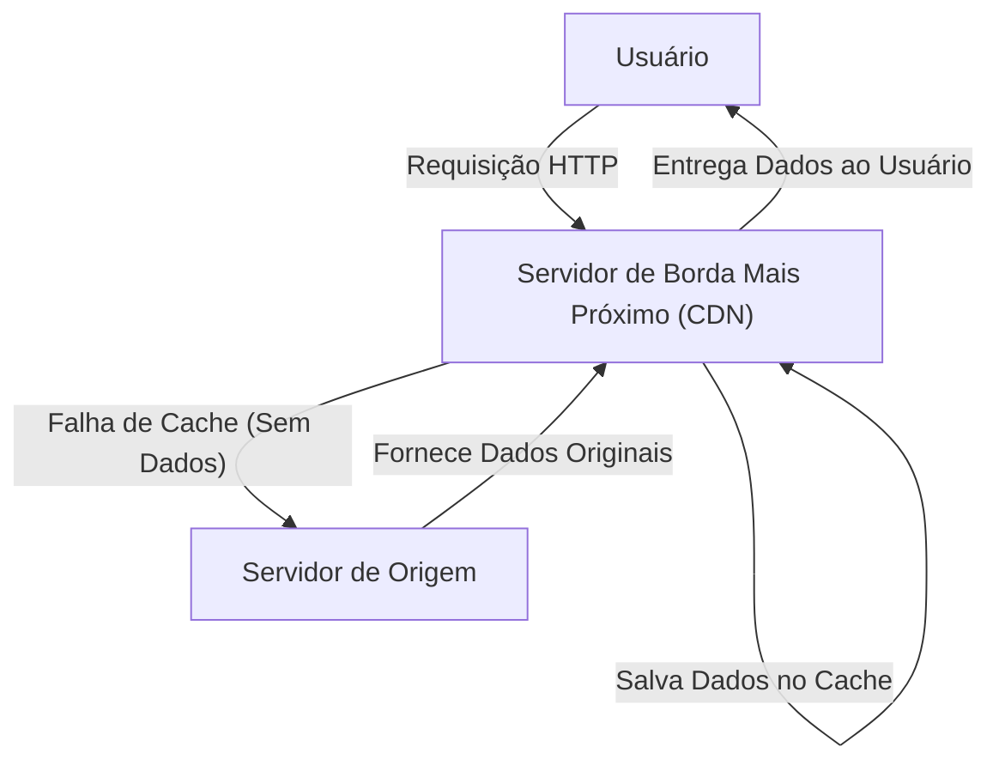
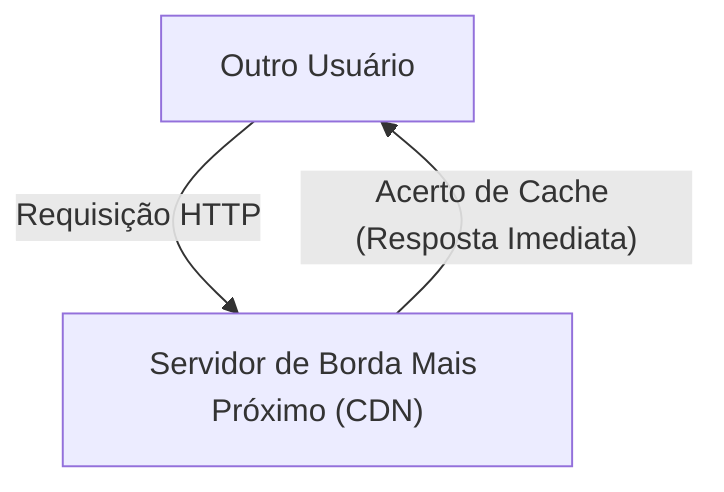

Você já se perguntou, ao usar a internet, como as imagens de um site estrangeiro carregam instantaneamente? Ou você sabe por que grandes atualizações de jogos, lançadas simultaneamente no mundo todo, não derrubam os servidores?

Por trás disso existe uma infraestrutura poderosa chamada **CDN (Content Delivery Network - Rede de Distribuição de Conteúdo)**. Neste artigo, explicaremos em detalhes como funciona uma CDN, que se tornou indispensável na internet moderna, e as tecnologias centrais que a suportam (cache, servidores de borda e roteamento Anycast). Esta é uma explicação técnica destinada não apenas a engenheiros de infraestrutura e desenvolvedores web, mas a qualquer pessoa interessada nos bastidores da internet.

## 1. O que é uma CDN? Por que ela é necessária?

Uma CDN (Content Delivery Network) é uma rede de servidores distribuídos geograficamente, projetada para entregar conteúdo da web aos usuários de forma rápida e eficiente.

Normalmente, os dados de um site (HTML, imagens, vídeos, JavaScript, etc.) são armazenados em um servidor principal chamado "servidor de origem" (origin server). No entanto, se todos os usuários do mundo acessassem um único servidor de origem, problemas graves como os seguintes ocorreriam:

*   **Latência devido à distância física:** Os dados viajam na velocidade da luz através de cabos de fibra óptica, mas a comunicação com o outro lado do planeta ainda leva tempo. Quando um usuário em Tóquio acessa um servidor em Nova York, centenas de milissegundos de atraso ocorrem apenas para estabelecer o handshake TCP e a conexão TLS.
*   **Sobrecarga do servidor:** Quando os acessos se concentram em um único local, a capacidade de processamento de CPU, memória e largura de banda da rede do servidor de origem pode ser excedida, fazendo com que o site fique lento ou saia do ar.
*   **Congestionamento da rede:** As rotas intermediárias da internet (roteadores e cabos submarinos) podem ficar congestionadas, causando perda de pacotes e redução na velocidade de comunicação.

Para superar essas restrições físicas e de rede, e para alcançar o objetivo de ser "rápido de qualquer lugar do mundo", a CDN foi criada.

## 2. As 3 Tecnologias Centrais que Suportam uma CDN

Para que uma CDN entregue conteúdo rapidamente em todo o mundo, três tecnologias principais desempenham papéis vitais: "Servidores de Borda", "Cache" e "Roteamento Anycast". Vamos dar uma olhada detalhada em como cada uma funciona.

### 2.1 Servidores de Borda (Edge Servers) e PoP

Servidores de borda são servidores localizados no lugar "mais próximo" (a borda da rede) do usuário.
Provedores de CDN (como Cloudflare, Akamai, Fastly, AWS CloudFront, etc.) instalam de milhares a dezenas de milhares de servidores de borda nos principais pontos de troca de tráfego de internet (IX: Internet Exchange) e data centers ao redor do mundo. Esses locais são chamados de **PoP (Point of Presence - Ponto de Presença)**.

Quando um usuário acessa um site, em vez do servidor de origem distante, o servidor de borda no PoP fisicamente mais próximo responde. Isso reduz o número de roteadores pelos quais os dados devem passar (número de saltos) e melhora drasticamente o atraso (latência) causado pela distância física.

### 2.2 Cache (Caching) e Purga

A função mais importante de um servidor de borda é armazenar uma cópia do conteúdo do servidor de origem. Esse mecanismo é chamado de **cache**.

O fluxo geral quando há uma solicitação de um usuário é o seguinte:

Quando outro usuário acessa os mesmos dados posteriormente, o processo é o seguinte:

Dessa forma, uma vez que o conteúdo é armazenado em cache no servidor de borda, ele é entregue diretamente ao usuário sem consultar o servidor de origem (acerto de cache). Isso reduz significativamente a carga no servidor de origem e permite que o usuário receba o conteúdo muito mais rápido.

**Controle de Cache (Cache-Control)**
As CDNs não armazenam todos os dados indiscriminadamente em cache. Elas determinam o que salvar e por quanto tempo (TTL: Time To Live) com base em instruções como `Cache-Control` nos cabeçalhos HTTP. Por exemplo, é possível ter um controle fino, como armazenar uma imagem de logotipo em cache por um ano e a página inicial de notícias por apenas 5 minutos.

**Purga (Purge/Invalidation)**
Se caches antigos permanecerem, os usuários verão informações desatualizadas. Portanto, existe um mecanismo chamado "purga", que força a exclusão de caches na CDN quando os dados são atualizados no servidor de origem. As CDNs modernas estabeleceram tecnologias para purgar caches em servidores de borda em todo o mundo em segundos.

### 2.3 Roteamento Anycast (Anycast Routing)

Dissemos de forma simples "direcionar os usuários para o servidor de borda mais próximo", mas direcionar automaticamente os usuários na internet para o servidor mais próximo requer tecnologia de rede avançada. É aqui que o **Anycast** é usado.

Na comunicação pela internet, o "endereço IP" é geralmente o destino dos dados. No método de comunicação padrão (Unicast), um endereço IP está vinculado a um servidor específico no mundo.
No entanto, usando Anycast, **múltiplos servidores distribuídos em todo o mundo podem compartilhar "exatamente o mesmo endereço IP"**.

Quando um usuário envia um pacote para um endereço IP Anycast, os roteadores na internet usam um protocolo de roteamento chamado BGP (Border Gateway Protocol) para calcular autonomamente a rota e entregar o pacote ao servidor que está "mais próximo" na rede (com o menor número de saltos ou custo de alcance).

*   O tráfego de um usuário em Tóquio é roteado automaticamente para o PoP de Tóquio.
*   O tráfego de um usuário em Londres é roteado para o PoP de Londres, mesmo que o pacote seja destinado ao mesmo endereço IP.

Se o PoP de Tóquio cair devido a uma queda de energia ou falha de hardware, as informações de roteamento BGP serão atualizadas automaticamente, e o tráfego será redirecionado (failover) instantaneamente para o próximo PoP mais próximo, como Osaka ou Seul. Isso atinge uma disponibilidade e tolerância a falhas incrivelmente altas.

## 3. A Evolução e os Benefícios da CDN Além da Simples Distribuição

Com base em como ela funciona até agora, vamos resumir os benefícios específicos da implementação de uma CDN e os recursos avançados oferecidos pelas CDNs modernas.

### 3.1 Melhoria de Desempenho Esmagadora
Como mencionado, servidores de borda e cache reduzem drasticamente os tempos de carregamento de páginas. Além disso, as CDNs modernas reduzem até mesmo a sobrecarga das comunicações criptografadas otimizando conexões TCP e realizando "TLS Offloading", encerrando o handshake TLS/SSL no lado do servidor de borda. Melhorias de desempenho se traduzem diretamente não apenas em uma melhor experiência do usuário (UX), mas também na Otimização de Mecanismos de Busca (SEO) e Taxas de Conversão (CVR) aprimoradas.

### 3.2 Redução de Custos de Infraestrutura e Distribuição em Larga Escala
Como a CDN absorve a maior parte do tráfego (muitas vezes mais de 90%), os custos de largura de banda do servidor de origem e os custos de transferência de dados em nuvem podem ser reduzidos substancialmente. Mesmo durante picos repentinos de acesso (o "Efeito Slashdot") - como quando algo viraliza ou é destaque na TV - a enorme capacidade da CDN distribuída globalmente absorve o tráfego, garantindo que o site não saia do ar.

### 3.3 A Linha de Frente da Segurança (Proteção DDoS e WAF)
As CDNs modernas também servem como o maior "escudo" do mundo. Mesmo sob um ataque DDoS em grande escala (Ataque de Negação de Serviço Distribuído), a largura de banda em escala de terabits da CDN absorve e dispersa o tráfego de ataque, protegendo o servidor de origem intacto.
Além disso, executando um WAF (Web Application Firewall) em servidores de borda, solicitações maliciosas como injeção de SQL (SQL Injection) e Cross-Site Scripting (XSS) podem ser bloqueadas nos limites da rede antes de chegarem ao servidor de origem.

### 3.4 A Ascensão do Edge Computing
As primeiras CDNs focavam principalmente no "cache de arquivos estáticos", mas nos últimos anos, a **Computação de Borda (Edge Computing)**, executando programas diretamente nos servidores de borda, está se tornando comum.
Usando ferramentas como Cloudflare Workers, AWS Lambda@Edge e Fastly Compute, os desenvolvedores podem implantar e executar código em JavaScript, Rust, Go, etc., em servidores de borda em todo o mundo.
Isso permite que os seguintes processos dinâmicos sejam executados de forma ultrarrápida perto do usuário, sem depender do servidor de origem:

*   Testes A/B e redirecionamentos com base na região e no dispositivo do usuário
*   Autenticação na borda, como verificação de token JWT
*   Otimizações dinâmicas, como redimensionamento de imagens e conversões de formato (por exemplo, conversão automática para WebP)

## 4. Streaming de Vídeo e CDNs

A ascensão de serviços massivos de streaming de vídeo como Netflix, YouTube e Amazon Prime Video não pode ser discutida sem as CDNs.
Dados de vídeo de alta qualidade são imensos em comparação com páginas da web normais. Para entregar isso de forma eficiente, os arquivos de vídeo são divididos em pequenos "segmentos" (chunks) de alguns segundos através de protocolos como HLS ou MPEG-DASH.
Ao armazenar esses fragmentos de vídeo em servidores de borda em todo o mundo, as CDNs garantem que, mesmo que milhões de usuários reproduzam simultaneamente um vídeo 4K, eles desfrutem de uma experiência de visualização suave e ininterrupta. Em alguns casos, os provedores de CDN colaboram ainda mais estreitamente incorporando servidores de cache dedicados diretamente na rede do ISP (Provedor de Serviços de Internet).

## 5. Conclusão: A Infraestrutura Invisível que Suporta a Internet

A CDN (Content Delivery Network) é uma tecnologia incrível projetada para superar restrições físicas, como distância geográfica, através do poder de software avançado e infraestrutura de rede.

Ao usar **cache** para armazenar conteúdo de forma distribuída, **servidores de borda** para levar os dados para perto dos usuários e **roteamento Anycast** para encontrar de forma autônoma e instantânea o caminho ideal, esses elementos se interligam de forma complexa para proporcionar a internet "rápida e ininterrupta" que nós tomamos como garantida todos os dias.

No desenvolvimento de serviços web modernos, para alcançar alto desempenho, confiabilidade e segurança simultaneamente, é essencial entender adequadamente como as CDNs funcionam e integrá-las adequadamente desde os estágios iniciais de design de arquitetura.
Da próxima vez que você abrir seu navegador e navegar instantaneamente por sites em todo o mundo, reserve um momento para pensar sobre a jornada dos dados correndo através de fibras ópticas, entregues a você pelo servidor de borda mais próximo.
