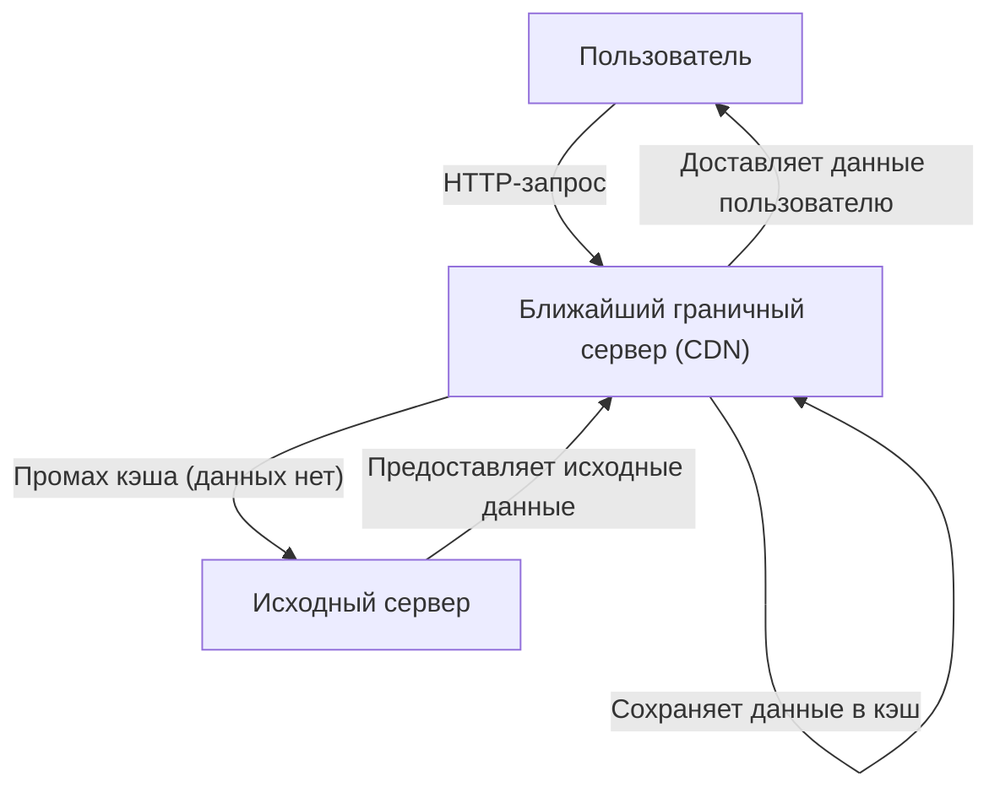
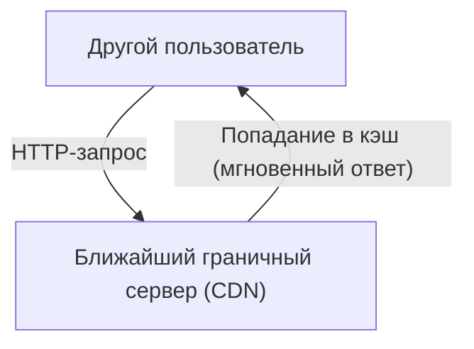

Вы когда-нибудь задумывались, почему, пользуясь интернетом, вы мгновенно видите изображения на зарубежных сайтах? Или почему серверы не падают во время глобального одновременного выпуска масштабных обновлений для популярных игр?

За всем этим стоит мощная инфраструктура под названием **CDN (Content Delivery Network — сеть доставки контента)**. В этой статье мы подробно рассмотрим, как работает CDN, ставшая незаменимой в современном интернете, а также разберем поддерживающие ее ключевые технологии (кэширование, граничные серверы и маршрутизацию Anycast). Это техническое руководство предназначено не только для инженеров инфраструктуры и веб-разработчиков, но и для всех, кто интересуется устройством интернета "под капотом".

## 1. Что такое CDN и зачем она нужна?

CDN (сеть доставки контента) — это географически распределенная сеть серверов, предназначенная для быстрой и эффективной доставки веб-контента пользователям.

Обычно данные веб-сайта (HTML, изображения, видео, JavaScript и т. д.) хранятся на главном сервере, называемом "исходным сервером" (origin server). Однако, если все пользователи со всего мира будут обращаться к одному и тому же исходному серверу, возникнут следующие серьезные проблемы:

*   **Задержка из-за физического расстояния (Latency):** Хотя данные передаются по оптоволокну со скоростью света, связь с другим концом Земли все равно занимает время. Если пользователь в Токио обращается к серверу в Нью-Йорке, только на "рукопожатие" TCP (TCP handshake) и установку TLS-соединения уйдут сотни миллисекунд.
*   **Перегрузка сервера:** Концентрация запросов в одном месте может превысить вычислительные мощности процессора, оперативной памяти и пропускной способности сети исходного сервера, что приведет к замедлению работы или падению сайта.
*   **Сетевые заторы:** Промежуточные интернет-маршруты (маршрутизаторы и подводные кабели) могут быть перегружены, что вызывает потерю пакетов и снижение скорости передачи.

CDN была создана для преодоления этих физических и сетевых ограничений и обеспечения высокой скорости доступа из любой точки мира.

## 2. Три ключевые технологии, лежащие в основе CDN

Для быстрой доставки контента по всему миру CDN опирается на три важные технологии: "граничные серверы", "кэширование" и "маршрутизация Anycast". Давайте рассмотрим каждую из них подробнее.

### 2.1 Граничные серверы (Edge Servers) и PoP

Граничные серверы — это серверы, расположенные буквально в "ближайшей к пользователю" точке (на границе сети, edge).
Провайдеры CDN (такие как Cloudflare, Akamai, Fastly, AWS CloudFront) размещают от нескольких тысяч до десятков тысяч граничных серверов в основных точках обмена интернет-трафиком (IX: Internet Exchange) и центрах обработки данных по всему миру. Эти точки называются **PoP (Point of Presence — точки присутствия)**.

Когда пользователь заходит на веб-сайт, ему отвечает не далекий исходный сервер, а граничный сервер в ближайшей к нему точке PoP. Это уменьшает количество маршрутизаторов (хопов), через которые проходят данные, и значительно снижает задержку, вызванную физическим расстоянием.

### 2.2 Кэширование (Caching) и очистка (Purge)

Самая важная задача граничного сервера — хранить копию контента с исходного сервера. Этот механизм называется **кэшированием**.

Типичный процесс обработки запроса пользователя выглядит следующим образом:

Когда другой пользователь запрашивает те же данные, процесс выглядит так:

Таким образом, контент, однажды закэшированный на граничном сервере, доставляется пользователям напрямую, без обращения к исходному серверу (попадание в кэш). Это существенно снижает нагрузку на исходный сервер, а пользователи получают контент намного быстрее.

**Управление кэшем (Cache-Control)**
CDN не кэширует все данные без разбора. Она определяет, что и как долго хранить (TTL: Time To Live), основываясь на инструкциях, таких как HTTP-заголовок `Cache-Control`. Например, логотип сайта можно кэшировать на год, а главную страницу новостей — только на 5 минут.

**Очистка (Purge/Invalidation)**
Если старый кэш остается на сервере, пользователи могут видеть устаревшую информацию. Поэтому предусмотрен механизм "очистки" (purge), который принудительно удаляет кэш в CDN при обновлении данных на исходном сервере. В современных CDN реализованы технологии, позволяющие очистить кэш на граничных серверах по всему миру за считанные секунды.

### 2.3 Маршрутизация Anycast (Anycast Routing)

Хотя мы и сказали, что пользователь подключается к "ближайшему граничному серверу", для автоматического направления пользователя к ближайшему серверу в интернете требуются передовые сетевые технологии. Именно здесь используется **Anycast**.

Обычно в интернет-коммуникациях адресом назначения данных является "IP-адрес". В стандартном методе маршрутизации (Unicast) один IP-адрес привязан к одному конкретному серверу в мире.
Однако с использованием Anycast **несколько серверов, распределенных по всему миру, могут использовать "один и тот же IP-адрес"**.

Когда пользователь отправляет пакет на IP-адрес Anycast, интернет-маршрутизаторы используют протокол BGP (Border Gateway Protocol) для автономного расчета маршрута и доставляют пакет к серверу, который находится "ближе всего" в сетевом плане (с наименьшим количеством хопов или стоимостью маршрута).

*   Запросы пользователя из Токио будут автоматически направляться в PoP в Токио.
*   Запросы пользователя из Лондона, даже отправленные на тот же IP-адрес, будут направляться в PoP в Лондоне.

Если PoP в Токио выходит из строя из-за отключения электричества или аппаратного сбоя, информация о маршрутизации BGP автоматически обновляется, и трафик мгновенно перенаправляется (failover) к ближайшему следующему PoP, например, в Осаке или Сеуле. Это обеспечивает невероятно высокую доступность и отказоустойчивость.

## 3. Эволюция и преимущества CDN помимо простой доставки

Учитывая эти механизмы, давайте обобщим конкретные преимущества внедрения CDN и продвинутые функции, предлагаемые современными решениями.

### 3.1 Колоссальное повышение производительности
Как упоминалось ранее, кэширование и граничные серверы значительно сокращают время загрузки страниц. Кроме того, современные CDN снижают даже накладные расходы на шифрование, оптимизируя TCP-соединения и выполняя "разгрузку TLS" (TLS offloading) на граничных серверах. Повышение производительности напрямую влияет не только на пользовательский опыт (UX), но и на поисковую оптимизацию (SEO) и коэффициент конверсии (CVR).

### 3.2 Масштабная доставка и снижение затрат на инфраструктуру
Поскольку CDN берет на себя большую часть трафика (часто более 90%), можно значительно сократить расходы на пропускную способность исходного сервера и затраты на передачу данных в облаке. Даже при внезапных всплесках трафика (так называемый "слэшдот-эффект"), когда контент становится вирусным или упоминается по телевидению, огромная пропускная способность распределенной по всему миру CDN поглощает трафик, не позволяя сайту упасть.

### 3.3 Передовой рубеж безопасности (Защита от DDoS и WAF)
Современные CDN также играют роль крупнейшего в мире "щита". При масштабных DDoS-атаках (распределенный отказ в обслуживании) терабитная пропускная способность CDN поглощает и распределяет вредоносный трафик, оставляя исходный сервер невредимым.
Кроме того, запуск WAF (Web Application Firewall) на граничных серверах позволяет блокировать вредоносные запросы, такие как SQL-инъекции или межсайтовый скриптинг (XSS), на границе сети, еще до того, как они достигнут исходного сервера.

### 3.4 Развитие граничных вычислений (Edge Computing)
В то время как ранние CDN в основном занимались "кэшированием статических файлов", в последние годы на передний план выходят **граничные вычисления (Edge Computing)** — выполнение программ непосредственно на граничных серверах.
С помощью таких сервисов, как Cloudflare Workers, AWS Lambda@Edge или Fastly Compute, разработчики могут развертывать и запускать код на JavaScript, Rust, Go и других языках на граничных серверах по всему миру.
Это позволяет выполнять следующие динамические задачи со сверхнизкой задержкой прямо рядом с пользователем, не полагаясь на исходный сервер:

*   A/B-тестирование и редиректы в зависимости от региона или устройства пользователя
*   Граничная аутентификация, например проверка токенов JWT
*   Динамическая оптимизация изображений, такая как изменение размера или преобразование форматов (например, автоматическая конвертация в WebP)

## 4. Потоковая передача видео и CDN

Огромный рост платформ потокового видео, таких как Netflix, YouTube и Amazon Prime Video, также был бы невозможен без CDN.
Данные высококачественного видео невероятно велики по сравнению с обычными веб-страницами. Для эффективной доставки видеофайлы разбиваются на мелкие "сегменты" (chunks) по несколько секунд с использованием протоколов вроде HLS или MPEG-DASH.
CDN кэширует эти сегменты видеофайлов на граничных серверах по всему миру, обеспечивая бесперебойный и плавный просмотр даже когда миллионы пользователей одновременно смотрят видео в формате 4K. В некоторых случаях провайдеры CDN интегрируются еще глубже, размещая выделенные кэширующие серверы непосредственно в сетях интернет-провайдеров (ISP).

## 5. Заключение: Невидимая инфраструктура, поддерживающая интернет

CDN (сеть доставки контента) — это удивительная технология, использующая мощь передового программного обеспечения и сетевой инфраструктуры для преодоления физических ограничений географических расстояний.

Раздельное хранение контента с помощью **кэширования**, доставка данных максимально близко к пользователям через **граничные серверы** и автономное, мгновенное определение оптимального маршрута с помощью **маршрутизации Anycast** — эти сложные механизмы, работая вместе, обеспечивают тот самый "быстрый и бесперебойный интернет", который мы сегодня воспринимаем как должное.

Для обеспечения высокой производительности, надежности и безопасности на высоком уровне при разработке современных веб-сервисов важно понимать, как работает CDN, и правильно внедрять ее с самых ранних этапов проектирования архитектуры.
В следующий раз, когда вы откроете браузер и мгновенно загрузите веб-сайт из другой части света, на мгновение задумайтесь о путешествии данных по оптоволокну, доставленных к вам с ближайшего граничного сервера.
