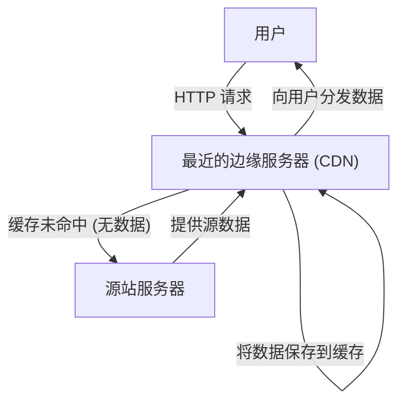
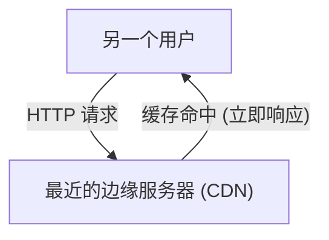

在使用互联网时，你是否曾对“明明是海外网站，图片却能瞬间显示”感到不可思议？或者，你是否知道当大型游戏在全球同步发布更新时，为什么服务器能够承受住压力而不会崩溃？

在这背后，存在着一个名为 **CDN（内容分发网络，Content Delivery Network）** 的强大基础设施。本文将详细解析现代互联网中不可或缺的 CDN 工作原理，以及支撑它的核心技术（缓存、边缘服务器、Anycast 路由）。这是一篇面向基础设施工程师、Web 开发者以及所有对互联网背后机制感兴趣的人的技术解说文章。

## 1. CDN 是什么？为什么需要它？

CDN（内容分发网络）是一个将服务器在地理上分散部署的网络，旨在快速、高效地将 Web 内容分发给用户。

通常，网站的数据（HTML、图片、视频、JavaScript 等）都保存在被称为“源站服务器（Origin Server）”的中央服务器上。然而，如果全球所有的用户都去访问单一的源站服务器，就会出现以下严重问题：

*   **物理距离导致的延迟（Latency）：** 尽管数据是通过光纤以光速传输的，但与地球另一端的通信仍然需要时间。当东京的用户访问纽约的服务器时，仅仅是建立 TCP 握手和 TLS 连接，就会产生数百毫秒的延迟。
*   **服务器超载：** 如果访问集中在同一个地方，可能会超出源站服务器在 CPU、内存和网络带宽上的处理能力，导致网站变慢甚至崩溃。
*   **网络拥堵：** 中途的互联网路径（路由器和海底电缆）可能会发生拥堵，从而导致丢包和通信速度下降。

为了克服这些物理和网络上的限制，实现“无论从世界何处访问都一样快”的目标，CDN 应运而生。

## 2. 支撑 CDN 的 3 项核心技术

为了让 CDN 能够向全球高速分发内容，主要有“边缘服务器”、“缓存”和“Anycast 路由”这三项技术在发挥重要作用。让我们来详细了解一下各自的机制。

### 2.1 边缘服务器 (Edge Servers) 与 PoP

顾名思义，边缘服务器就是部署在离用户“最近（边缘 = 网络边界）”位置的服务器。
CDN 提供商（如 Cloudflare、Akamai、Fastly、AWS CloudFront 等）在全球主要的互联网交换中心（IX: Internet Exchange）和数据中心内部署了数千至数万台边缘服务器。这些据点被称为 **PoP (Point of Presence)**。

当用户访问网站时，响应的并非远在天边的源站服务器，而是物理距离最近的 PoP 中的边缘服务器。这减少了数据需要经过的路由器数量（跳数），从而显著改善了由于物理距离带来的延迟（Latency）。

### 2.2 缓存 (Caching) 与清除 (Purge)

边缘服务器最重要的作用就是保存源站服务器内容的副本。这种机制被称为**缓存**。

当用户发起请求时，一般的处理流程如下：

接下来，当另一个用户访问相同的数据时，处理流程如下：

如上所示，一旦内容被缓存到边缘服务器，就可以直接分发给用户，而无需再向源站服务器进行查询（缓存命中）。这大幅减轻了源站服务器的负载，同时让用户能够更快地获取内容。

**缓存控制 (Cache-Control)**
CDN 并不是无差别地缓存所有数据。它会根据 HTTP 标头中的 `Cache-Control` 等指令，来决定缓存哪些内容以及保存多长时间（TTL: Time To Live）。例如，可以进行细粒度的控制：将 Logo 图片缓存 1 年，而将新闻首页仅缓存 5 分钟。

**清除 (Purge/Invalidation)**
如果旧的缓存一直存在，用户就会看到过时的信息。因此，CDN 也提供了一种称为“清除（Purge）”的机制，当源站服务器上的数据更新时，可以强制删除 CDN 上的缓存。在现代 CDN 中，已经确立了能在几秒钟内清除全球边缘服务器缓存的技术。

### 2.3 Anycast 路由 (Anycast Routing)

虽然简单地说就是“让用户访问最近的边缘服务器”，但要在互联网上自动将用户引导至最近的服务器，需要非常高级的网络技术。这里用到的就是 **Anycast（任播）** 技术。

在互联网通信中，通常“IP 地址”就是数据的目的地。在普通的通信方式（Unicast 单播）中，一个 IP 地址与世界上某一台特定的服务器绑定。
然而，使用 Anycast 时，**分散在全球的多台服务器可以共享“完全相同的 IP 地址”**。

当用户向 Anycast IP 地址发送数据包时，互联网上的路由器会使用 BGP（边界网关协议，Border Gateway Protocol）这种路由控制协议来自主分散地计算路径，并将数据包发送到网络上“最近（跳数或到达成本最低）”的服务器。

*   来自东京用户的通信会自动路由到东京的 PoP。
*   来自伦敦用户的通信，即使是发送到相同的 IP 地址，也会路由到伦敦的 PoP。

如果东京的 PoP 因停电或硬件故障而宕机，BGP 的路由信息会自动更新，通信会瞬间绕道（故障转移，Failover）至下一个最近的 PoP，例如大阪或首尔。这使得 CDN 能够实现惊人的高可用性和容错能力。

## 3. 超越单纯分发的 CDN 演进与优势

基于以上的机制，让我们来整理一下引入 CDN 能够带来的具体优势，以及现代 CDN 所提供的高级功能。

### 3.1 压倒性的性能提升
如前所述，缓存和边缘服务器能够显著缩短页面加载时间。此外，最新的 CDN 通过 TCP 连接优化，以及在边缘服务器端终止 TLS/SSL 握手的“TLS 卸载（TLS Offloading）”，甚至减少了加密通信带来的额外开销。性能的提升不仅直接关系到用户体验（UX）的改善，还能促进搜索引擎优化（SEO）和转化率（CVR）的提高。

### 3.2 大规模分发与基础设施成本削减
由于大部分流量（超过 90% 的情况屡见不鲜）由 CDN 代为承担，因此可以大幅削减源站服务器的带宽成本和云服务的数据传输费用。即便发生突然的访问集中（如内容爆红或在电视上被报道，即所谓的“Slashdot 效应”），遍布全球的 CDN 的巨大容量也能吸收这些流量，确保网站不会崩溃。

### 3.3 安全的最前线 (抗 DDoS 与 WAF)
现代的 CDN 也扮演着世界最大“盾牌”的角色。即使遭遇大规模的 DDoS 攻击（分布式拒绝服务攻击），CDN 也能凭借其太比特（Terabit）级别的带宽吸收并分散攻击流量，保护源站服务器免受损害。
此外，通过在边缘服务器上运行 WAF（Web 应用防火墙），可以在网络边界拦截 SQL 注入或跨站脚本（XSS）等恶意请求，防止它们到达源站服务器。

### 3.4 边缘计算的崛起
早期的 CDN 主要作用是“缓存静态文件”，但在近年来，直接在边缘服务器上执行程序的**边缘计算 (Edge Computing)** 正逐渐成为主流。
通过使用 Cloudflare Workers、AWS Lambda@Edge 或 Fastly Compute 等服务，开发者可以将 JavaScript、Rust、Go 等代码部署到全球的边缘服务器上并执行。
这使得以下动态处理不再依赖源站服务器，而是能够在极靠近用户的地方以超低延迟执行：

*   根据用户地区或设备进行 A/B 测试或重定向
*   JWT 令牌验证等边缘身份验证
*   图片调整大小或格式转换（如自动转换为 WebP）的动态优化

## 4. 视频分发 (流媒体) 与 CDN

Netflix、YouTube、Amazon Prime Video 等大型视频流媒体服务的崛起，同样离不开 CDN。
高清视频数据的大小是普通网页无法比拟的。为了高效地分发这些数据，视频文件会通过 HLS 或 MPEG-DASH 等协议，被分割成每隔几秒的细小“片段（Segment/Chunk）”。
CDN 将这些分割后的视频文件片段缓存到全球的边缘服务器上，从而实现了即使数百万用户同时播放 4K 视频也不会卡顿的流畅观看体验。在某些情况下，CDN 甚至会进行更紧密的合作，将专用的缓存服务器直接嵌入到 ISP（互联网服务提供商）的网络中。

## 5. 总结：支撑互联网的无形基础设施

CDN（内容分发网络）是一项通过高级软件和网络基础设施的力量，来克服地理距离这一物理限制的伟大技术。

通过**缓存**来分散保存内容，利用**边缘服务器**将数据传送到用户的身边，并通过 **Anycast 路由**自主、瞬间地计算出最佳路径。正是这些技术的复杂交织，才造就了我们每天视为理所当然的“快速且不间断的互联网”。

在现代 Web 服务开发中，为了在更高层次上同时兼顾性能、可靠性和安全性，正确理解 CDN 的工作原理，并在架构设计的初期阶段将其恰当地整合进来是必不可少的。
下次当你打开浏览器，瞬间浏览世界各地的网站时，不妨稍微想象一下数据在光纤中穿梭、从最近的边缘服务器传送到你面前的那趟旅程吧。
