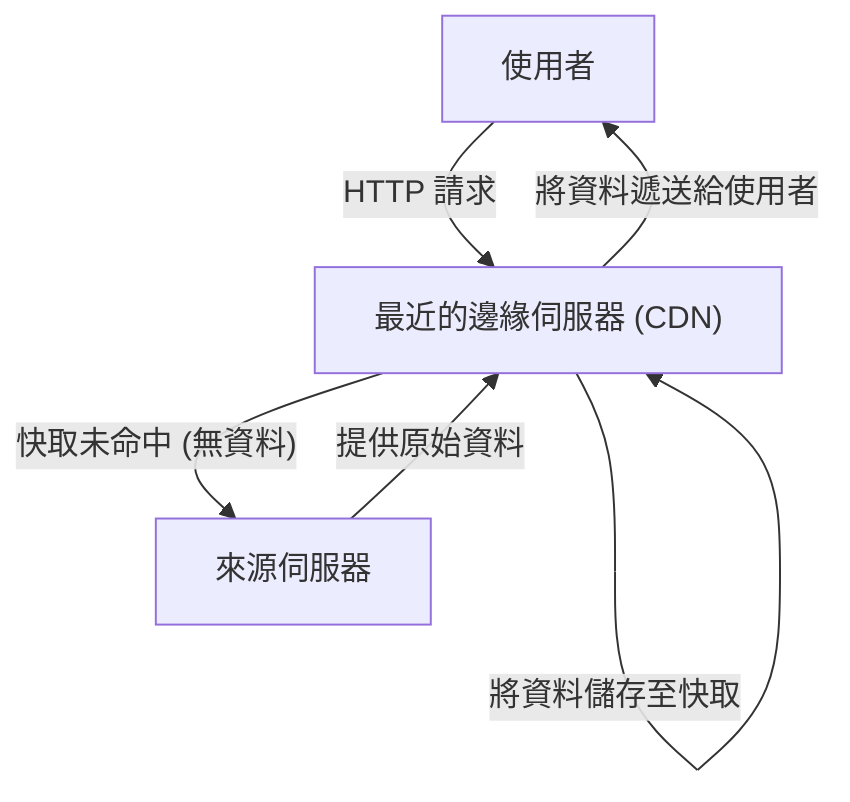
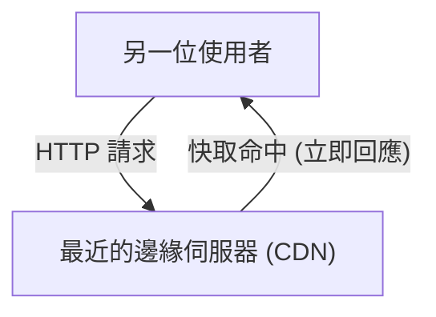

你在使用網際網路時，是否曾感到好奇：「明明是國外的網站，為什麼圖片卻能在一瞬間顯示出來？」或者，你知道為什麼大型遊戲在全球同步發布更新時，伺服器卻能承受住龐大流量而不至於當機嗎？

這背後歸功於 **CDN (Content Delivery Network, 內容遞送網路)** 這個強大的基礎設施。本文將詳細解說現代網際網路中不可或缺的 CDN 運作原理，以及支撐它的核心技術（快取、邊緣伺服器、Anycast 路由）。這是一篇不僅適合基礎設施工程師和網站開發者，也適合所有對網際網路底層技術感興趣的讀者的技術解說。

## 1. 什麼是 CDN？為什麼需要它？

CDN（內容遞送網路）是一個由地理位置分散的伺服器所組成的網路，其目的是將網路內容快速且有效率地遞送給使用者。

通常，網站的資料（HTML、圖片、影片、JavaScript 等）都儲存在稱為「來源伺服器 (Origin Server)」的主伺服器上。然而，如果全世界所有的使用者都連線到單一的來源伺服器，將會發生以下嚴重的問題：

*   **實體距離造成的延遲 (Latency)：** 雖然資料是透過光纖以光速傳輸，但與地球另一端的通訊仍需要時間。如果東京的使用者連線到紐約的伺服器，光是建立 TCP 交握和 TLS 連線，就會產生數百毫秒的延遲。
*   **伺服器過載：** 當存取集中在同一個地方時，可能會超過來源伺服器的 CPU、記憶體或網路頻寬的處理能力，導致網站變慢甚至當機。
*   **網路擁塞：** 中途的網際網路路徑（路由器或海底電纜）變得擁擠，導致封包遺失或通訊速度下降。

為了解決這些實體與網路上的限制，並實現「無論從世界何處存取都一樣快」的目標，CDN 應運而生。

## 2. 支撐 CDN 的 3 項核心技術

為了讓 CDN 能夠快速將內容遞送到世界各地，主要有「邊緣伺服器」、「快取」和「Anycast 路由」這 3 項技術發揮著關鍵作用。讓我們來詳細看看各自的運作原理。

### 2.1 邊緣伺服器 (Edge Servers) 與 PoP

顧名思義，邊緣伺服器就是部署在「最靠近」使用者（邊緣＝網路邊界）位置的伺服器。
CDN 供應商（如 Cloudflare、Akamai、Fastly、AWS CloudFront 等）會在全球主要的網際網路交換中心（IX: Internet Exchange）或資料中心，設置數千至數萬台邊緣伺服器。這些據點被稱為 **PoP (Point of Presence)**。

當使用者造訪網站時，負責回應的不是遠在天邊的來源伺服器，而是實體距離最近的 PoP 內的邊緣伺服器。這減少了資料經過的路由器數量（跳數, Hop count），大幅改善了因實體距離所造成的延遲（Latency）。

### 2.2 快取 (Caching) 與清除 (Purge)

邊緣伺服器最重要的任務就是儲存來源伺服器內容的副本。這個機制稱為**快取**。

當使用者發出請求時，一般流程如下：

接著，當另一位使用者存取相同的資料時，處理流程如下：

如此一來，一旦內容被快取到邊緣伺服器，就不需要再向來源伺服器請求，而是直接遞送給使用者（快取命中）。這不僅大幅減輕了來源伺服器的負載，也讓使用者能更快取得內容。

**快取控制 (Cache-Control)**
CDN 並不會毫無選擇地快取所有資料。它會根據 HTTP 標頭中的 `Cache-Control` 等指示，決定哪些資料要儲存多久（TTL: Time To Live）。例如，可以設定商標圖片快取 1 年，而新聞首頁只快取 5 分鐘，進行這類精細的控制。

**清除 (Purge/Invalidation)**
如果舊的快取一直存在，使用者就會看到過時的資訊。因此，CDN 也提供了稱為「清除 (Purge)」的機制，當來源伺服器上的資料更新時，可以強制刪除 CDN 上的快取。現代的 CDN 技術已經能實現在幾秒鐘內清除全球邊緣伺服器的快取。

### 2.3 Anycast 路由 (Anycast Routing)

雖然我們簡單地說「讓使用者連線到最近的邊緣伺服器」，但在網際網路上要自動將使用者引導至最近的伺服器，需要高度的網路技術。這裡所使用的就是 **Anycast（任播）** 技術。

在網際網路通訊中，通常是以「IP 位址」作為資料的目的地。在一般的通訊方式（Unicast，單播）中，一個 IP 位址對應世界上唯一的一台特定伺服器。
但是透過 Anycast，**分散在世界各地的多台伺服器可以共享「完全相同的一個 IP 位址」**。

當使用者將封包發送到 Anycast IP 位址時，網際網路上的路由器會使用名為 BGP (Border Gateway Protocol, 邊界閘道協定) 的路由協定，自動且分散地計算路徑，並將封包送達網路拓樸上「最近（跳數或到達成本最低）」的伺服器。

*   來自東京使用者的通訊，會自動被路由到東京的 PoP。
*   來自倫敦使用者的通訊，即使是連向同一個 IP 位址，也會被路由到倫敦的 PoP。

如果東京的 PoP 因為停電或硬體故障而當機，BGP 的路由資訊會自動更新，通訊將瞬間切換（容錯移轉, Failover）到下一個最近的 PoP（例如大阪或首爾）。這實現了驚人的高可用性與容錯能力。

## 3. 超越單純遞送的 CDN 演進與優勢

基於上述的運作原理，讓我們來整理一下導入 CDN 所能帶來的具體優勢，以及現代 CDN 所提供的高階功能。

### 3.1 壓倒性的效能提升
如前所述，快取和邊緣伺服器能大幅縮短網頁載入時間。此外，最新的 CDN 透過 TCP 連線最佳化，以及在邊緣伺服器端終止 TLS/SSL 交握的「TLS 卸載 (TLS Offloading)」技術，甚至減少了加密通訊的額外負擔。效能的提升不僅改善了使用者體驗 (UX)，更直接有助於提升搜尋引擎最佳化 (SEO) 與轉換率 (CVR)。

### 3.2 大規模遞送與基礎設施成本降低
由於 CDN 承擔了大部分的流量（高達 90% 以上的情況並不少見），因此可以大幅節省來源伺服器的頻寬成本和雲端資料傳輸費用。即使發生文章爆紅或被電視報導等突發性的流量激增（即所謂的「Slashdot 效應」），遍佈全球的 CDN 巨大容量也能吸收這些流量，確保網站不會當機。

### 3.3 資安的最前線 (DDoS 防護與 WAF)
現代的 CDN 也扮演著世界最大「盾牌」的角色。即使遭受大規模的 DDoS 攻擊 (分散式阻斷服務攻擊)，CDN 憑藉其 Terabit 級別的頻寬，能夠吸收並分散攻擊流量，保護來源伺服器毫髮無傷。
此外，透過在邊緣伺服器上運行 WAF (Web Application Firewall, 網頁應用程式防火牆)，可以在惡意請求（如 SQL 資料隱碼攻擊、跨網站指令碼攻擊 XSS 等）到達來源伺服器之前，就在網路邊界將其阻擋。

### 3.4 邊緣運算的崛起
早期的 CDN 主要功能是「靜態檔案的快取」，但近年來，直接在邊緣伺服器上執行程式的**邊緣運算 (Edge Computing)** 正逐漸成為主流。
透過使用 Cloudflare Workers、AWS Lambda@Edge 或 Fastly Compute 等服務，開發者可以將 JavaScript、Rust、Go 等程式碼部署到全球的邊緣伺服器並執行。
這使得以下動態處理可以不依賴來源伺服器，而在極靠近使用者的地方以超低延遲執行：

*   根據使用者的地區或裝置進行 A/B 測試或重新導向
*   JWT 權杖驗證等邊緣身分驗證
*   圖片縮放或格式轉換（如自動轉換為 WebP）的動態最佳化

## 4. 影音遞送（串流媒體）與 CDN

Netflix、YouTube、Amazon Prime Video 等巨大影音串流服務的崛起，也離不開 CDN。
高畫質的影音資料比一般的網頁大上許多。為了有效率地遞送這些資料，影音檔案會透過 HLS 或 MPEG-DASH 等協定，被分割成每隔幾秒的細小「片段 (Segment/Chunk)」。
CDN 會將這些分割後的影音片段快取到全球的邊緣伺服器中，確保即使有數百萬使用者同時播放 4K 影片，也能擁有流暢不中斷的觀看體驗。在某些情況下，CDN 甚至會直接將專用的快取伺服器嵌入到 ISP (網際網路服務供應商) 的網路內部，進行更緊密的合作。

## 5. 總結：支撐網際網路的無形基礎設施

CDN (內容遞送網路) 是一項運用先進軟體與網路基礎設施的力量，克服地理距離等實體限制的卓越技術。

透過**快取**分散儲存內容，透過**邊緣伺服器**將資料送到使用者身邊，再透過 **Anycast 路由**自動且瞬間地找出最佳路徑。這些技術複雜地交織在一起，實現了我們每天視為理所當然的「快速且不中斷的網際網路」。

在現代的網路服務開發中，為了在高度上兼顧效能、可靠性與安全性，正確理解 CDN 的運作原理，並在架構設計的初期階段就將其適當地納入，是不可或缺的。
下次當你打開瀏覽器，瞬間瀏覽到來自世界各地的網站時，不妨稍微想像一下那些在光纖中穿梭、由最近的邊緣伺服器送達的資料旅程。
