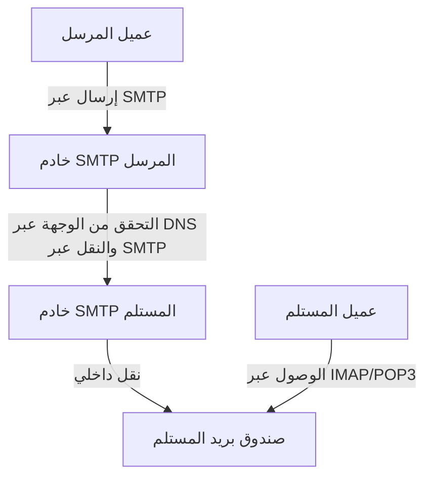
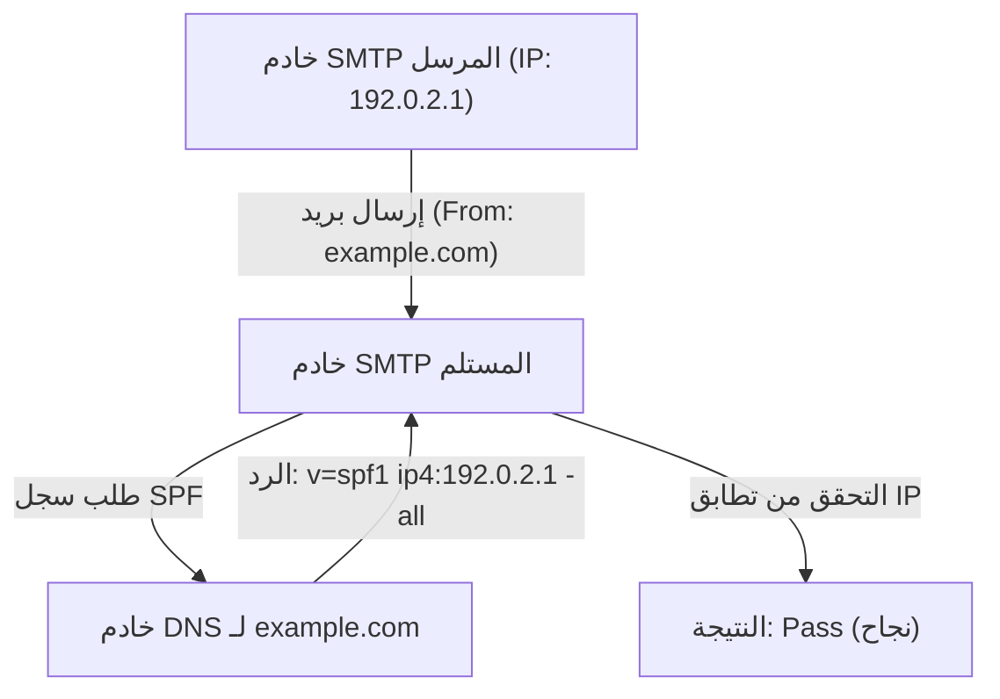
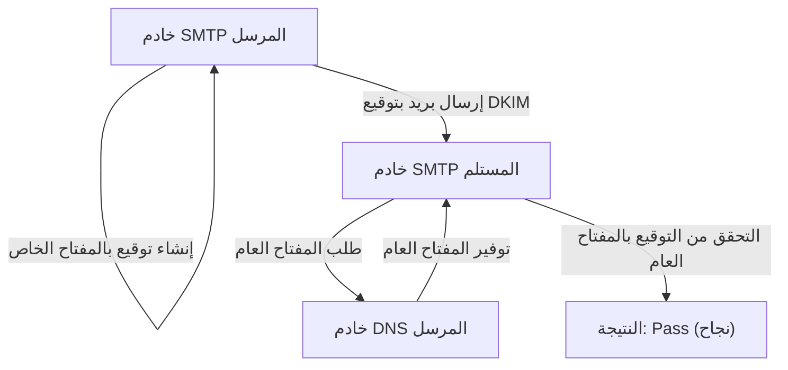

يعد البريد الإلكتروني أحد أقدم وسائل الاتصال على الإنترنت، ولا يزال الأكثر استخدامًا حتى يومنا هذا. ولكن خلف الكواليس، عندما نضغط ببساطة على زر الإرسال، تتعاون عدة بروتوكولات (قواعد اتصال) معًا بشكل معقد لضمان تسليم البريد الإلكتروني بشكل موثوق إلى المستلم.

تشرح هذه المقالة بشكل شامل النظام العام للبريد الإلكتروني من منظور هندسي، بدءًا من الآليات الأساسية لبروتوكولات الإرسال والاستقبال (SMTP و IMAP) إلى تقنيات الأمان (SPF، DKIM، و DMARC) التي أصبحت ضرورية للغاية في أنظمة البريد الإلكتروني الحديثة.

## 1. البروتوكولات الأساسية لإرسال واستقبال البريد الإلكتروني

إرسال واستقبال رسائل البريد الإلكتروني يشبه إلى حد كبير كيفية عمل الخدمة البريدية. تمامًا كما تضع رسالة في صندوق بريد ويتم تسليمها عبر مكتب البريد إلى صندوق بريد المستلم، يمر البريد الإلكتروني أيضًا عبر خوادم متعددة قبل أن يصل إلى وجهته. يتم التعامل مع هذا الاتصال بواسطة بروتوكولات مثل SMTP، POP3، و IMAP.

### SMTP (بروتوكول نقل البريد البسيط)

SMTP هو بروتوكول مخصص لـ **إرسال ونقل** البريد الإلكتروني.

1. **الإرسال من المستخدم إلى الخادم:** عندما ترسل بريدًا إلكترونيًا من عميل بريد (مثل Outlook أو Thunderbird أو Apple Mail)، يتم إرساله أولاً إلى خادم البريد الخاص بك (خادم SMTP).
2. **النقل بين الخوادم:** ينظر خادم SMTP الخاص بالمرسل إلى نطاق عنوان البريد الإلكتروني الوجهة (الجزء `@example.com`)، ويستعلم من نظام أسماء النطاقات (DNS) لتحديد عنوان IP الخاص بخادم بريد المستلم. ثم ينقل البريد الإلكتروني عبر الإنترنت إلى خادم SMTP الخاص بالمستلم.

يُعد بروتوكول SMTP بسيطًا وقويًا للغاية، ولكن نظرًا لتصميمه القديم، لم يكن يحتوي في البداية على ميزات المصادقة أو التشفير. اليوم، يتم استخدام SMTPS (SMTP عبر SSL/TLS) لتشفير الاتصالات، و SMTP-AUTH لمصادقة المرسل كمعايير أساسية.

### IMAP (بروتوكول الوصول إلى رسائل الإنترنت) و POP3 (بروتوكول مكتب البريد الإصدار 3)

IMAP و POP3 هما بروتوكولان يستخدمان للمتلقين لـ **قراءة** البريد الإلكتروني الذي وصل إلى خادم البريد الخاص بهم على أجهزتهم الخاصة.

- **POP3:** هو بروتوكول لـ **تنزيل** رسائل البريد الإلكتروني التي وصلت إلى الخادم على جهاز المستخدم (جهاز الكمبيوتر أو الهاتف الذكي). نظرًا لأن رسائل البريد الإلكتروني التي تم تنزيلها يتم حذفها عادةً من الخادم، فإن هذا البروتوكول غير مناسب لإدارة نفس صندوق البريد من أجهزة متعددة (على الرغم من إمكانية الاحتفاظ بها بإعدادات معينة، إلا أنها لن تتزامن).
- **IMAP:** هو بروتوكول لـ **عرض وإدارة** رسائل البريد الإلكتروني على الخادم من جهاز المستخدم. تبقى رسائل البريد الإلكتروني الفعلية على الخادم، وتتم إدارة حالة القراءة/غير المقروءة، وتنظيم المجلدات، وما إلى ذلك، على الخادم. لذلك، يمكنك الوصول إلى نفس صندوق البريد من أجهزة متعددة مثل الهواتف الذكية والأجهزة اللوحية وأجهزة الكمبيوتر، والاحتفاظ بها متزامنة دائمًا. في بيئات البريد الإلكتروني الحالية، أصبح IMAP هو المعيار الأساسي.

## 2. لماذا تعتبر الحماية من البريد العشوائي (Spam) ضرورية؟

باستخدام الآليات المذكورة أعلاه، من الممكن إرسال واستقبال رسائل البريد الإلكتروني. ومع ذلك، فإن العيب الأساسي في بروتوكول SMTP هو مشكلة أن "تزوير هوية المرسل أمر سهل للغاية".

تمامًا كما يمكنك كتابة اسم شخص آخر بحرية في حقل مرسل الرسالة، يمكنك تعيين عنوان "From" بحرية في SMTP. وقد أدى ذلك إلى تفشي رسائل التصيد الاحتيالي التي تنتحل صفة البنوك أو الشركات الشهيرة، بالإضافة إلى تدفق كميات هائلة من رسائل البريد العشوائي.

لمنع هذا "الانتحال" (Spoofing) وإثبات أن مرسل البريد الإلكتروني شرعي، تم تقديم تقنية تسمى **مصادقة نطاق المرسل**. الممثلون الثلاثة الرئيسيون هم SPF، DKIM، و DMARC.

## 3. SPF (إطار سياسة المرسل)

SPF هو آلية لإثبات شرعية المرسل باستخدام "**عنوان IP**".

### كيف يعمل SPF

1. **تحضير المرسل (نشر سجل DNS):** يسجل مالك النطاق معلومات تسمى "سجل SPF" في DNS الخاص بنطاقه. يحتوي هذا على قائمة بـ "عناوين IP (أو الخوادم) المصرح لها بإرسال رسائل بريد إلكتروني من هذا النطاق".
2. **تحقق المستلم:** عندما يتلقى خادم بريد المستلم رسالة بريد إلكتروني، فإنه يتحقق من عنوان IP للمرسل. بعد ذلك، يستعلم من DNS الخاص بنطاق المرسل ويقوم بجلب سجل SPF.
3. **المطابقة:** إذا كان عنوان IP الفعلي للمرسل مدرجًا في قائمة سجل SPF، فسيتم تقييمه كـ "مرسل صالح (Pass)"، وإذا لم يكن مدرجًا، فسيتم تقييمه كـ "انتحال (Fail)".

### قيود SPF

يعد SPF فعالًا جدًا، ولكنه يمتلك نقاط ضعف أيضًا.
- في حالة إعادة توجيه (Forwarding) البريد الإلكتروني، يتغير عنوان IP للمرسل إلى عنوان IP الخاص بخادم إعادة التوجيه، مما قد يتسبب في فشل التحقق من SPF.
- يتحقق SPF من "Envelope From" (المرسل على مستوى الاتصال)، ولا يتحقق من "Header From" (المرسل المعروض) الذي يراه المستخدم في عميل البريد الإلكتروني الخاص به.

## 4. DKIM (بريد المعرفات بمفاتيح النطاق)

DKIM هي آلية لإثبات شرعية المرسل والتأكد من عدم العبث بالبريد الإلكتروني باستخدام "**التوقيع الرقمي (تقنية التشفير)**".

### كيف يعمل DKIM

1. **تحضير المرسل (تسجيل المفتاح العام):** ينشئ مالك النطاق زوجًا من المفتاح الخاص والمفتاح العام، ثم يسجل المفتاح العام في DNS الخاص بنطاقه (سجل DKIM).
2. **التوقيع عند الإرسال:** عند إرسال بريد إلكتروني، يقوم خادم بريد المرسل بحساب قيمة تجزئة (Hash) بناءً على رأس الرسالة وأجزاء من المحتوى، ثم يقوم بتشفيرها باستخدام المفتاح الخاص. يصبح هذا "توقيعًا رقميًا" ويتم إرفاقه برأس البريد الإلكتروني (DKIM-Signature).
3. **تحقق المستلم:** عندما يتلقى خادم المستلم البريد الإلكتروني، فإنه يجلب المفتاح العام من DNS الخاص بنطاق المرسل.
4. **المطابقة:** يقوم بفك تشفير التوقيع الرقمي باستخدام المفتاح العام المسترد واستخراج قيمة التجزئة الأصلية. في الوقت نفسه، يقوم بحساب قيمة تجزئة مستقلة لبيانات البريد الإلكتروني المستلمة ويتحقق من تطابق القيمتين. إذا تطابقتا، فسيتم الحكم عليه كـ "لم يتم العبث به وتم إرساله من مرسل شرعي يحمل المفتاح الخاص (Pass)".

يتمتع DKIM بميزة مقارنة بـ SPF لأنه لا يفشل بسهولة عند إعادة توجيه البريد، ويضمن أيضًا عدم تعديل محتوى البريد الإلكتروني (النزاهة).

## 5. DMARC (مصادقة الرسائل والإبلاغ والمطابقة المستندة إلى النطاق)

سمح SPF و DKIM بمصادقة البريد الإلكتروني، ومع ذلك، ظلت بعض المشاكل قائمة.
- إذا فشل أي من SPF أو DKIM، لم يكن هناك معيار موحد حول كيفية تعامل خادم المستلم مع هذا البريد الإلكتروني (ما إذا كان يجب وضعه في مجلد البريد العشوائي أو رفضه).
- لم يمنع الانتحال الذي يستغل الاختلافات بين Header From (العنوان الذي يراه المستخدم) و Envelope From (العنوان الذي يراه النظام) بشكل كامل.

لحل هذه المشكلات والعمل كسياسة تشرف على تقنيات المصادقة، يتم استخدام **DMARC**.

### دور DMARC

1. **التحقق من المحاذاة (Alignment):** يتحقق DMARC بدقة ليس فقط من نتائج مصادقة SPF و DKIM، ولكن أيضًا مما إذا كان نطاق "Header From" الذي يراه المستخدم يتطابق فعليًا مع النطاق الذي تمت مصادقته بواسطة SPF أو DKIM (المحاذاة).
2. **إعلان السياسة:** يسجل مسؤول نطاق المرسل سجل DMARC في DNS ويمكنه توجيه جهة الاستلام حول "كيفية التعامل مع البريد الإلكتروني إذا فشلت المصادقة (SPF/DKIM)".
   - `p=none` : لا تفعل شيئًا (وضع المراقبة)
   - `p=quarantine` : ضعه في مجلد البريد العشوائي وما إلى ذلك (الحجر)
   - `p=reject` : رفض البريد الإلكتروني
3. **وظيفة إعداد التقارير:** يحتوي DMARC على وظيفة حيث يرسل خادم المستلم تقارير حول نتائج المصادقة إلى مسؤول النطاق المرسل. من خلال عرض هذا، يمكن للمسؤول مراقبة ما إذا كان النطاق الخاص به قد تم استخدامه بشكل ضار أو ما إذا تم حظر رسائل البريد الإلكتروني الشرعية.

إذا تم ضبط DMARC على "reject" (رفض)، يتم حظر رسائل البريد الإلكتروني المزيفة بقوة قبل وصولها إلى المستخدمين، مما يقلل بشكل كبير من الأضرار مثل عمليات التصيد الاحتيالي. في الآونة الأخيرة، عزز كبار مزودي البريد الإلكتروني مثل Google (Gmail) و Yahoo! من الاتجاه لطلب تنفيذ DMARC من المرسلين.

## الخلاصة

تطور نظام البريد الإلكتروني من بروتوكول نقل بسيط إلى وسيلة اتصال أكثر أمانًا بمرور الوقت.

- **SMTP** يحمل البريد الإلكتروني، و **IMAP** يديره ليكون سهل القراءة.
- للتغلب على نقطة الضعف التي تسمح لأي شخص بتزوير هوية المرسل، يثبت **SPF** المصدر من خلال عنوان IP، ويثبته **DKIM** من خلال التوقيع الرقمي.
- ثم يجمع **DMARC** بينهما ويعمل بشكل صارم لحظر رسائل البريد الإلكتروني المزيفة.

يعد فهم هذه الآليات معرفة إلزامية للمهندسين المعاصرين لحماية نطاقات شركاتهم وضمان تسليم البريد الإلكتروني بشكل موثوق للمستخدمين. على الرغم من أن البنية التحتية للبريد الإلكتروني غير مرئية في الغالب، إلا أن هذه التقنيات تدعم أمان اتصالاتنا اليومية.
