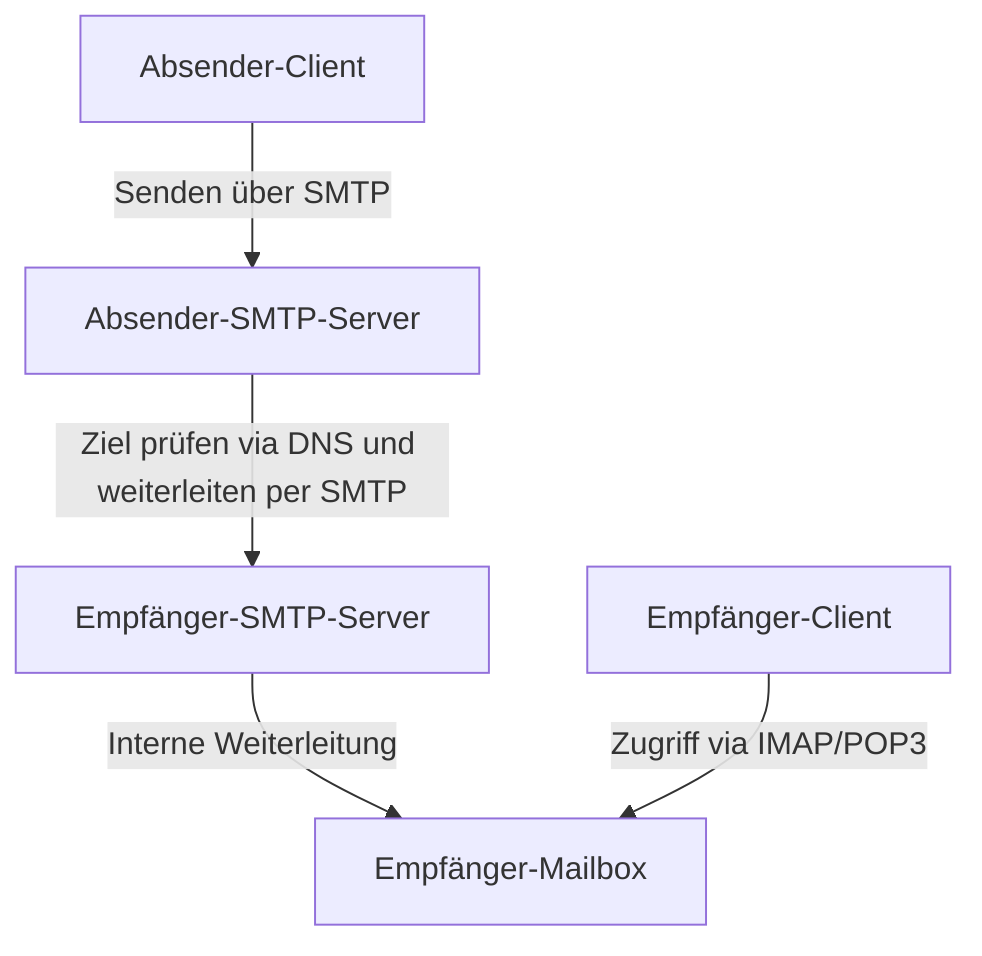
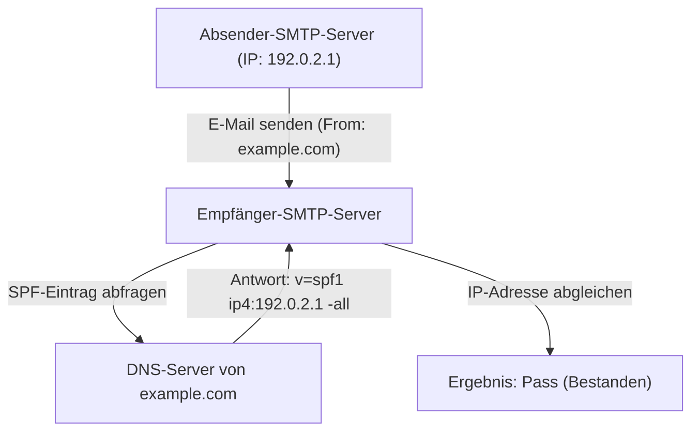
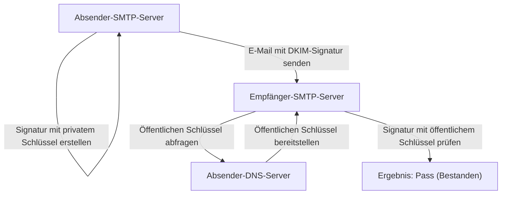

E-Mail ist eines der ältesten und noch immer am weitesten verbreiteten Kommunikationsmittel im Internet. Doch hinter den Kulissen, wenn wir beiläufig auf den Senden-Button klicken, arbeiten mehrere Protokolle (Kommunikationsregeln) komplex zusammen, um sicherzustellen, dass die E-Mail zuverlässig den Empfänger erreicht.

In diesem Artikel erklären wir die gesamte E-Mail-Systemarchitektur aus der Perspektive des Engineerings – von den grundlegenden Protokollen, die das Senden und Empfangen von E-Mails unterstützen (SMTP, IMAP), bis hin zu den Sicherheitstechnologien, die in modernen E-Mail-Systemen unerlässlich geworden sind (SPF, DKIM, DMARC).

## 1. Grundlegende Protokolle zum Senden und Empfangen von E-Mails

Das Senden und Empfangen von E-Mails ist dem Postsystem sehr ähnlich. Genau wie Sie einen Brief in einen Briefkasten werfen und er über das Postamt im Briefkasten des Empfängers landet, durchläuft auch eine E-Mail mehrere Server, um den Empfänger zu erreichen. Die Protokolle SMTP, POP3 und IMAP übernehmen diese Kommunikation.

### SMTP (Simple Mail Transfer Protocol)

SMTP ist das Protokoll zum **Senden und Weiterleiten** von E-Mails.

1. **Senden vom Benutzer zum Server:** Wenn Sie eine E-Mail von einem E-Mail-Client (Outlook, Thunderbird, Apple Mail usw.) senden, wird sie zunächst an den E-Mail-Server (SMTP-Server) gesendet, bei dem Sie registriert sind.
2. **Weiterleitung zwischen Servern:** Der sendende SMTP-Server betrachtet die Domain der Ziel-E-Mail-Adresse (den Teil nach `@example.com`), fragt das DNS (Domain Name System) ab und ermittelt die IP-Adresse des Ziel-E-Mail-Servers. Anschließend leitet er die E-Mail über das Internet an den Ziel-SMTP-Server weiter.

SMTP ist ein sehr einfaches und leistungsstarkes Protokoll, aber aufgrund seines alten Designs bot es ursprünglich keine Authentifizierungs- oder Verschlüsselungsfunktionen. Heute werden SMTPS (SMTP over SSL/TLS) zur Verschlüsselung der Kommunikation und SMTP-AUTH zur Absenderauthentifizierung standardmäßig verwendet.

### IMAP (Internet Message Access Protocol) und POP3 (Post Office Protocol version 3)

IMAP und POP3 sind Protokolle für Empfänger, um E-Mails, die auf dem E-Mail-Server des Empfängers angekommen sind, auf ihren eigenen Geräten zu **lesen**.

- **POP3:** Ein Protokoll, das auf dem Server eingetroffene E-Mails auf das Gerät des Benutzers (PC oder Smartphone) **herunterlädt**. Da heruntergeladene E-Mails im Allgemeinen vom Server gelöscht werden, ist es nicht dafür geeignet, dieselbe Mailbox von mehreren Geräten aus zu verwalten (es ist möglich, sie in den Einstellungen zu behalten, aber sie werden nicht synchronisiert).
- **IMAP:** Ein Protokoll zum **Anzeigen und Verwalten** von E-Mails auf dem Server über das Gerät des Benutzers. Die eigentlichen E-Mails verbleiben auf dem Server, und auch der Lese-/Ungelesen-Status und die Ordnerstruktur werden auf dem Server verwaltet. Daher ist es möglich, von mehreren Geräten wie Smartphones, Tablets und PCs auf dieselbe Mailbox zuzugreifen und sie jederzeit synchron zu halten. IMAP ist heute in modernen E-Mail-Umgebungen der Standard.

## 2. Warum brauchen wir Maßnahmen gegen Spam (Junk-Mail)?

Mit den bisher beschriebenen Mechanismen ist das Senden und Empfangen von E-Mails möglich. Ein grundlegender Schwachpunkt von SMTP ist jedoch, dass es "sehr einfach ist, die Absenderadresse zu fälschen".

Genau wie Sie den Namen einer anderen Person in das Absenderfeld eines Briefes schreiben können, können Sie in SMTP die "From"-Adresse (Von-Adresse) frei festlegen. Dies führte zu einer Flut von Phishing-E-Mails, die sich als Banken oder bekannte Unternehmen ausgaben, sowie zu massenhaftem Spam.

Um dieses "Spoofing" (Vortäuschen einer falschen Identität) zu verhindern und zu beweisen, dass der Absender der E-Mail legitim ist, wurde eine Technologie namens **Sender-Domain-Authentifizierung** eingeführt. Die drei Hauptvertreter sind SPF, DKIM und DMARC.

## 3. SPF (Sender Policy Framework)

SPF ist ein Mechanismus, der die **IP-Adresse** verwendet, um die Legitimität des Absenders zu beweisen.

### Wie SPF funktioniert

1. **Vorbereitung auf Absenderseite (Veröffentlichung von DNS-Einträgen):** Der Inhaber der Domain registriert Informationen, die als "SPF-Eintrag" bezeichnet werden, im DNS seiner Domain. Hier wird eine Liste "legitimer IP-Adressen (oder Server), die berechtigt sind, E-Mails für diese Domain zu senden" beschrieben.
2. **Überprüfung auf Empfängerseite:** Wenn der empfangende E-Mail-Server eine E-Mail erhält, überprüft er die Absender-IP-Adresse der E-Mail. Dann fragt er das DNS der Absender-Domain ab, um den SPF-Eintrag zu erhalten.
3. **Abgleich:** Wenn die tatsächliche Absender-IP-Adresse in der Liste im SPF-Eintrag enthalten ist, wird sie als "legitimer Absender (Pass)" bewertet, andernfalls als "gefälscht (Fail)".

### Einschränkungen von SPF

SPF ist sehr effektiv, hat aber auch Schwächen.
- Wenn E-Mails weitergeleitet (Forwarding) werden, ändert sich die Absender-IP-Adresse zu der des weiterleitenden Servers, wodurch die SPF-Überprüfung fehlschlagen kann.
- Es überprüft das "Envelope From" (den Absender auf Kommunikationsebene), jedoch nicht das "Header From" (den angezeigten Absender), das der Benutzer im E-Mail-Programm sieht.

## 4. DKIM (DomainKeys Identified Mail)

DKIM ist ein Mechanismus, der "**digitale Signaturen (Verschlüsselungstechnologie)**" verwendet, um die Legitimität des Absenders nachzuweisen und sicherzustellen, dass die E-Mail nicht manipuliert wurde.

### Wie DKIM funktioniert

1. **Vorbereitung auf Absenderseite (Registrierung des öffentlichen Schlüssels):** Der Domaininhaber erstellt ein Schlüsselpaar (privater und öffentlicher Schlüssel) und registriert den öffentlichen Schlüssel im DNS der eigenen Domain (DKIM-Eintrag).
2. **Signieren beim Senden:** Beim Senden einer E-Mail berechnet der sendende E-Mail-Server einen Hash-Wert basierend auf einem Teil des E-Mail-Headers und des Textes und verschlüsselt ihn mit dem privaten Schlüssel. Dies wird zur "digitalen Signatur" und wird dem E-Mail-Header (DKIM-Signature) hinzugefügt.
3. **Überprüfung auf Empfängerseite:** Wenn der Empfängerserver eine E-Mail erhält, ruft er den öffentlichen Schlüssel vom DNS der Absenderdomain ab.
4. **Abgleich:** Die digitale Signatur wird mit dem abgerufenen öffentlichen Schlüssel entschlüsselt, um den ursprünglichen Hash-Wert wiederherzustellen. Gleichzeitig berechnet der Server selbst einen Hash-Wert aus den empfangenen E-Mail-Daten und überprüft, ob beide übereinstimmen. Stimmen sie überein, wird die E-Mail als "nicht manipuliert und von einem legitimen Absender mit dem privaten Schlüssel gesendet (Pass)" bewertet.

DKIM schlägt bei Weiterleitungen weniger häufig fehl als SPF und bietet den Vorteil, dass es garantieren kann, dass der Inhalt der E-Mail nicht manipuliert wurde (Integrität).

## 5. DMARC (Domain-based Message Authentication, Reporting, and Conformance)

SPF und DKIM ermöglichten die E-Mail-Authentifizierung, aber einige Probleme blieben bestehen.
- Wenn entweder SPF oder DKIM fehlschlug, gab es keinen einheitlichen Standard dafür, wie der empfangende Server die E-Mail behandeln sollte (in den Spam-Ordner verschieben, abweisen usw.).
- Spoofing, das die Diskrepanz zwischen dem Header From (der Adresse, die der Benutzer sieht) und dem Envelope From (der Adresse, die das System sieht) ausnutzt, konnte nicht vollständig verhindert werden.

Um dies zu lösen und als übergreifende Richtlinie für Authentifizierungstechnologien zu fungieren, wurde **DMARC** eingeführt.

### Die Rolle von DMARC

1. **Alignment-Überprüfung:** DMARC prüft nicht nur die Authentifizierungsergebnisse von SPF und DKIM, sondern auch streng, ob die Domain im "Header From", die der Benutzer tatsächlich sieht, mit der von SPF oder DKIM authentifizierten Domain übereinstimmt (Alignment).
2. **Deklaration von Richtlinien (Policies):** Administratoren von Absender-Domains können einen DMARC-Eintrag im DNS registrieren und der Empfängerseite mitteilen, "wie sie vorgehen soll, wenn eine E-Mail eintrifft, bei der die Authentifizierung (SPF/DKIM) fehlgeschlagen ist".
   - `p=none` : Nichts tun (Überwachungsmodus)
   - `p=quarantine` : In den Spam-Ordner o. Ä. verschieben (Quarantäne)
   - `p=reject` : Empfang ablehnen
3. **Berichtsfunktion:** DMARC verfügt über eine Funktion, mit der empfangende Server Authentifizierungsergebnisberichte an den Administrator der Absender-Domain senden können. Durch die Überprüfung dieser Berichte können Administratoren überwachen, ob ihre Domain missbräuchlich verwendet wird oder ob legitime E-Mails blockiert werden.

Wenn DMARC auf "reject (Ablehnen)" eingestellt ist, werden gefälschte E-Mails zuverlässig blockiert, bevor sie den Empfänger erreichen. Dies kann Schäden durch Phishing-Betrug drastisch reduzieren. In den letzten Jahren haben große E-Mail-Anbieter wie Google (Gmail) und Yahoo! den Druck auf Absender erhöht, DMARC zwingend einzuführen.

## Fazit

Das E-Mail-System begann mit einem einfachen Übertragungsprotokoll und hat sich im Laufe der Zeit zu einem sichereren Kommunikationsmittel entwickelt.

- **SMTP** transportiert die E-Mail, und **IMAP** verwaltet sie in leicht lesbarer Form.
- Um die Schwäche auszugleichen, dass jeder sich als Absender ausgeben kann, beweist **SPF** den Absender anhand der IP-Adresse und **DKIM** mittels digitaler Signaturen.
- Und **DMARC** bündelt diese, erzwingt eine strikte Anwendung und blockiert gefälschte E-Mails.

Das Verständnis dieser Mechanismen ist ein unverzichtbares Wissen für moderne Ingenieure, um ihre eigenen Domains zu schützen und sicherzustellen, dass E-Mails zuverlässig an Benutzer zugestellt werden. Obwohl die E-Mail-Infrastruktur oft unsichtbar ist, sind es diese Technologien, die täglich die Sicherheit unserer Kommunikation gewährleisten.
