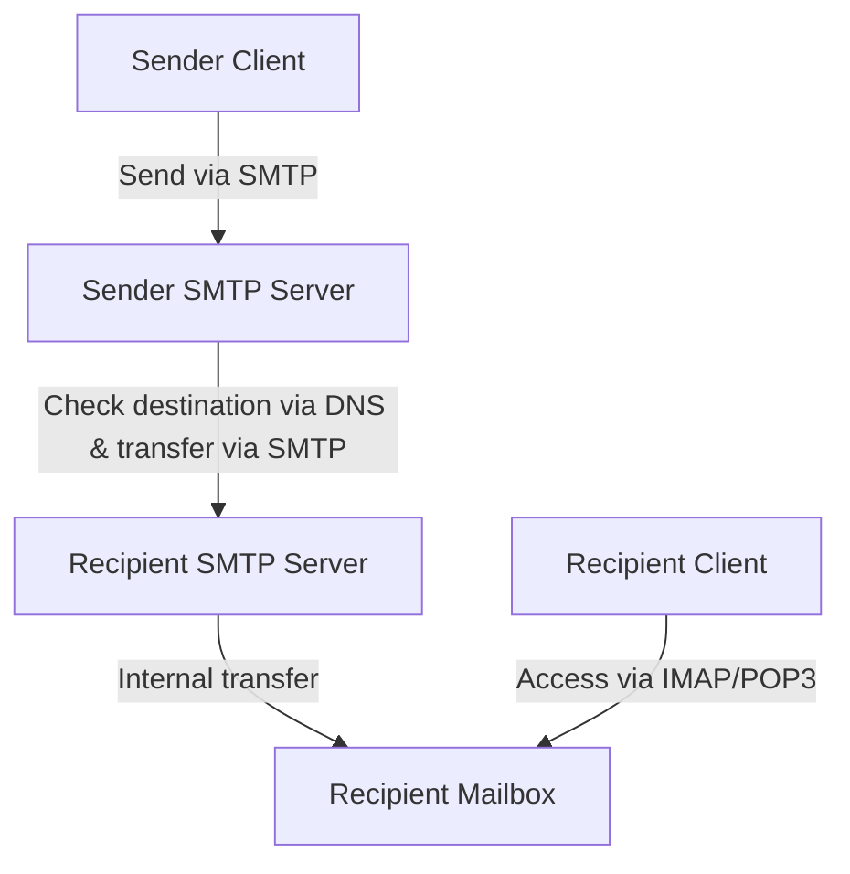
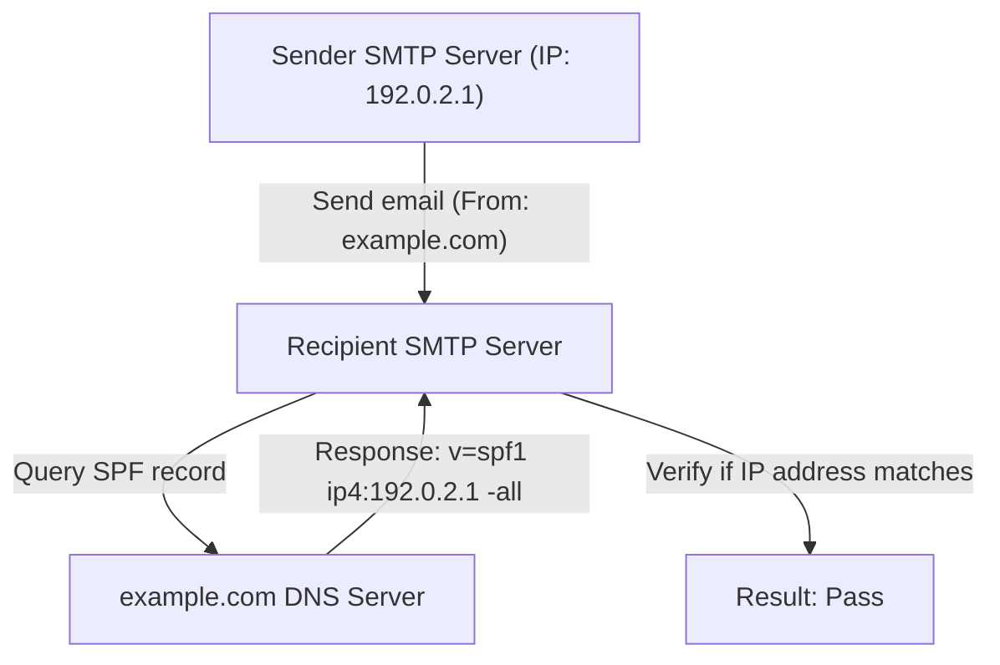
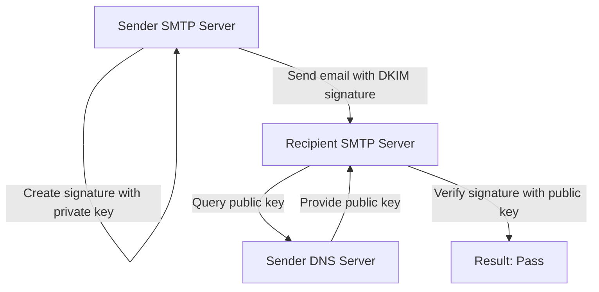

Email is one of the oldest and still most widely used communication methods on the Internet. However, behind the scenes when we casually press the send button, multiple protocols seamlessly interact to ensure the message reliably reaches its destination.

In this article, we will thoroughly explain the big picture of the email system from an engineering perspective, covering the fundamental protocols that support email transmission and reception (SMTP, IMAP) to the security technologies that have become indispensable in modern email systems (SPF, DKIM, DMARC).

## 1. Basic Protocols for Email Transmission and Reception

Sending and receiving email is much like the postal system. Just as you drop a letter into a mailbox and it travels through the post office to reach the recipient's mailbox, an email passes through several servers to reach its recipient. The protocols responsible for this communication are SMTP, POP3, and IMAP.

### SMTP (Simple Mail Transfer Protocol)

SMTP is a protocol used for **sending and routing** emails.

1. **Sending from user to server:** When you send an email from an email client (such as Outlook, Thunderbird, or Apple Mail), it is first sent to your contracted email server (SMTP server).
2. **Routing between servers:** The sending SMTP server looks at the domain of the destination email address (the part after `@example.com`), queries the DNS (Domain Name System) to determine the IP address of the recipient's email server, and then routes the email over the Internet to the destination SMTP server.

SMTP is a very simple and powerful protocol, but due to its old design, it initially lacked authentication and encryption features. Today, SMTPS (SMTP over SSL/TLS) for encrypting communication and SMTP-AUTH for authenticating senders are standard practices.

### IMAP (Internet Message Access Protocol) and POP3 (Post Office Protocol version 3)

IMAP and POP3 are protocols for the recipient to **read** the emails that have arrived at their email server on their device.

- **POP3:** This is a protocol that **downloads** emails from the server to the user's device (PC or smartphone). Since downloaded emails are typically deleted from the server, it is not suitable for managing the same mailbox from multiple devices (you can set it to leave a copy on the server, but they won't be synced).
- **IMAP:** This is a protocol that allows users to **view and manage** emails on the server from their device. The actual emails remain on the server, and read/unread statuses and folder organizations are also managed on the server. Therefore, you can access the same mailbox from multiple devices, such as smartphones, tablets, and PCs, and always keep it synchronized. IMAP is the mainstream in modern email environments.

## 2. Why is Anti-Spam Necessary?

With the mechanisms described above, sending and receiving emails is possible. However, a fundamental weakness of SMTP is the issue that "forging the sender is extremely easy."

Just as anyone can write someone else's name in the sender field of a physical letter, SMTP allows the "From" address to be freely set. As a result, phishing emails impersonating banks or well-known companies and massive amounts of spam have become rampant.

To prevent this "spoofing" and prove that the sender of an email is legitimate, a technology known as **Sender Domain Authentication** was introduced. The three major ones are SPF, DKIM, and DMARC.

## 3. SPF (Sender Policy Framework)

SPF is a mechanism that proves the legitimacy of the sender using the "**IP address**".

### How SPF Works

1. **Sender's Preparation (Publishing DNS Record):** The domain owner registers information called an "SPF record" in their domain's DNS. This record contains a list of "legitimate IP addresses (or servers) authorized to send emails on behalf of this domain."
2. **Recipient's Verification:** When the receiving email server accepts an email, it checks the sender's IP address. It then queries the sender domain's DNS to retrieve the SPF record.
3. **Matching:** If the actual sender IP address is included in the list written in the SPF record, it is judged as a "legitimate sender (Pass)"; if not, it is judged as "spoofing (Fail)".

### Limitations of SPF

While SPF is highly effective, it has weaknesses.
- If email forwarding occurs, the sender IP address changes to that of the forwarding server, which may cause SPF verification to fail.
- It verifies the "Envelope From (sender at the communication level)", but does not verify the "Header From (displayed sender)" that the user sees in their email client.

## 4. DKIM (DomainKeys Identified Mail)

DKIM is a mechanism that proves the sender's legitimacy and that the email has not been tampered with by using a "**digital signature (encryption technology)**".

### How DKIM Works

1. **Sender's Preparation (Registering Public Key):** The domain owner creates a pair of private and public keys and registers the public key in their domain's DNS (DKIM record).
2. **Signing on Send:** When sending an email, the sending email server calculates a hash value based on parts of the email header and body, and encrypts it with the private key. This becomes the "digital signature" and is attached to the email header (DKIM-Signature).
3. **Recipient's Verification:** When the receiving server accepts the email, it retrieves the public key from the sender domain's DNS.
4. **Matching:** It decrypts the digital signature using the retrieved public key to extract the original hash value. At the same time, it calculates a hash value from the received email data itself and verifies whether the two match. If they match, it is judged as "unaltered and sent by a legitimate sender possessing the private key (Pass)".

DKIM is less likely to fail upon forwarding compared to SPF, and its strength lies in guaranteeing that the email content has not been tampered with (integrity).

## 5. DMARC (Domain-based Message Authentication, Reporting, and Conformance)

Although SPF and DKIM made email authentication possible, problems still remained.
- There was no unified standard on how the receiving server should handle an email if either SPF or DKIM failed (whether to put it in the spam folder or reject it outright).
- It could not completely prevent spoofing that exploits the discrepancy between the Header From (the address the user sees) and the Envelope From (the address the system sees).

**DMARC** functions as a policy that resolves these issues and oversees authentication technologies.

### The Role of DMARC

1. **Alignment Verification:** DMARC strictly checks not only the authentication results of SPF and DKIM but also whether the domain in the "Header From" actually seen by the user matches the domain authenticated by SPF or DKIM (Alignment).
2. **Policy Declaration:** The administrator of the sending domain can register a DMARC record in the DNS and instruct the receiving side on "how to handle an email if it fails authentication (SPF/DKIM)."
   - `p=none` : Do nothing (monitoring mode)
   - `p=quarantine` : Put it in the spam folder (quarantine)
   - `p=reject` : Reject the email
3. **Reporting Feature:** DMARC has a feature where the receiving server sends an authentication result report to the sender domain's administrator. By reviewing this, administrators can monitor whether their domain is being misused and ensure legitimate emails are not being blocked.

If DMARC is set to "reject," spoofed emails are powerfully blocked before they reach the recipient, dramatically reducing damages from phishing scams. In recent years, major email providers like Google (Gmail) and Yahoo! have increasingly made DMARC implementation mandatory for senders.

## Conclusion

The email system began with a simple transfer protocol and has evolved into a more secure communication method over time.

- **SMTP** carries the email, and **IMAP** makes it easy to read and manage.
- To compensate for the weakness that anyone can forge a sender, **SPF** proves the source via IP address, and **DKIM** via a digital signature.
- Finally, **DMARC** bundles them together, enforces strict policies, and shuts out spoofed emails.

Understanding these mechanisms is essential knowledge for modern engineers to protect their own domains and ensure emails reliably reach users. Although the email infrastructure is largely unseen, these technologies support the safety of our daily communications.
