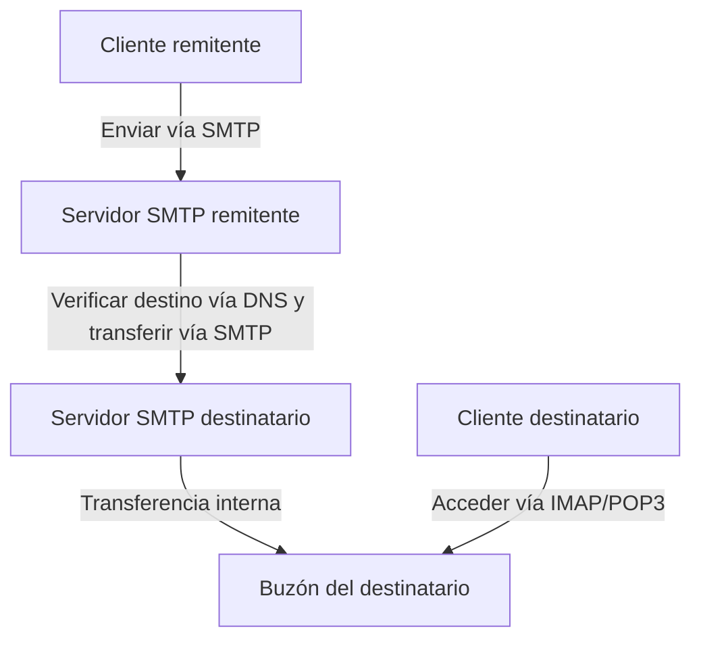
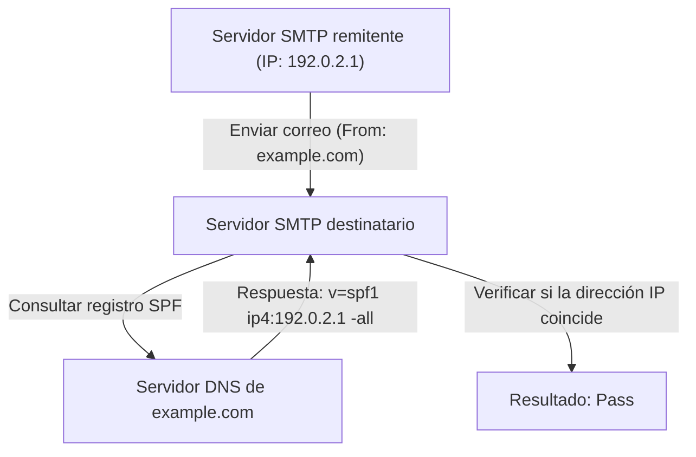
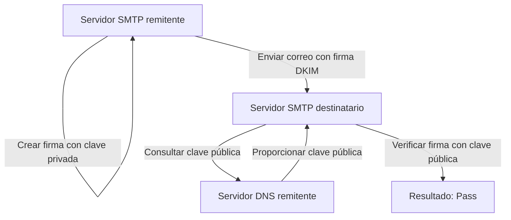

El correo electrónico es uno de los medios de comunicación más antiguos y todavía más utilizados en Internet. Sin embargo, detrás de escena, cuando casualmente presionamos el botón de enviar, múltiples protocolos interactúan de forma compleja para garantizar que el mensaje llegue de manera confiable a su destinatario.

En este artículo, explicaremos detalladamente el panorama general del sistema de correo electrónico desde una perspectiva de ingeniería, cubriendo desde los protocolos fundamentales que respaldan la transmisión y recepción de correos (SMTP, IMAP) hasta las tecnologías de seguridad que se han vuelto indispensables en los sistemas de correo modernos (SPF, DKIM, DMARC).

## 1. Protocolos básicos para la transmisión y recepción de correos

Enviar y recibir correos es muy similar al sistema postal. Al igual que depositas una carta en un buzón y viaja a través de la oficina de correos para llegar al buzón del destinatario, un correo electrónico pasa por varios servidores para llegar a su destino. Los protocolos responsables de esta comunicación son SMTP, POP3 e IMAP.

### SMTP (Simple Mail Transfer Protocol)

SMTP es un protocolo utilizado para **enviar y enrutar** correos electrónicos.

1. **Envío desde el usuario al servidor:** Cuando envías un correo desde un cliente de correo (como Outlook, Thunderbird o Apple Mail), primero se envía al servidor de correo que tienes contratado (servidor SMTP).
2. **Enrutamiento entre servidores:** El servidor SMTP emisor observa el dominio de la dirección de correo de destino (la parte después de `@example.com`), consulta el DNS (Domain Name System) para determinar la dirección IP del servidor de correo del destinatario y luego enruta el correo a través de Internet hacia el servidor SMTP de destino.

SMTP es un protocolo muy simple y potente, pero debido a su antiguo diseño, inicialmente carecía de funciones de autenticación y cifrado. Hoy en día, SMTPS (SMTP sobre SSL/TLS) para cifrar la comunicación y SMTP-AUTH para autenticar a los remitentes son estándares habituales.

### IMAP (Internet Message Access Protocol) y POP3 (Post Office Protocol version 3)

IMAP y POP3 son protocolos para que el destinatario **lea** los correos que han llegado a su servidor de correo desde su dispositivo.

- **POP3:** Es un protocolo que **descarga** los correos del servidor al dispositivo del usuario (PC o smartphone). Dado que los correos descargados normalmente se eliminan del servidor, no es adecuado para gestionar el mismo buzón desde múltiples dispositivos (puedes configurarlo para dejar una copia en el servidor, pero no estarán sincronizados).
- **IMAP:** Es un protocolo que permite a los usuarios **ver y gestionar** los correos en el servidor desde su dispositivo. Los correos reales permanecen en el servidor, y los estados de leído/no leído y la organización en carpetas también se gestionan en el servidor. Por lo tanto, puedes acceder al mismo buzón desde múltiples dispositivos, como smartphones, tablets y PCs, y mantenerlo siempre sincronizado. IMAP es la norma en los entornos de correo electrónico modernos.

## 2. ¿Por qué es necesario el antispam?

Con los mecanismos descritos anteriormente, enviar y recibir correos es posible. Sin embargo, una debilidad fundamental de SMTP es el problema de que "falsificar al remitente es extremadamente fácil".

Al igual que cualquiera puede escribir el nombre de otra persona en el campo del remitente de una carta física, SMTP permite establecer libremente la dirección "From" (De). Como resultado, los correos de phishing que se hacen pasar por bancos o empresas conocidas y las cantidades masivas de spam se han vuelto rampantes.

Para prevenir esta "suplantación de identidad" y demostrar que el remitente de un correo es legítimo, se introdujo una tecnología conocida como **Autenticación del Dominio del Remitente**. Las tres principales son SPF, DKIM y DMARC.

## 3. SPF (Sender Policy Framework)

SPF es un mecanismo que prueba la legitimidad del remitente utilizando la "**dirección IP**".

### Cómo funciona SPF

1. **Preparación del remitente (Publicación del registro DNS):** El propietario del dominio registra información llamada "registro SPF" en el DNS de su dominio. Este registro contiene una lista de "direcciones IP (o servidores) legítimos autorizados para enviar correos en nombre de este dominio".
2. **Verificación del destinatario:** Cuando el servidor de correo receptor acepta un correo, comprueba la dirección IP del remitente. Luego consulta el DNS del dominio del remitente para recuperar el registro SPF.
3. **Comprobación:** Si la dirección IP del remitente real está incluida en la lista escrita en el registro SPF, se considera un "remitente legítimo (Pass)"; de lo contrario, se considera "suplantación (Fail)".

### Limitaciones de SPF

Si bien SPF es muy efectivo, tiene debilidades.
- Si se produce el desvío de correos (forwarding), la dirección IP del remitente cambia a la del servidor de desvío, lo que puede causar que la verificación de SPF falle.
- Verifica el "Envelope From" (remitente en el nivel de comunicación), pero no verifica el "Header From" (remitente mostrado) que el usuario ve en su cliente de correo.

## 4. DKIM (DomainKeys Identified Mail)

DKIM es un mecanismo que prueba la legitimidad del remitente y que el correo no ha sido alterado mediante el uso de una "**firma digital (tecnología de cifrado)**".

### Cómo funciona DKIM

1. **Preparación del remitente (Registro de clave pública):** El propietario del dominio crea un par de claves pública y privada y registra la clave pública en el DNS de su dominio (registro DKIM).
2. **Firma al enviar:** Al enviar un correo, el servidor de correo emisor calcula un valor hash basado en partes del encabezado y el cuerpo del correo, y lo cifra con la clave privada. Esto se convierte en la "firma digital" y se adjunta al encabezado del correo (DKIM-Signature).
3. **Verificación del destinatario:** Cuando el servidor receptor acepta el correo, recupera la clave pública del DNS del dominio del remitente.
4. **Comprobación:** Descifra la firma digital utilizando la clave pública recuperada para extraer el valor hash original. Al mismo tiempo, calcula un valor hash a partir de los datos del correo recibido y verifica si los dos coinciden. Si coinciden, se considera "inalterado y enviado por un remitente legítimo que posee la clave privada (Pass)".

Es menos probable que DKIM falle al desviar correos en comparación con SPF, y su fortaleza radica en garantizar que el contenido del correo no ha sido alterado (integridad).

## 5. DMARC (Domain-based Message Authentication, Reporting, and Conformance)

Aunque SPF y DKIM hicieron posible la autenticación de correos electrónicos, aún quedaban problemas.
- No existía un estándar unificado sobre cómo debía manejar el servidor receptor un correo si fallaba SPF o DKIM (ya sea ponerlo en la carpeta de spam o rechazarlo por completo).
- No podía prevenir completamente la suplantación que explota la discrepancia entre el Header From (la dirección que ve el usuario) y el Envelope From (la dirección que ve el sistema).

**DMARC** funciona como una política que resuelve estos problemas y supervisa las tecnologías de autenticación.

### El papel de DMARC

1. **Verificación de alineación (Alignment):** DMARC comprueba estrictamente no solo los resultados de autenticación de SPF y DKIM, sino también si el dominio en el "Header From" que el usuario realmente ve coincide con el dominio autenticado por SPF o DKIM (Alineación).
2. **Declaración de política:** El administrador del dominio emisor puede registrar un registro DMARC en el DNS e instruir al lado receptor sobre "cómo manejar un correo si falla la autenticación (SPF/DKIM)".
   - `p=none` : No hacer nada (modo de monitoreo)
   - `p=quarantine` : Ponerlo en la carpeta de spam (cuarentena)
   - `p=reject` : Rechazar el correo
3. **Función de informes:** DMARC tiene una función donde el servidor receptor envía un informe de los resultados de autenticación al administrador del dominio emisor. Al revisar esto, los administradores pueden monitorear si su dominio está siendo utilizado indebidamente y asegurarse de que los correos legítimos no sean bloqueados.

Si DMARC está configurado en "reject" (rechazar), los correos falsificados son bloqueados fuertemente antes de que lleguen al destinatario, reduciendo drásticamente los daños por estafas de phishing. En los últimos años, los principales proveedores de correo como Google (Gmail) y Yahoo! han hecho que la implementación de DMARC sea obligatoria para los remitentes.

## Conclusión

El sistema de correo electrónico comenzó con un protocolo de transferencia simple y ha evolucionado hacia un método de comunicación más seguro con el tiempo.

- **SMTP** transporta el correo e **IMAP** facilita su lectura y gestión.
- Para compensar la debilidad de que cualquiera puede falsificar un remitente, **SPF** demuestra la fuente a través de la dirección IP, y **DKIM** a través de una firma digital.
- Finalmente, **DMARC** los agrupa, impone políticas estrictas y bloquea los correos falsificados.

Comprender estos mecanismos es un conocimiento esencial para los ingenieros modernos a fin de proteger sus propios dominios y garantizar que los correos lleguen de forma fiable a los usuarios. Aunque la infraestructura de correo electrónico es en gran parte invisible, estas tecnologías respaldan la seguridad de nuestras comunicaciones diarias.
