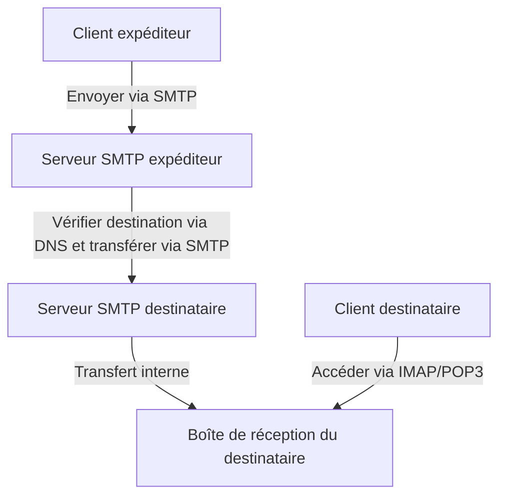
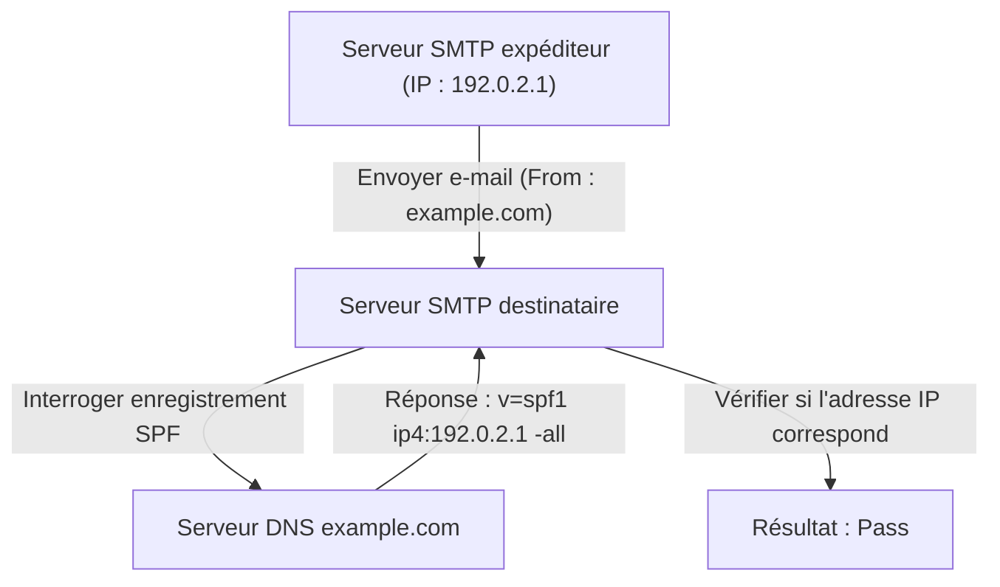
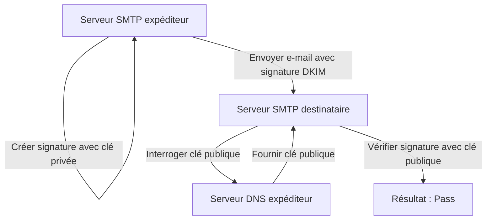

L'e-mail est l'un des moyens de communication les plus anciens et toujours les plus largement utilisés sur Internet. Cependant, en coulisses, lorsque nous cliquons nonchalamment sur le bouton d'envoi, de multiples protocoles interagissent de manière complexe pour garantir que le message parvienne de façon fiable à son destinataire.

Dans cet article, nous expliquerons en détail la vue d'ensemble du système de messagerie électronique du point de vue de l'ingénierie, des protocoles fondamentaux qui soutiennent la transmission et la réception des e-mails (SMTP, IMAP) aux technologies de sécurité devenues indispensables dans les systèmes de messagerie modernes (SPF, DKIM, DMARC).

## 1. Protocoles de base pour l'envoi et la réception d'e-mails

L'envoi et la réception d'e-mails ressemblent beaucoup au système postal. Tout comme vous déposez une lettre dans une boîte aux lettres et qu'elle passe par le bureau de poste pour atteindre la boîte aux lettres du destinataire, un e-mail passe par plusieurs serveurs pour atteindre son destinataire. Les protocoles responsables de cette communication sont SMTP, POP3 et IMAP.

### SMTP (Simple Mail Transfer Protocol)

SMTP est un protocole utilisé pour **envoyer et router** les e-mails.

1. **Envoi de l'utilisateur au serveur :** Lorsque vous envoyez un e-mail depuis un client de messagerie (comme Outlook, Thunderbird ou Apple Mail), il est d'abord envoyé à votre serveur de messagerie contracté (serveur SMTP).
2. **Routage entre serveurs :** Le serveur SMTP expéditeur regarde le domaine de l'adresse e-mail de destination (la partie après le `@example.com`), interroge le DNS (Domain Name System) pour déterminer l'adresse IP du serveur de messagerie du destinataire, puis achemine l'e-mail via Internet vers le serveur SMTP de destination.

SMTP est un protocole très simple et puissant, mais en raison de sa conception ancienne, il manquait initialement de fonctionnalités d'authentification et de chiffrement. Aujourd'hui, le SMTPS (SMTP sur SSL/TLS) pour le chiffrement des communications et le SMTP-AUTH pour l'authentification des expéditeurs sont des pratiques standard.

### IMAP (Internet Message Access Protocol) et POP3 (Post Office Protocol version 3)

IMAP et POP3 sont des protocoles permettant au destinataire de **lire** les e-mails arrivés sur son serveur de messagerie depuis son appareil.

- **POP3 :** C'est un protocole qui **télécharge** les e-mails du serveur vers l'appareil de l'utilisateur (PC ou smartphone). Comme les e-mails téléchargés sont généralement supprimés du serveur, il n'est pas adapté à la gestion de la même boîte de réception depuis plusieurs appareils (vous pouvez le configurer pour laisser une copie sur le serveur, mais ils ne seront pas synchronisés).
- **IMAP :** C'est un protocole qui permet aux utilisateurs de **consulter et gérer** les e-mails sur le serveur depuis leur appareil. Les e-mails réels restent sur le serveur, et les statuts lu/non lu ainsi que l'organisation des dossiers y sont également gérés. Ainsi, vous pouvez accéder à la même boîte de réception depuis plusieurs appareils, tels que des smartphones, des tablettes et des PC, et la garder toujours synchronisée. IMAP est la norme dans les environnements de messagerie modernes.

## 2. Pourquoi l'anti-spam est-il nécessaire ?

Avec les mécanismes décrits ci-dessus, l'envoi et la réception d'e-mails sont possibles. Cependant, une faiblesse fondamentale du protocole SMTP est qu'il est "extrêmement facile de falsifier l'expéditeur".

Tout comme n'importe qui peut écrire le nom de quelqu'un d'autre dans le champ de l'expéditeur d'une lettre physique, SMTP permet de définir librement l'adresse "From" (De). En conséquence, les e-mails de hameçonnage (phishing) usurpant l'identité de banques ou d'entreprises connues et les quantités massives de spam sont devenus endémiques.

Pour empêcher cette "usurpation d'identité" et prouver que l'expéditeur d'un e-mail est légitime, une technologie connue sous le nom d'**Authentification du Domaine de l'Expéditeur** a été introduite. Les trois principales sont SPF, DKIM et DMARC.

## 3. SPF (Sender Policy Framework)

Le SPF est un mécanisme qui prouve la légitimité de l'expéditeur en utilisant l'"**adresse IP**".

### Comment fonctionne le SPF

1. **Préparation de l'expéditeur (Publication de l'enregistrement DNS) :** Le propriétaire du domaine enregistre des informations appelées "enregistrement SPF" dans le DNS de son domaine. Cet enregistrement contient une liste d'"adresses IP (ou serveurs) légitimes autorisés à envoyer des e-mails au nom de ce domaine".
2. **Vérification par le destinataire :** Lorsque le serveur de messagerie récepteur accepte un e-mail, il vérifie l'adresse IP de l'expéditeur. Ensuite, il interroge le DNS du domaine de l'expéditeur pour récupérer l'enregistrement SPF.
3. **Vérification de concordance :** Si l'adresse IP de l'expéditeur réel est incluse dans la liste écrite dans l'enregistrement SPF, il est jugé comme un "expéditeur légitime (Pass)" ; sinon, il est considéré comme une "usurpation (Fail)".

### Limites du SPF

Bien que le SPF soit très efficace, il présente des faiblesses.
- Si un transfert d'e-mail (forwarding) se produit, l'adresse IP de l'expéditeur devient celle du serveur de transfert, ce qui peut faire échouer la vérification SPF.
- Il vérifie l'"Envelope From" (l'expéditeur au niveau de la communication), mais ne vérifie pas le "Header From" (l'expéditeur affiché) que l'utilisateur voit dans son client de messagerie.

## 4. DKIM (DomainKeys Identified Mail)

DKIM est un mécanisme qui prouve la légitimité de l'expéditeur et que l'e-mail n'a pas été falsifié en utilisant une "**signature numérique (technologie de chiffrement)**".

### Comment fonctionne le DKIM

1. **Préparation de l'expéditeur (Enregistrement de la clé publique) :** Le propriétaire du domaine crée une paire de clés publique et privée et enregistre la clé publique dans le DNS de son domaine (enregistrement DKIM).
2. **Signature lors de l'envoi :** Lors de l'envoi d'un e-mail, le serveur de messagerie expéditeur calcule une valeur de hachage basée sur des parties de l'en-tête et du corps de l'e-mail, et la chiffre avec la clé privée. Cela devient la "signature numérique" et est joint à l'en-tête de l'e-mail (DKIM-Signature).
3. **Vérification par le destinataire :** Lorsque le serveur de réception accepte l'e-mail, il récupère la clé publique à partir du DNS du domaine de l'expéditeur.
4. **Vérification de concordance :** Il déchiffre la signature numérique en utilisant la clé publique récupérée pour extraire la valeur de hachage d'origine. En même temps, il calcule une valeur de hachage à partir des données de l'e-mail reçu lui-même et vérifie si les deux correspondent. S'ils correspondent, l'e-mail est jugé comme "non falsifié et envoyé par un expéditeur légitime possédant la clé privée (Pass)".

Le DKIM est moins susceptible d'échouer lors du transfert par rapport au SPF, et sa force réside dans la garantie que le contenu de l'e-mail n'a pas été altéré (intégrité).

## 5. DMARC (Domain-based Message Authentication, Reporting, and Conformance)

Bien que SPF et DKIM aient rendu possible l'authentification des e-mails, des problèmes persistaient.
- Il n'y avait pas de norme unifiée sur la façon dont le serveur de réception devait traiter un e-mail si le SPF ou le DKIM échouait (s'il fallait le mettre dans le dossier spam ou le rejeter complètement).
- Il ne pouvait pas empêcher totalement l'usurpation d'identité qui exploite l'écart entre le Header From (l'adresse que l'utilisateur voit) et l'Envelope From (l'adresse que le système voit).

**DMARC** fonctionne comme une politique qui résout ces problèmes et supervise les technologies d'authentification.

### Le rôle de DMARC

1. **Vérification de l'alignement (Alignment) :** DMARC vérifie strictement non seulement les résultats d'authentification de SPF et DKIM, mais aussi si le domaine dans le "Header From" réellement vu par l'utilisateur correspond au domaine authentifié par SPF ou DKIM (Alignement).
2. **Déclaration de politique :** L'administrateur du domaine expéditeur peut enregistrer un enregistrement DMARC dans le DNS et indiquer au côté destinataire "comment traiter un e-mail s'il échoue à l'authentification (SPF/DKIM)".
   - `p=none` : Ne rien faire (mode surveillance)
   - `p=quarantine` : Mettre dans le dossier spam (quarantaine)
   - `p=reject` : Rejeter l'e-mail
3. **Fonctionnalité de rapport :** DMARC dispose d'une fonctionnalité où le serveur de réception envoie un rapport de résultat d'authentification à l'administrateur du domaine expéditeur. En examinant cela, les administrateurs peuvent surveiller si leur domaine est utilisé à mauvais escient et s'assurer que les e-mails légitimes ne sont pas bloqués.

Si DMARC est défini sur "reject", les e-mails falsifiés sont puissamment bloqués avant d'atteindre le destinataire, réduisant considérablement les dommages liés aux escroqueries par hameçonnage. Ces dernières années, les principaux fournisseurs de messagerie tels que Google (Gmail) et Yahoo! ont rendu obligatoire la mise en œuvre de DMARC pour les expéditeurs.

## Conclusion

Le système de messagerie a commencé avec un simple protocole de transfert et a évolué vers une méthode de communication plus sécurisée au fil du temps.

- **SMTP** transporte l'e-mail, et **IMAP** facilite sa lecture et sa gestion.
- Pour pallier la faiblesse selon laquelle quiconque peut falsifier un expéditeur, le **SPF** prouve la source via l'adresse IP, et le **DKIM** via une signature numérique.
- Enfin, **DMARC** les regroupe, impose des politiques strictes et bloque les e-mails usurpés.

Comprendre ces mécanismes est une connaissance essentielle pour les ingénieurs modernes afin de protéger leurs propres domaines et de garantir que les e-mails parviennent de manière fiable aux utilisateurs. Bien que l'infrastructure de messagerie soit en grande partie invisible, ces technologies soutiennent la sécurité de nos communications quotidiennes.
