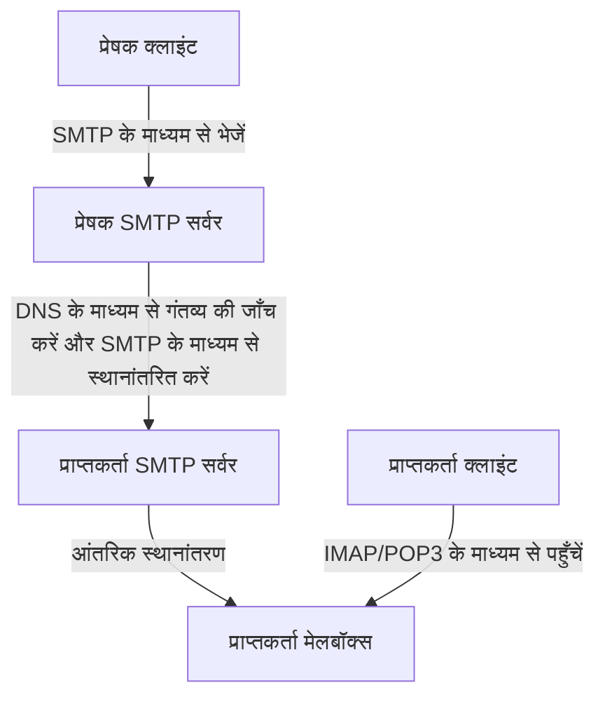
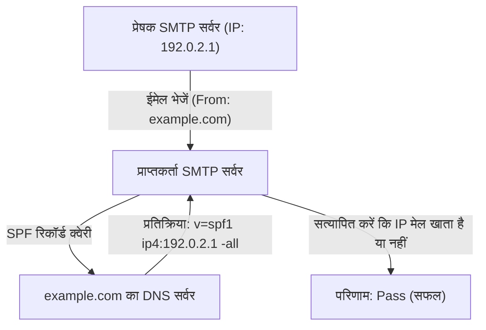
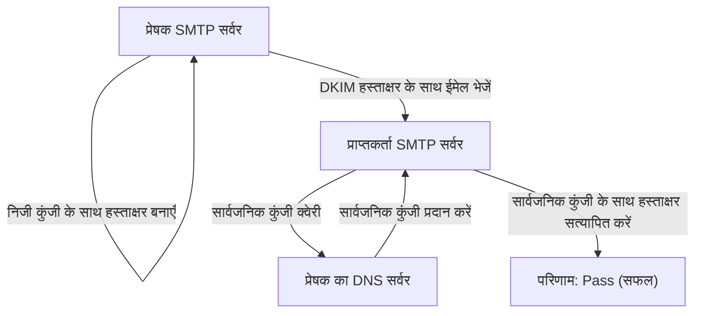

ईमेल इंटरनेट पर संचार के सबसे पुराने तरीकों में से एक है, और यह आज भी सबसे व्यापक रूप से उपयोग किया जाता है। हालाँकि, जब हम बस सेंड (send) बटन दबाते हैं, तो पर्दे के पीछे कई प्रोटोकॉल (संचार नियम) यह सुनिश्चित करने के लिए जटिल तरीके से एक साथ काम करते हैं कि ईमेल प्राप्तकर्ता तक मज़बूती से पहुँचाया जा सके।

यह लेख भेजने और प्राप्त करने वाले प्रोटोकॉल (SMTP, IMAP) के बुनियादी तंत्र से लेकर सुरक्षा तकनीकों (SPF, DKIM, DMARC) तक, जो आधुनिक ईमेल प्रणालियों में अपरिहार्य हो गए हैं, इंजीनियरिंग दृष्टिकोण से समग्र ईमेल प्रणाली को व्यापक रूप से समझाएगा।

## 1. ईमेल भेजने और प्राप्त करने के लिए बुनियादी प्रोटोकॉल

ईमेल भेजना और प्राप्त करना डाक सेवा के काम करने के तरीके के समान है। जिस तरह आप एक पत्र को पोस्टबॉक्स में डालते हैं और उसे डाकघर के माध्यम से प्राप्तकर्ता के मेलबॉक्स में पहुँचाया जाता है, उसी तरह एक ईमेल भी अपने गंतव्य तक पहुँचने से पहले कई सर्वरों से होकर गुज़रता है। इस संचार को SMTP, POP3, और IMAP जैसे प्रोटोकॉल द्वारा संभाला जाता है।

### SMTP (Simple Mail Transfer Protocol)

SMTP ईमेल को **भेजने और स्थानांतरित** करने का एक प्रोटोकॉल है।

1. **उपयोगकर्ता से सर्वर को भेजना:** जब आप ईमेल क्लाइंट (जैसे Outlook, Thunderbird, या Apple Mail) से ईमेल भेजते हैं, तो यह पहले आपके ईमेल सर्वर (SMTP सर्वर) पर भेजा जाता है।
2. **सर्वरों के बीच स्थानांतरण:** प्रेषक (sender) का SMTP सर्वर गंतव्य ईमेल पते के डोमेन (`@example.com` वाला भाग) को देखता है, और प्राप्तकर्ता के ईमेल सर्वर का IP पता निर्धारित करने के लिए DNS (डोमेन नेम सिस्टम) को क्वेरी (query) करता है। फिर यह इंटरनेट के माध्यम से ईमेल को प्राप्तकर्ता के SMTP सर्वर पर स्थानांतरित करता है।

SMTP एक बहुत ही सरल और शक्तिशाली प्रोटोकॉल है, लेकिन इसके पुराने डिज़ाइन के कारण, इसमें शुरू में प्रमाणीकरण (authentication) या एन्क्रिप्शन (encryption) सुविधाएँ नहीं थीं। आज, संचार को एन्क्रिप्ट करने के लिए SMTPS (SMTP over SSL/TLS), और प्रेषक को प्रमाणित करने के लिए SMTP-AUTH का मानक रूप से उपयोग किया जाता है।

### IMAP (Internet Message Access Protocol) और POP3 (Post Office Protocol version 3)

IMAP और POP3 ऐसे प्रोटोकॉल हैं जिनका उपयोग प्राप्तकर्ताओं द्वारा उन ईमेल को **पढ़ने** के लिए किया जाता है जो उनके अपने उपकरणों पर उनके ईमेल सर्वर पर आ गए हैं।

- **POP3:** यह सर्वर पर आए ईमेल को उपयोगकर्ता के उपकरण (PC या स्मार्टफोन) पर **डाउनलोड** करने का प्रोटोकॉल है। चूँकि डाउनलोड किए गए ईमेल आमतौर पर सर्वर से हटा दिए जाते हैं, यह प्रोटोकॉल कई उपकरणों से एक ही मेलबॉक्स को प्रबंधित करने के लिए उपयुक्त नहीं है (हालाँकि कुछ सेटिंग्स के साथ उन्हें रखना संभव है, लेकिन वे सिंक नहीं होंगे)।
- **IMAP:** यह उपयोगकर्ता के उपकरण से सर्वर पर ईमेल को **देखने और प्रबंधित** करने का प्रोटोकॉल है। वास्तविक ईमेल सर्वर पर ही रहते हैं, और पढ़े/अनपढ़े (read/unread) स्थिति, फ़ोल्डर संगठन, आदि को सर्वर पर प्रबंधित किया जाता है। इसलिए, आप स्मार्टफोन, टैबलेट और PC जैसे कई उपकरणों से एक ही मेलबॉक्स तक पहुँच सकते हैं, और उन्हें हमेशा सिंक (sync) रख सकते हैं। वर्तमान ईमेल वातावरण में, IMAP मुख्य मानक बन गया है।

## 2. स्पैम सुरक्षा (Spam Protection) क्यों आवश्यक है?

उपरोक्त तंत्र के साथ, ईमेल भेजना और प्राप्त करना संभव है। हालाँकि, SMTP की एक मूलभूत कमज़ोरी यह समस्या है कि "प्रेषक की पहचान को जाली (spoof) बनाना बहुत आसान है।"

जिस तरह आप किसी पत्र के प्रेषक फ़ील्ड में किसी दूसरे का नाम स्वतंत्र रूप से लिख सकते हैं, उसी तरह आप SMTP में "From" पते को स्वतंत्र रूप से सेट कर सकते हैं। इसके कारण बैंकों या प्रसिद्ध कंपनियों का रूप धारण करने वाले फ़िशिंग ईमेल, और बड़ी मात्रा में स्पैम ईमेल का प्रसार हुआ है।

इस "स्पूफिंग" (spoofing) को रोकने और यह साबित करने के लिए कि ईमेल का प्रेषक वैध है, **प्रेषक डोमेन प्रमाणीकरण (Sender Domain Authentication)** नामक एक तकनीक पेश की गई थी। इसके तीन मुख्य प्रतिनिधि SPF, DKIM, और DMARC हैं।

## 3. SPF (Sender Policy Framework)

SPF एक तंत्र है जो "**IP पते**" का उपयोग करके प्रेषक की वैधता साबित करता है।

### SPF कैसे काम करता है

1. **प्रेषक की तैयारी (DNS रिकॉर्ड प्रकाशित करना):** डोमेन स्वामी अपने डोमेन के DNS में "SPF रिकॉर्ड" नामक जानकारी पंजीकृत करता है। इसमें "अधिकृत IP पते (या सर्वर) की सूची शामिल होती है जिन्हें इस डोमेन से ईमेल भेजने की अनुमति है।"
2. **प्राप्तकर्ता का सत्यापन:** जब प्राप्तकर्ता का ईमेल सर्वर कोई ईमेल प्राप्त करता है, तो वह प्रेषक के IP पते की जाँच करता है। इसके बाद, यह प्रेषक के डोमेन के DNS को क्वेरी करता है और SPF रिकॉर्ड प्राप्त करता है।
3. **मिलान (Matching):** यदि प्रेषक का वास्तविक IP पता SPF रिकॉर्ड की सूची में शामिल है, तो इसे "वैध प्रेषक (Pass)" के रूप में आंका जाता है, और यदि यह शामिल नहीं है, तो इसे "स्पूफिंग (Fail)" के रूप में आंका जाता है।

### SPF की सीमाएँ

SPF बहुत प्रभावी है, लेकिन इसकी कुछ कमज़ोरियाँ भी हैं।
- यदि ईमेल अग्रेषण (Forwarding) होता है, तो प्रेषक का IP पता अग्रेषण सर्वर के IP पते में बदल जाता है, जिससे SPF सत्यापन विफल हो सकता है।
- SPF "Envelope From" (संचार स्तर पर प्रेषक) को सत्यापित करता है, और यह "Header From" (प्रदर्शित प्रेषक) को सत्यापित नहीं करता है जिसे उपयोगकर्ता अपने ईमेल क्लाइंट में देखते हैं।

## 4. DKIM (DomainKeys Identified Mail)

DKIM प्रेषक की वैधता साबित करने और यह सुनिश्चित करने का एक तंत्र है कि ईमेल के साथ छेड़छाड़ नहीं की गई है, इसके लिए "**डिजिटल हस्ताक्षर (एन्क्रिप्शन तकनीक)**" का उपयोग किया जाता है।

### DKIM कैसे काम करता है

1. **प्रेषक की तैयारी (सार्वजनिक कुंजी पंजीकरण):** डोमेन स्वामी एक निजी कुंजी (private key) और सार्वजनिक कुंजी (public key) का जोड़ा बनाता है, और फिर अपने स्वयं के डोमेन के DNS में सार्वजनिक कुंजी पंजीकृत करता है (DKIM रिकॉर्ड)।
2. **भेजते समय हस्ताक्षर करना:** ईमेल भेजते समय, प्रेषक का ईमेल सर्वर हेडर और सामग्री के हिस्सों के आधार पर एक हैश (hash) मान की गणना करता है, और फिर इसे निजी कुंजी के साथ एन्क्रिप्ट करता है। यह एक "डिजिटल हस्ताक्षर" बन जाता है और ईमेल हेडर (DKIM-Signature) से जुड़ जाता है।
3. **प्राप्तकर्ता का सत्यापन:** जब प्राप्तकर्ता सर्वर ईमेल प्राप्त करता है, तो वह प्रेषक के डोमेन के DNS से सार्वजनिक कुंजी प्राप्त करता है।
4. **मिलान:** यह प्राप्त सार्वजनिक कुंजी का उपयोग करके डिजिटल हस्ताक्षर को डिक्रिप्ट करता है और मूल हैश मान निकालता है। साथ ही, यह स्वतंत्र रूप से प्राप्त ईमेल डेटा से हैश मान की गणना करता है और सत्यापित करता है कि दोनों मेल खाते हैं या नहीं। यदि वे मेल खाते हैं, तो इसे इस प्रकार आंका जाएगा "छेड़छाड़ नहीं की गई और निजी कुंजी रखने वाले एक वैध प्रेषक द्वारा भेजा गया (Pass)"।

DKIM को SPF पर यह लाभ है कि मेल अग्रेषित (forward) किए जाने पर यह आसानी से विफल नहीं होता है, और यह भी गारंटी देता है कि ईमेल सामग्री को संशोधित नहीं किया गया है (अखंडता/Integrity)।

## 5. DMARC (Domain-based Message Authentication, Reporting, and Conformance)

SPF और DKIM ने ईमेल प्रमाणीकरण की अनुमति दी, लेकिन फिर भी कुछ समस्याएँ बनी रहीं।
- यदि SPF या DKIM में से कोई एक विफल रहता है, तो प्राप्तकर्ता सर्वर को उस ईमेल को कैसे संभालना चाहिए (क्या इसे स्पैम फ़ोल्डर में रखा जाना चाहिए या अस्वीकार कर दिया जाना चाहिए) इस बारे में कोई समान मानक नहीं था।
- इसने पूरी तरह से उस स्पूफिंग को नहीं रोका जिसने Header From (वह पता जिसे उपयोगकर्ता देखता है) और Envelope From (वह पता जिसे सिस्टम देखता है) के बीच के अंतर का फ़ायदा उठाया।

इन समस्याओं को हल करने और प्रमाणीकरण तकनीकों की देखरेख करने वाली नीति के रूप में कार्य करने के लिए, **DMARC** का उपयोग किया जाता है।

### DMARC की भूमिका

1. **संरेखण (Alignment) सत्यापन:** DMARC कड़ाई से न केवल SPF और DKIM प्रमाणीकरण परिणामों की जाँच करता है, बल्कि यह भी जाँचता है कि क्या उपयोगकर्ता द्वारा देखा गया "Header From" डोमेन वास्तव में SPF या DKIM द्वारा प्रमाणित डोमेन से मेल खाता है (संरेखण)।
2. **नीति घोषणा (Policy declaration):** प्रेषक डोमेन का व्यवस्थापक DNS में DMARC रिकॉर्ड पंजीकृत करता है और प्राप्त करने वाले पक्ष को निर्देश दे सकता है कि "यदि प्रमाणीकरण (SPF/DKIM) विफल हो जाता है तो ईमेल को कैसे संभालना है।"
   - `p=none` : कुछ न करें (निगरानी मोड)
   - `p=quarantine` : स्पैम फ़ोल्डर आदि में रखें (संगरोध/Quarantine)
   - `p=reject` : ईमेल अस्वीकार करें
3. **रिपोर्टिंग सुविधा:** DMARC में एक ऐसी सुविधा है जहाँ प्राप्तकर्ता सर्वर प्रेषक डोमेन व्यवस्थापक को प्रमाणीकरण परिणामों के बारे में रिपोर्ट भेजता है। इसे देखकर, व्यवस्थापक निगरानी कर सकता है कि क्या उनके डोमेन का दुर्भावनापूर्ण रूप से उपयोग किया गया है या क्या वैध ईमेल ब्लॉक किए गए हैं।

यदि DMARC को "reject" (अस्वीकार) पर सेट किया गया है, तो जाली ईमेल उपयोगकर्ताओं तक पहुँचने से पहले ही दृढ़ता से ब्लॉक कर दिए जाते हैं, जिससे फ़िशिंग घोटाले जैसे नुकसान में भारी कमी आती है। हाल ही में, Google (Gmail) और Yahoo! जैसे प्रमुख ईमेल प्रदाताओं ने प्रेषकों के लिए DMARC को लागू करने की आवश्यकता के कदम को मज़बूत किया है।

## निष्कर्ष

ईमेल प्रणाली समय के साथ एक साधारण स्थानांतरण प्रोटोकॉल से एक अधिक सुरक्षित संचार पद्धति के रूप में विकसित हुई है।

- **SMTP** ईमेल ले जाता है, और **IMAP** इसे पढ़ने में आसान बनाने के लिए प्रबंधित करता है।
- उस कमज़ोरी को दूर करने के लिए जहाँ कोई भी प्रेषक होने का दिखावा कर सकता है, **SPF** IP पते से स्रोत साबित करता है, और **DKIM** इसे डिजिटल हस्ताक्षर से साबित करता है।
- फिर **DMARC** उन्हें जोड़ता है और जाली ईमेल को ब्लॉक करने के लिए कड़ाई से काम करता है।

इन तंत्रों को समझना आधुनिक इंजीनियरों के लिए अपने कंपनी डोमेन की सुरक्षा करने और उपयोगकर्ताओं को विश्वसनीय ईमेल डिलीवरी सुनिश्चित करने के लिए अनिवार्य ज्ञान है। हालाँकि ईमेल बुनियादी ढाँचा ज़्यादातर अदृश्य है, ये प्रौद्योगिकियाँ हर दिन हमारे संचार की सुरक्षा का समर्थन करती हैं।
