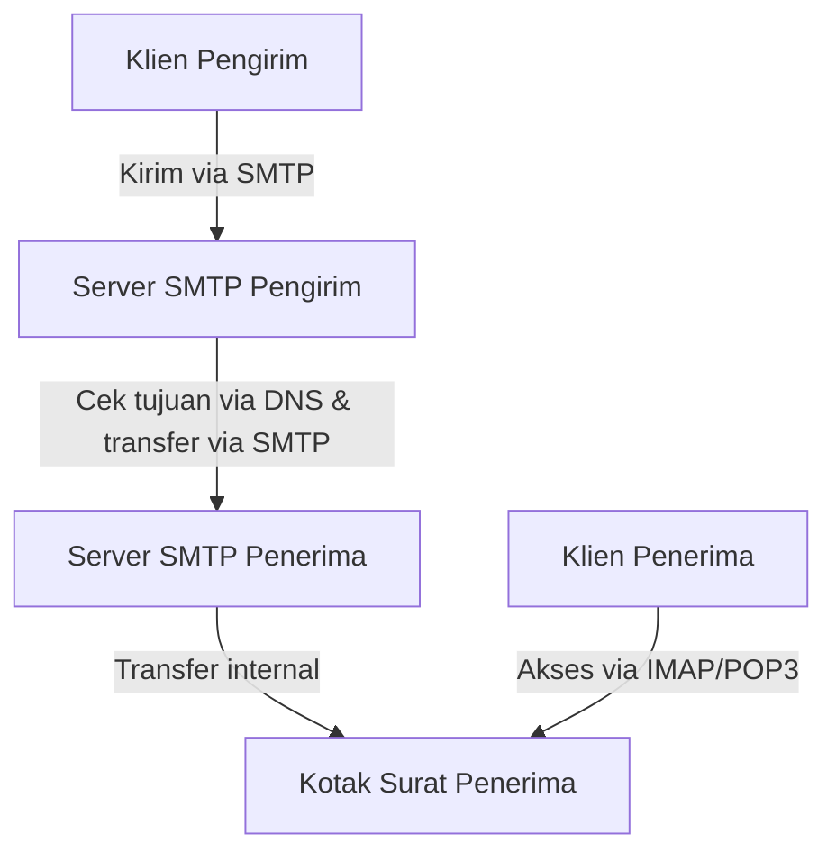
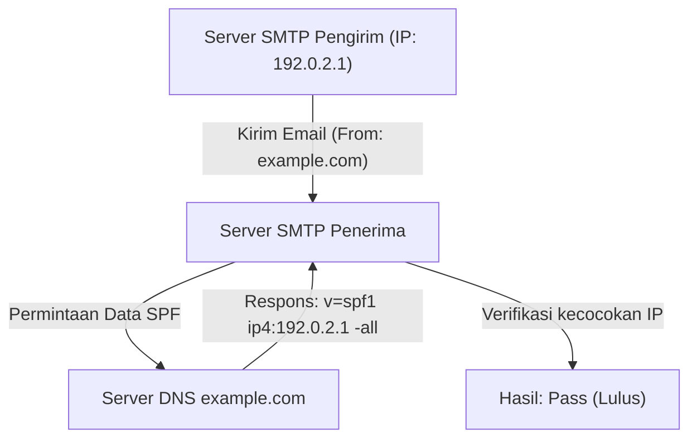
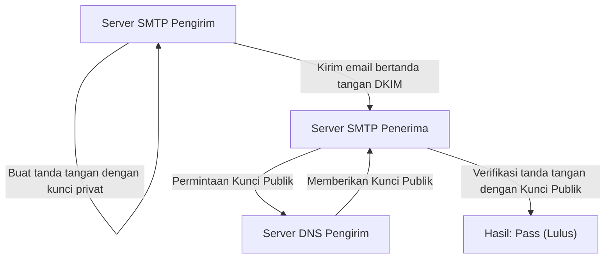

Email adalah salah satu metode komunikasi tertua dan masih yang paling banyak digunakan di internet saat ini. Namun, di balik layar ketika kita secara rutin menekan tombol kirim, sejumlah protokol (aturan komunikasi) bekerja sama secara kompleks untuk memastikan email terkirim dengan andal ke penerima.

Artikel ini akan secara menyeluruh menjelaskan gambaran keseluruhan sistem email dari sudut pandang rekayasa, mulai dari mekanisme dasar protokol pengiriman dan penerimaan (SMTP, IMAP) hingga teknologi keamanan (SPF, DKIM, DMARC) yang menjadi sangat penting dalam sistem email modern.

## 1. Protokol Dasar untuk Mengirim dan Menerima Email

Mengirim dan menerima email sangat mirip dengan cara kerja layanan pos. Sama seperti Anda memasukkan surat ke dalam kotak pos dan surat itu dikirim melalui kantor pos ke kotak surat penerima, email juga melewati beberapa server sebelum mencapai tujuannya. Komunikasi ini ditangani oleh protokol seperti SMTP, POP3, dan IMAP.

### SMTP (Simple Mail Transfer Protocol)

SMTP adalah protokol untuk **mengirim dan mentransfer** email.

1. **Pengiriman dari pengguna ke server:** Saat Anda mengirim email dari klien email (seperti Outlook, Thunderbird, Apple Mail, dll.), email tersebut pertama-tama dikirim ke server email Anda (server SMTP).
2. **Transfer antar server:** Server SMTP pengirim melihat domain alamat email tujuan (bagian `@example.com`), meminta sistem DNS (Domain Name System) untuk menentukan alamat IP dari server email penerima. Kemudian, ia mentransfer email tersebut melalui internet ke server SMTP penerima.

SMTP adalah protokol yang sangat sederhana dan kuat, tetapi karena desainnya yang sudah lama, awalnya tidak memiliki fitur otentikasi atau enkripsi. Saat ini, SMTPS (SMTP over SSL/TLS) untuk mengenkripsi komunikasi dan SMTP-AUTH untuk otentikasi pengirim digunakan sebagai standar.

### IMAP (Internet Message Access Protocol) dan POP3 (Post Office Protocol version 3)

IMAP dan POP3 adalah protokol yang digunakan penerima untuk **membaca** email yang telah tiba di server email mereka di perangkat masing-masing.

- **POP3:** Protokol untuk **mengunduh** email yang tiba di server ke perangkat pengguna (PC atau ponsel cerdas). Karena email yang diunduh pada dasarnya dihapus dari server, protokol ini tidak cocok untuk mengelola kotak surat yang sama dari beberapa perangkat (meskipun dimungkinkan untuk menyimpannya dengan pengaturan tertentu, mereka tidak akan tersinkronisasi).
- **IMAP:** Protokol untuk **melihat dan mengelola** email di server dari perangkat pengguna. Email sebenarnya tetap ada di server, dan status baca/belum dibaca, pengorganisasian folder, dll. dikelola di server. Oleh karena itu, Anda dapat mengakses kotak surat yang sama dari beberapa perangkat seperti ponsel cerdas, tablet, dan PC, dan menyimpannya selalu sinkron. Dalam lingkungan email saat ini, IMAP telah menjadi standar utama.

## 2. Mengapa Perlindungan Spam Diperlukan?

Dengan mekanisme di atas, dimungkinkan untuk mengirim dan menerima email. Namun, kelemahan mendasar dari SMTP adalah masalah bahwa "memalsukan pengirim sangatlah mudah."

Sama seperti Anda dapat menulis nama orang lain dengan bebas di kolom pengirim sebuah surat, Anda dapat dengan bebas mengatur alamat "From" di SMTP. Hal ini menyebabkan merajalelanya email phishing yang menyamar sebagai bank atau perusahaan terkenal, serta masuknya email spam dalam jumlah besar.

Untuk mencegah "penyamaran" (spoofing) ini dan membuktikan bahwa pengirim email adalah sah, teknologi yang disebut **otentikasi domain pengirim** diperkenalkan. Tiga perwakilan utamanya adalah SPF, DKIM, dan DMARC.

## 3. SPF (Sender Policy Framework)

SPF adalah mekanisme untuk membuktikan legitimasi pengirim menggunakan "**Alamat IP**".

### Cara Kerja SPF

1. **Persiapan pihak pengirim (Mempublikasikan data DNS):** Pemilik domain mendaftarkan informasi yang disebut "Data SPF" (SPF Record) di DNS domain mereka. Ini berisi daftar "alamat IP (atau server) resmi yang diizinkan untuk mengirim email dari domain ini".
2. **Verifikasi pihak penerima:** Ketika server email penerima menerima sebuah email, ia akan memeriksa alamat IP pengirim. Selanjutnya, ia akan bertanya kepada DNS domain pengirim dan mengambil data SPF.
3. **Pencocokan:** Jika alamat IP pengirim aktual ada dalam daftar data SPF, maka itu dinilai sebagai "Pengirim Sah (Pass)", dan jika tidak disertakan, itu dinilai sebagai "Spoofing (Fail)".

### Keterbatasan SPF

SPF sangat efektif, tetapi juga memiliki kelemahan.
- Jika penerusan (forwarding) email terjadi, alamat IP pengirim berubah menjadi milik server penerusan, yang mana hal ini dapat menyebabkan verifikasi SPF gagal.
- SPF memverifikasi "Envelope From" (pengirim pada level komunikasi), dan tidak memverifikasi "Header From" (pengirim yang ditampilkan) yang dilihat pengguna di klien email mereka.

## 4. DKIM (DomainKeys Identified Mail)

DKIM adalah mekanisme untuk membuktikan legitimasi pengirim dan memastikan bahwa email tidak dimodifikasi (tampered) menggunakan "**Tanda tangan digital (teknologi enkripsi)**".

### Cara Kerja DKIM

1. **Persiapan pihak pengirim (Pendaftaran kunci publik):** Pemilik domain membuat sepasang kunci privat (private key) dan kunci publik (public key), lalu mendaftarkan kunci publik di DNS domain mereka sendiri (Data DKIM).
2. **Penandatanganan saat pengiriman:** Saat mengirim email, server email pengirim menghitung nilai hash berdasarkan header dan sebagian isi email, lalu mengenkripsinya dengan kunci privat. Ini menjadi "tanda tangan digital" dan dilampirkan ke header email (DKIM-Signature).
3. **Verifikasi pihak penerima:** Saat server penerima menerima email, ia mengambil kunci publik dari DNS domain pengirim.
4. **Pencocokan:** Ia mendekripsi tanda tangan digital menggunakan kunci publik yang diperoleh dan mengekstrak nilai hash asli. Pada saat yang sama, ia secara independen menghitung nilai hash dari data email yang diterima dan memverifikasi apakah keduanya cocok. Jika cocok, maka akan dinilai sebagai "Tidak dimodifikasi dan dikirim dari pengirim sah yang memegang kunci privat (Pass)".

DKIM memiliki keunggulan dibandingkan SPF karena tidak mudah gagal saat terjadi penerusan email, dan juga menjamin bahwa isi email tidak diubah (integritas).

## 5. DMARC (Domain-based Message Authentication, Reporting, and Conformance)

SPF dan DKIM memungkinkan otentikasi email, namun tetap saja ada beberapa masalah.
- Jika salah satu dari SPF atau DKIM gagal, tidak ada standar yang seragam tentang bagaimana server penerima harus menangani email tersebut (apakah harus dimasukkan ke folder spam atau ditolak).
- Ia tidak sepenuhnya dapat mencegah spoofing yang mengeksploitasi perbedaan antara Header From (alamat yang dilihat pengguna) dan Envelope From (alamat yang dilihat sistem).

Untuk memecahkan masalah ini dan berfungsi sebagai kebijakan yang mengawasi teknologi otentikasi, **DMARC** digunakan.

### Peran DMARC

1. **Verifikasi Keselarasan (Alignment):** DMARC secara ketat memeriksa tidak hanya hasil otentikasi SPF dan DKIM, tetapi juga apakah domain "Header From" yang sebenarnya dilihat pengguna cocok dengan domain yang diotentikasi oleh SPF atau DKIM (Keselarasan).
2. **Deklarasi kebijakan:** Administrator domain pengirim mendaftarkan data DMARC di DNS dan dapat menginstruksikan pihak penerima tentang "bagaimana menangani email jika otentikasi (SPF/DKIM) gagal".
   - `p=none` : Tidak melakukan apa-apa (Mode pemantauan)
   - `p=quarantine` : Masukkan ke folder spam, dll. (Karantina)
   - `p=reject` : Tolak email (Reject)
3. **Fungsi Pelaporan:** DMARC memiliki fungsi di mana server penerima mengirimkan laporan tentang hasil otentikasi kepada administrator domain pengirim. Dengan melihat ini, administrator dapat memantau apakah domain mereka disalahgunakan atau apakah email yang sah diblokir.

Jika DMARC diatur ke "reject" (tolak), email palsu diblokir secara kuat sebelum mencapai pengguna, yang mana secara drastis dapat mengurangi kerusakan seperti penipuan phishing. Baru-baru ini, penyedia email besar seperti Google (Gmail) dan Yahoo! telah memperkuat pergerakan untuk mewajibkan pengirim menerapkan DMARC.

## Kesimpulan

Sistem email telah berevolusi dari protokol transfer sederhana menjadi metode komunikasi yang lebih aman seiring berjalannya waktu.

- **SMTP** membawa email, dan **IMAP** mengelola agar mudah dibaca.
- Untuk mengatasi kelemahan di mana siapa pun bisa memalsukan pengirim, **SPF** membuktikan sumber dengan alamat IP, dan **DKIM** membuktikannya dengan tanda tangan digital.
- Kemudian **DMARC** menggabungkan mereka dan beroperasi dengan ketat untuk memblokir email palsu.

Memahami mekanisme ini adalah pengetahuan yang wajib dimiliki oleh para insinyur modern untuk melindungi domain perusahaan mereka dan memastikan pengiriman email yang andal kepada pengguna. Meskipun infrastruktur email sebagian besar tidak terlihat, teknologi ini mendukung keamanan komunikasi kita setiap harinya.
