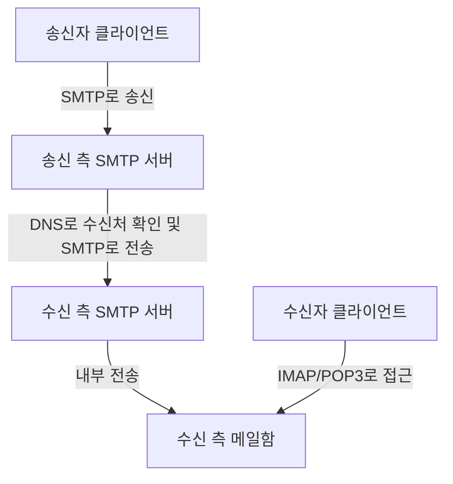
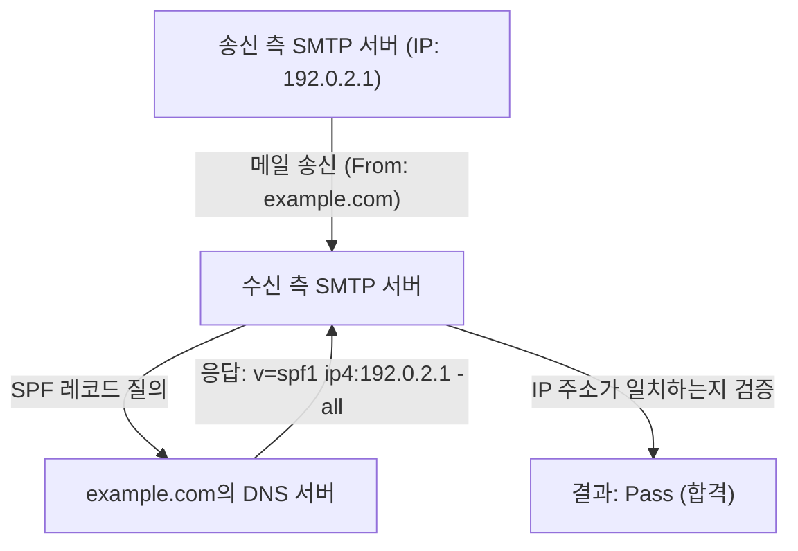
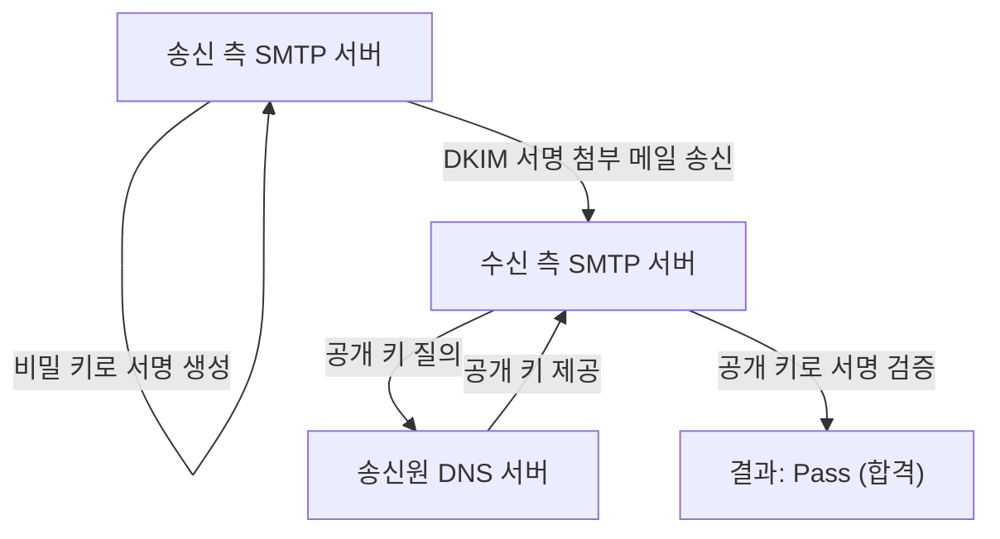

이메일은 인터넷상에서 가장 오래전부터 존재했으며, 현재까지도 가장 널리 사용되는 통신 수단 중 하나입니다. 하지만 우리가 평소 무심코 전송 버튼을 누르는 이면에서는 여러 가지 프로토콜(통신 규약)이 복잡하게 연계되어 메일을 상대방에게 확실하게 전달하고 있습니다.

본 기사에서는 이메일의 송수신을 뒷받침하는 기본적인 원리(SMTP, IMAP)부터, 현대 이메일 시스템에서 필수적인 보안 기술(SPF, DKIM, DMARC)까지 이메일 시스템의 전체적인 모습을 엔지니어링 관점에서 철저히 해설합니다.

## 1. 이메일 송수신 기본 프로토콜

이메일의 송수신은 우편의 원리와 매우 비슷합니다. 여러분이 편지를 우체통에 넣고, 그것이 우체국을 거쳐 상대방의 우체통에 도착하듯이, 이메일도 몇 개의 서버를 거쳐 상대방에게 도달합니다. 이 통신을 담당하는 것이 SMTP, POP3, IMAP과 같은 프로토콜입니다.

### SMTP (Simple Mail Transfer Protocol)

SMTP는 이메일을 **송신 및 전송**하기 위한 프로토콜입니다.

1. **사용자에서 서버로 전송:** 여러분이 메일 클라이언트(Outlook, Thunderbird, Apple Mail 등)에서 메일을 보내면, 먼저 자신이 가입된 메일 서버(SMTP 서버)로 메일이 전송됩니다.
2. **서버 간 전송:** 송신 측의 SMTP 서버는 수신 메일 주소의 도메인(`@example.com` 부분)을 확인하고, DNS(Domain Name System)에 질의하여 수신 측 메일 서버의 IP 주소를 특정합니다. 그리고 인터넷을 경유하여 수신 측 SMTP 서버로 메일을 전송합니다.

SMTP는 매우 단순하고 강력한 프로토콜이지만, 설계가 오래되었기 때문에 초기에는 인증 기능이나 암호화 기능이 없었습니다. 현재는 통신을 암호화하는 SMTPS(SMTP over SSL/TLS)나, 송신자 인증을 수행하는 SMTP-AUTH 등이 표준으로 사용되고 있습니다.

### IMAP (Internet Message Access Protocol)과 POP3 (Post Office Protocol version 3)

상대방의 메일 서버에 도착한 메일을 수신자가 자신의 단말기에서 **읽기** 위한 프로토콜이 IMAP과 POP3입니다.

- **POP3:** 서버에 도착한 메일을 사용자의 단말기(PC나 스마트폰)로 **다운로드**하는 프로토콜입니다. 다운로드된 메일은 기본적으로 서버에서 삭제되므로, 여러 단말기에서 같은 메일함을 관리하는 데에는 적합하지 않습니다(설정으로 남길 수도 있지만, 동기화되지는 않습니다).
- **IMAP:** 서버 상에 있는 메일을 사용자의 단말기에서 **열람 및 조작**하는 프로토콜입니다. 메일의 실체는 서버에 남아 있으며, 읽음/읽지 않음 상태나 폴더 분류 등도 서버 상에서 관리됩니다. 따라서 스마트폰, 태블릿, PC 등 여러 단말기에서 같은 메일함에 접속하여 항상 동기화된 상태를 유지할 수 있습니다. 현대의 메일 환경에서는 IMAP이 주류를 이루고 있습니다.

## 2. 왜 스팸 메일(Spam) 대책이 필요한가?

여기까지의 과정만으로도 이메일의 송수신은 가능합니다. 하지만 SMTP의 근본적인 약점으로서, '송신원 사칭이 매우 쉽다'는 문제가 있습니다.

편지의 발송인란에 타인의 이름을 마음대로 적을 수 있듯이, SMTP에서는 'From' 주소를 자유롭게 설정할 수 있습니다. 이로 인해 은행이나 유명 기업을 가장한 피싱 메일이나, 대량의 스팸 메일이 횡행하게 되었습니다.

이러한 '사칭'을 방지하고 이메일의 발송자가 정당하다는 것을 증명하기 위해 도입된 것이 **송신 도메인 인증**이라 불리는 기술입니다. 대표적인 것으로 SPF, DKIM, DMARC 세 가지가 있습니다.

## 3. SPF (Sender Policy Framework)

SPF는 '**IP 주소**'를 사용하여 송신원의 정당성을 증명하는 방식입니다.

### SPF의 작동 방식

1. **송신 측 준비(DNS 레코드 공개):** 도메인 소유자는 자신의 도메인 DNS에 'SPF 레코드'라는 정보를 등록합니다. 이곳에는 '이 도메인의 메일을 발송해도 되는 정당한 IP 주소(또는 서버)' 목록을 기록합니다.
2. **수신 측 검증:** 수신 측 메일 서버는 메일을 수신하면 메일의 송신원 IP 주소를 확인합니다. 다음으로 송신원 도메인의 DNS에 질의하여 SPF 레코드를 가져옵니다.
3. **대조:** 실제 송신원 IP 주소가 SPF 레코드에 기재된 목록에 포함되어 있다면 '정당한 송신자(Pass)', 포함되어 있지 않다면 '사칭(Fail)'으로 판정합니다.

### SPF의 한계

SPF는 매우 효과적이지만 약점도 있습니다.
- 메일 전송(Forwarding)이 발생하면 송신원 IP 주소가 전송 서버의 주소로 변경되기 때문에 SPF 검증이 실패할 수 있습니다.
- '엔벨로프 From(통신 레벨의 송신원)'을 검증하는 것이며, 사용자가 메일 프로그램에서 보는 '헤더 From(표시 상의 송신원)'은 검증되지 않습니다.

## 4. DKIM (DomainKeys Identified Mail)

DKIM은 '**전자 서명(암호화 기술)**'을 사용하여 송신원의 정당성과 메일의 위변조가 없음을 증명하는 방식입니다.

### DKIM의 작동 방식

1. **송신 측 준비(공개 키 등록):** 도메인 소유자는 비밀 키와 공개 키 쌍을 생성하고, 공개 키를 자사 도메인의 DNS에 등록합니다(DKIM 레코드).
2. **송신 시 서명:** 송신 측 메일 서버는 메일 전송 시, 메일의 헤더나 본문의 일부를 바탕으로 해시 값을 계산하고, 이를 비밀 키로 암호화합니다. 이것이 '전자 서명'이 되며, 메일 헤더(DKIM-Signature)에 부여됩니다.
3. **수신 측 검증:** 수신 측 서버는 메일을 수신하면 송신원 도메인의 DNS에서 공개 키를 가져옵니다.
4. **대조:** 가져온 공개 키를 사용하여 전자 서명을 복호화하고 원래의 해시 값을 추출합니다. 동시에 수신한 메일 데이터에서 스스로 해시 값을 계산하여 두 값이 일치하는지 검증합니다. 일치하면 '위변조되지 않았으며, 비밀 키를 가진 정당한 송신자로부터 전송된 것(Pass)'으로 판정합니다.

DKIM은 SPF처럼 전송 시 실패하는 경우가 적고, 메일 내용이 위변조되지 않았음(무결성)을 보장할 수 있다는 것이 강점입니다.

## 5. DMARC (Domain-based Message Authentication, Reporting, and Conformance)

SPF와 DKIM을 통해 메일 인증이 가능해졌지만, 여전히 문제는 남아 있었습니다.
- SPF와 DKIM 중 하나가 실패했을 경우, 수신 측 서버가 그 메일을 어떻게 처리해야 할지(스팸 메일함에 넣을 것인지, 수신을 거부할 것인지) 통일된 기준이 없었습니다.
- 헤더 From(사용자가 보는 주소)과 엔벨로프 From(시스템이 보는 주소)의 차이를 이용한 사칭을 완벽히 막지 못했습니다.

이러한 문제를 해결하고 인증 기술을 총괄하는 정책으로 기능하는 것이 **DMARC**입니다.

### DMARC의 역할

1. **정렬(Alignment) 검증:** DMARC는 SPF와 DKIM의 인증 결과뿐만 아니라, 사용자가 실제로 보는 '헤더 From'의 도메인이 SPF나 DKIM으로 인증된 도메인과 일치하는지(정렬)를 엄격하게 확인합니다.
2. **정책 선언:** 송신원 도메인 관리자는 DNS에 DMARC 레코드를 등록하여, '만약 인증(SPF/DKIM)에 실패한 메일이 도착하면 수신 측은 어떻게 처리해야 하는지'라는 정책을 수신 측에 지시할 수 있습니다.
   - `p=none` : 아무것도 하지 않음(모니터링 모드)
   - `p=quarantine` : 스팸 메일함 등에 넣음(격리)
   - `p=reject` : 수신을 거부함
3. **보고서 기능:** DMARC는 수신 측 서버가 송신원 도메인 관리자에게 인증 결과 보고서를 전송하는 기능을 가지고 있습니다. 관리자는 이를 통해 자사의 도메인이 부정하게 사용되고 있지는 않은지, 올바른 메일이 차단되고 있지는 않은지 감시할 수 있습니다.

DMARC가 'reject(거부)'로 설정되어 있다면, 사칭 메일은 수신자에게 도달하기 전에 강력하게 차단되므로 피싱 사기 등의 피해를 극적으로 줄일 수 있습니다. 최근 Google(Gmail)이나 Yahoo! 등의 대형 메일 서비스 제공자들은 송신자에게 DMARC 도입을 의무화하는 움직임을 강화하고 있습니다.

## 요약

이메일 시스템은 단순한 전송 프로토콜에서 시작하여 시대와 함께 더욱 안전한 통신 수단으로 진화해 왔습니다.

- **SMTP**가 메일을 운반하고, **IMAP**이 메일을 읽기 쉽게 관리합니다.
- 누구나 발송인을 칭할 수 있는 약점을 보완하기 위해, **SPF**가 IP 주소로, **DKIM**이 전자 서명으로 송신원을 증명합니다.
- 그리고 **DMARC**가 이들을 통합하여 엄격하게 운용하며, 사칭 메일을 차단합니다.

이러한 원리를 이해하는 것은 자사의 도메인을 보호하고 사용자에게 확실하게 메일을 전달하는 데 있어서 현대 엔지니어에게 필수적인 지식이라고 할 수 있습니다. 이메일 인프라는 눈에 잘 띄지 않지만, 이러한 기술들이 매일 우리의 커뮤니케이션의 안전을 지탱하고 있습니다.
