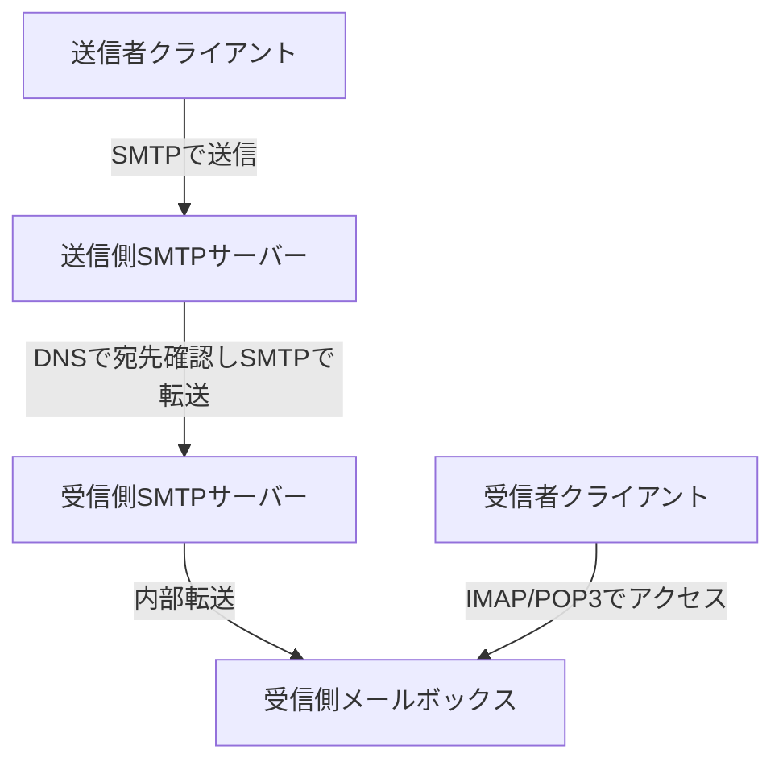
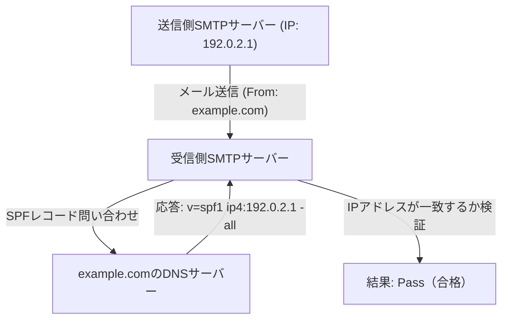
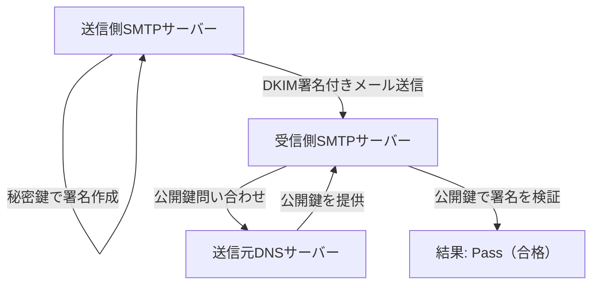

電子メールは、インターネット上で最も古くから存在し、現在でも最も広く使われている通信手段の一つです。しかし、普段私たちが何気なく送信ボタンを押している裏側では、いくつものプロトコル（通信規約）が複雑に連携し、メールを相手の元へと確実に届けています。

本記事では、電子メールの送受信を支える基本的な仕組み（SMTP、IMAP）から、現代のメールシステムにおいて不可欠となっているセキュリティ技術（SPF、DKIM、DMARC）まで、メールシステムの全体像をエンジニアリングの視点から徹底的に解説します。

## 1. メール送受信の基本プロトコル

メールの送受信は、郵便の仕組みによく似ています。あなたが手紙をポストに投函し、それが郵便局を経由して相手の家のポストに届くように、電子メールもいくつかのサーバーを経由して相手に届きます。この通信を担うのが、SMTP、POP3、IMAPといったプロトコルです。

### SMTP（Simple Mail Transfer Protocol）

SMTPは、メールを**送信・転送**するためのプロトコルです。

1. **ユーザーからサーバーへの送信:** あなたがメールクライアント（Outlook、Thunderbird、Apple Mailなど）からメールを送信すると、まず自分の契約しているメールサーバー（SMTPサーバー）にメールが送られます。
2. **サーバー間の転送:** 送信側のSMTPサーバーは、宛先メールアドレスのドメイン（`@example.com` の部分）を見て、DNS（Domain Name System）に問い合わせ、相手先のメールサーバーのIPアドレスを特定します。そして、インターネットを経由して相手先のSMTPサーバーにメールを転送します。

SMTPは非常にシンプルで強力なプロトコルですが、設計が古いため、当初は認証機能や暗号化機能がありませんでした。現在では、通信を暗号化するSMTPS（SMTP over SSL/TLS）や、送信者認証を行うSMTP-AUTHなどが標準的に利用されています。

### IMAP（Internet Message Access Protocol）と POP3（Post Office Protocol version 3）

相手のメールサーバーに届いたメールを、受信者が自分の端末で**読む**ためのプロトコルがIMAPとPOP3です。

- **POP3:** サーバーに届いたメールを、ユーザーの端末（PCやスマートフォン）に**ダウンロード**するプロトコルです。ダウンロードされたメールは基本的にサーバーから削除されるため、複数の端末から同じメールボックスを管理するのには不向きです（設定で残すことも可能ですが、同期はされません）。
- **IMAP:** サーバー上にあるメールを、ユーザーの端末から**閲覧・操作**するプロトコルです。メールの実体はサーバーに残ったままであり、既読・未読状態やフォルダ分けなどもサーバー上で管理されます。そのため、スマートフォン、タブレット、PCなど、複数の端末から同じメールボックスにアクセスし、常に同期された状態を保つことができます。現代のメール環境ではIMAPが主流となっています。

## 2. なぜ迷惑メール（スパム）対策が必要なのか？

ここまでの仕組みで、メールの送受信は可能です。しかし、SMTPの根本的な弱点として、「送信元の詐称が非常に簡単である」という問題があります。

手紙の差出人欄に他人の名前を勝手に書けるように、SMTPでは「From」アドレスを自由に設定できてしまいます。これにより、銀行や有名企業を装ったフィッシングメールや、大量のスパムメールが横行するようになりました。

この「なりすまし」を防ぎ、メールの送信元が正当なものであることを証明するために導入されたのが、**送信ドメイン認証**と呼ばれる技術です。代表的なものとして、SPF、DKIM、DMARCの3つがあります。

## 3. SPF（Sender Policy Framework）

SPFは、「**IPアドレス**」を使って送信元の正当性を証明する仕組みです。

### SPFの仕組み

1. **送信側の準備（DNSレコードの公開）:** ドメインの所有者は、自身のドメインのDNSに「SPFレコード」と呼ばれる情報を登録します。ここには、「このドメインのメールを送信してもよい正規のIPアドレス（またはサーバー）」のリストを記述します。
2. **受信側の検証:** 受信側のメールサーバーは、メールを受け取ると、メールの送信元IPアドレスを確認します。次に、送信元ドメインのDNSに問い合わせてSPFレコードを取得します。
3. **照合:** 実際の送信元IPアドレスが、SPFレコードに記載されているリストに含まれていれば「正当な送信者（Pass）」、含まれていなければ「なりすまし（Fail）」と判定します。

### SPFの限界

SPFは非常に有効ですが、弱点もあります。
- メールの転送（Forwarding）が行われると、送信元IPアドレスが転送サーバーのものに変わってしまうため、SPF検証が失敗してしまうことがあります。
- 「エンベロープFrom（通信レベルの送信元）」を検証するものであり、ユーザーがメールソフトで見る「ヘッダFrom（表示上の送信元）」は検証されません。

## 4. DKIM（DomainKeys Identified Mail）

DKIMは、「**電子署名（暗号化技術）**」を使って、送信元の正当性とメールの改ざんがないことを証明する仕組みです。

### DKIMの仕組み

1. **送信側の準備（公開鍵の登録）:** ドメイン所有者は、秘密鍵と公開鍵のペアを作成し、公開鍵を自ドメインのDNSに登録します（DKIMレコード）。
2. **送信時の署名:** 送信側メールサーバーは、メールの送信時に、メールのヘッダーや本文の一部をもとにハッシュ値を計算し、それを秘密鍵で暗号化します。これが「電子署名」となり、メールのヘッダー（DKIM-Signature）に付与されます。
3. **受信側の検証:** 受信側サーバーは、メールを受け取ると、送信元ドメインのDNSから公開鍵を取得します。
4. **照合:** 取得した公開鍵を使って電子署名を復号し、元のハッシュ値を取り出します。同時に、受け取ったメールデータから自らハッシュ値を計算し、両者が一致するかを検証します。一致すれば「改ざんされておらず、秘密鍵を持つ正規の送信者から送られたもの（Pass）」と判定します。

DKIMはSPFのように転送で失敗することが少なく、メールの内容が改ざんされていないこと（完全性）も保証できるのが強みです。

## 5. DMARC（Domain-based Message Authentication, Reporting, and Conformance）

SPFとDKIMによってメールの認証が可能になりましたが、それでも問題は残りました。
- SPFとDKIMのどちらかが失敗した場合、受信側サーバーはそのメールをどう扱えばよいか（迷惑メールフォルダに入れるのか、受信拒否するのか）統一された基準がありませんでした。
- ヘッダFrom（ユーザーが見るアドレス）とエンベロープFrom（システムが見るアドレス）のズレを利用したなりすましを防ぎきれませんでした。

これを解決し、認証技術を統括するポリシーとして機能するのが**DMARC**です。

### DMARCの役割

1. **アライメント（Alignment）の検証:** DMARCは、SPFとDKIMの認証結果だけでなく、ユーザーが実際に見る「ヘッダFrom」のドメインが、SPFやDKIMで認証されたドメインと一致しているか（アライメント）を厳格にチェックします。
2. **ポリシーの宣言:** 送信元ドメインの管理者は、DNSにDMARCレコードを登録し、「もし認証（SPF/DKIM）に失敗したメールが届いたら、受信側はどのように処理すべきか」というポリシーを受信側に指示できます。
   - `p=none` : 何もしない（監視モード）
   - `p=quarantine` : 迷惑メールフォルダなどに入れる（隔離）
   - `p=reject` : 受信を拒否する
3. **レポート機能:** DMARCは、受信側サーバーから送信元ドメイン管理者に対して、認証結果のレポートを送信する機能を持っています。管理者はこれを見ることで、自社のドメインが不正利用されていないか、正しいメールがブロックされていないかを監視できます。

DMARCが「reject（拒否）」に設定されていれば、なりすましメールは受信者の手元に届く前に強力にブロックされるため、フィッシング詐欺などの被害を劇的に減らすことができます。近年、Google（Gmail）やYahoo!などの大手メールプロバイダは、送信者に対してDMARCの導入を必須化する動きを強めています。

## まとめ

電子メールシステムは、シンプルな転送プロトコルから始まり、時代とともにより安全な通信手段へと進化してきました。

- **SMTP** がメールを運び、**IMAP** がメールを読みやすく管理します。
- 誰でも差出人を名乗れる弱点を補うために、**SPF** がIPアドレスで、**DKIM** が電子署名で送信元を証明します。
- そして **DMARC** がそれらを束ねて厳格に運用し、なりすましメールをシャットアウトします。

これらの仕組みを理解することは、自社のドメインを守り、ユーザーに確実にメールを届ける上で、現代のエンジニアにとって必須の知識と言えるでしょう。メールのインフラストラクチャは目に見えにくい部分ですが、これらの技術が日々、私たちのコミュニケーションの安全を支えています。
