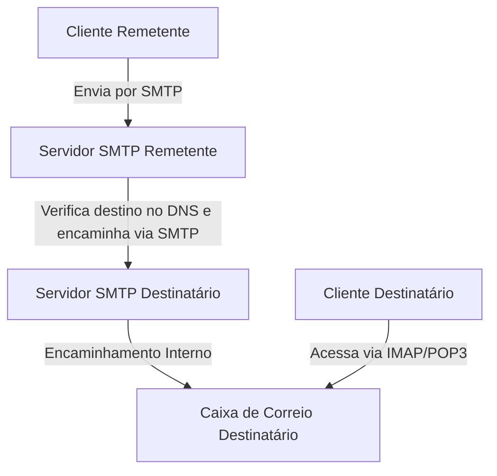
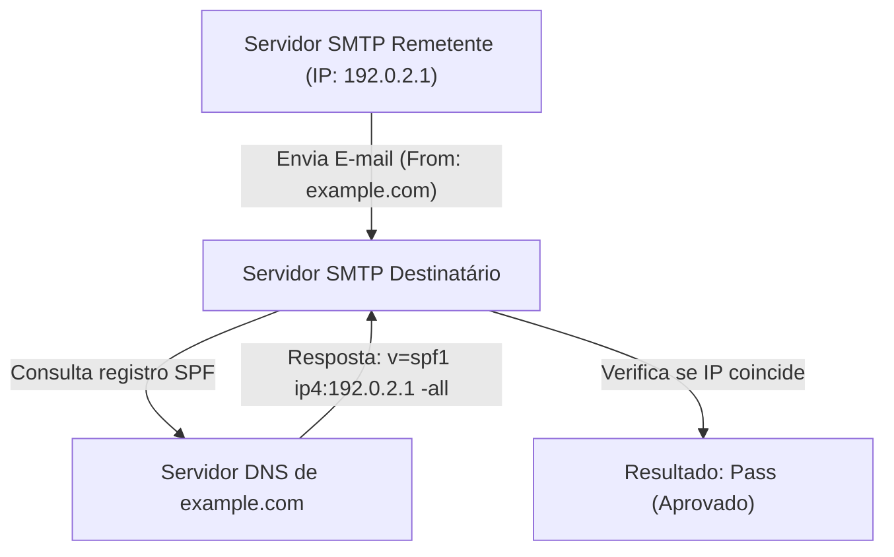
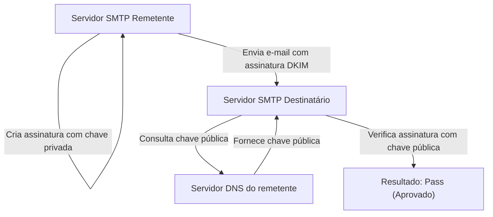

E-mail é um dos meios de comunicação mais antigos e ainda hoje mais amplamente utilizados na internet. No entanto, nos bastidores, quando clicamos casualmente no botão de enviar, vários protocolos (regras de comunicação) trabalham juntos em uma rede complexa para garantir que a mensagem chegue ao destinatário de forma confiável.

Neste artigo, explicaremos de forma abrangente toda a arquitetura do sistema de e-mail sob a perspectiva da engenharia, desde os protocolos básicos que suportam o envio e recebimento (SMTP, IMAP) até as tecnologias de segurança que se tornaram indispensáveis nos sistemas modernos (SPF, DKIM, DMARC).

## 1. Protocolos Básicos para Envio e Recebimento de E-mail

O envio e recebimento de e-mails é muito semelhante ao sistema postal. Assim como você coloca uma carta em uma caixa de correio e ela passa pela agência dos correios antes de chegar à casa do destinatário, um e-mail também passa por vários servidores para alcançar seu destino. Essa comunicação é tratada por protocolos como SMTP, POP3 e IMAP.

### SMTP (Simple Mail Transfer Protocol)

SMTP é o protocolo usado para **enviar e encaminhar** e-mails.

1. **Envio do usuário para o servidor:** Quando você envia um e-mail a partir de um cliente de e-mail (Outlook, Thunderbird, Apple Mail, etc.), ele é enviado primeiro para o servidor de e-mail contratado por você (servidor SMTP).
2. **Encaminhamento entre servidores:** O servidor SMTP remetente observa o domínio do endereço de e-mail de destino (a parte `@example.com`), consulta o DNS (Domain Name System) e identifica o endereço IP do servidor de e-mail de destino. Em seguida, encaminha o e-mail pela internet para o servidor SMTP de destino.

O SMTP é um protocolo muito simples e poderoso, mas devido ao seu design antigo, não possuía funções de autenticação ou criptografia no início. Hoje, o SMTPS (SMTP over SSL/TLS) para criptografar a comunicação e o SMTP-AUTH para autenticação do remetente são usados como padrão.

### IMAP (Internet Message Access Protocol) e POP3 (Post Office Protocol version 3)

IMAP e POP3 são protocolos para que o destinatário **leia** em seu próprio dispositivo os e-mails que chegaram ao servidor de destino.

- **POP3:** É um protocolo que **baixa** os e-mails recebidos no servidor para o dispositivo do usuário (PC ou smartphone). Como os e-mails baixados geralmente são excluídos do servidor, ele não é adequado para gerenciar a mesma caixa de correio a partir de vários dispositivos (é possível configurá-lo para manter uma cópia, mas a sincronização não ocorre).
- **IMAP:** É um protocolo para **visualizar e gerenciar** e-mails no servidor a partir do dispositivo do usuário. As mensagens reais permanecem no servidor, e o status de lido/não lido e a organização em pastas também são gerenciados no servidor. Por isso, é possível acessar a mesma caixa de correio a partir de vários dispositivos, como smartphones, tablets e PCs, mantendo sempre tudo sincronizado. O IMAP é o padrão nos ambientes de e-mail modernos.

## 2. Por que Precisamos de Medidas Contra Spam?

Com os mecanismos até aqui, é possível enviar e receber e-mails. No entanto, uma fraqueza fundamental do SMTP é que "é extremamente fácil falsificar o remetente".

Assim como você pode escrever o nome de outra pessoa no remetente de uma carta, no SMTP, você pode definir livremente o endereço "From" (De). Isso levou à proliferação de e-mails de phishing se passando por bancos e grandes empresas, bem como ao envio de spam em massa.

Para evitar esse "spoofing" (falsificação) e provar que a origem de envio de um e-mail é legítima, foi introduzida uma tecnologia chamada **Autenticação de Domínio do Remetente**. As três principais são SPF, DKIM e DMARC.

## 3. SPF (Sender Policy Framework)

O SPF é um mecanismo que usa o **endereço IP** para comprovar a legitimidade do remetente.

### Como o SPF Funciona

1. **Preparação no Remetente (Publicação de Registros DNS):** O proprietário do domínio registra informações chamadas de "registro SPF" no DNS do seu domínio. Isso lista "os endereços IP legítimos (ou servidores) autorizados a enviar e-mails em nome deste domínio".
2. **Verificação no Destinatário:** Quando o servidor de e-mail receptor recebe uma mensagem, ele verifica o endereço IP de origem do e-mail. Em seguida, ele consulta o DNS do domínio remetente para obter o registro SPF.
3. **Correspondência:** Se o endereço IP remetente real estiver incluído na lista do registro SPF, a mensagem é avaliada como "remetente legítimo (Pass)". Caso contrário, é considerada "falsificada (Fail)".

### Limitações do SPF

O SPF é altamente eficaz, mas tem pontos fracos.
- Se ocorrer o encaminhamento (forwarding) de e-mails, o endereço IP do remetente muda para o do servidor de encaminhamento, fazendo com que a verificação do SPF falhe.
- Ele verifica o "Envelope From" (remetente no nível de comunicação), mas o "Header From" (remetente de exibição), que o usuário vê no programa de e-mail, não é verificado.

## 4. DKIM (DomainKeys Identified Mail)

DKIM é um mecanismo que utiliza "**assinaturas digitais (tecnologia de criptografia)**" para comprovar a legitimidade do remetente e garantir que o e-mail não foi alterado.

### Como o DKIM Funciona

1. **Preparação no Remetente (Registro da Chave Pública):** O proprietário do domínio cria um par de chaves (privada e pública) e registra a chave pública no DNS do próprio domínio (Registro DKIM).
2. **Assinatura no Envio:** Ao enviar, o servidor de e-mail remetente calcula um valor de hash com base em partes do cabeçalho e do corpo do e-mail, criptografando-o com a chave privada. Isso se torna a "assinatura digital" e é adicionado ao cabeçalho (DKIM-Signature).
3. **Verificação no Destinatário:** Ao receber um e-mail, o servidor destinatário recupera a chave pública do DNS do domínio remetente.
4. **Correspondência:** A assinatura digital é descriptografada usando a chave pública obtida, recuperando o valor de hash original. Simultaneamente, o próprio servidor calcula um hash a partir dos dados do e-mail recebido e verifica se ambos coincidem. Se coincidirem, a mensagem é considerada "não adulterada e enviada por um remetente legítimo que possui a chave privada (Pass)".

O DKIM tem menos chances de falhar em encaminhamentos em comparação ao SPF e tem a vantagem de garantir que o conteúdo do e-mail não foi modificado (integridade).

## 5. DMARC (Domain-based Message Authentication, Reporting, and Conformance)

O SPF e o DKIM tornaram a autenticação de e-mail possível, mas ainda restavam problemas.
- Se o SPF ou o DKIM falhasse, não havia um padrão unificado sobre como o servidor receptor deveria tratar esse e-mail (colocá-lo na pasta de spam, rejeitá-lo, etc.).
- A falsificação explorando a discrepância entre o Header From (endereço que o usuário vê) e o Envelope From (endereço que o sistema vê) não podia ser totalmente evitada.

Para resolver isso e atuar como uma política unificadora das tecnologias de autenticação, o **DMARC** foi introduzido.

### O Papel do DMARC

1. **Verificação de Alinhamento (Alignment):** O DMARC não apenas verifica os resultados da autenticação do SPF e do DKIM, mas também verifica rigorosamente se o domínio do "Header From", que o usuário realmente vê, coincide com o domínio autenticado pelo SPF ou DKIM (alinhamento).
2. **Declaração de Políticas:** Os administradores de domínio remetentes podem registrar um registro DMARC no DNS e orientar os destinatários sobre "o que fazer se chegar um e-mail cuja autenticação (SPF/DKIM) tenha falhado".
   - `p=none` : Não fazer nada (Modo de monitoramento)
   - `p=quarantine` : Enviar para a pasta de spam, etc. (Quarentena)
   - `p=reject` : Rejeitar o recebimento
3. **Função de Relatórios:** O DMARC possui a capacidade de os servidores receptores enviarem relatórios de resultados de autenticação aos administradores dos domínios remetentes. Analisando isso, os administradores podem monitorar se seu domínio está sendo usado para fins fraudulentos ou se e-mails legítimos estão sendo bloqueados.

Se o DMARC for configurado como "reject (rejeitar)", e-mails falsificados são bloqueados com eficácia antes de chegarem ao destinatário, reduzindo drasticamente danos como golpes de phishing. Nos últimos anos, grandes provedores de e-mail como Google (Gmail) e Yahoo! aumentaram a pressão para que o DMARC se torne obrigatório.

## Resumo

O sistema de e-mail começou com protocolos de transferência simples e evoluiu ao longo do tempo para um meio de comunicação mais seguro.

- O **SMTP** transporta os e-mails e o **IMAP** facilita o gerenciamento de leitura.
- Para compensar a fraqueza de que qualquer um pode falsificar o remetente, o **SPF** prova a origem usando endereços IP, e o **DKIM** o faz através de assinaturas digitais.
- E o **DMARC** unifica isso para aplicar rigorosamente regras que bloqueiam e-mails falsificados.

Compreender esses mecanismos é um conhecimento indispensável para os engenheiros modernos protegerem seus domínios e garantirem que os e-mails cheguem aos usuários de maneira confiável. A infraestrutura de e-mail costuma ser invisível, mas essas tecnologias garantem a segurança da nossa comunicação diária.
