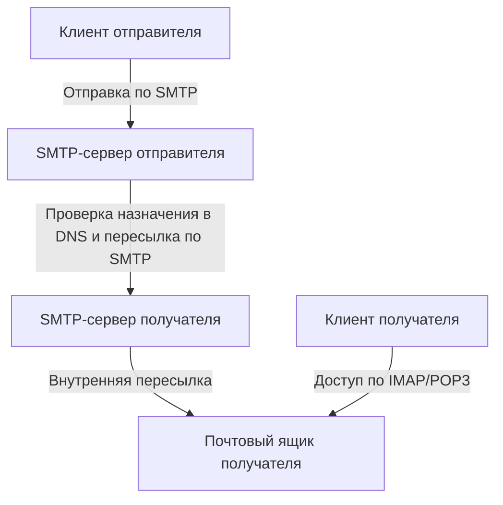
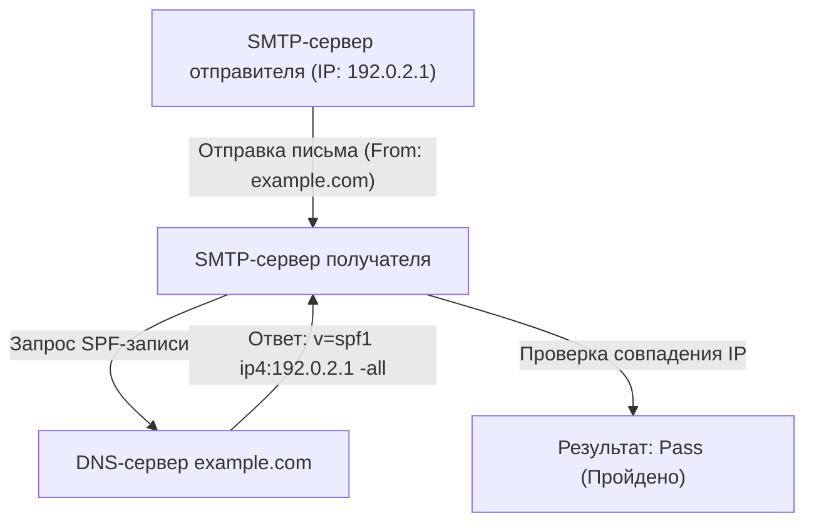
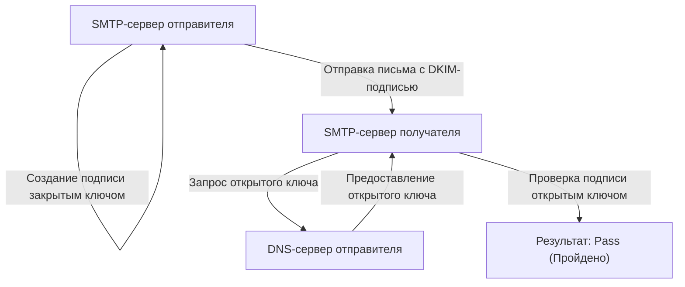

Электронная почта является одним из старейших и до сих пор наиболее широко используемых средств связи в Интернете. Однако за кулисами, когда мы небрежно нажимаем кнопку отправки, несколько протоколов (правил связи) работают вместе в сложной сети, гарантируя, что письмо надежно дойдет до получателя.

В этой статье мы подробно объясним всю архитектуру почтовой системы с точки зрения инженерии, начиная с базовых протоколов, обеспечивающих отправку и получение (SMTP, IMAP), и заканчивая технологиями безопасности, ставшими незаменимыми в современных почтовых системах (SPF, DKIM, DMARC).

## 1. Базовые протоколы для отправки и получения электронной почты

Отправка и получение электронных писем очень похожи на работу почтовой системы. Подобно тому, как вы бросаете письмо в почтовый ящик, и оно проходит через почтовое отделение, прежде чем попасть в ящик получателя, электронное письмо также проходит через несколько серверов, чтобы достичь своей цели. За эту связь отвечают протоколы SMTP, POP3 и IMAP.

### SMTP (Simple Mail Transfer Protocol)

SMTP — это протокол, используемый для **отправки и пересылки** электронных писем.

1. **Отправка от пользователя к серверу:** Когда вы отправляете письмо из почтового клиента (Outlook, Thunderbird, Apple Mail и т.д.), сначала оно отправляется на почтовый сервер (SMTP-сервер), к которому вы подключены.
2. **Пересылка между серверами:** Отправляющий SMTP-сервер просматривает домен в адресе электронной почты назначения (часть `@example.com`), обращается к DNS (Domain Name System) и определяет IP-адрес почтового сервера назначения. Затем он пересылает письмо через Интернет на SMTP-сервер назначения.

SMTP — это очень простой и мощный протокол, но из-за старой архитектуры изначально в нем не было функций аутентификации или шифрования. В настоящее время в качестве стандарта используются SMTPS (SMTP over SSL/TLS) для шифрования связи и SMTP-AUTH для аутентификации отправителя.

### IMAP (Internet Message Access Protocol) и POP3 (Post Office Protocol version 3)

IMAP и POP3 — это протоколы, позволяющие получателям **читать** на собственных устройствах письма, поступившие на сервер назначения.

- **POP3:** Протокол, который **скачивает** поступившие на сервер письма на устройство пользователя (ПК или смартфон). Поскольку скачанные письма обычно удаляются с сервера, он не подходит для управления одним и тем же почтовым ящиком с нескольких устройств (в настройках можно оставить копию, но синхронизация не происходит).
- **IMAP:** Протокол для **просмотра и управления** письмами на сервере с устройства пользователя. Сами сообщения остаются на сервере, и статусы «прочитано/не прочитано», а также распределение по папкам управляются на сервере. Поэтому можно получить доступ к одному и тому же почтовому ящику со смартфонов, планшетов, ПК и при этом всегда держать всё синхронизированным. IMAP является стандартом в современных почтовых средах.

## 2. Почему необходимы меры по борьбе со спамом?

Используя описанные механизмы, можно отправлять и получать электронные письма. Однако фундаментальная слабость SMTP заключается в том, что "подделать отправителя очень легко".

Подобно тому, как вы можете написать чужое имя в графе отправителя на конверте, в SMTP можно свободно установить адрес "From" (От кого). Это привело к распространению фишинговых писем от лица банков или известных компаний, а также массовой рассылке спама.

Для предотвращения этого "спуфинга" (подмены) и подтверждения легитимности отправителя была внедрена технология под названием **Аутентификация домена отправителя**. Тремя основными являются SPF, DKIM и DMARC.

## 3. SPF (Sender Policy Framework)

SPF — это механизм, который использует **IP-адрес** для подтверждения законности отправителя.

### Как работает SPF

1. **Подготовка на стороне отправителя (публикация DNS-записи):** Владелец домена регистрирует информацию, называемую "SPF-записью", в DNS своего домена. Здесь перечислены "легитимные IP-адреса (или серверы), которым разрешено отправлять письма от имени этого домена".
2. **Проверка на стороне получателя:** Когда принимающий почтовый сервер получает письмо, он проверяет исходный IP-адрес письма. Затем он обращается к DNS домена отправителя, чтобы получить SPF-запись.
3. **Сопоставление:** Если фактический IP-адрес отправителя включен в список в SPF-записи, он оценивается как "легитимный отправитель (Pass)", в противном случае — как "подделка (Fail)".

### Ограничения SPF

SPF очень эффективен, но имеет и слабые стороны.
- Если происходит пересылка (Forwarding) письма, IP-адрес отправителя меняется на адрес сервера пересылки, что может привести к сбою проверки SPF.
- Он проверяет "Envelope From" (отправителя на уровне связи), но "Header From" (отображаемый отправитель), который пользователь видит в почтовой программе, не проверяется.

## 4. DKIM (DomainKeys Identified Mail)

DKIM — это механизм, использующий "**электронные подписи (технология шифрования)**" для подтверждения легитимности отправителя и гарантии отсутствия фальсификации письма.

### Как работает DKIM

1. **Подготовка на стороне отправителя (Регистрация открытого ключа):** Владелец домена создает пару ключей (закрытый и открытый) и регистрирует открытый ключ в DNS собственного домена (DKIM-запись).
2. **Подписание при отправке:** При отправке отправляющий почтовый сервер вычисляет хеш-значение на основе части заголовка и тела письма и шифрует его с помощью закрытого ключа. Это становится "электронной подписью" и добавляется в заголовок письма (DKIM-Signature).
3. **Проверка на стороне получателя:** При получении письма сервер назначения извлекает открытый ключ из DNS домена отправителя.
4. **Сопоставление:** Электронная подпись расшифровывается с использованием полученного открытого ключа, восстанавливая исходное хеш-значение. Одновременно сервер сам вычисляет хеш-значение полученных данных письма и проверяет их совпадение. Если они совпадают, письмо оценивается как "не измененное и отправленное законным отправителем, имеющим закрытый ключ (Pass)".

DKIM реже дает сбои при пересылке по сравнению с SPF и имеет преимущество, гарантируя, что содержимое письма не было подделано (целостность).

## 5. DMARC (Domain-based Message Authentication, Reporting, and Conformance)

SPF и DKIM сделали возможной аутентификацию писем, но проблемы все еще оставались.
- В случае сбоя SPF или DKIM не было единого стандарта относительно того, как получающий сервер должен обрабатывать это письмо (помещать в папку со спамом, отклонять и т.д.).
- Спуфинг, использующий несоответствие между Header From (адресом, который видит пользователь) и Envelope From (адресом, который видит система), не мог быть полностью предотвращен.

Для решения этих проблем и в качестве объединяющей политики для технологий аутентификации был внедрен **DMARC**.

### Роль DMARC

1. **Проверка выравнивания (Alignment):** DMARC не только проверяет результаты аутентификации SPF и DKIM, но также строго проверяет, совпадает ли домен в "Header From", который фактически видит пользователь, с доменом, прошедшим аутентификацию по SPF или DKIM (выравнивание).
2. **Декларация политик:** Администраторы домена-отправителя могут зарегистрировать запись DMARC в DNS и указать стороне-получателю, "что делать, если приходит письмо, не прошедшее аутентификацию (SPF/DKIM)".
   - `p=none` : Ничего не делать (режим мониторинга)
   - `p=quarantine` : Поместить в папку со спамом и т.д. (карантин)
   - `p=reject` : Отклонить получение
3. **Функция отчетов:** DMARC позволяет принимающим серверам отправлять отчеты о результатах аутентификации администратору домена-отправителя. Просматривая их, администраторы могут отслеживать, не используется ли их домен в мошеннических целях и не блокируются ли легитимные электронные письма.

Если для DMARC установлено значение "reject (отклонять)", поддельные письма будут надежно блокироваться еще до того, как достигнут получателя, что может кардинально снизить ущерб от фишинговых атак. В последние годы крупные провайдеры электронной почты, такие как Google (Gmail) и Yahoo!, усиливают требования к обязательному внедрению DMARC.

## Заключение

Система электронной почты начиналась с простых протоколов передачи и со временем превратилась в более безопасное средство связи.

- **SMTP** пересылает письма, а **IMAP** упрощает управление чтением.
- Чтобы компенсировать слабость, позволяющую кому угодно подделывать отправителя, **SPF** подтверждает отправителя по IP-адресу, а **DKIM** — с помощью электронных подписей.
- А **DMARC** объединяет их, обеспечивая строгое выполнение правил и блокируя поддельные письма.

Понимание этих механизмов является обязательным знанием для современных инженеров для защиты собственных доменов и надежной доставки электронных писем пользователям. Инфраструктура электронной почты часто невидима, но именно эти технологии обеспечивают безопасность наших ежедневных коммуникаций.
