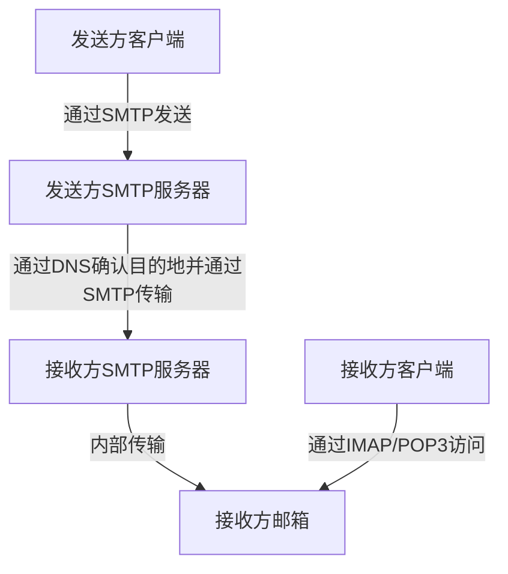
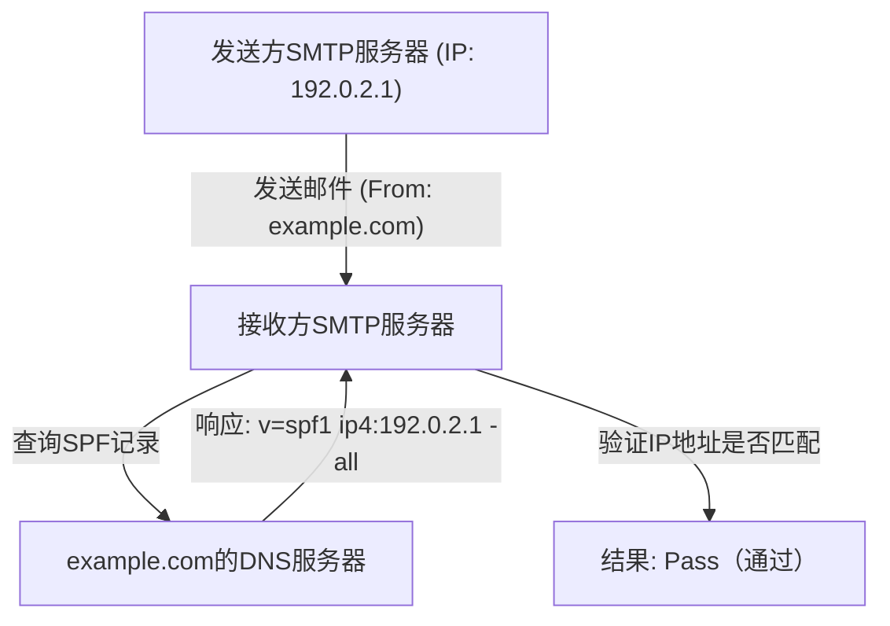
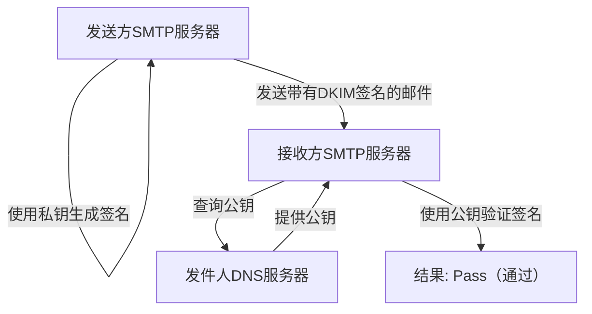

电子邮件是互联网上历史最悠久、至今仍被最广泛使用的通信方式之一。然而，在我们平时不经意按下发送按钮的背后，有多个协议（通信规范）在复杂地协同工作，确保邮件能够准确无误地送达对方。

本文将从工程学的角度，全面解析电子邮件系统的全貌，从支撑邮件收发的基础协议（SMTP、IMAP），到现代邮件系统中不可或缺的安全技术（SPF、DKIM、DMARC）。

## 1. 邮件收发的基础协议

邮件的收发与邮政系统非常相似。就像你把信件投入信箱，通过邮局最终送达对方家里的信箱一样，电子邮件也会经过几台服务器最终到达对方。负责这一通信过程的就是SMTP、POP3和IMAP等协议。

### SMTP（Simple Mail Transfer Protocol）

SMTP是用于**发送和传输**邮件的协议。

1. **从用户到服务器的发送:** 当你通过邮件客户端（如Outlook、Thunderbird、Apple Mail等）发送邮件时，邮件首先会被发送到你所使用的邮件服务器（SMTP服务器）。
2. **服务器间的传输:** 发送方的SMTP服务器会查看收件人邮箱地址的域名（即`@example.com`部分），向DNS（Domain Name System）查询并获取目标邮件服务器的IP地址。然后，通过互联网将邮件传输给目标SMTP服务器。

SMTP是一个非常简单而强大的协议，但由于设计年代久远，最初并没有认证和加密功能。现在，加密通信的SMTPS（SMTP over SSL/TLS）以及执行发送者认证的SMTP-AUTH等已被广泛作为标准使用。

### IMAP（Internet Message Access Protocol）与 POP3（Post Office Protocol version 3）

IMAP和POP3是接收者在自己的设备上**阅读**已经到达对方邮件服务器的邮件的协议。

- **POP3:** 这是一种将服务器收到的邮件**下载**到用户设备（PC或智能手机）的协议。下载后的邮件基本上会从服务器上删除，因此不适合在多台设备上管理同一个邮箱（虽然可以通过设置保留在服务器上，但状态不会同步）。
- **IMAP:** 这是一种从用户设备上**浏览和操作**服务器上邮件的协议。邮件的实体依然留在服务器上，已读/未读状态以及文件夹分类等都在服务器上进行管理。因此，可以从智能手机、平板电脑、PC等多台设备访问同一个邮箱，并始终保持同步状态。在现代的邮件环境中，IMAP已经成为主流。

## 2. 为什么需要防范垃圾邮件（Spam）？

仅靠上述机制，邮件的收发已经可以实现。然而，SMTP存在一个根本性的弱点：“伪造发件人非常容易”。

就像可以在信件的发件人一栏随便写上别人的名字一样，SMTP允许自由设置“From”地址。这导致了伪装成银行或知名企业的钓鱼邮件以及大量的垃圾邮件泛滥。

为了防止这种“伪造（欺骗）”行为，并证明邮件发件人的合法性，引入了一种名为**发件人域认证**的技术。其中最具代表性的是SPF、DKIM和DMARC这三种。

## 3. SPF（Sender Policy Framework）

SPF是一种使用“**IP地址**”来证明发件人合法性的机制。

### SPF的工作原理

1. **发送方的准备（发布DNS记录）:** 域名所有者在自己域名的DNS中注册被称为“SPF记录”的信息。其中记录了“允许代表该域名发送邮件的合法IP地址（或服务器）”的列表。
2. **接收方的验证:** 接收方邮件服务器在收到邮件时，会检查邮件的发件人IP地址。接着，向发件人域名的DNS查询并获取SPF记录。
3. **比对:** 如果实际的发件人IP地址包含在SPF记录所列出的列表中，则判定为“合法发件人（Pass）”，如果不包含，则判定为“伪造（Fail）”。

### SPF的局限性

SPF非常有效，但也有其弱点。
- 当发生邮件转发（Forwarding）时，发件人的IP地址会变成转发服务器的IP地址，从而可能导致SPF验证失败。
- 它验证的是“信封From（通信级别的发件人）”，而不是用户在邮件客户端中看到的“信头From（显示上的发件人）”。

## 4. DKIM（DomainKeys Identified Mail）

DKIM是一种使用“**数字签名（加密技术）**”来证明发件人合法性以及邮件未被篡改的机制。

### DKIM的工作原理

1. **发送方的准备（注册公钥）:** 域名所有者生成一对私钥和公钥，并将公钥注册到自身域名的DNS中（DKIM记录）。
2. **发送时的签名:** 发送方邮件服务器在发送邮件时，根据邮件头部和部分正文计算出哈希值，并使用私钥对其进行加密。这便形成了“数字签名”，附加在邮件头部（DKIM-Signature）中。
3. **接收方的验证:** 接收方服务器收到邮件后，从发件人域名的DNS中获取公钥。
4. **比对:** 使用获取的公钥解密数字签名，提取出原始的哈希值。同时，接收方自己也对收到的邮件数据计算哈希值，并验证两者是否一致。如果一致，则判定为“未被篡改，且是由持有私钥的合法发件人发送的（Pass）”。

DKIM的优势在于它不像SPF那样容易因转发而失败，并且能够保证邮件内容未被篡改（完整性）。

## 5. DMARC（Domain-based Message Authentication, Reporting, and Conformance）

虽然SPF和DKIM实现了邮件的认证，但仍然存在一些问题：
- 当SPF或DKIM验证失败时，接收方服务器应该如何处理这封邮件（是放入垃圾邮件文件夹，还是直接拒收），没有统一的标准。
- 无法完全防止利用信头From（用户看到的地址）和信封From（系统看到的地址）不一致来进行的伪造攻击。

为了解决这些问题并作为统筹认证技术的策略，**DMARC**应运而生。

### DMARC的作用

1. **对齐（Alignment）验证:** DMARC不仅检查SPF和DKIM的认证结果，还会严格检查用户实际看到的“信头From”域名是否与通过SPF或DKIM认证的域名相匹配（对齐）。
2. **策略声明:** 发件人域名的管理员可以在DNS中注册DMARC记录，向接收方指示“如果收到认证（SPF/DKIM）失败的邮件，接收方应如何处理”的策略。
   - `p=none` : 不采取任何操作（监控模式）
   - `p=quarantine` : 放入垃圾邮件文件夹等（隔离）
   - `p=reject` : 拒绝接收
3. **报告功能:** DMARC具有让接收方服务器向发件人域名管理员发送认证结果报告的功能。管理员可以通过这些报告监控自有域名是否被滥用，以及正常的邮件是否被误拦截。

如果DMARC策略被设置为“reject（拒绝）”，伪造的邮件在到达收件人之前就会被强力拦截，从而极大地减少钓鱼欺诈等安全事件的发生。近年来，Google（Gmail）和Yahoo!等大型邮件提供商正日益加强对发件人部署DMARC的强制要求。

## 总结

电子邮件系统从简单的传输协议起步，随着时代的发展，已经演变成一种更加安全的通信方式。

- **SMTP**负责传输邮件，**IMAP**让邮件的管理和阅读更加便捷。
- 为了弥补任何人都可以冒充发件人的弱点，**SPF**通过IP地址、**DKIM**通过数字签名来证明发件人的身份。
- 而**DMARC**则将这些技术结合起来进行严格管理，将伪造邮件拒之门外。

对于现代工程师来说，理解这些机制是保护自有域名、确保邮件能够可靠送达给用户的必备知识。虽然邮件的基础设施往往在幕后默默运行，但正是这些技术每天都在保障我们沟通的安全。
