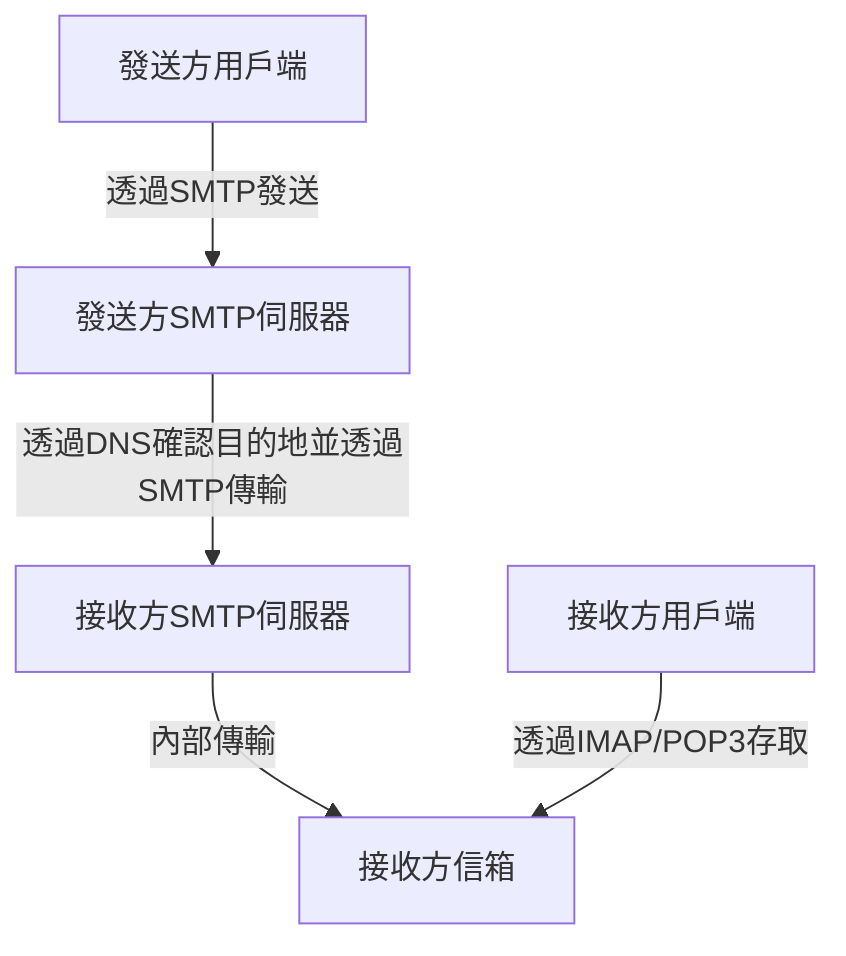
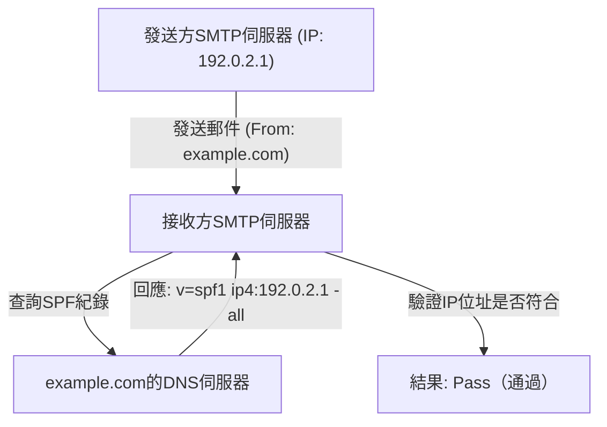
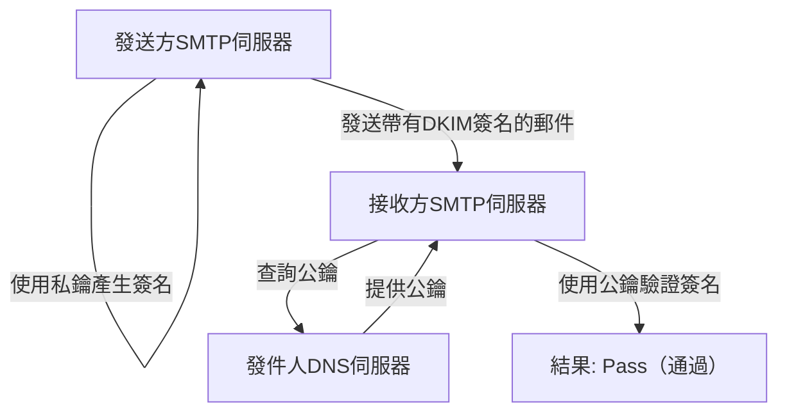

電子郵件是網際網路上歷史最悠久、至今仍被最廣泛使用的通訊方式之一。然而，在我們平時不經意按下發送按鈕的背後，有多個協定（通訊規範）在複雜地協同運作，確保郵件能夠準確無誤地送達對方。

本文將從工程學的角度，全面解析電子郵件系統的全貌，從支撐郵件收發的基礎協定（SMTP、IMAP），到現代郵件系統中不可或缺的安全技術（SPF、DKIM、DMARC）。

## 1. 郵件收發的基礎協定

郵件的收發與郵政系統非常相似。就像你把信件投入信箱，透過郵局最終送達對方家裡的信箱一樣，電子郵件也會經過幾台伺服器最終到達對方。負責這一通訊過程的就是SMTP、POP3和IMAP等協定。

### SMTP（Simple Mail Transfer Protocol）

SMTP是用於**發送和傳輸**郵件的協定。

1. **從使用者到伺服器的發送:** 當你透過郵件用戶端（如Outlook、Thunderbird、Apple Mail等）發送郵件時，郵件首先會被發送到你所使用的郵件伺服器（SMTP伺服器）。
2. **伺服器間的傳輸:** 發送方的SMTP伺服器會查看收件者信箱地址的網域（即`@example.com`部分），向DNS（Domain Name System）查詢並取得目標郵件伺服器的IP位址。然後，透過網際網路將郵件傳輸給目標SMTP伺服器。

SMTP是一個非常簡單而強大的協定，但由於設計年代久遠，最初並沒有認證和加密功能。現在，加密通訊的SMTPS（SMTP over SSL/TLS）以及執行發送者認證的SMTP-AUTH等已被廣泛作為標準使用。

### IMAP（Internet Message Access Protocol）與 POP3（Post Office Protocol version 3）

IMAP和POP3是接收者在自己的裝置上**閱讀**已經到達對方郵件伺服器的郵件的協定。

- **POP3:** 這是一種將伺服器收到的郵件**下載**到使用者裝置（PC或智慧型手機）的協定。下載後的郵件基本上會從伺服器上刪除，因此不適合在多台裝置上管理同一個信箱（雖然可以透過設定保留在伺服器上，但狀態不會同步）。
- **IMAP:** 這是一種從使用者裝置上**瀏覽和操作**伺服器上郵件的協定。郵件的實體依然留在伺服器上，已讀/未讀狀態以及資料夾分類等都在伺服器上進行管理。因此，可以從智慧型手機、平板電腦、PC等多台裝置存取同一個信箱，並始終保持同步狀態。在現代的郵件環境中，IMAP已經成為主流。

## 2. 為什麼需要防範垃圾郵件（Spam）？

僅靠上述機制，郵件的收發已經可以實現。然而，SMTP存在一個根本性的弱點：「偽造發件人非常容易」。

就像可以在信件的寄件者一欄隨便寫上別人的名字一樣，SMTP允許自由設定「From」地址。這導致了偽裝成銀行或知名企業的釣魚郵件以及大量的垃圾郵件氾濫。

為了防止這種「偽造（欺騙）」行為，並證明郵件發件人的合法性，引入了一種名為**發件人網域認證**的技術。其中最具代表性的是SPF、DKIM和DMARC這三種。

## 3. SPF（Sender Policy Framework）

SPF是一種使用「**IP位址**」來證明發件人合法性的機制。

### SPF的運作原理

1. **發送方的準備（發布DNS紀錄）:** 網域所有者在自己網域的DNS中註冊被稱為「SPF紀錄」的資訊。其中記錄了「允許代表該網域發送郵件的合法IP位址（或伺服器）」的列表。
2. **接收方的驗證:** 接收方郵件伺服器在收到郵件時，會檢查郵件的發件人IP位址。接著，向發件人網域的DNS查詢並取得SPF紀錄。
3. **比對:** 如果實際的發件人IP位址包含在SPF紀錄所列出的列表中，則判定為「合法發件人（Pass）」，如果不包含，則判定為「偽造（Fail）」。

### SPF的侷限性

SPF非常有效，但也有其弱點。
- 當發生郵件轉發（Forwarding）時，發件人的IP位址會變成轉發伺服器的IP位址，從而可能導致SPF驗證失敗。
- 它驗證的是「信封From（通訊級別的發件人）」，而不是使用者在郵件用戶端中看到的「信頭From（顯示上的發件人）」。

## 4. DKIM（DomainKeys Identified Mail）

DKIM是一種使用「**數位簽章（加密技術）**」來證明發件人合法性以及郵件未被竄改的機制。

### DKIM的運作原理

1. **發送方的準備（註冊公鑰）:** 網域所有者產生一對私鑰和公鑰，並將公鑰註冊到自身網域的DNS中（DKIM紀錄）。
2. **發送時的簽名:** 發送方郵件伺服器在發送郵件時，根據郵件標頭和部分內文計算出雜湊值，並使用私鑰對其進行加密。這便形成了「數位簽章」，附加在郵件標頭（DKIM-Signature）中。
3. **接收方的驗證:** 接收方伺服器收到郵件後，從發件人網域的DNS中取得公鑰。
4. **比對:** 使用取得的公鑰解密數位簽章，提取出原始的雜湊值。同時，接收方自己也對收到的郵件資料計算雜湊值，並驗證兩者是否一致。如果一致，則判定為「未被竄改，且是由持有私鑰的合法發件人發送的（Pass）」。

DKIM的優勢在於它不像SPF那樣容易因轉發而失敗，並且能夠保證郵件內容未被竄改（完整性）。

## 5. DMARC（Domain-based Message Authentication, Reporting, and Conformance）

雖然SPF和DKIM實現了郵件的認證，但仍然存在一些問題：
- 當SPF或DKIM驗證失敗時，接收方伺服器應該如何處理這封郵件（是放入垃圾郵件資料夾，還是直接拒收），沒有統一的標準。
- 無法完全防止利用信頭From（使用者看到的地址）和信封From（系統看到的地址）不一致來進行的偽造攻擊。

為了解決這些問題並作為統籌認證技術的策略，**DMARC**應運而生。

### DMARC的作用

1. **對齊（Alignment）驗證:** DMARC不僅檢查SPF和DKIM的認證結果，還會嚴格檢查使用者實際看到的「信頭From」網域是否與透過SPF或DKIM認證的網域相符（對齊）。
2. **策略聲明:** 發件人網域的管理員可以在DNS中註冊DMARC紀錄，向接收方指示「如果收到認證（SPF/DKIM）失敗的郵件，接收方應如何處理」的策略。
   - `p=none` : 不採取任何動作（監控模式）
   - `p=quarantine` : 放入垃圾郵件資料夾等（隔離）
   - `p=reject` : 拒絕接收
3. **報告功能:** DMARC具有讓接收方伺服器向發件人網域管理員發送認證結果報告的功能。管理員可以透過這些報告監控自有網域是否被濫用，以及正常的郵件是否被誤攔截。

如果DMARC策略被設定為「reject（拒絕）」，偽造的郵件在到達收件人之前就會被強力攔截，從而極大地減少釣魚詐騙等安全事件的發生。近年來，Google（Gmail）和Yahoo!等大型郵件供應商正日益加強對發件人部署DMARC的強制要求。

## 總結

電子郵件系統從簡單的傳輸協定起步，隨著時代的發展，已經演變成一種更加安全的通訊方式。

- **SMTP**負責傳輸郵件，**IMAP**讓郵件的管理和閱讀更加便捷。
- 為了彌補任何人都可以冒充發件人的弱點，**SPF**透過IP位址、**DKIM**透過數位簽章來證明發件人的身分。
- 而**DMARC**則將這些技術結合起來進行嚴格管理，將偽造郵件拒之門外。

對於現代工程師來說，理解這些機制是保護自有網域、確保郵件能夠可靠送達給使用者的必備知識。雖然郵件的基礎設施往往在幕後默默運作，但正是這些技術每天都在保障我們溝通的安全。
