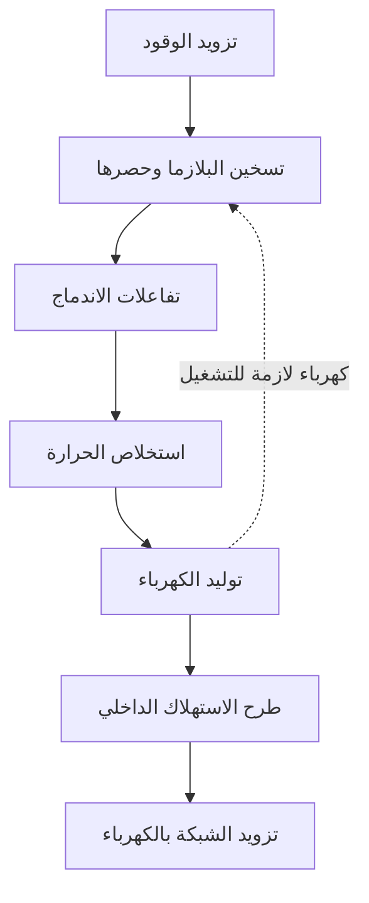
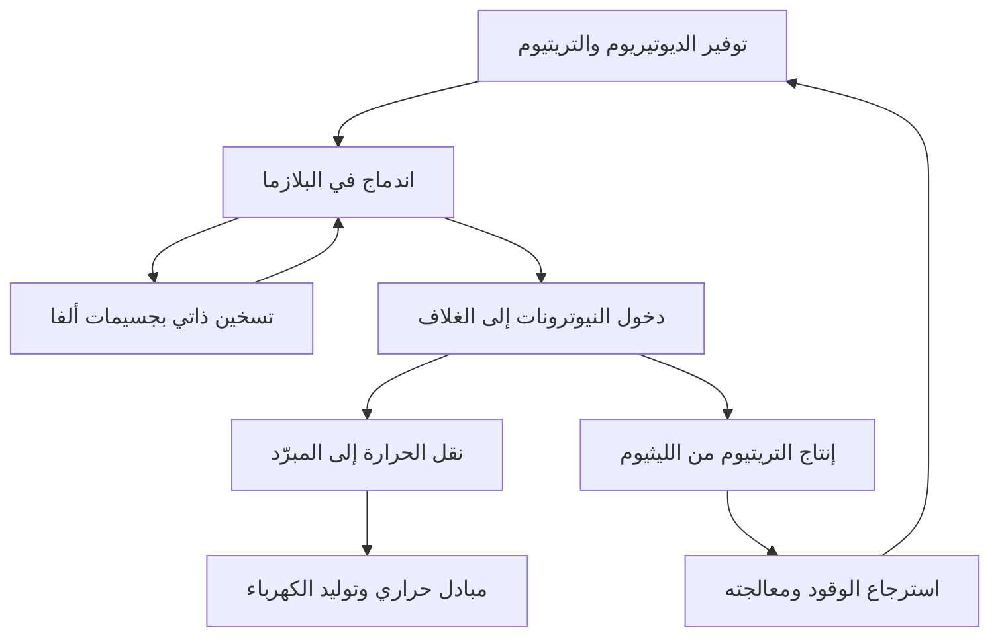

## 1. إحداث الاندماج ليس تشغيل محطة كهرباء

يمد الاندماج الشمس والنجوم بالطاقة. وقد يتيح تسخيره على الأرض تحرير طاقة كبيرة من كمية صغيرة من الوقود. لكن رصد التفاعل يختلف عن تشغيل محطة تزود الشبكة بالكهرباء.

إشعال النار لا يعني امتلاك محطة حرارية. فلا بد من جمع الحرارة وتشغيل مولد وتوفير الوقود والتحكم والصيانة. ويضيف الاندماج تحديات حصر وقود شديد السخونة وحماية المنشآت من النيوترونات الناتجة.

لذلك يجب فصل **حدوث التفاعل وتوازن الطاقة وتشغيل المحطة**. قد يحقق اختبار تقدماً مهماً دون استيفاء سائر المتطلبات. جاذبية مصدر الطاقة ليست مقياساً لمدى جاهزيته الصناعية.

يركز المقال على الديوتيريوم والتريتيوم، وهما مزيج وقود مدروس على نطاق واسع. توجد مسارات أخرى، والمهم فهم ما يثبته كل اختبار دون اعتبار رقم قياسي واحد دليلاً على اكتمال التقنية كلها. [وزارة الطاقة الأمريكية: طاقة الاندماج][doe-overview]

## 2. لماذا يحرر الانشطار والاندماج طاقة؟

يقسم الانشطار نواة ثقيلة، بينما يجمع الاندماج نوى خفيفة. ويمكن للعملتين تحرير الطاقة لأن الترتيبات النووية المختلفة لها طاقات مختلفة.

تسمى البروتونات والنيوترونات معاً نوكليونات. وتزداد طاقة الربط لكل نوكليون عموماً من النوى الخفيفة نحو المتوسطة، وتبلغ قيماً مرتفعة قرب الحديد والنيكل. اتحاد نوى خفيفة مناسبة يؤدي إلى حالة أقل طاقة ويحرر الفرق. وليس اتحاد أي نواتين اعتباطاً مولداً للطاقة بالضرورة.

$$
E=\Delta m c^2
$$

يمثل $\Delta m$ فرق كتلة السكون بين النظامين قبل التفاعل وبعده. لا تتحول كتلة الوقود كلها إلى كهرباء؛ إذ تبقى نواتج. تظهر الطاقة أولاً في حركة الجسيمات وغيرها، ثم تستخلص على هيئة حرارة وتحوّل إلى كهرباء.

في مفاعل الانشطار تسبب النيوترونات انشطارات جديدة فتحافظ على التفاعل المتسلسل. أما الاندماج فيحتاج شروطاً تتيح اقتراب النوى المتفاعلة بتواتر كافٍ. الطبيعة النووية المشتركة لا تجعل المعدات أو سلوك التوقف متماثلاً. [ITER: أساسيات الاندماج][fusion-basics]

## 3. لماذا الديوتيريوم والتريتيوم؟

تحتوي نواة الهيدروجين العادي على بروتون واحد. ويحتوي الديوتيريوم على بروتون ونيوترون، والتريتيوم على بروتون ونيوترونين. هذه نظائر للعنصر نفسه تختلف في عدد النيوترونات. ومن الرمزين D وT تأتي تسمية تفاعل D–T.

$$
{}^{2}_{1}\mathrm{H}+{}^{3}_{1}\mathrm{H}
\rightarrow{}^{4}_{2}\mathrm{He}+{}^{1}_{0}\mathrm{n}+17.6\,\mathrm{MeV}
$$

الناتجان نواة هيليوم-4 ونيوترون. عندما تكون طاقة الجسيمات الداخلة صغيرة مقارنة بطاقة التفاعل، تحمل نواة الهيليوم نحو 3.5 MeV والنيوترون نحو 14.1 MeV، أي قرابة 17.6 MeV إجمالاً. وتسمى نواة الهيليوم المشحونة أيضاً جسيم ألفا. [معهد كارلسروه: توزيع طاقة D–T][dt-energy]

يؤثر هذا التقسيم في تصميم المحطة. فجسيمات ألفا المحصورة مغناطيسياً تسخن البلازما، بينما تغادر النيوترونات غير المشحونة إلى المنشآت المحيطة. **يستخلص جزء كبير من طاقة الاندماج خارج البلازما.**

يوفر D–T معدلات تفاعل مهمة عند درجات حرارة أقل نسبياً من عدة أنواع وقود مقترحة. لكن سهولة التفاعل النسبية لا تعني سهولة الإمداد: التريتيوم مشع ويحتاج توفيراً واسترجاعاً وتوليداً. ولا تحل تفاعلات الديوتيريوم مع نفسه أو البروتون والبورون محله مباشرة في الظروف ذاتها. [ITER: الشروط المطلوبة][making-work]

## 4. لماذا نحتاج حرارة مرتفعة جداً؟

النواتان موجبتا الشحنة فتتنافران كهربائياً. ويجب أن تقتربا كثيراً كي تعمل القوى النووية. رفع الحرارة يزيد طاقة الحركة والتصادمات القادرة على الإسهام في التفاعل.

لكن ليس صحيحاً أن كل جسيم يجب أن يتجاوز الحاجز كاملاً وفق الفيزياء الكلاسيكية. للطاقات توزيع، ويسهم النفق الكمومي في احتمال التفاعل. الحرارة تغير معدل حدوثه وليست مفتاح تشغيل وإيقاف بسيطاً. [محاضرة ITER في CERN: التفاعلية والنفق الكمومي][fusion-lecture]

يعبر الباحثون أحياناً عن الحرارة بوحدة keV، أي عن الطاقة $k_B T$، حيث $k_B$ ثابت بولتزمان. يقابل 1 keV نحو 11.6 مليون كلفن، و10 keV نحو 116 مليوناً. لذلك تصف عبارتا مئة مليون درجة وعشرة keV تقريباً مقياساً متشابهاً.

حرارة مركز الشمس نحو 15 مليون درجة، بينما تتناول أبحاث D–T الأرضية مئة مليون أو أكثر. لا نعيد على الأرض حجم الشمس أو جاذبيتها أو كثافتها أو وقودها. فالشمس تعتمد أساساً سلسلة تبدأ بالبروتونات، بينما تفضل شروط الحصر الأرضية تفاعلاً آخر. الشمس الاصطناعية استعارة وليست نسخة مصغرة. [ITER][fusion-basics]، [وزارة الطاقة: البلازما المحترقة][burning]

## 5. البلازما ليست جسماً صلباً ساخناً

عند حرارة كافية تنفصل الإلكترونات عن النوى، فتتكون بلازما من أيونات موجبة وإلكترونات متحركة. ورغم تعادلها التقريبي ككل، تستجيب جسيماتها المشحونة للمجالات الكهربائية والمغناطيسية.

لماذا لا ينصهر الوعاء فوراً؟ تختلف البلازما المحصورة مغناطيسياً عن المعدن الصلب في الكثافة وانتقال الحرارة. فدرجة الحرارة تصف مقياس طاقة حركة الجسيم، لا إجمالي الطاقة المخزونة. حجم من جسيمات شديدة السخونة وقليلة العدد لا يختزن ما يختزنه الحجم نفسه من مادة كثيفة.

مع ذلك تتلقى الجدران طاقة من الجسيمات والإشعاع والنيوترونات. يحد المجال من التماس المباشر مع المركز الساخن، لكنه ليس عزلاً مثالياً. فلا الوعاء مستحيل من حيث المبدأ، ولا الجدران آمنة تلقائياً. يجب حل الحصر وأحمال الجدران معاً.

## 6. الحرارة والكثافة وزمن حصر الطاقة

لا تكفي حرارة عالية إذا كانت التصادمات نادرة، ولا كثافة عالية إذا برد الوقود أو تشتت فوراً. لذلك تدرس الحرارة $T$ والكثافة $n$ وزمن حصر الطاقة $\tau_E$ معاً.

في وصف مبسط، الزمن هو الطاقة المخزونة $W$ مقسومة على قدرة الفقد $P_{\mathrm{loss}}$:

$$
\tau_E=\frac{W}{P_{\mathrm{loss}}}
$$

إذا خُزنت 100 MJ وفُقدت 50 MW كان الزمن ثانيتين. لا يعني ذلك أن البلازما تختفي بعد ثانيتين. فحوض متسرب يحافظ على مستواه إذا عوض التدفق الداخل الفقد؛ وبالمثل يمكن تعويض الطاقة لإطالة التفريغ. **مدة التفريغ وزمن حصر الطاقة كميتان مختلفتان.**

يربط معيار لوسون الكثافة والحصر بتوازن تسخين الاندماج والفواقد. ويستخدم كثيراً الجداء الثلاثي $nT\tau_E$. قرب الحرارة المناسبة لاشتعال D–T، يكون المقياس عدة $10^{21}$ keV·s·m$^{-3}$. لكن الشرط يتغير مع الوقود والحرارة والكسب المطلوب وتعريف الكثافة، وليس علامة نجاح موحدة لكل التجارب. [معهد ماكس بلانك لفيزياء البلازما][triple-product]

| الكمية | ما تصفه | ما لا تثبته وحدها |
|---|---|---|
| الحرارة | طاقة حركة الجسيمات | تكرار التفاعلات واستمرارها |
| الكثافة | عدد الجسيمات في الحجم | حرارة كافية وفقد منخفض |
| زمن حصر الطاقة | الطاقة المخزونة قياساً بالفقد | مدة التفريغ الكاملة |
| مدة التفريغ | زمن الحفاظ على حالة تشغيل | قدرة الاندماج والتوازن الكهربائي |

## 7. معدل التفاعل وتركيب الوقود

في بلازما D–T متجانسة ومبسطة جداً، يكتب عدد التفاعلات لكل حجم وزمن:

$$
R=n_D n_T\langle\sigma v\rangle
$$

يمثل $n_D$ و$n_T$ كثافتي الديوتيريوم والتريتيوم، و$\sigma$ المقطع العرضي للتفاعل، و$v$ السرعة النسبية. الأقواس تعني المتوسط على توزيع السرعات. ليست كل التصادمات بالسرعة نفسها، فلا يتناسب المعدل ببساطة مع الحرارة.

عند تثبيت الكثافة الكلية $n=n_D+n_T$ وبقية الشروط، يبلغ $n_Dn_T$ أقصاه حين يكون الوقود مناصفة. زيادة نوع واحد تترك شركاء أقل للتفاعل. كما في تكوين أزواج من مجموعتين، لا تضمن زيادة مجموعة واحدة زيادة عدد الأزواج دائماً.

مضاعفة الكثافتين تعطي أربعة أمثال المعدل فقط إذا بقيت الظروف الأخرى ثابتة. عملياً يتغير الضغط والإشعاع والاستقرار أيضاً. لا يكفي عامل واحد في المعادلة لإثبات أن زيادة الكثافة تحل كل شيء. [دراسة الكسب ومعيار لوسون][lawson-paper]

## 8. كيف تحصر المجالات المغناطيسية البلازما؟

تؤثر قوة لورنتز في الجسيم المشحون:

$$
\mathbf{F}=q\left(\mathbf{E}+\mathbf{v}\times\mathbf{B}\right)
$$

يحني الجزء المغناطيسي المسار، فيدور الجسيم حول خط المجال ويتحرك بمحاذاته. قوة المجال الساكن عمودية على السرعة، فلا تبذل مباشرة شغلاً لتسخين الجسيم. لذلك تختلف وظيفة الحصر عن وظيفة التسخين.

يسمح المجال المستقيم بالخروج من الطرفين. إغلاق المسار في حلقة يزيل الطرفين، لكن الانحناء وتغير شدة المجال يسببان انجرافات. ويساعد لَيّ خطوط المجال على تكوين ترتيب مناسب لحركة الجسيمات وتوازن الضغط.

عبارة الإمساك بالمغناطيس تختصر تفاعلاً بين الدوران والهندسة والتيار والضغط وعدم الاستقرار. تقوية المجال وحدها لا تضمن حصراً طويلاً. [مختبر برينستون لفيزياء البلازما][magnetic]

## 9. التوكاماك والستيلاراتور

يجمع التوكاماك مجالات الملفات الخارجية مع مجال تيار يمر في البلازما الحلقية. يسهم التيار في الحصر، لكنه يحتاج استدامة وحماية المعدات من تغيراته المفاجئة.

تحريض التيار بطريقة تشبه المحول يحد التشغيل المستمر. وتستخدم أيضاً وسائل غير تحريضية بالموجات أو الحزم. ليس صحيحاً أن كل توكاماك يعمل دائماً لفترات قصيرة فقط، ولا أن التيار يستمر بلا نهاية دون وسائل إضافية.

ينشئ الستيلاراتور الالتواء أساساً بملفات خارجية ثلاثية الأبعاد. تقليل الاعتماد على تيار بلازما كبير يفيد التشغيل المستقر، مقابل صعوبة تصميم الملفات وتصنيعها وتحديد مواضعها وضبط فقد الجسيمات. [معهد ماكس بلانك: الستيلاراتور][stellarator]

| الجانب | التوكاماك | الستيلاراتور |
|---|---|---|
| التواء خطوط المجال | ملفات وتيار البلازما | ملفات ثلاثية الأبعاد أساساً |
| تحديات التشغيل الطويل | استدامة التيار والاستقرار وطرد الحرارة | تحسين المجال والتصنيع وطرد الحرارة |
| الهندسة | تناظر محوري تقريبي | شكل ثلاثي الأبعاد معقد |
| التحديات المشتركة | الوقود والمواد والحرارة والصيانة والكهرباء | الوقود والمواد والحرارة والصيانة والكهرباء |

لا توجد قاعدة بسيطة تختار فائزاً وحيداً. يجب مقارنة قابلية البناء والإصلاح والاعتمادية طويلة الأجل، إلى جانب أداء البلازما.

## 10. التسخين الخارجي ثم التسخين الذاتي

يسخن تيار التوكاماك البلازما بالمقاومة. لكن المقاومة تنخفض مع ارتفاع الحرارة، فتظهر حدود الاعتماد على هذه الوسيلة وحدها. يلزم إدخال طاقة إضافية.

تحقن الحزم المتعادلة جسيمات سريعة غير مشحونة لا يحرفها المجال بسهولة. وبعد دخول البلازما تنقل طاقتها بالتأين والتصادمات. وتستخدم أيضاً الترددات الراديوية والموجات الدقيقة. لا يحول أي جهاز كل كهربائه إلى حرارة في البلازما. [ITER: التسخين الخارجي][heating]

كلما زادت تفاعلات D–T ارتفع التسخين الذاتي من جسيمات ألفا. وتسمى البلازما التي يهيمن فيها هذا المصدر بلازما محترقة؛ ولا يعني الاحتراق هنا تفاعلاً كيميائياً مع الأكسجين.

في الحصر المغناطيسي، يعني الاشتعال مثالياً أن تسخين نواتج الاندماج يعوض الفقد دون تسخين خارجي. لكن المضخات والتبريد والتحكم ما زالت تحتاج كهرباء. الاستقلال الحراري للبلازما غير الاستقلال الكهربائي للمحطة. [وزارة الطاقة: البلازما المحترقة][burning]

## 11. الاندماج بالليزر يستفيد من زمن قصير جداً

يحاول الحصر المغناطيسي إبقاء بلازما ساخنة قليلة الكثافة نسبياً مدة طويلة. أما الحصر القصوري فيضغط وقوداً قليلاً إلى كثافة عالية ليتفاعل قبل تمدده. ويمكن لليزر توفير طاقة الدفع.

تدرس منشأة الإشعال الوطنية الأمريكية NIF ضغط أهداف صغيرة وتسخينها. تحتاج المحطة إلى تصنيع الأهداف وإدخالها وتشعيعها وإزالة النواتج وإدارة الحرارة قبل الحدث التالي، مراراً وباعتمادية. لا يثبت اختبار واحد نجاح هذه السلسلة الصناعية.

في 5 ديسمبر 2022 أنتج اختبار NIF طاقة اندماج قدرها 3.15 MJ من 2.05 MJ من طاقة الليزر الواصلة إلى الهدف. أثبت الإنجاز التاريخي كسباً للهدف فوق الواحد، لا توازناً كهربائياً موجباً يشمل استهلاك منشأة الليزر كاملة. [مختبر لورنس ليفرمور: اختبار الاشتعال][nif]

في مثال حسابي افتراضي، تعطي 100 MJ لكل حدث مع خمسة أحداث في الثانية قدرة اندماج متوسطة 500 MW. لا يثبت الضرب تحقق معدل التكرار وكلفة الأهداف وكفاءة الليزر وعمر المعدات معاً. يجب فصل قدرة الذروة وطاقة النبضة والقدرة المتوسطة.

## 12. عشرة أضعاف المدخل: أي مدخل؟

في الحصر المغناطيسي يقارن كسب البلازما $Q$ عادة قدرة الاندماج بقدرة التسخين الخارجي الواصلة فعلاً إلى البلازما:

$$
Q=\frac{P_{\mathrm{fusion}}}{P_{\mathrm{heat}}}
$$

يستهدف ITER إنتاج 500 MW من الاندماج مقابل 50 MW من التسخين، أي $Q=10$. هذا هدف بحثي، وليس رقماً تجارياً تحقق بالفعل. ولم يصمم ITER لتحويل هذه الحرارة إلى كهرباء تباع للشبكة. [ITER: أهداف المشروع][iter-goals]

لا يعني $Q=10$ إنتاج عشرة أمثال الكهرباء المستهلكة. توجد خسائر بين الكهرباء وتسخين البلازما، وأخرى بين الحرارة والكهرباء المولدة. كما يستهلك التبريد والتفريغ ومعالجة الوقود كهرباء.

لنأخذ نموذجاً تعليمياً: قدرة اندماج 1,000 MW و$Q=10$ تعني تسخيناً خارجياً 100 MW. بكفاءة 50% من الكهرباء إلى حرارة البلازما، يستهلك المسخن 200 MW كهربائية. وتحويل قدرة الاندماج وحدها بكفاءة 40% يعطي 400 MW كهربائية. بطرح 200 MW للتسخين و100 MW لبقية المعدات يتبقى 100 MW للشبكة.

$$
P_{\mathrm{net}}\approx\eta_e P_{\mathrm{fusion}}
-\frac{P_{\mathrm{fusion}}}{Q\eta_h}-P_{\mathrm{aux}}
$$

يهمل النموذج استعادة التسخين الخارجي كحرارة والطاقة الإضافية لتفاعلات الغلاف. غايته شرح حدود الحساب، لا توقع محطة حقيقية. مع الافتراضات نفسها و$Q=5$ يرتفع استهلاك المسخن إلى 400 MW ويصبح الصافي سالب 100 MW. **كسب البلازما غير الكهرباء المتاحة للشبكة.**

| المقياس | حدود المدخل | ما يخبرنا به |
|---|---|---|
| كسب البلازما | التسخين الواصل للبلازما | النسبة إلى قدرة الاندماج |
| كسب الهدف | الطاقة الواصلة للهدف | النسبة إلى طاقة الحدث |
| الكهرباء الصافية | استهلاك المحطة كلها | إمكانية تصدير الكهرباء |
| الجدوى الاقتصادية | البناء والتشغيل والوقود والصيانة | إمكان تقديم الكهرباء كنشاط اقتصادي |

## 13. الغلاف يستخلص الحرارة ويولد الوقود

تعبر نيوترونات D–T مجال الحصر، ثم تنقل طاقتها الحركية إلى المواد المحيطة كحرارة. ويعد الغلاف المحيط بالبلازما عنصراً رئيسياً لجمعها في مفاعل القدرة.

ليس الغلاف مجرد عازل. بل يجمع استخلاص الحرارة وحماية المعدات مثل المغناطيسات وإنتاج التريتيوم. تتفاعل النيوترونات مع مواد تحتوي الليثيوم، ويجب استخراج التريتيوم الناتج وإعادته إلى دورة الوقود.

تتنافس الوظائف على المساحة. يحمي التدريع السميك المغناطيسات أكثر، لكنه يزيد الحجم والكتلة. ولا يمكن ملء فتحات التشخيص والتسخين في الوقت نفسه بمادة مولدة للتريتيوم. وقد تختلف الهندسة الأفضل للنيوترونات عن الأفضل لاستخلاص الحرارة.

يخطط ITER لاختبار وحدات من الغلاف المولد للوقود في بيئة اندماج. وجود وحدات اختبار لا يعني إثبات الاكتفاء الوقودي لمحطة كاملة. [ITER: توليد التريتيوم][breeding]

## 14. وقود من ماء البحر: وصف غير مكتمل

يمكن الحصول على الديوتيريوم من الماء، لكن D–T يحتاج التريتيوم أيضاً. عمره النصفي نحو 12.3 سنة ولا توجد منه مخزونات طبيعية متراكمة ضخمة. لذلك يتطلب التشغيل الطويل توليده واسترجاعه. [ITER: المسرد][glossary]

تقارن نسبة التوليد كمية التريتيوم المنتجة بالمستهلكة في الاندماج. قد تبدو قيمة لا تقل عن واحد كافية، لكن يجب احتساب تأخر الاستخراج والاحتجاز في المواد والمعدات والفواقد والاضمحلال ومخزون بدء محطات أخرى.

حتى لو عاد كل الوقود المستهلك لاحقاً، تحتاج المحطة مخزوناً للعمل أثناء الانتظار. تساوي الإنتاج والاستهلاك السنويين لا يضمن توفر الوقود في كل لحظة. التوقيت جزء من الميزانية.

ولا يتفاعل كل الوقود المحقون في مرور واحد. يجب إخراج الوقود غير المتفاعل والهيليوم والشوائب وفصلها لإعادة المفيد. الاستهلاك في التفاعل ومعدل المعالجة والمخزون الكلي كميات مختلفة. قلة الاستهلاك النووي لا تعني معدات معالجة صغيرة وبسيطة.

وفرة الموارد ميزة، لكنها لا تستبدل تقنيات التحضير والإمداد وإعادة التدوير. [الوكالة الدولية للطاقة الذرية: دورة وقود D–T][fuel-cycle]

## 15. الاحتفاظ بالحرارة مع إخراجها

يجب أن يبقى مركز البلازما ساخناً، بينما تجمع المحطة الطاقة الخارجة وتحافظ على حرارة مقبولة للجدران. المطلوب تحقيق الأمرين معاً.

عند الحافة تخرج رماد الهيليوم والشوائب والحرارة. يؤدي المحوّل الحراري الطرفي، أو الديفرتور، جزءاً من المهمة في التوكاماك. وكالتدفق المتجمع عند مخرج، قد تتركز الحرارة على مساحة صغيرة. لا يكفي استمرار البلازما إذا تلفت القطع بسرعة.

الفيض الحراري قدرة لكل مساحة. يتناول تصميم ديفرتور ITER أحمالاً مستقرة من رتبة 10 MW/m$^2$. على مربع ضلعه 10 cm تعادل 100 kW. لذلك قد تتطلب مساحة صغيرة تبريداً كبيراً. [ITER: الديفرتور][divertor]

ارتفاع نقطة انصهار التنغستن لا يحل المشكلة وحده. يجب انتقال الحرارة عبر البنية والوصلات إلى المبرّد. ويهم أيضاً الإجهاد الحراري المتكرر والتآكل وتلوث البلازما. قد تزيد شوائب الجدار الفقد الإشعاعي، فتترابط المواد وسلوك البلازما.

رقم قياسي للحرارة وفترات استبدال عملية يقيسان قدرتين مختلفتين. لا يحدد رقم أقصى منفرد المسافة إلى محطة تجارية.

## 16. النيوترونات تغير المواد أيضاً

تزيح النيوترونات السريعة ذرات المواد عن مواقعها. وقد تنتج التفاعلات النووية عناصر أخرى وغازات داخلها، فتحدث هشاشة وانتفاخ وتغيرات في التوصيل الحراري.

لا يحاكي فرن ساخن وحده هذه البيئة. فالحرارة والأحمال الميكانيكية والتشعيع وكيمياء المبرّد تعمل معاً. يجب أن تتنبأ التجارب والمحاكاة بعمر الخدمة مع بيانات كافية للتحقق. [الوكالة الدولية: أضرار التشعيع][materials]

تنشّط النيوترونات المواد إشعاعياً أيضاً. لذا فادعاء غياب أي نفايات مشعة مضلل. تعتمد النظائر والكميات وفترات الإدارة على المادة والتشعيع وتاريخ التشغيل ومسار التخلص. وتسعى المواد منخفضة التنشيط إلى تحسين الأداء وتقليل عبء الإدارة اللاحق.

تتطلب الصيانة مناولة عن بعد: إزالة قطع كبيرة وتركيب البدائل بدقة وفحصها في مناطق صعبة الوصول. قابلية التجميع لا تضمن سهولة الإصلاح. تؤثر مدة التوقف للاستبدال أو العطل في الإنتاج والكلفة.

اختلاف التوقف عن الانشطار لا يلغي المخاطر كلها. يحتاج التريتيوم والمواد المنشطة والطاقة المغناطيسية المخزونة والسوائل الساخنة أو المضغوطة إلى إدارة مناسبة. [ITER: السلامة والبيئة][safety]

## 17. الموصلية الفائقة لا تصفّر استهلاك المحطة

تحتاج المجالات القوية تيارات كبيرة. تقلل الموصلات الفائقة مقاومة التيار المستمر كثيراً في الظروف الملائمة، فتساعد على حفظ المجال بكفاءة. لكن استهلاك المنشأة الكلي لا يصبح صفراً.

صممت مغناطيسات ITER للعمل قرب 4 K. توجد أجزاء شديدة البرودة قرب البلازما الساخنة، فتحتاج عزلاً فراغياً ودروعاً حرارية وتبريداً وأنابيب مبردة. استخدام خاصية المادة يتطلب هندسة مساندة واسعة. [ITER: التبريد العميق][cryogenics]

الموصل الفائق عالي الحرارة لا يعني التشغيل في حرارة الغرفة. المقصود احتفاظه بالخاصية عند حرارة أعلى من المواد التقليدية؛ وفي المجالات والتيارات الكبيرة يظل محتاجاً للتبريد والحماية. كما يجب التعامل مع القوى والطاقة المخزونة أثناء الأعطال.

تستهلك مضخات الفراغ ومعالجة الوقود والحواسيب والتحكم كهرباء. والمعدات الغائبة عن صورة البلازما اللامعة هي التي تمكن التشغيل. قصر الحساب على البلازما يخفي هذا العبء. [ITER: المغناطيسات][magnets]، [التغذية الكهربائية][power-supply]

## 18. قياس ما لا يمكن الوصول إليه والتحقق من النماذج

تحتاج الحرارة والكثافة والمجالات والإشعاع والنواتج تشخيصات متعددة. لا يمكن وضع ميزان حرارة عادي في المركز. يوفر الضوء والموجات والجسيمات والإشارات المغناطيسية معلومات غير مباشرة.

ولا يمثل قياس واحد النظام كله بالضرورة. تختلف الحافة عن المركز وتتغير الحالة مع الزمن. إذا كان القياس متكاملاً على خط الرؤية، فإعادة بناء التوزيع المكاني تحتاج افتراضات أو قياسات إضافية. يجب فصل عدم يقين الجهاز عن افتراض النموذج. [ITER: التشخيصات][diagnostics]

المحاكاة أساسية للاضطراب ونقل الجسيمات وهندسة المجال واستجابة المواد. لكن رسم تفاعل بالحاسوب لا يثبت جاهزية محطة. ينبغي تحديد ظروف صلاحية النموذج ومقارنته بالتجربة.

وينطبق ذلك على التعلم الآلي في التحكم. التنبؤ الجيد ببيانات سابقة لا يضمن الأداء في نظام جديد أو عند تعطل مستشعر. الخوارزميات لا تزيل مشكلات الوقود والمواد وطرد الحرارة. الاندماج منظومة تجمع القياس والفيزياء والهندسة.

## 19. من لغز النجوم إلى التجارب الأرضية

في أوائل القرن العشرين لم يكن الاحتراق الكيميائي يفسر طول عمر الشمس. اقترح إدنغتون عام 1920 أن تحويل الهيدروجين إلى هيليوم قد يغذي النجوم. ثم ارتبط البحث النووي بنظريات باطنها.

وسعت تجارب أوليفانت وهارتك ورذرفورد على الديوتيريوم عام 1934 دراسة تفاعلات النوى الخفيفة. وطورت أعمال بيته وغيرِه التفسير النووي للطاقة النجمية. [ITER: التاريخ المبكر][history-early]

في الخمسينيات سعى الباحثون إلى الاندماج الأرضي المتحكم به كمصدر طاقة. كانت بعض الأبحاث سرية، وشكل مؤتمر جنيف الدولي عام 1958 محطة انفتاح وتعاون. تبين أن عدم الاستقرار والفقد أعقد من التقديرات الأولية. [الوكالة الدولية: تاريخ التعاون][history-cooperation]

قادت تطورات المجال والتسخين والفراغ والموصلية الفائقة والتشخيص والحوسبة إلى التجارب الكبيرة. يدمج ITER البلازما المحترقة والتقنيات المرتبطة بها، بينما يمثل اشتعال NIF تقدماً في الحصر القصوري. تختلف الطرق وحدود حساب الطاقة، فلا تكون النتائج درجات قابلة للاستبدال مباشرة.

| المرحلة | السؤال | المهمة التالية |
|---|---|---|
| طاقة النجوم | لماذا تضيء الشمس طويلاً؟ | فهم التفاعلات كمياً |
| التفاعلات المختبرية | هل يمكن رصد تفاعل النوى الخفيفة؟ | مصدر طاقة واسع النطاق |
| الاندماج المتحكم به | هل يمكن إبقاء الوقود ساخناً؟ | تقليل الفقد وعدم الاستقرار |
| الكسب المرتفع | هل يهيمن التسخين الذاتي؟ | الوقود والمواد والتكرار والمدة |
| محطة تجريبية | هل تتوفر كهرباء صافية باستمرار؟ | الاعتمادية والصيانة والكلفة والظروف الاجتماعية |

لا يعني تاريخ البحث الطويل استحالة إحداث الاندماج؛ فهو يحدث فعلاً. الصعوبة تلبية الحجم والمدة والإمداد وعمر المواد والكلفة معاً.

## 20. ستة أسئلة لفهم وعود التسويق التجاري

لا حاجة لتقليل قيمة التقدم. لكن لا ينبغي تحويل نتيجة معلنة ضمنياً إلى إنجاز مختلف.

1. **ماذا قيس؟** الحرارة والمدة والطاقة والكسب والكهرباء الصافية مؤشرات مختلفة.
2. **أين حُسب المدخل؟** تسخين البلازما وليزر الهدف وكهرباء المنشأة ليست شيئاً واحداً.
3. **أي وقود وظروف؟** التحكم بهيدروجين أو ديوتيريوم يختلف عن إنتاج D–T عالي القدرة.
4. **حدث واحد أم تشغيل متكرر؟** افحص الاستقرار والتوقف وعمر القطع إلى جانب الحد الأقصى.
5. **هل يتوفر الوقود والبدائل؟** احسب التوليد والاسترجاع والتصنيع والاستبدال والنفايات.
6. **خطة أم نتيجة مثبتة؟** راجع أدلة المواعيد والكلف وافتراضاتها.

تهم أيضاً الكهرباء السنوية القابلة للبيع. محطة تصدر 500 MW صافية تعطي نحو 2.19 TWh في سنة عادية عند معامل قدرة 50%، ونحو 3.50 TWh عند 80%. يوضح المثال أثر التشغيل والصيانة، ولا يتنبأ بمعامل قدرة محطات الاندماج.

تصغير الجهاز لا يخفض كل التكاليف تلقائياً. قد يقل ثمن التصنيع بينما يتركز الحمل الحراري ويصعب الوصول للإصلاح. وقد يساعد الحجم الكبير الحصر لكنه يرفع متطلبات البناء. تصمم الأبعاد والفيزياء وقابلية الصيانة والكلفة معاً.

جاذبية الاندماج هي طاقة كبيرة من نوى خفيفة. وتحقيقها يحتاج سلسلة كاملة: **توليد الحرارة واستخلاصها وإعادة الوقود واستبدال القطع وتقديم كهرباء أكثر مما تستهلكه المنشأة زمناً طويلاً**. هذه الصورة تجعل الإنجازات والعمل المتبقي أوضح.

## المصادر وحدود الرسوم

تستند طاقات التفاعل والنتائج التاريخية إلى الجهات المذكورة. كفاءات الأمثلة واستهلاكها المساعد وتكرارها ومعاملات قدرتها افتراضات تعليمية وليست توقعات لمحطة بعينها. صورة الغلاف المولدة بالذكاء الاصطناعي مفاهيمية؛ الملفات والأنابيب والألوان ليست مخططاً هندسياً.

- [وزارة الطاقة: الاندماج][doe-overview]، [البلازما المحترقة][burning]
- [ITER: الأساسيات][fusion-basics]، [الشروط][making-work]، [الأهداف][iter-goals]، [المسرد][glossary]
- [ITER: التسخين][heating]، [التريتيوم][breeding]، [الديفرتور][divertor]، [التشخيص][diagnostics]، [المغناطيسات][magnets]، [التبريد][cryogenics]، [الكهرباء][power-supply]، [السلامة][safety]
- [ماكس بلانك: الجداء الثلاثي][triple-product]، [الستيلاراتور][stellarator]؛ [برينستون: الحصر][magnetic]
- [دراسة معيار لوسون][lawson-paper]؛ [ليفرمور: اشتعال 2022][nif]
- [الوكالة الدولية: دورة الوقود][fuel-cycle]، [المواد][materials]، [التاريخ][history-cooperation]؛ [ITER: الأبحاث الأولى][history-early]
- [كارلسروه: طاقة D–T][dt-energy]؛ [محاضرة ITER في CERN][fusion-lecture]

[doe-overview]: https://www.energy.gov/topics/fusion-energy
[fusion-basics]: https://www.iter.org/fusion-energy/what-fusion
[making-work]: https://www.iter.org/fusion-energy/making-it-work
[burning]: https://www.energy.gov/science/doe-explainsburning-plasma
[triple-product]: https://www.ipp.mpg.de/83115/fusionsprodukt
[lawson-paper]: https://arxiv.org/abs/2105.10954
[magnetic]: https://w3.pppl.gov/scied/docs/undergrad_level_general_Plasma_Fusion_PPPL/Plasma_fusion_pppl.pdf
[stellarator]: https://www.ipp.mpg.de/9792/stellarator
[heating]: https://www.iter.org/machine/supporting-systems/external-heating-systems
[nif]: https://www.llnl.gov/article/50801/llnls-breakthrough-ignition-experiment-highlighted-physical-review-letters
[iter-goals]: https://www.iter.org/fusion-energy/what-will-iter-do
[breeding]: https://www.iter.org/machine/supporting-systems/tritium-breeding
[glossary]: https://www.iter.org/fusion-glossary
[fuel-cycle]: https://www-pub.iaea.org/MTCD/publications/PDF/TE-2076web.pdf
[divertor]: https://www.iter.org/machine/divertor
[materials]: https://nucleus-qa.iaea.org/sites/fusionportal/Pages/DPWS-6/Topics.aspx
[safety]: https://www.iter.org/faqs?thematic=75
[cryogenics]: https://www.iter.org/machine/supporting-systems/cryogenics
[magnets]: https://www.iter.org/machine/magnets
[power-supply]: https://www.iter.org/machine/supporting-systems/power-supply
[diagnostics]: https://www.iter.org/machine/supporting-systems/diagnostics
[history-early]: https://www.iter.org/node/20687/who-invented-fusion
[history-cooperation]: https://nucleus.iaea.org/sites/fusion-portal/SitePages/A-brief-history-of-nuclear-fusion.aspx?web=1
[dt-energy]: https://publikationen.bibliothek.kit.edu/1000161936/151265654
[fusion-lecture]: https://indico.cern.ch/event/116345/attachments/53370/76726/Campbell_ITER26Fusion-1_CERN_Apr11.pdf
