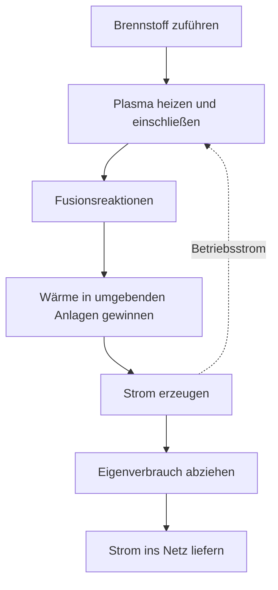
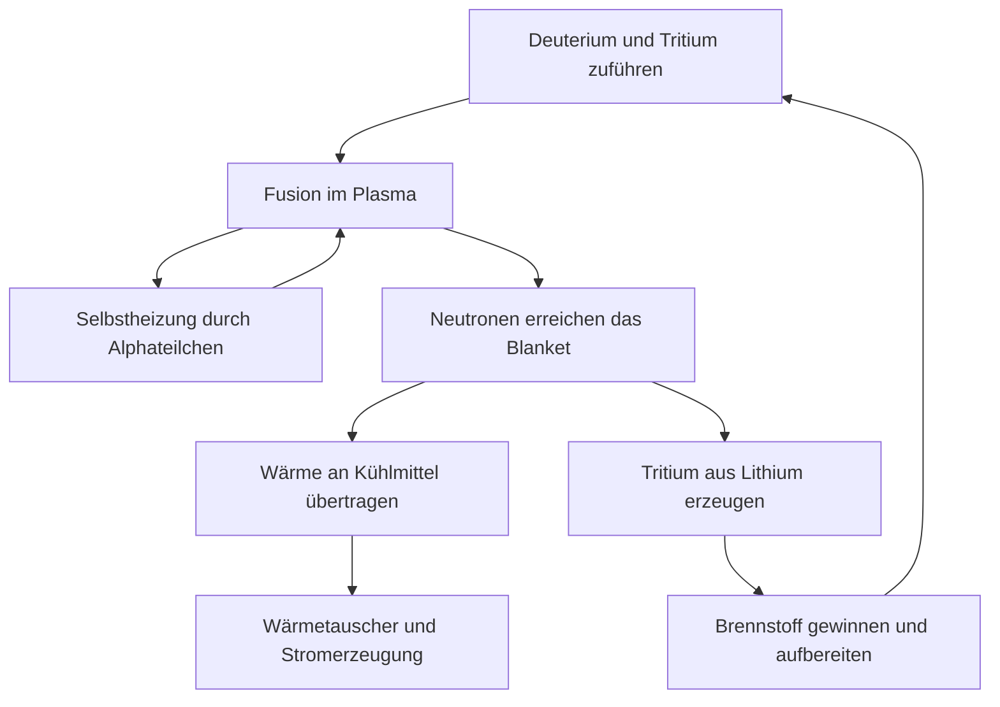

## 1. Zwischen einer Fusionsreaktion und einem Kraftwerk

Fusion liefert die Energie der Sonne und anderer Sterne. Auf der Erde könnte sie große Energiemengen aus wenig Brennstoff bereitstellen. Eine Fusionsreaktion zu beobachten ist jedoch etwas anderes, als mit einem Kraftwerk Strom an Verbraucher zu liefern.

Der Unterschied ähnelt dem zwischen einem entzündeten Feuer und dem Betrieb eines Wärmekraftwerks. Zur Wärmequelle gehören Anlagen zur Wärmerückgewinnung, ein Generator, Brennstoffversorgung, Regelung und Wartung. Bei Fusion kommen Fragen hinzu: Wie hält man extrem heißen Brennstoff zusammen, und wie schützt man Materialien vor den entstehenden Neutronen?

Zum Verständnis des Fortschritts müssen wir **Reaktion, Energiebilanz und Kraftwerksbetrieb** auseinanderhalten. Ein erfolgreiches Experiment kann ein wichtiger Schritt sein, ohne alle übrigen Voraussetzungen zu erfüllen. Das Versprechen einer neuen Energiequelle ist noch kein Maß ihrer technischen Reife.

Dieser Artikel konzentriert sich auf Deuterium und Tritium, eine wichtige Brennstoffkombination. Es gibt zahlreiche Ansätze. Entscheidend ist, was ein konkretes Experiment nachweist, statt seinen Rekord mit dem Entwicklungsstand des gesamten Gebiets gleichzusetzen. [US-Energieministerium: Fusionsenergie][doe-overview]

## 2. Was unterscheidet Spaltung und Fusion?

Kernspaltung zerlegt schwere Kerne, Kernfusion verbindet leichte. Beide scheinbar gegensätzlichen Prozesse können Energie freisetzen, weil unterschiedliche Kernanordnungen unterschiedliche Energien besitzen.

Protonen und Neutronen heißen zusammen Nukleonen. Die Bindungsenergie je Nukleon steigt von leichten zu mittelschweren Kernen im Allgemeinen an und erreicht nahe Eisen und Nickel hohe Werte. Verbinden sich geeignete leichte Kerne, entsteht ein energetisch niedrigerer Zustand; die Differenz wird frei. Nicht jede beliebige Verschmelzung von Kernen setzt Energie frei.

$$
E=\Delta m c^2
$$

$\Delta m$ bezeichnet die Differenz der Ruhemassen vor und nach der Reaktion. Nicht die gesamte Brennstoffmasse wird zu Strom: Reaktionsprodukte bleiben übrig. Die Energie erscheint zunächst etwa als Bewegung der Teilchen und wird erst später als Wärme oder Elektrizität genutzt.

Im Spaltreaktor lösen Neutronen weitere Spaltungen aus und erhalten die Kettenreaktion. Bei Fusion müssen sich die reagierenden Kerne unter geeigneten Bedingungen häufig genug annähern. Das gemeinsame Wort Kern bedeutet nicht, dass Abschaltung und Anlagentechnik identisch sind. [ITER: Was ist Fusion?][fusion-basics]

## 3. Warum Deuterium und Tritium?

Ein gewöhnlicher Wasserstoffkern enthält ein Proton. Deuterium enthält ein Proton und ein Neutron, Tritium ein Proton und zwei Neutronen. Atome desselben Elements mit verschiedener Neutronenzahl heißen Isotope. Aus den Kürzeln D und T entsteht die Bezeichnung D-T-Reaktion.

$$
{}^{2}_{1}\mathrm{H}+{}^{3}_{1}\mathrm{H}
\rightarrow{}^{4}_{2}\mathrm{He}+{}^{1}_{0}\mathrm{n}+17.6\,\mathrm{MeV}
$$

Es entstehen ein Helium-4-Kern und ein Neutron. Ist die Energie der einlaufenden Teilchen gegenüber der Reaktionsenergie klein, trägt der Heliumkern ungefähr 3,5 MeV und das Neutron etwa 14,1 MeV, zusammen rund 17,6 MeV. Den geladenen Heliumkern nennt man auch Alphateilchen. [Karlsruher Institut für Technologie: Energieaufteilung der D-T-Reaktion][dt-energy]

Diese Aufteilung prägt das Kraftwerk. Magnetisch eingeschlossene Alphateilchen helfen, das Plasma zu heizen. Ungeladene Neutronen lassen sich nicht auf dieselbe Weise einschließen und gelangen in die umgebenden Strukturen. **Ein großer Teil der Fusionsenergie wird außerhalb des Plasmas aufgenommen.**

D-T wird intensiv untersucht, weil es bei vergleichsweise niedrigeren Temperaturen hohe Reaktionsraten ermöglicht als andere wichtige Brennstoffkandidaten. Günstige Reaktionsphysik bedeutet aber nicht einfache Brennstoffversorgung. Tritium ist radioaktiv und erfordert Bereitstellung, Rückgewinnung und Erbrütung. Auch Deuterium-Deuterium und Proton-Bor werden erforscht, können D-T jedoch nicht unter unveränderten Bedingungen ersetzen. [ITER: Voraussetzungen und Energiegewinnung][making-work]

## 4. Warum braucht man so hohe Temperaturen?

Beide Kerne sind positiv geladen und stoßen sich elektrisch ab. Für Fusion müssen sie einander so nahe kommen, dass Kernkräfte wirken. Höhere Temperaturen bedeuten energiereichere Teilchenbewegung und mehr Zusammenstöße, die zur Reaktion beitragen können.

Es wäre dennoch ungenau, zu behaupten, jedes Teilchen müsse die Abstoßungsbarriere klassisch überwinden. Die Teilchenenergien sind verteilt, und quantenmechanisches Tunneln trägt zur Reaktionswahrscheinlichkeit bei. Temperatur ist kein einfacher Ein-Aus-Schalter, sondern beeinflusst die Reaktionshäufigkeit. [ITER-Vorlesung am CERN: Reaktionsraten und Tunneleffekt][fusion-lecture]

In der Fusionsforschung wird Temperatur manchmal in der Energieeinheit keV angegeben. Gemeint ist $k_B T$, mit der Boltzmann-Konstanten $k_B$. Ein keV entspricht ungefähr 11,6 Millionen K, zehn keV etwa 116 Millionen K. Hundert Millionen Grad in einem populären Bericht und Werte in der Größenordnung zehn keV in einem Fachartikel beschreiben also verwandte Größenordnungen.

Im Sonnenkern herrschen etwa 15 Millionen Grad, während magnetisch eingeschlossene D-T-Plasmen auf der Erde Temperaturen um hundert Millionen Grad oder mehr benötigen. Wir reproduzieren weder Größe noch Gravitation, Dichte, Brennstoff oder Reaktionsweg der Sonne. Dort beginnt die wesentliche Reaktionskette mit Protonen. Auf der Erde führen erreichbarer Einschluss und Reaktionsraten zu anderen Entscheidungen. Eine künstliche Sonne ist ein anschauliches Bild, kein verkleinertes Stück der echten Sonne. [ITER: Grundlagen][fusion-basics], [DOE: brennendes Plasma][burning]

## 5. Plasma ist kein heißer Festkörper

Bei ausreichend hoher Temperatur lösen sich Elektronen von den Kernen. Positive Ionen und Elektronen bewegen sich frei: Es entsteht Plasma. Insgesamt kann es nahezu elektrisch neutral sein, während seine einzelnen Teilchen geladen sind und auf elektrische und magnetische Felder reagieren.

Warum schmilzt ein Behälter für Materie mit hundert Millionen Grad nicht? Ein magnetisch eingeschlossenes Plasma unterscheidet sich in Dichte und Wärmeübertragung stark von festem Metall. Temperatur beschreibt die Energieskala einzelner Teilchen, nicht den gesamten Wärmeinhalt eines Körpers. Sehr heiße, aber wenige Teilchen speichern eine andere Energiemenge als dasselbe Volumen dichter Materie.

Das Wandproblem verschwindet dadurch nicht. Teilchen, Strahlung und Fusionsneutronen transportieren Energie zu den Strukturen. Magnetfelder verhindern den unmittelbaren Kontakt des heißesten Plasmakerns mit Material, schaffen aber keine perfekte Wärmedämmung.

Diese Unterscheidung erklärt sowohl die scheinbare Unmöglichkeit eines Behälters als auch den gegenteiligen Irrtum, die Wände seien deshalb unproblematisch. Das heiße Plasma erhalten und die Wandbelastung beherrschen sind verschiedene Anforderungen, die gleichzeitig erfüllt werden müssen.

## 6. Temperatur, Dichte und Einschlusszeit gehören zusammen

Hohe Temperatur genügt nicht, wenn die Teilchen kaum zusammenstoßen. Hohe Dichte hilft wenig, wenn der Brennstoff sofort abkühlt oder auseinanderfliegt. Deshalb betrachtet man Temperatur $T$, Teilchendichte $n$ und Energieeinschlusszeit $\tau_E$ gemeinsam.

Vereinfacht ist die Energieeinschlusszeit die gespeicherte Plasmaenergie $W$, geteilt durch die Verlustleistung $P_{\mathrm{loss}}$:

$$
\tau_E=\frac{W}{P_{\mathrm{loss}}}
$$

Bei 100 MJ gespeicherter Energie und 50 MW Verlust ergeben sich zwei Sekunden. Das Plasma muss deshalb nicht nach zwei Sekunden verschwinden. Wie eine undichte Badewanne ihren Wasserstand bei ausreichendem Zufluss hält, kann ein Plasma bei ersetzten Energieverlusten viel länger bestehen. **Entladungsdauer und Energieeinschlusszeit sind unterschiedliche Größen.**

Das Lawson-Kriterium bewertet benötigte Dichte und Einschluss anhand der Bilanz von Fusionsheizung und Verlusten. Häufig verwendet wird das Tripelprodukt $nT\tau_E$. Für D-T-Zündung nahe günstiger Temperaturen liegt eine typische Größenordnung bei einigen $10^{21}$ keV·s·m$^{-3}$. Die genaue Bedingung hängt aber von Brennstoff, Temperatur, gewünschtem Gewinn und Dichtedefinition ab. Eine Zahl ist kein universeller Grenzwert für sämtliche Konzepte. [Max-Planck-Institut für Plasmaphysik: Fusionsprodukt][triple-product]

| Größe | Aussage | Was allein daraus nicht folgt |
|---|---|---|
| Temperatur | Energieskala der Teilchenbewegung | Stoßhäufigkeit und anhaltende Reaktionen |
| Dichte | Teilchen pro Volumen | Genügende Temperatur und geringe Verluste |
| Energieeinschlusszeit | Speicherenergie im Verhältnis zur Verlustleistung | Gesamtdauer der Entladung |
| Entladungsdauer | Dauer eines Betriebszustands | Fusionsleistung und elektrische Bilanz |

## 7. Was die Reaktionsrate über die Brennstoffmischung verrät

Für ein stark vereinfachtes, homogenes D-T-Plasma lautet die Zahl der Reaktionen pro Volumen und Zeit:

$$
R=n_D n_T\langle\sigma v\rangle
$$

$n_D$ und $n_T$ sind die Teilchendichten von Deuterium und Tritium, $\sigma$ ist der Reaktionsquerschnitt und $v$ die Relativgeschwindigkeit. Die Klammern stehen für die Mittelung über die Geschwindigkeitsverteilung. Stöße erfolgen nicht alle mit derselben Geschwindigkeit; die Rate ist daher nicht einfach proportional zur Temperatur.

Hält man die gesamte Brennstoffionendichte $n=n_D+n_T$ und andere Bedingungen fest, wird $n_Dn_T$ bei gleichen Anteilen maximal. Mehr von nur einer Sorte führt irgendwann zu fehlenden Partnern. Ähnlich entstehen bei der Paarbildung aus zwei Gruppen nicht automatisch mehr Paare, wenn nur eine Gruppe wächst.

Die Formel ergibt auch eine vierfache Rate bei doppelter Dichte, sofern Temperatur und andere relevante Bedingungen unverändert bleiben. Real verändert höhere Dichte Druck, Strahlungsverluste und Stabilität. Ein einzelner Faktor beweist nicht, dass dichterer Brennstoff alle Probleme löst. Forschung untersucht auch, wie die Verbesserung einer Größe die anderen beeinflusst. [Forschung zu Fusionsgewinn und Lawson-Kriterium][lawson-paper]

## 8. Wie Magnetfelder das Plasma einschließen

Geladene Teilchen erfahren in elektrischen und magnetischen Feldern die Lorentzkraft:

$$
\mathbf{F}=q\left(\mathbf{E}+\mathbf{v}\times\mathbf{B}\right)
$$

Die Magnetkraft krümmt ihre Bahn. Sie kreisen um Feldlinien und bewegen sich zugleich entlang dieser Linien. Die Kraft eines statischen Magnetfelds steht senkrecht zur Geschwindigkeit und verrichtet selbst keine Arbeit zur Erwärmung des Teilchens. Einschlussfeld und Heizung erfüllen unterschiedliche Aufgaben.

Entlang der Feldlinien können Teilchen relativ leicht entweichen. Ein einfaches gerades Feld verliert deshalb Teilchen an seinen Enden. Ein Ring beseitigt die Enden, doch Krümmung und Unterschiede der Feldstärke verursachen Driften. Verdrillte Feldlinien helfen, eine Konfiguration für Teilchenbewegung und Druckgleichgewicht herzustellen.

Hinter der Formulierung mit Magneten festhalten stecken Kreisbewegung, Feldgeometrie, Strom, Druck und Instabilitäten. Ein stärkeres Feld allein garantiert nicht, dass beliebiges Plasma lange eingeschlossen bleibt. [Princeton Plasma Physics Laboratory: Plasma und magnetischer Einschluss][magnetic]

## 9. Tokamak und Stellarator

Ein Tokamak ist eine torusförmige Anlage. Er verbindet das Feld äußerer Spulen mit dem Feld eines Stroms im Plasma. Dieser Strom trägt zum Einschluss bei, muss aber aufrechterhalten werden; außerdem sind die Anlagen vor abrupten Änderungen zu schützen.

Die Strominduktion nach dem Transformatorprinzip begrenzt den Dauerbetrieb. Deshalb werden auch nichtinduktive Verfahren mit Wellen oder Teilchenstrahlen erforscht. Weder müssen Tokamaks grundsätzlich immer nur kurz laufen, noch hält ein einmal erzeugter Strom beliebig lange an.

Ein Stellarator erzeugt die Verdrillung hauptsächlich mit dreidimensional geformten äußeren Spulen. Ein Einschluss ohne Abhängigkeit von einem großen Plasmastrom bietet Vorteile für stationären Betrieb. Dafür werden komplizierter Spulenentwurf, Fertigung, Positionierungsgenauigkeit und geringe Teilchenverluste besonders wichtig. [Max-Planck-Institut für Plasmaphysik: Stellarator][stellarator]

| Aspekt | Tokamak | Stellarator |
|---|---|---|
| Verdrillung der Feldlinien | Äußere Spulen und Plasmastrom | Hauptsächlich dreidimensionale äußere Spulen |
| Aufgaben für langen Betrieb | Stromerhaltung, Stabilität, Wärmeabfuhr | Feldoptimierung, Fertigung, Wärmeabfuhr |
| Geometrie | Näherungsweise achsensymmetrisch | Komplexe dreidimensionale Form |
| Gemeinsame Kraftwerksaufgaben | Brennstoff, Materialien, Wärmenutzung, Wartung, Strombilanz | Brennstoff, Materialien, Wärmenutzung, Wartung, Strombilanz |

Es gibt keine einfache Regel, nach der nur ein Ansatz richtig wäre. Neben Plasmaleistung zählen Bau-, Reparatur- und langfristige Betriebsfähigkeit.

## 10. Äußere Heizung und ein Plasma, das sich selbst heizt

Tokamaks können den Plasmastrom zur Widerstandsheizung nutzen. Mit steigender Temperatur sinkt jedoch der Widerstand, sodass dieses Verfahren allein begrenzt ist. Weitere Energie muss von außen zugeführt werden.

Eine Möglichkeit ist Neutralteilcheninjektion. Energiereiche ungeladene Teilchen werden vom Einschlussfeld kaum abgelenkt, dringen ein und übertragen nach Ionisation und durch Stöße Energie. Eine andere nutzt Hochfrequenz- oder Mikrowellen und deren Wechselwirkung mit Teilchenbewegungen. Kein Verfahren überträgt den gesamten Stromverbrauch der Geräte als Wärme ins Plasma. [ITER: externe Heizsysteme][heating]

Mit mehr D-T-Reaktionen wächst die Selbstheizung durch Alphateilchen. Dominiert sie die Heizung, spricht man von einem brennenden Plasma. Brennen bedeutet hier keine chemische Reaktion mit Sauerstoff.

Zündung im magnetischen Einschluss bezeichnet idealerweise einen Zustand, in dem Fusionsprodukte die Verluste ohne äußere Heizung ausgleichen. Pumpen, Kälteanlagen und Regelung benötigen trotzdem Strom. Selbsterhaltung des Plasmas und elektrische Selbstversorgung des Kraftwerks haben unterschiedliche Bilanzgrenzen. [DOE: brennendes Plasma][burning]

## 11. Laserfusion nutzt ein kurzes Zeitfenster

Magnetischer Einschluss soll relativ dünnes, heißes Plasma lange halten. Trägheitseinschluss verdichtet dagegen eine kleine Brennstoffmenge stark und lässt sie reagieren, bevor sie wieder auseinanderfliegt. Laser sind eine Möglichkeit, die nötige Energie einzukoppeln.

Die US-amerikanische National Ignition Facility, NIF, erforscht die lasergetriebene Verdichtung und Erwärmung kleiner Brennstofftargets. Günstige Bedingungen in einem kurzen Versuch zu schaffen ist etwas anderes, als den Vorgang in einem Kraftwerk ständig zu wiederholen. Dazu braucht es zuverlässige Targetfertigung, Zuführung, Bestrahlung sowie den Abtransport von Produkten und Wärme vor dem nächsten Ereignis.

Am 5. Dezember 2022 erzeugte ein NIF-Versuch 3,15 MJ Fusionsenergie aus 2,05 MJ Laserenergie, die das Target erreichte. Dieser historische Erfolg zeigte einen Targetgewinn über eins. Er bewies keine positive Strombilanz einschließlich des gesamten Verbrauchs der Laseranlage. [Lawrence Livermore National Laboratory: Überprüfung des Zündungsexperiments][nif]

Ein hypothetisches Rechenbeispiel: 100 MJ pro Ereignis bei fünf Ereignissen je Sekunde ergeben 500 MW mittlere Fusionsleistung. Daraus folgt nicht, dass Wiederholrate, Targetkosten, Lasereffizienz und Anlagenlebensdauer bereits gemeinsam erreicht wurden. Spitzenleistung, Energie pro Puls und zeitlich gemittelte Leistung müssen getrennt werden.

## 12. Zehnmal mehr als der Einsatz: welcher Einsatz?

Bei Fusionsmeldungen ist der Energiegewinn besonders wichtig. Im magnetischen Einschluss vergleicht der Plasmagewinn $Q$ gewöhnlich die Fusionsleistung mit der von außen ins Plasma eingebrachten Heizleistung:

$$
Q=\frac{P_{\mathrm{fusion}}}{P_{\mathrm{heat}}}
$$

ITER strebt 500 MW Fusionsleistung bei 50 MW äußerer Heizung an, also $Q=10$. Das ist das Ziel einer Forschungsanlage, kein bereits erzieltes kommerzielles Stromergebnis. ITER soll diese Wärme auch nicht zur Stromlieferung an das Netz nutzen. [ITER: Projektziele][iter-goals]

Warum bedeutet $Q=10$ nicht den zehnfachen Stromertrag? Zwischen Stromversorgung und Plasmaheizung entstehen Verluste. Fusionsenergie wird zunächst überwiegend als Wärme aufgenommen, deren Umwandlung in Strom weitere Verluste verursacht. Kälteanlagen, Vakuumpumpen, Kühlung und Brennstoffaufbereitung brauchen ebenfalls Strom.

Betrachten wir ein Lehrmodell: Bei 1.000 MW Fusionsleistung und $Q=10$ sind 100 MW Plasmaheizung nötig. Unterstellt man 50% Wirkungsgrad vom Strom zur Plasmaheizung, braucht das Heizsystem 200 MW elektrisch. Werden konservativ nur die 1.000 MW Fusionsleistung mit 40% Wirkungsgrad verstromt, entstehen 400 MW elektrisch. Nach Abzug von 200 MW Heizstrom und 100 MW sonstigem Eigenverbrauch bleiben 100 MW zur Einspeisung.

$$
P_{\mathrm{net}}\approx\eta_e P_{\mathrm{fusion}}
-\frac{P_{\mathrm{fusion}}}{Q\eta_h}-P_{\mathrm{aux}}
$$

Das Modell lässt die spätere Wärmerückgewinnung der äußeren Heizung und zusätzliche Reaktionswärme im Blanket weg. Es erklärt Bilanzgrenzen, nicht die Auslegung einer realen Anlage. Bei denselben Annahmen und $Q=5$ steigt der Heizstrombedarf auf 400 MW; netto ergeben sich minus 100 MW. **Energiegewinn im Plasma ist nicht gleich Strom für das Netz.**

| Kennzahl | Eingangsgrenze | Aussage |
|---|---|---|
| Plasmagewinn | Heizleistung, die das Plasma erreicht | Verhältnis zur Fusionsleistung |
| Targetgewinn | Energie des Treibers am Target | Verhältnis zur Fusionsenergie pro Ereignis |
| Nettostrom | Stromverbrauch der gesamten Anlage | Ob Strom abgegeben werden kann |
| Wirtschaftlichkeit | Bau, Betrieb, Brennstoff, Wartung und weitere Kosten | Ob Stromversorgung wirtschaftlich tragfähig ist |

## 13. Das Blanket gewinnt Wärme und erbrütet Brennstoff

D-T-Neutronen sind ungeladen und durchqueren das magnetische Einschlussfeld. Bei Wechselwirkungen mit umgebendem Material wird ihre Bewegungsenergie zu Wärme. Eine zentrale Komponente zur Aufnahme dieser Energie im Kraftwerk ist das Blanket um das Plasma.

Ein Blanket ist keine bloße Wärmedämmung. Konzepte verbinden Wärmenutzung, Abschirmung äußerer Komponenten wie Magnete und Tritiumproduktion. Neutronen reagieren mit lithiumhaltigen Materialien; das entstehende Tritium wird gewonnen und in das Brennstoffsystem zurückgeführt.

Diese Aufgaben konkurrieren um Bauraum. Dickere Abschirmung schützt Magnete besser, erhöht aber Größe und Masse. Öffnungen für Diagnostik oder Heizung können nicht zugleich vollständig mit Brutmaterial gefüllt sein. Gute Wärmeabfuhr und effiziente Neutronennutzung bevorzugen nicht immer dieselbe Geometrie.

ITER plant, Brutblanketmodule in einer echten Fusionsumgebung zu erproben. Testmodule zu haben ist etwas anderes, als die Brennstoffselbstversorgung eines ganzen Kraftwerks nachgewiesen zu haben. [ITER: Tritiumbrüten][breeding]

## 14. Brennstoff aus Meerwasser ist nur ein Teil der Erklärung

Deuterium lässt sich aus Wasser gewinnen, doch D-T-Fusion braucht auch Tritium. Dieses ist radioaktiv, hat etwa 12,3 Jahre Halbwertszeit und liegt nicht als großer natürlich angesammelter Brennstoffvorrat vor. Für langfristigen Betrieb sind deshalb Brüten und Rückgewinnung wichtig. [ITER: Fusionsglossar][glossary]

Das Tritiumbrutverhältnis vergleicht erzeugtes Tritium mit dem in der Fusion verbrauchten. Ein Wert von mindestens eins klingt ausreichend. Tatsächlich müssen aber Rückgewinnungszeiten, Verzögerungen in Verarbeitung und Materialien, Verluste, Zerfall und Vorräte zum Start weiterer Anlagen berücksichtigt werden.

Selbst wenn genau die verbrauchte Menge später zurückkommt, braucht der Betrieb während der Wartezeit einen Vorrat. Diese zeitabhängige Bilanz lässt sich ohne detaillierte Chemie verstehen. Gleiche Jahresproduktion und gleicher Jahresverbrauch garantieren nicht, dass zu jedem Zeitpunkt genug Brennstoff vorhanden ist.

Außerdem reagiert nicht der gesamte zugeführte Brennstoff in einem Durchgang. Unverbrauchter Brennstoff, Helium und andere Stoffe müssen abgeführt und getrennt werden, damit nutzbarer Brennstoff zurückkehren kann. Reaktionsverbrauch, Durchsatz und gesamter Anlagenbestand sind unterschiedliche Mengen. Ein kleiner Verbrauch bedeutet nicht automatisch eine kleine, einfache Aufbereitung.

Reichliche Ressourcen sind ein Vorteil, ersetzen aber nicht die Technik zur Herstellung, Zuführung und Rückgewinnung des Brennstoffs. [IAEA: Physik und Technik des D-T-Brennstoffkreislaufs][fuel-cycle]

## 15. Wärme halten und zugleich Wärme gewinnen

Fusionskraftwerke müssen zwei scheinbar gegensätzliche Anforderungen erfüllen. Wärme soll im heißen Plasmakern bleiben; zugleich muss die Anlage die austretende Energie zuverlässig aufnehmen und die Wände innerhalb zulässiger Temperaturen halten.

Am Plasmarand werden Heliumasche, Verunreinigungen und Wärme abgeführt. Im Tokamak übernimmt der Divertor einen Teil dieser Aufgabe. Wie an einer Auslassöffnung kann sich viel Leistung auf kleiner Fläche konzentrieren. Langer Plasmaeinschluss genügt nicht, wenn die Komponenten dabei rasch beschädigt werden.

Die Wärmestromdichte bezeichnet die Leistung je Fläche. Beim ITER-Divertor dienen stationäre Belastungen in der Größenordnung von 10 MW/m$^2$ als Auslegungsgröße. Auf einem Quadrat mit 10 cm Seitenlänge wären das 100 kW. Schon kleine Flächen können also eine erhebliche Kühlung erfordern. [ITER: Divertor][divertor]

Wolfram mit hohem Schmelzpunkt allein löst das Problem nicht. Wärme muss durch Strukturen und Verbindungen ins Kühlmittel gelangen. Wiederholte thermische Lasten, Erosion und Verunreinigung des Plasmas zählen ebenfalls. Wandmaterial im Plasma kann Strahlungsverluste verstärken; Materialien und Plasma beeinflussen sich gegenseitig.

Eine Rekordtemperatur und ein Betrieb mit akzeptablen Austauschintervallen sind unterschiedliche Fähigkeiten. Auch deshalb lässt sich der Abstand zur Kommerzialisierung nicht an einem einzelnen Rekord ablesen.

## 16. Neutronen transportieren Wärme und verändern Materialien

Energiereiche D-T-Neutronen liefern nutzbare Wärme, schlagen aber auch Atome aus ihren Gitterplätzen. Kernreaktionen können andere Elemente und Gase im Material erzeugen. Mögliche Folgen sind Versprödung, Schwellung und veränderte Wärmeleitfähigkeit.

Ein Versuch im heißen Ofen allein bildet diese Umgebung nicht nach. Wärme, mechanische Belastung, Neutronenbestrahlung und chemische Wechselwirkung mit Kühlmitteln wirken zusammen. Experimente und Simulationen müssen Lebensdauern vorhersagen; geeignete Daten müssen diese Vorhersagen bestätigen. [IAEA: Bestrahlungsschäden an Fusionsmaterialien][materials]

Neutronen aktivieren Materialien außerdem. Die Aussage, Fusion verursache keinerlei radioaktiven Abfall, ist deshalb irreführend. Isotope, Mengen und nötige Lager- oder Behandlungszeiten hängen von Materialwahl, Bestrahlung, Betriebsdauer und Entsorgungsweg ab. Niedrig aktivierbare Werkstoffe sollen Leistung und spätere Belastungen verbessern.

Wartung erfordert daher Fernhantierung. In schwer zugänglicher Umgebung müssen große Komponenten entfernt, Ersatzteile präzise angeschlossen und Arbeiten geprüft werden. Eine montierbare Konstruktion ist nicht automatisch gut reparierbar. Neben Zuverlässigkeit bestimmen auch Reparatur- und Austauschzeiten Stromproduktion und Kosten.

Anderes Abschaltverhalten als bei Kernspaltung bedeutet nicht, dass sämtliche Gefahren entfallen. Tritium, aktiviertes Material, gespeicherte Magnetenergie und heiße oder unter Druck stehende Fluide brauchen jeweils angemessene Behandlung. [ITER: Sicherheit und Umwelt][safety]

## 17. Auch supraleitende Magnete gehören zu einer stromverbrauchenden Anlage

Starke Felder benötigen große Ströme. Supraleiter können unter geeigneten Bedingungen den Gleichstromwiderstand stark vermindern und dadurch starke Felder effizient halten. Der gesamte Stromverbrauch des Kraftwerks wird dadurch nicht null.

Supraleitung setzt niedrige Temperaturen voraus. Die ITER-Magnete sind für ungefähr 4 K ausgelegt. In der Nähe eines heißen Plasmas liegen extrem kalte Magnete; Vakuumisolierung, Wärmeschilde, Kälteanlage und Kryoleitungen sind daher entscheidend. Die Nutzung einer Materialeigenschaft verlangt umfangreiche unterstützende Technik. [ITER: Kryotechnik][cryogenics]

Hochtemperatursupraleiter bedeutet nicht Betrieb bei Raumtemperatur. Solche Materialien bleiben bei höheren Temperaturen supraleitend als herkömmliche, brauchen unter hohen Feldern und Strömen aber weiterhin Kühlung und Schutz. Auf Magnete wirken große Kräfte; bei Störungen ist auch ihre gespeicherte Energie zu beherrschen.

Vakuumpumpen, Brennstoffaufbereitung, Kühlung, Computer und Regelung verbrauchen ebenfalls Strom. Die Anlagen außerhalb des eindrucksvollen Plasmabilds ermöglichen den Dauerbetrieb. Eine Bilanzgrenze nur um das Plasma blendet diesen Aufwand aus. [ITER: Magnete][magnets], [Stromversorgung][power-supply]

## 18. Ein unzugängliches Plasma messen und mit Modellen verstehen

Temperatur, Dichte, Magnetfelder, Strahlung und Reaktionsprodukte erfordern unterschiedliche Diagnostik. Man kann nicht einfach ein Thermometer in die Mitte stecken. Licht, elektromagnetische Wellen, Teilchen und magnetische Signale liefern indirekte Informationen.

Eine Messung beschreibt nicht notwendigerweise das Ganze. Zentrum und Rand unterscheiden sich und ändern sich mit der Zeit. Wird entlang einer Sichtlinie integriert gemessen, braucht die Rekonstruktion eines räumlichen Profils zusätzliche Annahmen oder weitere Messungen. Messunsicherheit und Modellannahmen müssen getrennt betrachtet werden. [ITER: Diagnostik][diagnostics]

Simulationen untersuchen Turbulenz, Teilchentransport, Magnetgeometrie und Materialverhalten. Eine Reaktion am Bildschirm darzustellen beweist aber nicht die Einsatzbereitschaft einer Maschine. Modelle müssen zeigen, welche Bedingungen sie wiedergeben und welche noch nicht geprüft sind, und mit Experimenten verglichen werden.

Das gilt auch für maschinelles Lernen in Regelung und Vorhersage. Gute Ergebnisse mit historischen Daten garantieren keine Zuverlässigkeit in unbekannten Betriebsbereichen oder bei Sensorausfällen. Bessere Rechenverfahren beseitigen nicht automatisch Brennstoff-, Material- oder Wärmeabfuhrprobleme. Fusion verbindet Messung, Physik und Ingenieurwesen; ein einzelner kluger Algorithmus vollendet sie nicht.

## 19. Vom Rätsel der Sterne zu kontrollierten Reaktionen

Anfang des 20. Jahrhunderts war die lang anhaltende Energieversorgung der Sonne ein großes Rätsel. Chemische Verbrennung konnte sie nicht erklären. 1920 schlug Eddington vor, dass die Umwandlung von Wasserstoff zu Helium Sterne antreiben könnte. Kernforschung und Theorien des Sterninneren entwickelten sich daraufhin zusammen.

1934 erweiterten Deuteriumexperimente von Oliphant, Harteck und Rutherford die Erforschung leichter Kernreaktionen im Labor. Auch Bethe und andere verbanden mit ihren Arbeiten zur stellaren Energieerzeugung Kernreaktionen und das Verständnis des Universums. [ITER: frühe Fusionsgeschichte][history-early]

In den 1950er-Jahren sollte kontrollierte Fusion auf der Erde zur Energiequelle werden. Manche frühen Arbeiten waren geheim; die internationale Konferenz 1958 in Genf wurde ein Meilenstein für Offenlegung und Zusammenarbeit. Plasmainstabilitäten und Verluste erwiesen sich als schwieriger, als einfache Abschätzungen vermuten ließen. [IAEA: Geschichte der Zusammenarbeit][history-cooperation]

Verbesserungen an Magnetgeometrie, Heizung, Vakuum, Supraleitung, Diagnostik und Berechnung führten zu heutigen Großexperimenten. ITER untersucht brennende Plasmen und zugehörige Technologien integriert, während die NIF-Zündung eine wichtige Demonstration des Trägheitseinschlusses ist. Das sind Ergebnisse verschiedener Methoden und Bilanzgrenzen, keine unmittelbar vergleichbaren Punktzahlen.

| Historische Stufe | Fragestellung | Nächste Aufgabe |
|---|---|---|
| Energiequelle der Sterne | Warum scheint die Sonne so lange? | Kernreaktionen quantitativ verstehen |
| Laborreaktionen | Lassen sich Reaktionen leichter Kerne beobachten? | Makroskopische Energiequelle schaffen |
| Kontrollierte Fusion | Lässt sich heißer Brennstoff halten? | Verluste und Instabilitäten begrenzen |
| Hoher Fusionsgewinn | Kann Fusionsheizung dominieren? | Brennstoff, Materialien, Wiederholung und Langzeitbetrieb |
| Kraftwerksdemonstration | Ist dauerhafte Nettostromlieferung möglich? | Zuverlässigkeit, Wartung, Kosten und gesellschaftliche Bedingungen |

Die lange Forschungsdauer damit zu erklären, dass Fusion nicht stattfinde, wäre falsch. Sie lässt sich erzeugen. Schwierig ist, Maßstab, Dauer, Brennstoff, Materialleistung und Kosten gleichzeitig zusammenzubringen.

## 20. Sechs Fragen zu Meldungen über die Kommerzialisierung

Fortschritt muss nicht kleingeredet werden. Ein Rekord darf aber auch nicht unbemerkt als etwas anderes ausgelegt werden. Sechs Fragen trennen Ergebnisse von offenen Aufgaben.

1. **Was wurde gemessen?** Temperatur, Dauer, Fusionsenergie, Gewinn und Nettostrom sind verschiedene Kennzahlen.
2. **Wo liegt die Eingangsgrenze?** Plasmaheizung, Laserenergie am Target und Anlagenstrom nicht vermischen.
3. **Welcher Brennstoff und welche Bedingungen?** Kontrolle von Wasserstoff- oder Deuteriumplasma erfüllt andere Zwecke als hohe D-T-Fusionsleistung.
4. **Einmal erreicht oder wiederholbarer Betrieb?** Neben Höchstwerten zählen Stabilität, Stillstand und Bauteillebensdauer.
5. **Sind Brennstoff und Ersatzteile verfügbar?** Brüten, Rückgewinnung, Fertigung, Austausch und Abfälle einbeziehen.
6. **Plan oder geprüfter Erfolg?** Annahmen und Nachweise hinter Terminen und Kosten prüfen.

Wirtschaftlich zählt die jährlich verkaufbare Strommenge. Eine Anlage mit 500 MW Nettoleistung liefert in einem normalen Jahr bei 50% Auslastung etwa 2,19 TWh, bei 80% etwa 3,50 TWh. Das zeigt den Einfluss von Betrieb und Wartung bei gleicher Nennleistung und ist keine Prognose der Verfügbarkeit von Fusionskraftwerken.

Kleinere Maschinen sind nicht automatisch überall günstiger. Fertigungskosten können sinken, während Wärme sich auf weniger Fläche konzentriert und Reparaturen schwieriger werden. Größere Anlagen können den Einschluss erleichtern, aber Bau und Herstellung verteuern. Größe, Physik, Wartbarkeit und Kosten gehören in eine gemeinsame Auslegung.

Der Reiz der Fusion liegt in großer Energie aus leichten Kernen. Entscheidend ist jedoch mehr als die höchste Plasmatemperatur. **Wärme erzeugen und gewinnen, Brennstoff zurückführen, Komponenten austauschen und langfristig mehr Strom liefern als verbrauchen.** Erst diese Gesamtsicht macht Erfolge und nächste Schritte verständlich.

## Quellen und Einordnung der Abbildungen

Reaktionsenergien und historische Ergebnisse beruhen auf den nachfolgenden Forschungsinstitutionen und internationalen Organisationen. Wirkungsgrade, Eigenverbrauch, Wiederholraten und Auslastung in Rechenbeispielen sind ausdrücklich gesetzte Lehrannahmen, keine Prognosen für eine bestimmte Anlage. Das KI-generierte Titelbild ist konzeptionell; Spulen, Leitungen und Leuchtfarben stellen keine technische Auslegung dar.

- [DOE: Fusionsenergie][doe-overview], [brennendes Plasma][burning]
- [ITER: Grundlagen][fusion-basics], [Voraussetzungen][making-work], [Ziele][iter-goals], [Glossar][glossary]
- [ITER: Heizung][heating], [Brüten][breeding], [Divertor][divertor], [Diagnostik][diagnostics], [Magnete][magnets], [Kryotechnik][cryogenics], [Stromversorgung][power-supply], [Sicherheit][safety]
- [Max-Planck-Institut: Fusionsprodukt][triple-product], [Stellarator][stellarator], [PPPL: magnetischer Einschluss][magnetic]
- [Forschung zu Lawson-Kriterium und Gewinn][lawson-paper], [LLNL: Zündung 2022][nif]
- [IAEA: D-T-Brennstoffkreislauf][fuel-cycle], [Materialschäden][materials], [Kooperationsgeschichte][history-cooperation], [ITER: frühe Geschichte][history-early]
- [KIT: D-T-Energieaufteilung][dt-energy], [ITER-Vorlesung am CERN: Fusionsphysik][fusion-lecture]

[doe-overview]: https://www.energy.gov/topics/fusion-energy
[fusion-basics]: https://www.iter.org/fusion-energy/what-fusion
[making-work]: https://www.iter.org/fusion-energy/making-it-work
[burning]: https://www.energy.gov/science/doe-explainsburning-plasma
[triple-product]: https://www.ipp.mpg.de/83115/fusionsprodukt
[lawson-paper]: https://arxiv.org/abs/2105.10954
[magnetic]: https://w3.pppl.gov/scied/docs/undergrad_level_general_Plasma_Fusion_PPPL/Plasma_fusion_pppl.pdf
[stellarator]: https://www.ipp.mpg.de/9792/stellarator
[heating]: https://www.iter.org/machine/supporting-systems/external-heating-systems
[nif]: https://www.llnl.gov/article/50801/llnls-breakthrough-ignition-experiment-highlighted-physical-review-letters
[iter-goals]: https://www.iter.org/fusion-energy/what-will-iter-do
[breeding]: https://www.iter.org/machine/supporting-systems/tritium-breeding
[glossary]: https://www.iter.org/fusion-glossary
[fuel-cycle]: https://www-pub.iaea.org/MTCD/publications/PDF/TE-2076web.pdf
[divertor]: https://www.iter.org/machine/divertor
[materials]: https://nucleus-qa.iaea.org/sites/fusionportal/Pages/DPWS-6/Topics.aspx
[safety]: https://www.iter.org/faqs?thematic=75
[cryogenics]: https://www.iter.org/machine/supporting-systems/cryogenics
[magnets]: https://www.iter.org/machine/magnets
[power-supply]: https://www.iter.org/machine/supporting-systems/power-supply
[diagnostics]: https://www.iter.org/machine/supporting-systems/diagnostics
[history-early]: https://www.iter.org/node/20687/who-invented-fusion
[history-cooperation]: https://nucleus.iaea.org/sites/fusion-portal/SitePages/A-brief-history-of-nuclear-fusion.aspx?web=1
[dt-energy]: https://publikationen.bibliothek.kit.edu/1000161936/151265654
[fusion-lecture]: https://indico.cern.ch/event/116345/attachments/53370/76726/Campbell_ITER26Fusion-1_CERN_Apr11.pdf
