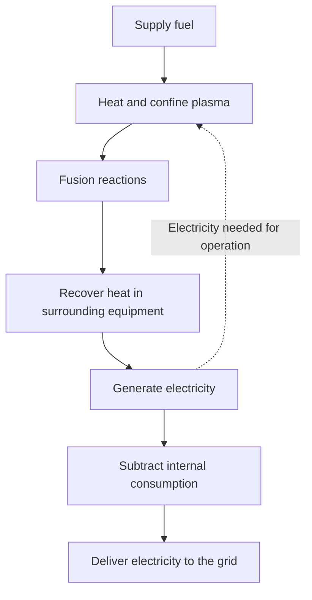
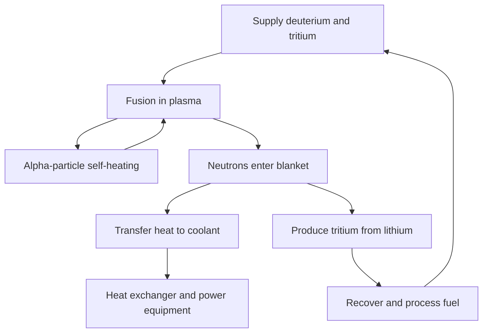

## 1. The gap between producing fusion and producing electricity

Fusion powers the Sun and other stars. Harnessing it on Earth could release considerable energy from a small amount of fuel. Observing fusion reactions, however, is different from supplying electricity as a utility power plant.

The distinction resembles the difference between lighting a fire and operating a thermal power station. A heat source needs equipment to collect its energy, a generator, fuel supply, controls, and maintenance. Fusion adds questions such as how to hold extremely hot fuel and how to protect materials from the neutrons it produces.

To understand progress, separate **creating the reaction, balancing energy, and operating a power plant**. An experimental success can be an important step without satisfying every other requirement. The appealing idea of a new energy source is not itself a measure of readiness.

This article centers on deuterium and tritium, a leading fuel combination in fusion development. Many approaches exist; the aim is to understand what a particular experiment demonstrates without treating its record as the readiness level of the whole field. [US Department of Energy: fusion energy][doe-overview]

## 2. What separates fission from fusion?

Fission divides heavy nuclei; fusion joins light ones. These apparently opposite processes can both release energy because different nuclear arrangements have different energies.

Protons and neutrons are collectively called nucleons. Binding energy per nucleon generally increases from light nuclei toward intermediate-mass nuclei, reaching high values near iron and nickel. Combining suitable light nuclei leads to a lower-energy state, releasing the difference. Joining arbitrary nuclei does not always release energy.

$$
E=\Delta m c^2
$$

Here $\Delta m$ is the difference in rest mass between the initial and final systems. The entire fuel mass does not become electricity: products remain. Energy first appears in forms such as product-particle motion and is subsequently recovered as heat or electricity.

In a fission reactor, neutrons triggering further fissions sustain the chain reaction. In fusion, the central requirement is maintaining conditions in which reacting nuclei approach each other frequently enough. The word nuclear does not make the shutdown behavior or equipment arrangements identical. [ITER: what fusion is][fusion-basics]

## 3. Why use deuterium and tritium?

An ordinary hydrogen nucleus contains one proton. Deuterium contains one proton and one neutron; tritium contains one proton and two neutrons. Atoms of the same element with different neutron counts are isotopes. Their abbreviations, D and T, give us the name D–T reaction.

$$
{}^{2}_{1}\mathrm{H}+{}^{3}_{1}\mathrm{H}
\rightarrow{}^{4}_{2}\mathrm{He}+{}^{1}_{0}\mathrm{n}+17.6\,\mathrm{MeV}
$$

The products are a helium-4 nucleus and a neutron. When the incoming particles' energy is small compared with the reaction energy, the helium nucleus carries about 3.5 MeV and the neutron about 14.1 MeV, totaling approximately 17.6 MeV. The charged helium nucleus is also called an alpha particle. [Karlsruhe Institute of Technology: D–T energy partition][dt-energy]

This division shapes plant design. Alpha particles confined by magnetic fields help heat the plasma. Uncharged neutrons are not confined in the same way and leave for the surrounding structures. **Much of fusion's energy is collected outside the plasma.**

D–T is widely studied because it offers substantial reaction rates at comparatively lower temperatures than other leading candidate fuels. Favorable reaction physics is not the same as easy fuel supply, however. Tritium is radioactive and requires provision, recovery, and breeding. Deuterium–deuterium and proton–boron reactions are also studied, but they cannot simply replace D–T under identical conditions. [ITER: requirements and energy recovery][making-work]

## 4. Why are such high temperatures needed?

Both nuclei are positively charged, so they repel each other electrically. Fusion requires them to approach closely enough for nuclear forces to act. Raising temperature makes particle motion more energetic and increases collisions capable of contributing to reactions.

It is nevertheless inaccurate to say that every particle must classically climb over the repulsive barrier. Particle energies follow a distribution, and quantum tunneling contributes to reaction probability. Temperature is not a simple on/off switch; it influences how frequently reactions occur. [ITER lecture at CERN: reaction rates and tunneling][fusion-lecture]

Fusion researchers sometimes express temperature in keV, an energy unit. They mean the value of $k_B T$, where $k_B$ is Boltzmann's constant. One keV corresponds to about 11.6 million K, so 10 keV means roughly 116 million K. A popular account discussing a hundred million degrees and a paper discussing temperatures of order ten keV are describing the same general scale.

The Sun's core is around 15 million degrees, while terrestrial magnetic-confinement D–T research discusses temperatures around a hundred million degrees or more. We are not reproducing the Sun's size, gravity, density, fuel, or reaction sequence. The Sun mainly generates energy through a chain beginning with protons. On Earth, available confinement and reaction-rate conditions favor different choices. An artificial sun is a useful metaphor, not a miniature piece of the actual Sun. [ITER: fusion basics][fusion-basics], [DOE: burning plasma][burning]

## 5. Plasma is not a hot solid

At sufficiently high temperatures, electrons separate from nuclei, leaving mobile positive ions and electrons. This is plasma. Although nearly electrically neutral overall, its individual particles carry charge and respond to electric and magnetic fields.

It is natural to ask why a container holding hundred-million-degree material does not melt. A magnetically confined plasma differs greatly from solid metal in density and heat transfer. Temperature describes the energy scale of individual particle motion, not the total heat content of an object. A very hot but sparse population stores a different amount of energy from an equal volume of dense matter.

This does not eliminate the wall problem. Particles, radiation, and fusion neutrons transport energy to structures. Magnetic fields help keep the hottest central plasma from directly contacting materials, but they do not create perfect thermal insulation.

This distinction resolves both the apparent impossibility of having a container and the opposite misconception that the walls must therefore be safe. Maintaining the hot plasma and managing loads on the walls are separate requirements that must be met together.

## 6. Temperature, density, and confinement time belong together

High temperature alone is insufficient if particles rarely collide. High density also fails if the fuel cools or disperses immediately. Researchers therefore consider temperature $T$, particle density $n$, and energy confinement time $\tau_E$ together.

In a simple description, energy confinement time is the stored plasma energy $W$ divided by loss power $P_{\mathrm{loss}}$:

$$
\tau_E=\frac{W}{P_{\mathrm{loss}}}
$$

For 100 MJ stored and 50 MW lost, the result is two seconds. This does not mean the plasma must disappear after two seconds. A leaking bathtub can retain its water level if inflow replaces the loss; similarly, replenishing energy can sustain a much longer discharge. **Discharge duration and energy confinement time are different quantities.**

The Lawson criterion evaluates required density and confinement from the balance of fusion heating and losses. A common measure is the triple product $nT\tau_E$. For D–T ignition near favorable temperatures, a characteristic scale is several $10^{21}$ keV·s·m$^{-3}$, but the condition depends on fuel, temperature, desired gain, and the density definition. One number must not become a universal pass mark for every approach. [Max Planck Institute for Plasma Physics: fusion triple product][triple-product]

| Quantity | What it describes | What it does not establish alone |
|---|---|---|
| Temperature | Energy scale of particle motion | Collision frequency and sustained reactions |
| Density | Particles per unit volume | Adequate temperature and low losses |
| Energy confinement time | Stored energy relative to loss power | Total discharge duration |
| Discharge duration | Time an operating state is sustained | Fusion output and electrical balance |

## 7. What the reaction-rate equation says about fuel mixing

For a highly simplified uniform D–T plasma, reactions per unit volume per unit time can be written as:

$$
R=n_D n_T\langle\sigma v\rangle
$$

$n_D$ and $n_T$ are deuterium and tritium number densities, $\sigma$ is the reaction cross section, and $v$ is relative speed. The brackets indicate averaging over the velocity distribution. Collisions do not all occur at one speed, so the rate cannot simply be described as proportional to temperature.

Hold total fuel-ion density $n=n_D+n_T$ fixed, along with other conditions. The product $n_Dn_T$ is largest when each fuel contributes half. Adding only one species eventually leaves too few partners. It resembles forming pairs from two groups: enlarging just one group does not guarantee more pairs.

The equation also suggests four times the reaction rate if density doubles, but only if temperature and other relevant conditions remain unchanged. In reality, higher density changes pressure, radiation losses, and stability. Reading one factor in isolation does not prove that denser fuel solves everything. Fusion research investigates how improving one quantity affects the others. [Research on fusion gain and the Lawson criterion][lawson-paper]

## 8. How magnetic fields confine plasma

A charged particle experiences the Lorentz force from electric and magnetic fields:

$$
\mathbf{F}=q\left(\mathbf{E}+\mathbf{v}\times\mathbf{B}\right)
$$

The magnetic force bends its path, making it gyrate around magnetic field lines while moving along them. The force from a static magnetic field is perpendicular to velocity and does not directly do work to heat the particle. Confinement fields and heating equipment have different roles.

Motion along a field line is relatively easy, so a simple straight field allows particles to escape at the ends. Closing the path into a ring removes the ends, but curvature and variations in field strength introduce drifts. Twisting the field lines helps create a configuration that supports the overall particle motion and pressure balance.

The phrase held by magnets hides an interplay of gyration, field geometry, current, pressure, and instabilities. Increasing field strength alone does not guarantee that any plasma will remain confined for a long time. [Princeton Plasma Physics Laboratory: plasma and magnetic confinement][magnetic]

## 9. Tokamaks and stellarators

A tokamak is a toroidal device combining fields from external coils with fields created by current in the plasma itself. Plasma current helps establish confinement, but maintaining it and protecting equipment against abrupt changes bring additional demands.

Inducing current as in a transformer imposes limits on continuous operation. Researchers therefore also use non-inductive current-drive methods involving waves or particle beams. Neither saying tokamaks must always run briefly nor assuming current will continue indefinitely is accurate.

A stellarator creates the twist mainly with three-dimensional external coils. Avoiding dependence on a large plasma current for confinement offers advantages for steady operation. In return, complicated coil design, manufacturing, positioning, and control of particle losses become important. [Max Planck Institute for Plasma Physics: stellarators][stellarator]

| Aspect | Tokamak | Stellarator |
|---|---|---|
| Field-line twist | External coils and plasma current | Mainly three-dimensional external coils |
| Long-operation challenges | Current sustainment, stability, heat exhaust | Field optimization, manufacturing, heat exhaust |
| Geometry | Approximately axisymmetric | Complex three-dimensional configuration |
| Shared plant challenges | Fuel, materials, heat recovery, maintenance, electrical balance | Fuel, materials, heat recovery, maintenance, electrical balance |

There is no simple rule that only one approach can succeed. Comparison needs to consider not just plasma performance, but whether a plant can be built, repaired, and operated reliably over time.

## 10. External heating and a plasma that heats itself

Tokamaks can use resistive heating from plasma current. As temperature rises, however, resistance decreases, limiting how far that method alone can raise temperature. Additional energy must be supplied externally.

One method is neutral-beam injection. Energetic uncharged particles are not readily deflected by the confining magnetic field; after entering the plasma, ionization and collisions transfer their energy. Another method uses radiofrequency or microwave waves and their interactions with particle motion. Neither converts all equipment electricity into plasma heat. [ITER: external heating systems][heating]

As D–T reactions increase, alpha particles from fusion provide more self-heating. A plasma dominated by this heating is called a burning plasma. Burning here does not mean a chemical reaction with oxygen.

In magnetic confinement, ignition ideally means fusion-product heating can replace losses without external heating. That does not mean pumps, refrigeration, or control systems need no electricity. Plasma self-sustainment and electrical self-sufficiency of the plant are evaluated across different boundaries. [DOE: burning plasma][burning]

## 11. Laser fusion takes advantage of a short timescale

Magnetic confinement aims to hold relatively low-density hot plasma for a long time. Inertial confinement instead compresses a small fuel quantity to high density and makes it react during the short interval before it expands. Lasers are one way to supply the driving energy.

The US National Ignition Facility, NIF, studies laser-driven compression and heating of small fuel targets. Creating favorable conditions in one brief experiment differs from repeating the process in a power station. A plant needs reliable target manufacture, delivery, irradiation, removal of products, and heat management before the next event.

On December 5, 2022, a NIF experiment produced 3.15 MJ of fusion energy from 2.05 MJ of laser energy delivered to the target. That historic result demonstrated target gain above one. It did not demonstrate a positive electrical balance including the laser facility's full consumption. [Lawrence Livermore National Laboratory: validation of the ignition experiment][nif]

As a hypothetical arithmetic example, 100 MJ per event at five events per second would give 500 MW average fusion power. This is not evidence that repetition rate, target cost, laser efficiency, and equipment lifetime have all been achieved together. Distinguish instantaneous peak power, energy per pulse, and time-averaged power.

## 12. Ten times the input: which input?

Energy gain is especially important when interpreting fusion news. In magnetic confinement, plasma gain $Q$ normally compares fusion power with external heating power delivered to the plasma:

$$
Q=\frac{P_{\mathrm{fusion}}}{P_{\mathrm{heat}}}
$$

ITER targets 500 MW of fusion power from 50 MW of external heating, or $Q=10$. This is a research-machine objective, not an achieved commercial-generation record. ITER is not designed to turn that heat into electricity for sale to the grid. [ITER: project goals][iter-goals]

Why does $Q=10$ not mean ten times the input electricity comes out as electricity? Heating equipment loses energy between electrical supply and plasma heating; fusion energy is collected largely as heat, and electricity generation introduces further losses. Refrigeration, vacuum pumping, cooling, and fuel processing consume electricity too.

Consider a teaching model. At 1,000 MW fusion power and $Q=10$, external plasma heating is 100 MW. Assume 50% efficiency from electricity to plasma heating: the heater needs 200 MW electrical. Conservatively converting only fusion power at 40% efficiency gives 400 MW electrical. Subtract 200 MW for heating and 100 MW for other internal consumption, leaving 100 MW for export.

$$
P_{\mathrm{net}}\approx\eta_e P_{\mathrm{fusion}}
-\frac{P_{\mathrm{fusion}}}{Q\eta_h}-P_{\mathrm{aux}}
$$

This model omits recovery of external heating as heat and additional blanket reaction energy. It explains boundaries rather than estimating a real plant. With the same assumptions but $Q=5$, heater electricity rises to 400 MW and the net balance becomes minus 100 MW. **Energy gain in the plasma and electricity available to the grid are not the same.**

| Measure | Input boundary | What it tells us |
|---|---|---|
| Plasma gain | Heating power delivered to plasma | Ratio to fusion power |
| Target gain | Driver energy delivered to target | Ratio to fusion energy per event |
| Net electricity | Electrical consumption of the whole plant | Whether electricity can be exported |
| Economics | Construction, operation, fuel, maintenance, and other costs | Whether supply works as a business |

## 13. The blanket collects heat and breeds fuel

D–T neutrons carry no charge and pass through the magnetic confinement field. Interacting with surrounding material transfers their kinetic energy as heat. A major component designed to collect this energy in a power reactor is the blanket around the plasma.

A blanket is not merely thermal insulation. Designs combine heat recovery, shielding of equipment such as magnets, and production of tritium fuel. Neutrons interacting with lithium-bearing materials produce tritium, which is extracted and returned to the fuel system.

These functions compete for design space. Thicker shielding can better protect magnets but increases size and mass. Openings needed for diagnostics or heating cannot simultaneously be filled with breeding material. Easy heat extraction and efficient neutron use do not necessarily favor the same geometry.

ITER plans to test breeding-blanket modules in an actual fusion environment. Having test modules is different from having demonstrated the fuel self-sufficiency of an entire power plant. [ITER: tritium breeding][breeding]

## 14. Fuel from seawater is an incomplete description

Deuterium is available from water, but D–T fusion also needs tritium. Tritium is radioactive, with a half-life of about 12.3 years, and does not exist as a large naturally accumulated fuel stock. Long-running plants therefore need breeding and recovery systems. [ITER: fusion glossary][glossary]

The tritium breeding ratio compares tritium produced with tritium consumed in fusion. A value at least one might sound sufficient, but actual planning must also account for recovery delays, processing and material retention, losses, radioactive decay, and stock for starting another facility.

Even a system that returns exactly the amount of fuel used later requires inventory to keep operating while waiting. This is a time-dependent balance, understandable without knowing the detailed chemistry or nuclear reactions. Equal annual production and consumption do not guarantee enough fuel at every moment.

Nor does all fuel injected into the plasma react in one pass. Unreacted fuel, helium, and other material must be removed and separated so usable fuel can return. Fuel consumed by reactions, fuel throughput, and total site inventory are different quantities. Small reaction consumption does not automatically imply small, simple processing equipment.

Resource abundance is a valuable advantage, but it does not remove the technologies needed to prepare fuel, deliver it where required, and recover it. [IAEA: physics and technology of the D–T fuel cycle][fuel-cycle]

## 15. Retaining heat while extracting heat

Fusion plants face two apparently opposing demands. Heat should remain in the hot central plasma, yet a power station must reliably collect the energy leaving it while keeping wall temperatures acceptable.

At the plasma edge, helium ash, impurities, and heat must be exhausted. In tokamaks, the divertor performs part of this task. Like flow concentrated at an outlet, heat can collect over a small area. Long plasma sustainment is not enough if the resulting load quickly damages components.

Heat flux is power arriving per unit area. ITER divertor design uses steady heat loads on the order of 10 MW/m$^2$. Across a square 10 cm on each side, that corresponds to 100 kW. A small surface can therefore require substantial heat removal. [ITER: divertor][divertor]

High-melting-point tungsten alone does not solve the problem. Heat must pass from the surface through structures and joints into coolant. Repeated thermal loading, erosion, and contamination of the plasma also matter. Wall impurities can increase radiative losses, making materials and plasma behavior affect one another.

A record temperature and the ability to operate with manageable component-replacement intervals measure different capabilities. This is another reason a single record cannot tell us the distance to commercialization.

## 16. Neutrons carry heat and change materials

High-energy D–T neutrons provide useful heat, but also knock atoms out of their positions in structural materials. Nuclear reactions can create other elements and gases within them. These changes can contribute to embrittlement, swelling, and altered thermal conductivity.

Putting a material in a hot furnace alone cannot reproduce this environment. Heat, mechanical loads, neutron irradiation, and chemical interaction with coolant act together. Experiments and simulations must predict lifetime, with adequate data validating those predictions. [IAEA: irradiation damage in fusion materials][materials]

Neutrons also activate materials. It is therefore misleading to claim fusion produces no radioactive waste. Isotopes, quantities, and management periods depend on material selection, irradiation, operating history, and disposal routes. Low-activation materials aim to improve both performance and future management burdens.

Maintenance consequently needs remote handling. Large components must be removed, replacements connected accurately, and work inspected in environments difficult for people to access. A design that can be assembled is not necessarily easy to repair. Time to restore operation after a failure or scheduled replacement affects electricity production and cost alongside reliability.

Different shutdown behavior from fission does not mean every hazard disappears. Tritium, activated material, stored magnetic energy, and hot or pressurized fluids each require management appropriate to their properties. [ITER: safety and environment FAQ][safety]

## 17. Superconducting magnets still belong to an electricity-consuming plant

Strong fields require large currents. Under suitable conditions, superconductors can greatly reduce DC resistance, helping sustain strong magnetic fields efficiently. That does not reduce total plant electricity use to zero.

Superconductivity requires low temperature. ITER's magnet design operates at around 4 K. Extremely cold magnets sit near a hot plasma, so vacuum insulation, thermal shielding, refrigeration, and cryogenic piping are essential. Exploiting a material property requires extensive supporting engineering. [ITER: cryogenics][cryogenics]

High-temperature superconductor does not mean room-temperature operation. It identifies materials that retain superconductivity at higher temperatures than conventional ones; under high-field, high-current conditions they still need cooling and protection. Magnets experience large forces, and their stored energy must be managed during abnormal conditions.

Vacuum pumps, fuel processing, cooling, computers, and controls also consume power. Equipment outside the attractive glowing-plasma image enables sustained operation. Drawing an energy-accounting boundary only around the plasma hides that burden. [ITER: magnets][magnets], [power supply][power-supply]

## 18. Measuring an inaccessible plasma and understanding it with models

Temperature, density, magnetic fields, radiation, and reaction products require many diagnostic methods. Researchers cannot simply insert a thermometer into the center. Light, electromagnetic waves, particles, and magnetic signals provide indirect information about the internal state.

One measurement does not necessarily describe the whole system. Core and edge conditions differ and vary over time. If a measurement is integrated along a line of sight, recovering a spatial profile requires assumptions or other measurements. Instrument uncertainty and model assumptions must be distinguished. [ITER: diagnostics][diagnostics]

Simulation is essential for studying turbulence, particle transport, magnetic geometry, and material response. Yet drawing a reaction on a computer does not establish that a machine is ready. Models must identify the conditions they reproduce and those not yet validated, then be compared with experiments.

The same applies when machine learning supports control or prediction. Good predictions on past data do not establish performance in unfamiliar operating regimes or during sensor faults. Better computational methods do not remove fuel, material, or heat-exhaust problems. Fusion is a system joining measurement, physics, and engineering, not a machine completed by one clever algorithm.

## 19. From the mystery of stars to controlled reactions on Earth

In the early twentieth century, the Sun's long-lasting energy supply posed a major question. Chemical combustion could not account for it. In 1920, Eddington argued that transforming hydrogen into helium could power stars. Nuclear research subsequently connected with theories of stellar interiors.

In 1934, experiments with deuterium by Oliphant, Harteck, and Rutherford expanded laboratory study of light-nucleus reactions. Work by Bethe and others on stellar energy generation further linked nuclear reactions and our understanding of the universe. [ITER: early fusion history][history-early]

During the 1950s, research pursued controlled terrestrial fusion as an energy source. Some early work was secret; the 1958 international conference in Geneva became a milestone for openness and cooperation. Plasma instabilities and losses proved more difficult than elementary estimates had suggested. [IAEA: history of fusion cooperation][history-cooperation]

Improvements in magnetic geometry, heating, vacuum, superconductivity, diagnostics, and computation eventually led to today's large experiments. ITER integrates research on burning plasma and associated technologies, while NIF ignition is a significant demonstration in inertial confinement. These are achievements with different methods and accounting boundaries, not directly interchangeable scores.

| Historical stage | Question addressed | What remains next |
|---|---|---|
| Stellar energy source | Why can the Sun shine so long? | Quantitative understanding of nuclear reactions |
| Laboratory reactions | Can light-nucleus reactions be observed? | Making a macroscopic energy source |
| Controlled fusion | Can hot fuel be maintained? | Suppressing losses and instabilities |
| High-gain demonstrations | Can fusion heating become dominant? | Fuel, materials, repetition, and long operation |
| Power-plant demonstration | Can net electricity be supplied continuously? | Reliability, maintenance, cost, and societal conditions |

It is wrong to explain the long research history by saying fusion cannot be made to happen. It can. The difficulty is satisfying the required scale, duration, fuel supply, material performance, and cost together.

## 20. Six checks for commercialization claims

There is no need to dismiss progress. Equally, a reported record should not be silently reinterpreted as a different achievement. Six questions help separate results from remaining work.

1. **What was measured?** Temperature, duration, fusion energy, gain, and net electricity are different metrics.
2. **Where is the input boundary?** Do not confuse plasma heating, laser energy reaching a target, and electricity for the whole facility.
3. **Which fuel and conditions?** Controlling hydrogen or deuterium plasma serves a different purpose from producing high-power D–T fusion.
4. **One achievement or repeatable operation?** Look beyond maxima to stability, downtime, and component lifetime.
5. **Can fuel and replacement parts be supplied?** Include breeding, recovery, manufacturing, replacement, and waste management.
6. **A plan or a demonstrated result?** Check the evidence and assumptions behind proposed dates and costs.

Annual saleable electricity also matters economically. A plant exporting 500 MW net would supply about 2.19 TWh in a normal year at a 50% capacity factor, or 3.50 TWh at 80%. This illustrates how operation and maintenance affect output from the same rating; it is not a prediction of fusion capacity factors.

Making a machine smaller does not automatically make everything cheaper. Manufacturing costs may fall while heat becomes concentrated on less area and replacement access becomes harder. A larger device may help confinement but increase construction and fabrication demands. Size, physics, maintainability, and cost must be designed together.

Fusion's appeal is the possibility of obtaining substantial energy from light nuclei. Its realization depends on far more than maximum plasma temperature. **Produce heat, recover it, return fuel, replace components, and deliver more electricity than the plant consumes over a long operating life.** Seeing that complete process makes both achievements and next steps much clearer.

## Sources and scope of illustrations

Reaction energies and historical results follow the research institutions and international organizations listed below. Efficiencies, internal consumption, repetition rates, and capacity factors in worked examples are explicit teaching assumptions, not forecasts for a particular plant. The AI-generated cover is conceptual; its coils, piping, and luminous colors are not an engineering design.

- [DOE: fusion energy][doe-overview], [burning plasma][burning]
- [ITER: fusion basics][fusion-basics], [requirements][making-work], [goals][iter-goals], [glossary][glossary]
- [ITER: heating][heating], [breeding][breeding], [divertor][divertor], [diagnostics][diagnostics], [magnets][magnets], [cryogenics][cryogenics], [power supply][power-supply], [safety][safety]
- [Max Planck Institute: triple product][triple-product], [stellarators][stellarator], [PPPL: magnetic confinement][magnetic]
- [Research on Lawson criteria and gain][lawson-paper], [LLNL: 2022 ignition][nif]
- [IAEA: D–T fuel cycle][fuel-cycle], [material damage][materials], [cooperation history][history-cooperation], [ITER: early history][history-early]
- [KIT: D–T energy partition][dt-energy], [ITER lecture at CERN: fusion physics][fusion-lecture]

[doe-overview]: https://www.energy.gov/topics/fusion-energy
[fusion-basics]: https://www.iter.org/fusion-energy/what-fusion
[making-work]: https://www.iter.org/fusion-energy/making-it-work
[burning]: https://www.energy.gov/science/doe-explainsburning-plasma
[triple-product]: https://www.ipp.mpg.de/83115/fusionsprodukt
[lawson-paper]: https://arxiv.org/abs/2105.10954
[magnetic]: https://w3.pppl.gov/scied/docs/undergrad_level_general_Plasma_Fusion_PPPL/Plasma_fusion_pppl.pdf
[stellarator]: https://www.ipp.mpg.de/9792/stellarator
[heating]: https://www.iter.org/machine/supporting-systems/external-heating-systems
[nif]: https://www.llnl.gov/article/50801/llnls-breakthrough-ignition-experiment-highlighted-physical-review-letters
[iter-goals]: https://www.iter.org/fusion-energy/what-will-iter-do
[breeding]: https://www.iter.org/machine/supporting-systems/tritium-breeding
[glossary]: https://www.iter.org/fusion-glossary
[fuel-cycle]: https://www-pub.iaea.org/MTCD/publications/PDF/TE-2076web.pdf
[divertor]: https://www.iter.org/machine/divertor
[materials]: https://nucleus-qa.iaea.org/sites/fusionportal/Pages/DPWS-6/Topics.aspx
[safety]: https://www.iter.org/faqs?thematic=75
[cryogenics]: https://www.iter.org/machine/supporting-systems/cryogenics
[magnets]: https://www.iter.org/machine/magnets
[power-supply]: https://www.iter.org/machine/supporting-systems/power-supply
[diagnostics]: https://www.iter.org/machine/supporting-systems/diagnostics
[history-early]: https://www.iter.org/node/20687/who-invented-fusion
[history-cooperation]: https://nucleus.iaea.org/sites/fusion-portal/SitePages/A-brief-history-of-nuclear-fusion.aspx?web=1
[dt-energy]: https://publikationen.bibliothek.kit.edu/1000161936/151265654
[fusion-lecture]: https://indico.cern.ch/event/116345/attachments/53370/76726/Campbell_ITER26Fusion-1_CERN_Apr11.pdf
