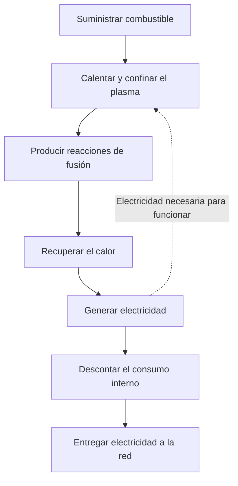
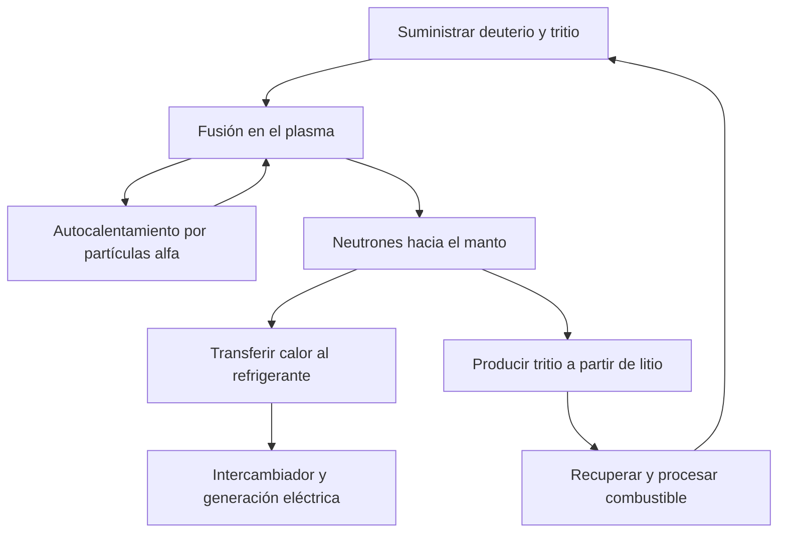

## 1. Producir fusión y suministrar electricidad son logros distintos

La fusión alimenta el Sol y las demás estrellas. Aprovecharla en la Tierra permitiría obtener mucha energía de poco combustible. Sin embargo, observar reacciones no equivale a operar una central que suministre electricidad a la red.

Encender un fuego tampoco equivale a construir una central térmica. Hacen falta sistemas de recuperación de calor, un generador, suministro de combustible, controles y mantenimiento. La fusión añade dificultades como mantener un combustible extremadamente caliente y proteger las estructuras de los neutrones que produce.

Conviene separar **la reacción, el balance de energía y el funcionamiento de la central**. Un experimento puede demostrar un avance importante sin resolver todos los requisitos restantes. El atractivo de una fuente energética no es una medida de su madurez industrial.

Nos centraremos en el deuterio y el tritio, una combinación muy estudiada. Existen otras vías; entender un resultado exige saber qué demuestra, sin convertir el récord de un dispositivo en una medida de toda la tecnología. [Departamento de Energía de Estados Unidos: energía de fusión][doe-overview]

## 2. Por qué la fisión y la fusión pueden liberar energía

La fisión divide núcleos pesados; la fusión une núcleos ligeros. Ambas pueden liberar energía porque las distintas configuraciones nucleares tienen energías diferentes.

Protones y neutrones reciben el nombre de nucleones. La energía de enlace por nucleón aumenta, en términos generales, desde los núcleos ligeros hacia los de masa intermedia, con valores altos cerca del hierro y el níquel. Unir determinados núcleos ligeros lleva a un estado de menor energía y libera la diferencia. No toda unión arbitraria de núcleos es exotérmica.

$$
E=\Delta m c^2
$$

$\Delta m$ es la diferencia de masa en reposo entre los sistemas inicial y final. No desaparece toda la masa del combustible: quedan productos. La energía aparece, por ejemplo, como movimiento de las partículas, y después puede recuperarse como calor y convertirse en electricidad.

En la fisión, los neutrones desencadenan nuevas fisiones y sostienen la reacción en cadena. En la fusión hay que mantener condiciones para que los núcleos se acerquen con suficiente frecuencia. Que ambas sean reacciones nucleares no hace idénticos sus equipos ni su comportamiento al detenerse. [ITER: fundamentos de la fusión][fusion-basics]

## 3. Por qué utilizar deuterio y tritio

El hidrógeno ordinario tiene un protón en el núcleo. El deuterio tiene un protón y un neutrón; el tritio, un protón y dos neutrones. Son isótopos: variantes del mismo elemento con distinto número de neutrones. Sus símbolos, D y T, dan nombre a la reacción D–T.

$$
{}^{2}_{1}\mathrm{H}+{}^{3}_{1}\mathrm{H}
\rightarrow{}^{4}_{2}\mathrm{He}+{}^{1}_{0}\mathrm{n}+17.6\,\mathrm{MeV}
$$

Los productos son un núcleo de helio 4 y un neutrón. Si la energía de las partículas incidentes es pequeña frente a la liberada, el helio recibe unos 3,5 MeV y el neutrón unos 14,1 MeV: aproximadamente 17,6 MeV en total. El núcleo de helio, cargado, también se llama partícula alfa. [KIT: reparto de energía D–T][dt-energy]

Este reparto condiciona la central. Las partículas alfa confinadas magnéticamente contribuyen a calentar el plasma. Los neutrones, sin carga, no quedan retenidos de igual manera y llegan a las estructuras circundantes. **Gran parte de la energía se recoge fuera del plasma.**

D–T permite tasas de reacción importantes a temperaturas relativamente inferiores a las de otros combustibles propuestos. Eso no implica un suministro sencillo: el tritio es radiactivo y requiere obtención, recuperación y reproducción. Las reacciones deuterio-deuterio o protón-boro no pueden sustituir a D–T sin cambiar las condiciones. [ITER: condiciones necesarias][making-work]

## 4. Por qué se necesitan temperaturas tan altas

Los dos núcleos tienen carga positiva y se repelen. Deben acercarse mucho para que actúen las fuerzas nucleares. Elevar la temperatura aumenta la energía del movimiento y favorece las colisiones capaces de contribuir a una reacción.

No significa que cada partícula tenga que superar clásicamente toda la barrera eléctrica. Las energías siguen una distribución y el efecto túnel cuántico contribuye a la probabilidad de reacción. La temperatura modifica una frecuencia; no funciona como un interruptor. [Curso de ITER en el CERN: efecto túnel y reactividad][fusion-lecture]

En física de plasmas es frecuente expresar la temperatura en keV, unidad de energía. Se está indicando $k_B T$, donde $k_B$ es la constante de Boltzmann. Un keV equivale a unos 11,6 millones de kelvin; 10 keV, a unos 116 millones. Las expresiones «cien millones de grados» y «del orden de diez keV» describen escalas similares.

El centro del Sol está a unos 15 millones de grados, mientras que en la fusión terrestre D–T se estudian temperaturas próximas a cien millones o superiores. No reproducimos el tamaño, la gravedad, la densidad ni el combustible solares. El Sol obtiene energía principalmente mediante una cadena que comienza con protones. Las posibilidades de confinamiento terrestre favorecen otra reacción. «Sol artificial» es una metáfora, no una copia en miniatura. [ITER][fusion-basics], [DOE: plasma en combustión][burning]

## 5. El plasma no es un sólido caliente

A temperaturas suficientemente altas los electrones se separan de los núcleos. El plasma resultante contiene iones positivos y electrones móviles. Aunque sea casi neutro en conjunto, sus partículas cargadas responden a campos eléctricos y magnéticos.

¿Por qué no se funde inmediatamente el recipiente? Un plasma magnéticamente confinado tiene una densidad y unas vías de transferencia térmica muy diferentes de las de un sólido. La temperatura mide la escala de energía del movimiento, no la cantidad total de energía almacenada. Un volumen de partículas muy calientes pero escasas no contiene lo mismo que un volumen de materia densa.

Las paredes siguen recibiendo energía mediante partículas, radiación y neutrones. El campo evita en buena medida el contacto directo del centro caliente con los materiales, pero no constituye un aislamiento perfecto. Ni el recipiente es imposible por definición ni queda protegido automáticamente: mantener el plasma y controlar las cargas sobre las paredes son tareas simultáneas.

## 6. Temperatura, densidad y tiempo de confinamiento

Una temperatura alta no basta si las colisiones son raras. Una densidad alta tampoco sirve si el combustible se enfría o dispersa enseguida. Hay que considerar conjuntamente temperatura $T$, densidad $n$ y tiempo de confinamiento de la energía $\tau_E$.

Una definición sencilla relaciona la energía almacenada $W$ con la potencia perdida $P_{\mathrm{loss}}$:

$$
\tau_E=\frac{W}{P_{\mathrm{loss}}}
$$

Con 100 MJ almacenados y pérdidas de 50 MW, resulta un tiempo de dos segundos. Eso no obliga a que el plasma desaparezca a los dos segundos. Una bañera con fuga puede mantener su nivel si sigue entrando agua; igualmente, reponer la energía permite sostener una descarga mucho más larga. **Duración de la descarga y tiempo de confinamiento energético no son lo mismo.**

El criterio de Lawson relaciona densidad y confinamiento con el balance entre calentamiento de fusión y pérdidas. Se utiliza a menudo el triple producto $nT\tau_E$. Para la ignición D–T cerca de temperaturas favorables, su escala es de varios $10^{21}$ keV·s·m$^{-3}$. Depende del combustible, la temperatura, el objetivo de ganancia y la definición de densidad; no es un aprobado universal para cualquier experimento. [Instituto Max Planck de Física del Plasma][triple-product]

| Magnitud | Qué describe | Qué no demuestra por sí sola |
|---|---|---|
| Temperatura | Energía característica del movimiento | Frecuencia y continuidad de las reacciones |
| Densidad | Partículas por unidad de volumen | Temperatura suficiente y pérdidas bajas |
| Tiempo de confinamiento energético | Energía almacenada frente a pérdidas | Duración total de la descarga |
| Duración de la descarga | Tiempo de mantenimiento de un estado | Potencia de fusión y balance eléctrico |

## 7. La tasa de reacción explica la mezcla de combustible

En un plasma D–T uniforme muy simplificado, las reacciones por unidad de volumen y tiempo son:

$$
R=n_D n_T\langle\sigma v\rangle
$$

$n_D$ y $n_T$ son las densidades de deuterio y tritio, $\sigma$ la sección eficaz y $v$ la velocidad relativa. Los corchetes indican un promedio sobre la distribución de velocidades. No todas las colisiones ocurren a la misma velocidad, por lo que la tasa no es simplemente proporcional a la temperatura.

Si fijamos la densidad total $n=n_D+n_T$ y las demás condiciones, $n_Dn_T$ es máximo cuando cada especie aporta la mitad. Añadir solo una termina dejando pocos compañeros de reacción. Es como formar parejas entre dos grupos: agrandar únicamente uno no garantiza más parejas.

Duplicar la densidad de ambas especies cuadruplicaría la tasa solo si las condiciones restantes no cambiaran. En la práctica también cambian presión, pérdidas radiativas y estabilidad. No se puede interpretar un factor aislado como prueba de que aumentar la densidad resuelve todo. [Estudio sobre ganancia y criterio de Lawson][lawson-paper]

## 8. Cómo confinan los campos magnéticos

La fuerza de Lorentz sobre una partícula cargada se escribe:

$$
\mathbf{F}=q\left(\mathbf{E}+\mathbf{v}\times\mathbf{B}\right)
$$

La parte magnética curva la trayectoria: la partícula gira alrededor de una línea de campo y se desplaza a lo largo de ella. La fuerza de un campo magnético estático es perpendicular a la velocidad y no realiza directamente trabajo de calentamiento. Confinar y calentar requieren funciones diferentes.

Un campo recto deja escapar partículas por sus extremos. Cerrar el recorrido en un anillo elimina esos extremos, pero la curvatura y las variaciones de intensidad producen derivas. La torsión de las líneas ayuda a lograr una configuración compatible con el movimiento y el equilibrio de presión.

La frase «sujetar con imanes» resume una interacción compleja entre giros, geometría, corrientes, presión e inestabilidades. Un campo más intenso no garantiza por sí solo un confinamiento prolongado. [Laboratorio de Princeton: plasma y confinamiento][magnetic]

## 9. Tokamaks y stellarators

Un tokamak combina campos de bobinas externas con el campo de una corriente en el plasma toroidal. Esa corriente ayuda al confinamiento, pero hay que mantenerla y proteger la máquina frente a cambios bruscos.

Inducirla mediante un transformador limita la operación continua. También se investigan métodos no inductivos mediante ondas o haces. No es correcto afirmar que todos los tokamaks deban funcionar siempre durante intervalos breves, ni suponer que la corriente se mantiene indefinidamente sin medios adicionales.

Un stellarator produce la torsión principalmente con bobinas externas tridimensionales. Depender menos de una gran corriente de plasma favorece la operación estacionaria. A cambio, cobran importancia el diseño, la fabricación y la posición de las bobinas, así como el control de pérdidas de partículas. [Instituto Max Planck: stellarators][stellarator]

| Aspecto | Tokamak | Stellarator |
|---|---|---|
| Torsión del campo | Bobinas y corriente de plasma | Principalmente bobinas tridimensionales |
| Retos de larga duración | Corriente, estabilidad y extracción de calor | Optimización, fabricación y extracción de calor |
| Geometría | Aproximadamente axisimétrica | Tridimensional compleja |
| Retos compartidos | Combustible, materiales, calor, mantenimiento y balance eléctrico | Combustible, materiales, calor, mantenimiento y balance eléctrico |

No existe una regla sencilla que identifique un único ganador. También hay que comparar facilidad de construcción, reparación y funcionamiento fiable, además de las prestaciones del plasma.

## 10. Calentamiento externo y autocalentamiento

La corriente puede calentar resistivamente el plasma de un tokamak. Sin embargo, la resistencia disminuye al aumentar la temperatura, limitando lo que este método puede conseguir por sí solo. Se necesitan otras fuentes de energía.

La inyección de haces neutros introduce partículas energéticas sin carga, poco desviadas por el campo. Dentro del plasma, la ionización y las colisiones transfieren su energía. Las ondas de radiofrecuencia y las microondas proporcionan otra vía. Ningún equipo convierte toda su electricidad en calor del plasma. [ITER: sistemas de calentamiento][heating]

Al aumentar las reacciones D–T, las partículas alfa aportan más autocalentamiento. Si este domina, se habla de plasma en combustión, sin implicar una combustión química con oxígeno.

En confinamiento magnético, la ignición ideal significa que el calentamiento por productos de fusión compensa las pérdidas sin aporte externo. Bombas, refrigeración y controles siguen consumiendo electricidad. La autonomía térmica del plasma y la autonomía eléctrica de la central se evalúan con límites diferentes. [DOE: plasma en combustión][burning]

## 11. La fusión láser aprovecha un intervalo muy breve

El confinamiento magnético busca mantener mucho tiempo un plasma caliente relativamente poco denso. El confinamiento inercial comprime una pequeña cantidad de combustible hasta una gran densidad para que reaccione antes de expandirse. Los láseres son una posible fuente de energía impulsora.

La Instalación Nacional de Ignición estadounidense, NIF, estudia la compresión y el calentamiento de pequeñas cápsulas. Repetirlo en una central exige fabricar e introducir blancos, irradiarlos, retirar los productos y gestionar el calor antes del siguiente evento. Lograr una reacción favorable en un experimento no demuestra toda esa cadena.

El 5 de diciembre de 2022, un experimento del NIF produjo 3,15 MJ de fusión con 2,05 MJ de energía láser entregada al blanco. El resultado histórico mostró una ganancia del blanco superior a uno, pero no un balance eléctrico positivo contando todo el consumo de la instalación. [Laboratorio Lawrence Livermore: experimento de ignición][nif]

Como ejemplo hipotético, 100 MJ por evento a cinco eventos por segundo equivaldrían a 500 MW medios de fusión. Esta multiplicación no demuestra que se hayan resuelto conjuntamente cadencia, coste de blancos, eficiencia láser y vida útil. Hay que distinguir potencia máxima instantánea, energía por pulso y potencia media.

## 12. Diez veces la entrada: ¿qué entrada?

La ganancia del plasma $Q$ en confinamiento magnético suele comparar la potencia de fusión con la potencia de calentamiento externo que llega al plasma:

$$
Q=\frac{P_{\mathrm{fusion}}}{P_{\mathrm{heat}}}
$$

ITER tiene como objetivo obtener 500 MW de fusión con 50 MW de calentamiento, es decir, $Q=10$. Es una meta de investigación, no un récord comercial ya conseguido. ITER no está diseñado para convertir ese calor en electricidad vendida a la red. [ITER: objetivos][iter-goals]

Un $Q=10$ no significa multiplicar por diez la electricidad consumida. Entre el enchufe y el plasma hay pérdidas; entre el calor y la electricidad generada, también. Refrigeración, vacío, enfriamiento y procesamiento del combustible consumen energía adicional.

Consideremos un modelo didáctico: 1 000 MW de fusión y $Q=10$ requieren 100 MW de calor externo en el plasma. Si el calentamiento tiene una eficiencia eléctrica del 50 %, consume 200 MW eléctricos. Convertir únicamente la potencia de fusión con un rendimiento del 40 % produce 400 MW eléctricos. Al restar los 200 MW de calentamiento y otros 100 MW auxiliares, quedan 100 MW para la red.

$$
P_{\mathrm{net}}\approx\eta_e P_{\mathrm{fusion}}
-\frac{P_{\mathrm{fusion}}}{Q\eta_h}-P_{\mathrm{aux}}
$$

El modelo omite recuperar térmicamente el calentamiento externo y la energía adicional de reacciones en el manto. Explica límites del balance, no predice una central real. Con iguales hipótesis pero $Q=5$, el calentamiento necesitaría 400 MW eléctricos y el resultado neto sería menos 100 MW. **Ganancia del plasma y electricidad exportable son magnitudes diferentes.**

| Indicador | Entrada considerada | Qué informa |
|---|---|---|
| Ganancia del plasma | Calor entregado al plasma | Relación con la potencia de fusión |
| Ganancia del blanco | Energía entregada al blanco | Relación con la energía de fusión de un evento |
| Electricidad neta | Consumo de toda la central | Posibilidad de suministrar a la red |
| Economía | Construcción, operación, combustible y mantenimiento | Viabilidad del suministro como actividad económica |

## 13. El manto recupera calor y produce combustible

Los neutrones D–T atraviesan el campo magnético sin quedar confinados. Al interactuar con la materia transfieren su energía cinética como calor. El manto que rodea el plasma de un reactor de potencia está diseñado para recuperar esa energía.

No es simplemente un aislante. Debe combinar recuperación térmica, protección de equipos como los imanes y producción de tritio. Las interacciones de neutrones con materiales que contienen litio generan tritio, que hay que extraer y devolver al circuito de combustible.

Estas funciones compiten por espacio. Un blindaje más grueso protege mejor, pero aumenta tamaño y masa. Los huecos para diagnóstico o calentamiento no pueden estar ocupados a la vez por material reproductor. La geometría favorable a los neutrones puede no ser la mejor para extraer calor.

ITER prevé probar módulos reproductores en un entorno real de fusión. Esos ensayos no equivalen a haber demostrado ya la autosuficiencia de combustible de una central completa. [ITER: reproducción de tritio][breeding]

## 14. El combustible del agua de mar no cuenta toda la historia

El deuterio se obtiene del agua, pero la reacción D–T también necesita tritio. Este es radiactivo, tiene una semivida de unos 12,3 años y no existe en grandes reservas naturales acumuladas. Una explotación prolongada necesita reproducción y recuperación. [ITER: glosario][glossary]

La razón de reproducción compara el tritio producido con el consumido en reacciones. Un valor de al menos uno parece suficiente, pero hay que incluir retrasos de recuperación, retención en materiales y equipos, pérdidas, desintegración y reservas para arrancar otras instalaciones.

Incluso si cada cantidad consumida vuelve íntegramente más tarde, hace falta un inventario que permita seguir operando durante la espera. Igualar producción y consumo anuales no garantiza combustible disponible en todo momento. Es un balance temporal, además de uno total.

Tampoco reacciona todo el combustible inyectado en un solo paso. Hay que retirar y separar combustible no quemado, helio e impurezas, y devolver las especies útiles. Consumo nuclear, caudal de procesamiento e inventario del emplazamiento son cosas distintas. Consumir poco en las reacciones no significa necesitar instalaciones de procesamiento pequeñas.

La abundancia de recursos es valiosa, pero no sustituye la preparación, el suministro ni el reciclaje. [OIEA: física y tecnología del ciclo D–T][fuel-cycle]

## 15. Mantener el calor y evacuarlo

El centro del plasma debe conservar su calor, mientras la central recupera de forma fiable la energía saliente y mantiene temperaturas aceptables en las paredes. Las dos exigencias deben cumplirse simultáneamente.

En el borde se evacuan cenizas de helio, impurezas y calor. El divertor de un tokamak realiza parte de esta tarea. Como un flujo concentrado en una salida, el calor puede llegar a una zona pequeña. Mantener el plasma durante mucho tiempo no basta si esa carga daña rápidamente los componentes.

El flujo térmico es potencia por unidad de superficie. El divertor de ITER se diseña para cargas estacionarias del orden de 10 MW/m$^2$. En un cuadrado de 10 cm de lado equivalen a 100 kW. Una superficie pequeña puede necesitar una extracción térmica considerable. [ITER: divertor][divertor]

El alto punto de fusión del tungsteno no resuelve por sí solo el problema. El calor debe atravesar estructuras y uniones hasta llegar al refrigerante. También importan fatiga, erosión y contaminación del plasma. Las impurezas de las paredes pueden aumentar las pérdidas radiativas, acoplando los materiales con la física del plasma.

Un récord de temperatura y unos intervalos de sustitución manejables miden capacidades distintas. Ningún máximo aislado permite calcular directamente cuánto falta para una central comercial.

## 16. Los neutrones también modifican los materiales

Los neutrones energéticos desplazan átomos de sus posiciones en las estructuras. Algunas reacciones crean otros elementos y gases internos. Pueden producirse fragilización, hinchamiento y cambios de conductividad térmica.

Calentar un material en un horno no reproduce esa combinación. Temperatura, esfuerzos, irradiación e interacción química con refrigerantes actúan conjuntamente. Experimentos y simulaciones deben predecir la vida útil con datos suficientes para validar esas predicciones. [OIEA: daño por irradiación][materials]

Los neutrones también activan materiales. Por eso es incorrecto afirmar que la fusión no genera residuos radiactivos. Isótopos, cantidades y tiempos de gestión dependen de los materiales, la irradiación, el historial de operación y las vías de eliminación. Los materiales de baja activación buscan mejorar tanto el funcionamiento como la gestión posterior.

El mantenimiento requiere manipulación remota: retirar piezas grandes, conectar recambios con precisión e inspeccionar trabajos en entornos de difícil acceso. Poder montar un aparato no garantiza repararlo rápidamente. Las paradas por sustituciones o averías afectan a producción y costes.

Un comportamiento de parada distinto de la fisión no elimina todos los peligros. Tritio, materiales activados, energía magnética almacenada y fluidos calientes o presurizados requieren medidas acordes con sus propiedades. [ITER: seguridad y medioambiente][safety]

## 17. La superconductividad no elimina el consumo de la central

Los campos intensos necesitan grandes corrientes. Bajo condiciones adecuadas, los superconductores reducen enormemente la resistencia en corriente continua. Ayudan a sostener el campo, pero no vuelven nulo el consumo total.

Los imanes de ITER operan según diseño alrededor de 4 K. Elementos extremadamente fríos se sitúan cerca del plasma caliente, haciendo indispensables aislamiento de vacío, pantallas térmicas, refrigeradores y tuberías criogénicas. Aprovechar una propiedad del material exige mucha ingeniería auxiliar. [ITER: criogenia][cryogenics]

Un superconductor de alta temperatura no funciona necesariamente a temperatura ambiente. Mantiene la superconductividad a temperaturas superiores a las de materiales convencionales, pero en condiciones de gran campo y corriente aún requiere enfriamiento y protección. También hay que controlar las fuerzas mecánicas y la energía almacenada ante fallos.

Bombas, procesamiento del combustible, refrigeración, ordenadores y controles consumen electricidad. Los equipos ausentes de la imagen luminosa del plasma hacen posible el funcionamiento. Un balance que solo rodee al plasma oculta esa carga. [ITER: imanes][magnets], [alimentación eléctrica][power-supply]

## 18. Medir el plasma y comprobar los modelos

Temperatura, densidad, campos, radiación y productos requieren técnicas de diagnóstico diferentes. No puede introducirse un termómetro corriente en el centro. Luz, ondas, partículas y señales magnéticas proporcionan información indirecta.

Una medición tampoco describe necesariamente el conjunto. Centro y borde difieren y cambian con el tiempo. Una señal integrada a lo largo de una línea de visión exige hipótesis u otras mediciones para reconstruir un perfil espacial. Conviene separar incertidumbre instrumental y supuestos del modelo. [ITER: diagnósticos][diagnostics]

La simulación es esencial para turbulencia, transporte, geometría y respuesta de materiales. Representar una reacción por ordenador no demuestra que una central esté lista. Hay que identificar qué condiciones reproduce el modelo y cuáles siguen sin validar, y compararlo con experimentos.

Lo mismo vale para el aprendizaje automático aplicado al control. Predecir bien datos conocidos no demuestra robustez en regímenes nuevos ni ante fallos de sensores. Los métodos computacionales no eliminan los problemas del combustible, los materiales o la extracción de calor. La fusión integra medición, física e ingeniería.

## 19. Del misterio de las estrellas a la investigación terrestre

A principios del siglo XX, la longevidad del Sol planteaba un problema: la combustión química no podía explicarla. En 1920, Eddington propuso que transformar hidrógeno en helio podía alimentar las estrellas. La investigación nuclear se conectó después con los modelos de sus interiores.

En 1934, Oliphant, Harteck y Rutherford ampliaron el estudio experimental de reacciones de núcleos ligeros con deuterio. Bethe y otros investigadores desarrollaron la explicación nuclear de la energía estelar. [ITER: primeros trabajos][history-early]

Durante los años cincuenta se buscó controlar la fusión terrestre como fuente energética. Parte de la investigación fue secreta; la conferencia internacional de Ginebra de 1958 marcó una apertura a la cooperación. Las pérdidas e inestabilidades resultaron más difíciles de dominar que lo sugerido por las primeras estimaciones. [OIEA: historia de la cooperación][history-cooperation]

Avances en geometría magnética, calentamiento, vacío, superconductividad, diagnóstico y cálculo condujeron a los grandes experimentos. ITER integra el estudio del plasma en combustión y sus tecnologías; la ignición del NIF corresponde al confinamiento inercial. Son logros con métodos y límites contables diferentes, no puntuaciones intercambiables.

| Etapa | Pregunta principal | Trabajo posterior |
|---|---|---|
| Energía estelar | ¿Por qué brilla tanto tiempo el Sol? | Descripción cuantitativa de las reacciones |
| Reacciones de laboratorio | ¿Se observan reacciones de núcleos ligeros? | Fuente energética macroscópica |
| Fusión controlada | ¿Se mantiene caliente el combustible? | Reducir pérdidas e inestabilidades |
| Ganancia elevada | ¿Puede dominar el autocalentamiento? | Combustible, materiales, repetición y duración |
| Demostración de central | ¿Se suministra electricidad neta sostenida? | Fiabilidad, mantenimiento, costes y condiciones sociales |

La larga historia no significa que sea imposible producir fusión: sí se produce. La dificultad es satisfacer simultáneamente escala, duración, suministro, resistencia de materiales y coste.

## 20. Seis comprobaciones ante una noticia comercial

No hace falta restar valor a los avances. Sí conviene evitar que un récord se interprete silenciosamente como otro logro diferente.

1. **¿Qué se midió?** Temperatura, duración, energía, ganancia y electricidad neta son indicadores distintos.
2. **¿Dónde se contabilizó la entrada?** Calor del plasma, láser sobre el blanco y electricidad total no son equivalentes.
3. **¿Con qué combustible y condiciones?** Controlar hidrógeno o deuterio persigue objetivos diferentes de producir mucha fusión D–T.
4. **¿Un evento o funcionamiento repetible?** Examinar estabilidad, paradas y vida útil, además de máximos.
5. **¿Se pueden suministrar combustible y recambios?** Incluir reproducción, recuperación, fabricación, sustituciones y residuos.
6. **¿Plan o resultado demostrado?** Revisar las pruebas y supuestos de fechas y costes.

También importa la electricidad anual vendible. Una central de 500 MW netos suministraría unos 2,19 TWh en un año normal con factor de capacidad del 50 %, y unos 3,50 TWh al 80 %. Ilustra cómo operación y mantenimiento afectan a una misma potencia nominal; no predice la disponibilidad futura de la fusión.

Reducir el tamaño no abarata todo automáticamente. Puede bajar el coste de fabricación mientras concentra cargas térmicas y dificulta el acceso para reparaciones. Un aparato mayor puede favorecer el confinamiento y exigir más construcción. Tamaño, física, mantenimiento y economía deben diseñarse juntos.

La promesa de la fusión es obtener mucha energía de núcleos ligeros. Realizarla exige una cadena completa: **producir y recuperar calor, devolver combustible, sustituir piezas y suministrar durante muchos años más electricidad de la que consume la instalación**. Conocer esa cadena permite valorar mejor tanto los avances como el trabajo pendiente.

## Fuentes y alcance de las ilustraciones

Energías de reacción y resultados históricos proceden de los organismos citados. Rendimientos, consumos, cadencias y factores de capacidad de los ejemplos son supuestos didácticos, no previsiones de una central concreta. La portada generada por IA es conceptual: bobinas, tuberías y colores no constituyen un diseño técnico.

- [DOE: energía de fusión][doe-overview] y [plasma en combustión][burning]
- [ITER: fundamentos][fusion-basics], [requisitos][making-work], [objetivos][iter-goals] y [glosario][glossary]
- [ITER: calentamiento][heating], [tritio][breeding], [divertor][divertor], [diagnóstico][diagnostics], [imanes][magnets], [criogenia][cryogenics], [electricidad][power-supply] y [seguridad][safety]
- [Max Planck: triple producto][triple-product] y [stellarators][stellarator]; [Princeton: confinamiento][magnetic]
- [Estudio del criterio de Lawson][lawson-paper]; [LLNL: ignición de 2022][nif]
- [OIEA: ciclo D–T][fuel-cycle], [materiales][materials] e [historia][history-cooperation]; [ITER: primeros estudios][history-early]
- [KIT: energía D–T][dt-energy]; [curso de ITER en el CERN][fusion-lecture]

[doe-overview]: https://www.energy.gov/topics/fusion-energy
[fusion-basics]: https://www.iter.org/fusion-energy/what-fusion
[making-work]: https://www.iter.org/fusion-energy/making-it-work
[burning]: https://www.energy.gov/science/doe-explainsburning-plasma
[triple-product]: https://www.ipp.mpg.de/83115/fusionsprodukt
[lawson-paper]: https://arxiv.org/abs/2105.10954
[magnetic]: https://w3.pppl.gov/scied/docs/undergrad_level_general_Plasma_Fusion_PPPL/Plasma_fusion_pppl.pdf
[stellarator]: https://www.ipp.mpg.de/9792/stellarator
[heating]: https://www.iter.org/machine/supporting-systems/external-heating-systems
[nif]: https://www.llnl.gov/article/50801/llnls-breakthrough-ignition-experiment-highlighted-physical-review-letters
[iter-goals]: https://www.iter.org/fusion-energy/what-will-iter-do
[breeding]: https://www.iter.org/machine/supporting-systems/tritium-breeding
[glossary]: https://www.iter.org/fusion-glossary
[fuel-cycle]: https://www-pub.iaea.org/MTCD/publications/PDF/TE-2076web.pdf
[divertor]: https://www.iter.org/machine/divertor
[materials]: https://nucleus-qa.iaea.org/sites/fusionportal/Pages/DPWS-6/Topics.aspx
[safety]: https://www.iter.org/faqs?thematic=75
[cryogenics]: https://www.iter.org/machine/supporting-systems/cryogenics
[magnets]: https://www.iter.org/machine/magnets
[power-supply]: https://www.iter.org/machine/supporting-systems/power-supply
[diagnostics]: https://www.iter.org/machine/supporting-systems/diagnostics
[history-early]: https://www.iter.org/node/20687/who-invented-fusion
[history-cooperation]: https://nucleus.iaea.org/sites/fusion-portal/SitePages/A-brief-history-of-nuclear-fusion.aspx?web=1
[dt-energy]: https://publikationen.bibliothek.kit.edu/1000161936/151265654
[fusion-lecture]: https://indico.cern.ch/event/116345/attachments/53370/76726/Campbell_ITER26Fusion-1_CERN_Apr11.pdf
