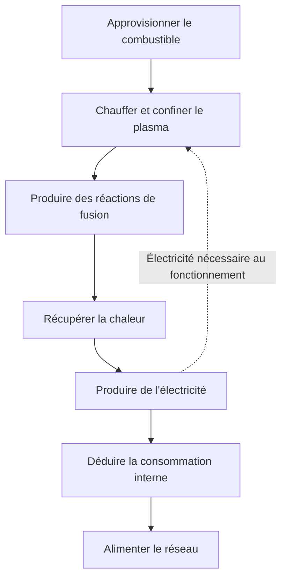
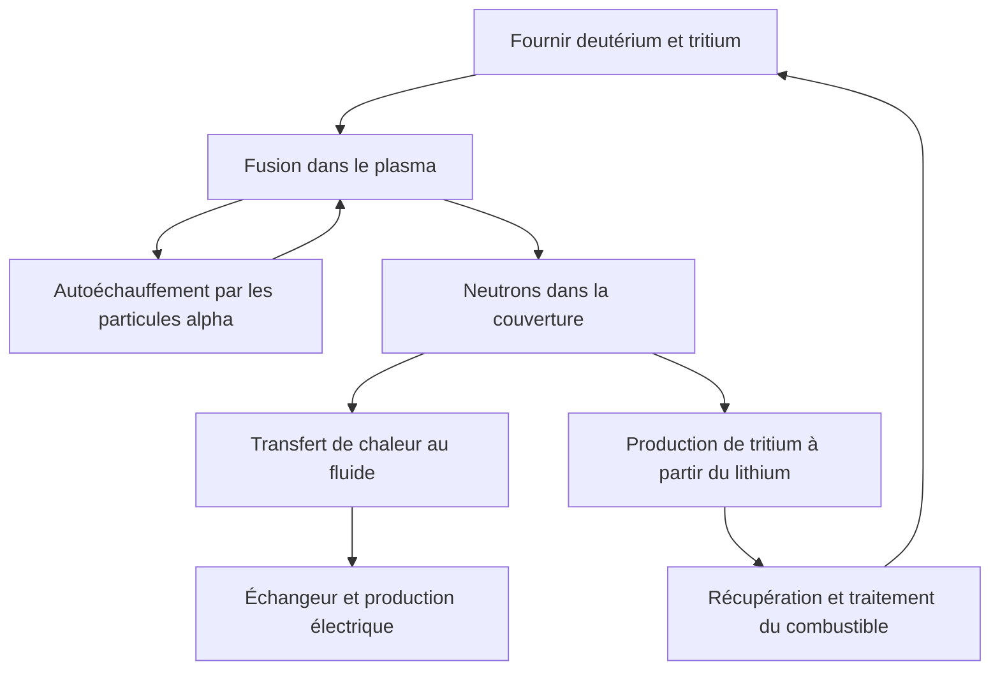

## 1. Produire une réaction n'est pas encore produire de l'électricité

La fusion alimente le Soleil et les autres étoiles. La maîtriser sur Terre permettrait de libérer beaucoup d'énergie à partir de peu de combustible. Observer des réactions ne signifie cependant pas qu'une installation puisse fournir de l'électricité au réseau.

Allumer un feu et exploiter une centrale thermique sont deux réalisations différentes. Il faut récupérer la chaleur, alimenter un générateur, approvisionner le combustible, contrôler l'installation et l'entretenir. La fusion ajoute des difficultés : maintenir un combustible extrêmement chaud et protéger les matériaux contre les neutrons produits.

Il convient donc de distinguer **réaction physique, bilan énergétique et fonctionnement d'une centrale**. Une expérience peut franchir une étape importante sans résoudre simultanément tous les autres problèmes. L'intérêt d'une source d'énergie ne mesure pas sa maturité industrielle.

Cet article s'intéresse principalement au mélange deutérium-tritium, très étudié pour les futurs réacteurs. D'autres approches existent. L'objectif est de comprendre ce que démontre une expérience, sans confondre son record avec l'état de préparation de toute une filière. [Département américain de l'Énergie : énergie de fusion][doe-overview]

## 2. Pourquoi la fission et la fusion peuvent-elles libérer de l'énergie ?

La fission sépare un noyau lourd ; la fusion réunit des noyaux légers. Ces transformations opposées peuvent libérer de l'énergie parce que toutes les configurations nucléaires n'ont pas la même énergie.

Les protons et les neutrons sont des nucléons. L'énergie de liaison par nucléon augmente globalement des noyaux légers vers les noyaux de masse intermédiaire, avec des valeurs élevées près du fer et du nickel. Certaines associations de noyaux légers conduisent ainsi à un état de plus faible énergie, et la différence est libérée. La fusion de n'importe quels noyaux n'est donc pas nécessairement exothermique.

$$
E=\Delta m c^2
$$

$\Delta m$ désigne la différence de masse au repos entre les systèmes initial et final. Toute la masse du combustible ne devient pas de l'électricité : des produits subsistent. L'énergie apparaît notamment sous forme de mouvement des particules, puis peut être récupérée en chaleur et convertie en électricité.

Dans un réacteur à fission, des neutrons provoquent de nouvelles fissions et entretiennent une réaction en chaîne. Pour la fusion, il faut maintenir des conditions permettant aux noyaux réactifs de se rapprocher suffisamment souvent. Le caractère nucléaire commun ne rend ni les équipements ni les mécanismes d'arrêt identiques. [ITER : principes de la fusion][fusion-basics]

## 3. Pourquoi choisir le deutérium et le tritium ?

Le noyau de l'hydrogène ordinaire contient un proton. Celui du deutérium comporte un proton et un neutron ; celui du tritium, un proton et deux neutrons. Ces variantes d'un même élément sont des isotopes. Les symboles D et T donnent son nom à la réaction D–T.

$$
{}^{2}_{1}\mathrm{H}+{}^{3}_{1}\mathrm{H}
\rightarrow{}^{4}_{2}\mathrm{He}+{}^{1}_{0}\mathrm{n}+17.6\,\mathrm{MeV}
$$

Les produits sont un noyau d'hélium 4 et un neutron. Lorsque l'énergie incidente est faible devant celle de la réaction, ils emportent respectivement environ 3,5 et 14,1 MeV, soit 17,6 MeV au total. Le noyau d'hélium chargé est aussi appelé particule alpha. [KIT : répartition de l'énergie D–T][dt-energy]

Cette répartition détermine l'architecture d'une centrale. Les particules alpha retenues par le champ magnétique chauffent le plasma. Les neutrons, électriquement neutres, le quittent et atteignent les structures environnantes. **Une grande partie de l'énergie est donc récupérée à l'extérieur du plasma.**

Le mélange D–T donne des taux de réaction intéressants à des températures inférieures à celles requises par plusieurs autres combustibles envisagés. Cette facilité relative de réaction ne signifie pas facilité d'approvisionnement : le tritium est radioactif et doit être fourni, récupéré et régénéré. Les réactions deutérium-deutérium et proton-bore ne constituent pas des substitutions directes dans les mêmes conditions. [ITER : conditions de fonctionnement][making-work]

## 4. Pourquoi faut-il atteindre de telles températures ?

Les noyaux, positifs, se repoussent électriquement. Ils doivent pourtant s'approcher assez pour que les forces nucléaires interviennent. Une température élevée augmente l'énergie des mouvements et favorise les collisions susceptibles de provoquer une réaction.

Cela ne signifie pas que chaque particule franchit classiquement la barrière de répulsion. Les énergies suivent une distribution, et l'effet tunnel quantique intervient dans la probabilité de réaction. La température modifie une fréquence de réactions ; ce n'est pas un interrupteur. [Cours ITER au CERN : réactions et effet tunnel][fusion-lecture]

On exprime parfois la température en keV, unité d'énergie : il s'agit alors de $k_B T$, avec $k_B$ la constante de Boltzmann. Un keV correspond à environ 11,6 millions de kelvins ; 10 keV, à environ 116 millions. Parler d'une centaine de millions de degrés ou d'une dizaine de keV revient donc à évoquer un même ordre de grandeur.

Le cœur du Soleil atteint environ 15 millions de degrés, alors que la recherche D–T terrestre vise souvent une centaine de millions de degrés ou davantage. Sur Terre, on ne reproduit ni la gravité, ni la densité, ni les dimensions, ni le combustible solaire. Le Soleil utilise surtout une chaîne commençant par des protons. Les conditions de confinement disponibles sur Terre conduisent à un autre choix de réaction. Un « soleil artificiel » reste une métaphore. [ITER][fusion-basics], [DOE : plasma en combustion][burning]

## 5. Un plasma n'est pas un solide brûlant

À température suffisamment élevée, les électrons se séparent des noyaux. Le milieu formé d'ions positifs et d'électrons mobiles est un plasma. Presque neutre à grande échelle, il contient néanmoins des particules chargées sensibles aux champs électriques et magnétiques.

Pourquoi le récipient ne fond-il pas immédiatement ? Un plasma à confinement magnétique est très différent d'un métal solide par sa densité et ses échanges thermiques. La température caractérise l'énergie du mouvement des particules, et non la chaleur totale stockée. À volume égal, un milieu très chaud mais peu dense ne contient pas la même énergie qu'un solide dense.

Les parois restent exposées aux particules, au rayonnement et aux neutrons. Le champ magnétique limite le contact direct du plasma central avec les matériaux ; il ne réalise pas une isolation parfaite. Comprendre la différence permet d'éviter deux erreurs : croire tout confinement impossible, ou considérer les parois comme automatiquement protégées. Le maintien du plasma chaud et la maîtrise des charges sur les structures sont deux exigences simultanées.

## 6. Température, densité et temps de confinement

Une température élevée ne suffit pas si les collisions sont trop rares. Une forte densité n'aide guère si le combustible se refroidit ou se disperse immédiatement. On considère donc ensemble la température $T$, la densité $n$ et le temps de confinement de l'énergie $\tau_E$.

Dans une description simple, ce dernier est le rapport entre l'énergie stockée $W$ et la puissance perdue $P_{\mathrm{loss}}$ :

$$
\tau_E=\frac{W}{P_{\mathrm{loss}}}
$$

Avec 100 MJ stockés et 50 MW perdus, on obtient deux secondes. Le plasma ne doit pas nécessairement disparaître après deux secondes : comme une baignoire qui fuit tout en étant alimentée, il peut être maintenu si l'énergie perdue est remplacée. **La durée d'une décharge et le temps de confinement de l'énergie ne sont pas synonymes.**

Le critère de Lawson relie densité et confinement à l'équilibre entre chauffage par fusion et pertes. On utilise souvent le triple produit $nT\tau_E$. Pour l'ignition D–T à température favorable, son ordre de grandeur est de quelques $10^{21}$ keV·s·m$^{-3}$. La condition dépend toutefois du combustible, de la température, du gain visé et de la définition de la densité. Il ne s'agit pas d'un seuil universel applicable à toutes les expériences. [Institut Max-Planck de physique des plasmas][triple-product]

| Grandeur | Ce qu'elle décrit | Ce qu'elle ne prouve pas seule |
|---|---|---|
| Température | Énergie caractéristique des particules | Fréquence et maintien des réactions |
| Densité | Particules par unité de volume | Température suffisante et faibles pertes |
| Temps de confinement de l'énergie | Énergie stockée rapportée aux pertes | Durée totale de la décharge |
| Durée de la décharge | Temps pendant lequel un état est maintenu | Puissance de fusion et bilan électrique |

## 7. Ce que révèle le taux de réaction

Dans un plasma D–T uniforme très simplifié, le nombre de réactions par unité de volume et de temps s'écrit :

$$
R=n_D n_T\langle\sigma v\rangle
$$

$n_D$ et $n_T$ sont les densités de deutérium et de tritium, $\sigma$ la section efficace et $v$ la vitesse relative. Les crochets indiquent une moyenne sur la distribution des vitesses. Toutes les collisions ne se produisent pas à la même vitesse ; le taux n'est donc pas simplement proportionnel à la température.

À densité totale $n=n_D+n_T$ et autres conditions fixes, le produit $n_Dn_T$ est maximal pour un mélange à parts égales. Augmenter une seule espèce finit par laisser trop peu de partenaires. C'est comme former des couples entre deux groupes : agrandir uniquement l'un des groupes ne garantit pas davantage de couples.

Doubler les deux densités quadruplerait le taux, mais uniquement si les autres conditions restaient identiques. En réalité, densité, pression, rayonnement et stabilité sont liés. Une formule ne justifie pas l'idée qu'augmenter indéfiniment la densité résout tout : il faut étudier les conséquences sur l'ensemble du plasma. [Étude du gain et du critère de Lawson][lawson-paper]

## 8. Comment le champ magnétique retient les particules

La force de Lorentz décrit l'action des champs électrique et magnétique sur une particule chargée :

$$
\mathbf{F}=q\left(\mathbf{E}+\mathbf{v}\times\mathbf{B}\right)
$$

La composante magnétique courbe la trajectoire : la particule tourne autour d'une ligne de champ tout en se déplaçant le long de celle-ci. Perpendiculaire à la vitesse, la force d'un champ magnétique statique ne fournit pas directement de travail pour chauffer la particule. Confinement et chauffage ont des fonctions distinctes.

Dans un champ rectiligne, les particules s'échappent facilement par les extrémités. Refermer la trajectoire en anneau élimine ces sorties, mais la courbure et les variations du champ créent des dérives. La torsion des lignes de champ aide à obtenir une configuration compatible avec les mouvements et l'équilibre de pression.

« Retenir avec des aimants » recouvre donc une physique complexe : giration, géométrie, courants, pression et instabilités. Renforcer le champ ne garantit pas à lui seul un confinement durable. [Laboratoire de Princeton : plasma et confinement][magnetic]

## 9. Tokamak et stellarator : deux géométries

Un tokamak associe les champs de bobines extérieures à celui d'un courant circulant dans le plasma torique. Ce courant participe au confinement, mais il faut l'entretenir et protéger l'appareil contre ses variations brutales.

L'induction de courant par effet transformateur limite le fonctionnement continu. Des ondes ou des faisceaux peuvent également entraîner le courant sans induction. Dire qu'un tokamak doit toujours fonctionner très brièvement est aussi trompeur que supposer son courant durable sans dispositif spécifique.

Un stellarator crée principalement la torsion avec des bobines extérieures tridimensionnelles. Son confinement dépend moins d'un grand courant de plasma, avantage pour le fonctionnement stationnaire. En contrepartie, la conception, la fabrication, le positionnement des bobines et la maîtrise des pertes deviennent particulièrement exigeants. [Institut Max-Planck : stellarators][stellarator]

| Aspect | Tokamak | Stellarator |
|---|---|---|
| Torsion des lignes | Bobines et courant de plasma | Surtout bobines tridimensionnelles |
| Défis de longue durée | Maintien du courant, stabilité, évacuation thermique | Optimisation du champ, fabrication, évacuation thermique |
| Géométrie | Approximativement axisymétrique | Configuration tridimensionnelle complexe |
| Défis communs | Combustible, matériaux, chaleur, maintenance, bilan électrique | Combustible, matériaux, chaleur, maintenance, bilan électrique |

Comparer ces solutions impose d'examiner aussi la construction, la réparation et la fiabilité. Les performances du plasma ne désignent pas, à elles seules, une architecture gagnante.

## 10. Chauffer de l'extérieur, puis utiliser l'autoéchauffement

Le courant d'un tokamak chauffe le plasma par résistance électrique. Mais cette résistance diminue quand la température augmente, limitant l'efficacité du procédé pour poursuivre la montée en température. D'autres moyens sont nécessaires.

L'injection de particules neutres énergétiques permet de traverser le champ magnétique sans forte déviation. Une fois dans le plasma, ionisation et collisions transfèrent leur énergie. Les ondes radiofréquences et les micro-ondes constituent une autre voie. Dans chaque cas, toute l'électricité consommée par les équipements ne devient pas de la chaleur dans le plasma. [ITER : chauffage extérieur][heating]

Quand les réactions D–T augmentent, les particules alpha apportent davantage de chauffage interne. Un plasma dominé par ce chauffage est qualifié de plasma en combustion, sans combustion chimique avec de l'oxygène.

En confinement magnétique, l'ignition désigne idéalement une situation où le chauffage dû aux produits de fusion compense les pertes sans chauffage extérieur. Les pompes, la réfrigération et les commandes continuent pourtant à consommer de l'électricité. L'autonomie thermique du plasma et l'autonomie électrique de l'installation ne portent pas sur le même périmètre. [DOE : plasma en combustion][burning]

## 11. La fusion laser exploite un temps très court

Le confinement magnétique vise à maintenir longtemps un plasma chaud relativement peu dense. Le confinement inertiel comprime au contraire une petite quantité de combustible et la fait réagir avant sa dispersion. Des lasers peuvent fournir l'énergie nécessaire à cette compression.

Le National Ignition Facility américain, ou NIF, étudie ce principe sur de petites cibles. Une centrale devrait reproduire les événements de façon fiable : fabriquer et introduire les cibles, les irradier, évacuer les produits et gérer la chaleur avant le tir suivant. Une expérience unique ne démontre pas cette chaîne industrielle.

Le 5 décembre 2022, une expérience du NIF a produit 3,15 MJ d'énergie de fusion à partir de 2,05 MJ d'énergie laser délivrée à la cible. Ce résultat historique démontrait un gain de cible supérieur à un. Il ne démontrait pas un bilan électrique positif en incluant toute la consommation des lasers et de l'installation. [Laboratoire Lawrence Livermore : expérience d'ignition][nif]

À titre de calcul hypothétique, 100 MJ par événement à cinq événements par seconde donneraient une puissance moyenne de fusion de 500 MW. Le calcul ne prouve pas que cadence, coût des cibles, rendement des lasers et durée de vie des composants soient simultanément maîtrisés. Il faut distinguer puissance de crête, énergie par impulsion et puissance moyenne.

## 12. Dix fois l'énergie reçue : reçue à quel endroit ?

Le gain est une notion essentielle pour lire les annonces. En confinement magnétique, le gain du plasma $Q$ compare normalement la puissance de fusion à la puissance de chauffage extérieur effectivement apportée au plasma :

$$
Q=\frac{P_{\mathrm{fusion}}}{P_{\mathrm{heat}}}
$$

ITER vise 500 MW de fusion pour 50 MW de chauffage, soit $Q=10$. Il s'agit de l'objectif d'un appareil de recherche, pas d'un record de production commerciale déjà atteint. ITER n'est pas conçu pour convertir cette chaleur en électricité vendue au réseau. [ITER : objectifs][iter-goals]

Pourquoi $Q=10$ ne signifie-t-il pas dix fois plus d'électricité produite que consommée ? Les équipements de chauffage présentent des pertes ; l'énergie de fusion est surtout récupérée sous forme thermique, puis sa conversion en électricité entraîne d'autres pertes. Réfrigération, pompage, refroidissement et traitement du combustible consomment aussi du courant.

Prenons un modèle pédagogique : 1 000 MW de fusion, $Q=10$, donc 100 MW de chauffage du plasma. Avec un rendement électrique-chauffage de 50 %, les chauffages consomment 200 MW électriques. Si l'on convertit seulement la puissance de fusion avec un rendement de 40 %, on obtient 400 MW électriques. Après retrait des 200 MW de chauffage et de 100 MW d'autres consommations, il reste 100 MW exportables.

$$
P_{\mathrm{net}}\approx\eta_e P_{\mathrm{fusion}}
-\frac{P_{\mathrm{fusion}}}{Q\eta_h}-P_{\mathrm{aux}}
$$

Ce modèle omet la récupération thermique du chauffage extérieur et l'énergie supplémentaire de réactions dans la couverture. Il illustre un périmètre comptable, sans prédire les performances d'une centrale réelle. Avec les mêmes hypothèses mais $Q=5$, le chauffage consommerait 400 MW électriques et le bilan net serait de moins 100 MW. **Le gain du plasma n'est pas la quantité d'électricité disponible pour le réseau.**

| Indicateur | Périmètre d'entrée | Information fournie |
|---|---|---|
| Gain du plasma | Chauffage apporté au plasma | Rapport à la puissance de fusion |
| Gain de cible | Énergie délivrée à la cible | Rapport à l'énergie de fusion d'un événement |
| Électricité nette | Consommation électrique de toute la centrale | Possibilité de livrer de l'électricité |
| Rentabilité | Construction, exploitation, combustible et maintenance | Viabilité économique de la fourniture |

## 13. La couverture récupère la chaleur et régénère le combustible

Sans charge électrique, les neutrons D–T traversent le champ de confinement. Leurs interactions avec la matière environnante transforment leur énergie cinétique en chaleur. Dans un réacteur de puissance, la couverture entourant le plasma joue un rôle central dans cette récupération.

Elle ne se limite pas à un isolant : elle doit récupérer la chaleur, protéger notamment les aimants et produire du tritium. Des matériaux contenant du lithium interagissent avec les neutrons ; le tritium produit doit être extrait puis réintroduit dans le circuit du combustible.

Ces fonctions se disputent l'espace disponible. Un blindage plus épais protège mieux les aimants mais augmente masse et dimensions. Les ouvertures de chauffage ou de diagnostic ne peuvent pas être remplies de matériau tritigène. Une géométrie favorable aux neutrons n'est pas nécessairement optimale pour l'extraction de chaleur.

ITER prévoit des modules d'essai de couverture tritigène dans un environnement de fusion. Tester ces modules ne signifie pas avoir déjà démontré l'autosuffisance en combustible d'une centrale complète. [ITER : production de tritium][breeding]

## 14. « Du combustible dans l'eau de mer » : une description incomplète

Le deutérium peut être extrait de l'eau, mais la fusion D–T demande aussi du tritium. Radioactif, celui-ci a une période d'environ 12,3 ans et ne constitue pas un immense stock naturel accumulé. Une exploitation durable suppose donc production et récupération. [ITER : glossaire][glossary]

Le taux de régénération compare le tritium produit à celui consommé par les réactions. Une valeur au moins égale à un semble suffisante, mais il faut intégrer les délais d'extraction, la rétention dans les matériaux et les équipements, les pertes, la décroissance radioactive et les réserves nécessaires au démarrage d'autres installations.

Même si chaque quantité consommée revient intégralement plus tard, il faut disposer d'un stock pour fonctionner pendant l'attente. Ce problème de calendrier existe indépendamment des détails chimiques. Une production annuelle égale à la consommation annuelle ne garantit pas la disponibilité du combustible à chaque instant.

Tout le combustible injecté ne réagit pas lors d'un passage. Il faut extraire et séparer les gaz non brûlés, l'hélium et les impuretés pour recycler les espèces utiles. Quantité consommée par les réactions, débit du circuit et inventaire total sur le site sont trois grandeurs différentes. Une faible consommation nucléaire n'implique pas un petit système de traitement.

L'abondance des ressources reste un atout, mais ne supprime ni la préparation, ni l'approvisionnement, ni le recyclage. [AIEA : physique et technologie du cycle D–T][fuel-cycle]

## 15. Conserver la chaleur tout en l'évacuant

Le centre du plasma doit conserver sa chaleur. Une centrale doit pourtant collecter l'énergie qui en sort et maintenir ses parois à des températures acceptables. Ces deux exigences doivent être satisfaites ensemble.

Au bord du plasma, les cendres d'hélium, les impuretés et la chaleur sont évacuées, notamment par le divertor d'un tokamak. Comme un écoulement concentré dans une sortie, la chaleur peut se répartir sur une petite surface. Un plasma durable ne suffit pas si les composants sont rapidement endommagés.

Le flux thermique est une puissance par unité de surface. Le divertor d'ITER est conçu pour des charges stationnaires de l'ordre de 10 MW/m$^2$. Sur un carré de 10 cm de côté, cela représente 100 kW : même une petite zone nécessite un refroidissement considérable. [ITER : divertor][divertor]

La température de fusion élevée du tungstène ne résout pas tout. La chaleur doit traverser les structures et leurs assemblages jusqu'au fluide de refroidissement. Fatigue thermique, érosion et contamination du plasma comptent aussi. Les impuretés issues des parois peuvent accroître les pertes radiatives : matériaux et comportement du plasma sont couplés.

Un record de température et une fréquence de remplacement acceptable mesurent des aptitudes distinctes. Un chiffre isolé ne permet donc pas de déduire la proximité d'une centrale commerciale.

## 16. Les neutrons chauffent et transforment les matériaux

Les neutrons énergétiques déplacent des atomes dans les structures. Des réactions nucléaires peuvent aussi y créer d'autres éléments et des gaz. Fragilisation, gonflement et modification de la conductivité thermique peuvent en résulter.

Un essai dans un four chaud ne reproduit pas cet environnement. Température, contraintes mécaniques, irradiation et interactions chimiques avec le fluide agissent conjointement. Expériences et simulations doivent prévoir la durée de vie, avec des données suffisantes pour valider les modèles. [AIEA : dommages d'irradiation][materials]

Les neutrons activent également certains matériaux. Affirmer que la fusion ne produit aucun déchet radioactif est donc trompeur. Isotopes, quantités et durées de gestion dépendent des matériaux, de l'irradiation, de l'historique d'exploitation et des filières de traitement. Les matériaux à faible activation cherchent à améliorer ce bilan en plus de leurs performances en service.

La maintenance doit recourir à la télémanipulation : retirer des composants lourds, raccorder précisément leurs remplaçants et vérifier le travail dans des zones difficilement accessibles. Un appareil assemblable n'est pas nécessairement réparable rapidement. Les arrêts pour remplacement ou réparation influencent directement la production et les coûts.

L'absence du même mécanisme de réaction en chaîne que la fission ne supprime pas tous les risques. Tritium, matériaux activés, énergie magnétique stockée et fluides chauds ou sous pression exigent chacun une gestion adaptée. [ITER : sûreté et environnement][safety]

## 17. Des aimants supraconducteurs dans une installation qui consomme

Les champs intenses demandent de forts courants. Dans les bonnes conditions, la supraconductivité réduit fortement la résistance en courant continu. Cela aide à produire le champ efficacement, sans rendre nulle la consommation de l'installation.

Les aimants d'ITER sont conçus pour fonctionner autour de 4 K. Des éléments très froids sont donc proches d'un plasma très chaud. Isolation sous vide, écrans thermiques, réfrigération et canalisations cryogéniques sont indispensables. Une propriété remarquable du matériau nécessite toute une infrastructure. [ITER : cryogénie][cryogenics]

« Supraconducteur à haute température » ne veut pas dire fonctionnement à température ambiante. Ces matériaux restent supraconducteurs à des températures plus élevées que les matériaux classiques, mais ont encore besoin de refroidissement et de protection dans les conditions de champ et de courant élevées. Les forces mécaniques et l'énergie magnétique stockée doivent aussi être maîtrisées lors d'un défaut.

Pompes à vide, traitement du combustible, refroidissement, informatique et commandes consomment également. Ces systèmes peu visibles rendent l'exploitation possible. Limiter le bilan au plasma lumineux masque leur consommation. [ITER : aimants][magnets], [alimentation électrique][power-supply]

## 18. Mesurer l'inaccessible et vérifier les modèles

Température, densité, champs, rayonnement et produits de réaction nécessitent de nombreux diagnostics. On ne peut pas simplement introduire un thermomètre au centre. Lumière, ondes, particules et signaux magnétiques renseignent indirectement sur l'état intérieur.

Une mesure ne représente pas forcément tout le plasma. Centre et bord diffèrent et évoluent dans le temps. Une mesure intégrée le long d'une ligne de visée demande des hypothèses ou des informations complémentaires pour reconstruire un profil spatial. Incertitude instrumentale et hypothèse de modèle doivent rester distinctes. [ITER : diagnostics][diagnostics]

La simulation étudie turbulence, transport, géométrie magnétique et réponse des matériaux. Visualiser une réaction sur ordinateur ne démontre toutefois pas qu'une installation soit prête. Il faut préciser le domaine validé de chaque modèle et le confronter aux expériences.

L'apprentissage automatique appliqué au contrôle obéit à la même exigence. Une bonne prédiction sur des données passées ne prouve pas la robustesse dans un régime inconnu ou lors d'une panne de capteur. Les méthodes numériques ne suppriment ni les difficultés du combustible, ni celles des matériaux ou de l'évacuation thermique. La fusion réunit mesure, physique et ingénierie.

## 19. Du mystère des étoiles aux expériences terrestres

Au début du XXe siècle, la longévité du Soleil posait problème : une combustion chimique ne pouvait l'expliquer. En 1920, Eddington proposa que la transformation d'hydrogène en hélium alimente les étoiles. La recherche nucléaire rejoignit ensuite la physique de leurs intérieurs.

En 1934, les expériences d'Oliphant, Harteck et Rutherford avec le deutérium développèrent l'étude des réactions entre noyaux légers. Les travaux de Bethe et d'autres chercheurs sur l'énergie stellaire renforcèrent le lien entre réactions nucléaires et compréhension de l'Univers. [ITER : premières recherches][history-early]

Dans les années 1950, la fusion contrôlée devint un objectif énergétique terrestre. Une partie des recherches était secrète ; la conférence internationale de Genève de 1958 marqua une étape d'ouverture. Instabilités et pertes se révélèrent plus difficiles à maîtriser que ne le laissaient prévoir les estimations élémentaires. [AIEA : coopération internationale][history-cooperation]

Progrès du confinement, chauffage, vide, supraconductivité, diagnostics et calcul ont conduit aux grandes expériences. ITER associe étude des plasmas en combustion et technologies intégrées ; l'ignition du NIF relève du confinement inertiel. Leurs résultats utilisent des méthodes et des périmètres différents : ils ne sont pas des scores directement interchangeables.

| Étape | Question étudiée | Étape suivante |
|---|---|---|
| Énergie des étoiles | Pourquoi le Soleil dure-t-il si longtemps ? | Comprendre quantitativement les réactions |
| Réactions au laboratoire | Peut-on observer la fusion de noyaux légers ? | En faire une source macroscopique |
| Fusion contrôlée | Peut-on maintenir le combustible chaud ? | Réduire pertes et instabilités |
| Gain élevé | Le chauffage par fusion peut-il dominer ? | Combustible, matériaux, répétition et durée |
| Démonstration électrique | Peut-on fournir de l'électricité nette durablement ? | Fiabilité, maintenance, coût et conditions sociales |

Cette longue histoire ne s'explique pas par l'impossibilité de produire de la fusion : les réactions existent bien au laboratoire. La difficulté est de satisfaire ensemble puissance, durée, approvisionnement, matériaux et coût.

## 20. Six questions pour interpréter les annonces

Il n'est pas nécessaire de minimiser les progrès. Il faut simplement éviter de transformer implicitement un résultat en une autre réalisation.

1. **Que mesure-t-on ?** Température, durée, énergie de fusion, gain et électricité nette sont distincts.
2. **Où compte-t-on l'énergie entrante ?** Chauffage du plasma, laser à la cible et consommation totale ne sont pas équivalents.
3. **Quel combustible et quelles conditions ?** Contrôler un plasma d'hydrogène ou de deutérium diffère d'une forte production D–T.
4. **Un événement ou une exploitation répétable ?** Examiner stabilité, indisponibilité et durée de vie au-delà du maximum.
5. **Combustible et pièces sont-ils disponibles ?** Inclure régénération, récupération, fabrication, remplacement et déchets.
6. **Objectif ou résultat démontré ?** Vérifier preuves et hypothèses derrière les calendriers et les coûts annoncés.

La production annuelle vendable compte aussi. Une centrale livrant 500 MW nets fournirait environ 2,19 TWh par année ordinaire avec un facteur de charge de 50 %, et 3,50 TWh à 80 %. C'est une illustration de l'effet de l'exploitation et de la maintenance, pas une prévision pour la fusion.

Réduire la taille ne réduit pas automatiquement tous les coûts : la fabrication peut coûter moins cher tandis que les flux thermiques se concentrent et que l'accès aux composants devient plus difficile. Un appareil plus grand peut favoriser le confinement mais accroître les besoins de construction. Dimensions, physique, maintenance et économie se conçoivent ensemble.

La fusion promet beaucoup d'énergie à partir de noyaux légers. Sa réalisation demande une chaîne complète : **produire et récupérer la chaleur, recycler le combustible, remplacer les composants et livrer durablement plus d'électricité que l'installation n'en consomme**. Cette vue d'ensemble rend les progrès et les étapes restantes plus compréhensibles.

## Sources et portée des illustrations

Les énergies de réaction et résultats historiques reposent sur les organismes cités. Rendements, consommations auxiliaires, cadences et facteurs de charge des calculs sont des hypothèses pédagogiques explicites, pas des prévisions industrielles. L'image générée par IA est conceptuelle : bobines, tuyauteries et couleurs ne constituent pas un plan technique.

- [DOE : énergie de fusion][doe-overview] et [plasma en combustion][burning]
- [ITER : principes][fusion-basics], [conditions][making-work], [objectifs][iter-goals] et [glossaire][glossary]
- [ITER : chauffage][heating], [tritium][breeding], [divertor][divertor], [diagnostics][diagnostics], [aimants][magnets], [cryogénie][cryogenics], [électricité][power-supply] et [sûreté][safety]
- [Institut Max-Planck : triple produit][triple-product] et [stellarators][stellarator] ; [Princeton : confinement][magnetic]
- [Étude du critère de Lawson][lawson-paper] ; [LLNL : ignition de 2022][nif]
- [AIEA : cycle du combustible][fuel-cycle], [matériaux][materials] et [histoire][history-cooperation] ; [ITER : débuts de la fusion][history-early]
- [KIT : énergie D–T][dt-energy] ; [cours ITER au CERN][fusion-lecture]

[doe-overview]: https://www.energy.gov/topics/fusion-energy
[fusion-basics]: https://www.iter.org/fusion-energy/what-fusion
[making-work]: https://www.iter.org/fusion-energy/making-it-work
[burning]: https://www.energy.gov/science/doe-explainsburning-plasma
[triple-product]: https://www.ipp.mpg.de/83115/fusionsprodukt
[lawson-paper]: https://arxiv.org/abs/2105.10954
[magnetic]: https://w3.pppl.gov/scied/docs/undergrad_level_general_Plasma_Fusion_PPPL/Plasma_fusion_pppl.pdf
[stellarator]: https://www.ipp.mpg.de/9792/stellarator
[heating]: https://www.iter.org/machine/supporting-systems/external-heating-systems
[nif]: https://www.llnl.gov/article/50801/llnls-breakthrough-ignition-experiment-highlighted-physical-review-letters
[iter-goals]: https://www.iter.org/fusion-energy/what-will-iter-do
[breeding]: https://www.iter.org/machine/supporting-systems/tritium-breeding
[glossary]: https://www.iter.org/fusion-glossary
[fuel-cycle]: https://www-pub.iaea.org/MTCD/publications/PDF/TE-2076web.pdf
[divertor]: https://www.iter.org/machine/divertor
[materials]: https://nucleus-qa.iaea.org/sites/fusionportal/Pages/DPWS-6/Topics.aspx
[safety]: https://www.iter.org/faqs?thematic=75
[cryogenics]: https://www.iter.org/machine/supporting-systems/cryogenics
[magnets]: https://www.iter.org/machine/magnets
[power-supply]: https://www.iter.org/machine/supporting-systems/power-supply
[diagnostics]: https://www.iter.org/machine/supporting-systems/diagnostics
[history-early]: https://www.iter.org/node/20687/who-invented-fusion
[history-cooperation]: https://nucleus.iaea.org/sites/fusion-portal/SitePages/A-brief-history-of-nuclear-fusion.aspx?web=1
[dt-energy]: https://publikationen.bibliothek.kit.edu/1000161936/151265654
[fusion-lecture]: https://indico.cern.ch/event/116345/attachments/53370/76726/Campbell_ITER26Fusion-1_CERN_Apr11.pdf
