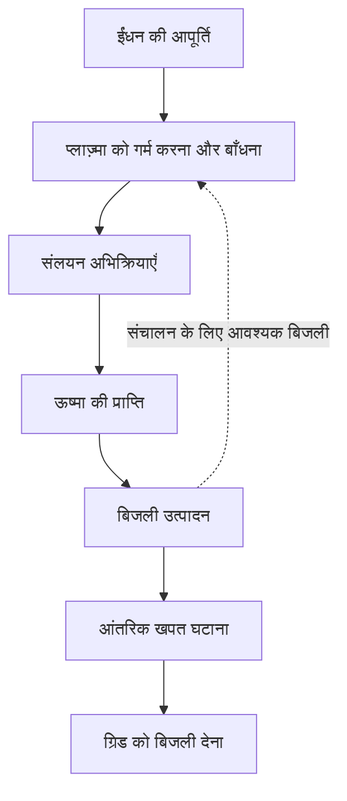
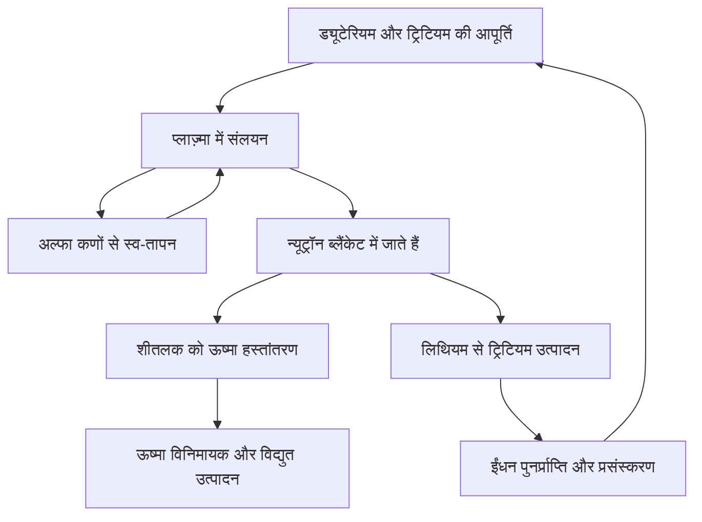

## 1. संलयन कराना और बिजलीघर चलाना अलग उपलब्धियाँ हैं

सूर्य और दूसरे तारों को संलयन से ऊर्जा मिलती है। पृथ्वी पर इसका उपयोग कम ईंधन से बहुत ऊर्जा दे सकता है। लेकिन अभिक्रिया देख लेना, विद्युत ग्रिड को बिजली देने वाला संयंत्र बना लेना नहीं है।

आग जलाना और ताप विद्युत संयंत्र चलाना भी अलग बातें हैं। ऊष्मा एकत्र करने के उपकरण, जनित्र, ईंधन आपूर्ति, नियंत्रण और रखरखाव चाहिए। संलयन में अत्यंत गर्म ईंधन को बाँधे रखने और उससे निकलने वाले न्यूट्रॉनों से संरचनाओं को बचाने की चुनौतियाँ भी जुड़ती हैं।

इसलिए **अभिक्रिया, ऊर्जा संतुलन और संयंत्र संचालन** को अलग समझना चाहिए। कोई प्रयोग महत्त्वपूर्ण प्रगति हो सकता है, भले बाकी आवश्यकताएँ अभी पूरी न हुई हों। किसी ऊर्जा स्रोत का आकर्षक होना उसकी औद्योगिक तैयारी का माप नहीं है।

यह लेख मुख्यतः ड्यूटेरियम और ट्रिटियम के मिश्रण पर केंद्रित है, जिसका व्यापक अध्ययन होता है। दूसरे तरीके भी हैं। उद्देश्य यह समझना है कि कोई प्रयोग वास्तव में क्या सिद्ध करता है, न कि एक उपकरण के रिकॉर्ड को पूरी तकनीक की तैयारी मान लेना। [अमेरिकी ऊर्जा विभाग: संलयन ऊर्जा][doe-overview]

## 2. विखंडन और संलयन दोनों ऊर्जा क्यों देते हैं?

विखंडन भारी नाभिक को तोड़ता है; संलयन हल्के नाभिकों को जोड़ता है। दोनों ऊर्जा दे सकते हैं क्योंकि विभिन्न नाभिकीय व्यवस्थाओं की ऊर्जा अलग होती है।

प्रोटॉन और न्यूट्रॉन को मिलाकर न्यूक्लिऑन कहते हैं। प्रति न्यूक्लिऑन बंधन ऊर्जा सामान्यतः हल्के नाभिकों से मध्यम द्रव्यमान वाले नाभिकों की ओर बढ़ती है और लोहे तथा निकल के आसपास ऊँची होती है। उपयुक्त हल्के नाभिक जुड़कर कम ऊर्जा की अवस्था में जाते हैं और अंतर मुक्त होता है। किसी भी नाभिक को जोड़ने से अनिवार्यतः ऊर्जा नहीं निकलती।

$$
E=\Delta m c^2
$$

$\Delta m$ प्रारंभिक और अंतिम प्रणालियों के विराम द्रव्यमान का अंतर है। पूरे ईंधन का द्रव्यमान बिजली नहीं बन जाता; उत्पाद बचे रहते हैं। ऊर्जा पहले कणों की गति जैसे रूपों में आती है और फिर ऊष्मा या बिजली के रूप में प्राप्त होती है।

विखंडन रिएक्टर में न्यूट्रॉन अगला विखंडन कराकर शृंखला अभिक्रिया चलाते हैं। संलयन में ऐसी परिस्थितियाँ बनाए रखना मुख्य है जिनमें नाभिक पर्याप्त बार पास आ सकें। दोनों नाभिकीय हैं, लेकिन उपकरण और बंद होने का व्यवहार एक जैसे नहीं हैं। [ITER: संलयन के मूल सिद्धांत][fusion-basics]

## 3. ड्यूटेरियम और ट्रिटियम क्यों?

सामान्य हाइड्रोजन के नाभिक में एक प्रोटॉन होता है। ड्यूटेरियम में एक प्रोटॉन और एक न्यूट्रॉन, ट्रिटियम में एक प्रोटॉन और दो न्यूट्रॉन होते हैं। समान तत्व के अलग न्यूट्रॉन संख्या वाले रूप समस्थानिक हैं। D और T संकेतों से इस अभिक्रिया का नाम D–T बनता है।

$$
{}^{2}_{1}\mathrm{H}+{}^{3}_{1}\mathrm{H}
\rightarrow{}^{4}_{2}\mathrm{He}+{}^{1}_{0}\mathrm{n}+17.6\,\mathrm{MeV}
$$

उत्पाद हीलियम-4 का नाभिक और एक न्यूट्रॉन हैं। जब आरंभिक कणों की ऊर्जा अभिक्रिया ऊर्जा से बहुत कम हो, हीलियम को लगभग 3.5 MeV और न्यूट्रॉन को 14.1 MeV मिलते हैं: कुल लगभग 17.6 MeV। आवेशित हीलियम नाभिक को अल्फा कण भी कहते हैं। [KIT: D–T ऊर्जा का विभाजन][dt-energy]

यह बँटवारा संयंत्र की बनावट तय करता है। चुंबकीय क्षेत्र में बँधे अल्फा कण प्लाज़्मा गर्म करते हैं। बिना आवेश के न्यूट्रॉन उसी तरह नहीं बँधते और आसपास की संरचनाओं तक जाते हैं। **संलयन ऊर्जा का बड़ा भाग प्लाज़्मा के बाहर प्राप्त होता है।**

D–T दूसरे प्रमुख विकल्पों की तुलना में अपेक्षाकृत कम तापमान पर उपयोगी अभिक्रिया दर देता है। इसका अर्थ आसान ईंधन आपूर्ति नहीं है। ट्रिटियम रेडियोधर्मी है और उसकी उपलब्धता, पुनर्प्राप्ति तथा प्रजनन की व्यवस्था चाहिए। ड्यूटेरियम–ड्यूटेरियम या प्रोटॉन–बोरॉन को उन्हीं परिस्थितियों में सीधे प्रतिस्थापित नहीं किया जा सकता। [ITER: आवश्यक परिस्थितियाँ][making-work]

## 4. इतना अधिक तापमान क्यों चाहिए?

धनावेशित नाभिक एक-दूसरे को प्रतिकर्षित करते हैं। नाभिकीय बल काम करने के लिए उन्हें बहुत पास आना होता है। तापमान बढ़ने पर गति की ऊर्जा और उपयोगी टक्करों की संख्या बढ़ती है।

लेकिन यह कहना सही नहीं कि हर कण को प्रतिकर्षण अवरोध के ऊपर शास्त्रीय ढंग से चढ़ना होता है। ऊर्जाओं का वितरण होता है और क्वांटम टनलिंग भी अभिक्रिया की संभावना में योगदान देती है। तापमान कोई चालू-बंद स्विच नहीं, बल्कि अभिक्रिया की आवृत्ति बदलने वाली शर्त है। [CERN में ITER व्याख्यान: अभिक्रिया और टनलिंग][fusion-lecture]

प्लाज़्मा का तापमान कभी keV में लिखा जाता है। यह ऊर्जा $k_B T$ है, जहाँ $k_B$ बोल्ट्ज़मान नियतांक है। 1 keV लगभग 1.16 करोड़ केल्विन और 10 keV लगभग 11.6 करोड़ केल्विन है। इसलिए दस करोड़ डिग्री और लगभग दस keV एक ही सामान्य पैमाना बताते हैं।

सूर्य के केंद्र का तापमान लगभग 1.5 करोड़ डिग्री है, जबकि पृथ्वी पर D–T अनुसंधान लगभग दस करोड़ या अधिक पर होता है। यहाँ सूर्य का आकार, गुरुत्व, घनत्व या ईंधन नहीं दोहराया जाता। सूर्य मुख्यतः प्रोटॉनों से शुरू होने वाली शृंखला उपयोग करता है। पृथ्वी की परिरोधन सीमाओं में दूसरी अभिक्रिया अधिक उपयुक्त है। कृत्रिम सूर्य एक उपमा है। [ITER][fusion-basics], [ऊर्जा विभाग: दहकता प्लाज़्मा][burning]

## 5. प्लाज़्मा गर्म ठोस पदार्थ नहीं है

ऊँचे तापमान पर इलेक्ट्रॉन नाभिकों से अलग हो जाते हैं। प्लाज़्मा में गतिशील धनायन और इलेक्ट्रॉन होते हैं। कुल मिलाकर लगभग उदासीन होने पर भी उसके कण आवेशित हैं और विद्युत तथा चुंबकीय क्षेत्रों पर प्रतिक्रिया करते हैं।

पात्र तुरंत पिघल क्यों नहीं जाता? चुंबकीय रूप से परिरुद्ध प्लाज़्मा का घनत्व और ऊष्मा हस्तांतरण ठोस धातु से बहुत अलग होता है। तापमान कणों की गति का ऊर्जा पैमाना है, संग्रहित कुल ऊष्मा नहीं। समान आयतन में अत्यधिक गर्म लेकिन विरल कणों की ऊर्जा घने पदार्थ से अलग होती है।

फिर भी दीवारों को कणों, विकिरण और न्यूट्रॉनों से ऊर्जा मिलती है। चुंबकीय क्षेत्र गर्म केंद्र का सीधा संपर्क घटाता है; वह पूर्ण तापरोधक नहीं है। न पात्र मूलतः असंभव है, न दीवारें स्वतः सुरक्षित हैं। प्लाज़्मा बनाए रखना और दीवारों का भार नियंत्रित करना साथ करना पड़ता है।

## 6. तापमान, घनत्व और ऊर्जा परिरोधन समय

यदि टक्करें दुर्लभ हों तो ऊँचा तापमान पर्याप्त नहीं। यदि ईंधन तुरंत ठंडा या बिखर जाए तो अधिक घनत्व भी पर्याप्त नहीं। तापमान $T$, घनत्व $n$ और ऊर्जा परिरोधन समय $\tau_E$ साथ देखे जाते हैं।

सरल परिभाषा में संग्रहित ऊर्जा $W$ को क्षय शक्ति $P_{\mathrm{loss}}$ से भाग देते हैं:

$$
\tau_E=\frac{W}{P_{\mathrm{loss}}}
$$

100 MJ संग्रहित और 50 MW हानि होने पर उत्तर दो सेकंड है। इसका अर्थ प्लाज़्मा का दो सेकंड बाद समाप्त होना नहीं है। रिसते टब में पानी भरते रहने से स्तर बना रहता है; ऊर्जा की भरपाई से प्लाज़्मा निर्वहन अधिक देर चल सकता है। **निर्वहन अवधि और ऊर्जा परिरोधन समय अलग राशियाँ हैं।**

लॉसन मानदंड संलयन ताप और हानि के संतुलन से आवश्यक घनत्व तथा परिरोधन बताता है। अक्सर त्रिगुणनफल $nT\tau_E$ उपयोग होता है। अनुकूल तापमान के पास D–T प्रज्वलन के लिए पैमाना कुछ $10^{21}$ keV·s·m$^{-3}$ है। शर्त ईंधन, तापमान, वांछित लाभ और घनत्व की परिभाषा पर निर्भर है; यह सभी प्रयोगों की सार्वभौमिक उत्तीर्ण सीमा नहीं है। [मैक्स प्लांक प्लाज़्मा भौतिकी संस्थान][triple-product]

| राशि | क्या बताती है | अकेले क्या सिद्ध नहीं करती |
|---|---|---|
| तापमान | कण गति का ऊर्जा पैमाना | टक्कर आवृत्ति और निरंतर अभिक्रिया |
| घनत्व | प्रति आयतन कण संख्या | पर्याप्त ताप और कम हानि |
| ऊर्जा परिरोधन समय | संग्रहित ऊर्जा और हानि का अनुपात | कुल निर्वहन अवधि |
| निर्वहन अवधि | अवस्था कितनी देर बनी रही | संलयन शक्ति और विद्युत संतुलन |

## 7. अभिक्रिया दर से ईंधन मिश्रण समझना

बहुत सरल, एकसमान D–T प्लाज़्मा में प्रति आयतन प्रति समय अभिक्रियाएँ हैं:

$$
R=n_D n_T\langle\sigma v\rangle
$$

$n_D$ और $n_T$ ड्यूटेरियम तथा ट्रिटियम संख्या घनत्व, $\sigma$ अभिक्रिया अनुप्रस्थ काट और $v$ सापेक्ष वेग है। कोष्ठक वेग वितरण पर औसत दर्शाते हैं। सभी टक्करें एक वेग पर नहीं होतीं, इसलिए दर तापमान के सीधे अनुपात में नहीं है।

कुल घनत्व $n=n_D+n_T$ और अन्य परिस्थितियाँ स्थिर हों तो दोनों की बराबर मात्रा पर $n_Dn_T$ अधिकतम होता है। केवल एक प्रकार बढ़ाने पर दूसरे साथी कम पड़ जाते हैं। दो समूहों के बीच जोड़ियाँ बनाते समय एक समूह बढ़ाने से जोड़ियाँ अनंत नहीं बढ़तीं।

दोनों घनत्व दुगुने करने से दर चार गुनी तभी होगी जब बाकी परिस्थितियाँ वही रहें। असल में दबाव, विकिरण हानि और स्थिरता भी बदलते हैं। एक गुणक देखकर अधिक घनत्व को सभी समस्याओं का हल नहीं मान सकते। [लाभ और लॉसन मानदंड पर अध्ययन][lawson-paper]

## 8. चुंबकीय क्षेत्र प्लाज़्मा कैसे बाँधता है?

आवेशित कण पर लॉरेंत्ज़ बल लगता है:

$$
\mathbf{F}=q\left(\mathbf{E}+\mathbf{v}\times\mathbf{B}\right)
$$

चुंबकीय भाग पथ मोड़ता है; कण क्षेत्र रेखा के चारों ओर घूमते हुए उसके साथ चलता है। स्थिर चुंबकीय क्षेत्र का बल वेग के लंबवत है और सीधे कार्य करके कण को गर्म नहीं करता। परिरोधन और ताप के उपकरणों की भूमिकाएँ अलग हैं।

सीधे क्षेत्र के सिरों से कण निकल सकते हैं। पथ को वलय बना देने पर सिरे हटते हैं, लेकिन वक्रता और क्षेत्र की असमानता से बहाव उत्पन्न होता है। क्षेत्र रेखाओं में ऐंठन कण गति और दबाव संतुलन के अनुकूल विन्यास बनाने में सहायता करती है।

चुंबक से पकड़ना कहना आसान है, पर इसमें घूर्णन, ज्यामिति, धारा, दबाव और अस्थिरताएँ जुड़ी हैं। केवल मजबूत क्षेत्र लंबे परिरोधन की गारंटी नहीं। [प्रिंसटन प्लाज़्मा भौतिकी प्रयोगशाला][magnetic]

## 9. टोकामाक और स्टेलरेटर

टोकामाक वलयाकार प्लाज़्मा में बाहरी कुंडलियों और प्लाज़्मा धारा के क्षेत्रों को जोड़ता है। धारा परिरोधन में मदद करती है, पर उसे बनाए रखना और अचानक बदलावों से उपकरण बचाना आवश्यक है।

ट्रांसफॉर्मर की तरह धारा प्रेरित करने से निरंतर संचालन की सीमाएँ आती हैं। तरंगों या कण पुंजों से गैर-प्रेरणीय धारा संचालन भी किया जाता है। सभी टोकामाक केवल क्षणभर चल सकते हैं कहना भी गलत है और धारा बिना सहायक साधनों के अनंत चलेगी मानना भी।

स्टेलरेटर मुख्यतः त्रिआयामी बाहरी कुंडलियों से ऐंठन बनाता है। बड़ी प्लाज़्मा धारा पर कम निर्भरता स्थिर संचालन में उपयोगी है। बदले में कुंडलियों का डिजाइन, निर्माण, सटीक स्थान और कण हानि नियंत्रण कठिन होते हैं। [मैक्स प्लांक संस्थान: स्टेलरेटर][stellarator]

| पक्ष | टोकामाक | स्टेलरेटर |
|---|---|---|
| क्षेत्र रेखाओं की ऐंठन | बाहरी कुंडलियाँ और प्लाज़्मा धारा | मुख्यतः त्रिआयामी कुंडलियाँ |
| लंबे संचालन की चुनौती | धारा बनाए रखना, स्थिरता, ताप निकास | क्षेत्र अनुकूलन, निर्माण, ताप निकास |
| ज्यामिति | लगभग अक्षसममित | जटिल त्रिआयामी |
| साझा संयंत्र समस्याएँ | ईंधन, पदार्थ, ऊष्मा, रखरखाव, विद्युत संतुलन | ईंधन, पदार्थ, ऊष्मा, रखरखाव, विद्युत संतुलन |

केवल एक तरीका सफल होगा, ऐसा सरल नियम नहीं है। प्लाज़्मा प्रदर्शन के साथ निर्माण, मरम्मत और लंबे समय की विश्वसनीयता भी तुलना में शामिल हैं।

## 10. बाहरी ताप से स्वयं उत्पन्न ताप तक

टोकामाक की धारा प्रतिरोध से प्लाज़्मा गर्म करती है। लेकिन तापमान बढ़ने पर प्रतिरोध घटता है, इसलिए अकेले इस तरीके की सीमा है। अतिरिक्त ऊर्जा बाहर से देनी होती है।

उदासीन पुंज इंजेक्शन में तेज, आवेशरहित कण चुंबकीय क्षेत्र से बहुत मुड़े बिना प्रवेश करते हैं। भीतर आयनीकरण और टक्करों से ऊर्जा पहुँचती है। रेडियो आवृत्ति और सूक्ष्मतरंग प्रणालियाँ दूसरा तरीका हैं। कोई उपकरण पूरी विद्युत खपत को प्लाज़्मा ऊष्मा में नहीं बदलता। [ITER: बाहरी ताप प्रणालियाँ][heating]

D–T अभिक्रियाएँ बढ़ने पर अल्फा कण अधिक स्व-तापन देते हैं। इससे प्रधान रूप से गर्म होने वाली अवस्था दहकता प्लाज़्मा कहलाती है। यहाँ दहन ऑक्सीजन वाली रासायनिक अभिक्रिया नहीं है।

चुंबकीय परिरोधन में आदर्श प्रज्वलन का अर्थ है कि संलयन उत्पाद बाहरी ताप के बिना हानि भर दें। पंप, शीतलन और नियंत्रण फिर भी बिजली लेते हैं। प्लाज़्मा की तापीय आत्मनिर्भरता और पूरे संयंत्र की विद्युत आत्मनिर्भरता अलग सीमाओं पर मापी जाती हैं। [ऊर्जा विभाग: दहकता प्लाज़्मा][burning]

## 11. लेज़र संलयन बहुत छोटे समय का उपयोग करता है

चुंबकीय परिरोधन अपेक्षाकृत विरल गर्म प्लाज़्मा को लंबे समय रखता है। जड़त्वीय परिरोधन थोड़े ईंधन को अधिक घनत्व तक दबाता है, ताकि फैलने से पहले अभिक्रिया हो। लेज़र इस संपीड़न की ऊर्जा दे सकते हैं।

अमेरिका की राष्ट्रीय प्रज्वलन सुविधा NIF छोटे लक्ष्यों के संपीड़न और ताप का अध्ययन करती है। बिजलीघर को लक्ष्य बनाना, पहुँचाना, विकिरित करना, उत्पाद हटाना और अगली घटना से पहले ऊष्मा सँभालना बार-बार करना होगा। एक सफल प्रयोग पूरी औद्योगिक शृंखला साबित नहीं करता।

5 दिसंबर 2022 के NIF प्रयोग में लक्ष्य तक पहुँची 2.05 MJ लेज़र ऊर्जा से 3.15 MJ संलयन ऊर्जा मिली। ऐतिहासिक परिणाम ने लक्ष्य लाभ एक से अधिक दिखाया, पूरी लेज़र सुविधा की बिजली गिनने पर सकारात्मक विद्युत संतुलन नहीं। [लॉरेंस लिवरमोर प्रयोगशाला: प्रज्वलन प्रयोग][nif]

काल्पनिक गणना में प्रति घटना 100 MJ और प्रति सेकंड पाँच घटनाएँ 500 MW औसत संलयन शक्ति देंगी। यह गुणा लक्ष्य लागत, पुनरावृत्ति दर, लेज़र दक्षता और उपकरण आयु एक साथ हासिल होने का प्रमाण नहीं। शिखर शक्ति, प्रति स्पंद ऊर्जा और औसत शक्ति अलग हैं।

## 12. निवेश की दस गुनी ऊर्जा: निवेश कहाँ मापा गया?

चुंबकीय परिरोधन में प्लाज़्मा लाभ $Q$ सामान्यतः संलयन शक्ति को वास्तव में प्लाज़्मा तक पहुँची बाहरी ताप शक्ति से तुलना करता है:

$$
Q=\frac{P_{\mathrm{fusion}}}{P_{\mathrm{heat}}}
$$

ITER का लक्ष्य 50 MW ताप से 500 MW संलयन, अर्थात $Q=10$ है। यह अनुसंधान लक्ष्य है, प्राप्त व्यावसायिक उत्पादन रिकॉर्ड नहीं। ITER उस ऊष्मा से ग्रिड को बेचने के लिए बिजली बनाने वाला संयंत्र नहीं है। [ITER: परियोजना के लक्ष्य][iter-goals]

$Q=10$ का अर्थ खपत से दस गुनी बिजली नहीं। बिजली से प्लाज़्मा ताप तक हानि होती है और ऊष्मा से बिजली बनने में भी। शीतलन, निर्वात पंप और ईंधन प्रसंस्करण अतिरिक्त बिजली लेते हैं।

शिक्षण मॉडल लें: 1,000 MW संलयन और $Q=10$ पर बाहरी ताप 100 MW है। बिजली से प्लाज़्मा ताप की दक्षता 50% हो तो तापक 200 MW बिजली लेता है। केवल संलयन शक्ति का 40% बिजली बने तो 400 MW मिलते हैं। 200 MW ताप और 100 MW अन्य खपत घटाकर 100 MW बाहर देने योग्य बचते हैं।

$$
P_{\mathrm{net}}\approx\eta_e P_{\mathrm{fusion}}
-\frac{P_{\mathrm{fusion}}}{Q\eta_h}-P_{\mathrm{aux}}
$$

यह मॉडल बाहरी ताप की पुनर्प्राप्ति और ब्लैंकेट की अतिरिक्त अभिक्रिया ऊर्जा छोड़ता है। इसका उद्देश्य हिसाब की सीमा समझाना है, वास्तविक संयंत्र का अनुमान नहीं। समान मान्यताओं में $Q=5$ पर तापक 400 MW बिजली लेगा और शुद्ध परिणाम ऋण 100 MW होगा। **प्लाज़्मा लाभ और ग्रिड को उपलब्ध बिजली अलग हैं।**

| माप | प्रवेश सीमा | क्या बताता है |
|---|---|---|
| प्लाज़्मा लाभ | प्लाज़्मा तक पहुँचा ताप | संलयन शक्ति से अनुपात |
| लक्ष्य लाभ | लक्ष्य तक पहुँची ऊर्जा | एक घटना की संलयन ऊर्जा से अनुपात |
| शुद्ध बिजली | पूरे संयंत्र की विद्युत खपत | बाहर बिजली देने की क्षमता |
| आर्थिक व्यवहार्यता | निर्माण, संचालन, ईंधन, रखरखाव | आपूर्ति का व्यवसाय चल सकता है या नहीं |

## 13. ब्लैंकेट ऊष्मा और ईंधन दोनों सँभालता है

D–T न्यूट्रॉन चुंबकीय क्षेत्र पार कर आसपास के पदार्थ से टकराते हैं। उनकी गतिज ऊर्जा ऊष्मा बनती है। विद्युत रिएक्टर में प्लाज़्मा के चारों ओर ब्लैंकेट इसे प्राप्त करने वाला प्रमुख भाग है।

यह केवल तापरोधक नहीं। इसमें ऊष्मा प्राप्ति, चुंबक जैसे उपकरणों का परिरक्षण और ट्रिटियम उत्पादन जुड़े हैं। लिथियम वाले पदार्थों से न्यूट्रॉन की अभिक्रिया ट्रिटियम बनाती है, जिसे निकालकर ईंधन प्रणाली में लौटाना पड़ता है।

इन कार्यों में स्थान को लेकर समझौते हैं। मोटा परिरक्षण चुंबकों को बचाता है पर आकार और द्रव्यमान बढ़ाता है। ताप और निदान के छिद्रों में उसी समय प्रजनक पदार्थ नहीं भरा जा सकता। न्यूट्रॉन उपयोग के लिए अच्छी ज्यामिति ऊष्मा निकालने के लिए सर्वोत्तम हो, जरूरी नहीं।

ITER वास्तविक संलयन वातावरण में प्रजनक ब्लैंकेट मॉड्यूल जाँचने की योजना रखता है। परीक्षण मॉड्यूल होना पूरे बिजलीघर की ईंधन आत्मनिर्भरता सिद्ध होना नहीं है। [ITER: ट्रिटियम प्रजनन][breeding]

## 14. समुद्री जल का ईंधन: अधूरी कहानी

ड्यूटेरियम पानी से मिलता है, लेकिन D–T को ट्रिटियम भी चाहिए। उसकी अर्धायु लगभग 12.3 वर्ष है और प्रकृति में विशाल संचित भंडार नहीं हैं। लंबे संचालन के लिए प्रजनन और पुनर्प्राप्ति जरूरी हैं। [ITER: शब्दावली][glossary]

ट्रिटियम प्रजनन अनुपात उत्पादित मात्रा को अभिक्रिया में खपी मात्रा से तुलना करता है। कम से कम एक पर्याप्त लग सकता है, लेकिन निष्कर्षण की देरी, पदार्थों और उपकरणों में फँसी मात्रा, हानि, रेडियोधर्मी क्षय और नए संयंत्र का प्रारंभिक भंडार भी गिनना होगा।

यदि खर्च हुआ पूरा ईंधन बाद में लौट आए, तब भी प्रतीक्षा के दौरान चलने के लिए भंडार चाहिए। सालाना उत्पादन और खपत बराबर होने से हर क्षण उपलब्धता सुनिश्चित नहीं होती। समय के साथ संतुलन भी महत्त्वपूर्ण है।

प्रवेश कराया सारा ईंधन एक चक्कर में नहीं जलता। बचा ईंधन, हीलियम और अशुद्धियाँ निकालकर अलग करनी पड़ती हैं। अभिक्रिया की खपत, प्रसंस्करण प्रवाह और स्थल का कुल भंडार अलग राशियाँ हैं। छोटी खपत अपने-आप छोटी प्रसंस्करण प्रणाली नहीं बनाती।

संसाधनों की प्रचुरता लाभ है, पर तैयारी, आपूर्ति और पुनर्चक्रण की तकनीक का विकल्प नहीं। [IAEA: D–T ईंधन चक्र][fuel-cycle]

## 15. ऊष्मा रोकना और ऊष्मा निकालना

प्लाज़्मा का केंद्र गर्म रहना चाहिए, लेकिन बाहर आती ऊर्जा प्राप्त करके दीवारों का ताप सीमित रखना भी जरूरी है। दोनों आवश्यकताएँ साथ पूरी करनी होती हैं।

किनारे से हीलियम की राख, अशुद्धियाँ और ऊष्मा निकाली जाती हैं। टोकामाक में डाइवर्टर इसका एक भाग करता है। निकास पर प्रवाह की तरह छोटे क्षेत्र में ताप केंद्रित हो सकता है। लंबा प्लाज़्मा संचालन पर्याप्त नहीं यदि उससे पुर्जे जल्दी खराब हों।

ऊष्मा फ्लक्स प्रति क्षेत्र शक्ति है। ITER डाइवर्टर में लगभग 10 MW/m$^2$ के स्थिर भार का डिजाइन विचार है। 10 cm भुजा के वर्ग पर यह 100 kW है। छोटे क्षेत्र को भी बड़े शीतलन की जरूरत पड़ सकती है। [ITER: डाइवर्टर][divertor]

टंग्स्टन का ऊँचा गलनांक अकेले समाधान नहीं। ऊष्मा को संरचनाओं और जोड़ों से होकर शीतलक तक पहुँचना है। तापीय थकान, अपरदन और प्लाज़्मा दूषण भी महत्त्वपूर्ण हैं। दीवार की अशुद्धियाँ विकिरण हानि बढ़ा सकती हैं, इसलिए पदार्थ और प्लाज़्मा परस्पर जुड़े हैं।

ताप रिकॉर्ड और व्यावहारिक पुर्जा-बदल अंतराल अलग क्षमताएँ मापते हैं। एक अधिकतम आँकड़ा व्यावसायिक तैयारी नहीं बताता।

## 16. न्यूट्रॉन पदार्थों को बदलते हैं

ऊर्जावान न्यूट्रॉन संरचनात्मक पदार्थ के परमाणुओं को उनकी जगह से हटा सकते हैं। नाभिकीय अभिक्रियाएँ दूसरे तत्व और गैसें बना सकती हैं। भंगुरता, फूलना और ताप चालकता में बदलाव संभव हैं।

केवल गर्म भट्ठी में परीक्षण इस वातावरण को नहीं दोहराता। ताप, यांत्रिक भार, विकिरण और शीतलक की रासायनिक क्रियाएँ साथ काम करती हैं। आयु का अनुमान प्रयोग और सिमुलेशन से हो, तथा पर्याप्त आँकड़ों से सत्यापित हो। [IAEA: विकिरण क्षति][materials]

न्यूट्रॉन पदार्थों को रेडियोधर्मी भी बना सकते हैं। इसलिए संलयन में कोई रेडियोधर्मी कचरा नहीं होता कहना गलत है। समस्थानिक, मात्रा और प्रबंधन अवधि पदार्थ, विकिरण, संचालन इतिहास और निपटान मार्ग पर निर्भर हैं। कम सक्रियण वाले पदार्थ प्रदर्शन तथा बाद का प्रबंधन सुधारने का प्रयास हैं।

रखरखाव में दूरस्थ उपकरण चाहिए: बड़े पुर्जे निकालना, नए सही जोड़ना और कठिन पहुँच वाले स्थानों में जाँच करना। जो मशीन जोड़ी जा सकती है, वह जल्दी सुधारी भी जा सके, जरूरी नहीं। मरम्मत या बदलाव का बंद समय उत्पादन और लागत प्रभावित करता है।

विखंडन से अलग रुकने का व्यवहार सभी जोखिम नहीं मिटाता। ट्रिटियम, सक्रियित पदार्थ, संग्रहित चुंबकीय ऊर्जा और गर्म या दबाव वाले द्रवों का उपयुक्त प्रबंधन चाहिए। [ITER: सुरक्षा और पर्यावरण][safety]

## 17. अतिचालक चुंबक भी बिजली लेने वाले संयंत्र में हैं

मजबूत चुंबकीय क्षेत्र के लिए बड़ी धारा चाहिए। उचित दशाओं में अतिचालक दिष्ट धारा प्रतिरोध बहुत घटाते हैं। इससे क्षेत्र बनाए रखना कुशल होता है, पर पूरे संयंत्र की खपत शून्य नहीं होती।

ITER के चुंबक लगभग 4 K पर काम करने के लिए डिजाइन हैं। बहुत ठंडे भाग गर्म प्लाज़्मा के पास होते हैं, इसलिए निर्वात इन्सुलेशन, ताप ढाल, प्रशीतन और निम्नताप पाइप आवश्यक हैं। पदार्थ का गुण उपयोग करने के लिए व्यापक सहायक अभियांत्रिकी चाहिए। [ITER: निम्नताप प्रणाली][cryogenics]

उच्च ताप अतिचालक का अर्थ कमरे के ताप पर संचालन नहीं है। वे पारंपरिक पदार्थों से ऊँचे ताप पर अतिचालक रहते हैं, लेकिन बड़े क्षेत्र और धारा में शीतलन व सुरक्षा चाहिए। यांत्रिक बलों और संग्रहित ऊर्जा को खराबी के समय सँभालना पड़ता है।

निर्वात पंप, ईंधन प्रसंस्करण, कंप्यूटर और नियंत्रण भी बिजली लेते हैं। चमकते प्लाज़्मा के चित्र से बाहर के उपकरण संचालन संभव बनाते हैं। केवल प्लाज़्मा के भीतर हिसाब रखने से यह खपत छिप जाती है। [ITER: चुंबक][magnets], [विद्युत आपूर्ति][power-supply]

## 18. जहाँ पहुँचना कठिन है, वहाँ मापन कैसे हो?

तापमान, घनत्व, क्षेत्र, विकिरण और उत्पादों के लिए अनेक निदान चाहिए। केंद्र में साधारण तापमापी नहीं रख सकते। प्रकाश, तरंगें, कण और चुंबकीय संकेत अप्रत्यक्ष जानकारी देते हैं।

एक माप पूरे प्लाज़्मा का प्रतिनिधि नहीं होता। केंद्र और किनारे अलग हैं तथा समय के साथ बदलते हैं। दृष्टि रेखा पर समाकलित संकेत से स्थानिक वितरण निकालने में धारणाएँ या दूसरे माप चाहिए। उपकरण की अनिश्चितता और मॉडल की मान्यता अलग रखें। [ITER: निदान][diagnostics]

विक्षोभ, कण परिवहन, चुंबकीय ज्यामिति और पदार्थों के लिए सिमुलेशन आवश्यक है। कंप्यूटर पर अभिक्रिया दिखाना संयंत्र की तैयारी सिद्ध नहीं करता। मॉडल के सत्यापित और असत्यापित क्षेत्रों को बताकर प्रयोग से तुलना करनी होती है।

नियंत्रण में मशीन लर्निंग पर भी यही लागू है। पुराने आँकड़ों पर अच्छा अनुमान नए संचालन क्षेत्र या खराब सेंसर में विश्वसनीयता सिद्ध नहीं करता। बेहतर एल्गोरिद्म ईंधन, पदार्थ और ताप निकास की समस्याएँ नहीं मिटाते। संलयन मापन, भौतिकी और अभियांत्रिकी का संयुक्त तंत्र है।

## 19. तारों के रहस्य से पृथ्वी के प्रयोगों तक

बीसवीं सदी की शुरुआत में सूर्य का लंबे समय चमकना पहेली था; रासायनिक दहन इसे नहीं समझाता था। 1920 में एडिंगटन ने हाइड्रोजन से हीलियम बनने को तारों की ऊर्जा का स्रोत सुझाया। नाभिकीय अनुसंधान बाद में तारकीय आंतरिक संरचना से जुड़ा।

1934 में ऑलिफैंट, हार्टेक और रदरफोर्ड के ड्यूटेरियम प्रयोगों ने हल्के नाभिकों का अध्ययन बढ़ाया। बेथे और अन्य वैज्ञानिकों ने तारों की ऊर्जा की नाभिकीय व्याख्या विकसित की। [ITER: प्रारंभिक इतिहास][history-early]

1950 के दशक में नियंत्रित स्थलीय संलयन को ऊर्जा स्रोत बनाने का प्रयास शुरू हुआ। कुछ शोध गोपनीय थे; 1958 का जिनेवा सम्मेलन खुले सहयोग का महत्त्वपूर्ण चरण बना। अस्थिरताएँ और हानि शुरुआती सरल अनुमानों से कठिन निकलीं। [IAEA: सहयोग का इतिहास][history-cooperation]

चुंबकीय ज्यामिति, ताप, निर्वात, अतिचालकता, निदान और गणना के सुधार बड़े प्रयोगों तक लाए। ITER दहकते प्लाज़्मा और संबद्ध तकनीकों को जोड़ता है; NIF प्रज्वलन जड़त्वीय परिरोधन की उपलब्धि है। अलग तरीके और हिसाब की सीमाएँ होने से उनके परिणाम विनिमेय अंक नहीं हैं।

| चरण | प्रश्न | अगली चुनौती |
|---|---|---|
| तारों की ऊर्जा | सूर्य इतने समय क्यों चमकता है? | अभिक्रियाओं की मात्रात्मक समझ |
| प्रयोगशाला अभिक्रियाएँ | हल्के नाभिकों की प्रतिक्रिया दिख सकती है? | बड़े पैमाने का ऊर्जा स्रोत |
| नियंत्रित संलयन | ईंधन गर्म रखा जा सकता है? | हानि और अस्थिरता दबाना |
| ऊँचा लाभ | स्व-तापन प्रमुख बन सकता है? | ईंधन, पदार्थ, पुनरावृत्ति, अवधि |
| बिजलीघर प्रदर्शन | निरंतर शुद्ध बिजली मिल सकती है? | विश्वसनीयता, रखरखाव, लागत, सामाजिक शर्तें |

लंबे इतिहास का अर्थ यह नहीं कि संलयन कराया नहीं जा सकता। अभिक्रिया होती है। कठिनाई पैमाना, समय, आपूर्ति, पदार्थ आयु और लागत एक साथ साधने में है।

## 20. व्यावसायीकरण के दावों पर छह प्रश्न

प्रगति को कम आँकना जरूरी नहीं। पर एक रिकॉर्ड को चुपचाप दूसरी उपलब्धि नहीं मानना चाहिए।

1. **क्या मापा गया?** ताप, अवधि, ऊर्जा, लाभ और शुद्ध बिजली अलग संकेतक हैं।
2. **इनपुट कहाँ गिना?** प्लाज़्मा ताप, लक्ष्य पर लेज़र और पूरे परिसर की बिजली अलग हैं।
3. **कौन-सा ईंधन और परिस्थिति?** हाइड्रोजन या ड्यूटेरियम नियंत्रण और ऊँची D–T शक्ति के उद्देश्य अलग हैं।
4. **एक घटना या दोहराने योग्य संचालन?** अधिकतम के अलावा स्थिरता, बंद समय और पुर्जों की आयु देखें।
5. **ईंधन और पुर्जे उपलब्ध हैं?** प्रजनन, पुनर्प्राप्ति, निर्माण, बदलाव और कचरा शामिल करें।
6. **योजना या सिद्ध परिणाम?** समय और लागत के पीछे प्रमाण तथा मान्यताएँ जाँचें।

सालाना बिकने योग्य बिजली भी महत्त्वपूर्ण है। 500 MW शुद्ध क्षमता वाला संयंत्र सामान्य वर्ष में 50% क्षमता गुणांक पर लगभग 2.19 TWh और 80% पर 3.50 TWh देगा। यह संचालन और रखरखाव का प्रभाव दिखाता है, भविष्य के संलयन संयंत्रों का अनुमान नहीं।

छोटा उपकरण हर चीज सस्ती नहीं बनाता। निर्माण लागत घट सकती है, लेकिन ताप छोटी सतह पर केंद्रित और मरम्मत की पहुँच कठिन हो सकती है। बड़ा उपकरण परिरोधन में सहायक लेकिन निर्माण में महँगा हो सकता है। आकार, भौतिकी, मरम्मत और अर्थशास्त्र साथ डिजाइन होते हैं।

संलयन की संभावना हल्के नाभिकों से बड़ी ऊर्जा है। उसे उपयोगी बनाने के लिए पूरी शृंखला चाहिए: **ऊष्मा पैदा और प्राप्त करना, ईंधन लौटाना, पुर्जे बदलना और लंबे समय तक संयंत्र की खपत से अधिक बिजली देना**। पूरी प्रक्रिया से उपलब्धियाँ और बाकी काम स्पष्ट होते हैं।

## स्रोत और चित्रों की सीमा

अभिक्रिया ऊर्जा और ऐतिहासिक परिणाम संदर्भित संस्थाओं पर आधारित हैं। उदाहरणों की दक्षता, सहायक खपत, आवृत्ति और क्षमता गुणांक शिक्षण मान्यताएँ हैं, वास्तविक संयंत्र का पूर्वानुमान नहीं। AI-निर्मित आवरण अवधारणात्मक है; कुंडलियाँ, पाइप और रंग इंजीनियरिंग डिजाइन नहीं हैं।

- [ऊर्जा विभाग: संलयन][doe-overview], [दहकता प्लाज़्मा][burning]
- [ITER: मूल बातें][fusion-basics], [शर्तें][making-work], [लक्ष्य][iter-goals], [शब्दावली][glossary]
- [ITER: ताप][heating], [ट्रिटियम][breeding], [डाइवर्टर][divertor], [निदान][diagnostics], [चुंबक][magnets], [निम्नताप][cryogenics], [बिजली][power-supply], [सुरक्षा][safety]
- [मैक्स प्लांक: त्रिगुणनफल][triple-product], [स्टेलरेटर][stellarator]; [प्रिंसटन: परिरोधन][magnetic]
- [लॉसन मानदंड का अध्ययन][lawson-paper]; [LLNL: 2022 प्रज्वलन][nif]
- [IAEA: ईंधन चक्र][fuel-cycle], [पदार्थ][materials], [इतिहास][history-cooperation]; [ITER: प्रारंभिक शोध][history-early]
- [KIT: D–T ऊर्जा][dt-energy]; [CERN में ITER व्याख्यान][fusion-lecture]

[doe-overview]: https://www.energy.gov/topics/fusion-energy
[fusion-basics]: https://www.iter.org/fusion-energy/what-fusion
[making-work]: https://www.iter.org/fusion-energy/making-it-work
[burning]: https://www.energy.gov/science/doe-explainsburning-plasma
[triple-product]: https://www.ipp.mpg.de/83115/fusionsprodukt
[lawson-paper]: https://arxiv.org/abs/2105.10954
[magnetic]: https://w3.pppl.gov/scied/docs/undergrad_level_general_Plasma_Fusion_PPPL/Plasma_fusion_pppl.pdf
[stellarator]: https://www.ipp.mpg.de/9792/stellarator
[heating]: https://www.iter.org/machine/supporting-systems/external-heating-systems
[nif]: https://www.llnl.gov/article/50801/llnls-breakthrough-ignition-experiment-highlighted-physical-review-letters
[iter-goals]: https://www.iter.org/fusion-energy/what-will-iter-do
[breeding]: https://www.iter.org/machine/supporting-systems/tritium-breeding
[glossary]: https://www.iter.org/fusion-glossary
[fuel-cycle]: https://www-pub.iaea.org/MTCD/publications/PDF/TE-2076web.pdf
[divertor]: https://www.iter.org/machine/divertor
[materials]: https://nucleus-qa.iaea.org/sites/fusionportal/Pages/DPWS-6/Topics.aspx
[safety]: https://www.iter.org/faqs?thematic=75
[cryogenics]: https://www.iter.org/machine/supporting-systems/cryogenics
[magnets]: https://www.iter.org/machine/magnets
[power-supply]: https://www.iter.org/machine/supporting-systems/power-supply
[diagnostics]: https://www.iter.org/machine/supporting-systems/diagnostics
[history-early]: https://www.iter.org/node/20687/who-invented-fusion
[history-cooperation]: https://nucleus.iaea.org/sites/fusion-portal/SitePages/A-brief-history-of-nuclear-fusion.aspx?web=1
[dt-energy]: https://publikationen.bibliothek.kit.edu/1000161936/151265654
[fusion-lecture]: https://indico.cern.ch/event/116345/attachments/53370/76726/Campbell_ITER26Fusion-1_CERN_Apr11.pdf
