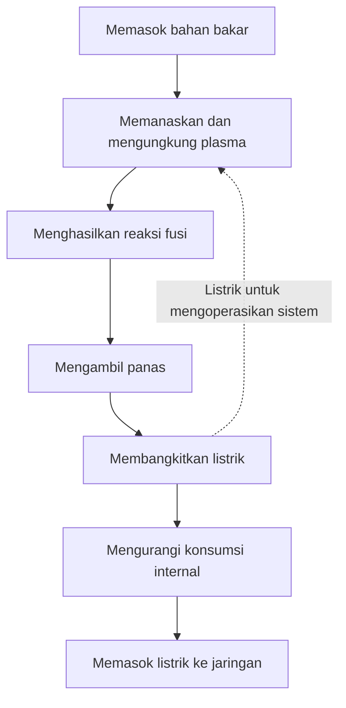
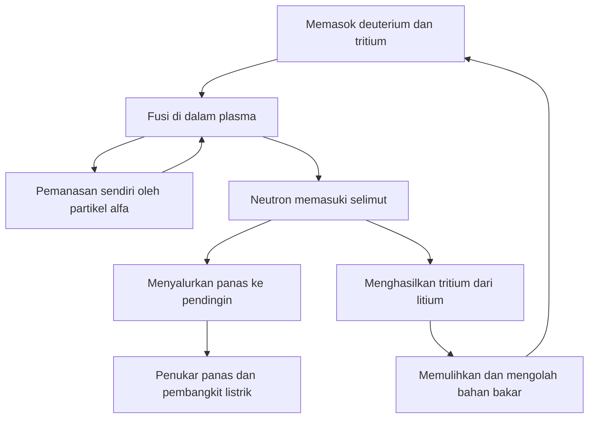

## 1. Menghasilkan fusi berbeda dengan mengoperasikan pembangkit

Fusi memasok energi bagi Matahari dan bintang lain. Pemanfaatannya di Bumi berpotensi menghasilkan energi besar dari sedikit bahan bakar. Namun, mengamati reaksi fusi belum berarti mampu memasok listrik sebagai pembangkit.

Menyalakan api pun berbeda dengan menjalankan pembangkit termal. Diperlukan penangkap panas, generator, pasokan bahan bakar, pengendalian, dan pemeliharaan. Fusi menambahkan persoalan pengungkungan bahan bakar yang sangat panas dan perlindungan struktur dari neutron.

Karena itu, bedakan **terjadinya reaksi, neraca energi, dan operasi pembangkit**. Keberhasilan eksperimen dapat menjadi kemajuan penting tanpa memenuhi semua persyaratan lainnya. Daya tarik suatu sumber energi tidak menunjukkan tingkat kesiapan industrinya.

Pembahasan berfokus pada deuterium dan tritium, pasangan bahan bakar yang banyak diteliti. Berbagai pendekatan lain tetap ada. Tujuannya adalah memahami apa yang dibuktikan setiap eksperimen, bukan menganggap satu rekor mewakili kesiapan seluruh teknologi. [Departemen Energi AS: energi fusi][doe-overview]

## 2. Mengapa fisi dan fusi sama-sama melepaskan energi?

Fisi membelah inti berat, sedangkan fusi menggabungkan inti ringan. Keduanya dapat melepaskan energi karena susunan inti yang berbeda memiliki energi yang berbeda.

Proton dan neutron disebut nukleon. Energi ikat per nukleon umumnya meningkat dari inti ringan menuju inti bermassa menengah, dengan nilai tinggi di sekitar besi dan nikel. Penggabungan inti ringan tertentu menghasilkan keadaan berenergi lebih rendah sehingga selisihnya dilepaskan. Tidak semua penggabungan inti sembarang menghasilkan energi.

$$
E=\Delta m c^2
$$

$\Delta m$ adalah selisih massa diam antara sistem awal dan akhir. Seluruh massa bahan bakar tidak berubah menjadi listrik: produk reaksi tetap ada. Energi mula-mula muncul antara lain sebagai gerak partikel, lalu dapat dikumpulkan sebagai panas dan diubah menjadi listrik.

Dalam fisi, neutron memicu fisi berikutnya dan mempertahankan reaksi berantai. Pada fusi, kondisi harus memungkinkan inti saling mendekat cukup sering. Sebutan nuklir tidak membuat peralatan atau perilaku penghentiannya identik. [ITER: dasar fusi][fusion-basics]

## 3. Mengapa deuterium dan tritium?

Inti hidrogen biasa berisi satu proton. Deuterium memiliki satu proton dan satu neutron; tritium memiliki satu proton dan dua neutron. Variasi unsur dengan jumlah neutron berbeda disebut isotop. Lambang D dan T menjadi nama reaksi D–T.

$$
{}^{2}_{1}\mathrm{H}+{}^{3}_{1}\mathrm{H}
\rightarrow{}^{4}_{2}\mathrm{He}+{}^{1}_{0}\mathrm{n}+17.6\,\mathrm{MeV}
$$

Produknya adalah inti helium-4 dan neutron. Bila energi partikel datang kecil dibandingkan energi reaksi, helium membawa sekitar 3,5 MeV dan neutron sekitar 14,1 MeV, totalnya 17,6 MeV. Inti helium bermuatan itu juga disebut partikel alfa. [KIT: pembagian energi D–T][dt-energy]

Pembagian ini menentukan rancangan pembangkit. Partikel alfa yang dikungkung medan membantu memanaskan plasma. Neutron tak bermuatan keluar menuju struktur sekitar. **Sebagian besar energi fusi dikumpulkan di luar plasma.**

D–T memberikan laju reaksi yang berarti pada suhu relatif lebih rendah dibandingkan sejumlah calon bahan bakar lain. Kemudahan relatif dalam bereaksi bukan berarti pasokan mudah: tritium radioaktif dan memerlukan penyediaan, pemulihan, serta pembiakan. Deuterium–deuterium atau proton–boron tidak bisa langsung menggantikannya pada kondisi yang sama. [ITER: persyaratan fusi][making-work]

## 4. Mengapa suhu harus sangat tinggi?

Kedua inti bermuatan positif sehingga saling menolak. Mereka harus cukup dekat agar gaya nuklir bekerja. Suhu tinggi meningkatkan energi gerak dan jumlah tumbukan yang dapat berkontribusi pada reaksi.

Ini tidak berarti setiap partikel harus melampaui seluruh penghalang secara klasik. Energi partikel mengikuti distribusi, dan penerowongan kuantum memengaruhi peluang reaksi. Suhu mengubah frekuensi reaksi, bukan bertindak sebagai sakelar. [Kuliah ITER di CERN: laju reaksi dan penerowongan][fusion-lecture]

Suhu plasma sering dinyatakan dalam keV, satuan energi yang mewakili $k_B T$, dengan $k_B$ konstanta Boltzmann. Satu keV setara sekitar 11,6 juta kelvin; 10 keV sekitar 116 juta. Ungkapan seratus juta derajat dan sekitar sepuluh keV menggambarkan skala yang serupa.

Pusat Matahari bersuhu sekitar 15 juta derajat, sedangkan penelitian D–T di Bumi membahas sekitar seratus juta atau lebih. Kita tidak meniru ukuran, gravitasi, kerapatan, maupun bahan bakar Matahari. Matahari terutama menggunakan rangkaian reaksi yang dimulai dari proton. Keterbatasan pengungkungan di Bumi mengarahkan pilihan ke reaksi lain. Istilah matahari buatan adalah perumpamaan. [ITER][fusion-basics], [DOE: plasma terbakar][burning]

## 5. Plasma bukan benda padat yang panas

Pada suhu tinggi, elektron terlepas dari inti. Plasma berisi ion positif dan elektron yang bergerak bebas. Secara keseluruhan hampir netral, tetapi partikel-partikelnya tetap merespons medan listrik dan magnet.

Mengapa wadah tidak langsung meleleh? Plasma yang dikungkung secara magnetis memiliki kerapatan dan mekanisme perpindahan panas berbeda dari logam padat. Suhu mengukur skala energi gerak, bukan jumlah energi total. Volume berisi sedikit partikel yang sangat panas tidak menyimpan energi sama dengan volume materi padat.

Dinding tetap menerima energi dari partikel, radiasi, dan neutron. Medan membatasi kontak langsung plasma pusat dengan material, tetapi bukan isolasi sempurna. Jadi, wadah bukan mustahil secara prinsip, dan dinding juga tidak otomatis aman. Menjaga plasma panas dan mengelola beban dinding harus dilakukan bersama.

## 6. Suhu, kerapatan, dan waktu pengungkungan

Suhu tinggi tidak cukup jika tumbukan jarang terjadi. Kerapatan tinggi juga tidak membantu bila bahan bakar segera mendingin atau menyebar. Suhu $T$, kerapatan $n$, dan waktu pengungkungan energi $\tau_E$ harus dipertimbangkan bersama.

Secara sederhana, waktu ini adalah energi tersimpan $W$ dibagi daya yang hilang $P_{\mathrm{loss}}$:

$$
\tau_E=\frac{W}{P_{\mathrm{loss}}}
$$

Jika tersimpan 100 MJ dan hilang 50 MW, hasilnya dua detik. Ini tidak berarti plasma harus lenyap setelah dua detik. Bak bocor tetap penuh jika aliran masuk mengganti air yang hilang; demikian pula tambahan energi dapat mempertahankan plasma jauh lebih lama. **Durasi operasi plasma berbeda dengan waktu pengungkungan energinya.**

Kriteria Lawson menghubungkan kerapatan dan pengungkungan dengan keseimbangan pemanasan fusi serta kehilangan energi. Ukuran yang umum adalah hasil kali tiga $nT\tau_E$. Untuk penyalaan D–T dekat suhu yang sesuai, skalanya beberapa $10^{21}$ keV·s·m$^{-3}$. Nilainya bergantung pada bahan bakar, suhu, target penguatan, dan definisi kerapatan, bukan ambang universal untuk semua eksperimen. [Institut Max Planck untuk Fisika Plasma][triple-product]

| Besaran | Yang dijelaskan | Yang belum dibuktikan sendiri |
|---|---|---|
| Suhu | Skala energi gerak partikel | Frekuensi dan keberlanjutan reaksi |
| Kerapatan | Partikel per satuan volume | Suhu memadai dan kehilangan rendah |
| Waktu pengungkungan energi | Energi tersimpan dibandingkan daya hilang | Lama seluruh operasi plasma |
| Durasi operasi plasma | Lama suatu keadaan dipertahankan | Daya fusi dan neraca listrik |

## 7. Persamaan laju reaksi dan campuran bahan bakar

Untuk plasma D–T seragam yang sangat disederhanakan, reaksi per satuan volume per waktu adalah:

$$
R=n_D n_T\langle\sigma v\rangle
$$

$n_D$ dan $n_T$ merupakan kerapatan deuterium dan tritium, $\sigma$ penampang lintang reaksi, dan $v$ kecepatan relatif. Tanda kurung menyatakan rata-rata atas distribusi kecepatan. Tumbukan tidak semuanya berkecepatan sama, sehingga laju tidak sekadar berbanding lurus dengan suhu.

Dengan kerapatan total $n=n_D+n_T$ dan kondisi lain tetap, $n_Dn_T$ maksimum saat masing-masing menyumbang separuh. Menambah satu jenis saja akhirnya membuat pasangan reaksinya terlalu sedikit. Seperti memasangkan anggota dua kelompok, memperbesar hanya satu kelompok tidak menjamin lebih banyak pasangan.

Menggandakan kedua kerapatan akan melipatempatkan laju hanya jika kondisi lainnya tetap. Dalam kenyataan, tekanan, radiasi, dan kestabilan ikut berubah. Satu faktor persamaan tidak membuktikan bahwa kerapatan lebih tinggi menyelesaikan semua persoalan. [Kajian penguatan dan kriteria Lawson][lawson-paper]

## 8. Bagaimana medan magnet mengungkung plasma?

Gaya Lorentz pada partikel bermuatan diberikan oleh:

$$
\mathbf{F}=q\left(\mathbf{E}+\mathbf{v}\times\mathbf{B}\right)
$$

Gaya magnet membelokkan lintasan sehingga partikel berputar mengelilingi garis medan sambil bergerak sepanjang garis itu. Gaya dari medan magnet statis tegak lurus kecepatan, sehingga tidak langsung melakukan kerja untuk memanaskan partikel. Pengungkungan dan pemanasan mempunyai fungsi berbeda.

Medan lurus memungkinkan partikel keluar lewat ujung. Menutup lintasan menjadi cincin menghilangkan ujung, tetapi kelengkungan dan variasi kuat medan menimbulkan hanyutan. Memuntir garis medan membantu menghasilkan konfigurasi yang sesuai dengan gerak partikel dan keseimbangan tekanan.

Ungkapan ditahan magnet mencakup kaitan rumit antara putaran, geometri, arus, tekanan, dan ketidakstabilan. Medan yang lebih kuat saja tidak menjamin pengungkungan lama. [Laboratorium Princeton: plasma dan pengungkungan][magnetic]

## 9. Tokamak dan stellarator

Tokamak menggabungkan medan kumparan luar dengan medan dari arus di dalam plasma berbentuk torus. Arus membantu pengungkungan, tetapi harus dipertahankan dan perubahan mendadaknya dapat membebani peralatan.

Induksi arus seperti pada transformator membatasi operasi terus-menerus. Gelombang atau berkas partikel juga dapat menggerakkan arus tanpa induksi. Tidak tepat menyatakan semua tokamak selalu beroperasi singkat, ataupun menganggap arus dapat bertahan selamanya tanpa sarana tambahan.

Stellarator membentuk puntiran terutama melalui kumparan luar tiga dimensi. Ketergantungan yang lebih kecil pada arus plasma besar menguntungkan operasi tunak. Sebagai gantinya, rancangan, pembuatan, penempatan kumparan, dan pengendalian kehilangan partikel menjadi menantang. [Institut Max Planck: stellarator][stellarator]

| Aspek | Tokamak | Stellarator |
|---|---|---|
| Puntiran garis medan | Kumparan dan arus plasma | Terutama kumparan tiga dimensi |
| Tantangan operasi lama | Mempertahankan arus, kestabilan, pembuangan panas | Optimasi medan, manufaktur, pembuangan panas |
| Geometri | Mendekati simetri sumbu | Tiga dimensi yang kompleks |
| Tantangan bersama | Bahan bakar, material, panas, pemeliharaan, neraca listrik | Bahan bakar, material, panas, pemeliharaan, neraca listrik |

Tidak ada aturan sederhana bahwa hanya satu pendekatan dapat berhasil. Perbandingan harus memasukkan kemudahan pembangunan, perbaikan, serta keandalan jangka panjang, selain kinerja plasma.

## 10. Pemanasan luar dan pemanasan oleh reaksi sendiri

Arus tokamak dapat memanaskan plasma secara resistif. Namun, resistansi turun ketika suhu naik sehingga metode ini saja terbatas. Diperlukan sumber energi tambahan.

Injeksi berkas netral memasukkan partikel berenergi yang tidak bermuatan, sehingga tidak mudah dibelokkan medan. Setelah masuk, ionisasi dan tumbukan menyalurkan energinya. Gelombang radiofrekuensi dan gelombang mikro merupakan metode lain. Tidak semua listrik peralatan berubah menjadi panas plasma. [ITER: pemanasan eksternal][heating]

Seiring meningkatnya reaksi D–T, partikel alfa menyediakan lebih banyak pemanasan sendiri. Plasma yang didominasi pemanasan ini disebut plasma terbakar, tanpa berarti pembakaran kimia dengan oksigen.

Dalam pengungkungan magnetis, penyalaan ideal berarti pemanasan produk fusi mengganti kehilangan tanpa pemanas luar. Pompa, pendingin, dan kendali tetap membutuhkan listrik. Kemandirian termal plasma berbeda dengan kemandirian listrik seluruh pembangkit. [DOE: plasma terbakar][burning]

## 11. Fusi laser memanfaatkan waktu yang sangat singkat

Pengungkungan magnetis mempertahankan plasma panas berkepadatan relatif rendah dalam waktu lama. Pengungkungan inersial memampatkan sedikit bahan bakar ke kerapatan tinggi agar bereaksi sebelum mengembang. Laser dapat menyediakan energi pendorongnya.

National Ignition Facility atau NIF di AS mempelajari pemampatan dan pemanasan sasaran kecil. Pembangkit harus mengulangnya dengan andal: membuat dan memasukkan sasaran, menyinarinya, membuang produk, serta mengelola panas sebelum peristiwa berikutnya. Satu eksperimen berhasil tidak membuktikan keseluruhan rantai industri.

Pada 5 Desember 2022, eksperimen NIF menghasilkan 3,15 MJ energi fusi dari 2,05 MJ energi laser yang mencapai sasaran. Hasil bersejarah itu membuktikan penguatan sasaran lebih dari satu, bukan neraca listrik positif yang mencakup seluruh konsumsi fasilitas laser. [Laboratorium Lawrence Livermore: eksperimen penyalaan][nif]

Sebagai contoh hitungan hipotetis, 100 MJ setiap peristiwa sebanyak lima kali per detik menghasilkan daya fusi rata-rata 500 MW. Perkalian ini tidak membuktikan bahwa laju pengulangan, biaya sasaran, efisiensi laser, dan umur peralatan sudah tercapai bersama. Bedakan daya puncak sesaat, energi setiap pulsa, dan daya rata-rata.

## 12. Sepuluh kali masukan: masukan yang mana?

Dalam pengungkungan magnetis, penguatan plasma $Q$ biasanya membandingkan daya fusi dengan daya pemanasan luar yang benar-benar sampai ke plasma:

$$
Q=\frac{P_{\mathrm{fusion}}}{P_{\mathrm{heat}}}
$$

ITER menargetkan daya fusi 500 MW dengan pemanasan 50 MW, yaitu $Q=10$. Ini sasaran mesin riset, bukan rekor pembangkitan komersial yang sudah tercapai. ITER tidak dirancang untuk menjual listrik dari panas tersebut ke jaringan. [ITER: tujuan proyek][iter-goals]

$Q=10$ tidak berarti listrik keluaran sepuluh kali listrik masukan. Ada kehilangan dari catu listrik hingga pemanasan plasma, lalu kehilangan saat panas diubah menjadi listrik. Pendinginan, pompa vakum, dan pemrosesan bahan bakar juga menggunakan listrik.

Ambil model pembelajaran: daya fusi 1.000 MW dengan $Q=10$ memerlukan pemanasan plasma 100 MW. Jika efisiensi listrik-ke-panas plasma 50%, pemanas memakai 200 MW listrik. Mengubah hanya daya fusi menjadi listrik dengan efisiensi 40% menghasilkan 400 MW. Kurangi 200 MW pemanas dan 100 MW beban lain; tersisa 100 MW untuk jaringan.

$$
P_{\mathrm{net}}\approx\eta_e P_{\mathrm{fusion}}
-\frac{P_{\mathrm{fusion}}}{Q\eta_h}-P_{\mathrm{aux}}
$$

Model ini mengabaikan pemulihan panas dari pemanasan luar dan tambahan energi reaksi dalam selimut. Tujuannya menjelaskan batas perhitungan, bukan meramalkan pembangkit nyata. Dengan asumsi sama tetapi $Q=5$, pemanas memakai 400 MW listrik dan saldo menjadi minus 100 MW. **Penguatan plasma tidak sama dengan listrik yang dapat dikirim ke jaringan.**

| Ukuran | Batas masukan | Informasi yang diberikan |
|---|---|---|
| Penguatan plasma | Daya pemanasan yang mencapai plasma | Perbandingan terhadap daya fusi |
| Penguatan sasaran | Energi yang mencapai sasaran | Perbandingan terhadap energi fusi per peristiwa |
| Listrik bersih | Konsumsi seluruh pembangkit | Kemampuan memasok listrik keluar |
| Ekonomi | Pembangunan, operasi, bahan bakar, pemeliharaan | Kelayakan penyediaan listrik sebagai usaha |

## 13. Selimut mengambil panas dan membiakkan bahan bakar

Neutron D–T menembus medan pengungkungan. Interaksi dengan material mengubah energi geraknya menjadi panas. Selimut di sekitar plasma menjadi bagian utama pemulihan energi pada reaktor daya.

Selimut bukan sekadar isolasi. Rancangannya menggabungkan pengambilan panas, pelindungan peralatan seperti magnet, serta produksi tritium. Interaksi neutron dengan bahan berlithium menghasilkan tritium yang harus diekstraksi dan dikembalikan ke sistem bahan bakar.

Fungsi-fungsi itu memperebutkan ruang. Pelindung tebal membantu magnet tetapi menambah ukuran dan massa. Bukaan diagnostik atau pemanasan tidak bisa sekaligus diisi material pembiak. Geometri terbaik untuk neutron belum tentu terbaik untuk mengambil panas.

ITER merencanakan pengujian modul selimut pembiak dalam lingkungan fusi. Modul percobaan tidak sama dengan bukti kemandirian bahan bakar seluruh pembangkit. [ITER: pembiakan tritium][breeding]

## 14. Bahan bakar dari air laut belum menjelaskan semuanya

Deuterium tersedia dari air, tetapi D–T juga membutuhkan tritium. Tritium radioaktif memiliki waktu paruh sekitar 12,3 tahun dan tidak tersedia sebagai cadangan alam besar yang menumpuk. Operasi panjang memerlukan pembiakan dan pemulihan. [ITER: glosarium][glossary]

Rasio pembiakan membandingkan tritium yang diproduksi dengan yang dikonsumsi reaksi. Nilai setidaknya satu terdengar cukup, tetapi perlu memperhitungkan keterlambatan pemulihan, retensi material dan peralatan, kehilangan, peluruhan, serta persediaan untuk memulai fasilitas lain.

Sekalipun seluruh bahan bakar yang terpakai akhirnya kembali, operasi tetap memerlukan stok selama menunggu. Produksi dan konsumsi tahunan yang sama tidak menjamin pasokan setiap saat. Waktu ketersediaan sama pentingnya dengan jumlah keseluruhan.

Tidak semua bahan bakar yang dimasukkan bereaksi dalam satu lintasan. Bahan tak terbakar, helium, dan pengotor perlu dikeluarkan dan dipisahkan agar bahan berguna dapat didaur ulang. Konsumsi reaksi, laju aliran pemrosesan, dan inventaris lokasi adalah besaran berbeda. Konsumsi reaksi kecil tidak otomatis berarti sistem pemrosesan kecil.

Kelimpahan sumber daya adalah keunggulan, tetapi tidak menggantikan teknologi penyiapan, pemasokan, dan daur ulang. [IAEA: fisika dan teknologi siklus D–T][fuel-cycle]

## 15. Menahan panas sekaligus membuang panas

Pusat plasma harus tetap panas, sementara pembangkit harus mengumpulkan energi yang keluar dan menjaga suhu dinding. Dua tuntutan ini harus dipenuhi bersamaan.

Di tepi plasma, abu helium, pengotor, dan panas dibuang. Divertor melakukan sebagian tugas ini pada tokamak. Seperti aliran yang terkumpul di saluran keluar, panas dapat terkonsentrasi pada area kecil. Plasma berumur panjang tidak cukup jika komponennya cepat rusak.

Fluks panas adalah daya per satuan luas. Desain divertor ITER mencakup beban tunak sekitar 10 MW/m$^2$. Pada persegi bersisi 10 cm, itu berarti 100 kW. Area kecil pun bisa memerlukan pembuangan panas besar. [ITER: divertor][divertor]

Titik leleh tungsten yang tinggi tidak menyelesaikan semuanya. Panas harus melewati struktur dan sambungan hingga mencapai pendingin. Kelelahan termal, erosi, dan pencemaran plasma juga penting. Pengotor dinding dapat meningkatkan kehilangan radiasi, menghubungkan perilaku material dengan plasma.

Rekor suhu dan interval penggantian komponen yang layak mengukur kemampuan berbeda. Satu nilai maksimum tidak menunjukkan langsung jarak menuju komersialisasi.

## 16. Neutron juga mengubah material

Neutron berenergi tinggi memindahkan atom dari posisinya. Reaksi nuklir dapat menghasilkan unsur lain dan gas di dalam material. Akibatnya dapat berupa penggetasan, pembengkakan, serta perubahan konduktivitas termal.

Pengujian dalam tungku saja tidak meniru lingkungan ini. Panas, beban mekanis, radiasi neutron, dan interaksi kimia pendingin bekerja bersama. Eksperimen dan simulasi harus memperkirakan umur pakai dengan data yang cukup untuk memvalidasinya. [IAEA: kerusakan akibat iradiasi][materials]

Neutron juga mengaktifkan material. Klaim bahwa fusi sama sekali tidak menghasilkan limbah radioaktif menyesatkan. Jenis isotop, jumlah, dan lama pengelolaan bergantung pada material, paparan, riwayat operasi, serta jalur pembuangan. Material aktivasi rendah bertujuan memperbaiki kinerja sekaligus beban pengelolaan masa depan.

Pemeliharaan membutuhkan penanganan jarak jauh: mengeluarkan komponen besar, memasang pengganti dengan akurat, dan memeriksa pekerjaan di area sulit diakses. Dapat dirakit belum tentu mudah diperbaiki. Waktu berhenti untuk perbaikan atau penggantian memengaruhi produksi dan biaya.

Perilaku penghentian yang berbeda dari fisi tidak menghilangkan semua bahaya. Tritium, material teraktivasi, energi magnet tersimpan, dan fluida panas atau bertekanan tetap perlu dikelola sesuai sifatnya. [ITER: keselamatan dan lingkungan][safety]

## 17. Superkonduktor tidak menghapus konsumsi listrik

Medan kuat membutuhkan arus besar. Dalam kondisi tepat, superkonduktor sangat mengurangi hambatan arus searah sehingga membantu mempertahankan medan secara efisien. Konsumsi seluruh fasilitas tetap tidak nol.

Magnet ITER dirancang bekerja sekitar 4 K. Komponen yang sangat dingin berada dekat plasma panas sehingga memerlukan isolasi vakum, pelindung termal, pendinginan, dan pipa kriogenik. Memanfaatkan sifat material memerlukan rekayasa pendukung yang luas. [ITER: kriogenik][cryogenics]

Superkonduktor suhu tinggi bukan berarti beroperasi pada suhu ruang. Material tersebut mempertahankan superkonduktivitas pada suhu lebih tinggi daripada material konvensional, tetapi tetap memerlukan pendinginan dan perlindungan pada arus serta medan besar. Gaya mekanis dan energi tersimpan juga harus dikelola saat gangguan.

Pompa vakum, pengolahan bahan bakar, komputer, dan kendali memakai listrik. Peralatan yang tidak terlihat dalam gambar plasma bercahaya justru memungkinkan operasi. Membatasi neraca pada plasma menyembunyikan konsumsi tersebut. [ITER: magnet][magnets], [catu daya][power-supply]

## 18. Mengukur plasma dan memeriksa model

Suhu, kerapatan, medan, radiasi, dan produk reaksi membutuhkan banyak diagnostik. Termometer biasa tidak dapat dimasukkan ke pusat. Cahaya, gelombang, partikel, dan sinyal magnet memberikan informasi tidak langsung.

Satu pengukuran belum tentu mewakili semuanya. Pusat dan tepi berbeda serta berubah terhadap waktu. Pengukuran yang terintegrasi sepanjang garis pandang membutuhkan asumsi atau pengamatan tambahan untuk merekonstruksi profil ruang. Ketidakpastian alat harus dibedakan dari asumsi model. [ITER: diagnostik][diagnostics]

Simulasi penting untuk turbulensi, transportasi partikel, geometri magnet, dan respons material. Menggambar reaksi di komputer tidak membuktikan kesiapan pembangkit. Model harus menjelaskan kondisi yang sudah tervalidasi dan dibandingkan dengan eksperimen.

Hal yang sama berlaku bagi pembelajaran mesin untuk kendali. Prediksi bagus pada data lama tidak menjamin kinerja pada kondisi baru atau kerusakan sensor. Metode komputasi tidak menghapus masalah bahan bakar, material, maupun pembuangan panas. Fusi menggabungkan pengukuran, fisika, dan rekayasa.

## 19. Dari misteri bintang ke reaksi di Bumi

Pada awal abad ke-20, umur panjang Matahari menjadi teka-teki yang tidak dapat dijelaskan pembakaran kimia. Pada 1920, Eddington mengusulkan perubahan hidrogen menjadi helium sebagai sumber energi bintang. Penelitian nuklir kemudian bertemu dengan teori struktur bintang.

Pada 1934, eksperimen Oliphant, Harteck, dan Rutherford dengan deuterium memperluas studi inti ringan. Bethe dan peneliti lain mengembangkan penjelasan nuklir energi bintang. [ITER: sejarah awal][history-early]

Pada 1950-an, fusi terkendali dikejar sebagai sumber energi di Bumi. Sebagian riset semula dirahasiakan; konferensi internasional Jenewa 1958 menjadi tonggak keterbukaan. Kehilangan dan ketidakstabilan plasma lebih sulit ditangani daripada perkiraan sederhana. [IAEA: sejarah kerja sama][history-cooperation]

Kemajuan geometri magnet, pemanasan, vakum, superkonduktivitas, diagnostik, dan komputasi membawa riset ke eksperimen besar. ITER mengintegrasikan plasma terbakar beserta teknologi pendukung, sedangkan penyalaan NIF merupakan pencapaian pengungkungan inersial. Metode dan batas penghitungan berbeda; hasilnya bukan skor yang dapat dipertukarkan.

| Tahap | Pertanyaan utama | Tantangan berikutnya |
|---|---|---|
| Energi bintang | Mengapa Matahari bersinar begitu lama? | Menjelaskan reaksi secara kuantitatif |
| Reaksi laboratorium | Bisakah reaksi inti ringan diamati? | Sumber energi berskala besar |
| Fusi terkendali | Bisakah bahan bakar dipertahankan panas? | Mengurangi kehilangan dan ketidakstabilan |
| Penguatan tinggi | Bisakah pemanasan sendiri mendominasi? | Bahan bakar, material, pengulangan, durasi |
| Demonstrasi pembangkit | Bisakah listrik bersih dipasok berkelanjutan? | Keandalan, perawatan, biaya, kondisi sosial |

Sejarah panjang bukan berarti fusi tidak dapat dibuat terjadi. Reaksinya sudah terjadi. Kesulitannya adalah memenuhi skala, durasi, pasokan, ketahanan material, dan biaya secara bersamaan.

## 20. Enam pemeriksaan untuk klaim komersialisasi

Kemajuan tidak perlu diremehkan. Namun, satu hasil jangan diam-diam diartikan sebagai pencapaian lain.

1. **Apa yang diukur?** Suhu, durasi, energi fusi, penguatan, dan listrik bersih berbeda.
2. **Di mana masukan dihitung?** Pemanasan plasma, laser di sasaran, dan listrik seluruh fasilitas tidak setara.
3. **Bahan bakar serta kondisi apa?** Mengendalikan hidrogen atau deuterium berbeda dari produksi fusi D–T berdaya tinggi.
4. **Satu peristiwa atau operasi berulang?** Periksa kestabilan, waktu berhenti, dan umur komponen selain nilai maksimum.
5. **Apakah bahan bakar dan suku cadang tersedia?** Sertakan pembiakan, pemulihan, manufaktur, penggantian, dan limbah.
6. **Rencana atau hasil teruji?** Tinjau bukti dan asumsi di balik jadwal serta biaya.

Produksi listrik tahunan juga penting. Pembangkit dengan keluaran bersih 500 MW menghasilkan sekitar 2,19 TWh dalam tahun biasa pada faktor kapasitas 50%, atau 3,50 TWh pada 80%. Ini menggambarkan pengaruh operasi dan pemeliharaan, bukan ramalan faktor kapasitas fusi.

Memperkecil mesin tidak otomatis menurunkan semua biaya. Manufaktur mungkin lebih murah, tetapi panas lebih terkonsentrasi dan akses penggantian lebih sulit. Mesin lebih besar dapat membantu pengungkungan sambil menambah tuntutan konstruksi. Ukuran, fisika, kemudahan perawatan, dan biaya perlu dirancang bersama.

Daya tarik fusi adalah energi besar dari inti ringan. Realisasinya memerlukan rantai lengkap: **menghasilkan dan mengambil panas, mendaur ulang bahan bakar, mengganti komponen, serta terus memasok lebih banyak listrik daripada yang dikonsumsi fasilitas**. Melihat keseluruhan proses membantu memahami kemajuan dan pekerjaan yang tersisa.

## Sumber dan batas ilustrasi

Energi reaksi serta hasil historis mengikuti lembaga yang dirujuk. Efisiensi, konsumsi tambahan, frekuensi, dan faktor kapasitas contoh merupakan asumsi pembelajaran, bukan prediksi pembangkit tertentu. Sampul buatan AI bersifat konseptual: kumparan, pipa, dan warna bukan rancangan teknik.

- [DOE: energi fusi][doe-overview] dan [plasma terbakar][burning]
- [ITER: dasar][fusion-basics], [persyaratan][making-work], [tujuan][iter-goals], dan [glosarium][glossary]
- [ITER: pemanasan][heating], [tritium][breeding], [divertor][divertor], [diagnostik][diagnostics], [magnet][magnets], [kriogenik][cryogenics], [listrik][power-supply], dan [keselamatan][safety]
- [Max Planck: hasil kali tiga][triple-product] dan [stellarator][stellarator]; [Princeton: pengungkungan][magnetic]
- [Kajian kriteria Lawson][lawson-paper]; [LLNL: penyalaan 2022][nif]
- [IAEA: siklus D–T][fuel-cycle], [material][materials], dan [sejarah][history-cooperation]; [ITER: sejarah awal][history-early]
- [KIT: energi D–T][dt-energy]; [kuliah ITER di CERN][fusion-lecture]

[doe-overview]: https://www.energy.gov/topics/fusion-energy
[fusion-basics]: https://www.iter.org/fusion-energy/what-fusion
[making-work]: https://www.iter.org/fusion-energy/making-it-work
[burning]: https://www.energy.gov/science/doe-explainsburning-plasma
[triple-product]: https://www.ipp.mpg.de/83115/fusionsprodukt
[lawson-paper]: https://arxiv.org/abs/2105.10954
[magnetic]: https://w3.pppl.gov/scied/docs/undergrad_level_general_Plasma_Fusion_PPPL/Plasma_fusion_pppl.pdf
[stellarator]: https://www.ipp.mpg.de/9792/stellarator
[heating]: https://www.iter.org/machine/supporting-systems/external-heating-systems
[nif]: https://www.llnl.gov/article/50801/llnls-breakthrough-ignition-experiment-highlighted-physical-review-letters
[iter-goals]: https://www.iter.org/fusion-energy/what-will-iter-do
[breeding]: https://www.iter.org/machine/supporting-systems/tritium-breeding
[glossary]: https://www.iter.org/fusion-glossary
[fuel-cycle]: https://www-pub.iaea.org/MTCD/publications/PDF/TE-2076web.pdf
[divertor]: https://www.iter.org/machine/divertor
[materials]: https://nucleus-qa.iaea.org/sites/fusionportal/Pages/DPWS-6/Topics.aspx
[safety]: https://www.iter.org/faqs?thematic=75
[cryogenics]: https://www.iter.org/machine/supporting-systems/cryogenics
[magnets]: https://www.iter.org/machine/magnets
[power-supply]: https://www.iter.org/machine/supporting-systems/power-supply
[diagnostics]: https://www.iter.org/machine/supporting-systems/diagnostics
[history-early]: https://www.iter.org/node/20687/who-invented-fusion
[history-cooperation]: https://nucleus.iaea.org/sites/fusion-portal/SitePages/A-brief-history-of-nuclear-fusion.aspx?web=1
[dt-energy]: https://publikationen.bibliothek.kit.edu/1000161936/151265654
[fusion-lecture]: https://indico.cern.ch/event/116345/attachments/53370/76726/Campbell_ITER26Fusion-1_CERN_Apr11.pdf
