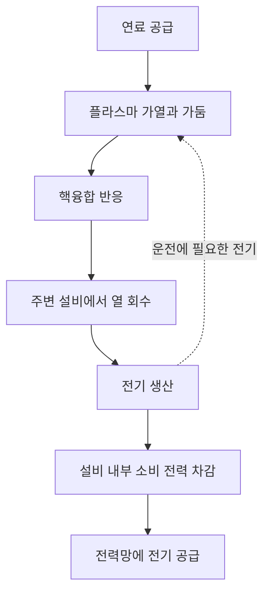
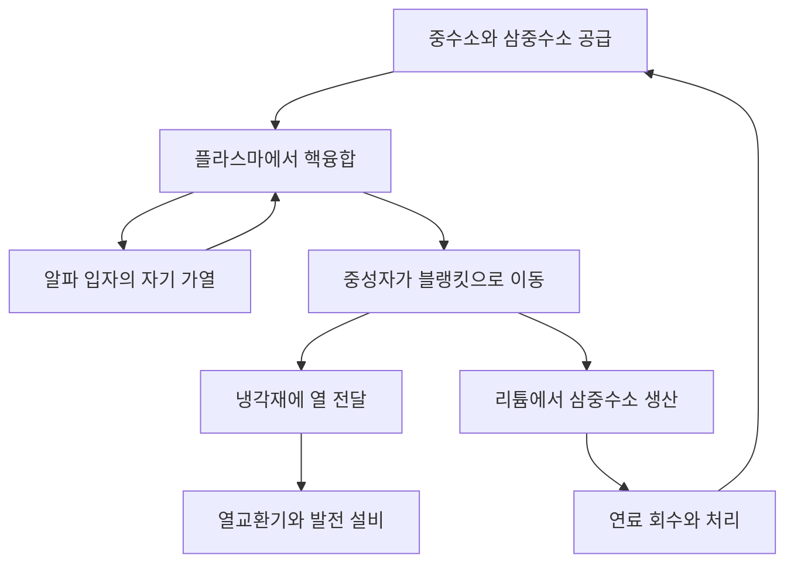

## 1. 핵융합 반응과 발전소 사이의 거리

태양과 별은 핵융합으로 에너지를 얻습니다. 지구에서 이를 활용하면 적은 연료로 큰 에너지를 얻을 수 있습니다. 하지만 핵융합 반응을 관측하는 일과 전력망에 전기를 공급하는 발전소를 운영하는 일은 다릅니다.

불을 피웠다고 화력발전소가 완성되는 것은 아닙니다. 열을 회수하는 설비, 발전기, 연료 공급, 제어와 정비가 필요합니다. 핵융합에는 여기에 매우 뜨거운 연료를 가두고, 반응에서 나오는 중성자로부터 구조물을 보호하는 과제가 더해집니다.

따라서 **반응을 일으키는 단계, 에너지 수지를 맞추는 단계, 발전소를 운영하는 단계**를 구분해야 합니다. 실험의 성공은 중요한 진전이지만 모든 요구 조건을 동시에 충족했다는 뜻은 아닙니다. 에너지원의 매력과 산업적 준비 정도는 별개입니다.

이 글에서는 대표적인 연료 조합인 중수소와 삼중수소를 중심으로 설명합니다. 여러 방식이 연구되고 있으므로, 특정 장치의 기록을 전체 기술의 완성도로 받아들이기보다 그 실험이 입증한 범위를 이해하는 것이 목적입니다. [미국 에너지부: 핵융합 에너지][doe-overview]

## 2. 핵분열과 핵융합이 모두 에너지를 내는 이유

핵분열은 무거운 원자핵을 나누고, 핵융합은 가벼운 원자핵을 합칩니다. 반대처럼 보이는 과정이 모두 에너지를 낼 수 있는 이유는 원자핵의 구성에 따라 에너지가 다르기 때문입니다.

양성자와 중성자를 통틀어 핵자라고 합니다. 핵자당 결합에너지는 대체로 가벼운 원자핵에서 중간 질량의 원자핵으로 갈수록 커지며 철과 니켈 부근에서 높은 값을 보입니다. 적절한 가벼운 원자핵이 합쳐져 더 낮은 에너지 상태가 되면 그 차이가 방출됩니다. 아무 원자핵이나 합친다고 에너지가 나오는 것은 아닙니다.

$$
E=\Delta m c^2
$$

$\Delta m$은 반응 전후 계의 정지질량 차이입니다. 연료의 질량 전체가 전기로 바뀌는 것이 아니라 반응 생성물이 남습니다. 에너지는 먼저 입자의 운동 등으로 나타나고, 이후 열이나 전기로 회수됩니다.

핵분열로에서는 중성자가 다음 핵분열을 일으키며 연쇄반응을 유지합니다. 핵융합에서는 반응할 원자핵들이 충분히 자주 가까워질 조건을 유지하는 것이 핵심입니다. 둘 다 원자핵 반응이라는 사실이 설비 구성이나 정지 특성까지 같다는 뜻은 아닙니다. [ITER: 핵융합의 기본 원리][fusion-basics]

## 3. 왜 중수소와 삼중수소를 사용할까?

보통 수소의 원자핵에는 양성자 하나가 있습니다. 중수소에는 양성자 하나와 중성자 하나, 삼중수소에는 양성자 하나와 중성자 둘이 있습니다. 같은 원소이면서 중성자 수가 다른 원자를 동위원소라고 합니다. 각각 D와 T로 나타내므로 반응을 D–T 반응이라고 부릅니다.

$$
{}^{2}_{1}\mathrm{H}+{}^{3}_{1}\mathrm{H}
\rightarrow{}^{4}_{2}\mathrm{He}+{}^{1}_{0}\mathrm{n}+17.6\,\mathrm{MeV}
$$

생성물은 헬륨-4 원자핵과 중성자입니다. 입사 입자의 에너지가 반응 에너지보다 충분히 작으면 헬륨 원자핵이 약 3.5 MeV, 중성자가 약 14.1 MeV를 가져가며 합계는 약 17.6 MeV입니다. 전하를 띤 헬륨 원자핵은 알파 입자라고도 합니다. [KIT: D–T 에너지 분배][dt-energy]

이 분배는 발전소 설계를 좌우합니다. 자기장에 갇힌 알파 입자는 플라스마를 가열합니다. 전하가 없는 중성자는 같은 방식으로 갇히지 않고 주변 구조물로 나갑니다. **핵융합 에너지의 상당 부분은 플라스마 바깥에서 회수됩니다.**

D–T는 다른 주요 후보 연료보다 비교적 낮은 온도에서 큰 반응률을 얻을 수 있어 널리 연구됩니다. 그렇다고 연료 공급까지 쉬운 것은 아닙니다. 삼중수소는 방사성이며 공급·회수·증식 체계가 필요합니다. 중수소끼리의 반응이나 양성자–붕소 반응을 같은 조건에서 바로 대체할 수는 없습니다. [ITER: 필요한 조건][making-work]

## 4. 왜 이렇게 높은 온도가 필요할까?

두 원자핵은 양전하를 띠므로 전기적으로 밀어냅니다. 핵력이 작용할 만큼 가까워지려면 입자의 운동에너지가 충분해야 합니다. 온도를 높이면 반응에 기여할 수 있는 충돌이 늘어납니다.

다만 모든 입자가 고전적으로 반발 장벽 전체를 넘어야 한다는 설명은 정확하지 않습니다. 입자 에너지는 분포를 이루며 양자 터널링도 반응 확률에 기여합니다. 온도는 반응을 켜고 끄는 단순한 스위치가 아니라 반응 빈도를 바꾸는 조건입니다. [CERN의 ITER 강의: 반응률과 터널링][fusion-lecture]

연구에서는 온도를 에너지 단위인 keV로 표현하기도 합니다. 볼츠만 상수 $k_B$와 온도의 곱 $k_B T$를 뜻합니다. 1 keV는 약 1,160만 K, 10 keV는 약 1억 1,600만 K에 해당합니다. 대중적인 설명의 1억 도와 논문의 10 keV 안팎은 비슷한 규모입니다.

태양 중심은 약 1,500만 도지만 지구의 D–T 연구에서는 1억 도 안팎 또는 그 이상을 다룹니다. 태양의 크기·중력·밀도·연료를 그대로 재현하는 것이 아니기 때문입니다. 태양은 주로 양성자에서 시작하는 반응 사슬을 이용합니다. 지구에서 가능한 가둠 조건에서는 다른 반응이 유리합니다. 인공태양이라는 말은 비유입니다. [ITER][fusion-basics], [미국 에너지부: 연소 플라스마][burning]

## 5. 플라스마는 뜨거운 고체가 아니다

온도가 충분히 높아지면 전자가 원자핵에서 떨어져 나와 양이온과 전자가 자유롭게 움직이는 플라스마가 됩니다. 전체적으로 거의 전기적 중성이어도 각각의 입자는 전하를 띠므로 전기장과 자기장에 반응합니다.

그렇다면 1억 도의 물질을 담은 용기가 왜 곧바로 녹지 않을까요? 자기 가둠 플라스마는 고체 금속과 밀도나 열전달 방식이 매우 다릅니다. 온도는 입자 운동의 에너지 규모이지 물체에 저장된 열의 총량이 아닙니다. 같은 부피라도 매우 뜨겁고 희박한 입자 집단과 조밀한 고체의 에너지는 다릅니다.

그렇다고 벽 문제가 사라지지는 않습니다. 입자·복사·중성자가 구조물에 에너지를 전달합니다. 자기장은 중심 플라스마의 직접 접촉을 줄이지만 완벽한 단열재가 아닙니다. 용기 자체가 불가능하다는 생각도, 벽이 자동으로 안전하다는 생각도 피해야 합니다. 가둠과 벽의 열부하 관리는 함께 해결해야 합니다.

## 6. 온도·밀도·에너지 가둠 시간

온도가 높아도 입자가 너무 적어 충돌하지 않으면 충분한 반응이 일어나지 않습니다. 밀도가 높아도 바로 식거나 흩어지면 소용없습니다. 그래서 온도 $T$, 밀도 $n$, 에너지 가둠 시간 $\tau_E$를 함께 봅니다.

간단히 표현하면 에너지 가둠 시간은 저장 에너지 $W$를 손실 전력 $P_{\mathrm{loss}}$로 나눈 값입니다.

$$
\tau_E=\frac{W}{P_{\mathrm{loss}}}
$$

100 MJ가 저장되고 50 MW가 빠져나가면 2초입니다. 그렇다고 플라스마가 반드시 2초 뒤 사라지는 것은 아닙니다. 새는 욕조에도 물을 계속 넣으면 수위를 유지하듯, 잃는 에너지를 보충하면 훨씬 긴 방전이 가능합니다. **방전 지속 시간과 에너지 가둠 시간은 다른 양입니다.**

로슨 기준은 핵융합 가열과 에너지 손실의 균형에서 필요한 밀도와 가둠을 평가합니다. 흔히 삼중곱 $nT\tau_E$를 사용합니다. 유리한 온도 부근에서 D–T 점화를 논할 때 규모는 수 $10^{21}$ keV·s·m$^{-3}$ 정도지만, 연료·온도·목표 이득·밀도 정의에 따라 조건이 달라집니다. 하나의 수치를 모든 방식의 합격선으로 쓸 수는 없습니다. [막스플랑크 플라스마물리학연구소][triple-product]

| 양 | 나타내는 것 | 이것만으로 알 수 없는 것 |
|---|---|---|
| 온도 | 입자 운동의 에너지 규모 | 충돌 빈도와 반응 지속성 |
| 밀도 | 단위 부피당 입자 수 | 충분한 온도와 낮은 손실 |
| 에너지 가둠 시간 | 저장 에너지와 손실 전력의 비 | 전체 방전 지속 시간 |
| 방전 지속 시간 | 운전 상태를 유지한 시간 | 핵융합 출력과 전력 수지 |

## 7. 반응률 식으로 보는 연료 혼합

매우 단순화한 균일한 D–T 플라스마에서 단위 부피·단위 시간당 반응 수는 다음과 같습니다.

$$
R=n_D n_T\langle\sigma v\rangle
$$

$n_D$와 $n_T$는 중수소와 삼중수소의 수밀도, $\sigma$는 반응 단면적, $v$는 상대속도입니다. 꺾쇠는 속도 분포에 대한 평균을 뜻합니다. 충돌 속도가 모두 같지 않으므로 반응률을 단순히 온도에 비례한다고 말할 수 없습니다.

전체 연료 밀도 $n=n_D+n_T$와 다른 조건을 고정하면 두 연료가 절반씩일 때 $n_Dn_T$가 최대입니다. 한쪽만 늘리면 짝이 부족해집니다. 두 집단에서 짝을 만들 때 한 집단만 커진다고 짝 수가 계속 늘지 않는 것과 같습니다.

밀도를 두 배로 하면 식에서는 반응률이 네 배가 되지만, 온도 등 다른 조건이 그대로일 때만 성립합니다. 실제로는 압력·복사 손실·안정성도 달라집니다. 한 항만 보고 밀도를 높이면 모든 문제가 해결된다고 결론 내릴 수 없습니다. [핵융합 이득과 로슨 기준 연구][lawson-paper]

## 8. 자기장은 어떻게 플라스마를 가둘까?

전하를 띤 입자가 받는 로런츠 힘은 다음과 같습니다.

$$
\mathbf{F}=q\left(\mathbf{E}+\mathbf{v}\times\mathbf{B}\right)
$$

자기력은 입자의 경로를 굽혀 자기력선 주위를 회전하게 하면서 그 방향을 따라 움직이게 합니다. 정적인 자기장의 힘은 속도에 수직이므로 직접 일을 하여 입자를 가열하지 않습니다. 가둠용 자기장과 가열 장치는 역할이 다릅니다.

직선 자기장에서는 입자가 끝으로 빠져나가기 쉽습니다. 경로를 고리로 닫으면 끝은 없어지지만 곡률과 자기장 세기의 차이로 표류가 생깁니다. 자기력선을 꼬아 입자 운동과 압력 균형을 유지하기 좋은 구성을 만듭니다.

자석으로 붙잡는다는 표현에는 회전 운동, 자기장 형상, 전류, 압력, 불안정성이 얽혀 있습니다. 자기장만 강하게 하면 어떤 플라스마든 오래 가둘 수 있는 것은 아닙니다. [프린스턴 플라스마물리연구소][magnetic]

## 9. 토카막과 스텔러레이터

토카막은 외부 코일의 자기장과 플라스마 자체에 흐르는 전류의 자기장을 결합하는 도넛 모양 장치입니다. 플라스마 전류는 가둠을 돕지만, 전류 유지와 급격한 변화에 대한 보호가 필요합니다.

변압기처럼 전류를 유도하는 방식에는 연속 운전의 제약이 있습니다. 그래서 파동이나 입자빔으로 비유도 전류를 구동하는 방법도 연구합니다. 토카막은 언제나 짧게만 운전해야 한다는 설명도, 전류가 저절로 무한히 지속된다는 설명도 부정확합니다.

스텔러레이터는 주로 입체적인 외부 코일로 자기력선의 꼬임을 만듭니다. 큰 플라스마 전류에 대한 의존을 줄여 정상상태 운전에 장점이 있지만, 복잡한 코일의 설계·제작·배치와 입자 손실 관리가 중요해집니다. [막스플랑크 연구소: 스텔러레이터][stellarator]

| 관점 | 토카막 | 스텔러레이터 |
|---|---|---|
| 자기력선의 꼬임 | 외부 코일과 플라스마 전류 | 주로 입체적인 외부 코일 |
| 장시간 운전 과제 | 전류 유지, 안정성, 열 배출 | 자기장 최적화, 제작, 열 배출 |
| 형상 | 대체로 축대칭 | 복잡한 3차원 구조 |
| 공통 발전 과제 | 연료, 재료, 열 회수, 정비, 전력 수지 | 연료, 재료, 열 회수, 정비, 전력 수지 |

어느 한 방식만 성공할 수 있다는 단순한 법칙은 없습니다. 플라스마 성능뿐 아니라 만들고 고치며 오랫동안 안정적으로 운전할 수 있는지도 비교해야 합니다.

## 10. 외부 가열에서 자기 가열로

토카막은 전류의 저항 가열을 이용할 수 있습니다. 다만 온도가 올라가면 저항이 낮아져 이 방법만으로 계속 온도를 높이는 데 한계가 생깁니다. 추가 에너지를 외부에서 공급해야 합니다.

중성입자빔은 전하 없는 고에너지 입자를 넣는 방식입니다. 가둠 자기장에 쉽게 휘지 않고 들어온 뒤 이온화와 충돌로 에너지를 전달합니다. 고주파나 마이크로파의 상호작용을 이용하는 방식도 있습니다. 어느 장치도 소비 전기를 전부 플라스마 열로 바꾸지는 못합니다. [ITER: 외부 가열 장치][heating]

D–T 반응이 늘면 알파 입자의 자기 가열도 커집니다. 이 가열이 지배적인 상태를 연소 플라스마라고 합니다. 여기서 연소는 산소와의 화학 반응을 뜻하지 않습니다.

자기 가둠에서 점화는 이상적으로 핵융합 생성물의 가열이 외부 가열 없이 손실을 보충하는 상태입니다. 그래도 펌프·냉동기·제어 장치는 전기가 필요합니다. 플라스마의 열적 자립과 발전소 전체의 전기적 자립은 서로 다른 경계에서 평가합니다. [미국 에너지부: 연소 플라스마][burning]

## 11. 레이저 핵융합은 짧은 시간을 이용한다

자기 가둠은 비교적 희박한 고온 플라스마를 오래 유지하려는 방식입니다. 관성 가둠은 적은 연료를 높은 밀도로 압축하여 팽창하기 전 짧은 시간에 반응시키는 방식입니다. 레이저는 압축 에너지를 공급하는 수단 중 하나입니다.

미국 국립점화시설 NIF는 작은 연료 표적의 레이저 압축과 가열을 연구합니다. 발전소에서는 표적을 반복적으로 제작·공급·조사하고, 생성물을 제거하며 다음 반응까지 열을 관리해야 합니다. 한 번의 짧은 실험과 이 과정을 안정적으로 반복하는 것은 다릅니다.

2022년 12월 5일 NIF 실험에서는 표적에 전달한 레이저 에너지 2.05 MJ로 핵융합 에너지 3.15 MJ를 얻었습니다. 이는 표적 이득이 1을 넘은 역사적 결과지만, 레이저 시설 전체의 소비 전기를 포함한 전력 수지가 양수라는 뜻은 아닙니다. [로런스 리버모어 국립연구소: 점화 실험][nif]

가상의 계산으로 한 번에 100 MJ씩 초당 5회 반응하면 평균 핵융합 출력은 500 MW입니다. 그러나 이 곱셈이 반복 속도·표적 비용·레이저 효율·장치 수명을 함께 달성했다는 증거는 아닙니다. 순간 최대 출력, 펄스당 에너지, 시간 평균 출력을 구분해야 합니다.

## 12. 입력의 열 배라는 말에서 입력은 어디일까?

자기 가둠의 플라스마 이득 $Q$는 보통 핵융합 출력과 플라스마에 실제로 전달된 외부 가열 출력의 비입니다.

$$
Q=\frac{P_{\mathrm{fusion}}}{P_{\mathrm{heat}}}
$$

ITER는 외부 가열 50 MW로 핵융합 출력 500 MW, 즉 $Q=10$을 목표로 합니다. 이는 연구 장치의 목표이며 이미 달성한 상업 발전 기록이 아닙니다. ITER는 그 열을 판매용 전기로 바꾸도록 설계된 발전소도 아닙니다. [ITER: 목표][iter-goals]

$Q=10$이 소비 전기의 열 배를 생산한다는 뜻은 아닙니다. 전기에서 플라스마 가열까지 손실이 있고, 회수한 열을 전기로 바꾸는 과정에도 손실이 있습니다. 냉동·진공 펌프·냉각·연료 처리도 전기를 사용합니다.

교육용 모형으로 핵융합 출력 1,000 MW와 $Q=10$을 가정하면 외부 가열은 100 MW입니다. 전기에서 플라스마 열로 가는 효율이 50%라면 가열 장치는 전기 200 MW를 씁니다. 핵융합 출력만 40% 효율로 발전하면 400 MW입니다. 가열 전력 200 MW와 기타 내부 소비 100 MW를 빼면 외부 공급은 100 MW입니다.

$$
P_{\mathrm{net}}\approx\eta_e P_{\mathrm{fusion}}
-\frac{P_{\mathrm{fusion}}}{Q\eta_h}-P_{\mathrm{aux}}
$$

이 식은 외부 가열 에너지의 열 회수와 블랭킷 반응의 추가 에너지를 생략합니다. 실제 발전소를 예측하기보다 계산 경계를 설명하는 모형입니다. 같은 조건에서 $Q=5$라면 가열 전력이 400 MW로 늘어 순출력은 마이너스 100 MW입니다. **플라스마 이득과 전력망에 보낼 전기는 다릅니다.**

| 지표 | 입력을 세는 경계 | 알려 주는 것 |
|---|---|---|
| 플라스마 이득 | 플라스마에 전달한 가열 출력 | 핵융합 출력과의 비 |
| 표적 이득 | 표적에 전달한 에너지 | 한 번의 핵융합 에너지와의 비 |
| 순전력 | 발전소 전체의 전기 소비 | 외부로 전기를 공급할 수 있는지 |
| 경제성 | 건설, 운전, 연료, 정비 비용 | 사업으로 전기를 공급할 수 있는지 |

## 13. 블랭킷은 열과 연료를 함께 다룬다

전하 없는 D–T 중성자는 가둠 자기장을 통과합니다. 주변 물질과 상호작용하며 운동에너지를 열로 전달합니다. 발전용 원자로에서는 플라스마를 둘러싼 블랭킷이 이를 회수하는 주요 설비입니다.

블랭킷은 단순한 단열재가 아닙니다. 열 회수, 자석 등의 차폐, 삼중수소 생산을 함께 수행하도록 설계합니다. 중성자가 리튬을 포함한 물질과 반응해 삼중수소를 만들면 이를 추출해 연료 계통으로 돌려보냅니다.

이 기능들은 공간을 놓고 경쟁합니다. 차폐를 두껍게 하면 자석은 잘 보호되지만 크기와 질량이 증가합니다. 가열·진단용 구멍을 동시에 증식재로 채울 수는 없습니다. 중성자를 잘 활용하는 형상과 열을 잘 빼내는 형상이 항상 같지는 않습니다.

ITER는 실제 핵융합 환경에서 증식 블랭킷 시험 모듈을 평가할 계획입니다. 시험 모듈이 있다는 사실과 발전소 전체의 연료 자급이 입증되었다는 것은 다릅니다. [ITER: 삼중수소 증식][breeding]

## 14. 바닷물 연료라는 설명에 빠진 것

중수소는 물에서 얻을 수 있지만 D–T 반응에는 삼중수소도 필요합니다. 삼중수소의 반감기는 약 12.3년이며 자연에 대규모 연료 재고가 쌓여 있지 않습니다. 장기 운전에는 증식과 회수 체계가 필요합니다. [ITER: 용어집][glossary]

삼중수소 증식비는 만들어진 양과 반응으로 소비한 양의 비입니다. 1 이상이면 충분해 보이지만 회수 지연, 장치와 재료에 남는 양, 손실, 방사성 붕괴, 새 시설의 초기 연료까지 고려해야 합니다.

쓴 연료가 나중에 정확히 같은 양으로 돌아오더라도 기다리는 동안 운전할 재고가 필요합니다. 연간 생산량과 소비량이 같다고 매 순간 연료가 충분한 것은 아닙니다. 이는 총량뿐 아니라 시간에 따른 수지 문제입니다.

넣은 연료가 한 번에 모두 반응하지도 않습니다. 미반응 연료·헬륨·불순물을 배출하고 분리해 쓸 수 있는 연료를 재순환해야 합니다. 반응 소비량, 처리 유량, 시설 전체 재고는 다른 양입니다. 소비량이 작다고 처리 설비까지 작고 단순하지는 않습니다.

자원이 풍부하다는 장점이 준비·공급·회수 기술을 대신하지는 않습니다. [IAEA: D–T 연료 주기의 물리와 기술][fuel-cycle]

## 15. 열을 가두면서 열을 빼내기

플라스마 중심은 뜨겁게 유지해야 하지만 발전소는 빠져나온 에너지를 안정적으로 회수하고 벽 온도를 제한해야 합니다. 두 요구를 함께 만족해야 합니다.

가장자리에서는 헬륨 재, 불순물, 열을 배출합니다. 토카막의 디버터가 그 일부를 담당합니다. 출구에 흐름이 모이듯 작은 면적에 열이 집중될 수 있습니다. 플라스마가 오래 유지되어도 부품이 빨리 손상되면 충분하지 않습니다.

열유속은 단위 면적당 열출력입니다. ITER 디버터는 정상 열부하 약 10 MW/m$^2$ 규모를 고려합니다. 한 변 10 cm인 정사각형에 해당하는 출력은 100 kW입니다. 작은 표면에서도 상당한 냉각이 필요합니다. [ITER: 디버터][divertor]

텅스텐의 녹는점이 높다는 사실만으로 해결되지는 않습니다. 열은 구조물과 접합부를 거쳐 냉각재로 이동해야 합니다. 반복 열부하, 침식, 플라스마 오염도 중요합니다. 벽에서 나온 불순물이 복사 손실을 늘릴 수 있어 재료와 플라스마가 서로 영향을 줍니다.

온도 기록과 감당할 수 있는 부품 교체 주기는 다른 능력을 측정합니다. 하나의 최고 기록만으로 상용화까지의 거리를 판단할 수 없는 이유입니다.

## 16. 중성자는 재료도 바꾼다

고에너지 중성자는 구조재 원자를 원래 위치에서 밀어냅니다. 핵반응으로 다른 원소나 기체가 생길 수도 있습니다. 취화, 팽윤, 열전도도 변화로 이어질 수 있습니다.

재료를 뜨거운 노에 넣는 시험만으로 이 환경을 재현할 수는 없습니다. 열·기계적 하중·중성자 조사·냉각재와의 화학 반응이 함께 작용합니다. 실험과 모형은 충분한 검증 자료를 바탕으로 수명을 예측해야 합니다. [IAEA: 조사 손상][materials]

중성자는 재료를 방사화하기도 합니다. 따라서 핵융합에 방사성 폐기물이 전혀 없다는 주장은 부정확합니다. 동위원소 종류, 양, 관리 기간은 재료·조사량·운전 이력·처분 경로에 따라 달라집니다. 저방사화 재료는 성능과 향후 관리 부담을 함께 개선하려는 접근입니다.

정비에는 원격 취급이 필요합니다. 큰 부품을 꺼내고 새 부품을 정확히 연결하며 사람이 접근하기 어려운 곳에서 작업을 검사해야 합니다. 조립 가능하다고 빠르게 수리할 수 있는 것은 아닙니다. 고장과 교체로 멈추는 시간은 생산량과 비용에 영향을 줍니다.

핵분열과 정지 특성이 다르다고 모든 위험이 사라지지는 않습니다. 삼중수소, 방사화 재료, 저장 자기 에너지, 고온·고압 유체를 각각의 특성에 맞게 관리해야 합니다. [ITER: 안전과 환경][safety]

## 17. 초전도 자석도 전기를 쓰는 설비의 일부다

강한 자기장에는 큰 전류가 필요합니다. 적절한 조건의 초전도체는 직류 저항을 크게 줄여 자기장을 효율적으로 유지하도록 돕습니다. 발전소 전체의 소비 전력을 0으로 만들지는 않습니다.

ITER 자석은 약 4 K에서 운전하도록 설계되었습니다. 매우 차가운 자석이 뜨거운 플라스마 가까이에 있어 진공 단열, 열 차폐, 냉동 설비, 극저온 배관이 필수입니다. 재료의 특성을 활용하려면 큰 지원 체계가 필요합니다. [ITER: 극저온 설비][cryogenics]

고온 초전도체는 실온에서 작동한다는 뜻이 아닙니다. 기존 재료보다 높은 온도에서 초전도성을 유지한다는 뜻이며 강한 자기장과 큰 전류에서는 여전히 냉각과 보호가 필요합니다. 자석의 큰 힘과 저장 에너지도 이상 상황에서 관리해야 합니다.

진공 펌프, 연료 처리, 냉각, 컴퓨터, 제어 장치도 전기를 씁니다. 빛나는 플라스마 사진에 잘 드러나지 않는 설비가 지속 운전을 가능하게 합니다. 플라스마만 둘러싼 에너지 수지는 이 부담을 숨깁니다. [ITER: 자석][magnets], [전원 설비][power-supply]

## 18. 직접 닿을 수 없는 플라스마를 측정하기

온도·밀도·자기장·복사·반응 생성물을 측정하려면 다양한 진단법이 필요합니다. 중심에 온도계를 꽂을 수는 없습니다. 빛, 전자기파, 입자, 자기 신호로 내부 상태를 간접 추정합니다.

한 측정이 전체를 나타내는 것도 아닙니다. 중심과 가장자리의 상태는 다르고 시간에 따라 변합니다. 시선 방향으로 적분된 신호에서 공간 분포를 복원하려면 가정이나 다른 측정이 필요합니다. 계측 불확실성과 모형의 가정을 구분해야 합니다. [ITER: 진단 장치][diagnostics]

시뮬레이션은 난류·입자 수송·자기장 형상·재료 반응 연구에 필수적입니다. 그러나 컴퓨터에서 반응을 그렸다고 장치가 준비된 것은 아닙니다. 모형이 검증된 조건과 아직 검증되지 않은 조건을 밝히고 실험과 비교해야 합니다.

기계학습을 제어에 쓸 때도 같습니다. 과거 자료를 잘 예측한다고 새로운 운전 영역이나 센서 고장에서 성능이 보장되지는 않습니다. 계산 방법의 개선이 연료·재료·열 배출 문제를 없애지는 않습니다. 핵융합은 계측·물리·공학을 통합하는 시스템입니다.

## 19. 별의 수수께끼에서 지상의 실험으로

20세기 초에는 태양이 그렇게 오래 빛나는 이유가 큰 문제였습니다. 화학 연소로는 설명할 수 없었습니다. 1920년 에딩턴은 수소가 헬륨으로 바뀌며 별에 에너지를 공급할 수 있다고 제안했습니다. 이후 원자핵 연구와 별 내부 이론이 연결되었습니다.

1934년 올리펀트·하르테크·러더퍼드의 중수소 실험은 가벼운 원자핵 반응 연구를 넓혔습니다. 베테 등의 별 에너지 연구도 핵반응과 우주에 대한 이해를 연결했습니다. [ITER: 초기 역사][history-early]

1950년대에는 지상에서 제어된 핵융합을 에너지원으로 활용하려는 연구가 진행되었습니다. 초기에는 비밀 연구도 있었지만 1958년 제네바 국제회의가 공개와 협력의 전환점이 되었습니다. 플라스마 불안정성과 손실은 단순한 예상보다 어려웠습니다. [IAEA: 국제 협력의 역사][history-cooperation]

자기장 형상, 가열, 진공, 초전도, 진단, 계산의 발전이 오늘날의 대형 실험으로 이어졌습니다. ITER는 연소 플라스마와 관련 기술을 통합하고, NIF 점화는 관성 가둠에서 중요한 결과입니다. 방식과 에너지 계산 경계가 달라 직접 교환할 수 있는 점수가 아닙니다.

| 단계 | 다룬 질문 | 다음 과제 |
|---|---|---|
| 별의 에너지원 | 태양은 왜 오래 빛나는가? | 핵반응의 정량적 이해 |
| 실험실 반응 | 가벼운 핵의 반응을 관측할 수 있는가? | 거시적 에너지원으로 확대 |
| 제어 핵융합 | 고온 연료를 유지할 수 있는가? | 손실과 불안정성 억제 |
| 높은 이득 | 핵융합 가열이 우세해질 수 있는가? | 연료, 재료, 반복, 장시간 운전 |
| 발전소 실증 | 순전력을 지속 공급할 수 있는가? | 신뢰성, 정비, 비용, 사회적 조건 |

연구가 오래 걸린 이유를 핵융합 반응 자체를 만들 수 없어서라고 설명하면 틀립니다. 반응은 일어납니다. 필요한 규모·시간·연료 공급·재료 성능·비용을 함께 만족시키기 어렵습니다.

## 20. 상용화 소식을 읽는 여섯 가지 기준

진전을 과소평가할 필요는 없습니다. 다만 발표된 기록을 다른 성과로 바꾸어 해석하지 않아야 합니다.

1. **무엇을 측정했는가?** 온도, 지속 시간, 반응 에너지, 이득, 순전력은 다른 지표입니다.
2. **입력을 어디서 셌는가?** 플라스마 가열, 표적에 도달한 레이저, 시설 전체 전기를 구분합니다.
3. **어떤 연료와 조건인가?** 수소·중수소 플라스마 제어와 큰 D–T 출력 생산은 목적이 다릅니다.
4. **한 번의 성공인가, 반복 운전인가?** 최고치뿐 아니라 안정성, 정지 시간, 부품 수명을 봅니다.
5. **연료와 부품을 공급할 수 있는가?** 증식·회수·제작·교체·폐기물 관리까지 포함합니다.
6. **계획인가, 입증된 결과인가?** 일정과 비용의 근거 및 가정을 확인합니다.

연간 판매할 전력량도 중요합니다. 순출력 500 MW인 발전소는 평년 기준 이용률 50%에서 약 2.19 TWh, 80%에서 약 3.50 TWh를 공급합니다. 같은 정격 출력에서도 운전과 정비가 생산량에 미치는 영향을 보이는 예이며, 핵융합 이용률 예측은 아닙니다.

장치를 작게 만든다고 모든 비용이 줄지는 않습니다. 제작비는 줄어도 작은 면적에 열이 집중되고 교체 작업이 어려워질 수 있습니다. 큰 장치는 가둠에 유리할 수 있지만 건설 부담을 늘립니다. 크기·물리·정비성·비용을 함께 설계해야 합니다.

핵융합의 매력은 가벼운 원자핵에서 큰 에너지를 얻을 가능성입니다. 실현에는 **열을 만들고 회수하며, 연료를 순환시키고 부품을 교체하면서, 설비가 쓰는 것보다 많은 전기를 장기간 공급하는 전체 과정**이 필요합니다. 이 연결을 보면 성과와 남은 과제를 더 정확히 이해할 수 있습니다.

## 출처와 그림의 범위

반응 에너지와 역사적 결과는 아래 연구기관 자료를 따릅니다. 예제의 효율·내부 소비·반복률·이용률은 교육용 가정이며 특정 발전소의 예측이 아닙니다. AI로 생성한 표지 이미지는 개념도이며 코일·배관·색상은 공학 설계도가 아닙니다.

- [미국 에너지부: 핵융합][doe-overview], [연소 플라스마][burning]
- [ITER: 원리][fusion-basics], [조건][making-work], [목표][iter-goals], [용어집][glossary]
- [ITER: 가열][heating], [증식][breeding], [디버터][divertor], [진단][diagnostics], [자석][magnets], [극저온][cryogenics], [전원][power-supply], [안전][safety]
- [막스플랑크: 삼중곱][triple-product], [스텔러레이터][stellarator], [프린스턴: 자기 가둠][magnetic]
- [로슨 기준 연구][lawson-paper], [LLNL: 2022년 점화][nif]
- [IAEA: 연료 주기][fuel-cycle], [재료][materials], [역사][history-cooperation], [ITER: 초기 연구][history-early]
- [KIT: D–T 에너지][dt-energy], [CERN의 ITER 강의][fusion-lecture]

[doe-overview]: https://www.energy.gov/topics/fusion-energy
[fusion-basics]: https://www.iter.org/fusion-energy/what-fusion
[making-work]: https://www.iter.org/fusion-energy/making-it-work
[burning]: https://www.energy.gov/science/doe-explainsburning-plasma
[triple-product]: https://www.ipp.mpg.de/83115/fusionsprodukt
[lawson-paper]: https://arxiv.org/abs/2105.10954
[magnetic]: https://w3.pppl.gov/scied/docs/undergrad_level_general_Plasma_Fusion_PPPL/Plasma_fusion_pppl.pdf
[stellarator]: https://www.ipp.mpg.de/9792/stellarator
[heating]: https://www.iter.org/machine/supporting-systems/external-heating-systems
[nif]: https://www.llnl.gov/article/50801/llnls-breakthrough-ignition-experiment-highlighted-physical-review-letters
[iter-goals]: https://www.iter.org/fusion-energy/what-will-iter-do
[breeding]: https://www.iter.org/machine/supporting-systems/tritium-breeding
[glossary]: https://www.iter.org/fusion-glossary
[fuel-cycle]: https://www-pub.iaea.org/MTCD/publications/PDF/TE-2076web.pdf
[divertor]: https://www.iter.org/machine/divertor
[materials]: https://nucleus-qa.iaea.org/sites/fusionportal/Pages/DPWS-6/Topics.aspx
[safety]: https://www.iter.org/faqs?thematic=75
[cryogenics]: https://www.iter.org/machine/supporting-systems/cryogenics
[magnets]: https://www.iter.org/machine/magnets
[power-supply]: https://www.iter.org/machine/supporting-systems/power-supply
[diagnostics]: https://www.iter.org/machine/supporting-systems/diagnostics
[history-early]: https://www.iter.org/node/20687/who-invented-fusion
[history-cooperation]: https://nucleus.iaea.org/sites/fusion-portal/SitePages/A-brief-history-of-nuclear-fusion.aspx?web=1
[dt-energy]: https://publikationen.bibliothek.kit.edu/1000161936/151265654
[fusion-lecture]: https://indico.cern.ch/event/116345/attachments/53370/76726/Campbell_ITER26Fusion-1_CERN_Apr11.pdf
