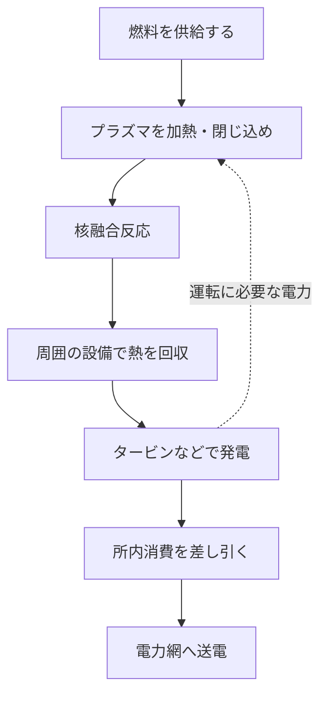
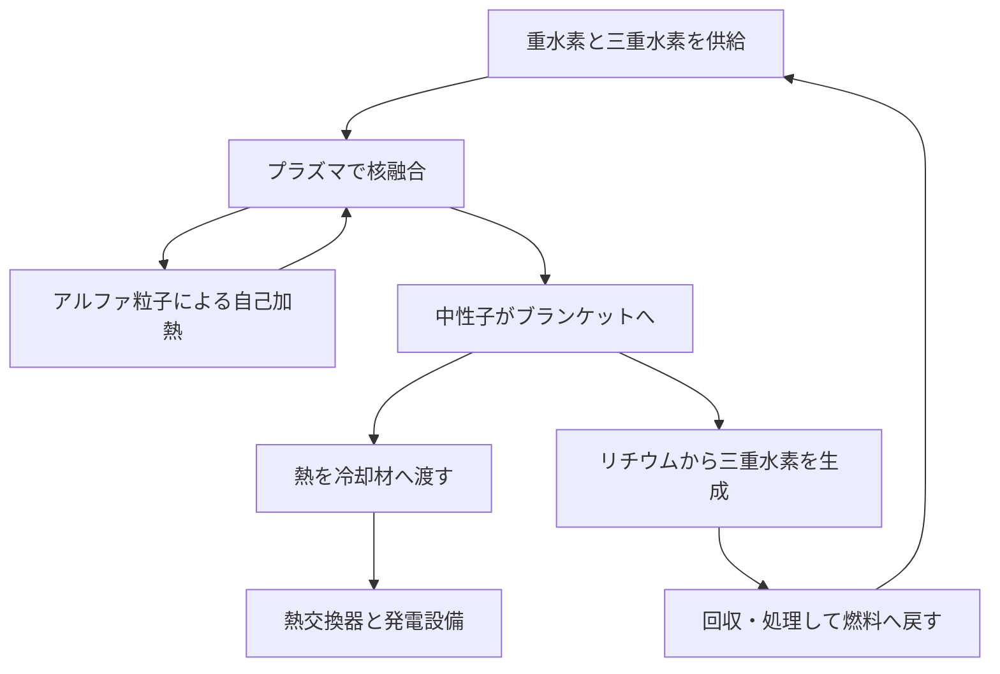

## 1. 「核融合が起きた」と「発電できた」の間にあるもの

核融合は太陽や星を輝かせている反応です。それを地上で利用できれば、少量の燃料から大きなエネルギーを取り出せます。しかし、核融合反応を観測することと、電力会社の設備として電気を届けることは同じではありません。

この違いは、火を起こすことと、火力発電所を運転することの違いに少し似ています。熱源だけでなく、熱を受け取る装置、発電機、燃料供給、制御、保守が必要です。核融合ではさらに、非常に高温の燃料をどう保持するか、反応で生まれる中性子から材料をどう守るかという問題が加わります。

現在の研究を理解するうえで大切なのは、「夢のエネルギー」という印象だけで判断せず、**反応の成立、エネルギー収支、発電所としての運転**を分けて考えることです。ある実験の成功は重要な一歩であっても、ほかの条件がすべて満たされたという意味ではありません。

本記事では、実用化研究の中心的な燃料の一つである重水素と三重水素の組合せを軸に説明します。方式は多数ありますが、一つの装置の記録を核融合全体の完成度と混同しないための見取り図を作りましょう。[米国エネルギー省：核融合エネルギー][doe-overview]

## 2. 核分裂と核融合は、何が違うのか

核分裂は重い原子核が分かれる反応、核融合は軽い原子核が結び付く反応です。逆向きに見える二つの反応が、どちらもエネルギーを放出できるのは、原子核の結び付き方によってエネルギーが違うためです。

原子核を構成する陽子と中性子をまとめて核子と呼びます。核子一個あたりの結合エネルギーは、軽い核から中程度の核へ向かうと概して大きくなり、鉄やニッケル付近で大きな値になります。適切な軽い核を融合させると、反応後はより低いエネルギーの状態へ移り、その差が外へ出ます。あらゆる原子核を何でも融合させればエネルギーが得られるわけではありません。

$$
E=\Delta m c^2
$$

ここで使うのは、反応前後の静止質量の差 $\Delta m$ です。燃料の全質量を電気に変えるという意味ではなく、生成物は残ります。エネルギーはまず生成粒子の運動などとして現れ、そこから熱や電気として取り出します。

核分裂炉では中性子が次の分裂を引き起こす連鎖反応が重要でした。核融合では、反応する核同士が十分な頻度で近付ける状態を保つことが重要です。燃料名に「核」が付くという共通点だけで、停止の仕組みや機器構成まで同じだと考えてはいけません。[ITER：核融合とは][fusion-basics]

## 3. 重水素と三重水素を使う理由

普通の水素の原子核は陽子一個です。重水素は陽子一個と中性子一個、三重水素は陽子一個と中性子二個を持ちます。同じ元素で中性子数が違うものを同位体と呼びます。重水素を D、三重水素を T と書くため、この組合せは D–T 反応と呼ばれます。

$$
{}^{2}_{1}\mathrm{H}+{}^{3}_{1}\mathrm{H}
\rightarrow{}^{4}_{2}\mathrm{He}+{}^{1}_{0}\mathrm{n}+17.6\,\mathrm{MeV}
$$

生成物はヘリウム4の原子核と中性子です。入射粒子のエネルギーが反応エネルギーに比べて小さい場合、約3.5 MeVをヘリウム原子核、約14.1 MeVを中性子が持ちます。合計は約17.6 MeVです。電荷を持つヘリウム原子核をアルファ粒子とも呼びます。[カールスルーエ工科大学：D–T反応のエネルギー配分][dt-energy]

このエネルギーの分かれ方は発電所の設計を左右します。磁場で閉じ込められたアルファ粒子はプラズマの加熱に寄与します。一方、電荷のない中性子は同じようには閉じ込められず、周囲の構造へ飛び出します。**核融合のエネルギーの大部分を受け取る場所は、プラズマの外側にもある**のです。

D–Tがよく研究される理由は、ほかの有力候補より比較的低い温度領域で大きな反応率を得やすいことです。ただし、反応しやすさと燃料供給の容易さは別です。三重水素は放射性であり、調達や回収、増殖の仕組みを必要とします。重水素同士の反応や陽子とホウ素の反応なども研究されていますが、同じ条件でD–Tをそのまま置き換えられる燃料ではありません。[ITER：実現に必要な条件とエネルギー回収][making-work]

## 4. なぜ、非常に高い温度が必要なのか

二つの原子核はいずれも正の電荷を持つため、近付こうとすると電気的に反発します。核融合には、核力が働くほど短い距離まで近付く必要があります。温度を高くすると粒子の運動が激しくなり、反応に寄与できる衝突が増えます。

ただし、「全粒子が反発の壁を古典的に乗り越える温度まで加熱する」という説明も正確ではありません。粒子のエネルギーには分布があり、量子力学的なトンネル効果も反応確率に関わります。温度は反応が始まる単純なオン・オフスイッチではなく、どれほどの頻度で反応するかを左右する量です。[CERNでのITER講義：反応率とトンネル効果][fusion-lecture]

核融合研究では温度を keVというエネルギー単位で表すことがあります。これは $k_B T$ の値を表したものです。$k_B$ はボルツマン定数で、1 keVは約1,160万Kに相当します。10 keVなら約1億1,600万Kです。研究紹介にある「1億度」と論文の「十数keV」は、まったく別の話ではありません。

太陽中心はおよそ1,500万度ですが、地上の磁場閉じ込めではD–Tプラズマを1億度程度以上にする話が出てきます。これは太陽の寸法や重力、密度、燃料、反応経路を地上で再現しているわけではないためです。太陽は主に陽子から始まる反応の連鎖でエネルギーを作ります。地上では利用できる閉じ込めと反応率の条件から別の組合せを選びます。「人工の太陽」は親しみやすい比喩ですが、太陽を小さく切り取った装置ではありません。[ITER：核融合の基礎][fusion-basics]、[米国エネルギー省：燃焼プラズマ][burning]

## 5. プラズマは、高温の固体ではない

十分に高温になると、電子が原子核から離れて、正のイオンと電子が動き回る状態になります。これがプラズマです。全体としてほぼ電気的に中性でも、個々の粒子は電荷を持つため、電場や磁場に反応します。

「1億度の物質を入れる容器は溶けないのか」という疑問は自然です。重要なのは、磁場閉じ込めの高温プラズマは固体の金属とは密度も熱の伝わり方も違うことです。温度は粒子一個あたりの運動の激しさを表し、物体全体の熱量そのものではありません。非常に高温でも粒子数が少なければ、同体積の高密度物質とは蓄えられるエネルギーが異なります。

だからといって壁の問題がなくなるわけではありません。粒子や放射、反応中性子によってエネルギーは壁へ運ばれます。磁場は高温の中心部を材料へ直接押し付けずに保つための方法ですが、完全な断熱箱を作るわけではありません。

この区別は「高温なのに容器がある」という疑問と、「それなら壁は安全」という誤解の両方を解きます。高温プラズマの維持と壁への熱負荷の管理は、同時に成立させる必要がある別の課題です。

## 6. 温度・密度・閉じ込め時間を同時に考える

温度だけを上げても、粒子がほとんど衝突しなければ十分な核融合出力は得られません。逆に密度が高くても、すぐ冷えたり飛び散ったりすれば反応は続きません。このため温度 $T$、粒子密度 $n$、エネルギー閉じ込め時間 $\tau_E$ を組み合わせて評価します。

エネルギー閉じ込め時間は、簡単にはプラズマの蓄積エネルギー $W$ を損失パワー $P_{\mathrm{loss}}$ で割った量です。

$$
\tau_E=\frac{W}{P_{\mathrm{loss}}}
$$

例えば蓄積エネルギー100 MJ、損失50 MWなら2秒です。この「2秒」はプラズマが必ず2秒で消えるという意味ではありません。浴槽から水が漏れていても同じだけ給水すれば水位を保てるように、損失を補えば放電そのものはもっと長く続けられます。**放電継続時間とエネルギー閉じ込め時間は違います。**

ローソン条件は、反応による加熱と損失の収支から、必要な密度や閉じ込めを評価する考え方です。よく使われる指標は三重積 $nT\tau_E$ です。最適に近い温度域のD–T点火条件では、目安として $10^{21}$ keV・s・m$^{-3}$台の大きさが現れますが、燃料、温度、利得の目標、密度の定義によって条件は変わります。一つの数値をすべての方式に共通する合格点にしてはいけません。[マックス・プランク・プラズマ物理研究所：核融合三重積][triple-product]

| 量 | 何を表すか | それだけでは分からないこと |
|---|---|---|
| 温度 | 粒子の運動エネルギーの尺度 | 衝突回数、反応の継続性 |
| 密度 | 単位体積の粒子数 | 十分に熱いか、損失が小さいか |
| エネルギー閉じ込め時間 | 蓄積エネルギーと損失の比 | 放電全体が続く時間 |
| 放電継続時間 | 運転状態を続けた長さ | 核融合出力や電力収支 |

## 7. 反応率の式が教える、燃料混合の意味

均一なD–Tプラズマを非常に単純化すると、単位体積・単位時間あたりの反応数は次のように表せます。

$$
R=n_D n_T\langle\sigma v\rangle
$$

$n_D$ と $n_T$ は重水素と三重水素の数密度、$\sigma$ は反応の起こりやすさを表す断面積、$v$ は相対速度です。山括弧は粒子の速度分布で平均することを表します。実際の衝突は一つの速さにそろっていないため、単に「温度に比例」とは書けません。

全燃料イオン密度を $n=n_D+n_T$ と固定し、ほかの条件も同じと仮定します。このとき積 $n_Dn_T$ は両者が半分ずつのとき最大です。片方ばかり増やしても、組になる相手が不足します。二人組を作る催しで、一方の参加者だけが多くても組数が増えないことに似ています。

この式から密度を2倍にすると反応数が4倍になると読み取れますが、それは温度や閉じ込めが変わらない場合です。現実には密度を上げると圧力、放射損失、安定性なども変わります。式の一部分だけを切り出して「濃くすればすべて解決」とは言えません。核融合研究は、一つの性能を上げたときに他の条件がどう動くかを調べる研究でもあります。[核融合利得とローソン条件に関する研究論文][lawson-paper]

## 8. 磁場は、どうやってプラズマを閉じ込めるのか

電荷を持つ粒子は電場と磁場からローレンツ力を受けます。

$$
\mathbf{F}=q\left(\mathbf{E}+\mathbf{v}\times\mathbf{B}\right)
$$

磁場による力は粒子の進行方向を曲げ、粒子は磁力線の周りを旋回しながら移動します。静磁場の力そのものは速度に直交するので、粒子へ直接仕事をして温めるわけではありません。閉じ込め用磁場と加熱装置の役割を区別する必要があります。

磁力線に沿った方向には動きやすいため、単純な直線状の磁場では端から逃げる問題があります。輪の形にすれば端をなくせますが、今度は磁場の曲がりや強さの違いによるドリフトが問題になります。そこで磁力線にねじれを与え、粒子の運動と圧力を全体として保つ構造を作ります。

「磁石で浮かせる」という一言の背後には、粒子の旋回、磁場の形、電流、圧力、不安定性が絡んでいます。磁場を強くするだけで、どんなプラズマでも長時間保てるわけではありません。[プリンストン・プラズマ物理研究所：プラズマと磁場閉じ込め][magnetic]

## 9. トカマクとステラレーターの違い

トカマクはドーナツ状の装置で、外部コイルの磁場とプラズマ自身の電流が作る磁場を組み合わせます。プラズマ電流は閉じ込め構造の形成に重要ですが、大きな電流を維持し、急な変化から装置を守る必要もあります。

変圧器のように電流を誘導する方法には、連続運転の観点で限界があります。そこで、波や粒子ビームによる非誘導電流駆動なども研究されます。「トカマクは必ず短時間しか動かない」と断言するのも、「電流を流せば永久に続く」と考えるのも正しくありません。

ステラレーターは、主に外部の立体的なコイルで磁力線のねじれを作る方式です。閉じ込めのために大きなプラズマ電流へ依存しない構成は定常運転に利点があります。その一方、複雑なコイルの設計・製造・位置精度や、粒子損失の抑制が重要になります。[マックス・プランク・プラズマ物理研究所：ステラレーター][stellarator]

| 観点 | トカマク | ステラレーター |
|---|---|---|
| 磁場のねじれ | 外部コイルとプラズマ電流を利用 | 主に立体的な外部コイルで形成 |
| 長時間運転の課題 | 電流の維持、安定性、排熱 | 最適な磁場形状、製造、排熱 |
| 装置の特徴 | おおむね軸対称の構成 | 三次元的に複雑な構成 |
| 共通の課題 | 燃料、材料、熱回収、保守、電力収支 | 燃料、材料、熱回収、保守、電力収支 |

両方式は「一方だけが正解」と簡単に決まるものではありません。プラズマの成績だけでなく、発電設備として作れるか、修理できるか、長く動くかまで含めて比較する必要があります。

## 10. 加熱する装置と、自分で温まるプラズマ

トカマクではプラズマ電流による抵抗加熱を使えます。しかし温度が上がると抵抗が小さくなり、この方法だけで高い温度を得るのは難しくなります。そこで外部から追加のエネルギーを入れます。

代表的な方法の一つは中性粒子ビームです。高いエネルギーを持つ中性粒子は磁場で曲げられにくく、プラズマへ入り、電離や衝突を通じてエネルギーを渡します。もう一つは高周波・マイクロ波を用いる方法で、粒子の運動や波との相互作用を利用して加熱します。いずれも、装置が消費する電力のすべてがプラズマの熱になるわけではありません。[ITER：外部加熱システム][heating]

D–T反応が増えると、生成したアルファ粒子がプラズマを温める自己加熱も重要になります。自己加熱が支配的な状態を燃焼プラズマと呼びます。燃焼という語があっても、酸素と反応する化学的な燃焼ではありません。

磁場閉じ込めでいう点火は、理想的には外部加熱なしで核融合生成物の加熱が損失を補える状態を指します。ただし外部加熱が不要ということは、発電所のポンプや冷凍機、制御系まで無電力で動くという意味ではありません。プラズマの自立と発電所の電力自立は、別の境界で評価する量です。[米国エネルギー省：燃焼プラズマ][burning]

## 11. レーザー核融合は、短い時間を利用する

磁場閉じ込めが比較的低密度の高温プラズマを長く保とうとするのに対し、慣性閉じ込めは小さな燃料を高密度に圧縮し、膨張してしまう前の短い時間に反応させる考え方です。レーザーはそのエネルギーを与える代表的な手段です。

米国のNIFでは、レーザーを使って小さな燃料標的を圧縮・加熱する研究が行われています。ここで大切なのは、非常に短い一回の実験でよい物理条件を作ることと、それを発電所として繰り返すことの差です。燃料標的を大量に安定製造し、供給し、照射し、生成物や熱を処理して次の反応へ進む仕組みが必要です。

2022年12月5日のNIF実験では、標的へ届いたレーザーエネルギー2.05 MJに対し、核融合エネルギー3.15 MJが得られました。この歴史的な成果は、標的に届くエネルギーを基準にした利得が1を超えたことを示します。レーザー装置全体の消費電力を含む発電所の黒字化ではありません。[ローレンス・リバモア国立研究所：点火実験の検証][nif]

仮に一回の反応エネルギーが100 MJで、毎秒5回実行できれば、平均核融合出力は500 MWです。しかしこれは架空の算数例です。反復速度、標的の費用、レーザー効率、装置寿命が同時に成立したことを意味しません。瞬間的なピーク出力、パルス一回のエネルギー、時間平均の出力を区別しましょう。

## 12. 「投入の10倍」は、何に対して10倍なのか

核融合のニュースで特に注意したいのがエネルギー利得です。磁場閉じ込めのプラズマ利得 $Q$ は、通常、核融合出力をプラズマへ与える外部加熱パワーで割って表します。

$$
Q=\frac{P_{\mathrm{fusion}}}{P_{\mathrm{heat}}}
$$

ITERは、50 MWの外部加熱に対して500 MWの核融合出力、すなわち $Q=10$ を目標としています。これは達成済みの商用発電実績ではなく、研究装置の目標です。また、ITERはその熱を発電して電力網に売る装置ではありません。[ITER：計画の目的][iter-goals]

なぜ $Q=10$ でも「投入電力の10倍の電気」とは言えないのでしょうか。外部加熱装置には電気をプラズマ加熱へ変える損失があり、核融合出力はまず熱として回収され、発電時にも損失があるからです。さらに冷凍機、真空ポンプ、冷却、燃料処理などが電力を消費します。

簡単な教育用モデルを作ります。核融合出力1,000 MW、$Q=10$ なら外部加熱は100 MWです。加熱装置の電力からプラズマへの効率を50%と仮定すると、必要な電力は200 MWです。核融合出力だけを40%で電気に変える保守的な単純計算では400 MWを得ます。そこから加熱200 MWとその他の所内消費100 MWを引くと、送電できるのは100 MWです。

$$
P_{\mathrm{net}}\approx\eta_e P_{\mathrm{fusion}}
-\frac{P_{\mathrm{fusion}}}{Q\eta_h}-P_{\mathrm{aux}}
$$

この式は、外部加熱の最終的な熱回収やブランケット内の追加反応熱を省略した、境界を理解するためのモデルです。実機設計の見積もりではありません。同じ仮定で $Q=5$ なら加熱用電力が400 MWになり、差し引きはマイナス100 MWです。**プラズマで増えたエネルギーと、電力網へ渡せる電力は同じではない**ことが分かります。

| 指標 | 入力側の基準 | 何が分かるか |
|---|---|---|
| プラズマ利得 | プラズマへ入る加熱パワー | 反応出力との比 |
| 標的利得 | 標的へ届いた駆動エネルギー | 一回の核融合エネルギーとの比 |
| 正味電力 | 発電所全体の電力消費 | 外部へ送電できるか |
| 経済性 | 建設、運転、燃料、保守などの費用 | 電力供給事業として成立するか |

## 13. ブランケットは、熱を受け取り、燃料も作る

D–T反応の中性子は電荷を持たないので、プラズマを保持する磁場を通り抜けます。周囲の材料と相互作用すると、運動エネルギーが熱として渡されます。発電炉でこのエネルギーを受け取る重要な設備が、プラズマの周囲を覆うブランケットです。

ブランケットは単なる断熱材ではありません。熱の回収、外側の磁石などへの遮蔽、そして燃料となる三重水素の生産を担う設計が考えられています。リチウムを含む材料へ中性子を当てることで三重水素を作り、それを回収して燃料系へ戻す、という考え方です。

ここには設計上の競合があります。厚く遮蔽すれば磁石を守りやすくなりますが、装置の寸法や重量が増えます。計測や加熱のための開口部があれば、その部分を燃料増殖材で埋めることはできません。熱を取り出しやすい構造と、中性子を有効に利用できる構造も必ずしも同じではありません。

ITERでは増殖ブランケットの試験モジュールを用い、この考え方を実際の核融合環境で検証する計画です。試験モジュールがあることと、発電所全体の燃料自給が完成していることは区別する必要があります。[ITER：トリチウム増殖][breeding]

## 14. 「海水が燃料」だけでは、燃料事情を説明できない

重水素は水から得られる資源ですが、D–T反応には三重水素も必要です。三重水素は半減期が約12.3年の放射性同位体で、大量に自然へ蓄積している燃料ではありません。このため、発電所が長く運転するには燃料増殖と回収の仕組みが重要です。[ITER：核融合用語集][glossary]

増殖した三重水素の量と、核融合で消費した量の比を、トリチウム増殖比と呼びます。単純に1以上ならよさそうですが、実際には回収の遅れ、処理過程や材料内での滞留、損失、放射性崩壊、次の設備の起動に必要な在庫も考える必要があります。

例えば、使用した燃料を同じ量だけ後日返してもらえる仕組みでも、返却までの間に運転を続けるには手元の在庫が要ります。これは燃料回収の化学や核反応の詳細を知らなくても理解できる、時間を含んだ収支の問題です。年間の生産量と消費量だけが一致しても、運転中のどの時点でも燃料が足りるとは限りません。

また、プラズマへ入れた燃料が一度ですべて反応するわけではありません。未反応の燃料とヘリウムなどを取り出して分離し、使える燃料を再び戻す循環が必要です。「必要な核融合反応で消費される量」「装置を通過する流量」「施設全体の保有量」は別の量です。小さな消費量だけを見て、燃料処理設備も小さく簡単だとは言えません。

資源の豊富さは重要な利点ですが、資源から燃料を用意して必要な場所へ届け、回収する技術を省略してよい理由にはなりません。[IAEA：D–T燃料サイクルの物理・技術][fuel-cycle]

## 15. 熱を逃がしにくくしながら、熱を取り出す難しさ

核融合炉には、一見逆向きの二つの要求があります。高温の中心プラズマからは熱を逃がしたくありません。しかし発電所としては、外へ出てきたエネルギーを確実に回収し、壁の温度を許容範囲へ保つ必要があります。

プラズマの周辺では、燃えかすに相当するヘリウムや不純物、熱を排出します。トカマクではダイバータと呼ばれる領域がその役割の一部を担います。排気口に流れが集中するように、ここでは狭い面積に大きな熱が集まり得ます。プラズマを長く維持できても、その熱で部品が傷めば長期運転はできません。

熱流束は、単位面積あたりに入る熱のパワーです。ITERのダイバータでは定常的な熱流束として10 MW/m$^2$級が設計上の目安に使われています。これを単純に10 cm四方へ換算すると、100 kWです。面積が小さくても大きな熱を処理する必要があることが分かります。[ITER：ダイバータ][divertor]

高融点のタングステンを使えば終わりではありません。表面から内部へ熱を伝え、冷却材へ渡す接合部や構造が必要です。繰り返し加熱による疲労、材料が削られる現象、表面からプラズマへ入る不純物も考慮します。壁から混ざった不純物は放射によるエネルギー損失を増やすことがあるため、材料とプラズマは互いに影響し合います。

「最高温度を達成」という記録と、「熱を受ける部品を交換可能な周期で運転できる」という能力は、異なる評価項目です。最高記録だけで商用化までの距離を測れない理由がここにもあります。

## 16. 中性子は熱を運ぶと同時に、材料を変える

D–T反応の高エネルギー中性子は、熱源として有用である一方、構造材料の原子を本来の位置からはじき出します。また、核反応によって材料内に別の元素やガスが生まれることがあります。こうした変化は脆化や膨張、熱伝導性の変化などにつながり得ます。

これは材料を単に高温の炉へ入れる試験だけでは再現できない問題です。熱、機械的荷重、中性子照射、冷却材との化学的相互作用が組み合わさります。実験とシミュレーションを使って寿命を予測し、その予測を妥当なデータで確かめる必要があります。[IAEA：核融合材料の照射損傷][materials]

中性子によって材料が放射化されることもあります。したがって「核融合は放射性廃棄物が一切出ない」という説明は適切ではありません。発生する核種や量、必要な管理期間は、材料と照射条件、運転期間、廃棄物の扱い方に依存します。低放射化材料の研究には、性能と将来の管理負担を両方改善する狙いがあります。

これに伴い、保守には遠隔操作が重要になります。人が近づきにくい環境で、大型部品を外し、新しい部品を正確につなぎ、検査する必要があります。組み立てられる設計でも、交換できる設計とは限りません。故障しにくさだけでなく、故障や寿命に達したときに何日で復旧できるかが、発電量と費用を左右します。

安全上も、反応の停止特性が核分裂炉と異なることと、すべての危険がなくなることは別です。三重水素の管理、放射化物、蓄えられた磁気エネルギー、高温・高圧の流体などを、それぞれの性質に応じて扱います。[ITER：安全と環境に関するFAQ][safety]

## 17. 超伝導磁石も、電力を必要とする設備の一部

強い磁場を作るためには大きな電流が必要です。超伝導材料は適切な条件で直流抵抗を非常に小さくできるため、強い磁場を効率よく維持するのに役立ちます。だからといって「超伝導なら発電所の電力消費はゼロ」とはなりません。

超伝導状態を保つには低温が必要です。ITERでは磁石を約4 Kという極低温へ冷やす設計が採用されています。高温プラズマの近くに極低温の磁石があるため、真空断熱、熱遮蔽、冷凍機、冷媒の配管などが大きな役割を持ちます。超伝導の利点を使うために、周辺設備の工学が必要なのです。[ITER：極低温システム][cryogenics]

「高温超伝導」という名前も、常温で使えることを意味しません。従来の材料より高い温度域で超伝導を利用できるという分類であり、強い磁場と大きな電流の条件下では冷却や保護設計が依然として必要です。磁石には大きな力が働き、蓄積されたエネルギーを異常時にどう扱うかも重要になります。

真空を保つポンプ、燃料処理、冷却、計算機、制御装置も電力を使います。プラズマが美しく光る映像の外側にある設備こそ、連続運転を支えています。電力収支を見る際に装置の本体だけを囲って計算すると、その負担が見えなくなります。[ITER：磁石][magnets]、[電力供給設備][power-supply]

## 18. 見えないプラズマを測り、モデルで理解する

燃料の温度や密度、磁場、放射、生成粒子を調べるには、多様な計測が必要です。温度計を中心へ差し込めばよいわけではありません。光や電磁波、粒子、磁気信号などを利用して、内部の状態を推定します。

一つの計測値で全体が分かるとも限りません。中心部と周辺部では温度や密度が違い、時間変化もあります。ある測定が視線方向に積算された情報なら、そこから空間分布を復元するには追加の仮定や他の測定が必要です。計測の誤差と、モデルの仮定を区別しながら評価します。[ITER：計測システム][diagnostics]

シミュレーションは、乱流、粒子輸送、磁場構造、材料応答などを調べる重要な道具です。ただし、計算機で反応を描けることは、そのまま装置の完成を意味しません。モデルが再現できる条件と、まだ検証されていない条件を明らかにし、実験で照合します。

機械学習を制御や予測へ用いる場合も同じです。過去のデータでよい予測ができても、未知の運転領域やセンサー異常への対応は別に確かめる必要があります。新しい計算法が役立つことと、材料・燃料・排熱の課題が消えることは別です。核融合は単一の賢いアルゴリズムで完成する装置ではなく、計測と物理、工学をつなぐシステムです。

## 19. 星の謎から、地上の制御技術へ

20世紀初頭、太陽が長期間輝き続けるエネルギー源は大きな問題でした。化学的な燃焼だけでは説明できません。1920年にエディントンは、水素からヘリウムへの変化が星のエネルギー源となり得ると論じました。その後、原子核の研究と恒星内部の理論が結び付いていきます。

1934年にはオリファント、ハーテック、ラザフォードによる重水素の実験が行われ、軽い核の反応を実験室で調べる道が広がりました。恒星のエネルギー生成に関するベーテらの理論的研究も、核反応と宇宙の理解を結び付ける重要な発展でした。[ITER：核融合研究の始まり][history-early]

1950年代には、地上で制御した核融合をエネルギー源へつなげようとする研究が進みました。初期には秘密研究として進められた部分もありましたが、1958年のジュネーブでの国際会議は研究公開と国際協力の重要な節目になりました。単純な見積もり以上に、プラズマの不安定性や損失が難しいことが明らかになったのです。[IAEA：核融合研究の歴史][history-cooperation]

その後、磁場配位、加熱、真空、超伝導、計測、計算の改善が重なり、現在の大型実験へつながりました。ITERは燃焼プラズマと関連技術を統合して調べる国際計画であり、NIFの点火は慣性閉じ込めでの重要な物理的実証です。両者は同じ装置の優劣を競う数字ではなく、異なる方式と評価境界を持つ成果です。

| 歴史の段階 | 解こうとした問題 | 次に残る課題 |
|---|---|---|
| 恒星のエネルギー源 | なぜ太陽は長く輝くのか | 核反応を定量的に理解する |
| 実験室の核反応 | 軽い核の反応を観測できるか | 巨視的なエネルギー源にする |
| 制御核融合研究 | 高温の燃料を保てるか | 損失と不安定性を抑える |
| 高い利得の実証 | 反応による加熱を優勢にできるか | 燃料、材料、反復・長時間運転 |
| 発電所としての実証 | 正味の電力を継続供給できるか | 信頼性、保守、費用、社会的条件 |

研究が長く続く理由を「核融合そのものが起きないから」と説明するのは誤りです。反応は起こせます。難しいのは、望む規模で、望む時間、必要な燃料と材料を保ち、費用に見合う形でエネルギーを供給する条件を同時に満たすことです。

## 20. 商用化のニュースを読むための六つの視点

核融合の進歩を過小評価する必要はありません。一方、発表された記録を別の意味へ読み替えないことも大切です。次の六点を確認すると、成果と残された課題を整理できます。

1. **何を測ったのか。** 温度、継続時間、反応エネルギー、利得、正味電力は違う指標です。
2. **分母はどこか。** プラズマ加熱、標的に届くレーザー、設備全体の電力を混ぜないようにします。
3. **どの燃料・条件か。** 水素や重水素のプラズマ制御の成果と、D–T反応で大きな出力を得る成果は役割が違います。
4. **一度の達成か、繰り返せる運転か。** 最大値だけでなく、安定性、休止時間、部品寿命を見ます。
5. **燃料と部品を供給できるか。** 増殖、回収、製造、交換、廃棄物管理を含めます。
6. **計画か、検証済みの実績か。** 将来の稼働年や費用は、その根拠と前提を確認します。

経済性では、売れる年間電力量も重要です。例えば正味500 MWを送れる設備でも、設備利用率が50%なら平年の年間電力量は約2.19 TWh、80%なら約3.50 TWhです。これは同じ定格出力でも保守や運転の違いで供給量が変わることを示す例で、核融合炉の利用率予測ではありません。

装置を小さくできればすべて安くなるとも限りません。製造費は減っても、熱が狭い面積へ集中し、部品交換が難しくなる可能性があります。反対に大きければ閉じ込めの点で有利でも、建設費や部材製造が重くなります。装置の寸法、物理性能、保守性、費用は一緒に設計するものです。

核融合の魅力は、軽い原子核から大きなエネルギーを得る可能性にあります。その実現を左右するのは、プラズマの最高温度だけではありません。**熱を作り、取り出し、燃料を戻し、部品を交換し、使った電力以上を長く届けること。** この一連の仕組みとして見ると、研究が何を達成し、次に何を解こうとしているのかが具体的に分かります。

## 参考資料と図の位置付け

反応のエネルギーや歴史的成果は下記の研究機関・国際機関の資料に基づきます。計算例の効率、所内消費、反復回数、利用率は理解のために置いた仮定で、特定の発電炉の予測ではありません。アイキャッチはAIで生成した概念イラストであり、コイル形状や配管、発光色を実機設計として示すものではありません。

- [米国エネルギー省：核融合エネルギー][doe-overview]、[燃焼プラズマ][burning]
- [ITER：核融合の基礎][fusion-basics]、[必要な条件][making-work]、[計画の目的][iter-goals]、[用語集][glossary]
- [ITER：加熱][heating]、[増殖ブランケット][breeding]、[ダイバータ][divertor]、[計測][diagnostics]、[磁石][magnets]、[極低温][cryogenics]、[電力供給][power-supply]、[安全][safety]
- [マックス・プランク研究所：三重積][triple-product]、[ステラレーター][stellarator]、[プリンストン研究所：磁場閉じ込め][magnetic]
- [ローソン条件と利得の研究論文][lawson-paper]、[LLNL：2022年の点火実験][nif]
- [IAEA：D–T燃料サイクル][fuel-cycle]、[材料の照射損傷][materials]、[国際協力の歴史][history-cooperation]、[ITER：初期の歴史][history-early]

[doe-overview]: https://www.energy.gov/topics/fusion-energy
[fusion-basics]: https://www.iter.org/fusion-energy/what-fusion
[making-work]: https://www.iter.org/fusion-energy/making-it-work
[burning]: https://www.energy.gov/science/doe-explainsburning-plasma
[triple-product]: https://www.ipp.mpg.de/83115/fusionsprodukt
[lawson-paper]: https://arxiv.org/abs/2105.10954
[magnetic]: https://w3.pppl.gov/scied/docs/undergrad_level_general_Plasma_Fusion_PPPL/Plasma_fusion_pppl.pdf
[stellarator]: https://www.ipp.mpg.de/9792/stellarator
[heating]: https://www.iter.org/machine/supporting-systems/external-heating-systems
[nif]: https://www.llnl.gov/article/50801/llnls-breakthrough-ignition-experiment-highlighted-physical-review-letters
[iter-goals]: https://www.iter.org/fusion-energy/what-will-iter-do
[breeding]: https://www.iter.org/machine/supporting-systems/tritium-breeding
[glossary]: https://www.iter.org/fusion-glossary
[fuel-cycle]: https://www-pub.iaea.org/MTCD/publications/PDF/TE-2076web.pdf
[divertor]: https://www.iter.org/machine/divertor
[materials]: https://nucleus-qa.iaea.org/sites/fusionportal/Pages/DPWS-6/Topics.aspx
[safety]: https://www.iter.org/faqs?thematic=75
[cryogenics]: https://www.iter.org/machine/supporting-systems/cryogenics
[magnets]: https://www.iter.org/machine/magnets
[power-supply]: https://www.iter.org/machine/supporting-systems/power-supply
[diagnostics]: https://www.iter.org/machine/supporting-systems/diagnostics
[history-early]: https://www.iter.org/node/20687/who-invented-fusion
[history-cooperation]: https://nucleus.iaea.org/sites/fusion-portal/SitePages/A-brief-history-of-nuclear-fusion.aspx?web=1

[dt-energy]: https://publikationen.bibliothek.kit.edu/1000161936/151265654
[fusion-lecture]: https://indico.cern.ch/event/116345/attachments/53370/76726/Campbell_ITER26Fusion-1_CERN_Apr11.pdf
