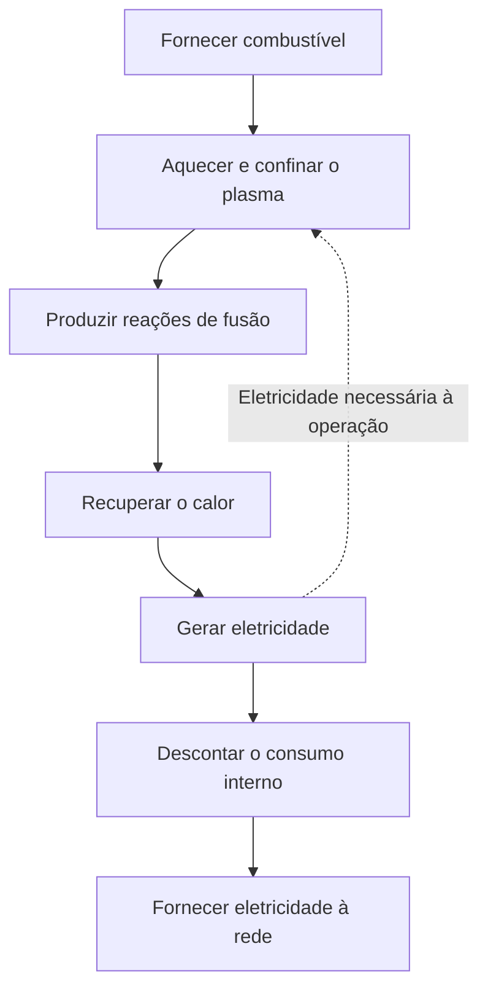
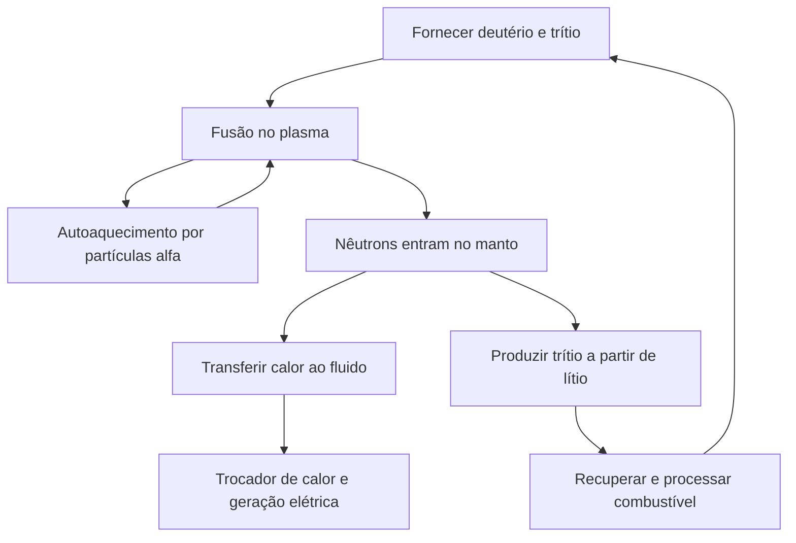

## 1. Produzir fusão não significa operar uma usina

A fusão alimenta o Sol e outras estrelas. Aproveitá-la na Terra permitiria liberar muita energia com pouco combustível. Observar reações, porém, é diferente de fornecer eletricidade continuamente à rede.

Acender uma fogueira também é diferente de operar uma termelétrica. É preciso recolher calor, acionar um gerador, fornecer combustível, controlar equipamentos e realizar manutenção. A fusão acrescenta desafios como manter o combustível extremamente quente e proteger estruturas contra os nêutrons produzidos.

Devemos separar **a reação física, o balanço energético e a operação da usina**. Um experimento pode representar um avanço importante sem cumprir os demais requisitos. O interesse por uma fonte energética não mede sua maturidade industrial.

O foco será a combinação deutério-trítio, muito estudada no desenvolvimento da fusão. Existem outras abordagens. O objetivo é entender o alcance de cada experiência sem transformar um recorde particular em prova de prontidão de toda a tecnologia. [Departamento de Energia dos Estados Unidos: energia de fusão][doe-overview]

## 2. Por que fissão e fusão liberam energia?

A fissão divide núcleos pesados; a fusão reúne núcleos leves. Processos aparentemente opostos podem liberar energia porque configurações nucleares diferentes têm energias diferentes.

Prótons e nêutrons são chamados de núcleons. A energia de ligação por núcleon cresce, em linhas gerais, dos núcleos leves aos de massa intermediária, alcançando valores elevados perto do ferro e do níquel. A união de certos núcleos leves produz um estado de menor energia, liberando a diferença. Nem toda combinação arbitrária de núcleos libera energia.

$$
E=\Delta m c^2
$$

$\Delta m$ representa a diferença de massa de repouso entre os sistemas inicial e final. Não é toda a massa do combustível que se transforma em eletricidade: permanecem produtos. A energia surge, por exemplo, no movimento das partículas, sendo depois recuperada como calor e convertida em eletricidade.

Na fissão, nêutrons causam novas fissões e sustentam uma reação em cadeia. Na fusão, é necessário manter condições que permitam aos núcleos se aproximar com frequência suficiente. O caráter nuclear não torna idênticos os equipamentos ou os mecanismos de interrupção. [ITER: fundamentos da fusão][fusion-basics]

## 3. Por que deutério e trítio?

O núcleo do hidrogênio comum contém um próton. O deutério tem um próton e um nêutron; o trítio, um próton e dois nêutrons. São isótopos do mesmo elemento, diferenciados pelo número de nêutrons. Os símbolos D e T dão nome à reação D–T.

$$
{}^{2}_{1}\mathrm{H}+{}^{3}_{1}\mathrm{H}
\rightarrow{}^{4}_{2}\mathrm{He}+{}^{1}_{0}\mathrm{n}+17.6\,\mathrm{MeV}
$$

Os produtos são um núcleo de hélio 4 e um nêutron. Quando a energia incidente é pequena diante da energia liberada, eles recebem aproximadamente 3,5 e 14,1 MeV, respectivamente, totalizando 17,6 MeV. O núcleo de hélio carregado também é chamado de partícula alfa. [KIT: distribuição da energia D–T][dt-energy]

Essa divisão molda a usina. As partículas alfa confinadas pelo campo magnético ajudam a aquecer o plasma. Os nêutrons, sem carga, não ficam presos da mesma forma e atingem os materiais ao redor. **Grande parte da energia é recuperada fora do plasma.**

D–T oferece taxas de reação relevantes em temperaturas relativamente inferiores às de outros combustíveis propostos. Isso não significa abastecimento simples: o trítio é radioativo e exige produção, recuperação e reprodução. Reações deutério-deutério ou próton-boro não são substituições diretas sob as mesmas condições. [ITER: condições necessárias][making-work]

## 4. Por que temperaturas tão altas?

Os núcleos positivos se repelem eletricamente, mas precisam chegar muito perto para que as forças nucleares atuem. Aumentar a temperatura eleva a energia do movimento e favorece colisões capazes de contribuir para a reação.

Isso não significa que cada partícula precise superar classicamente toda a barreira repulsiva. As energias seguem uma distribuição, e o tunelamento quântico participa da probabilidade de reação. A temperatura modifica uma frequência; não é um simples interruptor. [Aula do ITER no CERN: reatividade e tunelamento][fusion-lecture]

Pesquisadores frequentemente expressam temperatura em keV, uma unidade de energia. Nesse caso indicam $k_B T$, com $k_B$ sendo a constante de Boltzmann. Um keV corresponde a aproximadamente 11,6 milhões de kelvins; 10 keV, a 116 milhões. Falar em cem milhões de graus e em cerca de dez keV descreve a mesma ordem de grandeza.

O centro do Sol está a aproximadamente 15 milhões de graus, enquanto o estudo terrestre de D–T envolve temperaturas próximas de cem milhões ou superiores. Não reproduzimos a gravidade, a densidade, o tamanho nem o combustível solar. O Sol usa principalmente uma cadeia iniciada por prótons. As possibilidades de confinamento terrestre favorecem outra reação. Um “sol artificial” é uma metáfora. [ITER][fusion-basics], [DOE: plasma em combustão][burning]

## 5. Um plasma não é um sólido quente

Em temperaturas altas, elétrons se separam dos núcleos. O plasma contém íons positivos e elétrons móveis. Embora seja quase neutro em conjunto, suas partículas carregadas respondem a campos elétricos e magnéticos.

Por que o recipiente não derrete imediatamente? Um plasma magneticamente confinado tem densidade e transferência de calor muito diferentes das de um sólido. Temperatura mede a escala da energia de movimento, não a quantidade total de calor armazenado. Um volume de partículas muito quentes e pouco numerosas contém energia diferente de um volume de matéria densa.

As paredes ainda recebem partículas, radiação e nêutrons. O campo limita o contato direto do centro quente com os materiais, mas não cria isolamento perfeito. Essa distinção evita tanto considerar o recipiente impossível quanto achar que ele está automaticamente protegido. Confinar o plasma e controlar as cargas nas paredes são tarefas simultâneas.

## 6. Temperatura, densidade e tempo de confinamento

Alta temperatura não basta se as colisões forem raras. Alta densidade também não ajuda se o combustível esfriar ou se dispersar imediatamente. Temperatura $T$, densidade $n$ e tempo de confinamento de energia $\tau_E$ devem ser avaliados juntos.

Numa descrição simples, o tempo é a energia armazenada $W$ dividida pela potência perdida $P_{\mathrm{loss}}$:

$$
\tau_E=\frac{W}{P_{\mathrm{loss}}}
$$

Com 100 MJ armazenados e perdas de 50 MW, temos dois segundos. Isso não obriga o plasma a desaparecer em dois segundos. Uma banheira com vazamento mantém o nível se receber água suficiente; da mesma forma, repor energia permite uma descarga muito mais longa. **Duração da descarga e tempo de confinamento energético são grandezas diferentes.**

O critério de Lawson relaciona densidade e confinamento ao balanço entre aquecimento por fusão e perdas. É comum usar o produto triplo $nT\tau_E$. Para ignição D–T próxima de temperaturas favoráveis, a escala é de alguns $10^{21}$ keV·s·m$^{-3}$. Mas o requisito depende do combustível, da temperatura, do ganho desejado e da definição de densidade. Não existe uma nota de aprovação universal. [Instituto Max Planck de Física de Plasma][triple-product]

| Grandeza | O que descreve | O que não comprova sozinha |
|---|---|---|
| Temperatura | Energia característica do movimento | Frequência e manutenção das reações |
| Densidade | Partículas por unidade de volume | Temperatura suficiente e baixas perdas |
| Tempo de confinamento energético | Energia armazenada em relação às perdas | Duração total da descarga |
| Duração da descarga | Tempo de manutenção de um estado | Potência de fusão e balanço elétrico |

## 7. O que a taxa de reação revela sobre a mistura

Num plasma D–T uniforme bastante simplificado, as reações por unidade de volume e tempo são:

$$
R=n_D n_T\langle\sigma v\rangle
$$

$n_D$ e $n_T$ são as densidades de deutério e trítio, $\sigma$ é a seção de choque e $v$ a velocidade relativa. Os sinais de média representam a distribuição de velocidades. As colisões não acontecem todas à mesma velocidade; portanto, a taxa não é simplesmente proporcional à temperatura.

Mantendo a densidade total $n=n_D+n_T$ e as outras condições fixas, $n_Dn_T$ atinge o máximo quando cada espécie representa metade do combustível. Acrescentar apenas uma deixa poucos parceiros. É como formar pares entre dois grupos: aumentar só um deles não garante mais pares.

Dobrar ambas as densidades quadruplicaria a taxa apenas se as demais condições permanecessem iguais. Na prática, pressão, radiação e estabilidade também mudam. Um fator isolado não prova que aumentar a densidade resolve tudo. [Estudo de ganho e critério de Lawson][lawson-paper]

## 8. Como os campos magnéticos confinam partículas

A força de Lorentz descreve a ação dos campos sobre uma partícula carregada:

$$
\mathbf{F}=q\left(\mathbf{E}+\mathbf{v}\times\mathbf{B}\right)
$$

A força magnética curva a trajetória, fazendo a partícula girar ao redor de uma linha de campo enquanto se desloca ao longo dela. Num campo estático, essa força é perpendicular à velocidade e não realiza diretamente trabalho para aquecer a partícula. Confinamento e aquecimento têm papéis distintos.

Um campo reto permite fuga pelas extremidades. Fechar o caminho em um anel elimina essas saídas, mas curvatura e variação da intensidade criam derivas. Torcer as linhas ajuda a obter uma configuração compatível com o movimento das partículas e o equilíbrio de pressão.

“Prender com ímãs” resume relações entre giro, geometria, corrente, pressão e instabilidades. Um campo mais forte, isoladamente, não garante confinamento prolongado. [Laboratório de Princeton: plasma e confinamento][magnetic]

## 9. Tokamaks e stellarators

O tokamak combina campos de bobinas externas com o campo de uma corrente no plasma toroidal. Essa corrente contribui para o confinamento, mas precisa ser mantida, e mudanças bruscas exigem proteção dos equipamentos.

A indução de corrente por efeito transformador limita a operação contínua. Ondas e feixes também podem sustentar corrente sem indução. É incorreto tanto afirmar que todo tokamak só funciona por instantes quanto supor que a corrente continuará indefinidamente sem recursos específicos.

O stellarator produz a torção principalmente com bobinas externas tridimensionais. Depender menos de uma grande corrente de plasma oferece vantagens para a operação estacionária. Em troca, projeto, fabricação, posicionamento das bobinas e controle das perdas ficam especialmente exigentes. [Instituto Max Planck: stellarators][stellarator]

| Aspecto | Tokamak | Stellarator |
|---|---|---|
| Torção das linhas | Bobinas e corrente de plasma | Principalmente bobinas tridimensionais |
| Desafios de longa operação | Sustentar corrente, estabilidade e retirada de calor | Otimizar campo, fabricar e retirar calor |
| Geometria | Aproximadamente axissimétrica | Tridimensional complexa |
| Desafios comuns | Combustível, materiais, calor, manutenção e balanço elétrico | Combustível, materiais, calor, manutenção e balanço elétrico |

Não há uma regra simples que escolha um único vencedor. A comparação deve incluir construção, reparo e confiabilidade ao longo do tempo, além do desempenho do plasma.

## 10. Aquecimento externo e autoaquecimento

A corrente pode aquecer resistivamente o plasma do tokamak. Contudo, a resistência diminui quando a temperatura sobe, limitando o que esse método consegue sozinho. Outras fontes de energia são necessárias.

A injeção de feixes neutros introduz partículas energéticas sem carga, pouco desviadas pelo campo. Dentro do plasma, ionização e colisões transferem sua energia. Ondas de radiofrequência e micro-ondas oferecem outra via. Nenhum desses equipamentos transforma toda a eletricidade consumida em calor do plasma. [ITER: aquecimento externo][heating]

À medida que as reações D–T aumentam, partículas alfa fornecem mais aquecimento interno. Quando esse aquecimento domina, fala-se em plasma em combustão. Não se trata de uma reação química com oxigênio.

No confinamento magnético, ignição significa idealmente que o aquecimento pelos produtos da fusão compensa as perdas sem aquecimento externo. Bombas, refrigeração e controles ainda precisam de eletricidade. Autossustentação térmica do plasma e autossuficiência elétrica da usina são avaliadas em fronteiras diferentes. [DOE: plasma em combustão][burning]

## 11. A fusão a laser usa um intervalo muito curto

O confinamento magnético mantém por bastante tempo um plasma quente relativamente pouco denso. O confinamento inercial comprime uma pequena quantidade de combustível para que reaja antes de se expandir. Lasers são uma forma de fornecer a energia impulsora.

A National Ignition Facility, ou NIF, nos Estados Unidos, estuda a compressão e o aquecimento de pequenos alvos. Uma usina precisaria fabricar, introduzir e irradiar alvos repetidamente, remover produtos e gerenciar calor antes do evento seguinte. Um experimento favorável não demonstra toda essa sequência industrial.

Em 5 de dezembro de 2022, um experimento da NIF produziu 3,15 MJ de energia de fusão a partir de 2,05 MJ de energia laser entregue ao alvo. O resultado histórico demonstrou ganho do alvo superior a um. Não demonstrou balanço elétrico positivo incluindo o consumo total da instalação. [Laboratório Lawrence Livermore: experimento de ignição][nif]

Como cálculo hipotético, 100 MJ por evento a cinco eventos por segundo dariam 500 MW médios de fusão. A multiplicação não comprova que frequência, custo dos alvos, eficiência do laser e vida útil dos equipamentos estejam resolvidos juntos. Potência instantânea de pico, energia por pulso e potência média são medidas diferentes.

## 12. Dez vezes a entrada: qual entrada?

No confinamento magnético, o ganho do plasma $Q$ geralmente compara potência de fusão com potência de aquecimento externo efetivamente entregue ao plasma:

$$
Q=\frac{P_{\mathrm{fusion}}}{P_{\mathrm{heat}}}
$$

O ITER tem como objetivo 500 MW de fusão com 50 MW de aquecimento, isto é, $Q=10$. Trata-se de uma meta de pesquisa, não de um recorde comercial já alcançado. O ITER não foi projetado para converter esse calor em eletricidade vendida à rede. [ITER: objetivos][iter-goals]

$Q=10$ não significa gerar dez vezes a eletricidade consumida. Existem perdas entre a alimentação elétrica e o aquecimento do plasma, assim como entre o calor recuperado e a eletricidade gerada. Refrigeração, bombeamento, resfriamento e tratamento do combustível também consomem.

Considere um modelo didático: 1 000 MW de fusão com $Q=10$ exigem 100 MW de aquecimento do plasma. Com eficiência elétrica de aquecimento de 50%, são necessários 200 MW elétricos. Converter apenas a potência de fusão com eficiência de 40% gera 400 MW elétricos. Subtraindo 200 MW do aquecimento e 100 MW de outros consumos, sobram 100 MW para exportação.

$$
P_{\mathrm{net}}\approx\eta_e P_{\mathrm{fusion}}
-\frac{P_{\mathrm{fusion}}}{Q\eta_h}-P_{\mathrm{aux}}
$$

O modelo ignora a recuperação térmica do aquecimento externo e a energia adicional das reações no manto. Serve para explicar o balanço, não para prever uma usina real. Sob as mesmas hipóteses, mas com $Q=5$, o aquecimento consumiria 400 MW elétricos, e o saldo seria menos 100 MW. **Ganho do plasma e eletricidade disponível para a rede não são a mesma coisa.**

| Indicador | Entrada contabilizada | O que informa |
|---|---|---|
| Ganho do plasma | Aquecimento entregue ao plasma | Relação com a potência de fusão |
| Ganho do alvo | Energia entregue ao alvo | Relação com a energia de fusão por evento |
| Eletricidade líquida | Consumo elétrico da usina inteira | Possibilidade de fornecer à rede |
| Economia | Construção, operação, combustível e manutenção | Viabilidade comercial do fornecimento |

## 13. O manto recupera calor e reproduz combustível

Nêutrons D–T atravessam o campo de confinamento. Interações com os materiais convertem sua energia cinética em calor. Num reator de potência, o manto ao redor do plasma é projetado para recuperar essa energia.

Não se trata apenas de isolamento. O manto combina recuperação de calor, proteção de equipamentos como os ímãs e produção de trítio. Nêutrons interagem com materiais contendo lítio; o trítio resultante deve ser extraído e devolvido ao circuito de combustível.

As funções disputam espaço. Blindagens mais espessas protegem melhor, mas aumentam massa e tamanho. Aberturas de diagnóstico e aquecimento não podem conter simultaneamente material reprodutor. A geometria que aproveita melhor os nêutrons nem sempre favorece a retirada de calor.

O ITER prevê testar módulos reprodutores em ambiente de fusão. Testar módulos não equivale a já demonstrar a autossuficiência de combustível de uma usina completa. [ITER: reprodução de trítio][breeding]

## 14. Combustível da água do mar: uma explicação incompleta

O deutério pode ser obtido da água, mas D–T também exige trítio. Radioativo, ele tem meia-vida de aproximadamente 12,3 anos e não forma uma enorme reserva natural acumulada. Operação prolongada exige reprodução e recuperação. [ITER: glossário][glossary]

A razão de reprodução compara o trítio produzido ao consumido pelas reações. Um valor igual ou superior a um parece suficiente, mas o planejamento deve incluir atrasos de extração, retenção nos materiais e equipamentos, perdas, decaimento e estoques para iniciar outras instalações.

Mesmo que todo combustível consumido retorne depois, é preciso manter um estoque para operar durante a espera. Produção e consumo anuais iguais não garantem disponibilidade a cada instante. Além do total, importa o momento em que o combustível fica disponível.

Nem todo combustível injetado reage numa passagem. Combustível não queimado, hélio e impurezas devem ser retirados e separados, permitindo o retorno das espécies úteis. Consumo por reação, vazão processada e inventário do local são grandezas distintas. Pequeno consumo nuclear não implica pequeno sistema de processamento.

Recursos abundantes são uma vantagem, mas não dispensam preparação, fornecimento e reciclagem. [AIEA: física e tecnologia do ciclo D–T][fuel-cycle]

## 15. Conservar calor enquanto se retira calor

O centro do plasma deve permanecer quente. Ao mesmo tempo, a usina precisa recuperar a energia que sai e manter as paredes em temperaturas aceitáveis. As exigências são simultâneas.

Na borda, cinzas de hélio, impurezas e calor precisam ser removidos. O divertor realiza parte dessa tarefa nos tokamaks. Como num escoamento concentrado numa saída, muito calor pode atingir uma área pequena. Uma descarga longa não basta se danificar rapidamente os componentes.

Fluxo de calor é potência por unidade de área. O divertor do ITER considera cargas estacionárias da ordem de 10 MW/m$^2$. Num quadrado de 10 cm de lado, isso corresponde a 100 kW. Uma superfície pequena pode exigir refrigeração intensa. [ITER: divertor][divertor]

O alto ponto de fusão do tungstênio não resolve tudo. O calor precisa atravessar estruturas e juntas até o fluido de resfriamento. Fadiga, erosão e contaminação do plasma também importam. Impurezas vindas das paredes podem aumentar perdas radiativas, ligando o comportamento dos materiais ao do plasma.

Um recorde de temperatura e intervalos viáveis de substituição medem capacidades diferentes. Um máximo isolado não informa a distância até uma usina comercial.

## 16. Nêutrons aquecem e modificam materiais

Nêutrons energéticos deslocam átomos das estruturas. Reações nucleares podem criar outros elementos e gases no interior do material. Fragilização, inchamento e mudanças de condutividade térmica são possíveis consequências.

Um ensaio em forno quente não reproduz essa combinação. Calor, esforços mecânicos, irradiação e química do fluido atuam juntos. Experimentos e simulações precisam prever a vida útil com dados suficientes para validar as previsões. [AIEA: danos por irradiação][materials]

Nêutrons também ativam materiais. Por isso, dizer que a fusão não produz resíduos radioativos é enganoso. Isótopos, quantidades e períodos de gestão dependem dos materiais, da irradiação, do histórico de operação e das rotas de destinação. Materiais de baixa ativação buscam melhorar desempenho e gestão futura.

A manutenção exige manipulação remota: remover componentes grandes, conectar substitutos com precisão e inspecionar o serviço em áreas difíceis de acessar. Ser possível montar uma máquina não significa repará-la rapidamente. O tempo de parada afeta produção e custos.

Ter mecanismos de interrupção diferentes dos da fissão não elimina todos os perigos. Trítio, materiais ativados, energia magnética e fluidos quentes ou pressurizados precisam de gestão apropriada. [ITER: segurança e meio ambiente][safety]

## 17. Supercondutores não tornam o consumo nulo

Campos fortes exigem grandes correntes. Em condições adequadas, supercondutores reduzem muito a resistência em corrente contínua. Isso ajuda a manter o campo com eficiência, sem eliminar o consumo de toda a instalação.

Os ímãs do ITER foram projetados para operar perto de 4 K. Elementos extremamente frios ficam próximos de um plasma quente, exigindo isolamento a vácuo, escudos térmicos, refrigeração e tubulações criogênicas. Explorar uma propriedade do material requer infraestrutura extensa. [ITER: criogenia][cryogenics]

Supercondutor de alta temperatura não significa funcionamento à temperatura ambiente. Esses materiais suportam temperaturas superiores às dos convencionais, mas ainda necessitam de resfriamento e proteção sob grandes campos e correntes. Forças mecânicas e energia armazenada devem ser controladas durante falhas.

Bombas de vácuo, processamento de combustível, computadores e controles também consomem eletricidade. Equipamentos ausentes da imagem do plasma luminoso viabilizam a operação. Um balanço restrito ao plasma esconde essa demanda. [ITER: ímãs][magnets], [alimentação elétrica][power-supply]

## 18. Medir o inacessível e validar modelos

Temperatura, densidade, campos, radiação e produtos de reação exigem diferentes diagnósticos. Não é possível inserir um termômetro comum no centro. Luz, ondas, partículas e sinais magnéticos fornecem informações indiretas.

Uma medição não descreve necessariamente todo o plasma. Centro e borda diferem e variam no tempo. Uma medida integrada ao longo de uma linha de visada precisa de hipóteses ou outras observações para reconstruir um perfil espacial. Incertezas instrumentais e hipóteses dos modelos devem ser distinguidas. [ITER: diagnósticos][diagnostics]

Simulações são essenciais para turbulência, transporte, geometria magnética e materiais. Representar uma reação no computador não demonstra prontidão de uma usina. É preciso identificar os regimes validados e comparar os resultados com experiências.

O mesmo vale para aprendizado de máquina no controle. Boas previsões sobre dados conhecidos não comprovam desempenho em regimes novos ou com sensores defeituosos. Métodos computacionais não eliminam os problemas de combustível, materiais e retirada de calor. A fusão integra medição, física e engenharia.

## 19. Do mistério das estrelas às experiências terrestres

No início do século XX, a longevidade do Sol era um problema: combustão química não conseguia explicá-la. Em 1920, Eddington sugeriu que transformar hidrogênio em hélio alimentaria as estrelas. A pesquisa nuclear passou a se conectar aos modelos de seus interiores.

Em 1934, experiências de Oliphant, Harteck e Rutherford com deutério ampliaram o estudo das reações de núcleos leves. Bethe e outros pesquisadores desenvolveram a explicação nuclear da energia estelar. [ITER: primeiras pesquisas][history-early]

Nos anos 1950, buscou-se controlar a fusão terrestre como fonte energética. Parte das pesquisas era secreta; a conferência internacional de Genebra de 1958 marcou a abertura à cooperação. Instabilidades e perdas mostraram-se mais difíceis do que sugeriam estimativas iniciais. [AIEA: história da cooperação][history-cooperation]

Avanços em geometria, aquecimento, vácuo, supercondutividade, diagnósticos e computação levaram aos grandes experimentos. O ITER integra pesquisa de plasmas em combustão e tecnologias associadas; a ignição da NIF representa o confinamento inercial. São conquistas com métodos e fronteiras de balanço diferentes, não pontuações intercambiáveis.

| Etapa | Questão principal | Próximo desafio |
|---|---|---|
| Energia das estrelas | Por que o Sol brilha por tanto tempo? | Entender quantitativamente as reações |
| Reações em laboratório | Podemos observar reações de núcleos leves? | Criar uma fonte macroscópica |
| Fusão controlada | Podemos manter o combustível quente? | Reduzir perdas e instabilidades |
| Ganho elevado | O autoaquecimento pode dominar? | Combustível, materiais, repetição e duração |
| Demonstração elétrica | Podemos fornecer eletricidade líquida sustentada? | Confiabilidade, manutenção, custo e condições sociais |

A longa pesquisa não significa impossibilidade de produzir fusão: ela é produzida. A dificuldade é atender simultaneamente escala, duração, abastecimento, materiais e custo.

## 20. Seis perguntas diante de uma promessa comercial

Não é preciso minimizar o progresso. É preciso evitar interpretar um recorde como uma realização diferente da que foi medida.

1. **O que foi medido?** Temperatura, duração, energia de fusão, ganho e eletricidade líquida são indicadores distintos.
2. **Onde a entrada foi contabilizada?** Calor do plasma, laser no alvo e eletricidade total não são equivalentes.
3. **Qual combustível e quais condições?** Controlar hidrogênio ou deutério difere de produzir grande potência D–T.
4. **Um evento ou operação repetível?** Examinar estabilidade, paradas e vida útil além dos máximos.
5. **Há combustível e peças disponíveis?** Incluir reprodução, recuperação, fabricação, substituições e resíduos.
6. **Plano ou resultado demonstrado?** Verificar evidências e hipóteses por trás de prazos e custos.

Também importa a produção anual vendável. Uma usina com 500 MW líquidos entregaria cerca de 2,19 TWh num ano comum com fator de capacidade de 50%, ou 3,50 TWh a 80%. Isso ilustra o efeito da operação e da manutenção, não prevê fatores futuros para a fusão.

Diminuir a máquina não barateia tudo automaticamente. A fabricação pode custar menos, enquanto cargas térmicas se concentram e o acesso para reparos piora. Uma máquina maior pode favorecer o confinamento e aumentar exigências de construção. Dimensões, física, manutenção e custo devem ser projetados juntos.

A fusão promete muita energia a partir de núcleos leves. Torná-la útil exige uma cadeia completa: **produzir e recuperar calor, reciclar combustível, substituir componentes e entregar durante muitos anos mais eletricidade do que a instalação consome**. Entender o conjunto permite avaliar melhor avanços e etapas pendentes.

## Fontes e alcance das ilustrações

Energias de reação e resultados históricos seguem os organismos citados. Rendimentos, consumos auxiliares, frequências e fatores de capacidade dos exemplos são hipóteses didáticas, não previsões de uma usina real. A capa gerada por IA é conceitual: bobinas, tubulações e cores não constituem um projeto de engenharia.

- [DOE: energia de fusão][doe-overview] e [plasma em combustão][burning]
- [ITER: fundamentos][fusion-basics], [requisitos][making-work], [objetivos][iter-goals] e [glossário][glossary]
- [ITER: aquecimento][heating], [trítio][breeding], [divertor][divertor], [diagnósticos][diagnostics], [ímãs][magnets], [criogenia][cryogenics], [eletricidade][power-supply] e [segurança][safety]
- [Max Planck: produto triplo][triple-product] e [stellarators][stellarator]; [Princeton: confinamento][magnetic]
- [Estudo do critério de Lawson][lawson-paper]; [LLNL: ignição de 2022][nif]
- [AIEA: ciclo D–T][fuel-cycle], [materiais][materials] e [história][history-cooperation]; [ITER: primeiras pesquisas][history-early]
- [KIT: energia D–T][dt-energy]; [aula do ITER no CERN][fusion-lecture]

[doe-overview]: https://www.energy.gov/topics/fusion-energy
[fusion-basics]: https://www.iter.org/fusion-energy/what-fusion
[making-work]: https://www.iter.org/fusion-energy/making-it-work
[burning]: https://www.energy.gov/science/doe-explainsburning-plasma
[triple-product]: https://www.ipp.mpg.de/83115/fusionsprodukt
[lawson-paper]: https://arxiv.org/abs/2105.10954
[magnetic]: https://w3.pppl.gov/scied/docs/undergrad_level_general_Plasma_Fusion_PPPL/Plasma_fusion_pppl.pdf
[stellarator]: https://www.ipp.mpg.de/9792/stellarator
[heating]: https://www.iter.org/machine/supporting-systems/external-heating-systems
[nif]: https://www.llnl.gov/article/50801/llnls-breakthrough-ignition-experiment-highlighted-physical-review-letters
[iter-goals]: https://www.iter.org/fusion-energy/what-will-iter-do
[breeding]: https://www.iter.org/machine/supporting-systems/tritium-breeding
[glossary]: https://www.iter.org/fusion-glossary
[fuel-cycle]: https://www-pub.iaea.org/MTCD/publications/PDF/TE-2076web.pdf
[divertor]: https://www.iter.org/machine/divertor
[materials]: https://nucleus-qa.iaea.org/sites/fusionportal/Pages/DPWS-6/Topics.aspx
[safety]: https://www.iter.org/faqs?thematic=75
[cryogenics]: https://www.iter.org/machine/supporting-systems/cryogenics
[magnets]: https://www.iter.org/machine/magnets
[power-supply]: https://www.iter.org/machine/supporting-systems/power-supply
[diagnostics]: https://www.iter.org/machine/supporting-systems/diagnostics
[history-early]: https://www.iter.org/node/20687/who-invented-fusion
[history-cooperation]: https://nucleus.iaea.org/sites/fusion-portal/SitePages/A-brief-history-of-nuclear-fusion.aspx?web=1
[dt-energy]: https://publikationen.bibliothek.kit.edu/1000161936/151265654
[fusion-lecture]: https://indico.cern.ch/event/116345/attachments/53370/76726/Campbell_ITER26Fusion-1_CERN_Apr11.pdf
