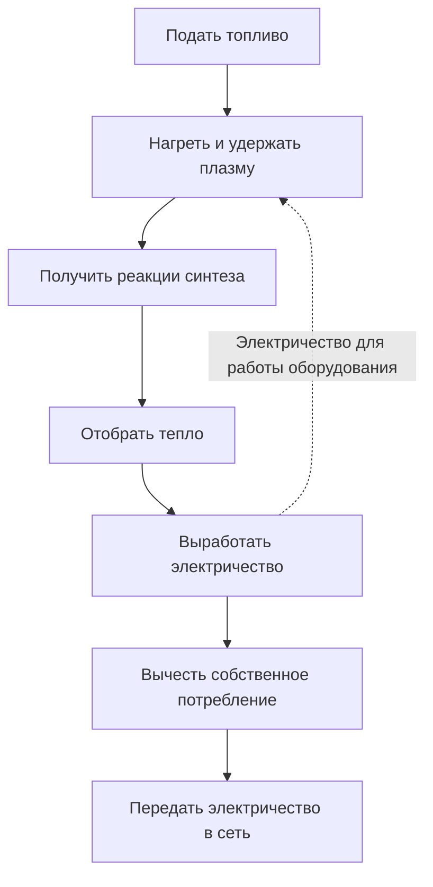
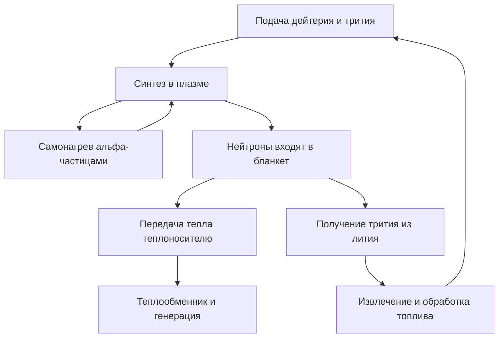

## 1. Получить реакцию — ещё не значит построить электростанцию

Термоядерный синтез питает Солнце и другие звёзды. Его освоение на Земле обещает много энергии из небольшого количества топлива. Но наблюдение реакции и снабжение потребителей электричеством — разные достижения.

Развести огонь тоже не означает запустить тепловую электростанцию. Нужны отбор тепла, генератор, подача топлива, управление и обслуживание. Синтез добавляет задачи удержания чрезвычайно горячего топлива и защиты конструкций от нейтронов.

Поэтому следует различать **физическую реакцию, энергетический баланс и эксплуатацию станции**. Удачный эксперимент может стать важным шагом, не решив всех остальных задач. Привлекательность источника энергии не определяет его промышленную готовность.

Основной пример — дейтерий и тритий, широко исследуемая топливная смесь. Существуют и другие подходы. Важно понимать границы конкретного результата, не превращая рекорд одной установки в оценку всей отрасли. [Министерство энергетики США: термоядерная энергия][doe-overview]

## 2. Почему энергию дают и деление, и синтез?

Деление расщепляет тяжёлые ядра, а синтез объединяет лёгкие. Оба процесса могут выделять энергию, поскольку разные ядерные конфигурации имеют разную энергию.

Протоны и нейтроны вместе называют нуклонами. Удельная энергия связи в целом растёт от лёгких ядер к ядрам средней массы и достигает высоких значений вблизи железа и никеля. Объединение подходящих лёгких ядер ведёт к состоянию с меньшей энергией, а разность высвобождается. Слияние произвольных ядер не обязательно энергетически выгодно.

$$
E=\Delta m c^2
$$

$\Delta m$ — разность масс покоя начальной и конечной систем. В электричество превращается не вся масса топлива: остаются продукты реакции. Энергия сначала проявляется, например, в движении частиц, затем её можно отобрать как тепло и преобразовать в электричество.

В реакторе деления нейтроны вызывают новые деления, поддерживая цепную реакцию. Для синтеза нужно сохранять условия достаточно частого сближения ядер. Общая ядерная природа не делает одинаковыми оборудование и поведение при остановке. [ITER: основы синтеза][fusion-basics]

## 3. Почему дейтерий и тритий?

Ядро обычного водорода содержит один протон. В дейтерии к нему добавлен один нейтрон, в тритии — два. Разновидности одного элемента с разным числом нейтронов называются изотопами. Их обозначения D и T дают название реакции D–T.

$$
{}^{2}_{1}\mathrm{H}+{}^{3}_{1}\mathrm{H}
\rightarrow{}^{4}_{2}\mathrm{He}+{}^{1}_{0}\mathrm{n}+17.6\,\mathrm{MeV}
$$

Образуются ядро гелия-4 и нейтрон. Если исходная энергия частиц мала по сравнению с энергией реакции, гелий получает около 3,5 МэВ, а нейтрон — 14,1 МэВ, вместе примерно 17,6 МэВ. Заряженное ядро гелия также называют альфа-частицей. [KIT: распределение энергии D–T][dt-energy]

Это распределение определяет устройство станции. Удерживаемые магнитным полем альфа-частицы нагревают плазму. Нейтроны без электрического заряда уходят в окружающие конструкции. **Значительную часть энергии собирают вне плазмы.**

D–T даёт заметную скорость реакции при сравнительно меньших температурах, чем ряд других перспективных топлив. Но удобство реакции не означает простоту снабжения: радиоактивный тритий нужно получать, извлекать и воспроизводить. Дейтерий-дейтериевые и протон-борные реакции нельзя просто подставить вместо D–T при тех же условиях. [ITER: необходимые условия][making-work]

## 4. Зачем настолько высокая температура?

Положительно заряженные ядра отталкиваются. Для действия ядерных сил им необходимо сильно сблизиться. Повышение температуры увеличивает энергию движения и число столкновений, способных привести к реакции.

Однако неверно считать, что каждая частица обязана классически преодолеть весь барьер. Энергии имеют распределение, а квантовое туннелирование влияет на вероятность реакции. Температура меняет частоту реакций, а не служит простым выключателем. [Лекция ITER в CERN: реактивность и туннелирование][fusion-lecture]

Температуру плазмы часто выражают в кэВ, то есть указывают энергию $k_B T$, где $k_B$ — постоянная Больцмана. Один кэВ соответствует примерно 11,6 миллиона К, а 10 кэВ — 116 миллионам. «Сто миллионов градусов» и «порядка десяти кэВ» описывают близкий масштаб.

В центре Солнца около 15 миллионов градусов, а земные исследования D–T рассматривают примерно сто миллионов и выше. На Земле не воспроизводятся солнечные размеры, гравитация, плотность и топливо. Солнце использует главным образом цепочку, начинающуюся с протонов. Доступное земное удержание делает предпочтительной другую реакцию. Искусственное солнце — метафора. [ITER][fusion-basics], [DOE: горящая плазма][burning]

## 5. Плазма — не раскалённое твёрдое тело

При высокой температуре электроны отделяются от ядер. Плазма содержит подвижные положительные ионы и электроны. Почти нейтральная в целом, она всё же состоит из заряженных частиц, реагирующих на электрические и магнитные поля.

Почему сосуд не плавится сразу? Магнитно удерживаемая плазма резко отличается от твёрдого металла по плотности и передаче тепла. Температура характеризует энергию движения частиц, а не полный запас тепла. Одинаковые объёмы очень горячего разреженного вещества и плотного материала содержат разную энергию.

Стены всё равно получают энергию от частиц, излучения и нейтронов. Поле ограничивает прямой контакт горячего центра с материалами, но не создаёт идеальной теплоизоляции. Сосуд не невозможен в принципе, а стенки не защищены автоматически. Удержание плазмы и управление нагрузками на стенки требуют совместного решения.

## 6. Температура, плотность и время удержания энергии

Высокой температуры недостаточно, если столкновения редки. Большая плотность также бесполезна, если топливо сразу остывает или разлетается. Поэтому рассматривают вместе температуру $T$, плотность $n$ и время удержания энергии $\tau_E$.

В простом описании это отношение запасённой энергии $W$ к мощности потерь $P_{\mathrm{loss}}$:

$$
\tau_E=\frac{W}{P_{\mathrm{loss}}}
$$

При запасе 100 МДж и потерях 50 МВт получаем две секунды. Это не означает исчезновение плазмы через две секунды. В протекающей ванне уровень сохраняется, если приток восполняет утечку; аналогично подпитка энергией позволяет поддерживать гораздо более долгий разряд. **Длительность разряда и время удержания энергии различаются.**

Критерий Лоусона связывает плотность и удержание с балансом термоядерного нагрева и потерь. Часто используют тройное произведение $nT\tau_E$. Для зажигания D–T в благоприятном диапазоне температур характерен масштаб нескольких $10^{21}$ кэВ·с·м$^{-3}$. Условие зависит от топлива, температуры, требуемого усиления и определения плотности. Единого проходного числа для всех экспериментов нет. [Институт физики плазмы Общества Макса Планка][triple-product]

| Величина | Что описывает | Чего сама по себе не доказывает |
|---|---|---|
| Температура | Масштаб энергии движения | Частоту и устойчивость реакций |
| Плотность | Число частиц в объёме | Достаточную температуру и малые потери |
| Время удержания энергии | Запас энергии относительно потерь | Полную длительность разряда |
| Длительность разряда | Время поддержания режима | Мощность синтеза и электрический баланс |

## 7. Скорость реакции и состав смеси

Для сильно упрощённой однородной D–T-плазмы число реакций в единице объёма за единицу времени равно:

$$
R=n_D n_T\langle\sigma v\rangle
$$

$n_D$ и $n_T$ — концентрации дейтерия и трития, $\sigma$ — сечение реакции, $v$ — относительная скорость. Скобки означают усреднение по распределению скоростей. Не все столкновения одинаковы, поэтому скорость реакции нельзя считать просто пропорциональной температуре.

При фиксированной общей концентрации $n=n_D+n_T$ и остальных условиях произведение $n_Dn_T$ максимально для равных долей. Добавление лишь одного компонента оставляет слишком мало партнёров. Как при составлении пар из двух групп, увеличение одной группы не гарантирует больше пар.

Удвоение обеих концентраций дало бы четырёхкратную скорость лишь при неизменных других условиях. На практике меняются давление, излучение и устойчивость. Из одного множителя нельзя заключить, что рост плотности решает всё. [Исследование усиления и критерия Лоусона][lawson-paper]

## 8. Как магнитное поле удерживает плазму?

На заряженную частицу действует сила Лоренца:

$$
\mathbf{F}=q\left(\mathbf{E}+\mathbf{v}\times\mathbf{B}\right)
$$

Магнитная составляющая искривляет траекторию: частица вращается вокруг силовой линии и движется вдоль неё. Сила статического магнитного поля перпендикулярна скорости и непосредственно не совершает работу по нагреву. Удерживающее поле и нагревательные устройства выполняют разные функции.

В прямом поле частицы легко уходят через концы. Замыкание пути в кольцо убирает концы, но кривизна и неоднородность поля создают дрейфы. Закручивание силовых линий помогает получить конфигурацию, совместимую с движением частиц и равновесием давления.

Фраза «удержать магнитами» скрывает взаимодействие вращения, геометрии, токов, давления и неустойчивостей. Одно лишь усиление поля не гарантирует длительного удержания. [Принстонская лаборатория физики плазмы][magnetic]

## 9. Токамаки и стеллараторы

Токамак сочетает поля внешних катушек с полем тока в тороидальной плазме. Ток помогает удержанию, но его надо поддерживать и защищать оборудование при резких изменениях.

Индукция тока по принципу трансформатора ограничивает непрерывную работу. Используют также неиндукционные методы с волнами или пучками. Неверно и утверждать, что токамак всегда работает только коротко, и предполагать бесконечное поддержание тока без дополнительных средств.

Стелларатор формирует закручивание преимущественно трёхмерными внешними катушками. Меньшая зависимость от большого плазменного тока благоприятна для стационарной работы. Обратная сторона — сложное проектирование, изготовление, позиционирование и контроль потерь частиц. [Институт Макса Планка: стеллараторы][stellarator]

| Особенность | Токамак | Стелларатор |
|---|---|---|
| Закручивание поля | Катушки и плазменный ток | Преимущественно трёхмерные катушки |
| Задачи долгой работы | Поддержание тока, устойчивость, отвод тепла | Оптимизация поля, изготовление, отвод тепла |
| Геометрия | Приблизительно осесимметричная | Сложная трёхмерная |
| Общие задачи станции | Топливо, материалы, тепло, обслуживание, электробаланс | Топливо, материалы, тепло, обслуживание, электробаланс |

Простого правила выбора единственного победителя нет. Нужно сравнивать не только плазму, но и возможность построить, ремонтировать и надёжно эксплуатировать станцию.

## 10. Внешний нагрев и самонагрев

Ток в токамаке может нагревать плазму благодаря сопротивлению. Однако с ростом температуры сопротивление падает, ограничивая этот способ. Требуется дополнительная энергия.

Инжекция нейтральных пучков вводит быстрые незаряженные частицы, которые слабо отклоняются удерживающим полем. В плазме ионизация и столкновения передают их энергию. Радиочастотные и микроволновые системы используют взаимодействие волн с частицами. Ни один нагреватель не превращает всю потреблённую электроэнергию в тепло плазмы. [ITER: внешний нагрев][heating]

При усилении D–T-реакций альфа-частицы обеспечивают всё больше самонагрева. Плазму, где он преобладает, называют горящей. Это не химическое горение с кислородом.

При магнитном удержании идеальное зажигание означает, что продукты синтеза возмещают потери без внешнего нагрева. Насосам, холодильникам и управлению электричество всё ещё необходимо. Тепловая самостоятельность плазмы и электрическая самостоятельность станции относятся к разным границам системы. [DOE: горящая плазма][burning]

## 11. Лазерный синтез использует короткий промежуток времени

Магнитное удержание стремится долго сохранять сравнительно разреженную горячую плазму. Инерциальное удержание сжимает небольшое количество топлива до высокой плотности, чтобы оно прореагировало до разлёта. Лазеры могут обеспечивать энергию такого сжатия.

Американская установка NIF изучает сжатие и нагрев небольших мишеней. На станции нужно регулярно изготовлять и подавать мишени, облучать их, удалять продукты и отводить тепло перед следующим событием. Единичный успешный опыт не подтверждает работоспособность всей промышленной последовательности.

5 декабря 2022 года эксперимент NIF дал 3,15 МДж энергии синтеза при 2,05 МДж лазерной энергии, доставленной к мишени. Этот исторический результат показал усиление мишени выше единицы, но не положительный электрический баланс всей лазерной установки. [Ливерморская национальная лаборатория: эксперимент зажигания][nif]

В условном расчёте 100 МДж на событие при пяти событиях в секунду дают среднюю мощность 500 МВт. Умножение не доказывает одновременного достижения нужной частоты, стоимости мишеней, КПД лазера и ресурса оборудования. Различайте пиковую мощность, энергию импульса и среднюю мощность.

## 12. В десять раз больше входа: какого именно?

При магнитном удержании коэффициент усиления плазмы $Q$ обычно сравнивает мощность синтеза с мощностью внешнего нагрева, действительно поступившей в плазму:

$$
Q=\frac{P_{\mathrm{fusion}}}{P_{\mathrm{heat}}}
$$

Цель ITER — 500 МВт синтеза при 50 МВт нагрева, то есть $Q=10$. Это задача исследовательской установки, а не уже достигнутый рекорд коммерческой генерации. ITER не предназначен для продажи электричества, полученного из этого тепла. [ITER: цели проекта][iter-goals]

$Q=10$ не означает десятикратного превышения выработки электричества над потреблением. Есть потери между электросетью и нагревом плазмы, затем между теплом и генератором. Холодильники, вакуумные насосы, охлаждение и обработка топлива также потребляют электричество.

Возьмём учебную модель: 1 000 МВт синтеза при $Q=10$ требуют 100 МВт нагрева плазмы. При электрическом КПД нагревателя 50% это 200 МВт потребления. Преобразование только мощности синтеза с КПД 40% даёт 400 МВт электрических. Вычитая 200 МВт нагрева и 100 МВт прочих нужд, получаем 100 МВт для сети.

$$
P_{\mathrm{net}}\approx\eta_e P_{\mathrm{fusion}}
-\frac{P_{\mathrm{fusion}}}{Q\eta_h}-P_{\mathrm{aux}}
$$

Модель не учитывает возврат внешнего нагрева в виде тепла и дополнительную энергию реакций в бланкете. Она объясняет границы учёта, а не прогнозирует реальную станцию. При тех же допущениях, но $Q=5$, нагрев потребует 400 МВт электрических, и чистый баланс составит минус 100 МВт. **Усиление плазмы и электричество для сети — не одно и то же.**

| Показатель | Что считается входом | Что он сообщает |
|---|---|---|
| Усиление плазмы | Нагрев, доставленный в плазму | Отношение к мощности синтеза |
| Усиление мишени | Энергия, доставленная к мишени | Отношение к энергии одного события |
| Чистая электроэнергия | Потребление всей станции | Возможность выдачи электричества |
| Экономика | Строительство, эксплуатация, топливо, ремонт | Коммерческая жизнеспособность снабжения |

## 13. Бланкет собирает тепло и воспроизводит топливо

Нейтроны D–T проходят через удерживающее поле. Взаимодействуя с веществом, они передают кинетическую энергию в виде тепла. В энергетическом реакторе важную роль играет окружающий плазму бланкет.

Это не просто теплоизоляция. Он объединяет отбор тепла, защиту оборудования, включая магниты, и производство трития. Нейтроны взаимодействуют с литийсодержащими материалами, после чего тритий необходимо извлечь и вернуть в топливную систему.

Функции конкурируют за пространство. Толстая защита лучше оберегает магниты, но увеличивает размеры и массу. Диагностические и нагревательные отверстия нельзя одновременно заполнить воспроизводящим материалом. Геометрия для эффективного использования нейтронов не обязательно удобна для отвода тепла.

ITER планирует испытания модулей воспроизводящего бланкета в термоядерной среде. Наличие испытательных модулей не означает уже доказанную топливную самодостаточность целой станции. [ITER: воспроизводство трития][breeding]

## 14. «Топливо из морской воды» — неполное объяснение

Дейтерий доступен из воды, но D–T требует и трития. Его период полураспада около 12,3 года, и огромного накопленного природного запаса нет. Долгая работа требует воспроизводства и извлечения. [ITER: словарь][glossary]

Коэффициент воспроизводства сравнивает произведённый тритий с израсходованным в реакциях. Значения не ниже единицы недостаточно для полного планирования: важны задержки извлечения, удержание в материалах и оборудовании, потери, распад и запасы для запуска других установок.

Даже если всё потраченное топливо позже возвращается, нужен запас на время ожидания. Равенство годового производства и потребления не гарантирует наличие топлива каждую минуту. Баланс зависит и от времени.

Не всё введённое топливо реагирует за один проход. Несгоревшее топливо, гелий и примеси нужно удалить и разделить, возвращая полезные компоненты. Расход в реакциях, поток через переработку и общий запас площадки — разные величины. Малый ядерный расход не означает маленькую систему обработки.

Изобилие ресурсов полезно, но не отменяет подготовку, доставку и возврат топлива. [МАГАТЭ: физика и технология топливного цикла D–T][fuel-cycle]

## 15. Удержать тепло и одновременно отвести его

Центр плазмы должен оставаться горячим, а станция — надёжно собирать выходящую энергию и сохранять допустимую температуру стенок. Эти требования выполняются одновременно.

На периферии удаляются гелиевая зола, примеси и тепло. В токамаках часть задачи выполняет дивертор. Подобно потоку у стока, тепло может концентрироваться на небольшой площади. Долгий разряд мало полезен, если компоненты быстро разрушаются.

Тепловой поток измеряется мощностью на единицу площади. Дивертор ITER рассчитан на стационарные нагрузки порядка 10 МВт/м$^2$. Для квадрата со стороной 10 см это 100 кВт. Даже небольшой поверхности нужен серьёзный теплоотвод. [ITER: дивертор][divertor]

Высокая температура плавления вольфрама не решает задачу полностью. Тепло проходит через конструкции и соединения к теплоносителю. Важны термическая усталость, эрозия и загрязнение плазмы. Примеси от стенок могут увеличивать излучательные потери, связывая материалы с поведением плазмы.

Температурный рекорд и приемлемые интервалы замены измеряют разные возможности. Один максимум не определяет близость коммерческой станции.

## 16. Нейтроны изменяют материалы

Быстрые нейтроны выбивают атомы из их положений в конструкции. Ядерные реакции могут создавать другие элементы и газы. Возможны охрупчивание, распухание и изменение теплопроводности.

Испытание в горячей печи не воспроизводит такую среду. Тепло, механические нагрузки, облучение и химия теплоносителя действуют вместе. Эксперименты и расчёты должны предсказывать ресурс, опираясь на данные для проверки моделей. [МАГАТЭ: радиационные повреждения][materials]

Нейтроны также активируют материалы. Поэтому утверждение об отсутствии любых радиоактивных отходов неверно. Изотопы, объёмы и сроки обращения зависят от материалов, облучения, истории работы и способов утилизации. Малоактивируемые материалы улучшают и рабочие свойства, и будущую нагрузку по обращению.

Обслуживание требует дистанционных операций: извлечения крупных деталей, точного подключения замен и контроля работ в труднодоступной среде. Возможность собрать установку не гарантирует быстрого ремонта. Простой при замене или аварии влияет на выработку и стоимость.

Иное поведение при остановке по сравнению с делением не устраняет все опасности. Тритий, активированные материалы, запасённая магнитная энергия и горячие жидкости под давлением требуют соответствующих мер. [ITER: безопасность и окружающая среда][safety]

## 17. Сверхпроводимость не обнуляет потребление станции

Сильным полям нужны большие токи. При подходящих условиях сверхпроводники резко уменьшают сопротивление постоянному току, помогая эффективно поддерживать поле. Но вся станция не перестаёт потреблять электричество.

Магниты ITER рассчитаны на работу около 4 К. Очень холодные элементы находятся рядом с горячей плазмой, поэтому необходимы вакуумная изоляция, тепловые экраны, холодильники и криогенные трубопроводы. Использование свойства материала требует развитой инфраструктуры. [ITER: криогеника][cryogenics]

Высокотемпературный сверхпроводник не означает работу при комнатной температуре. Он сохраняет свойство при более высокой температуре, чем традиционные материалы, но в сильном поле и при большом токе всё равно нуждается в охлаждении и защите. Необходимо управлять механическими силами и запасённой энергией при нарушениях режима.

Вакуумные насосы, обработка топлива, компьютеры и управление тоже потребляют электричество. Оборудование за пределами красивого изображения плазмы обеспечивает её работу. Учёт только внутри плазмы скрывает эту нагрузку. [ITER: магниты][magnets], [электропитание][power-supply]

## 18. Измерять недоступное и проверять модели

Температура, плотность, поля, излучение и продукты реакции требуют множества диагностик. Обычный термометр в центр не вставить. Свет, волны, частицы и магнитные сигналы дают косвенные сведения.

Одна величина не обязательно описывает всю систему. Центр и край различаются и меняются во времени. Если сигнал интегрирован вдоль линии наблюдения, для восстановления пространственного профиля нужны допущения или дополнительные измерения. Инструментальную неопределённость следует отделять от предположений модели. [ITER: диагностика][diagnostics]

Моделирование необходимо для турбулентности, переноса частиц, магнитной геометрии и материалов. Однако изображение реакции на компьютере не доказывает готовности машины. Нужно указывать проверенные режимы модели и сравнивать её с экспериментом.

То же относится к машинному обучению в управлении. Хороший прогноз известных данных не гарантирует устойчивости в новом режиме или при отказе датчика. Алгоритмы не устраняют проблемы топлива, материалов и отвода тепла. Синтез объединяет измерения, физику и инженерное дело.

## 19. От загадки звёзд к земным экспериментам

В начале XX века длительное свечение Солнца оставалось загадкой: химическое горение его не объясняло. В 1920 году Эддингтон предложил превращение водорода в гелий как источник звёздной энергии. Затем ядерные исследования соединились с теорией звёздных недр.

В 1934 году опыты Олифанта, Хартека и Резерфорда с дейтерием расширили изучение лёгких ядер. Работы Бете и других исследователей связали ядерные реакции с механизмами звёздного энерговыделения. [ITER: ранняя история][history-early]

В 1950-е годы начался поиск управляемого земного синтеза как источника энергии. Часть работ была секретной; Женевская конференция 1958 года стала важным этапом открытости. Неустойчивости и потери оказались сложнее ранних оценок. [МАГАТЭ: история сотрудничества][history-cooperation]

Развитие геометрии поля, нагрева, вакуума, сверхпроводимости, диагностики и вычислений привело к крупным экспериментам. ITER объединяет исследования горящей плазмы и связанных технологий, а зажигание NIF относится к инерциальному удержанию. Методы и границы энергетического учёта различаются; результаты нельзя считать взаимозаменяемыми баллами.

| Этап | Главный вопрос | Следующая задача |
|---|---|---|
| Энергия звёзд | Почему Солнце светит так долго? | Количественно понять реакции |
| Лабораторные реакции | Можно ли наблюдать синтез лёгких ядер? | Получить макроскопический источник |
| Управляемый синтез | Можно ли удерживать горячее топливо? | Подавить потери и неустойчивости |
| Большое усиление | Может ли самонагрев преобладать? | Топливо, материалы, повторение, длительность |
| Демонстрация станции | Возможна ли длительная чистая выработка? | Надёжность, ремонт, стоимость, общественные условия |

Долгая история не означает невозможности самой реакции: синтез происходит. Трудность — одновременно обеспечить масштаб, длительность, снабжение, ресурс материалов и стоимость.

## 20. Шесть вопросов к заявлениям о коммерциализации

Не нужно обесценивать прогресс. Нужно не подменять один измеренный результат другим достижением.

1. **Что измеряли?** Температура, длительность, энергия, усиление и чистое электричество различаются.
2. **Где считали вход?** Нагрев плазмы, лазер у мишени и электричество всей площадки не равнозначны.
3. **Какое топливо и условия?** Управление водородной или дейтериевой плазмой отличается от мощного D–T-синтеза.
4. **Один опыт или повторяемая работа?** Важны устойчивость, простой и ресурс, а не только максимум.
5. **Доступны ли топливо и запчасти?** Учитывайте воспроизводство, извлечение, изготовление, замену и отходы.
6. **План или доказанный результат?** Проверяйте основания сроков и оценок стоимости.

Важна и годовая продаваемая выработка. Станция с чистой мощностью 500 МВт при коэффициенте использования 50% дала бы около 2,19 ТВт·ч в обычном году, а при 80% — 3,50 ТВт·ч. Это пример влияния эксплуатации и ремонта, не прогноз для будущего синтеза.

Уменьшение установки не автоматически удешевляет всё. Изготовление может стать дешевле, но тепловая нагрузка концентрируется, а доступ для замены ухудшается. Больший размер может помочь удержанию, увеличивая строительные требования. Размеры, физику, ремонтопригодность и стоимость проектируют вместе.

Синтез привлекателен возможностью получить много энергии из лёгких ядер. Для реализации нужна полная цепь: **создать и отобрать тепло, вернуть топливо, заменить детали и долго выдавать больше электричества, чем потребляет установка**. Такое понимание помогает оценить и достижения, и оставшуюся работу.

## Источники и границы иллюстраций

Энергии реакций и исторические результаты основаны на материалах перечисленных организаций. КПД, собственные нужды, частоты и коэффициенты использования в примерах — учебные допущения, не прогноз конкретной станции. Обложка создана ИИ как концептуальная иллюстрация: катушки, трубы и цвета не являются инженерным проектом.

- [DOE: энергия синтеза][doe-overview], [горящая плазма][burning]
- [ITER: основы][fusion-basics], [условия][making-work], [цели][iter-goals], [словарь][glossary]
- [ITER: нагрев][heating], [тритий][breeding], [дивертор][divertor], [диагностика][diagnostics], [магниты][magnets], [криогеника][cryogenics], [электропитание][power-supply], [безопасность][safety]
- [Институт Макса Планка: тройное произведение][triple-product], [стеллараторы][stellarator]; [Принстон: удержание][magnetic]
- [Исследование критерия Лоусона][lawson-paper]; [LLNL: зажигание 2022 года][nif]
- [МАГАТЭ: цикл D–T][fuel-cycle], [материалы][materials], [история][history-cooperation]; [ITER: ранние исследования][history-early]
- [KIT: энергия D–T][dt-energy]; [лекция ITER в CERN][fusion-lecture]

[doe-overview]: https://www.energy.gov/topics/fusion-energy
[fusion-basics]: https://www.iter.org/fusion-energy/what-fusion
[making-work]: https://www.iter.org/fusion-energy/making-it-work
[burning]: https://www.energy.gov/science/doe-explainsburning-plasma
[triple-product]: https://www.ipp.mpg.de/83115/fusionsprodukt
[lawson-paper]: https://arxiv.org/abs/2105.10954
[magnetic]: https://w3.pppl.gov/scied/docs/undergrad_level_general_Plasma_Fusion_PPPL/Plasma_fusion_pppl.pdf
[stellarator]: https://www.ipp.mpg.de/9792/stellarator
[heating]: https://www.iter.org/machine/supporting-systems/external-heating-systems
[nif]: https://www.llnl.gov/article/50801/llnls-breakthrough-ignition-experiment-highlighted-physical-review-letters
[iter-goals]: https://www.iter.org/fusion-energy/what-will-iter-do
[breeding]: https://www.iter.org/machine/supporting-systems/tritium-breeding
[glossary]: https://www.iter.org/fusion-glossary
[fuel-cycle]: https://www-pub.iaea.org/MTCD/publications/PDF/TE-2076web.pdf
[divertor]: https://www.iter.org/machine/divertor
[materials]: https://nucleus-qa.iaea.org/sites/fusionportal/Pages/DPWS-6/Topics.aspx
[safety]: https://www.iter.org/faqs?thematic=75
[cryogenics]: https://www.iter.org/machine/supporting-systems/cryogenics
[magnets]: https://www.iter.org/machine/magnets
[power-supply]: https://www.iter.org/machine/supporting-systems/power-supply
[diagnostics]: https://www.iter.org/machine/supporting-systems/diagnostics
[history-early]: https://www.iter.org/node/20687/who-invented-fusion
[history-cooperation]: https://nucleus.iaea.org/sites/fusion-portal/SitePages/A-brief-history-of-nuclear-fusion.aspx?web=1
[dt-energy]: https://publikationen.bibliothek.kit.edu/1000161936/151265654
[fusion-lecture]: https://indico.cern.ch/event/116345/attachments/53370/76726/Campbell_ITER26Fusion-1_CERN_Apr11.pdf
