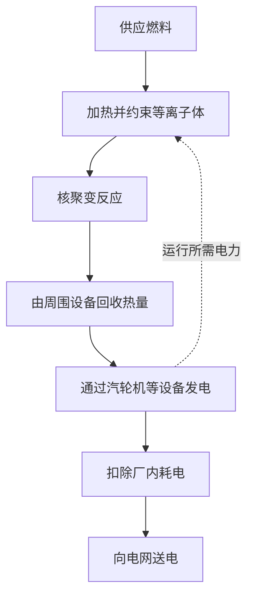
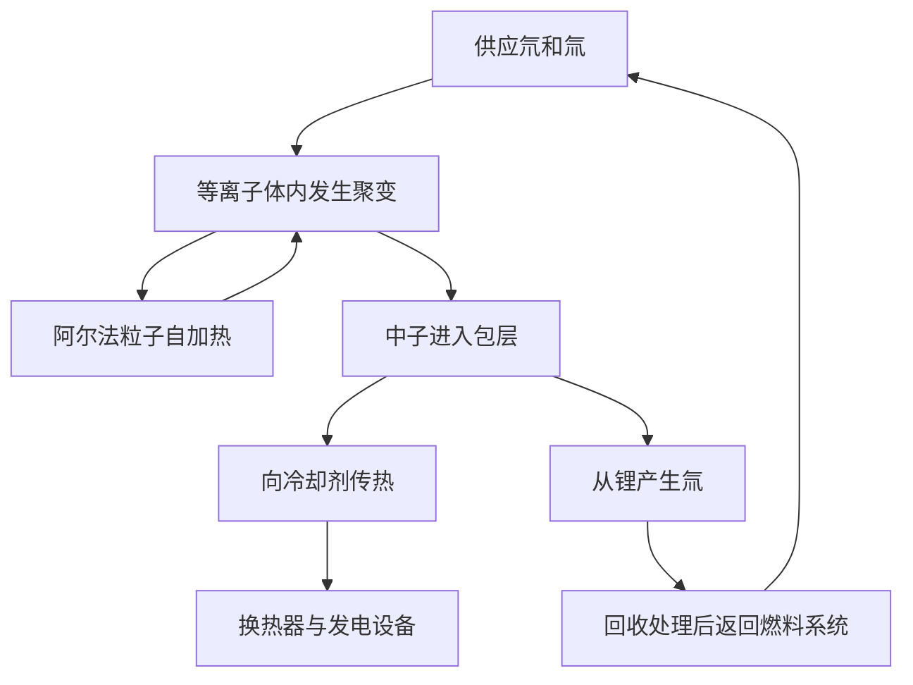

## 1. 发生聚变与实现发电之间，还有什么？

核聚变为太阳和其他恒星提供能量。如果能在地球上加以利用，就可能用少量燃料获得大量能量。但观察到聚变反应，与作为电力设施向用户供电，并不是同一回事。

这有点像点燃一团火与运营一座火电厂的区别。除了热源，还需要收集热量的设备、发电机、燃料供应、控制和维护。核聚变还增加了新的难题：怎样保持极高温的燃料，怎样保护材料免受反应中子的损伤。

理解研究进展时，要分清**反应能否发生、能量收支是否合算、能否作为电站运行**。一次实验成功可以是重要突破，却不代表其他条件已经全部满足。不能仅凭“理想能源”的印象判断技术成熟度。

本文以氘和氚这一重要燃料组合为主线。聚变有多种路线，我们需要理解某项实验究竟证明了什么，而不是把一台装置的纪录当成整个领域的成熟度。[美国能源部：聚变能源][doe-overview]

## 2. 裂变与聚变有什么区别？

裂变让重原子核分开，聚变让轻原子核结合。两种看似相反的过程都能释放能量，是因为不同原子核结构的能量不同。

质子和中子统称核子。每个核子的结合能，从轻核向中等质量原子核总体上升，在铁、镍附近达到较高水平。适当的轻核结合后，系统进入能量更低的状态，差额便被释放。不是任意原子核相结合都能放出能量。

$$
E=\Delta m c^2
$$

这里的 $\Delta m$ 是反应前后的静止质量差。并非全部燃料质量都变成电能，反应产物仍然存在。能量首先以产物运动等形式出现，之后才被回收为热或电。

裂变堆依靠中子引发后续裂变的链式反应。聚变的关键则是让反应核以足够高的频率彼此接近。不能因为都带有“核”字，就认为它们的停机机制和设备结构相同。[ITER：什么是聚变][fusion-basics]

## 3. 为什么选择氘和氚？

普通氢的原子核只有一个质子。氘有一个质子和一个中子，氚有一个质子和两个中子。同一元素中中子数不同的原子称为同位素。氘、氚分别记作 D、T，因此这一组合称为 D–T 反应。

$$
{}^{2}_{1}\mathrm{H}+{}^{3}_{1}\mathrm{H}
\rightarrow{}^{4}_{2}\mathrm{He}+{}^{1}_{0}\mathrm{n}+17.6\,\mathrm{MeV}
$$

产物是氦-4核和一个中子。当入射粒子的能量远小于反应能时，氦核获得约3.5 MeV，中子获得约14.1 MeV，总计约17.6 MeV。带电的氦核也叫阿尔法粒子。[卡尔斯鲁厄理工学院：氘氚反应的能量分配][dt-energy]

这种分配决定了电站设计。受磁场约束的阿尔法粒子能继续加热等离子体；不带电的中子无法以同样方式被约束，会飞向周围结构。**聚变能量的大部分需要在等离子体外部接收。**

氘氚受到广泛研究，是因为它比其他主要候选燃料更容易在相对较低的温度范围获得较高反应率。但反应容易与燃料容易供应并非一回事。氚具有放射性，需要供应、回收和增殖体系。氘氘、质子与硼等反应也在研究中，却不能在相同条件下直接替代氘氚。[ITER：实现条件与能量回收][making-work]

## 4. 为什么需要极高温度？

两个原子核都带正电，彼此靠近时会受到静电排斥。要发生聚变，必须接近到核力能够发挥作用的距离。升高温度使粒子运动更剧烈，能够参与反应的碰撞增多。

不过，“把所有粒子都加热到能用经典方式跨越势垒”也不准确。粒子能量具有分布，量子隧穿效应也参与决定反应概率。温度不是简单的开关，而是影响反应频率的因素。[CERN的ITER讲座：反应率与隧穿][fusion-lecture]

聚变研究有时用能量单位keV表示温度，实际指 $k_B T$，其中 $k_B$ 是玻尔兹曼常数。1 keV约对应1,160万K，10 keV约为1.16亿K。科普中的“一亿度”和论文中的“十几keV”并不是互不相干的描述。

太阳核心约为1,500万度，而地面磁约束氘氚研究常讨论一亿度左右甚至更高的温度。原因是地面并没有复制太阳的大小、重力、密度、燃料和反应路径。太阳主要通过从质子出发的反应链产生能量；地面则根据可实现的约束与反应率选择另一条路线。“人造太阳”是形象比喻，不是把太阳缩小后装进机器。[ITER：聚变基础][fusion-basics]、[美国能源部：燃烧等离子体][burning]

## 5. 等离子体不是高温固体

温度足够高时，电子与原子核分离，正离子和电子可以自由运动，形成等离子体。即使整体近似电中性，单个粒子仍然带电，会响应电场和磁场。

“装着一亿度物质的容器为什么不熔化？”这个问题很自然。磁约束高温等离子体与金属固体的密度和传热方式大不相同。温度反映单个粒子运动能量的尺度，不等于整个物体储存的热量。即便温度很高，粒子数量少时，其总能量也不同于同体积的高密度物质。

但这不意味着壁面问题消失。粒子、辐射和聚变中子仍会把能量送到结构上。磁场用于避免最热的中心等离子体直接接触材料，并不是制造完全绝热的盒子。

这一区分既解释了“高温为什么还能有容器”，也避免“所以壁面不需要担心”的误解。维持高温等离子体与管理壁面热负荷，是必须同时满足的不同要求。

## 6. 温度、密度和约束时间必须一起考虑

只有高温而粒子很少碰撞，不能产生足够聚变功率。只有高密度而燃料马上冷却或散开，也无法持续反应。因此，需要同时考虑温度 $T$、粒子密度 $n$ 和能量约束时间 $\tau_E$。

简单来说，能量约束时间是等离子体储能 $W$ 与损失功率 $P_{\mathrm{loss}}$ 的比值。

$$
\tau_E=\frac{W}{P_{\mathrm{loss}}}
$$

若储能为100 MJ、损失为50 MW，结果是2秒。这不表示等离子体必定在2秒后消失。漏水的浴缸只要持续补水，也能保持水位；同样，补充损失的能量可以让放电持续更久。**放电持续时间与能量约束时间不是同一个量。**

劳森判据根据聚变加热和损失的平衡，评估所需密度与约束条件。常用指标是三乘积 $nT\tau_E$。在接近有利温度的氘氚点火条件下，典型量级为数个 $10^{21}$ keV·s·m$^{-3}$，但具体要求取决于燃料、温度、目标增益和密度定义。不能把一个数字当成所有路线的统一及格线。[马克斯·普朗克等离子体物理研究所：聚变三乘积][triple-product]

| 物理量 | 表示什么 | 单凭它无法知道什么 |
|---|---|---|
| 温度 | 粒子运动能量的尺度 | 碰撞频率、反应能否持续 |
| 密度 | 单位体积的粒子数 | 温度是否足够、损失是否小 |
| 能量约束时间 | 储能与损失功率的比值 | 整次放电持续多久 |
| 放电持续时间 | 运行状态保持的时间 | 聚变功率和电力收支 |

## 7. 反应率公式告诉我们怎样理解燃料混合

对于高度简化的均匀氘氚等离子体，单位体积、单位时间内的反应数可以写成：

$$
R=n_D n_T\langle\sigma v\rangle
$$

$n_D$ 和 $n_T$ 分别是氘、氚的数密度，$\sigma$ 是反应截面，$v$ 是相对速度。尖括号表示对速度分布求平均。碰撞不是全以同一种速度发生，因此不能简单说反应率与温度成正比。

若固定燃料离子总密度 $n=n_D+n_T$，并保持其他条件相同，那么两种燃料各占一半时，乘积 $n_Dn_T$ 最大。只增加一方，会缺少配对对象，就像两组人两两搭档时，只扩大其中一组不一定能增加组数。

公式还显示：密度加倍，反应数可以变为四倍，但前提是温度等条件不变。现实中，提高密度也会改变压力、辐射损失和稳定性。不能只看一个因子就说“浓一点就全解决了”。研究也要分析一个性能改善后，其他条件怎样变化。[聚变增益与劳森判据研究论文][lawson-paper]

## 8. 磁场怎样约束等离子体？

带电粒子在电场和磁场中受到洛伦兹力。

$$
\mathbf{F}=q\left(\mathbf{E}+\mathbf{v}\times\mathbf{B}\right)
$$

磁场力弯曲粒子的运动轨迹，使它绕磁力线回旋并沿磁力线移动。静磁场产生的力垂直于速度，本身不直接做功加热粒子。因此，约束磁场与加热设备的作用应当分开理解。

粒子容易沿磁力线运动，所以简单的直线磁场存在端部逃逸问题。把路径闭合成环可以消除端部，但磁场曲率和强度差异又会造成漂移。因此需要让磁力线扭转，并建立能够整体平衡粒子运动和压力的结构。

“用磁铁悬浮”背后包含回旋、磁场形状、电流、压力与不稳定性。并非只要磁场足够强，任意等离子体就都能长期保持。[普林斯顿等离子体物理实验室：等离子体与磁约束][magnetic]

## 9. 托卡马克与仿星器的区别

托卡马克是环形装置，把外部线圈产生的磁场与等离子体自身电流产生的磁场结合起来。等离子体电流对约束结构很重要，但维持大电流以及保护设备免受骤变影响，也带来额外要求。

像变压器那样感应电流，会对连续运行形成限制。因此，人们研究利用波和粒子束等方式进行非感应电流驱动。说托卡马克必定只能短时运行不对，认为通上电流就能无限持续也不对。

仿星器主要用三维外部线圈形成磁力线的扭转。约束不依赖大等离子体电流，有利于稳态运行；相应地，复杂线圈的设计、制造、位置精度和粒子损失控制变得重要。[马克斯·普朗克等离子体物理研究所：仿星器][stellarator]

| 角度 | 托卡马克 | 仿星器 |
|---|---|---|
| 磁力线扭转 | 外部线圈与等离子体电流共同形成 | 主要由三维外部线圈形成 |
| 长时间运行课题 | 电流维持、稳定性、排热 | 磁场优化、制造、排热 |
| 几何特征 | 大体轴对称 | 复杂三维结构 |
| 共同课题 | 燃料、材料、热回收、维护、电力收支 | 燃料、材料、热回收、维护、电力收支 |

不能简单认定只有一种路线正确。除了等离子体性能，还要比较能否建造、维修并长期可靠运行。

## 10. 外部加热与能够自加热的等离子体

托卡马克可以利用等离子体电流进行电阻加热，但温度上升后电阻下降，单靠这种方法很难达到更高温度，需要额外输入能量。

一种方法是中性束注入。高能中性粒子不易被约束磁场偏转，进入等离子体后通过电离和碰撞传递能量。另一种方法使用射频或微波，通过波与粒子运动的相互作用加热。两者都不能把设备消耗的全部电力转化为等离子体热量。[ITER：外部加热系统][heating]

随着氘氚反应增多，产生的阿尔法粒子提供的自加热越来越重要。自加热占主导的状态称为燃烧等离子体。“燃烧”在这里不是与氧气反应的化学燃烧。

在磁约束中，点火理想地表示聚变产物的加热无需外部加热就能补偿损失。但这不意味着泵、制冷机和控制系统也不用电。等离子体自持与整座电站电力自给，使用的是不同的评价边界。[美国能源部：燃烧等离子体][burning]

## 11. 激光聚变利用极短的时间窗口

磁约束试图让相对低密度的高温等离子体维持较长时间；惯性约束则把少量燃料压缩到高密度，在其膨胀前的短暂时段内发生反应。激光是提供驱动能量的一种代表性手段。

美国国家点火装置NIF研究用激光压缩和加热微小燃料靶。一次短暂实验形成有利物理条件，与电站重复执行这一过程之间存在差距。还需要可靠地批量制造、输送和照射燃料靶，处理产物与热量，再准备下一次反应。

2022年12月5日，NIF实验以到达靶的2.05 MJ激光能量，产生3.15 MJ聚变能。这一历史性结果证明靶增益超过1，并不代表把整个激光设施耗电算进去之后已经实现净发电。[劳伦斯利弗莫尔国家实验室：点火实验的验证][nif]

假设每次反应产生100 MJ、每秒运行5次，平均聚变功率就是500 MW。但这只是虚构的算术例子，不表示重复频率、靶成本、激光效率和设备寿命已经同时实现。瞬时峰值功率、每次脉冲的能量和时间平均功率应当区分。

## 12. “投入的十倍”，究竟以什么投入为准？

聚变新闻中的能量增益尤其值得注意。磁约束的等离子体增益 $Q$ 通常用聚变功率除以送入等离子体的外部加热功率。

$$
Q=\frac{P_{\mathrm{fusion}}}{P_{\mathrm{heat}}}
$$

ITER的目标是以50 MW外部加热获得500 MW聚变功率，即 $Q=10$。这是研究装置的目标，不是已经取得的商业发电业绩。ITER也不是把这些热量发成电出售给电网的装置。[ITER：项目目标][iter-goals]

为什么 $Q=10$ 不等于“投入一份电，输出十份电”？因为加热设备从电力到等离子体加热存在损失，聚变能量主要先变成可回收热量，发电还会产生损失。制冷、真空泵、冷却和燃料处理也都耗电。

构造一个教学模型：聚变功率1,000 MW、$Q=10$，外部加热就是100 MW。假设加热系统从电力到等离子体的效率为50%，需要200 MW电力。若保守地只把聚变功率按40%效率转成电，可得400 MW。再扣去加热的200 MW和其他厂内消耗100 MW，只剩100 MW可送出。

$$
P_{\mathrm{net}}\approx\eta_e P_{\mathrm{fusion}}
-\frac{P_{\mathrm{fusion}}}{Q\eta_h}-P_{\mathrm{aux}}
$$

这个模型省略了外部加热最终作为热被回收，以及包层内其他反应放热，只用于说明边界，不是实际电站估算。相同假设下，若 $Q=5$，加热耗电变成400 MW，净值就是负100 MW。**等离子体中的能量增益，不等于能够送入电网的电力。**

| 指标 | 输入侧边界 | 能说明什么 |
|---|---|---|
| 等离子体增益 | 进入等离子体的加热功率 | 与聚变功率的比值 |
| 靶增益 | 到达靶的驱动能量 | 与单次聚变能量的比值 |
| 净电力 | 整座电站耗电 | 能否对外送电 |
| 经济性 | 建造、运行、燃料、维护等费用 | 能否作为供电业务成立 |

## 13. 包层既收集热量，也生产燃料

氘氚中子不带电，会穿过约束磁场。与周围材料作用后，其动能转化为热。聚变电站中接收这部分能量的重要部件，是围绕等离子体的包层。

包层不只是隔热材料。其设计可以结合热回收、保护外侧磁体的屏蔽，以及氚燃料生产。中子与含锂材料反应产生氚，再将氚提取并返回燃料系统。

这些功能会竞争设计空间。屏蔽越厚，磁体越容易得到保护，但尺寸和重量也增加。诊断或加热需要的开口，不能同时填满增殖材料。方便取热的结构，也未必最适合高效利用中子。

ITER计划通过增殖包层试验模块，在真实聚变环境中验证相关技术。有试验模块与整座电站已经实现燃料自给，不是同一个阶段。[ITER：氚增殖][breeding]

## 14. “海水就是燃料”还不是完整解释

氘可以从水中获得，但氘氚反应也需要氚。氚具有放射性，半衰期约12.3年，自然界并没有大量长期积累的氚燃料库存。因此，长期运行需要增殖和回收体系。[ITER：聚变术语表][glossary]

氚增殖比是所产生氚与聚变消耗氚的比值。看起来达到1就够了，但实际还要考虑回收延迟、处理与材料滞留、损失、放射性衰变，以及下一座装置启动所需库存。

即使使用多少燃料以后就能返还多少，在等待返还期间仍需要库存继续运行。这是包含时间的收支问题，无需先掌握详细化学过程也能理解。年产量与年消耗相等，不保证每个时刻都不缺燃料。

注入等离子体的燃料也不会一次全部反应。未反应燃料、氦和其他物质必须排出、分离，再把可用燃料送回。“反应消耗量”“系统循环流量”和“设施总库存”是三个不同量。消耗量小，并不意味着处理设备一定小而简单。

资源丰富是优势，却不能省掉把资源制成燃料、送到所需位置并回收的技术。[IAEA：氘氚燃料循环的物理与技术][fuel-cycle]

## 15. 既要保住热，又要把热取出来

聚变电站面对两个看似相反的要求：尽量不让高温中心等离子体散热，同时又要可靠回收离开它的能量，并让壁温保持在允许范围。

在等离子体边缘，需要排出类似灰烬的氦、杂质和热量。托卡马克中的偏滤器承担其中一部分工作。如同出口处流动集中，狭小表面可能承受很大热负荷。即便等离子体能长时间维持，若部件很快被热损坏，电站仍不能长期运行。

热流密度是单位面积接收的热功率。ITER偏滤器设计使用约10 MW/m$^2$量级的稳态热负荷。换算到边长10 cm的正方形，就有100 kW，说明很小面积也需要强大的散热能力。[ITER：偏滤器][divertor]

使用高熔点钨还不够。热需要从表面通过结构和接头进入冷却剂，还要考虑反复热载荷、侵蚀，以及壁面物质进入等离子体造成的污染。杂质可能增加辐射损失，因此材料与等离子体相互影响。

达到最高温度与让部件以可接受周期更换并运行，是不同能力。这也是不能凭一项纪录判断商业化距离的原因。

## 16. 中子在带来热量的同时，也改变材料

高能氘氚中子能够提供热量，但也会把结构材料中的原子撞离原位。核反应还可能在材料内部生成其他元素和气体。这些变化可导致脆化、肿胀和导热性能变化。

仅把材料放进高温炉，不能重现这一环境。热、机械载荷、中子辐照以及与冷却剂的化学作用同时存在。必须结合实验和模拟预测寿命，并用适当数据验证预测。[IAEA：聚变材料辐照损伤][materials]

中子还会使材料活化。因此，“聚变完全没有放射性废物”并不准确。核素、数量和管理年限取决于选材、辐照条件、运行历史与处置方式。低活化材料研究旨在同时改善性能和未来管理负担。

维护也因此需要远程操作。在人员难以接近的环境中拆卸大型部件、精确连接替换件并检查，并不容易。能组装不代表容易维修。除了可靠性，故障或到寿命后多久能恢复运行，也决定发电量和成本。

停机特性与裂变不同，不等于所有危险都消失。氚、活化材料、储存的磁能、高温高压流体，都要按照各自性质管理。[ITER：安全与环境问答][safety]

## 17. 超导磁体仍属于耗电设备体系

强磁场需要大电流。在合适条件下，超导材料能大幅降低直流电阻，有助于高效维持强磁场。但整座电站不会因此不耗电。

超导状态需要低温。ITER磁体设计工作温度约为4 K。高温等离子体附近存在极低温磁体，所以真空绝热、热屏蔽、制冷机和低温管路都很重要。要发挥材料性质，还需要大量外围工程。[ITER：低温系统][cryogenics]

“高温超导”也不等于常温使用，而是相对传统材料能在更高温度保持超导。在高磁场、大电流条件下，冷却和保护仍然必要。磁体承受巨大力，其储能在异常状态下也必须妥善处理。

真空泵、燃料处理、冷却、计算机和控制系统都消耗电力。漂亮的发光等离子体画面之外，正是这些设备支持持续运行。只围住等离子体计算能量收支，会把这部分负担隐藏起来。[ITER：磁体][magnets]、[供电系统][power-supply]

## 18. 测量不可直接触及的等离子体，并用模型理解

温度、密度、磁场、辐射和反应产物需要多种诊断方法。不能简单把温度计插到中心，而要通过光、电磁波、粒子和磁信号等推断内部状态。

一项测量也未必代表整体。中心和边缘条件不同，并随时间变化。如果测量得到的是视线方向的积分信息，恢复空间分布还需要额外假设或其他观测。仪器误差与模型假设应分开评价。[ITER：诊断系统][diagnostics]

模拟有助于研究湍流、粒子输运、磁场结构和材料响应。但在计算机上画出反应，不等于装置已经完成。必须说明模型能重现哪些条件、哪些尚未验证，并与实验对照。

机器学习用于控制或预测时也一样。对历史数据预测良好，不代表进入未知运行区域或传感器故障时仍然可靠。计算方法进步并不会让燃料、材料和排热问题自动消失。聚变是连接测量、物理与工程的系统，而不是一个聪明算法就能完成的机器。

## 19. 从恒星之谜到地面受控反应

20世纪初，太阳为什么能长期发光是重大问题，化学燃烧不足以解释。1920年，爱丁顿提出氢转化为氦可能为恒星供能。随后，原子核研究与恒星内部理论逐渐结合。

1934年，奥利芬特、哈特克和卢瑟福开展的氘实验，拓展了实验室研究轻核反应的道路。贝特等人关于恒星能量产生的理论工作，也进一步连接了核反应与宇宙认识。[ITER：早期聚变史][history-early]

20世纪50年代，研究开始探索把地面受控聚变作为能源。部分早期工作保密进行，1958年日内瓦国际会议成为公开研究和国际合作的重要节点。等离子体不稳定性与损失，比简单估计显示的更难处理。[IAEA：聚变合作史][history-cooperation]

磁场配置、加热、真空、超导、诊断和计算的改进，逐步通向今天的大型实验。ITER整合研究燃烧等离子体及相关技术，NIF点火则是惯性约束的重要实证。它们使用不同方法和评价边界，不是可以直接比较的同一种分数。

| 历史阶段 | 要回答的问题 | 下一步挑战 |
|---|---|---|
| 恒星能源 | 太阳为何长期发光？ | 定量理解核反应 |
| 实验室核反应 | 能否观察轻核反应？ | 形成宏观能源 |
| 受控聚变 | 能否维持高温燃料？ | 抑制损失与不稳定性 |
| 高增益实证 | 聚变加热能否占主导？ | 燃料、材料、重复及长时间运行 |
| 电站实证 | 能否持续供应净电力？ | 可靠性、维护、成本和社会条件 |

把长期研究解释成“聚变一直做不出来”是不对的。反应可以发生；难的是同时满足规模、持续时间、燃料、材料和成本要求。

## 20. 阅读商业化新闻的六个角度

不必低估进步，也不要悄悄把一项纪录换成另一种成就。六个问题有助于分清成果和剩余任务。

1. **测量了什么？** 温度、持续时间、反应能量、增益、净电力是不同指标。
2. **分母在哪里？** 不要混淆等离子体加热、到达靶的激光能和全设施耗电。
3. **使用什么燃料和条件？** 氢或氘等离子体控制，与大功率氘氚反应的成果承担不同角色。
4. **一次成功还是可重复运行？** 除最大值外，还要看稳定性、停机时间和部件寿命。
5. **能否供应燃料和替换件？** 包括增殖、回收、制造、更换和废物管理。
6. **计划还是经过验证的实绩？** 未来日期和成本应检查依据与前提。

经济性也取决于全年可销售电量。净输出500 MW的设备，在平年若容量因子为50%，发电量约2.19 TWh；若为80%，约3.50 TWh。这是展示同一额定功率下运行和维护如何影响电量，不是对聚变电站容量因子的预测。

装置更小不代表一切更便宜。制造费可能下降，但热会集中于更小面积，部件更换可能更难。更大的装置也许有利于约束，却增加建造和制造负担。尺寸、物理性能、可维护性和成本必须一起设计。

聚变的吸引力在于从轻核获得大量能量的可能性。但能否实现，不仅取决于最高等离子体温度。**产生热、取出热、回收燃料、更换部件，并长期送出超过自身消耗的电力。** 把这些环节作为整体看待，才能更具体地理解研究已经做到什么，下一步要解决什么。

## 参考资料与图示范围

反应能量和历史成果依据下列科研机构与国际组织资料。计算例中的效率、厂内消耗、重复频率和容量因子都是明确给出的教学假设，并非特定电站预测。AI生成的封面是概念插图，其中线圈、管道和发光颜色不代表工程设计。

- [美国能源部：聚变能源][doe-overview]、[燃烧等离子体][burning]
- [ITER：聚变基础][fusion-basics]、[实现条件][making-work]、[目标][iter-goals]、[术语表][glossary]
- [ITER：加热][heating]、[增殖][breeding]、[偏滤器][divertor]、[诊断][diagnostics]、[磁体][magnets]、[低温][cryogenics]、[供电][power-supply]、[安全][safety]
- [马克斯·普朗克研究所：三乘积][triple-product]、[仿星器][stellarator]、[普林斯顿实验室：磁约束][magnetic]
- [劳森判据与增益论文][lawson-paper]、[LLNL：2022年点火][nif]
- [IAEA：氘氚燃料循环][fuel-cycle]、[材料损伤][materials]、[合作史][history-cooperation]、[ITER：早期历史][history-early]
- [KIT：氘氚能量分配][dt-energy]、[CERN的ITER讲座：聚变物理][fusion-lecture]

[doe-overview]: https://www.energy.gov/topics/fusion-energy
[fusion-basics]: https://www.iter.org/fusion-energy/what-fusion
[making-work]: https://www.iter.org/fusion-energy/making-it-work
[burning]: https://www.energy.gov/science/doe-explainsburning-plasma
[triple-product]: https://www.ipp.mpg.de/83115/fusionsprodukt
[lawson-paper]: https://arxiv.org/abs/2105.10954
[magnetic]: https://w3.pppl.gov/scied/docs/undergrad_level_general_Plasma_Fusion_PPPL/Plasma_fusion_pppl.pdf
[stellarator]: https://www.ipp.mpg.de/9792/stellarator
[heating]: https://www.iter.org/machine/supporting-systems/external-heating-systems
[nif]: https://www.llnl.gov/article/50801/llnls-breakthrough-ignition-experiment-highlighted-physical-review-letters
[iter-goals]: https://www.iter.org/fusion-energy/what-will-iter-do
[breeding]: https://www.iter.org/machine/supporting-systems/tritium-breeding
[glossary]: https://www.iter.org/fusion-glossary
[fuel-cycle]: https://www-pub.iaea.org/MTCD/publications/PDF/TE-2076web.pdf
[divertor]: https://www.iter.org/machine/divertor
[materials]: https://nucleus-qa.iaea.org/sites/fusionportal/Pages/DPWS-6/Topics.aspx
[safety]: https://www.iter.org/faqs?thematic=75
[cryogenics]: https://www.iter.org/machine/supporting-systems/cryogenics
[magnets]: https://www.iter.org/machine/magnets
[power-supply]: https://www.iter.org/machine/supporting-systems/power-supply
[diagnostics]: https://www.iter.org/machine/supporting-systems/diagnostics
[history-early]: https://www.iter.org/node/20687/who-invented-fusion
[history-cooperation]: https://nucleus.iaea.org/sites/fusion-portal/SitePages/A-brief-history-of-nuclear-fusion.aspx?web=1
[dt-energy]: https://publikationen.bibliothek.kit.edu/1000161936/151265654
[fusion-lecture]: https://indico.cern.ch/event/116345/attachments/53370/76726/Campbell_ITER26Fusion-1_CERN_Apr11.pdf
