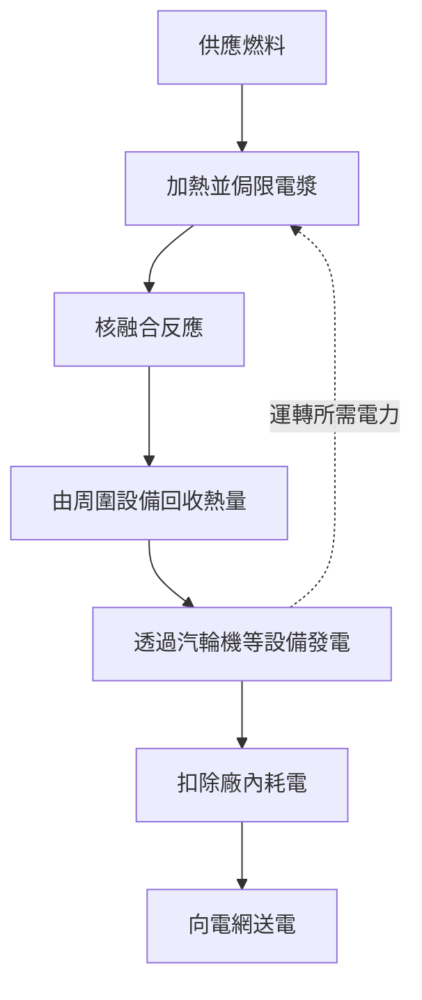
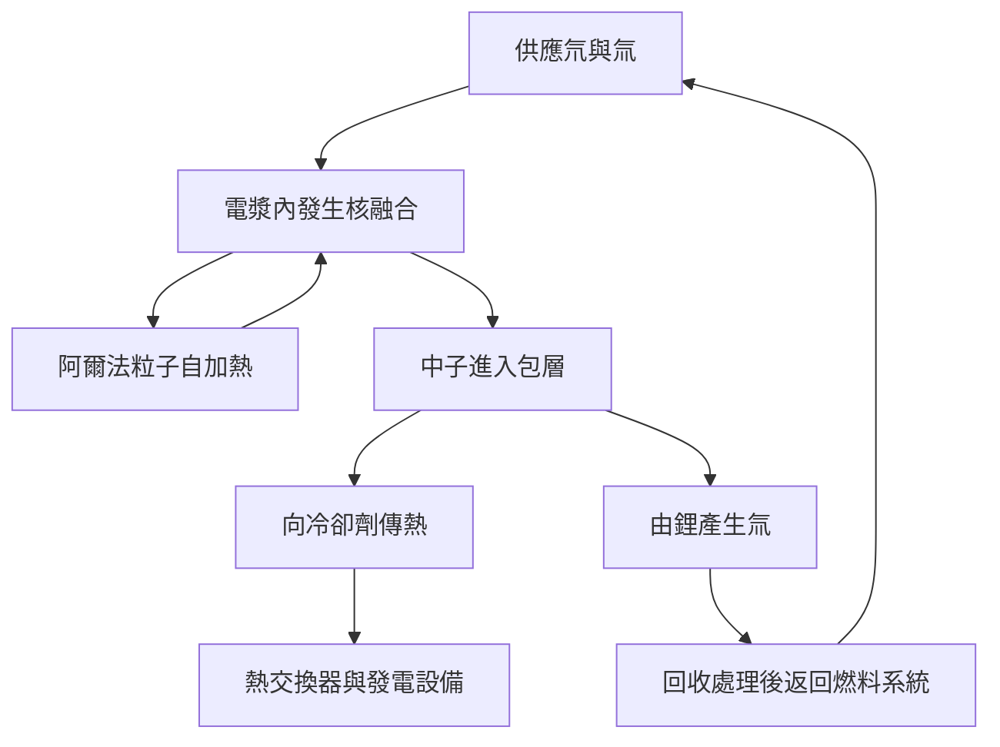

## 1. 發生核融合，與實現發電之間還有什麼？

核融合為太陽與其他恆星提供能量。如果能在地球上加以利用，就可能以少量燃料取得大量能量。但觀察到核融合反應，與作為電力設施向用戶供電，並不是同一件事。

這有點像點燃一團火與營運一座火力電廠的差別。除了熱源，還需要收集熱量的設備、發電機、燃料供應、控制與維護。核融合又增加了新的難題：如何維持極高溫的燃料，如何保護材料免受反應中子的損傷。

理解研究進展時，要分清**反應能否發生、能量收支是否有利、能否作為電廠運轉**。一次實驗成功可以是重要突破，卻不代表其他條件都已滿足。不能只憑「理想能源」的印象判斷成熟度。

本文以氘與氚這個重要燃料組合為主軸。核融合有多種路線，需要理解某項實驗究竟證明什麼，而不是把一台裝置的紀錄當成整個領域的成熟度。[美國能源部：核融合能源][doe-overview]

## 2. 核分裂與核融合有何不同？

核分裂讓重原子核分開，核融合讓輕原子核結合。兩種看似相反的過程都能釋放能量，是因為不同原子核結構具有不同能量。

質子與中子統稱核子。每個核子的束縛能，從輕核朝中等質量原子核大致增加，在鐵、鎳附近達到較高水準。適當的輕核結合後，系統進入較低能量的狀態，差額便被釋放。並非任意原子核結合都會放出能量。

$$
E=\Delta m c^2
$$

這裡的 $\Delta m$ 是反應前後的靜止質量差。不是全部燃料質量都變成電能，反應產物仍然存在。能量先以產物運動等形式出現，之後才回收為熱或電。

核分裂反應爐依靠中子引發後續分裂的連鎖反應。核融合的關鍵則是讓反應核以足夠高的頻率彼此接近。不能因為都帶有「核」字，就認為停機機制與設備結構相同。[ITER：什麼是核融合][fusion-basics]

## 3. 為什麼選擇氘與氚？

一般氫的原子核只有一個質子。氘有一個質子與一個中子，氚有一個質子與兩個中子。同一元素中中子數不同的原子稱為同位素。氘、氚分別記作 D、T，因此這個組合稱為 D–T 反應。

$$
{}^{2}_{1}\mathrm{H}+{}^{3}_{1}\mathrm{H}
\rightarrow{}^{4}_{2}\mathrm{He}+{}^{1}_{0}\mathrm{n}+17.6\,\mathrm{MeV}
$$

產物是氦-4核與一個中子。當入射粒子能量遠小於反應能時，氦核取得約3.5 MeV，中子取得約14.1 MeV，總計約17.6 MeV。帶電氦核也稱為阿爾法粒子。[卡爾斯魯厄理工學院：氘氚反應的能量分配][dt-energy]

這種分配影響電廠設計。受磁場侷限的阿爾法粒子可以繼續加熱電漿；不帶電的中子無法以同樣方式侷限，會飛向周圍結構。**核融合能量的大部分，需要在電漿外部接收。**

氘氚受到廣泛研究，是因為比其他主要候選燃料更容易在相對較低的溫度範圍取得高反應率。但容易反應與容易供應燃料是兩件事。氚具有放射性，需要供應、回收與增殖系統。氘氘、質子與硼等反應也在研究中，卻不能在相同條件下直接取代氘氚。[ITER：實現條件與能量回收][making-work]

## 4. 為何需要極高溫度？

兩個原子核都帶正電，靠近時會受到靜電排斥。核融合必須讓它們接近到核力能發揮作用的距離。提高溫度讓粒子運動更劇烈，增加能參與反應的碰撞。

不過，「把所有粒子都加熱到能以古典方式跨越位障」也不準確。粒子能量具有分布，量子穿隧效應也參與決定反應機率。溫度不是簡單開關，而是影響反應頻率的因素。[CERN的ITER講座：反應率與穿隧][fusion-lecture]

研究有時用能量單位keV表示溫度，實際指 $k_B T$，其中 $k_B$ 是波茲曼常數。1 keV約對應1,160萬K，10 keV約為1.16億K。科普中的「一億度」與論文中的「十幾keV」，不是互不相干的描述。

太陽核心約為1,500萬度，而地面磁侷限氘氚研究常討論一億度左右甚至更高的溫度。地面並沒有複製太陽的大小、重力、密度、燃料與反應路徑。太陽主要透過從質子出發的反應鏈產生能量；地面則依照能實現的侷限與反應率選擇另一條路線。「人造太陽」是形象比喻，不是把太陽縮小後裝進機器。[ITER：核融合基礎][fusion-basics]、[美國能源部：燃燒電漿][burning]

## 5. 電漿不是高溫固體

溫度足夠高時，電子與原子核分離，正離子與電子可以自由運動，形成電漿。即使整體近似電中性，個別粒子仍帶電，會回應電場與磁場。

「裝著一億度物質的容器，為什麼不熔化？」這個問題很自然。磁侷限高溫電漿與金屬固體的密度、傳熱方式差異很大。溫度反映單一粒子運動能量的尺度，不等於整個物體儲存的熱量。即使非常熱，只要粒子少，其總能量也不同於同體積的高密度物質。

但這不表示壁面問題消失。粒子、輻射與核融合中子仍把能量送到結構上。磁場用於避免最熱的中心電漿直接接觸材料，並非製造完全絕熱的盒子。

這個區分既解釋「高溫為何還能有容器」，也避免「所以壁面不必擔心」的誤解。維持高溫電漿與管理壁面熱負載，是必須同時滿足的不同要求。

## 6. 溫度、密度與侷限時間必須一起考慮

只有高溫而粒子很少碰撞，無法產生足夠核融合功率。只有高密度，燃料卻馬上冷卻或散開，也不能持續反應。因此，需要一起考慮溫度 $T$、粒子密度 $n$ 與能量侷限時間 $\tau_E$。

簡單來說，能量侷限時間是電漿儲能 $W$ 與損失功率 $P_{\mathrm{loss}}$ 的比值。

$$
\tau_E=\frac{W}{P_{\mathrm{loss}}}
$$

若儲能為100 MJ、損失為50 MW，結果是2秒。這不表示電漿一定在2秒後消失。漏水浴缸只要持續補水，也能保持水位；同樣，補充損失能量就能讓放電維持更久。**放電持續時間與能量侷限時間是不同物理量。**

勞森判據依據核融合加熱與損失的平衡，評估所需密度和侷限條件。常用指標是三乘積 $nT\tau_E$。在接近有利溫度的氘氚點火條件下，典型量級為數個 $10^{21}$ keV·s·m$^{-3}$，但要求會隨燃料、溫度、目標增益與密度定義改變。不能把一個數字當成所有路線的統一及格線。[馬克斯・普朗克電漿物理研究所：核融合三乘積][triple-product]

| 物理量 | 表示什麼 | 單憑它無法知道什麼 |
|---|---|---|
| 溫度 | 粒子運動能量的尺度 | 碰撞頻率、反應能否持續 |
| 密度 | 單位體積的粒子數 | 溫度是否足夠、損失是否小 |
| 能量侷限時間 | 儲能與損失功率的比值 | 整次放電持續多久 |
| 放電持續時間 | 運轉狀態維持的時間 | 核融合功率與電力收支 |

## 7. 反應率公式如何解釋燃料混合？

對高度簡化的均勻氘氚電漿，單位體積、單位時間內的反應數可以寫成：

$$
R=n_D n_T\langle\sigma v\rangle
$$

$n_D$ 與 $n_T$ 分別是氘、氚的數密度，$\sigma$ 是反應截面，$v$ 是相對速度。角括號表示對速度分布取平均。碰撞並非都以同一速度發生，所以不能簡單說反應率與溫度成正比。

若固定燃料離子總密度 $n=n_D+n_T$，其他條件也相同，兩者各占一半時，乘積 $n_Dn_T$ 最大。只增加其中一方，會缺少配對對象。就像兩組人兩兩搭檔，只擴大一組不一定能增加組數。

公式也顯示：密度加倍，反應數可成為四倍，但前提是溫度等條件不變。現實中，密度上升也會改變壓力、輻射損失與穩定性。不能只看單一因子就說「濃一點就解決了」。研究也要分析一項性能改善後，其他條件如何改變。[核融合增益與勞森判據研究論文][lawson-paper]

## 8. 磁場如何侷限電漿？

帶電粒子在電場與磁場中受到勞侖茲力。

$$
\mathbf{F}=q\left(\mathbf{E}+\mathbf{v}\times\mathbf{B}\right)
$$

磁場力彎曲粒子的運動軌跡，使它繞磁力線迴旋並沿磁力線移動。靜磁場產生的力垂直於速度，本身不直接作功加熱粒子。因此，侷限磁場與加熱設備的作用必須分開理解。

粒子容易沿磁力線運動，簡單直線磁場因此有端部逃逸問題。把路徑閉合成環能消除端部，但磁場曲率與強度差異又會造成漂移。所以需要讓磁力線扭轉，建立能整體平衡粒子運動與壓力的結構。

「用磁鐵懸浮」背後包括迴旋、磁場形狀、電流、壓力與不穩定性。不是只要磁場夠強，任意電漿就能長期維持。[普林斯頓電漿物理實驗室：電漿與磁侷限][magnetic]

## 9. 托卡馬克與仿星器的差別

托卡馬克是環形裝置，將外部線圈的磁場與電漿自身電流產生的磁場結合。電漿電流對侷限結構很重要，但維持大電流、保護設備免受驟變影響，也帶來額外需求。

像變壓器一樣感應電流，會限制連續運轉。因此研究也使用波或粒子束等非感應電流驅動方法。說托卡馬克一定只能短時間運轉不對，認為通電後就能無限持續也不對。

仿星器主要使用三維外部線圈，形成磁力線的扭轉。不依賴大電漿電流來維持侷限，有利於穩態運轉；相對地，複雜線圈的設計、製造、定位精度與粒子損失控制變得重要。[馬克斯・普朗克電漿物理研究所：仿星器][stellarator]

| 角度 | 托卡馬克 | 仿星器 |
|---|---|---|
| 磁力線扭轉 | 外部線圈與電漿電流共同形成 | 主要由三維外部線圈形成 |
| 長時間運轉課題 | 電流維持、穩定性、排熱 | 磁場最佳化、製造、排熱 |
| 幾何特徵 | 大致軸對稱 | 複雜三維結構 |
| 共同課題 | 燃料、材料、熱回收、維護、電力收支 | 燃料、材料、熱回收、維護、電力收支 |

不能簡單認定只有一條路線正確。除了電漿性能，還要比較能否建造、維修並長期可靠運轉。

## 10. 外部加熱與能夠自加熱的電漿

托卡馬克可以利用電漿電流進行電阻加熱，但溫度升高後電阻下降，單靠這個方法難以達到更高溫度，需要額外輸入能量。

一種方法是中性束注入。高能中性粒子不容易被侷限磁場偏轉，進入電漿後透過游離與碰撞傳遞能量。另一種方法使用射頻或微波，透過波與粒子運動的交互作用加熱。兩者都不能把設備消耗的全部電力轉成電漿熱量。[ITER：外部加熱系統][heating]

隨氘氚反應增加，阿爾法粒子提供的自加熱愈來愈重要。自加熱占主導的狀態稱為燃燒電漿。「燃燒」在這裡不是與氧氣反應的化學燃燒。

磁侷限中的點火，理想上表示核融合產物的加熱，不靠外部加熱也能補償損失。但這不表示幫浦、冷凍機與控制系統也不用電。電漿自持與整座電廠電力自給，使用不同的評估邊界。[美國能源部：燃燒電漿][burning]

## 11. 雷射核融合利用極短的時間窗口

磁侷限試圖讓相對低密度的高溫電漿維持較長時間；慣性侷限則將少量燃料壓縮到高密度，在它膨脹前的短暫期間反應。雷射是提供驅動能量的一種代表性方法。

美國國家點火設施NIF研究用雷射壓縮、加熱微小燃料靶。一次短暫實驗形成有利物理條件，與電廠反覆執行仍有距離。還需要可靠地大量製造、輸送和照射燃料靶，處理產物與熱量，再準備下一次反應。

2022年12月5日，NIF實驗以抵達靶的2.05 MJ雷射能量，產生3.15 MJ核融合能。這個歷史性成果證明靶增益超過1，並不代表把整個雷射設施耗電納入後已經實現淨發電。[勞倫斯利佛摩國家實驗室：點火實驗的驗證][nif]

假設每次反應產生100 MJ、每秒進行5次，平均核融合功率就是500 MW。但這只是虛構的算術例子，不表示重複頻率、靶成本、雷射效率與設備壽命都已同時達成。瞬間峰值功率、每次脈衝能量與時間平均功率應分開看。

## 12. 「投入的十倍」，究竟以哪個投入為準？

核融合新聞的能量增益尤其值得注意。磁侷限的電漿增益 $Q$ 通常是核融合功率除以送入電漿的外部加熱功率。

$$
Q=\frac{P_{\mathrm{fusion}}}{P_{\mathrm{heat}}}
$$

ITER的目標是用50 MW外部加熱取得500 MW核融合功率，即 $Q=10$。這是研究裝置的目標，不是已完成的商業發電實績。ITER也不是把這些熱量轉成電力賣給電網的裝置。[ITER：計畫目標][iter-goals]

為什麼 $Q=10$ 不等於「投入一份電，輸出十份電」？加熱設備從電力到電漿加熱有損失；核融合能量主要先成為可回收熱量，發電還有損失。冷凍、真空幫浦、冷卻和燃料處理也都耗電。

建立一個教學模型：核融合功率1,000 MW、$Q=10$，外部加熱就是100 MW。假設加熱系統從電力到電漿的效率為50%，就需要200 MW電力。若保守地只把核融合功率以40%效率發電，可得400 MW。扣掉加熱的200 MW與其他廠內消耗100 MW，只剩100 MW可以送出。

$$
P_{\mathrm{net}}\approx\eta_e P_{\mathrm{fusion}}
-\frac{P_{\mathrm{fusion}}}{Q\eta_h}-P_{\mathrm{aux}}
$$

這個模型省略外部加熱最終作為熱被回收，以及包層內其他反應熱，只用來說明邊界，不是實際電廠估算。同樣假設下，若 $Q=5$，加熱耗電變成400 MW，淨值就是負100 MW。**電漿中的能量增益，不等於能送入電網的電力。**

| 指標 | 輸入端邊界 | 能說明什麼 |
|---|---|---|
| 電漿增益 | 進入電漿的加熱功率 | 與核融合功率的比值 |
| 靶增益 | 抵達靶的驅動能量 | 與單次核融合能量的比值 |
| 淨電力 | 整座電廠耗電 | 能否對外送電 |
| 經濟性 | 建造、運轉、燃料、維護等費用 | 能否成為可行的供電事業 |

## 13. 包層既收集熱量，也生產燃料

氘氚中子不帶電，會穿過侷限磁場。與周圍材料作用後，動能轉為熱。核融合電廠接收這部分能量的重要部件，是包圍電漿的包層。

包層不只是隔熱材料。其設計可結合熱回收、保護外側磁體的屏蔽，以及氚燃料生產。中子與含鋰材料反應產生氚，再將氚提取並送回燃料系統。

這些功能會競爭設計空間。屏蔽愈厚，磁體愈容易受保護，但尺寸與重量也增加。診斷或加熱所需開口，不能同時填滿增殖材料。方便取熱的結構，也未必最適合有效利用中子。

ITER計畫透過增殖包層試驗模組，在真實核融合環境驗證相關技術。有試驗模組，與整座電廠已經實現燃料自給，是不同階段。[ITER：氚增殖][breeding]

## 14. 「海水就是燃料」還不是完整說明

氘可以從水中取得，但氘氚反應也需要氚。氚有放射性，半衰期約12.3年，自然界沒有大量長期累積的氚燃料庫存。因此，長期運轉需要增殖和回收系統。[ITER：核融合詞彙表][glossary]

氚增殖比是產生氚與核融合消耗氚的比值。看來達到1就夠了，但實際還要考慮回收延遲、處理與材料滯留、損失、放射性衰變，以及下一座裝置啟動所需庫存。

即使用掉多少燃料以後就能拿回多少，等待期間仍需要庫存繼續運轉。這是包含時間的收支問題，不必先了解詳細化學過程也能理解。年產量和年消耗相等，不保證每個時刻都不缺燃料。

注入電漿的燃料也不會一次全部反應。未反應燃料、氦與其他物質必須排出、分離，再送回可用燃料。「反應消耗量」「系統循環流量」與「設施總庫存」是三種不同量。消耗小不表示處理設備一定小而簡單。

資源豐富是優勢，但不能省略把資源製成燃料、送達所需位置與回收的技術。[IAEA：氘氚燃料循環的物理與技術][fuel-cycle]

## 15. 既要保住熱，又要把熱取出來

核融合電廠面對兩個看似相反的要求：盡量保留高溫中心電漿的熱，同時可靠回收離開電漿的能量，並讓壁溫保持在容許範圍。

電漿邊緣需要排出類似灰燼的氦、雜質與熱量。托卡馬克的偏濾器承擔其中部分工作。如同出口處流動集中，狹小表面可能承受巨大熱負載。即使電漿能長時間維持，若部件很快受損，電廠仍無法長期運轉。

熱通量是單位面積接收的熱功率。ITER偏濾器設計使用約10 MW/m$^2$等級的穩態熱負載。換算到邊長10 cm的正方形，就有100 kW，顯示小面積也需要強大散熱能力。[ITER：偏濾器][divertor]

使用高熔點鎢仍不夠。熱要從表面經結構和接頭進入冷卻劑，還須考慮反覆熱負載、侵蝕與壁面物質進入電漿的污染。雜質可能增加輻射損失，所以材料和電漿互相影響。

達到最高溫度，與讓部件以可接受週期更換並運轉，是不同能力。這也是不能憑一項紀錄判斷商業化距離的原因。

## 16. 中子帶來熱，也改變材料

高能氘氚中子能提供熱量，但也會把結構材料中的原子撞離原位。核反應還可能在材料內產生其他元素與氣體，造成脆化、腫脹及導熱性改變。

單把材料放進高溫爐，無法重現這種環境。熱、機械負載、中子照射以及與冷卻劑的化學作用同時存在。必須結合實驗與模擬預測壽命，並用適當數據驗證。[IAEA：核融合材料的照射損傷][materials]

中子也會讓材料活化。因此，「核融合完全沒有放射性廢棄物」並不準確。核種、數量與管理時間取決於選材、照射條件、運轉歷史和處置方式。低活化材料研究希望同時改善性能與未來管理負擔。

維護也因此需要遠端操作。在人員難以接近的環境拆卸大型部件、精確連接替換件並檢查，並不容易。能組裝不代表容易維修。除了可靠性，故障或壽命到期後多久能恢復運轉，也決定發電量與成本。

停機特性與核分裂不同，不等於所有危險都消失。氚、活化材料、儲存磁能、高溫高壓流體，都要依各自性質管理。[ITER：安全與環境問答][safety]

## 17. 超導磁體仍屬於耗電設備系統

強磁場需要大電流。合適條件下，超導材料能大幅降低直流電阻，幫助有效維持強磁場，但整座電廠不會因此不用電。

超導狀態需要低溫。ITER磁體設計工作溫度約4 K。高溫電漿附近存在極低溫磁體，因此真空絕熱、熱屏蔽、冷凍機與低溫管路都很重要。發揮材料性質需要大量周邊工程。[ITER：低溫系統][cryogenics]

「高溫超導」也不是常溫使用，而是相較傳統材料能在較高溫保持超導。在高磁場、大電流條件下，冷卻與保護依然必要。磁體承受很大的力，異常時也要妥善處理儲能。

真空幫浦、燃料處理、冷卻、電腦和控制系統都耗電。漂亮的發光電漿畫面之外，正是這些設備支持持續運轉。只圍住電漿計算收支，會把這部分負擔隱藏起來。[ITER：磁體][magnets]、[供電系統][power-supply]

## 18. 量測無法直接觸及的電漿，並以模型理解

溫度、密度、磁場、輻射和反應產物需要多種診斷方法。不能只把溫度計插進中心，而要利用光、電磁波、粒子和磁訊號等推估內部狀態。

單一量測也未必代表整體。中心和邊緣條件不同，並隨時間變化。若得到的是沿視線積分的資訊，要還原空間分布，仍需額外假設或其他觀測。儀器誤差與模型假設必須分開評估。[ITER：診斷系統][diagnostics]

模擬能幫助研究紊流、粒子輸運、磁場結構與材料反應。但在電腦畫出核融合，並不等於裝置已完成。必須說明模型能重現哪些條件、哪些尚未驗證，再與實驗對照。

機器學習用於控制或預測時也一樣。對歷史數據預測良好，不代表進入未知運轉區域或感測器故障時仍可靠。計算方法進步不會讓燃料、材料與排熱問題自動消失。核融合是結合量測、物理和工程的系統，不是一個聰明演算法就能完成的機器。

## 19. 從恆星之謎到地面受控反應

20世紀初，太陽為何能長期發光是重大問題，化學燃燒不足以解釋。1920年，愛丁頓提出氫轉為氦可能為恆星供能。之後，原子核研究與恆星內部理論逐漸結合。

1934年，歐利芬、哈特克與拉塞福的氘實驗，拓展了實驗室研究輕核反應的道路。貝特等人關於恆星能量產生的理論工作，也進一步連結核反應與宇宙認識。[ITER：早期核融合史][history-early]

1950年代，研究開始探索以地面受控核融合作為能源。部分早期工作保密進行，1958年日內瓦國際會議成為公開研究和國際合作的重要節點。電漿不穩定性和損失，比簡單估算所示更難處理。[IAEA：核融合合作史][history-cooperation]

磁場配置、加熱、真空、超導、診斷與計算的改善，逐步通向今天的大型實驗。ITER整合研究燃燒電漿和相關技術；NIF點火是慣性侷限的重要實證。兩者使用不同方法與評估邊界，不是可直接比較的同一種分數。

| 歷史階段 | 要回答的問題 | 下一步挑戰 |
|---|---|---|
| 恆星能源 | 太陽為何長期發光？ | 定量理解核反應 |
| 實驗室核反應 | 能否觀察輕核反應？ | 成為巨觀能源 |
| 受控核融合 | 能否維持高溫燃料？ | 抑制損失與不穩定性 |
| 高增益實證 | 核融合加熱能否占主導？ | 燃料、材料、重複與長時間運轉 |
| 電廠實證 | 能否持續供應淨電力？ | 可靠性、維護、成本與社會條件 |

把長期研究解釋成「核融合一直做不出來」並不正確。反應可以發生；困難是同時滿足規模、時間、燃料、材料和成本的要求。

## 20. 閱讀商業化新聞的六個角度

不必低估進步，也不要把一項紀錄悄悄換成另一種成就。六個問題有助於分清成果和待完成工作。

1. **量測了什麼？** 溫度、持續時間、反應能量、增益、淨電力是不同指標。
2. **分母在哪裡？** 不要混淆電漿加熱、抵達靶的雷射能與全設施耗電。
3. **使用哪些燃料和條件？** 氫或氘電漿控制，與大功率氘氚反應的成果具有不同用途。
4. **一次成功還是能重複運轉？** 除了最大值，還要看穩定性、停機時間與部件壽命。
5. **能否供應燃料和替換件？** 包括增殖、回收、製造、更換與廢棄物管理。
6. **計畫還是驗證過的實績？** 未來日期和成本必須檢查依據與前提。

經濟性也取決於全年可售電量。淨輸出500 MW的設備，平年容量因數為50%時約發電2.19 TWh，80%時約3.50 TWh。這說明同一額定功率下運轉與維護如何影響電量，不是核融合電廠容量因數的預測。

裝置更小不表示所有部分更便宜。製造費或許降低，但熱集中在更小面積，更換部件也可能更困難。大裝置可能有利於侷限，卻增加建造和製造負擔。尺寸、物理性能、維護便利性與成本必須一起設計。

核融合的吸引力，在於從輕核取得大量能量的可能性。但能否實現，不只看電漿最高溫度。**產生熱、取出熱、回收燃料、更換部件，並長期送出超過自身消耗的電力。** 把這些環節視為整體，才能具體理解研究已做到什麼、下一步要解決什麼。

## 參考資料與圖示範圍

反應能量和歷史成果依據下列研究機構與國際組織資料。計算例中的效率、廠內消耗、重複頻率和容量因數，都是明示的教學假設，並非特定電廠預測。AI生成的封面是概念插圖，線圈、管路和發光顏色不代表工程設計。

- [美國能源部：核融合能源][doe-overview]、[燃燒電漿][burning]
- [ITER：核融合基礎][fusion-basics]、[實現條件][making-work]、[目標][iter-goals]、[詞彙表][glossary]
- [ITER：加熱][heating]、[增殖][breeding]、[偏濾器][divertor]、[診斷][diagnostics]、[磁體][magnets]、[低溫][cryogenics]、[供電][power-supply]、[安全][safety]
- [馬克斯・普朗克研究所：三乘積][triple-product]、[仿星器][stellarator]、[普林斯頓實驗室：磁侷限][magnetic]
- [勞森判據與增益論文][lawson-paper]、[LLNL：2022年點火][nif]
- [IAEA：氘氚燃料循環][fuel-cycle]、[材料損傷][materials]、[合作史][history-cooperation]、[ITER：早期歷史][history-early]
- [KIT：氘氚能量分配][dt-energy]、[CERN的ITER講座：核融合物理][fusion-lecture]

[doe-overview]: https://www.energy.gov/topics/fusion-energy
[fusion-basics]: https://www.iter.org/fusion-energy/what-fusion
[making-work]: https://www.iter.org/fusion-energy/making-it-work
[burning]: https://www.energy.gov/science/doe-explainsburning-plasma
[triple-product]: https://www.ipp.mpg.de/83115/fusionsprodukt
[lawson-paper]: https://arxiv.org/abs/2105.10954
[magnetic]: https://w3.pppl.gov/scied/docs/undergrad_level_general_Plasma_Fusion_PPPL/Plasma_fusion_pppl.pdf
[stellarator]: https://www.ipp.mpg.de/9792/stellarator
[heating]: https://www.iter.org/machine/supporting-systems/external-heating-systems
[nif]: https://www.llnl.gov/article/50801/llnls-breakthrough-ignition-experiment-highlighted-physical-review-letters
[iter-goals]: https://www.iter.org/fusion-energy/what-will-iter-do
[breeding]: https://www.iter.org/machine/supporting-systems/tritium-breeding
[glossary]: https://www.iter.org/fusion-glossary
[fuel-cycle]: https://www-pub.iaea.org/MTCD/publications/PDF/TE-2076web.pdf
[divertor]: https://www.iter.org/machine/divertor
[materials]: https://nucleus-qa.iaea.org/sites/fusionportal/Pages/DPWS-6/Topics.aspx
[safety]: https://www.iter.org/faqs?thematic=75
[cryogenics]: https://www.iter.org/machine/supporting-systems/cryogenics
[magnets]: https://www.iter.org/machine/magnets
[power-supply]: https://www.iter.org/machine/supporting-systems/power-supply
[diagnostics]: https://www.iter.org/machine/supporting-systems/diagnostics
[history-early]: https://www.iter.org/node/20687/who-invented-fusion
[history-cooperation]: https://nucleus.iaea.org/sites/fusion-portal/SitePages/A-brief-history-of-nuclear-fusion.aspx?web=1
[dt-energy]: https://publikationen.bibliothek.kit.edu/1000161936/151265654
[fusion-lecture]: https://indico.cern.ch/event/116345/attachments/53370/76726/Campbell_ITER26Fusion-1_CERN_Apr11.pdf
