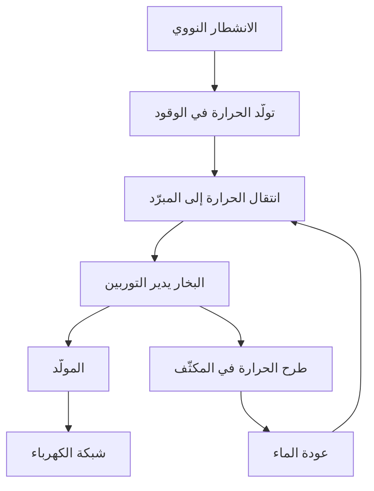
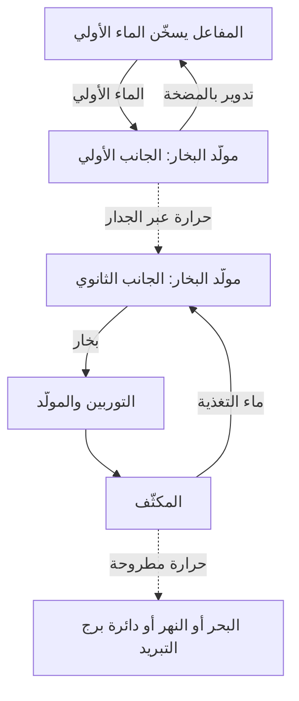

## 1. في نهاية العملية يوجد مولّد يدور

قد توحي عبارة الطاقة النووية بآلة تستخرج الكهرباء مباشرة من الذرات. لكن الجهاز الذي ينتج الكهرباء في معظم المحطات الشائعة هو مولّد متصل بتوربين. ينتج المفاعل الحرارة، وتُستخدم الحرارة لإنتاج البخار، ثم يدير البخار التوربين.

يشبه هذا المسار العام محطات البخار التي تستخدم الفحم أو الغاز الطبيعي. الاختلاف في مصدر الحرارة: تفاعلات كيميائية أساسًا في محطات الوقود الأحفوري، وتغيرات داخل النوى الذرية في المحطات النووية. وبين الانشطار والمولّد توجد مياه متداولة ومعدات لإنتاج البخار وأنابيب وتوربين ومكثّف.

تتبّع هذه السلسلة يوضح المزايا والتحديات معًا. يمكن لكمية صغيرة من الوقود توفير حرارة كبيرة، لكن الوقود قد يسخن بشدة إذا تعذّر نقل الحرارة بعيدًا عنه. وحتى بعد إيقاف التفاعل المتسلسل، تستمر المواد المشعّة التي تكوّنت أثناء التشغيل في إنتاج الحرارة. **إيقاف المفاعل ليس هو نفسه جعل المحطة باردة بما يكفي.**

يركّز هذا المقال على **مفاعلات الماء الخفيف** المستخدمة على نطاق واسع في توليد الكهرباء تجاريًا. تشرح الرسوم الوظائف، ولا تمثّل مخططات أنابيب فعلية أو تعليمات تشغيل. أما الاندماج فيجمع النوى الخفيفة، وهو مختلف عن الانشطار الذي نتناوله هنا. [مقدمة وزارة الطاقة الأمريكية عن المفاعلات][doe-reactor]

## 2. احتراق الوقود وتغيّر النوى عمليتان مختلفتان

تتكوّن المادة من ذرات. في مركز الذرة نواة تحتوي على بروتونات ونيوترونات، وتحيط بها إلكترونات. عند احتراق الفحم تتغير الروابط بين ذرات مثل الكربون والأكسجين. يتعلق هذا التفاعل الكيميائي أساسًا بالإلكترونات، ولا تتحول نواة الكربون إلى نواة عنصر آخر.

في الانشطار تنقسم نواة ثقيلة إلى نواتين أخف نسبيًا ونواتج أخرى. تنطلق الطاقة لأن الترتيب النووي قبل التفاعل وبعده يختلف في طاقته. وتسمّى الطاقة اللازمة لفصل النواة إلى بروتونات ونيوترونات منفردة طاقة الربط.

قد يبدو غريبًا أن تكوين ترتيب أشد ترابطًا يحرّر طاقة. تخيّل جسمًا يسقط من رف مرتفع: عندما ينتقل إلى حالة أقل طاقة يتحرر الفرق. لا تنشأ الطاقة لمجرد كسر شيء ما، فبعض التفاعلات يحتاج إلى إدخال طاقة.

تزداد طاقة الربط لكل نوكليون عمومًا من النوى الخفيفة جدًا نحو النوى متوسطة الكتلة، وتبلغ قيمًا كبيرة قرب الحديد والنيكل. لذلك يمكن لتفاعلات مناسبة أن تحرر الطاقة سواء بشطر نوى ثقيلة أو بدمج نوى خفيفة. [ATOMICA: بنية النواة][binding]

ترتبط فروق الكتلة بالطاقة بالعلاقة:

$$
E=\Delta m c^2
$$

تمثّل $\Delta m$ فرق كتلة السكون، و$c$ سرعة الضوء. لا يعني ذلك أن الوقود كله يختفي ليتحول إلى كهرباء. تبقى الشظايا والنيوترونات، ويظهر الفرق على هيئة طاقة حركية وإشعاع. ثم إن المحطة لا تستطيع تحويل كل الحرارة الناتجة إلى كهرباء.

## 3. طاقة الانشطار تسخّن الوقود أولًا

اليورانيوم-235 مثال بارز على النظائر الانشطارية المستخدمة في مفاعلات الماء الخفيف. بعد امتصاص نيوترون، قد تدخل نواته حالة مثارة ثم تنشطر، منتجة شظايا ونيوترونات وإشعاع غاما. تختلف تراكيب الشظايا، فلا يتكوّن العنصران نفسيهما في كل حدث.

تحمل الشظايا السريعة جزءًا كبيرًا من الطاقة. وعندما تصطدم بالمادة المحيطة وتتباطأ، تسخّن الوقود. ثم تعبر الحرارة كسوة الوقود إلى المبرّد. وبين الحدث النووي ومقبس المنزل تتغير صورة الطاقة مرات عديدة.

في التقديرات الهندسية، تُعدّ حرارة تقارب 200 ميغا إلكترون فولت لكل انشطار قيمة مفيدة. تحمل النيوترينوات جزءًا من الطاقة إلى الخارج، فيما يضيف التقاط النيوترونات طاقة أخرى؛ لذا يعتمد الميزان التفصيلي على النظائر وحدود النظام المدروس. [ATOMICA: تفاعلات الانشطار][fission]

يعادل الإلكترون فولت نحو $1.602\times10^{-19}$ جول، ولذلك تعادل 200 ميغا إلكترون فولت تقريبًا $3.20\times10^{-11}$ جول. تبدو قيمة الحدث الواحد صغيرة، لكن كميات المادة المعتادة تحتوي على أعداد هائلة من الذرات.

$$
\dot N\approx\frac{P_{\mathrm{th}}}{E_f}
$$

هنا $P_{\mathrm{th}}$ القدرة الحرارية، و$E_f$ الحرارة لكل انشطار، و$\dot N$ عدد الانشطارات في الثانية. تعطي قسمة 3 مليارات واط على الطاقة السابقة نحو $9.4\times10^{19}$ انشطارًا في الثانية. هذا مثال لتوضيح الحجم، وليس حسابًا تفصيليًا لوقود مفاعل.

الحصول على قدرة كبيرة من وقود قليل يعني ارتفاع الطاقة لكل وحدة كتلة، ولا يعني حدوث انفجار كبير مع كل انشطار. واستمرار هذه الأحداث المجهرية على نحو ثابت يتطلب التحكم في التفاعل المتسلسل.

## 4. الحرجية تعني توازن التفاعل المتسلسل

قد يسبب نيوترون صادر من انشطار انشطارًا آخر، يطلق بدوره نيوترونات جديدة. هذا هو التفاعل المتسلسل. لا تشارك كل النيوترونات في استمراره: بعضها يُمتص دون إحداث انشطار، وبعضها يتسرب خارج قلب المفاعل.

يعبّر **معامل التكاثر الفعّال**، $k_{\mathrm{eff}}$، عن هذا الميزان. وبصورة مفاهيمية يوضح كيف يتغير عدد النيوترونات من جيل إلى الجيل التالي.

| الحالة | الشرط | الاتجاه العام |
|---|---|---|
| دون حرجة | $k_{\mathrm{eff}}<1$ | تتراجع السلسلة إذا استُبعدت المصادر الخارجية |
| حرجة | $k_{\mathrm{eff}}=1$ | تتوازن الأجيال المتعاقبة |
| فوق حرجة | $k_{\mathrm{eff}}>1$ | تميل السلسلة إلى النمو |

خلافًا لدلالة الخطر في الاستعمال اليومي لكلمة حرج، ليست حرجية المفاعل حادثًا بحد ذاتها. فالمفاعل الذي يعمل بقدرة ثابتة يوازن بين إنتاج النيوترونات وفقدها. كما أن الحرجية لا تحدد مقدار القدرة: قد يكون المفاعل حرجًا عند قدرة منخفضة أو مرتفعة.

يمكن كتابة نموذج مبسّط عمدًا للأجيال:

$$
N_g=N_0\left(k_{\mathrm{eff}}\right)^g
$$

بعد 100 جيل، تكون نسبة العدد النهائي إلى الابتدائي نحو 0.366 عند معامل 0.99، و1 عند 1.00، و2.70 عند 1.01. تتراكم الفروق الصغيرة. لكن المعادلة لا تتضمن زمن الجيل أو النيوترونات المتأخرة أو تغير الحرارة أو معدات التحكم. **لا يمكن استخدامها لمعرفة عدد الثواني التي يستغرقها تغير فعلي في القدرة.**

## 5. المهدّئ والممتص والمبرّد تؤدي وظائف مختلفة

لا تكفي معرفة أن المفاعل يحتوي على ماء وقضبان إذا اختلطت وظائفها. إبطاء النيوترونات وامتصاصها ونقل الحرارة أعمال مختلفة.

يخفض **المهدّئ** طاقة النيوترونات. تولد نيوترونات الانشطار سريعة، وتبطئها التصادمات مع نوى الماء في مفاعل الماء الخفيف. يستفيد التصميم من ارتفاع احتمال انشطار اليورانيوم-235 في نطاق طاقات النيوترونات المنخفضة.

أما **ممتص التحكم** فيلتقط النيوترونات ويقلل العدد المتاح لاستمرار السلسلة. تؤدي قضبان التحكم هذه الوظيفة. إبطاء النيوترون يختلف عن إزالته من السلسلة، والقول إن القضبان تبطئ النيوترونات فقط يخلط بين الدورين.

ينقل **المبرّد** الحرارة بعيدًا عن الوقود. يؤدي الماء دور المهدّئ والمبرّد في مفاعلات الماء الخفيف، لكن هذا الجمع ليس قاعدة عامة. فقد تستخدم أنواع أخرى الغرافيت للتهدئة والغاز للتبريد. [المادة التعليمية لهيئة الرقابة النووية الأمريكية][nrc-reactors]

| الوظيفة | ما الذي تؤثر فيه؟ | مثال في مفاعل الماء الخفيف |
|---|---|---|
| التهدئة | طاقة النيوترونات | الماء |
| الامتصاص والتحكم في التفاعل | النيوترونات المتاحة للسلسلة | قضبان التحكم وممتصات أخرى |
| التبريد ونقل الحرارة | حرارة الوقود والأنظمة | الماء المتداول |
| الاحتواء | انتقال المواد المشعّة | الكسوة وحدود الضغط والاحتواء |

لأن للماء وظيفتين، تؤثر حرارته وكثافته في التبريد وسلوك النيوترونات معًا. لذلك ترتبط الفيزياء النووية ارتباطًا وثيقًا بانتقال الحرارة وجريان الموائع.

## 6. النيوترونات المتأخرة والتغذية الراجعة الحرارية

تنبعث معظم نيوترونات الانشطار فورًا تقريبًا. لكن نسبة صغيرة تظهر لاحقًا بعد اضمحلال نواتج الانشطار. ورغم قلة **النيوترونات المتأخرة**، فإنها تغير المقياس الزمني لسلوك المفاعل تغييرًا كبيرًا.

تختلف سلسلة يمكنها الاستمرار والتضخم السريع بالنيوترونات الفورية وحدها عن سلسلة تحتاج إلى النيوترونات المتأخرة لتحقيق التوازن. هذا الفرق مهم للتحكم العادي. لا يوقف البشر والآلات كل انشطار على حدة، بل يعدّلون الميزان الإجمالي للنيوترونات. [الوكالة الدولية للطاقة الذرية: الفيزياء النووية ونظرية المفاعلات][reactor-theory]

تقلل بعض التأثيرات الفيزيائية التفاعلية عند ارتفاع الحرارة. يغيّر تأثير دوبلر امتصاص النيوترونات في اليورانيوم-238 ونظائر أخرى مع ارتفاع حرارة الوقود، ويوفر تغذية راجعة سلبية مهمة في تصميم القلب. [ATOMICA: تصميم قلب مفاعل الماء المضغوط][core-design]

لكن عبارة «كلما سخن المفاعل توقف بأمان» ليست تعميمًا صحيحًا. تتوقف آثار كثافة المهدّئ ونسبة البخار وحالة الوقود على التصميم وظروف التشغيل. وتُجمع التغذية الراجعة الفيزيائية مع القياس وأنظمة التحكم ومعدات الإيقاف.

تضيف نواتج الانشطار اعتمادًا على تاريخ التشغيل. فالزينون-135 يمتص النيوترونات بقوة، وتعتمد كميته على القدرة السابقة. تعديل القدرة ليس مجرد تدوير مقبض لهب؛ فالتشغيل السابق مهم أيضًا إلى جانب الحرارة والقدرة الحاليتين.

## 7. مفاعل الماء المضغوط: تسخين دائرة ماء منفصلة

يحافظ مفاعل الماء المضغوط، أو PWR، على المبرّد الأولي عند ضغط عالٍ لمنع الغليان الكتلي أثناء اكتسابه الحرارة في القلب. يدخل الماء الساخن مولّد البخار، وينقل الحرارة عبر جدار معدني إلى ماء الدائرة الثانوية.

يتجه البخار الثانوي إلى التوربين، ويعود الماء الأولي إلى المفاعل. في الظروف الطبيعية تنتقل الحرارة دون اختلاط الماء في الدائرتين. إرسال ماء المفاعل مباشرة إلى التوربين ليس الترتيب الأساسي لهذا النوع.

يفصل هذا الترتيب المبرّد الأولي المحتمل احتواؤه على مواد مشعّة عن دائرة التوربين. ومع ذلك تشكّل أنابيب مولّد البخار حدًا مهمًا يحتاج إلى الفحص. فصل الدوائر لا يلغي الصيانة، بل ينشئ حاجزًا يجب الحفاظ على سلامته.

يضبط منظّم الضغط ضغط الدائرة الأولية، وتدير المضخات المبرّد. وتشمل المحطات الحقيقية أنظمة مساعدة لقياس الضغط والحرارة ومخزون الماء والحفاظ عليها. [وزارة الطاقة الأمريكية: كيف يعمل PWR][pwr]

## 8. مفاعل الماء المغلي: إنتاج البخار داخل المفاعل

في مفاعل الماء المغلي، أو BWR، يُغلى الماء عمدًا داخل المفاعل. تُفصل القطرات السائلة عن البخار قبل دخوله التوربين. وبعد أداء الشغل يتكثف البخار ويعود ماء تغذية.

بعكس PWR، يصل إلى دائرة التوربين بخار مصدره الماء الذي مر بالقلب، ولذلك تحتاج هذه الدائرة أيضًا إلى ضوابط إشعاعية. لا تستخدم دورة البخار الأساسية مولّد بخار منفصلًا من نمط PWR لنقل الحرارة بين دائرتين أولية وثانوية. [هيئة الرقابة النووية الأمريكية: مفاعلات الماء المغلي][bwr]

| الخاصية | PWR | BWR |
|---|---|---|
| الموقع الرئيسي لتوليد البخار | الجانب الثانوي لمولّد البخار | داخل المفاعل |
| ماء القلب | الضغط المرتفع يمنع الغليان الكتلي | يُستفاد من الغليان |
| المائع الذاهب إلى التوربين | بخار ثانوي | بخار منتج في المفاعل |
| الترتيب الأساسي | دوائر يفصلها مولّد البخار | اتصال بخاري مباشر بين المفاعل والتوربين |
| المتطلبات المشتركة | التبريد والإيقاف والاحتواء وطرح الحرارة | التبريد والإيقاف والاحتواء وطرح الحرارة |

كلاهما يستخدم الماء، لكن الأنظمة تختلف. لا تحدد البساطة الظاهرة وحدها السلامة أو التكلفة. يجب أيضًا مقارنة وظائف الحوادث وإمكان الوصول للفحص والمواد وظروف التشغيل.

## 9. لماذا لا تتحول كل الحرارة إلى كهرباء؟

يحوّل التوربين تمدد البخار الساخن المضغوط إلى دوران. ويحوّل المولّد الدوران إلى كهرباء بالحث الكهرومغناطيسي. ثم يبرد المكثّف البخار ليصبح ماء. يساعد الانخفاض الكبير في الحجم على إبقاء ضغط مخرج التوربين منخفضًا، ويجعل ضخ المائع مجددًا أسهل.

التبريد ليس ملحقًا لإخفاء ضعف الكفاءة. يجب أن تستقبل الآلة الحرارية الدورية حرارة من مصدر ساخن وتطرح جزءًا منها إلى مستودع بارد. حتى الآلة المثالية بين درجات حرارة محدودة لا تستطيع تحويل كل الحرارة إلى شغل.

$$
\eta_{\mathrm{Carnot}}=1-\frac{T_c}{T_h}
$$

تُستخدم درجات الحرارة المطلقة بالكلفن، لا المئوية. إذا افترضنا جانبًا ساخنًا عند 570 K وآخر باردًا عند 300 K، يكون الحد المثالي نحو 47%. وتقلل المبادلات الحقيقية والاحتكاك وحالة البخار والتوربين والمولّد الكفاءة أكثر. هذا المثال ذو الدرجتين تبسيط لدورة حقيقية تتوزع فيها درجات الحرارة.

تبلغ الكفاءة التقريبية لتوليد الكهرباء بمفاعل ماء خفيف نحو الثلث. لا يعني ذلك وقوع ثلث الانشطارات فقط، بل تحويل ثلث الحرارة إلى كهرباء. قد ترفع الحرارة الأعلى الكفاءة، لكن المواد والتآكل والضغط وحدود الوقود تقيدها. [ATOMICA: الحرارة المطروحة من المحطات النووية][thermal]

لمحطة افتراضية تنتج 3,000 ميغاواط حراري بكفاءة 33%، تكون القدرة الكهربائية 990 ميغاواط، ويجب طرح نحو 2,010 ميغاواط من الحرارة.

$$
P_e=\eta P_{\mathrm{th}},\qquad
P_{\mathrm{out}}=P_{\mathrm{th}}-P_e
$$

لا يفصل هذا الميزان البسيط استهلاك المعدات المساعدة. في التقارير الفعلية يُميّز إنتاج المولّد عن صافي الكهرباء المرسلة بعد استهلاك المضخات وغيرها. تتولى أنظمة تبريد كبيرة الحرارة المتبقية. قد تنقل المحطات الساحلية الحرارة إلى البحر، بينما تستخدم الداخلية الأنهار أو أبراج التبريد. والسحابة البيضاء لبرج التبريد تكون عادة قطرات ماء مرئية؛ مظهرها وحده لا يحدد الانبعاثات المشعّة.

## 10. حرارة الاضمحلال تستمر بعد الإيقاف

تقلل قضبان التحكم ووسائل الإيقاف الأخرى بشدة حرارة التفاعل المتسلسل. لكن القلب يحتفظ بنظائر مشعّة كثيرة تكوّنت أثناء التشغيل. يطلق اضمحلالها الطاقة، ولذلك **تستمر حرارة الاضمحلال بعد إيقاف المفاعل**.

تشبيه ذلك بإطفاء مدفأة كهربائية غير كامل. ففي المفاعل حرارة مخزّنة، إضافة إلى حرارة جديدة تتولد بعد الإيقاف. الانتظار وحده لا يكفي، بل يجب أن يبقى [مسار](/ar/p/windows-%E3%81%A7%D9%85%D8%B3%D8%A7%D8%B1%E3%81%AE%E9%80%9A%E3%81%A3%E3%81%9F%D9%85%D9%84%D9%81-%D8%AA%D9%86%D9%81%D9%8A%D8%B0%D9%8A%E3%81%AE%E5%A0%B4%E6%89%80%E3%82%92%E8%A6%8B%E3%81%A4%E3%81%91%E3%82%8B%E6%96%B9%E6%B3%95/) عامل لإزالة الحرارة. [الوكالة الدولية للطاقة الذرية: مبادئ السلامة النووية الأساسية][safety-basics]

بالنسبة إلى نظير مشع واحد، يتبع عدد الذرات المتبقية العلاقة:

$$
N(t)=N(0)\,2^{-t/T_{1/2}}
$$

$T_{1/2}$ هو عمر النصف. تتناقص النظائر قصيرة العمر بسرعة والطويلة ببطء. لكن الوقود المستهلك يحتوي على نظائر كثيرة وسلاسل اضمحلال، فلا يصف عمر نصف واحد مجمل الحرارة. تؤثر أيضًا القدرة السابقة ومدة التشغيل وتركيب الوقود.

لتوضيح الحجم، فإن 1% من 3,000 ميغاواط يساوي 30 ميغاواط. هذا ليس تقديرًا لحرارة الاضمحلال عند وقت محدد بعد الإيقاف، بل مثال على أن جزءًا صغيرًا من قدرة كبيرة يظل مهمًا. لا يجوز مساواة النسبة الصغيرة بالصفر تقريبًا.

الإيقاف والتبريد والطاقة الكهربائية والقياس وظائف مترابطة. يظل التبريد ضروريًا، وقد يتطلب مضخات وصمامات، بينما تكشف الأجهزة حالتها. يجب أن تحافظ ترتيبات الحوادث على هذه السلسلة من الوظائف.

## 11. السلامة تعني الإيقاف والتبريد والاحتواء

لا تختزل السلامة في جدار سميك واحد. إنها تجمع القدرة على كبح التفاعل وإزالة الحرارة ومنع المواد المشعّة من الخروج.

تحتجز حبيبات الوقود بعض النواتج المشعّة، وتفصل الكسوة الوقود عن المبرّد. تضيف حدود الضغط وبنية الاحتواء حواجز أخرى. لا تُحتجز جميع المواد بالطريقة نفسها، وقد تغير حرارة الحادث وضغطه تلك الحواجز. إحصاء الجدران لا يثبت استحالة التسرب.

يوفر **التكرار الاحتياطي** بدائل عند تعطل معدة منفردة. لكن وحدات عدة في الغرفة نفسها وعلى الارتفاع نفسه قد تغمرها المياه معًا. لذلك يهم أيضًا **التنوع** في المبادئ أو مصادر الطاقة و**الاستقلال**، بما فيه الفصل المكاني. المزيد من النسخ المتطابقة لا يلغي الأعطال ذات السبب المشترك.

| الوظيفة | نتيجة فقدها | اعتبارات التصميم |
|---|---|---|
| إيقاف التفاعل | لا ينخفض توليد الحرارة بما يكفي | وسائل الإيقاف والقياس وموثوقية العمل |
| تبريد الوقود | ارتفاع حرارة الوقود والهياكل واحتمال تلفها | مسارات إزالة الحرارة والماء والطاقة والمهلة المتاحة |
| احتواء المواد | انتقال المواد المشعّة أو خروجها | سلامة الحواجز والضغط وإدارة التسرب |
| معرفة حالة المحطة | صعوبة اتخاذ القرار | أجهزة موثوقة وطاقة واتصالات وتدريب |

تستخدم السلامة السلبية الجاذبية والدوران الطبيعي لتقليل الاعتماد على المعدات التي تحتاج إلى طاقة خارجية. لا تعني كلمة سلبية عملًا بلا شروط أو إلى أجل غير محدود. تظل كمية الماء وفروق الضغط وحالة الصمامات وتوافر مستودع حراري نهائي شروطًا مهمة.

بعد فوكوشيما داييتشي، عززت هيئة الرقابة النووية الأمريكية تدابير حفظ وظائف السلامة عند فقد مصادر الطاقة المركبة ومراقبة أحواض الوقود المستهلك. الدرس الأوسع هو أن الحدث الخارجي قد يضر بالطاقة والتبريد وأجهزة القياس في الوقت نفسه. [الهيئة: دروس فوكوشيما][fukushima]

## 12. من اكتشاف فيزيائي إلى محطة كهرباء

اكتشاف الانشطار وإثبات سلسلة مستمرة وتوليد الكهرباء وإمداد الشبكة كانت إنجازات منفصلة.

بعد النتائج التجريبية لهان وشتراسمان أواخر 1938، فسّرت مايتنر وفريش العملية بانقسام النواة. ظهر بذلك إمكان استخراج طاقة نووية كبيرة. لكن إثبات التفاعل يختلف عن استخدامه بموثوقية. [الجمعية الفيزيائية الأمريكية: الاكتشاف والتفسير][discovery]

في 2 ديسمبر 1942، حقق فريق فيرمي تفاعلًا متسلسلًا مضبوطًا ذاتي الاستمرار في شيكاغو بايل-1. لم يكن ذلك محطة تجارية. أثبتت التجربة قدرة فيزيائية أساسية ضمن أبحاث ارتبطت بقوة ببرامج عسكرية في زمن الحرب؛ ولا يمحو الاستخدام المدني اللاحق هذا السياق. [مختبر أرغون: CP-1][cp1]

في 1951، ولّد EBR-I في الولايات المتحدة كهرباء أضاءت مصابيح. وفي 1954، زوّد مفاعل أوبنينسك في الاتحاد السوفيتي شبكة بالكهرباء. ثم ساعدت خبرات المفاعلات التجريبية والبحرية وصناعة المواد والآلات البخارية وتطور الرقابة في الوصول إلى التوليد التجاري. [مختبر أيداهو الوطني: EBR-I][ebr]، [التاريخ لدى الوكالة الدولية للطاقة الذرية][iaea-history]

| المرحلة | السؤال المركزي | القدرات المطلوبة |
|---|---|---|
| فهم التفاعل | لماذا تنطلق الطاقة؟ | الفيزياء النووية والقياس |
| استمرار السلسلة | هل يمكن مواصلتها تحت السيطرة؟ | ميزان النيوترونات والتحكم والتدريع |
| إثبات توليد الكهرباء | هل تدير الحرارة الآلات والمولّد؟ | المبرّدات والمبادلات والتوربينات |
| التشغيل التجاري | هل يستمر الإمداد بموثوقية سنوات؟ | المواد والصيانة والوقود ومؤسسات التشغيل |
| المسؤولية الطويلة | هل يمكن إدارة دورة الحياة كاملة؟ | الرقابة والنفايات والتكاليف والاتفاق المجتمعي |

لم تكن الطاقة النووية نتيجة تلقائية لاكتشاف مثير. الحفاظ على المواد وإدارة الصيانة والإيقاف والخدمة الطويلة تطلب هندسة واسعة تتجاوز مجرد إنتاج التفاعل.

## 13. لا يدخل الوقود إلى المفاعل على هيئة خام

يمر الوقود بالتعدين والمعالجة وتعديل التركيب النظائري عند الحاجة والتصنيع والاستخدام ثم إدارة ما بعد الاستخدام. هذه دورة الوقود. لا تعني كلمة دورة أن كل شيء يعود إلى البداية: قد تتجه السياسة إلى التخلص المباشر أو استرجاع بعض المواد لإعادة استخدامها.

يتكوّن اليورانيوم الطبيعي أساسًا من اليورانيوم-238، ويحتوي على نحو 0.7% من اليورانيوم-235. يرفع وقود مفاعلات الماء الخفيف المعتاد نسبة اليورانيوم-235 إلى بضعة بالمئة. وغالبًا يُصنع ثاني أكسيد اليورانيوم في حبيبات صغيرة ملبّدة داخل كسوة معدنية، وتُجمع قضبان كثيرة في حزمة وقود. [الوكالة الدولية للطاقة الذرية: أساسيات الطاقة النووية][fuel-basics]

أثناء التشغيل تُستهلك نظائر انشطارية وتتراكم نواتج الانشطار ويولّد امتصاص النيوترونات نظائر أخرى. العملية أعقد من استهلاك اليورانيوم-235 الأصلي وحده حتى يختفي.

لا يتطلب تبديل الوقود اختفاء كل اليورانيوم. تؤخذ في الحسبان استدامة التفاعل وتراكم الممتصات وسلامة المواد وتوزيع القدرة في القلب. المادة المتبقية ليست بالضرورة قابلة لمواصلة العمل بأمان وجدوى في ترتيبها الحالي.

جودة التصنيع مهمة لأن الحرارة تمر عبر الحبيبات والفجوات والكسوة والمبرّد. إذا ضعفت قدرة جزء على نقل الحرارة تغيرت الحرارة الداخلية حتى عند القدرة نفسها. لذلك يستند تصميم الوقود إلى علم المواد وانتقال الحرارة إلى جانب الفيزياء النووية. [وزارة الطاقة الأمريكية: دورة الوقود][fuel-cycle]

## 14. الوقود المستهلك: التخزين والتخلص النهائي مختلفان

يبعث الوقود المستهلك المستخرج حديثًا إشعاعًا ويولّد حرارة اضمحلال. يوفر التخزين المائي أولًا التبريد والتدريع، وقد ينتقل الوقود المستوفي للشروط لاحقًا إلى التخزين الجاف. يتوقف التوقيت والشروط على الوقود والمنشأة.

يزيل الماء الحرارة ويضعف الإشعاع. وتوفر حاويات التخزين الجاف وهياكله الاحتواء والتدريع مع السماح بخروج الحرارة. إخراج الوقود من الماء لا يعني اختفاء نشاطه الإشعاعي.

**يفترض التخزين عادة استمرار الإدارة وإمكان الاسترجاع، بينما يستهدف التخلص النهائي العزل طويل الأمد.** وتترك إعادة المعالجة أيضًا مواد غير مرغوبة ونفايات للعملية. اختيار إعادة الاستخدام لا يلغي مشكلة إدارة النفايات. [الوكالة الدولية للطاقة الذرية: تخزين الوقود المستهلك][spent-fuel]

النفايات المشعّة ليست مادة واحدة متجانسة. تختلف نفايات الصيانة ومواد التفكيك والنفايات المرتبطة بالوقود في النظائر والنشاط والحرارة والحجم. تتوقف الإدارة الملائمة على المحتوى ومسارات وصوله الممكنة إلى البشر أو البيئة، لا على وصف مشع وحده.

يجمع التخلص الجيولوجي بين شكل النفايات والحاويات والمواد الهندسية المحيطة والجيولوجيا للحد من الحركة. تتطلب الفترات الطويلة تجارب ورصدًا وفهمًا للمياه الجوفية ونمذجة. وتهم أيضًا عملية اختيار الموقع والمراقبة والمسؤولية والحوار مع المجتمعات المضيفة.

تأجيل الإدارة المستقبلية يخفي بعض التكاليف والمنافع. ينبغي أن يتجاوز التقييم تكلفة الوقود أثناء التوليد ليشمل المواد المفرغة والفترة التالية لإغلاق المحطة.

## 15. ميّز القدرة والطاقة والتكلفة

يشير تصنيف مليون كيلوواط إلى القدرة في لحظة، بينما تشير الكيلوواط ساعة إلى الطاقة المقدمة عبر الزمن. الخلط بينهما يخلط حجم المحطة بمساهمتها الفعلية.

محطة افتراضية بقدرة 1 غيغاواط ومعامل سعة سنوي 90% تنتج نحو 7.884 تيراواط ساعة:

$$
E_{\mathrm{year}}=P_{\mathrm{rated}}\times8760\,\mathrm{h}\times CF
$$

$CF$ هو معامل السعة، وليس مجرد مقياس للموثوقية. يؤثر فيه تبديل الوقود والفحص وخفض الإنتاج بسبب الطلب والإيقاف التنظيمي. نسبة 90% مثال، وليست ضمانًا لبلد أو محطة.

يمتاز الوقود النووي بكثافة طاقة مرتفعة، ولا يحرق المفاعل وقودًا أحفوريًا. إنه مصدر كهرباء منخفض الكربون، لكن التعدين والمعالجة والبناء والتفكيك تعني أن انبعاثات دورة الحياة ليست صفرًا. تتطلب المقارنات حدود تقييم متسقة. [الهيئة الحكومية الدولية المعنية بتغير المناخ: أنظمة الطاقة][ipcc]

مدة البناء والاستثمار الأولي مهمان اقتصاديًا. تؤثر التأخيرات في التمويل كما في الإنشاء. تمديد تشغيل محطة قائمة وبناء محطة جديدة حالتان اقتصاديتان مختلفتان.

على مستوى الشبكة، تهم تغيرات الطلب والمولدات الأخرى والنقل والتخزين والاحتياطي. عبارتا «لا يمكن تغيير القدرة النووية» و«يمكنها دائمًا متابعة الطلب بحرية» تبسيطان مخلّان. تختلف المرونة التقنية عن التشغيل العملي بعد مراعاة الوقود والصيانة والاقتصاد.

## 16. ماذا تحاول المفاعلات الصغيرة والمتقدمة تغييره؟

تسعى المفاعلات المعيارية الصغيرة، أو SMR، إلى تغيير التصنيع أو البناء أو النشر من خلال وحدات أصغر ومناهج معيارية. لا يدل الاختصار على تقنية نووية واحدة: توجد تصاميم ماء خفيف وأخرى بمبرّدات أو قلوب مختلفة. [الوكالة الدولية للطاقة الذرية: ما المفاعلات المعيارية الصغيرة؟][smr]

قد تسهّل الوحدات الأصغر التصنيع في المصانع وتخفض رأس المال لكل وحدة. لكنها قد تخسر بعض وفورات الحجم. وتعتمد فوائد الإنتاج المتكرر على الطلبات الفعلية وتوحيد التصميم والرقابة وسلاسل التوريد.

تستهدف تصاميم أخرى حرارة صناعية مرتفعة أو نيوترونات سريعة أو مبرّدات مختلفة. تشمل الأهداف استخدامات الحرارة والموارد وخصائص النفايات ووظائف السلامة وطرق البناء. تحسين جانب لا يحل بقية الجوانب تلقائيًا.

عند قراءة أخبار المفاعلات المتقدمة، فرّق بين مفهوم ومنشأة اختبار ومحطة إيضاحية وتشغيل تجاري. الخطة ليست نظامًا أثبتته سنوات تشغيل طويلة. تقييم الوعد يتطلب تحديد المنجز وما بقي إثباته.

## 17. خمسة أسئلة عند قراءة الأخبار النووية

قبل الاستنتاج، حدّد ما الذي يقيسه الادعاء فعلًا.

1. **أي قدرة؟** قدرة المفاعل الحرارية وقدرة المولّد وصافي القدرة للشبكة مختلفة.
2. **أي حالة؟** التشغيل والإيقاف الحديث والإيقاف الطويل وإزالة الوقود تترك أحمالًا حرارية واحتياجات معدات مختلفة.
3. **أي حدود؟** القلب والدائرة الأولية والمبنى والموقع والبيئة تشمل مواد وعمليات مختلفة.
4. **أي كمية؟** يقيس Bq النشاط؛ ويقيس Gy الجرعة الممتصة، أي الطاقة لكل وحدة كتلة؛ ويُستخدم Sv في تقييم آثار الإشعاع. لا تُقارن أرقامها مباشرة. [هيئة الرقابة النووية الأمريكية: قياس الإشعاع][radiation]
5. **أي فترة وتكاليف؟** تتغير النتيجة بحسب إدراج الوقود والبناء والإغلاق والنفايات.

يعتمد تقييم الصحة أيضًا على نوع الإشعاع ومسار التعرض ومدته وظروف القياس. نميّز هنا الكميات، ولا نستخلص حكمًا صحيًا فرديًا من أرقام معزولة.

تمنحنا فيزياء الانشطار الحرارة. وتجعلها الهندسة مصدرًا مفيدًا بنقلها وتوليد الكهرباء والمحافظة على السيطرة لاحقًا. **لا تسأل فقط هل يمكن توليد الحرارة، بل إلى أين تذهب، وما الذي يحدث إذا تعطل مسارها، ومن يدير المواد بعد ذلك.** بهذا تصبح الطاقة النووية أوضح فهمًا.

## المصادر وحدود الرسوم

الحسابات تقديرات تعليمية ذات افتراضات معلنة، وليست تقييمًا لأداء محطة أو هوامش سلامتها. صورة الغلاف تصور مفاهيمي مولّد بالذكاء الاصطناعي؛ أبعادها وأنابيبها وألوانها ليست رسمًا هندسيًا.

- [وزارة الطاقة الأمريكية: أساسيات المفاعلات][doe-reactor]، [PWR][pwr]، [الانشطار][doe-fission]، [دورة الوقود][fuel-cycle]
- [ATOMICA: بنية النواة][binding]، [الانشطار][fission]، [قلب PWR][core-design]، [الحرارة المطروحة][thermal] (باليابانية)
- [هيئة الرقابة النووية: التعليم][nrc-reactors]، [BWR][bwr]، [دروس فوكوشيما][fukushima]، [كميات الإشعاع][radiation]
- [الوكالة الدولية للطاقة الذرية: نظرية المفاعلات][reactor-theory]، [السلامة][safety-basics]، [التاريخ][iaea-history]، [الوقود][fuel-basics]، [التخزين][spent-fuel]، [المفاعلات الصغيرة][smr]
- [أرغون: CP-1][cp1]، [مختبر أيداهو الوطني: EBR-I][ebr]، [الجمعية الفيزيائية الأمريكية: اكتشاف الانشطار][discovery]
- [تقرير التقييم السادس: الفريق العامل الثالث، الفصل السادس][ipcc]

[doe-reactor]: https://www.energy.gov/ne/articles/nuclear-101-how-does-nuclear-reactor-work
[binding]: https://atomica.jaea.go.jp/data/detail/dat_detail_03-06-03-01.html
[fission]: https://atomica.jaea.go.jp/data/detail/dat_detail_03-06-03-04.html
[nrc-reactors]: https://www.nrc.gov/education-regulatory-research/the-student-corner/unit-3-nuclear-reactorsenergy-generation
[reactor-theory]: https://gnssn.iaea.org/main/bptc/BPTC%20Module%20Documents/Module01%20Nuclear%20physics%20and%20reactor%20theory.pdf
[core-design]: https://atomica.jaea.go.jp/data/detail/dat_detail_02-04-02-01.html
[pwr]: https://www.energy.gov/ne/articles/infographic-how-does-pressurized-water-reactor-work
[bwr]: https://www.nrc.gov/reactors/power/bwrs
[thermal]: https://atomica.jaea.go.jp/data/detail/dat_detail_01-04-03-02.html
[safety-basics]: https://gnssn.iaea.org/main/bptc/BPTC%20Module%20Documents/Module03%20Basic%20principles%20of%20nuclear%20safety.pdf
[fukushima]: https://www.nrc.gov/regulations-legislation/fact-sheets-brochures/backgrounder-on-nrc-response-to-lessons-learned-from-fukushima
[doe-fission]: https://www.energy.gov/science/doe-explainsnuclear-fission
[cp1]: https://www.ne.anl.gov/About/cp1-pioneers/
[ebr]: https://inl.gov/ebr/
[iaea-history]: https://www-pub.iaea.org/MTCD/Publications/PDF/Pub1032_web.pdf
[fuel-basics]: https://nucleus-qa.iaea.org/sites/graphiteknowledgebase/wiki/Guide_to_Graphite/Fundamentals%20of%20Nuclear%20Power.aspx
[fuel-cycle]: https://www.energy.gov/ne/nuclear-fuel-cycle
[spent-fuel]: https://nucleus-apps.iaea.org/nss-oui/Content/Index?CollectionId=m_f7375b40-3d77-4ea5-a2e3-77090916bc67__8_0&type=PublishedCollection
[ipcc]: https://www.ipcc.ch/report/ar6/wg3/chapter/chapter-6/
[smr]: https://www.iaea.org/newscenter/news/what-are-small-modular-reactors-smrs
[discovery]: https://journals.aps.org/prl/50years/timeline
[radiation]: https://www.nrc.gov/facilities-safety/radiation-protection/radiation-and-its-health-effects/measuring-radiation
