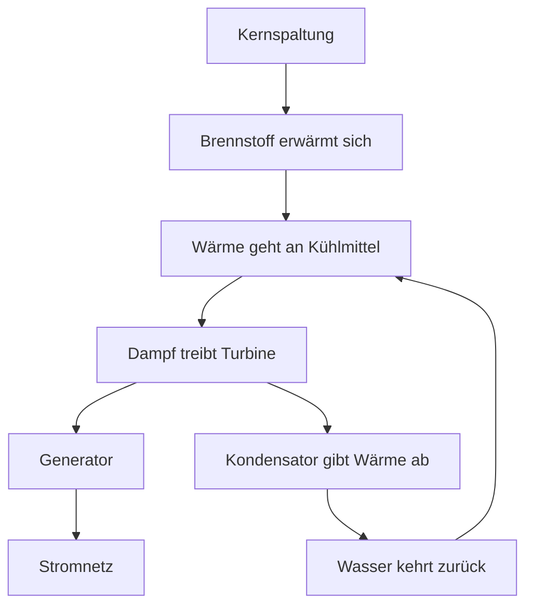
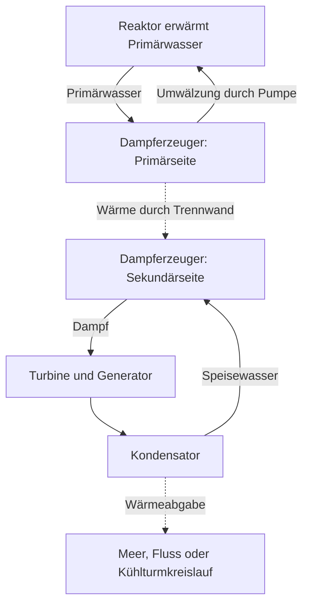

## 1. Am Ende steht ein rotierender Generator

Kernkraft klingt vielleicht nach einer Maschine, die Strom direkt aus Atomen gewinnt. In den meisten verbreiteten Anlagen erzeugt jedoch ein Generator den Strom, der mit einer Turbine verbunden ist. Der Reaktor liefert Wärme, daraus entsteht Dampf, und der Dampf treibt die Turbine an.

Diesen grundlegenden Ablauf teilen Kernkraftwerke mit Dampfkraftwerken, die Kohle oder Erdgas nutzen. Anders ist die Wärmequelle: überwiegend chemische Reaktionen bei fossilen Brennstoffen, Veränderungen im Atomkern bei Kernkraft. Zwischen Spaltung und Generator liegen Wasser, Dampferzeugung, Rohrleitungen, Turbine und Kondensator.

Wer dieser Kette folgt, versteht Vorteile und Schwierigkeiten zugleich. Wenig Brennstoff liefert viel Wärme. Kann sie nicht abgeführt werden, droht Überhitzung. Auch nach dem Ende der Kettenreaktion erzeugen bereits entstandene radioaktive Stoffe weiter Wärme. **Den Reaktor abzuschalten bedeutet nicht, dass die Anlage bereits ausreichend abgekühlt ist.**

Der Artikel behandelt vor allem kommerziell verbreitete **Leichtwasserreaktoren**. Die Diagramme erklären Funktionen, keine realen Rohrpläne oder Bedienverfahren. Fusion verbindet leichte Kerne und ist von den hier besprochenen Spaltungsreaktoren zu unterscheiden. [US-Energieministerium: Reaktoreinführung][doe-reactor]

## 2. Verbrennung und Kernumwandlung sind verschieden

Materie besteht aus Atomen. Im Zentrum liegt der Kern aus Protonen und Neutronen, umgeben von Elektronen. Bei der Verbrennung von Kohle ändern sich die Bindungen zwischen beispielsweise Kohlenstoff und Sauerstoff. Diese chemische Reaktion betrifft vor allem Elektronen; der Kohlenstoffkern wird dabei nicht zu einem anderen Element.

Bei der Spaltung zerfällt ein schwerer Kern in zwei vergleichsweise leichtere Kerne und weitere Produkte. Die Anordnungen vor und nach der Reaktion haben unterschiedliche Energien. Die Differenz wird frei. Die Energie, die nötig ist, einen Kern in einzelne Protonen und Neutronen zu zerlegen, heißt Bindungsenergie.

Warum setzt eine festere Bindung Energie frei? Ein Gegenstand, der von einem hohen Regal fällt, gibt beim Übergang in einen energieärmeren Zustand Energie ab. Ähnlich wird bei der Kernreaktion eine Differenz frei. Bloßes Zerbrechen liefert nicht grundsätzlich Energie; manche Reaktionen benötigen Energiezufuhr.

Die Bindungsenergie pro Nukleon steigt von sehr leichten zu mittelschweren Kernen im Allgemeinen an und erreicht nahe Eisen und Nickel hohe Werte. Deshalb können geeignete Reaktionen sowohl durch Spaltung schwerer als auch durch Fusion leichter Kerne Energie freisetzen. [ATOMICA: Kernstruktur][binding]

Der Zusammenhang mit der Massendifferenz lautet:

$$
E=\Delta m c^2
$$

$\Delta m$ ist die Differenz der Ruhemassen, $c$ die Lichtgeschwindigkeit. Nicht der gesamte Brennstoff verschwindet als Strom. Spaltprodukte und Neutronen bleiben zurück; die Differenz erscheint als Bewegungsenergie und Strahlung. Auch die daraus entstehende Wärme lässt sich nicht vollständig verstromen.

## 3. Spaltungsenergie erwärmt zunächst den Brennstoff

Uran-235 ist ein typisches spaltbares Nuklid in Leichtwasserreaktoren. Nach Aufnahme eines Neutrons kann sein Kern in einen angeregten Zustand übergehen und sich spalten. Dabei entstehen Spaltprodukte, Neutronen und Gammastrahlung. Die Kombination der Produkte variiert; es entstehen nicht jedes Mal dieselben zwei Elemente.

Ein großer Energieanteil steckt in der Bewegung der Spaltfragmente. Durch Zusammenstöße im Brennstoff werden sie abgebremst und erwärmen ihn. Wärme gelangt anschließend durch die Hüllrohre zum Kühlmittel. Bis zur Steckdose wechselt die Energie mehrfach ihre Form.

Für technische Abschätzungen sind etwa 200 MeV nutzbare Wärme pro Spaltung ein gebräuchlicher Wert. Neutrinos tragen Energie fort, Neutroneneinfänge liefern zusätzliche Energie. Die genaue Bilanz hängt daher von Nukliden und Bilanzgrenze ab. [ATOMICA: Kernspaltung][fission]

Ein Elektronenvolt entspricht etwa $1.602\times10^{-19}$ J; 200 MeV sind ungefähr $3.20\times10^{-11}$ J. Ein einzelnes Ereignis wirkt klein, doch alltägliche Stoffmengen enthalten sehr viele Atome.

$$
\dot N\approx\frac{P_{\mathrm{th}}}{E_f}
$$

$P_{\mathrm{th}}$ bezeichnet die Wärmeleistung, $E_f$ die Wärme je Spaltung und $\dot N$ die Spaltungen pro Sekunde. Für 3 Milliarden Watt ergibt sich etwa $9.4\times10^{19}$ pro Sekunde. Das zeigt die Größenordnung und ersetzt keine detaillierte Abbrandrechnung.

„Viel Energie aus wenig Brennstoff“ bedeutet hohe Energie pro Masse, nicht eine makroskopische Explosion bei jedem Ereignis. Die vielen mikroskopischen Reaktionen müssen als Kettenreaktion kontrolliert werden.

## 4. Kritisch bedeutet: Die Kettenreaktion hält sich im Gleichgewicht

Ein Spaltungsneutron kann eine weitere Spaltung auslösen, die neue Neutronen erzeugt. Doch nicht jedes Neutron setzt die Kette fort. Manche werden ohne Spaltung absorbiert, andere verlassen den Kernbereich.

Der **effektive Multiplikationsfaktor** $k_{\mathrm{eff}}$ beschreibt diese Bilanz: anschaulich das Verhältnis der Neutronenpopulation aufeinanderfolgender Generationen.

| Zustand | Bedingung | Grobe Tendenz |
|---|---|---|
| Unterkritisch | $k_{\mathrm{eff}}<1$ | Die Kette klingt ohne zusätzliche Quellen ab |
| Kritisch | $k_{\mathrm{eff}}=1$ | Die Generationen halten sich die Waage |
| Überkritisch | $k_{\mathrm{eff}}>1$ | Die Kette wächst tendenziell |

Anders als im alltäglichen Sprachgebrauch bedeutet „kritisch“ nicht automatisch einen Unfall. Bei konstanter Leistung werden Produktion und Verlust von Neutronen ausgeglichen. Kritikalität sagt außerdem nichts über die Höhe der Leistung: Sie ist bei niedriger wie hoher Leistung möglich.

Ein absichtlich vereinfachtes Generationenmodell ist:

$$
N_g=N_0\left(k_{\mathrm{eff}}\right)^g
$$

Nach 100 Generationen beträgt das Verhältnis ungefähr 0,366 bei 0,99, genau 1 bei 1,00 und 2,70 bei 1,01. Kleine Unterschiede summieren sich durch Multiplikation. Das Modell enthält aber weder Generationsdauer noch verzögerte Neutronen, Temperaturänderungen oder Regelung. **Es sagt nicht voraus, in wie vielen Sekunden die reale Leistung um einen bestimmten Faktor steigt.**

## 5. Moderator, Absorber und Kühlmittel haben unterschiedliche Aufgaben

Wasser und Stäbe im Reaktor zu kennen reicht nicht: Abbremsen, Absorbieren und Wärmeabfuhr sind verschiedene Funktionen.

Der **Moderator** senkt die Neutronenenergie. Spaltungsneutronen sind schnell; Zusammenstöße mit Kernen im Wasser bremsen sie ab. Uran-235 besitzt in einem niedrigen Neutronenenergiebereich eine höhere Spaltungswahrscheinlichkeit, die Leichtwasserreaktoren nutzen.

**Absorbermaterial** fängt Neutronen ein und verringert damit die Zahl, die die Kette fortsetzt. Steuerstäbe erfüllen diese Aufgabe. Neutronen abzubremsen ist etwas anderes, als sie aus der Reaktion zu entfernen. „Steuerstäbe machen Neutronen langsamer“ verwechselt die Funktionen.

Das **Kühlmittel** transportiert Wärme aus dem Brennstoff. Wasser ist im Leichtwasserreaktor zugleich Moderator und Kühlmittel. Andere Reaktoren können beispielsweise Graphit zur Moderation und Gas zur Kühlung einsetzen. [NRC: Reaktorlehrmaterial][nrc-reactors]

| Funktion | Veränderte Größe | Typisches Beispiel im Leichtwasserreaktor |
|---|---|---|
| Moderation | Neutronenenergie | Wasser |
| Absorption und Reaktionskontrolle | Verfügbare Neutronen | Steuerstäbe und weitere Absorber |
| Kühlung und Wärmetransport | Brennstoff- und Systemtemperaturen | Zirkulierendes Wasser |
| Einschluss | Bewegung radioaktiver Stoffe | Hüllrohre, Druckgrenze, Sicherheitsbehälter |

Weil Wasser zwei Aufgaben übernimmt, beeinflussen Dichte und Temperatur sowohl Kühlung als auch Neutronenverhalten. Kernphysik, Wärmeübertragung und Strömung sind eng gekoppelt.

## 6. Verzögerte Neutronen und Temperaturrückkopplung

Die meisten Neutronen werden unmittelbar bei der Spaltung frei. Ein kleiner Anteil entsteht erst später durch den Zerfall von Spaltprodukten: die **verzögerten Neutronen**. Trotz ihres geringen Anteils prägen sie die zeitliche Reaktordynamik.

Eine allein durch prompte Neutronen rasch anwachsende Reaktion verhält sich anders als eine, die verzögerte Neutronen zum Gleichgewicht benötigt. Das ist für normale Regelung entscheidend. Menschen und Maschinen stoppen nicht jede Spaltung einzeln, sondern beeinflussen die Gesamtbilanz. [IAEA: Kernphysik und Reaktortheorie][reactor-theory]

Manche Temperatureffekte wirken einer Verstärkung entgegen. Bei steigender Brennstofftemperatur verändert der Dopplereffekt unter anderem die Neutronenabsorption in Uran-238 und liefert wichtige negative Rückkopplung. [ATOMICA: Auslegung eines PWR-Kerns][core-design]

Daraus folgt nicht: „Wird es heißer, schaltet sich alles sicher ab.“ Moderatorendichte, Dampfanteil und Brennstoffzustand wirken je nach Bauart und Betriebszustand unterschiedlich. Physikalische Rückkopplung wird mit Messung, Regelung und Abschaltsystemen kombiniert.

Auch Spaltprodukte verändern die Bedingungen zeitabhängig. Xenon-135 absorbiert Neutronen stark; sein Bestand hängt von der Leistungsgeschichte ab. Leistung ändern ist deshalb nicht bloß das Drehen eines Flammenreglers. Frühere Betriebszustände zählen neben aktueller Temperatur und Leistung.

## 7. Druckwasserreaktor: Ein Kreislauf erhitzt einen zweiten

Ein Druckwasserreaktor, kurz PWR, hält sein Primärwasser unter hohem Druck und unterdrückt dadurch das großflächige Sieden beim Aufheizen im Kern. Im Dampferzeuger überträgt es Wärme durch eine metallische Wand an Wasser im Sekundärkreis.

Sekundärdampf treibt die Turbine; Primärwasser kehrt zum Reaktor zurück. Im Normalbetrieb tauschen die Kreisläufe Wärme aus, ohne ihr Wasser zu vermischen. Reaktorwasser direkt zur Turbine zu schicken ist nicht das grundlegende PWR-Prinzip.

Die Trennung hält potenziell radioaktives Primärwasser vom Turbinenkreis fern. Dampferzeugerrohre bilden aber eine wichtige Grenze, deren Zustand überprüft werden muss. Trennung beseitigt keine Wartungspflicht, sondern schafft eine Grenze, die intakt bleiben muss.

Ein Druckhalter regelt den Primärdruck, Pumpen bewegen das Kühlmittel. Hilfssysteme überwachen und erhalten Druck, Temperatur und Wasservorrat. [DOE: Funktionsweise eines PWR][pwr]

## 8. Siedewasserreaktor: Dampf entsteht im Reaktor

Der Siedewasserreaktor, kurz BWR, nutzt das Sieden im Reaktor. Flüssigkeitströpfchen werden aus dem Dampf entfernt, bevor dieser zur Turbine gelangt. Danach kondensiert er und wird als Speisewasser zurückgeführt.

Anders als beim PWR erreicht Dampf aus Wasser, das den Kern durchströmt hat, den Turbinenbereich. Dort sind daher ebenfalls Strahlenschutzmaßnahmen nötig. Ein separater PWR-Dampferzeuger zwischen Primär- und Sekundärkreis gehört nicht zum grundlegenden Dampfkreislauf. [NRC: Siedewasserreaktoren][bwr]

| Merkmal | PWR | BWR |
|---|---|---|
| Hauptort der Dampferzeugung | Sekundärseite des Dampferzeugers | Im Reaktor |
| Wasser im Kern | Hoher Druck unterdrückt großflächiges Sieden | Sieden wird genutzt |
| Turbinenzufuhr | Sekundärdampf | Im Reaktor erzeugter Dampf |
| Grundanordnung | Trennung über Dampferzeuger | Direkter Dampfweg zur Turbine |
| Gemeinsame Anforderungen | Kühlung, Abschaltung, Einschluss, Wärmeabgabe | Kühlung, Abschaltung, Einschluss, Wärmeabgabe |

Beide nutzen Wasser, sind aber nicht dasselbe System. Sichtbare Einfachheit entscheidet nicht allein über Sicherheit oder Wirtschaftlichkeit. Unfallfunktionen, Zugänglichkeit für Prüfungen, Werkstoffe und Betriebsbedingungen gehören zum Vergleich.

## 9. Warum wird nicht die gesamte Wärme zu Strom?

Die Turbine wandelt die Expansion heißen, unter Druck stehenden Dampfes in Rotation um. Der Generator erzeugt durch elektromagnetische Induktion Strom. Anschließend macht der Kondensator aus Dampf wieder Wasser. Das stark verringerte Volumen unterstützt einen niedrigen Turbinenaustrittsdruck und erleichtert erneutes Pumpen.

Kühlung ist keine bloße Nebeneinrichtung. Ein zyklischer Wärmekraftprozess nimmt Wärme von einer heißen Quelle auf und gibt einen Teil an eine kalte Senke ab. Auch ideal lässt sich bei endlicher Temperaturdifferenz nicht alles in Arbeit verwandeln.

$$
\eta_{\mathrm{Carnot}}=1-\frac{T_c}{T_h}
$$

Die Temperaturen müssen in Kelvin, nicht Celsius eingesetzt werden. Bei angenommenen 570 K und 300 K liegt die ideale Grenze bei etwa 47 %. Reale Wärmeübertragung, Reibung, Dampfzustände sowie Maschinenverluste senken sie weiter. Das Zweitemperaturmodell vereinfacht die tatsächliche Temperaturverteilung eines Prozesses.

Ein grober Richtwert für Leichtwasserreaktoren ist etwa ein Drittel elektrischer Wirkungsgrad. Das heißt nicht, dass nur ein Drittel der Spaltungen stattfindet, sondern dass dieser Anteil der Wärme zu Strom wird. Höhere Temperaturen helfen, werden aber durch Werkstoffe, Korrosion, Druck und Brennstoffgrenzen eingeschränkt. [ATOMICA: Wärmeabgabe][thermal]

Bei einer hypothetischen Anlage mit 3.000 MW Wärme und 33 % Wirkungsgrad entstehen 990 MW Strom; ungefähr 2.010 MW müssen als Wärme abgegeben werden.

$$
P_e=\eta P_{\mathrm{th}},\qquad
P_{\mathrm{out}}=P_{\mathrm{th}}-P_e
$$

Die Rechnung trennt den Eigenbedarf nicht detailliert ab. Tatsächlich unterscheiden sich Generatorleistung und Netzeinspeisung nach Abzug von Pumpen und anderen Verbrauchern. Große Kühleinrichtungen führen die restliche Wärme ab: über Meerwasser, Flüsse oder Kühltürme. Die weiße Fahne eines Kühlturms besteht normalerweise aus sichtbaren Wassertröpfchen. Ihr Aussehen erlaubt keine Aussage über die Menge radioaktiver Freisetzungen.

## 10. Nachzerfallswärme: Auch nach dem Abschalten entsteht neue Wärme

Abschaltmaßnahmen verringern die Wärme aus der Kettenreaktion stark. Im Kern verbleiben aber viele während des Betriebs erzeugte radioaktive Nuklide. Ihr Zerfall setzt weiter Energie frei: **Nachzerfallswärme bleibt nach der Abschaltung bestehen.**

Der Vergleich mit einem ausgeschalteten Heizgerät greift zu kurz. Neben gespeicherter Wärme wird weiterhin neue erzeugt. Warten allein genügt nicht; ein funktionierender Wärmeabfuhrweg muss erhalten bleiben. [IAEA: Grundlagen der nuklearen Sicherheit][safety-basics]

Für ein einzelnes radioaktives Nuklid gilt mit der Halbwertszeit $T_{1/2}$:

$$
N(t)=N(0)\,2^{-t/T_{1/2}}
$$

Kurzlebige Nuklide nehmen schnell, langlebige langsam ab. Abgebrannter Brennstoff enthält jedoch viele Nuklide und Zerfallsketten. Eine einzige Halbwertszeit beschreibt seine gesamte Nachzerfallswärme nicht. Vorherige Leistung, Betriebsdauer und Zusammensetzung sind ebenfalls relevant.

Schon 1 % von 3.000 MW sind 30 MW. Das ist keine Angabe für einen bestimmten Zeitpunkt nach dem Abschalten, sondern eine Größenordnungsbetrachtung: Ein kleiner Anteil einer großen Leistung bleibt erheblich. Ein kleiner Prozentsatz bedeutet nicht „praktisch null“.

Abschaltung, Kühlung, Stromversorgung und Messung hängen zusammen. Kühlung kann Pumpen und Ventile benötigen; Instrumente zeigen den Zustand. Unfallvorsorge muss diese Funktionskette erhalten.

## 11. Sicherheit heißt abschalten, kühlen und einschließen

Sicherheit besteht nicht nur aus einer dicken Wand. Reaktion begrenzen, Wärme abführen und radioaktive Stoffe zurückhalten sind miteinander verbundene Aufgaben.

Brennstoffpellets halten einen Teil der Spaltprodukte zurück, Hüllrohre trennen Brennstoff und Kühlmittel. Druckgrenze und Sicherheitsbehälter bilden weitere Barrieren. Stoffe werden jedoch unterschiedlich zurückgehalten, und Unfalltemperaturen oder -drücke können Barrieren verändern. Wände zu zählen beweist keine absolute Dichtheit.

**Redundanz** hilft gegen den Ausfall eines Geräts. Mehrere Geräte im selben Raum auf gleicher Höhe können aber gemeinsam überflutet werden. **Diversität**, etwa unterschiedliche Prinzipien oder Versorgungen, und **Unabhängigkeit** einschließlich räumlicher Trennung sind ebenfalls wichtig. Mehr identische Reservegeräte beseitigen gemeinsame Fehlerursachen nicht.

| Funktion | Folge ihres Verlusts | Auslegungsfragen |
|---|---|---|
| Reaktion stoppen | Wärmeerzeugung bleibt zu hoch | Abschaltwege, Messung, zuverlässige Funktion |
| Brennstoff kühlen | Überhitzung und Schäden | Wärmewege, Wasser, Strom, Zeitreserven |
| Stoffe einschließen | Verlagerung oder Freisetzung | Barrieren, Druck, Leckagekontrolle |
| Zustand erkennen | Entscheidungen werden erschwert | Instrumente, Strom, Kommunikation, Ausbildung |

Passive Sicherheit nutzt beispielsweise Schwerkraft oder natürliche Zirkulation, um die Abhängigkeit von Antrieben zu reduzieren. „Passiv“ heißt aber weder bedingungslos noch unbegrenzt: Wasservorrat, Druckdifferenzen, Ventilzustand und Wärmesenke bleiben Voraussetzungen.

Nach Fukushima Daiichi verstärkte die NRC unter anderem Vorkehrungen für den Ausfall installierter Stromquellen und die Überwachung von Brennelementbecken. Entscheidend ist die Systemsicht: Eine äußere Katastrophe kann Versorgung, Kühlung und Messung gleichzeitig beeinträchtigen. [NRC: Lehren aus Fukushima][fukushima]

## 12. Von der Entdeckung zum Kraftwerk

Spaltung entdecken, eine Kette aufrechterhalten, Strom erzeugen und ein Netz beliefern waren getrennte Schritte.

Nach den Versuchsergebnissen von Hahn und Strassmann Ende 1938 deuteten Meitner und Frisch den Vorgang als Kernspaltung. Damit wurde eine große Energiequelle erkennbar. Eine Reaktion nachzuweisen war aber noch keine zuverlässige Nutzung. [APS: Entdeckung und Deutung][discovery]

Am 2. Dezember 1942 erreichte Fermis Gruppe in Chicago Pile-1 eine kontrollierte, selbsttragende Kettenreaktion. Das war kein Versorgerkraftwerk, sondern ein physikalischer Nachweis. Die Forschung war eng mit militärischen Programmen des Zweiten Weltkriegs verbunden; spätere zivile Nutzung darf diesen Kontext nicht ausblenden. [Argonne: CP-1][cp1]

1951 erzeugte EBR-I in den USA Strom und ließ Glühlampen leuchten. 1954 lieferte Obninsk in der Sowjetunion Strom an ein Netz. Erfahrungen aus Schiffsreaktoren und Demonstrationsanlagen, Werkstofftechnik, Dampfmaschinenbau und Regulierung trugen anschließend zur kommerziellen Nutzung bei. [Idaho National Laboratory: EBR-I][ebr], [IAEA-Geschichte][iaea-history]

| Stufe | Leitfrage | Benötigte Fähigkeiten |
|---|---|---|
| Reaktion verstehen | Warum wird Energie frei? | Kernphysik und Messung |
| Kette aufrechterhalten | Kann sie kontrolliert weiterlaufen? | Neutronenbilanz, Steuerung, Abschirmung |
| Strom demonstrieren | Kann Wärme Maschinen antreiben? | Kühlmittel, Wärmetauscher, Turbinen |
| Kommerzieller Betrieb | Ist jahrelange Versorgung möglich? | Werkstoffe, Wartung, Brennstoff, Organisation |
| Langfristige Verantwortung | Ist der gesamte Lebensweg beherrschbar? | Aufsicht, Abfälle, Kosten, gesellschaftliche Verständigung |

Kernkraft entstand nicht automatisch aus einer spektakulären Entdeckung. Werkstoffe langfristig intakt zu halten und Wartung, Stillstände und Betrieb zu organisieren verlangte weit mehr als das Auslösen einer Reaktion.

## 13. Brennstoff kommt nicht als Erz in den Reaktor

Auf Abbau folgen Verarbeitung, gegebenenfalls Anpassung der Isotopenzusammensetzung, Herstellung, Einsatz und spätere Entsorgung. Das heißt Brennstoffkreislauf. „Kreislauf“ bedeutet nicht, dass alles zum Ausgangspunkt zurückkehrt: Es gibt direkte Entsorgung und teilweise Rückgewinnung zur Wiederverwendung.

Natururan besteht überwiegend aus Uran-238, mit etwa 0,7 % Uran-235. Typischer Leichtwasserreaktorbrennstoff erhöht diesen Anteil auf einige Prozent. Üblich sind kleine gesinterte Urandioxidpellets in Metallhüllrohren; viele Brennstäbe bilden ein Brennelement. [IAEA: Grundlagen][fuel-basics]

Im Betrieb werden spaltbare Nuklide verbraucht, Spaltprodukte sammeln sich an und Neutroneneinfang erzeugt andere Nuklide. Es wird also nicht lediglich das anfangs vorhandene Uran-235 bis zum Verschwinden genutzt.

Ein Wechsel setzt auch nicht voraus, dass alles Uran verbraucht ist. Reaktionsfähigkeit, absorbierende Produkte, Werkstoffzustand und Leistungsverteilung im Kern sind relevant. Vorhandenes Material ist nicht automatisch weiterhin sicher und wirtschaftlich nutzbar.

Fertigungsqualität zählt, weil Wärme durch Pellet, Spalt, Hüllrohr und Kühlmittel gelangen muss. Schlechterer Wärmetransport verändert innere Temperaturen selbst bei gleicher Leistung. Werkstoffkunde und Wärmeübertragung ergänzen die Kernphysik. [DOE: Brennstoffkreislauf][fuel-cycle]

## 14. Abgebrannter Brennstoff: Lagerung ist nicht Endlagerung

Frisch entladener Brennstoff strahlt und produziert Nachzerfallswärme. Wasserbecken sorgen zunächst für Kühlung und Abschirmung. Später kann entsprechend qualifizierter Brennstoff trocken gelagert werden. Fristen und Bedingungen hängen von Brennstoff und Anlage ab.

Wasser führt Wärme ab und schwächt Strahlung. Bei trockener Lagerung übernehmen Behälter und bauliche Strukturen Einschluss und Abschirmung, während Wärme nach außen gelangt. Außerhalb des Beckens ist die Radioaktivität nicht verschwunden.

**Zwischenlagerung sieht üblicherweise weitere Betreuung und mögliche Rückholung vor; Endlagerung zielt auf langfristige Isolation.** Auch Wiederaufarbeitung hinterlässt unerwünschte Stoffe und Prozessabfälle. Wiederverwendung lässt die Abfallfrage nicht verschwinden. [IAEA: Lagerung abgebrannter Brennstoffe][spent-fuel]

Betriebsabfälle, Rückbaumaterial und brennstoffbezogene Abfälle unterscheiden sich in Nukliden, Aktivität, Wärme und Volumen. Die Handhabung richtet sich danach, welche Stoffe vorhanden sind und über welche Wege sie Menschen oder Umwelt erreichen könnten, nicht allein nach dem Etikett „radioaktiv“.

Geologische Endlagerung verbindet Abfallform, Behälter, technische Umgebung und Geologie, um Stoffbewegung zu begrenzen. Lange Zeiträume erfordern Versuche, Beobachtungen, Grundwasserverständnis und Modelle. Standortwahl, Überwachung, Verantwortung und Dialog sind ebenso wichtig.

Aufgeschobene Entsorgung verzerrt die Kostenbetrachtung. Sie muss über den Brennstoffpreis im Betrieb hinausreichen und die Zeit nach Entladung und Stilllegung einschließen.

## 15. Leistung, Energie und Kosten auseinanderhalten

Eine Million kW beschreibt momentane Leistung; kWh die über Zeit gelieferte Energie. Wer beides verwechselt, vergleicht Anlagenumfang und tatsächlichen Beitrag falsch.

Eine hypothetische 1-GW-Anlage mit 90 % Jahreskapazitätsfaktor erzeugt etwa 7,884 TWh:

$$
E_{\mathrm{year}}=P_{\mathrm{rated}}\times8760\,\mathrm{h}\times CF
$$

$CF$ ist der Kapazitätsfaktor, nicht bloß Zuverlässigkeit. Brennstoffwechsel, Prüfungen, Nachfragebegrenzung und behördliche Stillstände wirken mit. 90 % ist hier eine Rechenannahme, kein Garantiewert.

Kernbrennstoff hat hohe Energiedichte, und im Reaktor werden keine fossilen Brennstoffe verbrannt. Kernkraft ist eine CO₂-arme Stromquelle. Abbau, Verarbeitung, Bau und Rückbau verursachen aber Lebenszyklusemissionen. Vergleiche brauchen dieselben Bilanzgrenzen. [IPCC AR6: Energiesysteme][ipcc]

Bauzeit und Anfangsinvestition prägen die Wirtschaftlichkeit. Verzögerungen verändern auch Finanzierungskosten. Laufzeitverlängerung und Neubau sind unterschiedliche Fälle.

Im Netz zählen Nachfrage, andere Erzeuger, Leitungen, Speicher und Reserven. „Kernkraft kann ihre Leistung nicht ändern“ und „sie kann jederzeit beliebig folgen“ sind gleichermaßen verkürzt. Technische Möglichkeiten sind von Betrieb unter Brennstoff-, Wartungs- und Wirtschaftlichkeitsbedingungen zu unterscheiden.

## 16. Was kleine und neue Reaktoren verändern sollen

Kleine modulare Reaktoren, SMR, sollen durch kleinere Einheiten und Modularisierung Herstellung, Bau oder Einsatz verändern. SMR bezeichnet keine einzelne Reaktionstechnik: Es gibt Leichtwasser- und andere Kühlmittel- oder Kernkonzepte. [IAEA: SMR][smr]

Kleinere Einheiten könnten fabrikgerechter sein und weniger Kapital pro Einheit erfordern. Sie verlieren aber möglicherweise Größenvorteile. Serienfertigung hilft nur entsprechend tatsächlicher Stückzahlen, Standardisierung, Regulierung und Lieferketten.

Andere Entwürfe zielen auf industrielle Hochtemperaturwärme, schnelle Neutronen oder andere Kühlmittel. Ziele betreffen Wärmenutzung, Ressourcen, Abfalleigenschaften, Sicherheit und Bauverfahren. Eine Verbesserung löst nicht automatisch alle übrigen Probleme.

Bei Berichten muss zwischen Konzept, Versuch, Demonstration und kommerziellem Betrieb unterschieden werden. Ein Plan ist nicht gleichbedeutend mit langjährigem Nachweis. Entscheidend ist die Grenze zwischen erreichtem Ergebnis und noch offener Demonstration.

## 17. Fünf Prüfsteine für Nachrichten über Kernkraft

Vor einem Urteil helfen fünf Fragen:

1. **Welche Leistung?** Wärmeleistung, Generatorleistung und Netzeinspeisung unterscheiden sich.
2. **Welcher Zustand?** Betrieb, frische Abschaltung, langer Stillstand und entladener Kern haben andere Wärme- und Anlagenanforderungen.
3. **Welche Grenze?** Kern, Primärkreis, Gebäude, Standort und Umwelt umfassen andere Prozesse.
4. **Welche Messgröße?** Bq misst Aktivität, Gy die absorbierte Energie pro Masse und Sv dient der Bewertung von Strahlenwirkungen. Zahlen sind nicht unmittelbar vergleichbar. [NRC: Strahlungsmessung][radiation]
5. **Welcher Zeitraum und welche Kosten?** Brennstoffversorgung, Bau, Rückbau und Entsorgung verändern die Bilanz.

Gesundheitliche Bewertung benötigt außerdem Strahlenart, Expositionsweg, Dauer und Messbedingungen. Hier werden Größen unterschieden, nicht aus isolierten Zahlen individuelle Gesundheitsurteile abgeleitet.

Kernspaltung liefert Wärme. Technik macht daraus eine nutzbare Stromquelle und hält sie auch nach dem Abschalten unter Kontrolle. **Nicht nur fragen, ob Wärme entsteht, sondern wohin sie geht, was beim Versagen dieses Weges passiert und wer das verbleibende Material verwaltet.** So wird Kernkraft verständlich.

## Quellen und Einordnung der Bilder

Die Rechnungen sind Lernbeispiele mit genannten Annahmen, keine Leistungs- oder Sicherheitsbewertung realer Anlagen. Das Titelbild ist eine KI-generierte Konzeptillustration; Abmessungen, Leitungen und Farben sind keine Konstruktionszeichnung.

- [DOE: Reaktoren][doe-reactor], [PWR][pwr], [Spaltung][doe-fission], [Brennstoffkreislauf][fuel-cycle] (Englisch)
- [ATOMICA: Kernstruktur][binding], [Spaltung][fission], [Kernauslegung][core-design], [Wärmeabgabe][thermal] (Japanisch)
- [NRC: Lehrmaterial][nrc-reactors], [BWR][bwr], [Fukushima][fukushima], [Strahlungsgrößen][radiation] (Englisch)
- [IAEA: Theorie][reactor-theory], [Sicherheit][safety-basics], [Geschichte][iaea-history], [Brennstoff][fuel-basics], [Lagerung][spent-fuel], [SMR][smr] (Englisch)
- [Argonne: CP-1][cp1], [Idaho: EBR-I][ebr], [APS: Entdeckung][discovery] (Englisch)
- [IPCC: AR6, Arbeitsgruppe III, Kapitel 6][ipcc] (Englisch)

[doe-reactor]: https://www.energy.gov/ne/articles/nuclear-101-how-does-nuclear-reactor-work
[binding]: https://atomica.jaea.go.jp/data/detail/dat_detail_03-06-03-01.html
[fission]: https://atomica.jaea.go.jp/data/detail/dat_detail_03-06-03-04.html
[nrc-reactors]: https://www.nrc.gov/education-regulatory-research/the-student-corner/unit-3-nuclear-reactorsenergy-generation
[reactor-theory]: https://gnssn.iaea.org/main/bptc/BPTC%20Module%20Documents/Module01%20Nuclear%20physics%20and%20reactor%20theory.pdf
[core-design]: https://atomica.jaea.go.jp/data/detail/dat_detail_02-04-02-01.html
[pwr]: https://www.energy.gov/ne/articles/infographic-how-does-pressurized-water-reactor-work
[bwr]: https://www.nrc.gov/reactors/power/bwrs
[thermal]: https://atomica.jaea.go.jp/data/detail/dat_detail_01-04-03-02.html
[safety-basics]: https://gnssn.iaea.org/main/bptc/BPTC%20Module%20Documents/Module03%20Basic%20principles%20of%20nuclear%20safety.pdf
[fukushima]: https://www.nrc.gov/regulations-legislation/fact-sheets-brochures/backgrounder-on-nrc-response-to-lessons-learned-from-fukushima
[doe-fission]: https://www.energy.gov/science/doe-explainsnuclear-fission
[cp1]: https://www.ne.anl.gov/About/cp1-pioneers/
[ebr]: https://inl.gov/ebr/
[iaea-history]: https://www-pub.iaea.org/MTCD/Publications/PDF/Pub1032_web.pdf
[fuel-basics]: https://nucleus-qa.iaea.org/sites/graphiteknowledgebase/wiki/Guide_to_Graphite/Fundamentals%20of%20Nuclear%20Power.aspx
[fuel-cycle]: https://www.energy.gov/ne/nuclear-fuel-cycle
[spent-fuel]: https://nucleus-apps.iaea.org/nss-oui/Content/Index?CollectionId=m_f7375b40-3d77-4ea5-a2e3-77090916bc67__8_0&type=PublishedCollection
[ipcc]: https://www.ipcc.ch/report/ar6/wg3/chapter/chapter-6/
[smr]: https://www.iaea.org/newscenter/news/what-are-small-modular-reactors-smrs
[discovery]: https://journals.aps.org/prl/50years/timeline
[radiation]: https://www.nrc.gov/facilities-safety/radiation-protection/radiation-and-its-health-effects/measuring-radiation
