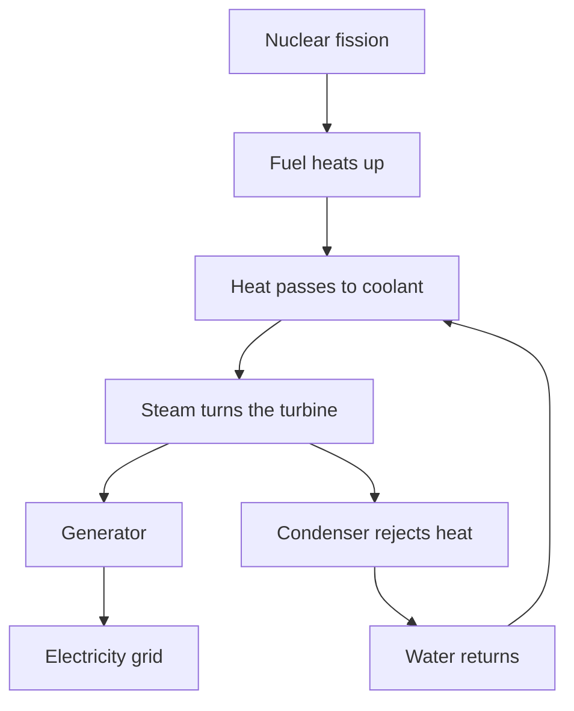
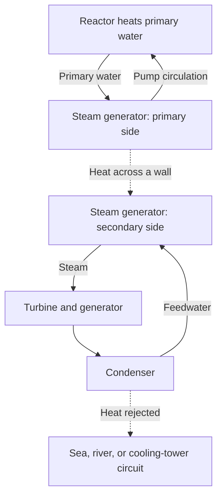

## 1. At the end of a nuclear power plant sits a rotating generator

Nuclear power may sound like a machine that extracts electricity directly from atoms. In most widely used plants, however, the final device producing electricity is a generator coupled to a turbine. The reactor makes heat, the heat produces steam, and the steam turns the turbine.

This broad arrangement is shared with steam plants powered by coal or natural gas. The difference is the source of heat: mainly chemical reactions in fossil-fuel plants, changes inside atomic nuclei in nuclear plants. Between fission and the generator lie circulating water, steam-producing equipment, pipes, a turbine, and a condenser.

Following that chain makes both the advantages and the challenges clearer. A small amount of fuel supplies considerable heat, but fuel can overheat if the heat cannot be removed. Even after the chain reaction stops, radioactive materials already produced continue to generate heat. **Stopping the reactor is not the same as bringing the plant to a sufficiently cool condition.**

This article focuses on **light-water reactors**, widely used for commercial electricity generation. The diagrams explain functions, not actual piping layouts or operating procedures. Fusion joins light nuclei and is distinct from the fission reactors discussed here. [US Department of Energy reactor introduction][doe-reactor]

## 2. Burning fuel and changing nuclei are different processes

Matter consists of atoms. At an atom’s center is a nucleus containing protons and neutrons, with electrons around it. Burning coal changes how atoms such as carbon bond with oxygen. This chemical reaction mainly involves electrons; the carbon nucleus does not become a different element.

Fission splits a heavy nucleus into two comparatively lighter nuclei and other products. Energy is released because the nuclear arrangements before and after the reaction have different energies. The energy required to separate a nucleus into individual protons and neutrons is its binding energy.

It may seem counterintuitive that forming more tightly bound arrangements releases energy. Think of an object falling from a high shelf: moving to a lower-energy state releases the difference. Energy does not appear merely because something is broken. Some reactions require an energy input.

Binding energy per nucleon generally rises from very light nuclei toward medium-mass nuclei, reaching large values near iron and nickel. Consequently, suitable reactions can release energy by splitting heavy nuclei or by joining light ones. [ATOMICA: nuclear structure][binding]

The relationship between the mass difference and released energy is:

$$
E=\Delta m c^2
$$

Here $\Delta m$ is the difference in rest mass and $c$ is the speed of light. This does not mean that all the fuel disappears into electricity. Fragments and neutrons remain; the difference appears as kinetic energy and radiation. Furthermore, a power plant cannot convert all the resulting heat into electricity.

## 3. Fission energy first heats the fuel

Uranium-235 is a representative fissile isotope in light-water reactors. After absorbing a neutron, its nucleus can enter an excited state and split, producing fragments, neutrons, and gamma radiation. The fragment combinations vary; the same two elements are not produced in every event.

Much of the released energy is carried by rapidly moving fragments. They collide with surrounding material and slow down, heating the fuel. Heat then crosses the fuel cladding into the coolant. From the nuclear event to a household outlet, energy changes form repeatedly.

For engineering estimates, approximately 200 MeV of heat per fission is a useful value. Neutrinos carry some energy away, while neutron capture supplies additional energy, so the detailed balance depends on the isotopes and the boundary being considered. [ATOMICA: fission reactions][fission]

One electronvolt is about $1.602\times10^{-19}$ J, so 200 MeV is roughly $3.20\times10^{-11}$ J. That looks tiny for one event, but ordinary quantities of matter contain enormous numbers of atoms.

$$
\dot N\approx\frac{P_{\mathrm{th}}}{E_f}
$$

$P_{\mathrm{th}}$ is thermal power, $E_f$ the heat per fission, and $\dot N$ the number of fissions per second. Dividing 3 billion watts by the energy above gives about $9.4\times10^{19}$ fissions per second. This illustrates scale; it is not a detailed reactor fuel calculation.

“Large output from little fuel” describes high energy per unit mass, not a macroscopic explosion at every fission. Sustaining these microscopic reactions steadily requires control of the chain reaction.

## 4. Critical means the chain reaction sustains itself steadily

A neutron from one fission can cause another, which releases further neutrons. That is a chain reaction. Not every neutron participates: some are absorbed without causing fission, and some escape the core.

The **effective multiplication factor**, $k_{\mathrm{eff}}$, expresses this balance. Conceptually, it tells us how the neutron population changes from one generation to the next.

| State | Condition | Broad tendency |
|---|---|---|
| Subcritical | $k_{\mathrm{eff}}<1$ | The chain declines, setting aside external sources |
| Critical | $k_{\mathrm{eff}}=1$ | Successive generations balance |
| Supercritical | $k_{\mathrm{eff}}>1$ | The chain tends to grow |

Unlike “critical” in everyday emergency language, reactor criticality is not itself an accident. A reactor operating at constant power balances neutron production and losses. Nor does criticality alone specify power: a reactor can be critical at low or high power.

A deliberately simplified generation model is:

$$
N_g=N_0\left(k_{\mathrm{eff}}\right)^g
$$

After 100 generations, the population ratio is approximately 0.366 for 0.99, 1 for 1.00, and 2.70 for 1.01. Small differences compound. However, this equation omits generation times, delayed neutrons, temperature changes, and control equipment. **It cannot predict how many seconds a real power change takes.**

## 5. Moderator, absorber, and coolant do different jobs

Knowing that a reactor contains water and rods is not enough if their functions are confused. Slowing neutrons, absorbing them, and moving heat are distinct tasks.

A **moderator** reduces neutron energy. Fission neutrons are fast; in a light-water reactor, collisions with nuclei in the water slow them. Uranium-235 has a higher probability of fission in a low-neutron-energy region, which the design exploits.

A **control absorber** captures neutrons, reducing those available to sustain the chain. Control rods perform this function. Slowing neutrons and removing them from the chain are different actions. Saying that control rods merely slow neutrons confuses the roles.

A **coolant** carries heat away from the fuel. Water serves as both moderator and coolant in light-water reactors, but that combination is not universal. Other reactor types may use graphite for moderation and gas for cooling. [NRC reactor education material][nrc-reactors]

| Function | What it changes | Typical light-water reactor example |
|---|---|---|
| Moderation | Neutron energy | Water |
| Absorption and reaction control | Neutrons available to the chain | Control rods and other absorbers |
| Cooling and heat transport | Fuel and system temperatures | Circulating water |
| Confinement | Movement of radioactive substances | Cladding, pressure boundary, containment |

Because water has two jobs, its temperature and density affect both cooling and neutron behavior. A reactor couples nuclear physics tightly to heat transfer and fluid flow.

## 6. Delayed neutrons and temperature feedback make control possible

Most fission neutrons are emitted promptly. A small fraction appear later, following radioactive decay of fission products. These **delayed neutrons** profoundly affect the timescale of reactor behavior despite their small share.

A chain sustained and rapidly amplified by prompt neutrons alone behaves differently from one that relies on delayed neutrons to balance. This distinction matters for ordinary control. People and machines do not stop individual fissions one at a time; they adjust the overall neutron balance. [IAEA: nuclear physics and reactor theory][reactor-theory]

Some physical effects reduce reactivity as temperature increases. The Doppler effect changes neutron absorption in uranium-238 and other isotopes as fuel temperature rises, providing important negative feedback in core design. [ATOMICA: PWR core design][core-design]

But “getting hotter always makes it stop safely” is not a valid generalization. Changes in moderator density, steam fraction, and fuel conditions depend on reactor design and operating state. Physical feedback is combined with instrumentation, control systems, and shutdown equipment.

Fission-product inventories introduce further time dependence. Xenon-135, for example, strongly absorbs neutrons, and its abundance depends on the history of reactor power. Adjusting output is not simply turning a flame knob: earlier operation matters as well as current temperature and power.

## 7. PWR: pressurized water heats a separate water circuit

A pressurized-water reactor, or PWR, keeps its primary coolant at high pressure to suppress bulk boiling as it receives heat in the core. The hot water enters a steam generator and transfers heat across a metal boundary to water in a secondary circuit.

Secondary steam travels to the turbine; primary water returns to the reactor. Under normal conditions, heat crosses between the circuits without their water mixing. Sending reactor water directly to the turbine is not the basic PWR arrangement.

This separates potentially radioactive primary coolant from the turbine circuit. Yet steam-generator tubes form an important boundary and require inspection. Separating circuits does not remove maintenance needs; it creates a boundary whose integrity matters.

A pressurizer regulates primary pressure, while pumps circulate coolant. Actual plants also contain supporting systems to measure and maintain pressure, temperature, and water inventory. [DOE: how a PWR works][pwr]

## 8. BWR: steam is produced inside the reactor

A boiling-water reactor, or BWR, deliberately boils water inside the reactor. Liquid droplets are separated from the steam before it enters the turbine. After doing work, the steam condenses and returns as feedwater.

Unlike a PWR, steam originating in water that passed through the core reaches the turbine circuit, requiring radiological controls there too. The basic steam cycle does not use a separate PWR-style steam generator to exchange heat between primary and secondary circuits. [NRC: boiling-water reactors][bwr]

| Feature | PWR | BWR |
|---|---|---|
| Main location of steam production | Secondary side of steam generator | Inside reactor |
| Core water | High pressure suppresses bulk boiling | Boiling is used |
| Fluid going to turbine | Secondary steam | Reactor-produced steam |
| Main arrangement | Circuits separated by a steam generator | Direct steam connection between reactor and turbine |
| Shared requirements | Cooling, shutdown, confinement, heat rejection | Cooling, shutdown, confinement, heat rejection |

Both use water, but their systems differ. Apparent simplicity alone does not determine safety or cost. Comparison must include accident functions, inspection access, materials, and operating conditions.

## 9. Why not turn all the heat into electricity?

A steam turbine converts the expansion of hot, pressurized steam into rotation. The generator converts rotation into electricity through electromagnetic induction. The condenser then cools steam back into water. The large decrease in volume supports a low-pressure turbine outlet and makes the working fluid easy to pump again.

Cooling is not an accessory that conceals inefficiency. A cyclic heat engine must take heat from a hot source and reject some to a cold sink. Even an ideal engine cannot convert all heat into work with a finite temperature difference.

$$
\eta_{\mathrm{Carnot}}=1-\frac{T_c}{T_h}
$$

Temperatures are absolute temperatures in kelvin, not Celsius. With an assumed hot side of 570 K and cold side of 300 K, the ideal limit is about 47%. Real heat exchangers, friction, steam conditions, turbines, and generators reduce efficiency further. This two-temperature example simplifies an actual cycle with a distribution of temperatures.

A rough efficiency for light-water nuclear generation is about one-third. That does not mean only one-third of fissions occur; it is the fraction of heat converted into electricity. Higher temperatures can improve efficiency, but materials, corrosion, pressure, and fuel limits constrain them. [ATOMICA: rejected heat from nuclear plants][thermal]

For a hypothetical plant producing 3,000 MW of heat at 33% efficiency, electrical output is 990 MW and approximately 2,010 MW must leave as heat.

$$
P_e=\eta P_{\mathrm{th}},\qquad
P_{\mathrm{out}}=P_{\mathrm{th}}-P_e
$$

This simple balance does not separately account for auxiliary power. Actual reporting distinguishes generator output from net electricity sent out after pumps and other equipment consume their share. Large cooling systems handle the enormous remaining heat. Coastal plants may transfer it to seawater; inland plants may use rivers or cooling towers. A cooling tower’s white plume is usually visible water droplets, and its appearance alone tells us nothing reliable about radioactive releases.

## 10. Decay heat: shutdown does not end heat production

Control rods and other shutdown measures greatly reduce heat from the chain reaction. But the core retains many radioactive isotopes created during operation. Their decay releases energy, so **decay heat continues after shutdown**.

The analogy of switching off an electric heater is incomplete. A reactor contains stored heat and continues generating new heat afterward. Waiting is not enough: a functioning path for heat removal must remain. [IAEA: basic nuclear safety principles][safety-basics]

For one radioactive isotope, the number of atoms remaining follows:

$$
N(t)=N(0)\,2^{-t/T_{1/2}}
$$

$T_{1/2}$ is its half-life. Short-lived isotopes decline quickly; long-lived ones decline slowly. Spent fuel contains many isotopes and decay chains, however. A single half-life cannot describe total reactor decay heat. Previous power, operating duration, and fuel composition also matter.

For scale, 1% of 3,000 MW is still 30 MW. This is not a claim about decay heat at any specific time after shutdown; it demonstrates why a small fraction of a large output is still substantial. A percentage alone must not be mistaken for “essentially zero.”

Shutdown, cooling, power supplies, and measurement are connected. Cooling remains necessary after shutdown; pumps and valves may be required, and instruments show their condition. Accident provisions must preserve this chain of functions.

## 11. Safety means stopping, cooling, and confining

Safety cannot be understood as one thick wall. It combines the ability to suppress the reaction, remove heat, and prevent radioactive material from escaping.

Fuel pellets retain some radioactive products, and cladding separates fuel from coolant. Pressure boundaries and containment provide further barriers. Different substances are not retained identically, and accident temperatures and pressures can alter those barriers. Counting walls does not establish that leakage is impossible.

**Redundancy** provides backup against individual equipment failures. But several units in one room at the same elevation may all flood together. **Diversity**, using different principles or supplies, and **independence**, including physical separation, also matter. More identical backups do not eliminate common-cause failures.

| Function | Consequence of losing it | Design considerations |
|---|---|---|
| Stop the reaction | Heat production is not sufficiently suppressed | Shutdown methods, measurement, reliable action |
| Cool fuel | Fuel and structures overheat and may be damaged | Heat-removal paths, water, power, time margins |
| Confine material | Radioactive substances move or escape | Barrier integrity, pressure, leak management |
| Understand plant condition | Decisions become difficult | Reliable instruments, power, communication, training |

Passive safety uses effects such as gravity and natural circulation to reduce dependence on powered equipment. “Passive” does not mean unconditional or unlimited. Water inventory, pressure differences, valve state, and an available heat sink still impose conditions.

After Fukushima Daiichi, the NRC strengthened provisions for maintaining safety functions when installed power supplies are unavailable and for monitoring spent-fuel pools. The broader lesson is that an external event can damage power, cooling, and instrumentation together. [NRC: response to Fukushima lessons][fukushima]

## 12. From a physical discovery to a power station

The discovery of fission, demonstration of a sustained chain, generation of electricity, and delivery to a grid were separate milestones.

Following Hahn and Strassmann’s late-1938 experimental results, Meitner and Frisch explained the process as nuclear splitting. This revealed the possibility of extracting substantial nuclear energy. Demonstrating a reaction was nevertheless different from using it reliably. [American Physical Society: discovery and interpretation][discovery]

On December 2, 1942, Fermi’s team achieved a controlled, self-sustaining chain reaction in Chicago Pile-1. This was not a utility power station. It established a crucial physical capability within research deeply linked to wartime military programs; the later civilian use cannot erase that context. [Argonne: CP-1][cp1]

In 1951, EBR-I in the United States generated electricity and lit bulbs. In 1954, the Obninsk reactor in the Soviet Union supplied electricity to a grid. Knowledge from demonstration and naval reactors, materials manufacturing, steam machinery, and regulatory development subsequently contributed to commercial generation. [Idaho National Laboratory: EBR-I][ebr], [IAEA historical account][iaea-history]

| Stage | Central question | Required capabilities |
|---|---|---|
| Understand the reaction | Why is energy released? | Nuclear physics and measurement |
| Sustain the chain | Can the reaction continue under control? | Neutron balance, control, shielding |
| Demonstrate electricity | Can heat drive machinery and generation? | Coolants, heat exchangers, turbines |
| Commercial operation | Can supply remain reliable for years? | Materials, maintenance, fuel, operating organizations |
| Long-term responsibility | Can the entire lifetime be managed? | Regulation, waste, costs, public agreement |

Nuclear power was not an automatic consequence of an exciting discovery. Keeping materials sound and managing maintenance, shutdown, and long service required extensive engineering beyond merely producing a reaction.

## 13. Fuel does not enter the reactor as ore

Fuel passes through mining, processing, adjustment of isotopic composition where needed, manufacture, use, and post-use management. This is the fuel cycle. “Cycle” does not necessarily mean everything returns to the beginning: policies may favor direct disposal or recovery of some materials for reuse.

Natural uranium is mostly uranium-238, with about 0.7% uranium-235. Typical light-water reactor fuel raises the uranium-235 share to a few percent. It is commonly made into small sintered uranium-dioxide pellets, enclosed in metal cladding. Many fuel rods form an assembly. [IAEA: nuclear power fundamentals][fuel-basics]

Fuel changes during operation. Fissile isotopes are consumed, fission products accumulate, and neutron absorption creates other isotopes. The process is more complicated than using only the original uranium-235 until it is gone.

Refueling does not require all uranium to have disappeared. Maintaining the reaction, accumulating neutron absorbers, material integrity, and core power distribution all matter. Remaining material is not necessarily material that can safely and economically continue operating in its current arrangement.

Manufacturing quality matters because heat must cross pellets, gaps, cladding, and coolant. If one part transfers heat less effectively, internal temperatures change even at the same output. Materials science and heat transfer support fuel design alongside nuclear physics. [DOE: nuclear fuel cycle][fuel-cycle]

## 14. Spent fuel: storage and disposal are not the same

Freshly discharged spent fuel emits radiation and generates decay heat. Water-based storage initially supplies cooling and shielding; suitably qualified fuel may later move to dry storage. Timing and conditions depend on the fuel and facility.

Water removes heat and attenuates radiation. Dry-storage containers and structures provide confinement and shielding while allowing heat to escape. Moving fuel out of water does not mean its radioactivity has vanished.

**Storage generally anticipates continued management and possible retrieval; disposal seeks long-term isolation.** Reprocessing still leaves unwanted material and processing waste. Choosing reuse does not make the waste-management problem disappear. [IAEA: spent-fuel storage][spent-fuel]

Radioactive waste is not one uniform material. Maintenance waste, demolition material, and spent-fuel-related waste differ in isotopes, activity, heat, and volume. Appropriate management depends on what is present and how it might reach people or the environment, not merely on the label “radioactive.”

Geological disposal combines waste form, containers, surrounding engineered materials, and geology to limit movement. Long timescales require experiments, observations, groundwater understanding, and modeling. Siting, monitoring, responsibility, and dialogue with host communities matter alongside engineering.

Postponing future management obscures costs and benefits. Evaluation must extend beyond fuel costs during generation to discharged material and the period after the plant closes.

## 15. Distinguish power, energy, and cost

A rating of 1 million kW describes power at a moment; kWh describes energy supplied over time. Mixing these quantities confuses plant size with actual contribution.

A hypothetical 1 GW plant operating at an annual capacity factor of 90% generates approximately 7.884 TWh:

$$
E_{\mathrm{year}}=P_{\mathrm{rated}}\times8760\,\mathrm{h}\times CF
$$

$CF$ is capacity factor, not simply reliability. Refueling, inspection, demand-related reductions, and regulatory shutdowns all affect it. The 90% value is an example, not a guarantee for any country or plant.

Nuclear power has high fuel energy density and does not burn fossil fuel in the reactor. It is a low-carbon electricity source, but mining, processing, construction, and decommissioning mean lifecycle emissions are not zero. Comparisons require consistent assessment boundaries. [IPCC AR6: energy systems][ipcc]

Construction time and initial investment are economically important. Delays affect financing as well as construction costs. Extending an existing plant and building a new one are different economic cases.

At grid level, demand variations, other generators, transmission capacity, storage, and reserves also matter. “Nuclear output cannot change” and “it can always follow demand freely” are both oversimplifications. Technical flexibility differs from practical operation after fuel management, maintenance, and economics are considered.

## 16. What small and advanced reactors seek to change

Small modular reactors, or SMRs, seek changes in manufacturing, construction, or deployment through smaller units and modular approaches. SMR is not one nuclear reaction technology: designs include light-water and other coolant or core concepts. [IAEA: what SMRs are][smr]

Smaller units may be easier to factory-manufacture and require less capital per unit. Conversely, they may lose some economies of scale. Benefits from repeated manufacture depend on actual orders, design standardization, regulation, and supply chains.

Other designs aim to supply high-temperature industrial heat, use fast neutrons, or adopt different coolants. Goals include broader heat applications, resource use, waste characteristics, safety functions, and construction methods. Improving one feature does not automatically solve the others.

When reading about advanced reactors, distinguish a concept, a test facility, a demonstration plant, and commercial operation. A plan and a system proven through long operation are not equivalent. Assessing promise requires identifying what has been achieved and what remains to be demonstrated.

## 17. Five checks for reading nuclear news

Before jumping to a conclusion, establish what the claim actually measures.

1. **Which power?** Reactor thermal power, generator output, and net grid output differ.
2. **Which state?** Operation, immediate shutdown, long shutdown, and fuel removal leave different heat loads and equipment needs.
3. **Which boundary?** Core, primary circuit, building, site, and environment involve different substances and processes.
4. **Which quantity?** Bq measures activity; Gy measures absorbed dose, energy per unit mass; Sv is used in assessing radiation effects. Their numbers cannot simply be compared. [NRC: measuring radiation][radiation]
5. **Which period and costs?** Results change depending on whether fuel supply, construction, closure, and waste management are included.

Health assessment also depends on radiation type, exposure route, duration, and measurement conditions. Here we distinguish the quantities rather than draw individual health conclusions from isolated numbers.

Fission physics supplies the heat. Engineering makes it a usable power source by moving that heat, generating electricity, and maintaining control afterward. **Ask not only whether heat can be produced, but where it goes, what happens if that path fails, and who manages the material afterward.** That is the clearest route to understanding nuclear power.

## Sources and scope of illustrations

Calculations are educational estimates with stated assumptions, not assessments of plant performance or safety margins. The cover is an AI-generated conceptual illustration; its dimensions, piping, and colors do not constitute an engineering drawing.

- [DOE: reactor basics][doe-reactor], [PWR overview][pwr], [fission][doe-fission], [fuel cycle][fuel-cycle]
- [ATOMICA: nuclear structure][binding], [fission][fission], [PWR core design][core-design], [rejected heat][thermal] (Japanese)
- [NRC: reactor education][nrc-reactors], [BWRs][bwr], [Fukushima lessons][fukushima], [radiation quantities][radiation]
- [IAEA: reactor theory][reactor-theory], [safety principles][safety-basics], [history][iaea-history], [fuel fundamentals][fuel-basics], [spent-fuel storage][spent-fuel], [SMRs][smr]
- [Argonne: CP-1][cp1], [Idaho National Laboratory: EBR-I][ebr], [APS: discovery of fission][discovery]
- [IPCC: AR6 Working Group III, Chapter 6][ipcc]

[doe-reactor]: https://www.energy.gov/ne/articles/nuclear-101-how-does-nuclear-reactor-work
[binding]: https://atomica.jaea.go.jp/data/detail/dat_detail_03-06-03-01.html
[fission]: https://atomica.jaea.go.jp/data/detail/dat_detail_03-06-03-04.html
[nrc-reactors]: https://www.nrc.gov/education-regulatory-research/the-student-corner/unit-3-nuclear-reactorsenergy-generation
[reactor-theory]: https://gnssn.iaea.org/main/bptc/BPTC%20Module%20Documents/Module01%20Nuclear%20physics%20and%20reactor%20theory.pdf
[core-design]: https://atomica.jaea.go.jp/data/detail/dat_detail_02-04-02-01.html
[pwr]: https://www.energy.gov/ne/articles/infographic-how-does-pressurized-water-reactor-work
[bwr]: https://www.nrc.gov/reactors/power/bwrs
[thermal]: https://atomica.jaea.go.jp/data/detail/dat_detail_01-04-03-02.html
[safety-basics]: https://gnssn.iaea.org/main/bptc/BPTC%20Module%20Documents/Module03%20Basic%20principles%20of%20nuclear%20safety.pdf
[fukushima]: https://www.nrc.gov/regulations-legislation/fact-sheets-brochures/backgrounder-on-nrc-response-to-lessons-learned-from-fukushima
[doe-fission]: https://www.energy.gov/science/doe-explainsnuclear-fission
[cp1]: https://www.ne.anl.gov/About/cp1-pioneers/
[ebr]: https://inl.gov/ebr/
[iaea-history]: https://www-pub.iaea.org/MTCD/Publications/PDF/Pub1032_web.pdf
[fuel-basics]: https://nucleus-qa.iaea.org/sites/graphiteknowledgebase/wiki/Guide_to_Graphite/Fundamentals%20of%20Nuclear%20Power.aspx
[fuel-cycle]: https://www.energy.gov/ne/nuclear-fuel-cycle
[spent-fuel]: https://nucleus-apps.iaea.org/nss-oui/Content/Index?CollectionId=m_f7375b40-3d77-4ea5-a2e3-77090916bc67__8_0&type=PublishedCollection
[ipcc]: https://www.ipcc.ch/report/ar6/wg3/chapter/chapter-6/
[smr]: https://www.iaea.org/newscenter/news/what-are-small-modular-reactors-smrs
[discovery]: https://journals.aps.org/prl/50years/timeline
[radiation]: https://www.nrc.gov/facilities-safety/radiation-protection/radiation-and-its-health-effects/measuring-radiation
