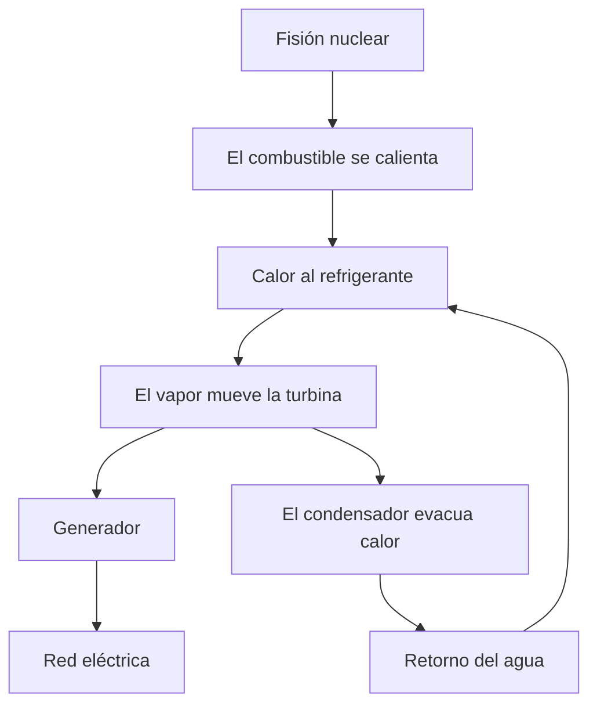
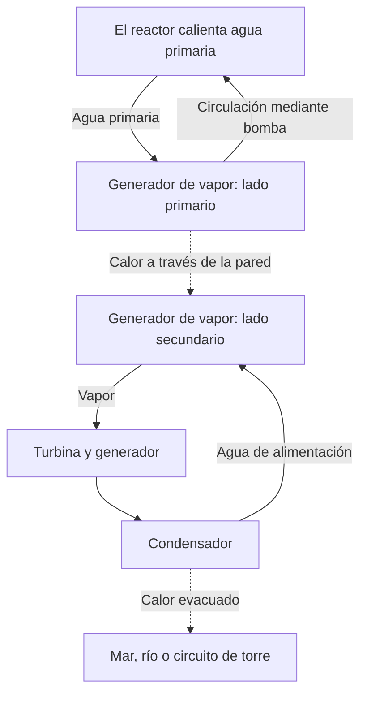

## 1. Al final de la central hay un generador que gira

La energía nuclear puede sugerir una máquina que extrae electricidad directamente del átomo. Sin embargo, en la mayoría de las centrales habituales, la electricidad la produce un generador acoplado a una turbina. El reactor genera calor, el calor produce vapor y el vapor mueve la turbina.

Este recorrido básico también existe en centrales de vapor alimentadas con carbón o gas. Cambia la fuente de calor: reacciones químicas en un caso y transformaciones del núcleo atómico en el otro. Entre la fisión y el generador hay agua, equipos que producen vapor, tuberías, turbina y condensador.

Seguir esta cadena aclara ventajas y dificultades. Poco combustible puede aportar mucho calor, pero si no se evacua, el combustible se sobrecalienta. Incluso al detener la reacción en cadena, los materiales radiactivos ya producidos siguen generando calor. **Parar el reactor no equivale a haber enfriado suficientemente la central.**

Nos centramos en los **reactores de agua ligera**, muy extendidos en generación comercial. Los diagramas explican funciones, no tuberías reales ni procedimientos operativos. La fusión une núcleos ligeros y es distinta de la fisión tratada aquí. [Introducción del Departamento de Energía de EE. UU.][doe-reactor]

## 2. Quemar combustible y transformar núcleos son procesos diferentes

La materia está formada por átomos. Su núcleo contiene protones y neutrones, con electrones a su alrededor. Quemar carbón cambia los enlaces entre átomos como el carbono y el oxígeno. Es una reacción química que afecta principalmente a los electrones; el núcleo de carbono no se convierte en otro elemento.

La fisión divide un núcleo pesado en dos relativamente más ligeros y otros productos. Las configuraciones inicial y final tienen distinta energía, y la diferencia se libera. La energía necesaria para separar un núcleo en protones y neutrones individuales se llama energía de enlace.

¿Por qué una unión más fuerte libera energía? Un objeto que cae de una estantería pasa a un estado de menor energía y cede la diferencia. De manera semejante, no basta con «romper» un núcleo para obtener energía: algunas reacciones necesitan aportes externos.

La energía de enlace por nucleón aumenta, en general, desde núcleos muy ligeros hasta masas intermedias, con valores altos cerca del hierro y el níquel. Por eso ciertas reacciones liberan energía tanto al dividir núcleos pesados como al unir ligeros. [ATOMICA: estructura nuclear][binding]

La relación con la diferencia de masa es:

$$
E=\Delta m c^2
$$

$\Delta m$ es la diferencia de masa en reposo y $c$ la velocidad de la luz. No desaparece todo el combustible para convertirse en electricidad. Quedan fragmentos y neutrones; la diferencia aparece como energía cinética y radiación. Tampoco todo el calor resultante puede convertirse en corriente.

## 3. La energía de fisión calienta primero el combustible

El uranio 235 es un nucleido fisible representativo de los reactores de agua ligera. Tras absorber un neutrón, su núcleo puede pasar por un estado excitado y dividirse, produciendo fragmentos, neutrones y radiación gamma. Los productos varían: no aparecen siempre los mismos dos elementos.

Gran parte de la energía la transportan los fragmentos rápidos. Al chocar con la materia del combustible se frenan y generan calor. Este atraviesa la vaina y llega al refrigerante. La energía cambia de forma varias veces antes de alcanzar un enchufe doméstico.

Una aproximación técnica habitual utiliza unos 200 MeV de calor aprovechable por fisión. Los neutrinos se llevan parte de la energía y las capturas neutrónicas aportan otra parte, por lo que el balance exacto depende de los nucleidos y del ámbito considerado. [ATOMICA: fisión][fission]

Un electronvoltio equivale aproximadamente a $1.602\times10^{-19}$ J; 200 MeV son unos $3.20\times10^{-11}$ J. Cada evento parece pequeño, pero una cantidad cotidiana de materia contiene muchísimos átomos.

$$
\dot N\approx\frac{P_{\mathrm{th}}}{E_f}
$$

$P_{\mathrm{th}}$ es la potencia térmica, $E_f$ el calor por fisión y $\dot N$ las fisiones por segundo. Para 3 000 millones de vatios, resultan aproximadamente $9.4\times10^{19}$ fisiones por segundo. Es una estimación de escala, no un análisis detallado de quemado.

«Mucha energía con poco combustible» significa alta energía por masa, no una explosión macroscópica en cada evento. Mantener esas reacciones microscópicas requiere controlar la cadena.

## 4. Crítico significa que la cadena se mantiene equilibrada

Un neutrón de fisión puede provocar otra fisión que emita nuevos neutrones. Pero no todos continúan la cadena: algunos se absorben sin fisión y otros escapan del núcleo del reactor.

El **factor de multiplicación efectivo**, $k_{\mathrm{eff}}$, representa ese balance, es decir, cómo cambia la población de neutrones de una generación a la siguiente.

| Estado | Condición | Tendencia general |
|---|---|---|
| Subcrítico | $k_{\mathrm{eff}}<1$ | La cadena disminuye, sin considerar fuentes adicionales |
| Crítico | $k_{\mathrm{eff}}=1$ | Las generaciones se equilibran |
| Supercrítico | $k_{\mathrm{eff}}>1$ | La cadena tiende a crecer |

«Crítico» no significa por sí mismo accidente. Un reactor a potencia constante equilibra producción y pérdidas de neutrones. Tampoco indica cuánta potencia produce: puede ser crítico a potencia baja o alta.

Un modelo deliberadamente simplificado es:

$$
N_g=N_0\left(k_{\mathrm{eff}}\right)^g
$$

Después de 100 generaciones, la proporción es aproximadamente 0,366 con 0,99; 1 con 1,00; y 2,70 con 1,01. Pequeñas diferencias se acumulan. Pero el modelo omite tiempos, neutrones retardados, temperaturas y controles. **No predice cuántos segundos tarda un cambio real de potencia.**

## 5. Moderador, absorbente y refrigerante tienen tareas distintas

Saber que hay agua y barras no basta. Frenar neutrones, absorberlos y transportar calor son funciones diferentes.

El **moderador** reduce la energía de los neutrones. Los de fisión son rápidos; las colisiones con núcleos del agua los frenan. El uranio 235 presenta mayor probabilidad de fisión en una región de baja energía neutrónica, característica que aprovecha el diseño.

El **material absorbente** captura neutrones y reduce los disponibles para continuar la cadena. Las barras de control cumplen esa función. Frenar un neutrón no es retirarlo de la reacción: afirmar que las barras simplemente lo ralentizan confunde los papeles.

El **refrigerante** retira calor del combustible. El agua también modera en un reactor de agua ligera, pero no es una combinación universal. Otros diseños pueden emplear grafito como moderador y gas como refrigerante. [Material educativo de la NRC][nrc-reactors]

| Función | Qué modifica | Ejemplo en agua ligera |
|---|---|---|
| Moderación | Energía del neutrón | Agua |
| Absorción y control | Neutrones disponibles | Barras y otros absorbentes |
| Refrigeración | Temperaturas del combustible y los circuitos | Agua circulante |
| Confinamiento | Movimiento de sustancias radiactivas | Vainas, barrera de presión, contención |

Al tener el agua dos funciones, su temperatura y densidad afectan tanto al enfriamiento como al comportamiento neutrónico. Física nuclear, transferencia de calor y fluidos están estrechamente acoplados.

## 6. Neutrones retardados y realimentación de temperatura

La mayoría de los neutrones aparece inmediatamente en la fisión. Una pequeña parte surge después, mediante desintegraciones de productos de fisión: son los **neutrones retardados**. Aunque escasos, cambian profundamente la dinámica temporal.

Una reacción que aumenta rápidamente solo con neutrones inmediatos no evoluciona igual que otra que necesita los retardados para equilibrarse. Esta diferencia es esencial para el control normal. No se detiene cada fisión individualmente, sino que se regula el balance colectivo. [IAEA: física nuclear y teoría de reactores][reactor-theory]

Algunos efectos físicos reducen la reactividad cuando aumenta la temperatura. El efecto Doppler modifica la absorción en uranio 238 y otros nucleidos al calentarse el combustible, aportando realimentación negativa importante. [ATOMICA: diseño del núcleo PWR][core-design]

Eso no significa que calentarse siempre garantice una parada segura. Densidad del moderador, fracción de vapor y estado del combustible dependen del diseño y las condiciones. La realimentación física se combina con medición, control y sistemas de parada.

Los productos de fisión también introducen demoras. El xenón 135 absorbe intensamente neutrones y su cantidad depende del historial de potencia. Ajustar la producción no es simplemente girar una llave de llama: importa también la operación anterior.

## 7. PWR: agua presurizada calienta un circuito separado

El reactor de agua a presión, PWR, mantiene el refrigerante primario a alta presión para evitar su ebullición generalizada en el núcleo. En el generador de vapor transmite calor a través de una pared metálica al agua secundaria.

El vapor secundario va a la turbina, y el agua primaria vuelve al reactor. En funcionamiento normal intercambian calor sin mezclar sus aguas. Enviar directamente agua del reactor a la turbina no es el esquema básico PWR.

La separación mantiene el agua primaria potencialmente radiactiva aparte de la turbina. Sin embargo, los tubos del generador de vapor son una barrera importante que debe inspeccionarse. Separar no elimina mantenimiento: crea un límite cuya integridad importa.

El presionador regula la presión primaria y las bombas mueven el refrigerante. Los sistemas auxiliares miden y mantienen presión, temperatura e inventario de agua. [DOE: funcionamiento del PWR][pwr]

## 8. BWR: producir vapor dentro del reactor

El reactor de agua en ebullición, BWR, aprovecha que el agua hierva en la vasija. Se separan gotas líquidas del vapor antes de enviarlo a la turbina. Después de expandirse, el vapor condensa y vuelve como agua de alimentación.

A diferencia del PWR, vapor originado en agua que atravesó el núcleo llega a la turbina, por lo que también allí se necesitan medidas radiológicas. El ciclo básico no incluye el generador de vapor que separa primario y secundario en un PWR. [NRC: reactores BWR][bwr]

| Aspecto | PWR | BWR |
|---|---|---|
| Producción principal de vapor | Secundario del generador de vapor | Dentro del reactor |
| Agua del núcleo | Alta presión limita la ebullición generalizada | Se aprovecha la ebullición |
| Fluido hacia la turbina | Vapor secundario | Vapor producido en el reactor |
| Esquema | Circuitos separados por intercambio térmico | Conexión directa de vapor |
| Requisitos comunes | Refrigerar, parar, confinar, evacuar calor | Refrigerar, parar, confinar, evacuar calor |

Ambos usan agua, pero no son sistemas idénticos. La simplicidad aparente no decide seguridad o economía. Hay que comparar funciones accidentales, acceso para inspecciones, materiales y condiciones operativas.

## 9. ¿Por qué no convertir todo el calor en electricidad?

La turbina convierte la expansión del vapor caliente y presurizado en giro. El generador produce electricidad por inducción electromagnética. El condensador devuelve el vapor al estado líquido: reduce mucho su volumen, favorece una baja presión de salida y permite bombearlo de nuevo.

La refrigeración no es un accesorio. Un motor térmico cíclico recibe calor de un foco caliente y entrega parte a otro frío. Incluso idealmente, una diferencia finita de temperatura impide convertirlo todo en trabajo.

$$
\eta_{\mathrm{Carnot}}=1-\frac{T_c}{T_h}
$$

Las temperaturas se expresan en kelvin, no en Celsius. Suponiendo 570 K y 300 K, el límite ideal es aproximadamente 47 %. Intercambio térmico, fricción, estado del vapor y pérdidas de las máquinas reducen el rendimiento real. Este modelo simplifica el ciclo a dos temperaturas.

Una referencia aproximada para agua ligera es un tercio de eficiencia eléctrica. No significa que ocurra un tercio de las fisiones, sino que esa fracción del calor se vuelve electricidad. Aumentar temperatura ayuda, pero materiales, corrosión, presión y límites del combustible imponen restricciones. [ATOMICA: calor rechazado][thermal]

Una central hipotética de 3 000 MW térmicos al 33 % produce 990 MW eléctricos y debe evacuar unos 2 010 MW de calor.

$$
P_e=\eta P_{\mathrm{th}},\qquad
P_{\mathrm{out}}=P_{\mathrm{th}}-P_e
$$

La aproximación no separa el consumo auxiliar. En una central real se distingue la salida del generador de la electricidad neta tras alimentar bombas y equipos. Grandes sistemas de refrigeración gestionan el resto mediante mar, río o torres. La nube blanca de una torre suele ser de gotitas de agua; su aspecto no permite medir emisiones radiactivas.

## 10. Calor residual: la parada no termina la producción de calor

Los mecanismos de parada reducen mucho la fisión en cadena, pero permanecen numerosos nucleidos radiactivos creados durante la operación. Su desintegración libera energía: **el calor de desintegración continúa tras la parada**.

Compararlo con apagar un calefactor es incompleto. Además del calor almacenado, sigue produciéndose calor nuevo. Esperar no basta: debe mantenerse una vía de evacuación. [IAEA: principios de seguridad nuclear][safety-basics]

Para un solo nucleido de periodo de semidesintegración $T_{1/2}$:

$$
N(t)=N(0)\,2^{-t/T_{1/2}}
$$

Los de vida corta disminuyen rápido; los de vida larga, lentamente. El combustible gastado contiene muchos nucleidos y cadenas de desintegración. Un único periodo no describe su calor total; también importan potencia previa, duración de operación y composición.

Como referencia de escala, el 1 % de 3 000 MW sigue siendo 30 MW. No es un valor de calor residual para un instante concreto: muestra que un porcentaje pequeño de una potencia enorme aún es considerable. No debe confundirse con casi cero.

Parada, refrigeración, alimentación e instrumentación están conectadas. Refrigerar puede requerir bombas y válvulas, y conocer su estado exige instrumentos. La prevención de accidentes debe conservar esa cadena funcional.

## 11. Seguridad: parar, refrigerar y confinar

Una pared gruesa no resume la seguridad nuclear. Es necesario limitar la reacción, retirar calor y retener materiales radiactivos.

Las pastillas retienen parte de los productos; las vainas separan combustible y refrigerante; la frontera de presión y la contención aportan otras barreras. No todas las sustancias se retienen igual, y temperaturas o presiones accidentales pueden afectar esas barreras. Contarlas no demuestra una imposibilidad absoluta de fuga.

La **redundancia** protege frente a averías individuales. Pero equipos en la misma habitación y altura pueden inundarse juntos. También cuentan la **diversidad** de principios o suministros y la **independencia**, incluida la separación física. Más repuestos idénticos no eliminan fallos de causa común.

| Función | Consecuencia de perderla | Consideraciones |
|---|---|---|
| Detener la reacción | Calor insuficientemente reducido | Medios de parada, medición, fiabilidad |
| Refrigerar combustible | Sobrecalentamiento y daños | Vías térmicas, agua, energía, márgenes de tiempo |
| Confinar sustancias | Migración o liberación | Integridad, presión, gestión de fugas |
| Conocer el estado | Decisiones difíciles | Instrumentos, suministro, comunicación, formación |

La seguridad pasiva utiliza gravedad o circulación natural para reducir dependencia de equipos alimentados. Pasivo no significa incondicional ni ilimitado: reservas de agua, presiones, válvulas y sumidero térmico siguen siendo necesarios.

Después de Fukushima Daiichi, la NRC reforzó medidas para mantener funciones ante pérdida de fuentes eléctricas instaladas y vigilar piscinas de combustible. La lección es sistémica: un suceso externo puede dañar simultáneamente alimentación, refrigeración y medición. [NRC: lecciones de Fukushima][fukushima]

## 12. Del descubrimiento a la central

Descubrir la fisión, sostener una cadena, producir electricidad y suministrarla a la red fueron hitos separados.

Tras los experimentos de Hahn y Strassmann a finales de 1938, Meitner y Frisch interpretaron el fenómeno como división del núcleo. Se abría una fuente de energía, pero demostrar la reacción no equivalía a utilizarla con fiabilidad. [APS: descubrimiento e interpretación][discovery]

El 2 de diciembre de 1942, el equipo de Fermi logró una cadena controlada y autosostenida en Chicago Pile-1. No era una central comercial. La investigación estuvo profundamente ligada a programas militares de la Segunda Guerra Mundial; su posterior uso civil no elimina ese contexto. [Argonne: CP-1][cp1]

En 1951, EBR-I produjo electricidad y encendió bombillas en Estados Unidos. En 1954, Obninsk, en la Unión Soviética, suministró electricidad a la red. Reactores navales, demostradores, materiales, maquinaria de vapor y regulación contribuyeron después al uso comercial. [Idaho National Laboratory: EBR-I][ebr], [historia de la IAEA][iaea-history]

| Etapa | Pregunta | Capacidades necesarias |
|---|---|---|
| Comprender la reacción | ¿Por qué libera energía? | Física y medición |
| Mantener la cadena | ¿Puede sostenerse bajo control? | Balance neutrónico, control, blindaje |
| Demostrar electricidad | ¿El calor puede mover máquinas? | Refrigerantes, intercambiadores, turbinas |
| Operar comercialmente | ¿Puede suministrar durante años? | Materiales, mantenimiento, combustible, organización |
| Responsabilidad a largo plazo | ¿Puede gestionarse todo el ciclo? | Regulación, residuos, costes, acuerdo social |

Una gran observación física no creó automáticamente centrales. Mantener materiales, organizar inspecciones, paradas y años de funcionamiento requirió mucho más que iniciar una reacción.

## 13. El combustible no entra como mineral

Extracción, procesamiento, ajuste isotópico cuando hace falta, fabricación, uso y gestión posterior forman el ciclo del combustible. «Ciclo» no implica que todo vuelva al comienzo: existen disposición directa y recuperación parcial para reutilización.

El uranio natural es principalmente uranio 238, con aproximadamente 0,7 % de uranio 235. El combustible habitual de agua ligera eleva esta última proporción a unos pocos puntos porcentuales. Suele fabricarse como pastillas sinterizadas de dióxido de uranio dentro de vainas metálicas; varias barras forman un conjunto. [IAEA: fundamentos][fuel-basics]

Durante la operación se consumen nucleidos fisibles, se acumulan productos de fisión y las capturas generan otros nucleidos. No consiste simplemente en usar el uranio 235 inicial hasta hacerlo desaparecer.

La recarga tampoco espera a que desaparezca todo el uranio. Importan reactividad, absorbentes acumulados, integridad y distribución de potencia. Que quede material no significa que pueda seguir utilizándose de forma segura y económica en la misma configuración.

La calidad de fabricación importa porque el calor cruza pastilla, separación, vaina y refrigerante. Si empeora una parte del transporte, cambian temperaturas internas aun con igual potencia. Materiales y transferencia térmica complementan la física nuclear. [DOE: ciclo del combustible][fuel-cycle]

## 14. Combustible gastado: almacenar no es disponer definitivamente

El combustible recién descargado emite radiación y calor residual. Las piscinas proporcionan inicialmente refrigeración y blindaje; bajo condiciones adecuadas puede pasar a almacenamiento en seco. Plazos y criterios dependen del combustible y la instalación.

El agua retira calor y atenúa radiación. En seco, contenedores y estructuras aportan confinamiento y protección mientras evacuan calor. Salir de la piscina no significa perder la radiactividad.

**El almacenamiento suele prever gestión continuada y posible recuperación; la disposición definitiva busca aislamiento a largo plazo.** El reprocesamiento también deja materiales no deseados y residuos del tratamiento. Reutilizar no hace desaparecer el problema de los residuos. [IAEA: almacenamiento de combustible gastado][spent-fuel]

Residuos de operación, materiales de desmantelamiento y residuos relacionados con combustible difieren en nucleidos, actividad, calor y volumen. La gestión depende del contenido y de sus posibles vías hacia personas o ambiente, no solo de la etiqueta «radiactivo».

La disposición geológica combina forma del residuo, contenedor, materiales de relleno y geología para limitar movimientos. Los plazos largos requieren experimentos, observaciones, conocimiento de aguas subterráneas y modelos. Emplazamiento, vigilancia, responsabilidades y diálogo local también son esenciales.

Posponer la gestión futura oscurece los costes. La evaluación debe incluir el periodo posterior a la descarga y al cierre, no únicamente el precio del combustible durante la generación.

## 15. Separar potencia, energía y coste

Un millón de kW expresa potencia en un momento; kWh expresa energía suministrada durante un tiempo. Confundirlos mezcla tamaño de central y contribución real.

Una instalación hipotética de 1 GW con factor de capacidad anual del 90 % produce unos 7,884 TWh:

$$
E_{\mathrm{year}}=P_{\mathrm{rated}}\times8760\,\mathrm{h}\times CF
$$

$CF$ es el factor de capacidad, no solo la fiabilidad. Incluye recargas, inspecciones, reducciones por demanda y paradas regulatorias. El 90 % es una hipótesis, no una garantía universal.

El combustible nuclear tiene alta densidad energética y el reactor no quema combustibles fósiles. Es una fuente baja en carbono, pero extracción, procesamiento, construcción y desmantelamiento generan emisiones de ciclo de vida. Comparar exige límites consistentes. [IPCC AR6: sistemas energéticos][ipcc]

Construcción e inversión inicial pesan en la economía. Los retrasos también cambian la financiación. Prolongar una planta existente y construir otra nueva son situaciones distintas.

En la red importan demanda, otros generadores, transmisión, almacenamiento y reservas. «No puede cambiar de potencia» y «siempre puede seguir libremente la demanda» son simplificaciones. La capacidad técnica debe distinguirse de la operación condicionada por combustible, mantenimiento y costes.

## 16. ¿Qué intentan cambiar los reactores pequeños y avanzados?

Los reactores modulares pequeños, SMR, buscan modificar fabricación, construcción o despliegue mediante unidades menores y modularidad. SMR no identifica una única reacción o diseño: incluye agua ligera y otros conceptos de refrigerante o núcleo. [IAEA: SMR][smr]

Una unidad pequeña puede facilitar fabricación en fábrica y reducir inversión por unidad, pero perder economías de escala. Los beneficios de serie dependen de pedidos reales, estandarización, regulación y suministros.

Otros diseños buscan calor industrial a alta temperatura, neutrones rápidos o refrigerantes diferentes. Sus objetivos abarcan usos térmicos, recursos, residuos, seguridad y construcción. Mejorar una característica no resuelve automáticamente las demás.

Hay que distinguir concepto, instalación experimental, demostrador y operación comercial. Un plan no equivale a funcionamiento probado durante años. Evaluar el potencial exige separar resultados alcanzados y pendientes.

## 17. Cinco comprobaciones al leer noticias

Antes de concluir, compruebe:

1. **Qué potencia.** Térmica del reactor, bruta del generador y neta a la red son diferentes.
2. **Qué estado.** Operación, parada reciente, parada prolongada y descarga implican necesidades distintas.
3. **Qué límite.** Núcleo, primario, edificio, emplazamiento y ambiente no describen los mismos procesos.
4. **Qué magnitud.** Bq mide actividad; Gy, dosis absorbida o energía por masa; Sv se usa para evaluar efectos radiológicos. Sus cifras no son directamente comparables. [NRC: medición de radiación][radiation]
5. **Qué periodo y costes.** Incluir combustible, construcción, cierre y residuos cambia la evaluación.

Los efectos sanitarios también dependen del tipo de radiación, vía de exposición, duración y condiciones de medida. Aquí distinguimos magnitudes, sin deducir consecuencias individuales de cifras aisladas.

La fisión aporta calor; la ingeniería lo transforma en una fuente eléctrica y lo gestiona después de la parada. **Pregunte no solo si puede producirse calor, sino adónde va, qué sucede si falla ese camino y quién gestiona los materiales restantes.** Esa es la clave para entender la energía nuclear.

## Fuentes y alcance de las ilustraciones

Los cálculos son ejemplos didácticos con supuestos explícitos, no evaluaciones de rendimiento o seguridad de instalaciones reales. La portada es una ilustración conceptual generada con IA; dimensiones, tuberías y colores no representan planos de ingeniería.

- [DOE: reactores][doe-reactor], [PWR][pwr], [fisión][doe-fission], [ciclo del combustible][fuel-cycle] (inglés)
- [ATOMICA: estructura][binding], [fisión][fission], [núcleo PWR][core-design], [calor evacuado][thermal] (japonés)
- [NRC: material educativo][nrc-reactors], [BWR][bwr], [Fukushima][fukushima], [magnitudes radiológicas][radiation] (inglés)
- [IAEA: teoría][reactor-theory], [seguridad][safety-basics], [historia][iaea-history], [combustible][fuel-basics], [almacenamiento][spent-fuel], [SMR][smr] (inglés)
- [Argonne: CP-1][cp1], [Idaho: EBR-I][ebr], [APS: descubrimiento][discovery] (inglés)
- [IPCC: AR6, grupo III, capítulo 6][ipcc] (inglés)

[doe-reactor]: https://www.energy.gov/ne/articles/nuclear-101-how-does-nuclear-reactor-work
[binding]: https://atomica.jaea.go.jp/data/detail/dat_detail_03-06-03-01.html
[fission]: https://atomica.jaea.go.jp/data/detail/dat_detail_03-06-03-04.html
[nrc-reactors]: https://www.nrc.gov/education-regulatory-research/the-student-corner/unit-3-nuclear-reactorsenergy-generation
[reactor-theory]: https://gnssn.iaea.org/main/bptc/BPTC%20Module%20Documents/Module01%20Nuclear%20physics%20and%20reactor%20theory.pdf
[core-design]: https://atomica.jaea.go.jp/data/detail/dat_detail_02-04-02-01.html
[pwr]: https://www.energy.gov/ne/articles/infographic-how-does-pressurized-water-reactor-work
[bwr]: https://www.nrc.gov/reactors/power/bwrs
[thermal]: https://atomica.jaea.go.jp/data/detail/dat_detail_01-04-03-02.html
[safety-basics]: https://gnssn.iaea.org/main/bptc/BPTC%20Module%20Documents/Module03%20Basic%20principles%20of%20nuclear%20safety.pdf
[fukushima]: https://www.nrc.gov/regulations-legislation/fact-sheets-brochures/backgrounder-on-nrc-response-to-lessons-learned-from-fukushima
[doe-fission]: https://www.energy.gov/science/doe-explainsnuclear-fission
[cp1]: https://www.ne.anl.gov/About/cp1-pioneers/
[ebr]: https://inl.gov/ebr/
[iaea-history]: https://www-pub.iaea.org/MTCD/Publications/PDF/Pub1032_web.pdf
[fuel-basics]: https://nucleus-qa.iaea.org/sites/graphiteknowledgebase/wiki/Guide_to_Graphite/Fundamentals%20of%20Nuclear%20Power.aspx
[fuel-cycle]: https://www.energy.gov/ne/nuclear-fuel-cycle
[spent-fuel]: https://nucleus-apps.iaea.org/nss-oui/Content/Index?CollectionId=m_f7375b40-3d77-4ea5-a2e3-77090916bc67__8_0&type=PublishedCollection
[ipcc]: https://www.ipcc.ch/report/ar6/wg3/chapter/chapter-6/
[smr]: https://www.iaea.org/newscenter/news/what-are-small-modular-reactors-smrs
[discovery]: https://journals.aps.org/prl/50years/timeline
[radiation]: https://www.nrc.gov/facilities-safety/radiation-protection/radiation-and-its-health-effects/measuring-radiation
