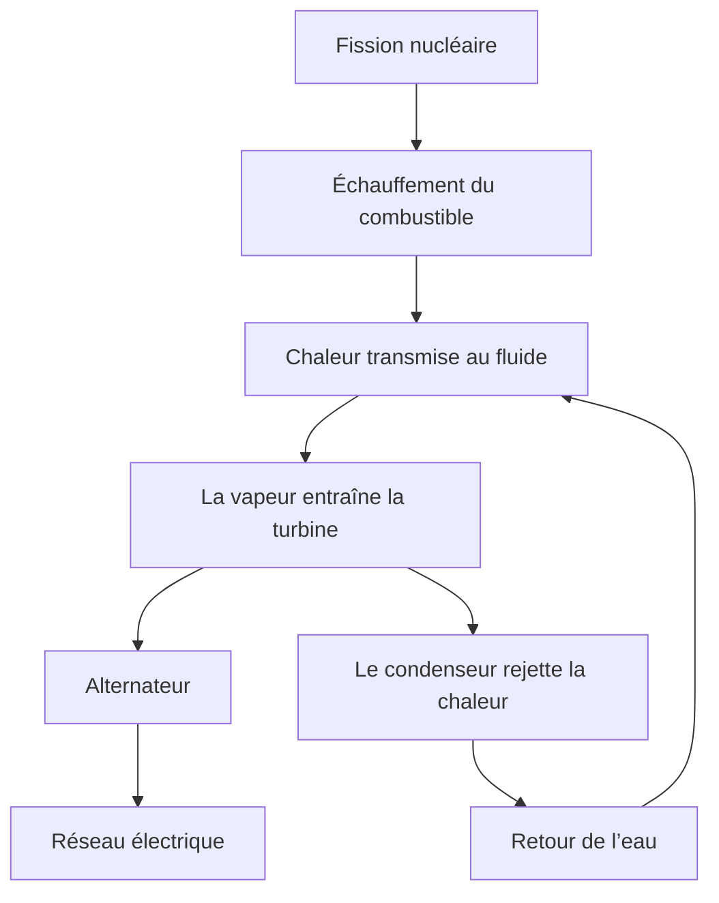
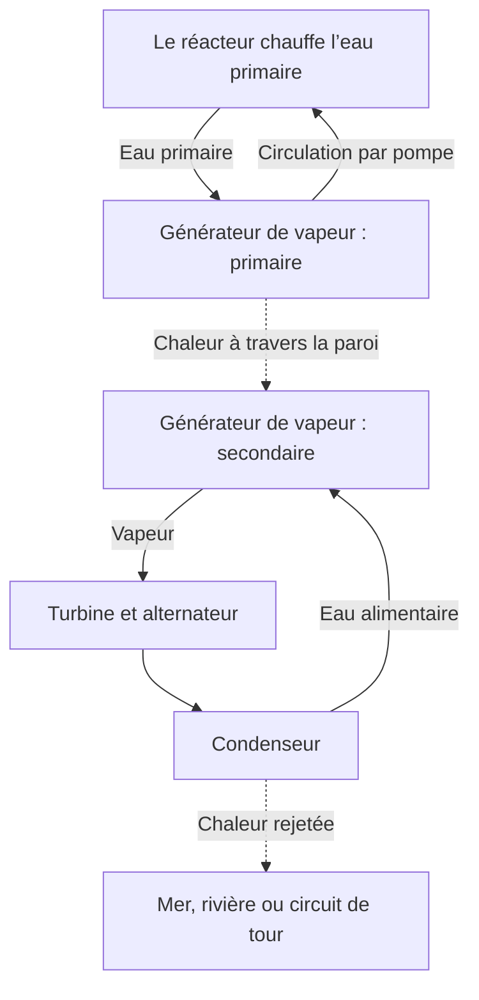

## 1. Au bout de la chaîne, un alternateur tourne

Le nucléaire évoque parfois une machine qui extrait directement de l’électricité des atomes. Pourtant, dans la plupart des centrales courantes, c’est un alternateur couplé à une turbine qui produit le courant. Le réacteur fournit de la chaleur, cette chaleur produit de la vapeur, et la vapeur fait tourner la turbine.

Ce principe général est partagé avec les centrales à vapeur utilisant charbon ou gaz. La différence tient à la source de chaleur : réactions essentiellement chimiques dans un cas, transformations du noyau dans l’autre. Entre la fission et l’alternateur se trouvent de l’eau, des équipements produisant la vapeur, des tuyaux, une turbine et un condenseur.

Suivre cette chaîne éclaire les atouts comme les difficultés. Peu de combustible fournit beaucoup de chaleur, mais celle-ci doit être évacuée pour éviter la surchauffe. Après l’arrêt de la réaction en chaîne, les matières radioactives déjà produites continuent de chauffer. **Arrêter le réacteur ne signifie pas que la centrale est suffisamment refroidie.**

Nous nous concentrons sur les **réacteurs à eau légère**, très répandus pour la production commerciale. Les schémas expliquent des fonctions, pas des tuyauteries réelles ou des procédures de conduite. La fusion, qui assemble des noyaux légers, est distincte de la fission étudiée ici. [Introduction du département américain de l’Énergie][doe-reactor]

## 2. Brûler un combustible et transformer un noyau

La matière est faite d’atomes. Leur noyau contient protons et neutrons, avec des électrons autour. La combustion du charbon modifie les liaisons entre, notamment, le carbone et l’oxygène. Cette réaction chimique concerne surtout les électrons : le noyau de carbone ne devient pas un autre élément.

La fission partage un noyau lourd en deux noyaux relativement plus légers et d’autres produits. L’énergie diffère entre les arrangements initiaux et finaux ; la différence est libérée. L’énergie nécessaire pour séparer un noyau en protons et neutrons isolés est son énergie de liaison.

Pourquoi une liaison plus forte libère-t-elle de l’énergie ? Un objet qui tombe d’une étagère passe à un état d’énergie plus faible et cède la différence. De même, ce n’est pas le simple fait de « casser » un noyau qui produit de l’énergie : certaines réactions en consomment.

L’énergie de liaison par nucléon augmente globalement des noyaux très légers aux noyaux de masse moyenne, avec de grandes valeurs près du fer et du nickel. Des réactions adaptées peuvent donc libérer de l’énergie en divisant des noyaux lourds ou en fusionnant des noyaux légers. [ATOMICA : structure nucléaire][binding]

La relation entre masse et énergie s’écrit :

$$
E=\Delta m c^2
$$

$\Delta m$ est la différence de masse au repos, et $c$ la vitesse de la lumière. Tout le combustible ne disparaît pas pour devenir du courant. Fragments et neutrons subsistent ; la différence apparaît sous forme d’énergie cinétique et de rayonnement. La chaleur obtenue ne peut ensuite être entièrement transformée en électricité.

## 3. L’énergie de fission chauffe d’abord le combustible

L’uranium 235 est un nucléide fissile représentatif des réacteurs à eau légère. Après absorption d’un neutron, son noyau peut passer par un état excité puis se scinder, en émettant fragments, neutrons et rayonnement gamma. Les produits varient : il ne s’agit pas toujours des mêmes deux éléments.

Une grande part de l’énergie est emportée par les fragments rapides. Leurs collisions dans le combustible les ralentissent et produisent de la chaleur. Celle-ci traverse la gaine vers le fluide de refroidissement. Jusqu’à la prise domestique, l’énergie change donc plusieurs fois de forme.

Une estimation technique courante retient environ 200 MeV de chaleur utilisable par fission. Les neutrinos emportent une partie de l’énergie, tandis que des captures neutroniques en apportent : le bilan précis dépend des nucléides et du périmètre choisi. [ATOMICA : réaction de fission][fission]

Un électronvolt vaut environ $1.602\times10^{-19}$ J ; 200 MeV correspondent à $3.20\times10^{-11}$ J. C’est minuscule par événement, mais une quantité ordinaire de matière contient énormément d’atomes.

$$
\dot N\approx\frac{P_{\mathrm{th}}}{E_f}
$$

$P_{\mathrm{th}}$ désigne la puissance thermique, $E_f$ la chaleur par fission et $\dot N$ le nombre de fissions par seconde. Pour 3 milliards de watts, on obtient environ $9.4\times10^{19}$ fissions par seconde. C’est un ordre de grandeur, pas un calcul détaillé d’évolution du combustible.

« Beaucoup d’énergie avec peu de combustible » signifie une forte énergie par unité de masse, et non une explosion macroscopique à chaque fission. Il faut contrôler la chaîne pour maintenir régulièrement ces réactions microscopiques.

## 4. La criticité correspond à une chaîne équilibrée

Un neutron de fission peut provoquer une autre fission, qui libère de nouveaux neutrons. Mais tous ne prolongent pas la chaîne : certains sont absorbés sans fission, d’autres s’échappent du cœur.

Le **facteur de multiplication effectif**, $k_{\mathrm{eff}}$, décrit ce bilan. Il représente, de manière intuitive, la multiplication de la population neutronique entre deux générations.

| État | Condition | Tendance générale |
|---|---|---|
| Sous-critique | $k_{\mathrm{eff}}<1$ | La chaîne décroît en l’absence d’autres sources |
| Critique | $k_{\mathrm{eff}}=1$ | Les générations s’équilibrent |
| Surcritique | $k_{\mathrm{eff}}>1$ | La chaîne tend à croître |

Dans ce contexte, « critique » ne signifie pas accident. Un réacteur à puissance constante équilibre production et pertes de neutrons. La criticité ne précise pas non plus la puissance : elle peut exister à faible ou à forte puissance.

Un modèle volontairement simplifié donne :

$$
N_g=N_0\left(k_{\mathrm{eff}}\right)^g
$$

Après 100 générations, le rapport est environ 0,366 pour 0,99, 1 pour 1,00 et 2,70 pour 1,01. Les petits écarts s’accumulent. Mais ce modèle omet durée des générations, neutrons retardés, températures et commande. **Il ne permet pas de prévoir en combien de secondes évolue la puissance réelle.**

## 5. Modérateur, absorbant et caloporteur ont des rôles différents

Savoir qu’un réacteur contient de l’eau et des barres ne suffit pas. Ralentir les neutrons, les absorber et transporter la chaleur sont trois fonctions distinctes.

Le **modérateur** diminue l’énergie des neutrons. Ceux issus de la fission sont rapides ; les collisions avec les noyaux de l’eau les ralentissent. Dans une région de faible énergie neutronique, la probabilité de fission de l’uranium 235 est plus élevée, ce qu’exploite le réacteur.

Le **matériau absorbant** capture des neutrons et réduit leur nombre disponible pour la chaîne. Les barres de commande remplissent ce rôle. Ralentir un neutron n’est pas le retirer de la réaction : dire que les barres ne font que ralentir confond les fonctions.

Le **caloporteur** évacue la chaleur du combustible. L’eau joue aussi le rôle de modérateur dans un réacteur à eau légère, mais ce n’est pas universel. D’autres modèles peuvent employer du graphite comme modérateur et un gaz comme caloporteur. [NRC : matériel pédagogique][nrc-reactors]

| Fonction | Grandeur modifiée | Exemple dans un réacteur à eau légère |
|---|---|---|
| Modération | Énergie des neutrons | Eau |
| Absorption et commande | Neutrons disponibles pour la chaîne | Barres et autres absorbants |
| Refroidissement et transfert | Températures du combustible et des circuits | Eau en circulation |
| Confinement | Déplacement des substances radioactives | Gaines, circuit sous pression, enceinte |

Cette double fonction de l’eau couple sa température et sa densité au comportement neutronique. Physique nucléaire, transferts thermiques et écoulements sont étroitement liés.

## 6. Neutrons retardés et rétroaction de température

La plupart des neutrons apparaissent immédiatement lors de la fission. Une petite fraction est émise plus tard, à la suite de désintégrations de produits de fission : ce sont les **neutrons retardés**. Leur faible proportion n’empêche pas une grande influence sur la dynamique.

Une réaction qui croît rapidement avec les seuls neutrons prompts n’a pas la même évolution temporelle qu’une réaction ayant besoin des retardés pour s’équilibrer. Cette distinction est essentielle à la commande normale. Les opérateurs ne stoppent pas les fissions une par une : ils ajustent le bilan global. [IAEA : physique nucléaire et théorie des réacteurs][reactor-theory]

Certains effets de température s’opposent à une augmentation de réaction. L’effet Doppler modifie notamment l’absorption des neutrons par l’uranium 238 lorsque le combustible chauffe, apportant une rétroaction négative importante. [ATOMICA : conception du cœur d’un REP][core-design]

Cela ne veut pas dire que toute hausse de température garantit un arrêt sûr. Densité du modérateur, fraction de vapeur et état du combustible ont des effets dépendant du modèle et du fonctionnement. Les rétroactions physiques sont complétées par la mesure, la commande et l’arrêt.

Les produits de fission introduisent d’autres délais. Le xénon 135 absorbe fortement les neutrons, et sa quantité dépend de l’historique de puissance. Modifier la production ne revient donc pas à tourner un bouton de flamme : l’exploitation passée compte aussi.

## 7. REP : un circuit sous pression chauffe un autre circuit

Le réacteur à eau pressurisée, REP ou PWR, maintient l’eau primaire sous forte pression pour éviter son ébullition globale lorsqu’elle traverse le cœur. Dans le générateur de vapeur, elle transmet la chaleur à l’eau secondaire à travers une paroi métallique.

La vapeur secondaire rejoint la turbine, tandis que l’eau primaire retourne au réacteur. En fonctionnement normal, les circuits échangent de la chaleur sans mélanger leurs eaux. Envoyer directement l’eau du réacteur à la turbine n’est pas le principe d’un REP.

Cette séparation éloigne du circuit turbine le fluide primaire susceptible de contenir des substances radioactives. Les tubes du générateur de vapeur forment néanmoins une frontière importante à inspecter. Séparer les circuits ne supprime pas l’entretien : une limite supplémentaire doit rester intègre.

Le pressuriseur règle la pression primaire, et des pompes font circuler le fluide. Des systèmes auxiliaires mesurent et maintiennent pression, température et quantité d’eau. [DOE : fonctionnement d’un REP][pwr]

## 8. REB : produire la vapeur dans le réacteur

Le réacteur à eau bouillante, REB ou BWR, utilise l’ébullition dans la cuve. Des dispositifs retirent les gouttelettes avant d’envoyer la vapeur à la turbine. Après détente, la vapeur condense et l’eau revient au réacteur.

La vapeur provenant de l’eau passée dans le cœur atteint ici la turbine, ce qui impose aussi des dispositions de radioprotection dans cette zone. Le cycle de base ne comporte pas de générateur de vapeur séparant primaire et secondaire comme dans un REP. [NRC : REB][bwr]

| Point comparé | REP | REB |
|---|---|---|
| Production principale de vapeur | Côté secondaire du générateur de vapeur | Dans le réacteur |
| Eau du cœur | Forte pression limitant l’ébullition globale | Ébullition utilisée |
| Fluide vers la turbine | Vapeur secondaire | Vapeur produite dans le réacteur |
| Organisation | Séparation par échangeur | Liaison vapeur directe |
| Exigences communes | Refroidir, arrêter, confiner, évacuer la chaleur | Refroidir, arrêter, confiner, évacuer la chaleur |

Tous deux utilisent de l’eau, mais leurs systèmes diffèrent. La simplicité apparente ne détermine pas seule sûreté ou économie : fonctions accidentelles, inspections, matériaux et conditions de fonctionnement doivent être comparés.

## 9. Pourquoi ne pas convertir toute la chaleur en électricité ?

La turbine transforme la détente de vapeur chaude sous pression en rotation. L’alternateur produit du courant par induction électromagnétique. Le condenseur transforme ensuite la vapeur en eau, réduisant fortement son volume, maintenant une faible pression de sortie et permettant de pomper le liquide.

Le refroidissement n’est pas un simple accessoire. Un moteur thermique cyclique reçoit de la chaleur d’une source chaude et en rejette une partie vers une source froide. Même idéalement, un écart de température fini interdit une conversion totale en travail.

$$
\eta_{\mathrm{Carnot}}=1-\frac{T_c}{T_h}
$$

Les températures sont en kelvins, pas en degrés Celsius. Avec 570 K et 300 K, la limite idéale est d’environ 47 %. Échanges thermiques, frottements, état de la vapeur et pertes des machines abaissent le rendement réel. Ce modèle à deux températures simplifie un cycle dont les températures varient.

Pour les réacteurs à eau légère, un ordre de grandeur est un tiers de rendement électrique. Cela ne signifie pas qu’un tiers seulement des fissions se produit, mais qu’un tiers de la chaleur devient électricité. Des températures plus élevées favorisent le rendement, sous contraintes de matériaux, corrosion, pression et limites du combustible. [ATOMICA : rejets thermiques][thermal]

Pour une centrale fictive de 3 000 MW thermiques à 33 %, la puissance électrique est 990 MW et environ 2 010 MW doivent être rejetés sous forme de chaleur.

$$
P_e=\eta P_{\mathrm{th}},\qquad
P_{\mathrm{out}}=P_{\mathrm{th}}-P_e
$$

Ce bilan ne détaille pas la consommation des auxiliaires. Il faut aussi distinguer la puissance de l’alternateur et la puissance nette livrée après consommation des pompes et équipements. Le reste explique les grands circuits de refroidissement : mer, rivière ou tour aéroréfrigérante. Le panache blanc d’une tour est généralement formé de gouttelettes ; son apparence ne mesure pas des rejets radioactifs.

## 10. La chaleur résiduelle persiste après l’arrêt

Les moyens d’arrêt réduisent fortement la chaleur de la réaction en chaîne. Mais les nombreux nucléides radioactifs produits restent présents et libèrent de l’énergie en se désintégrant. **La puissance résiduelle continue après l’arrêt.**

Comparer cela à un radiateur électrique éteint est incomplet. Il y a de la chaleur stockée et une nouvelle production de chaleur. Attendre ne suffit pas : il faut conserver un chemin d’évacuation. [IAEA : principes de sûreté][safety-basics]

Pour un seul nucléide de période radioactive $T_{1/2}$ :

$$
N(t)=N(0)\,2^{-t/T_{1/2}}
$$

Les nucléides de courte période diminuent vite, ceux de longue période lentement. Le combustible usé contient cependant de nombreux nucléides et chaînes de désintégration. Une seule période ne décrit pas sa chaleur totale. Puissance antérieure, durée d’utilisation et composition interviennent.

À titre d’échelle, 1 % de 3 000 MW représente encore 30 MW. Ce n’est pas une estimation à un instant précis après l’arrêt : cela montre qu’un faible pourcentage d’une grande puissance reste considérable. Petit pourcentage ne signifie pas presque zéro.

Arrêt, refroidissement, alimentation et mesure sont liés. Refroidir peut demander pompes et vannes ; les instruments permettent d’en connaître l’état. La préparation aux accidents doit préserver cette chaîne.

## 11. La sûreté combine arrêt, refroidissement et confinement

Une épaisse paroi ne résume pas la sûreté. Il faut limiter la réaction, évacuer la chaleur et retenir les substances radioactives.

Les pastilles retiennent une partie des produits, les gaines séparent combustible et fluide, puis le circuit sous pression et l’enceinte forment d’autres barrières. Toutes les substances ne sont pas retenues pareillement, et les conditions accidentelles peuvent dégrader ces barrières. Les compter ne prouve pas une absence absolue de fuite.

La **redondance** protège contre une panne individuelle. Mais plusieurs matériels dans la même pièce et à la même hauteur peuvent tous être inondés. La **diversité** des principes ou alimentations et l’**indépendance**, notamment physique, comptent également. Multiplier les mêmes secours n’élimine pas les causes communes.

| Fonction | Conséquence de sa perte | Questions de conception |
|---|---|---|
| Arrêter la réaction | Production de chaleur insuffisamment réduite | Moyens d’arrêt, mesure, fiabilité |
| Refroidir le combustible | Surchauffe et dommages | Chemins thermiques, eau, énergie, marges de temps |
| Confiner les matières | Migration ou rejet | Intégrité, pression, gestion des fuites |
| Connaître l’état | Décisions difficiles | Instruments, alimentation, communication, formation |

Les systèmes passifs utilisent gravité ou circulation naturelle pour moins dépendre d’actionneurs alimentés. Passif ne signifie ni inconditionnel ni illimité : réserves d’eau, différences de pression, vannes et source froide restent nécessaires.

Après Fukushima Daiichi, la NRC a renforcé le maintien des fonctions de sûreté en cas de perte des alimentations installées et la surveillance des piscines de combustible. La leçon systémique est qu’un événement extérieur peut endommager simultanément alimentation, refroidissement et instrumentation. [NRC : enseignements de Fukushima][fukushima]

## 12. De la découverte au réseau électrique

Découvrir la fission, entretenir une chaîne, produire du courant et alimenter un réseau sont des étapes distinctes.

Après les résultats expérimentaux de Hahn et Strassmann fin 1938, Meitner et Frisch ont interprété le phénomène comme une division du noyau. Une source d’énergie devenait envisageable, mais observer la réaction ne signifiait pas encore l’exploiter de manière fiable. [APS : découverte et interprétation][discovery]

Le 2 décembre 1942, l’équipe de Fermi a obtenu une réaction contrôlée et autoentretenue dans Chicago Pile-1. Ce n’était pas une centrale commerciale. La recherche était profondément liée aux programmes militaires de la Seconde Guerre mondiale ; son utilisation civile ultérieure ne doit pas effacer ce contexte. [Argonne : CP-1][cp1]

En 1951, EBR-I aux États-Unis a produit de l’électricité et allumé des ampoules. En 1954, Obninsk en Union soviétique a fourni de l’électricité au réseau. Réacteurs navals, démonstrateurs, matériaux, machines à vapeur et réglementation ont ensuite contribué à l’industrialisation. [Idaho National Laboratory : EBR-I][ebr], [histoire de l’IAEA][iaea-history]

| Étape | Question | Compétences nécessaires |
|---|---|---|
| Comprendre la réaction | Pourquoi l’énergie est-elle libérée ? | Physique et mesure |
| Entretenir la chaîne | Peut-on la maintenir sous contrôle ? | Bilan neutronique, commande, protection |
| Démontrer l’électricité | La chaleur entraîne-t-elle les machines ? | Fluides, échangeurs, turbines |
| Exploiter commercialement | Peut-on fournir durablement ? | Matériaux, maintenance, combustible, organisation |
| Assumer le long terme | Peut-on gérer tout le cycle de vie ? | Régulation, déchets, coûts, accord social |

Une découverte spectaculaire n’a pas automatiquement créé des centrales. Maintenir les matériaux et organiser arrêts, inspections et fonctionnement prolongé a demandé bien davantage que déclencher une réaction.

## 13. Le combustible n’entre pas sous forme de minerai

Extraction, traitement, adaptation éventuelle de la composition isotopique, fabrication, utilisation et gestion après usage constituent le cycle du combustible. « Cycle » ne veut pas dire que tout revient au départ : on peut choisir le stockage définitif direct ou récupérer certains matériaux pour les réutiliser.

L’uranium naturel contient surtout de l’uranium 238 et environ 0,7 % d’uranium 235. Le combustible classique à eau légère porte cette dernière fraction à quelques pour cent. Il prend souvent la forme de pastilles frittées de dioxyde d’uranium dans des gaines métalliques ; plusieurs crayons forment un assemblage. [IAEA : bases du nucléaire][fuel-basics]

En fonctionnement, les nucléides fissiles sont consommés, les produits de fission s’accumulent et les captures créent d’autres nucléides. Ce n’est pas simplement utiliser l’uranium 235 initial jusqu’à disparition.

On renouvelle le combustible avant disparition de tout l’uranium. Réactivité, absorbants accumulés, intégrité des matériaux et répartition de puissance importent. Du matériau restant n’est pas nécessairement utilisable en sécurité et économiquement dans sa configuration actuelle.

La qualité de fabrication compte : la chaleur traverse pastille, jeu, gaine et fluide. Un transfert dégradé modifie la température interne à puissance identique. Matériaux et thermique complètent la physique nucléaire. [DOE : cycle du combustible][fuel-cycle]

## 14. Combustible usé : entreposage et stockage définitif

Le combustible fraîchement déchargé émet des rayonnements et de la chaleur résiduelle. Une piscine assure initialement refroidissement et protection ; sous conditions, un entreposage à sec peut suivre. Durées et critères dépendent du combustible et de l’installation.

L’eau évacue la chaleur et atténue les rayonnements. À sec, conteneurs et structures assurent confinement et protection tout en évacuant la chaleur. Sortir de l’eau ne signifie pas avoir perdu sa radioactivité.

**L’entreposage prévoit généralement une gestion continue et une récupération possible ; le stockage définitif vise l’isolement à long terme.** Le retraitement laisse aussi des matières indésirables et des déchets de procédé. La réutilisation ne supprime pas le problème des déchets. [IAEA : entreposage du combustible usé][spent-fuel]

Déchets d’exploitation, matériaux de démantèlement et déchets liés au combustible diffèrent en nucléides, activité, chaleur et volume. Leur gestion dépend de leur contenu et des voies possibles vers les personnes ou l’environnement, pas seulement du mot « radioactif ».

Le stockage géologique associe forme du déchet, conteneurs, matériaux environnants et géologie pour limiter les migrations. Les longues durées exigent expériences, observations, compréhension des eaux souterraines et modèles. Choix du site, surveillance, responsabilités et dialogue local restent essentiels.

Reporter la gestion future brouille les coûts. L’évaluation doit dépasser le prix du combustible pendant la production et inclure l’après-déchargement et l’après-fermeture.

## 15. Distinguer puissance, énergie et coût

Un million de kW exprime une puissance instantanée ; les kWh expriment une énergie fournie sur une durée. Confondre les deux mélange taille de la centrale et contribution réelle.

Une centrale fictive de 1 GW avec un facteur de charge annuel de 90 % produit environ 7,884 TWh :

$$
E_{\mathrm{year}}=P_{\mathrm{rated}}\times8760\,\mathrm{h}\times CF
$$

$CF$ désigne le facteur de charge, pas seulement la fiabilité. Rechargements, inspections, réductions liées à la demande et arrêts réglementaires interviennent. Les 90 % sont une hypothèse, non une garantie universelle.

Le nucléaire possède une forte densité énergétique du combustible et ne brûle pas de combustible fossile dans le réacteur. C’est une source bas-carbone, mais extraction, fabrication, construction et démantèlement signifient que les émissions du cycle de vie ne sont pas nulles. Les comparaisons exigent des périmètres identiques. [GIEC, AR6 : systèmes énergétiques][ipcc]

Durée de construction et investissement initial pèsent sur l’économie. Les retards modifient aussi le financement. Prolonger une installation existante et en construire une neuve sont deux situations différentes.

À l’échelle du réseau, demande, autres producteurs, lignes, stockage et réserves comptent. « Le nucléaire ne peut pas moduler » et « il peut toujours suivre librement » sont deux simplifications. Les possibilités techniques diffèrent de l’exploitation tenant compte du combustible, de la maintenance et des coûts.

## 16. Que cherchent à changer les petits réacteurs et les nouveaux modèles ?

Les petits réacteurs modulaires, ou SMR, cherchent à modifier fabrication, construction ou déploiement par des unités plus petites et une approche modulaire. SMR ne désigne pas une seule technologie : eau légère et autres concepts de cœur ou de fluide sont envisagés. [IAEA : SMR][smr]

Une petite unité peut faciliter la fabrication en usine et limiter l’investissement unitaire, mais perdre certaines économies d’échelle. Les gains de série dépendent des commandes réelles, de la standardisation, de la réglementation et des fournisseurs.

D’autres modèles visent la chaleur industrielle à haute température, les neutrons rapides ou d’autres caloporteurs. Les objectifs portent sur les usages thermiques, les ressources, les déchets, la sûreté et la construction. Améliorer un point ne résout pas tous les autres.

Il faut distinguer concept, installation d’essai, démonstrateur et fonctionnement commercial. Une annonce n’équivaut pas à une preuve sur longue durée. Évaluer le potentiel exige de séparer résultats acquis et démonstrations restantes.

## 17. Cinq vérifications pour lire l’actualité

Avant de conclure, vérifiez :

1. **Quelle puissance ?** Thermique du réacteur, brute de l’alternateur et nette du réseau diffèrent.
2. **Quel état ?** Fonctionnement, arrêt récent, arrêt prolongé et déchargement impliquent des besoins différents.
3. **Quel périmètre ?** Cœur, primaire, bâtiment, site et environnement ne recouvrent pas les mêmes phénomènes.
4. **Quelle grandeur ?** Bq mesure l’activité ; Gy la dose absorbée, énergie par unité de masse ; Sv intervient dans l’évaluation des effets. Les nombres ne sont pas directement comparables. [NRC : mesure des rayonnements][radiation]
5. **Quelle durée et quels coûts ?** Inclure combustible, construction, fermeture et déchets change l’évaluation.

Les effets sanitaires dépendent aussi du type de rayonnement, de la voie d’exposition, de la durée et des mesures. Nous distinguons ici les grandeurs sans tirer de conclusions individuelles d’un chiffre isolé.

La fission fournit la chaleur ; l’ingénierie en fait une source d’électricité et la maîtrise après l’arrêt. **Demandez non seulement si la chaleur peut être produite, mais où elle va, ce qui arrive si son chemin est coupé et qui gère les matières restantes.** C’est la clé d’une compréhension concrète.

## Sources et portée des illustrations

Les calculs sont des exemples pédagogiques à hypothèses explicites, pas des évaluations de performance ou de marge de sûreté. La couverture est une illustration conceptuelle générée par IA ; dimensions, tuyauteries et couleurs ne constituent pas un plan industriel.

- [DOE : réacteurs][doe-reactor], [REP][pwr], [fission][doe-fission], [cycle du combustible][fuel-cycle] (anglais)
- [ATOMICA : structure][binding], [fission][fission], [cœur REP][core-design], [rejets thermiques][thermal] (japonais)
- [NRC : cours][nrc-reactors], [REB][bwr], [Fukushima][fukushima], [grandeurs radiologiques][radiation] (anglais)
- [IAEA : théorie][reactor-theory], [sûreté][safety-basics], [histoire][iaea-history], [combustible][fuel-basics], [entreposage][spent-fuel], [SMR][smr] (anglais)
- [Argonne : CP-1][cp1], [Idaho : EBR-I][ebr], [APS : découverte][discovery] (anglais)
- [GIEC : AR6, groupe III, chapitre 6][ipcc] (anglais)

[doe-reactor]: https://www.energy.gov/ne/articles/nuclear-101-how-does-nuclear-reactor-work
[binding]: https://atomica.jaea.go.jp/data/detail/dat_detail_03-06-03-01.html
[fission]: https://atomica.jaea.go.jp/data/detail/dat_detail_03-06-03-04.html
[nrc-reactors]: https://www.nrc.gov/education-regulatory-research/the-student-corner/unit-3-nuclear-reactorsenergy-generation
[reactor-theory]: https://gnssn.iaea.org/main/bptc/BPTC%20Module%20Documents/Module01%20Nuclear%20physics%20and%20reactor%20theory.pdf
[core-design]: https://atomica.jaea.go.jp/data/detail/dat_detail_02-04-02-01.html
[pwr]: https://www.energy.gov/ne/articles/infographic-how-does-pressurized-water-reactor-work
[bwr]: https://www.nrc.gov/reactors/power/bwrs
[thermal]: https://atomica.jaea.go.jp/data/detail/dat_detail_01-04-03-02.html
[safety-basics]: https://gnssn.iaea.org/main/bptc/BPTC%20Module%20Documents/Module03%20Basic%20principles%20of%20nuclear%20safety.pdf
[fukushima]: https://www.nrc.gov/regulations-legislation/fact-sheets-brochures/backgrounder-on-nrc-response-to-lessons-learned-from-fukushima
[doe-fission]: https://www.energy.gov/science/doe-explainsnuclear-fission
[cp1]: https://www.ne.anl.gov/About/cp1-pioneers/
[ebr]: https://inl.gov/ebr/
[iaea-history]: https://www-pub.iaea.org/MTCD/Publications/PDF/Pub1032_web.pdf
[fuel-basics]: https://nucleus-qa.iaea.org/sites/graphiteknowledgebase/wiki/Guide_to_Graphite/Fundamentals%20of%20Nuclear%20Power.aspx
[fuel-cycle]: https://www.energy.gov/ne/nuclear-fuel-cycle
[spent-fuel]: https://nucleus-apps.iaea.org/nss-oui/Content/Index?CollectionId=m_f7375b40-3d77-4ea5-a2e3-77090916bc67__8_0&type=PublishedCollection
[ipcc]: https://www.ipcc.ch/report/ar6/wg3/chapter/chapter-6/
[smr]: https://www.iaea.org/newscenter/news/what-are-small-modular-reactors-smrs
[discovery]: https://journals.aps.org/prl/50years/timeline
[radiation]: https://www.nrc.gov/facilities-safety/radiation-protection/radiation-and-its-health-effects/measuring-radiation
