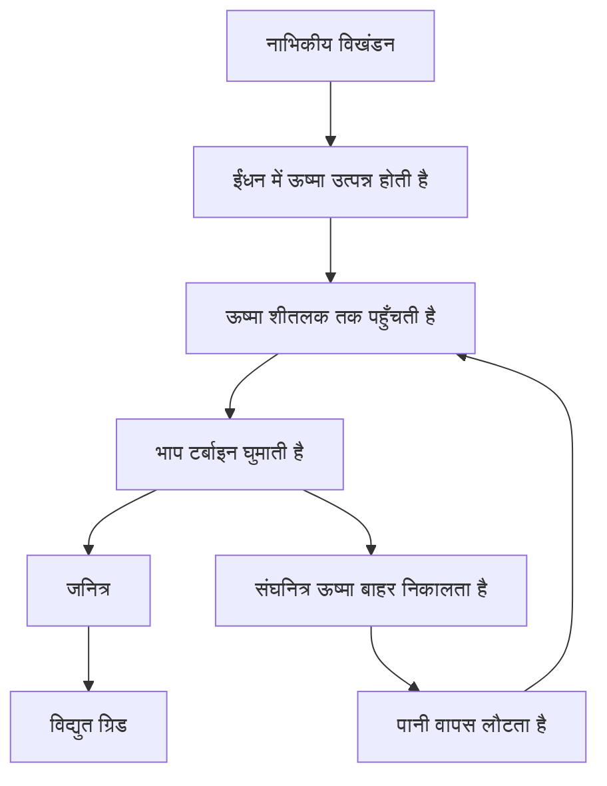
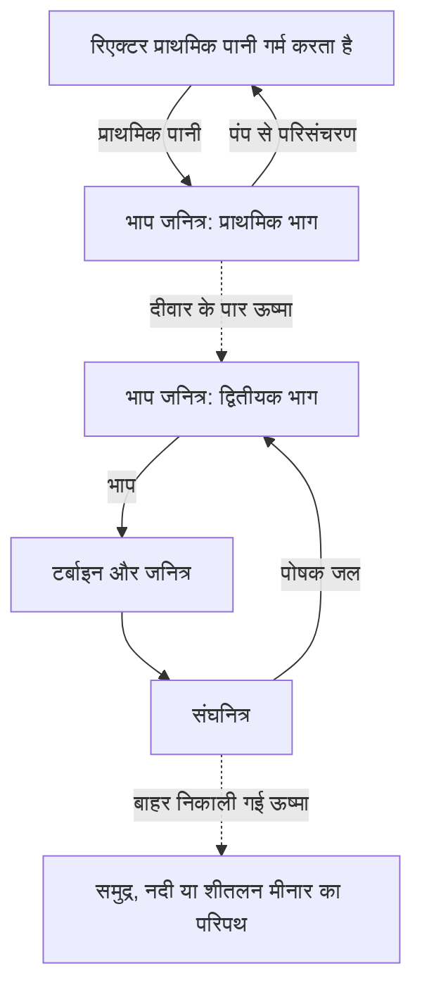

## 1. प्रक्रिया के अंत में एक घूमता हुआ जनित्र होता है

परमाणु ऊर्जा का नाम सुनकर ऐसा लग सकता है कि कोई मशीन सीधे परमाणुओं से बिजली निकालती है। लेकिन अधिकांश प्रचलित परमाणु बिजलीघरों में बिजली बनाने वाला अंतिम उपकरण टर्बाइन से जुड़ा जनित्र होता है। रिएक्टर ऊष्मा उत्पन्न करता है, ऊष्मा से भाप बनती है और भाप टर्बाइन घुमाती है।

यह व्यापक क्रम कोयले या प्राकृतिक गैस की ऊष्मा से चलने वाले भाप बिजलीघरों में भी मिलता है। अंतर ऊष्मा के स्रोत में है: जीवाश्म ईंधन वाले संयंत्र में मुख्यतः रासायनिक अभिक्रियाएँ होती हैं, जबकि परमाणु संयंत्र में परमाणु नाभिक बदलते हैं। विखंडन और जनित्र के बीच बहता पानी, भाप बनाने वाले उपकरण, पाइप, टर्बाइन और संघनित्र मौजूद होते हैं।

इस क्रम को समझने से लाभ और चुनौतियाँ दोनों स्पष्ट होते हैं। थोड़े ईंधन से बहुत ऊष्मा मिल सकती है, लेकिन उसे बाहर न ले जाया जाए तो ईंधन अत्यधिक गर्म हो सकता है। शृंखला अभिक्रिया रोकने के बाद भी पहले से बने रेडियोधर्मी पदार्थ ऊष्मा उत्पन्न करते रहते हैं। **रिएक्टर रोकना और संयंत्र को पर्याप्त ठंडा करना एक ही बात नहीं है।**

यह लेख व्यावसायिक बिजली उत्पादन में व्यापक रूप से प्रयुक्त **हल्के पानी वाले रिएक्टरों** पर केंद्रित है। आरेख कार्य समझाते हैं, वास्तविक पाइप व्यवस्था या संचालन विधि नहीं। संलयन में हल्के नाभिक जुड़ते हैं; वह यहाँ वर्णित विखंडन से अलग प्रक्रिया है। [अमेरिकी ऊर्जा विभाग का रिएक्टर परिचय][doe-reactor]

## 2. ईंधन जलाना और नाभिक बदलना अलग प्रक्रियाएँ हैं

पदार्थ परमाणुओं से बना है। परमाणु के केंद्र में प्रोटॉन और न्यूट्रॉन वाला नाभिक होता है, जिसके आसपास इलेक्ट्रॉन होते हैं। कोयला जलने पर कार्बन और ऑक्सीजन जैसे परमाणुओं के बीच के बंध बदलते हैं। यह रासायनिक अभिक्रिया मुख्यतः इलेक्ट्रॉनों से संबंधित है; कार्बन का नाभिक किसी दूसरे तत्व का नाभिक नहीं बन जाता।

विखंडन में भारी नाभिक दो अपेक्षाकृत हल्के नाभिकों और अन्य उत्पादों में बँटता है। अभिक्रिया के पहले और बाद की नाभिकीय व्यवस्थाओं की ऊर्जा अलग होती है, इसलिए ऊर्जा निकलती है। किसी नाभिक को अलग-अलग प्रोटॉन और न्यूट्रॉन में पूरी तरह अलग करने के लिए आवश्यक ऊर्जा उसकी बंधन ऊर्जा कहलाती है।

अधिक मज़बूती से बँधी व्यवस्था बनने पर ऊर्जा निकलना पहली नज़र में उलटा लग सकता है। ऊँची शेल्फ से गिरती वस्तु सोचिए: कम ऊर्जा वाली अवस्था में पहुँचने पर अंतर की ऊर्जा मुक्त होती है। केवल किसी चीज़ को तोड़ देने से ऊर्जा पैदा नहीं होती। कुछ अभिक्रियाओं में ऊर्जा देनी पड़ती है।

प्रति न्यूक्लिऑन बंधन ऊर्जा बहुत हल्के नाभिकों से मध्यम द्रव्यमान वाले नाभिकों की ओर सामान्यतः बढ़ती है और लोहे तथा निकेल के पास बड़े मान तक पहुँचती है। इसलिए उपयुक्त अभिक्रियाओं में भारी नाभिक तोड़ने और हल्के नाभिक जोड़ने, दोनों से ऊर्जा निकल सकती है। [ATOMICA: नाभिक की संरचना][binding]

द्रव्यमान के अंतर और ऊर्जा का संबंध है:

$$
E=\Delta m c^2
$$

यहाँ $\Delta m$ विराम द्रव्यमान का अंतर और $c$ प्रकाश की चाल है। इसका अर्थ यह नहीं कि पूरा ईंधन गायब होकर बिजली बन जाता है। विखंडन खंड और न्यूट्रॉन बचे रहते हैं; अंतर की ऊर्जा गतिज ऊर्जा और विकिरण के रूप में आती है। इसके बाद भी सारी ऊष्मा बिजली में नहीं बदली जा सकती।

## 3. विखंडन की ऊर्जा पहले ईंधन को गर्म करती है

यूरेनियम-235 हल्के पानी वाले रिएक्टर में प्रयुक्त एक प्रमुख विखंडनीय समस्थानिक है। न्यूट्रॉन अवशोषित करने के बाद उसका नाभिक उत्तेजित अवस्था में जाकर टूट सकता है, जिससे खंड, न्यूट्रॉन और गामा विकिरण निकलते हैं। खंडों के संयोजन अलग-अलग होते हैं; हर बार वही दो तत्व नहीं बनते।

ऊर्जा का बड़ा भाग तेज़ी से चलते खंडों में होता है। वे आसपास के पदार्थ से टकराकर धीमे होते हैं और ईंधन को गर्म करते हैं। ऊष्मा फिर ईंधन के आवरण से शीतलक तक पहुँचती है। नाभिकीय घटना से घर के विद्युत सॉकेट तक ऊर्जा कई बार रूप बदलती है।

इंजीनियरिंग अनुमान के लिए प्रति विखंडन लगभग 200 MeV ऊष्मा उपयोगी मान है। न्यूट्रिनो कुछ ऊर्जा बाहर ले जाते हैं, जबकि न्यूट्रॉन का प्रग्रहण अतिरिक्त ऊर्जा दे सकता है। इसलिए विस्तृत संतुलन समस्थानिकों और चुनी गई प्रणाली की सीमा पर निर्भर करता है। [ATOMICA: विखंडन अभिक्रियाएँ][fission]

एक इलेक्ट्रॉनवोल्ट लगभग $1.602\times10^{-19}$ जूल है। इसलिए 200 MeV लगभग $3.20\times10^{-11}$ जूल होता है। एक घटना के लिए यह छोटा लगता है, लेकिन सामान्य मात्रा के पदार्थ में परमाणुओं की संख्या बहुत बड़ी होती है।

$$
\dot N\approx\frac{P_{\mathrm{th}}}{E_f}
$$

$P_{\mathrm{th}}$ तापीय शक्ति है, $E_f$ प्रति विखंडन ऊष्मा और $\dot N$ प्रति सेकंड विखंडनों की संख्या। 3 अरब वाट को ऊपर दी ऊर्जा से भाग देने पर लगभग $9.4\times10^{19}$ विखंडन प्रति सेकंड मिलते हैं। यह पैमाना समझाने वाला उदाहरण है, रिएक्टर ईंधन की विस्तृत गणना नहीं।

कम ईंधन से अधिक शक्ति का अर्थ प्रति इकाई द्रव्यमान अधिक ऊर्जा है। इसका अर्थ हर विखंडन पर कोई विशाल विस्फोट होना नहीं है। इन सूक्ष्म घटनाओं को स्थिर रूप से जारी रखने के लिए शृंखला अभिक्रिया नियंत्रित करनी होती है।

## 4. क्रांतिक अवस्था का अर्थ शृंखला अभिक्रिया का संतुलन है

एक विखंडन का न्यूट्रॉन दूसरा विखंडन करा सकता है, जिससे और न्यूट्रॉन निकलते हैं। यही शृंखला अभिक्रिया है। हर न्यूट्रॉन इसे आगे नहीं बढ़ाता: कुछ बिना विखंडन कराए अवशोषित हो जाते हैं और कुछ रिएक्टर के क्रोड से बाहर निकल जाते हैं।

**प्रभावी गुणन गुणांक**, $k_{\mathrm{eff}}$, यह संतुलन बताता है। सरल रूप में यह दिखाता है कि एक पीढ़ी से अगली पीढ़ी में न्यूट्रॉनों की संख्या कैसे बदलती है।

| अवस्था | शर्त | सामान्य प्रवृत्ति |
|---|---|---|
| उपक्रांतिक | $k_{\mathrm{eff}}<1$ | बाहरी स्रोतों को छोड़ दें तो शृंखला घटती है |
| क्रांतिक | $k_{\mathrm{eff}}=1$ | लगातार पीढ़ियाँ संतुलित रहती हैं |
| अतिक्रांतिक | $k_{\mathrm{eff}}>1$ | शृंखला बढ़ने की प्रवृत्ति रखती है |

सामान्य बातचीत के संकट वाले अर्थ के विपरीत, रिएक्टर की क्रांतिकता अपने आप में दुर्घटना नहीं है। स्थिर शक्ति पर चल रहा रिएक्टर न्यूट्रॉन उत्पादन और हानि को संतुलित करता है। क्रांतिकता से शक्ति का मान भी तय नहीं होता: रिएक्टर कम या अधिक शक्ति, दोनों पर क्रांतिक हो सकता है।

पीढ़ियों का जानबूझकर सरल बनाया गया मॉडल है:

$$
N_g=N_0\left(k_{\mathrm{eff}}\right)^g
$$

100 पीढ़ियों बाद संख्या का अनुपात गुणांक 0.99 पर लगभग 0.366, 1.00 पर 1 और 1.01 पर 2.70 होगा। छोटे अंतर जुड़ते जाते हैं। लेकिन इस सूत्र में पीढ़ी का समय, विलंबित न्यूट्रॉन, तापमान परिवर्तन या नियंत्रण उपकरण शामिल नहीं हैं। **इससे वास्तविक शक्ति परिवर्तन में लगने वाले सेकंड नहीं निकाले जा सकते।**

## 5. मंदक, अवशोषक और शीतलक के काम अलग हैं

सिर्फ यह जानना पर्याप्त नहीं कि रिएक्टर में पानी और छड़ें हैं। न्यूट्रॉन धीमा करना, उसे अवशोषित करना और ऊष्मा ले जाना अलग काम हैं।

**मंदक** न्यूट्रॉन की ऊर्जा कम करता है। विखंडन से निकले न्यूट्रॉन तेज़ होते हैं; हल्के पानी वाले रिएक्टर में वे पानी के नाभिकों से टकराकर धीमे होते हैं। कम न्यूट्रॉन ऊर्जा वाले क्षेत्र में यूरेनियम-235 के विखंडन की संभावना अधिक होती है, जिसका डिज़ाइन लाभ उठाता है।

**नियंत्रण अवशोषक** न्यूट्रॉन पकड़कर शृंखला में उपलब्ध संख्या घटाता है। नियंत्रण छड़ें यह काम करती हैं। न्यूट्रॉन धीमा करना और उसे शृंखला से हटा देना अलग बातें हैं। छड़ों को केवल न्यूट्रॉन धीमा करने वाला कहना भूमिकाएँ गड़बड़ा देता है।

**शीतलक** ईंधन की ऊष्मा बाहर ले जाता है। हल्के पानी वाले रिएक्टर में पानी मंदक और शीतलक दोनों है, लेकिन यह हर रिएक्टर पर लागू नहीं होता। अन्य प्रकारों में ग्रेफाइट मंदक और गैस शीतलक हो सकते हैं। [NRC की शैक्षिक सामग्री][nrc-reactors]

| कार्य | क्या बदलता है | हल्के पानी वाले रिएक्टर का उदाहरण |
|---|---|---|
| मंदन | न्यूट्रॉन की ऊर्जा | पानी |
| अवशोषण और अभिक्रिया नियंत्रण | शृंखला के लिए उपलब्ध न्यूट्रॉन | नियंत्रण छड़ें और अन्य अवशोषक |
| शीतलन और ऊष्मा परिवहन | ईंधन तथा प्रणाली का तापमान | परिसंचारी पानी |
| परिरोधन | रेडियोधर्मी पदार्थों की आवाजाही | आवरण, दाब सीमा और परिरोधन संरचना |

पानी की दो भूमिकाओं के कारण उसका तापमान और घनत्व शीतलन तथा न्यूट्रॉन व्यवहार दोनों को प्रभावित करते हैं। रिएक्टर में नाभिकीय भौतिकी, ऊष्मा अंतरण और द्रव प्रवाह निकटता से जुड़े हैं।

## 6. विलंबित न्यूट्रॉन और तापमान प्रतिपुष्टि नियंत्रण के लिए समय देते हैं

अधिकांश विखंडन न्यूट्रॉन तुरंत निकलते हैं। एक छोटा भाग विखंडन उत्पादों के रेडियोधर्मी क्षय के बाद देर से निकलता है। इन **विलंबित न्यूट्रॉनों** की संख्या छोटी होने पर भी रिएक्टर की समय-संबंधी प्रतिक्रिया पर उनका प्रभाव बड़ा है।

केवल तात्कालिक न्यूट्रॉनों से बनी और तेज़ी से बढ़ती शृंखला, संतुलन के लिए विलंबित न्यूट्रॉनों पर निर्भर शृंखला से अलग व्यवहार करती है। सामान्य नियंत्रण में यह अंतर महत्वपूर्ण है। मनुष्य और मशीन प्रत्येक विखंडन को अलग से नहीं रोकते; वे कुल न्यूट्रॉन संतुलन बदलते हैं। [IAEA: नाभिकीय भौतिकी और रिएक्टर सिद्धांत][reactor-theory]

कुछ भौतिक प्रभाव तापमान बढ़ने पर अभिक्रियाशीलता घटाते हैं। ईंधन गर्म होने पर डॉप्लर प्रभाव यूरेनियम-238 तथा अन्य समस्थानिकों में न्यूट्रॉन अवशोषण बदलता है और महत्वपूर्ण ऋणात्मक प्रतिपुष्टि देता है। [ATOMICA: PWR क्रोड का डिज़ाइन][core-design]

लेकिन यह कहना सही नहीं कि गर्म होने पर हर रिएक्टर हमेशा सुरक्षित रूप से रुक जाता है। मंदक के घनत्व, भाप के अनुपात और ईंधन की अवस्था का प्रभाव डिज़ाइन तथा संचालन स्थिति पर निर्भर करता है। भौतिक प्रतिपुष्टि के साथ उपकरण, नियंत्रण प्रणालियाँ और बंद करने की व्यवस्था भी आवश्यक हैं।

विखंडन उत्पाद पिछले संचालन का असर जोड़ते हैं। उदाहरण के लिए ज़ीनॉन-135 न्यूट्रॉन का प्रबल अवशोषक है और उसकी मात्रा पिछली शक्ति पर निर्भर करती है। शक्ति बदलना केवल चूल्हे की लौ का घुंडी घुमाना नहीं है: वर्तमान तापमान और शक्ति के साथ पिछला संचालन भी मायने रखता है।

## 7. PWR: दबाव वाला पानी अलग जल परिपथ को गर्म करता है

दाबित जल रिएक्टर, यानी PWR, प्राथमिक शीतलक को ऊँचे दबाव पर रखता है ताकि क्रोड में गर्म होने पर व्यापक उबाल न आए। गर्म पानी भाप जनित्र में जाकर धातु की दीवार के पार द्वितीयक परिपथ के पानी को ऊष्मा देता है।

द्वितीयक भाप टर्बाइन तक जाती है और प्राथमिक पानी रिएक्टर में लौटता है। सामान्य अवस्था में पानी आपस में मिले बिना ऊष्मा पार होती है। रिएक्टर का पानी सीधे टर्बाइन भेजना PWR की मूल व्यवस्था नहीं है।

इससे संभावित रेडियोधर्मी प्राथमिक शीतलक टर्बाइन परिपथ से अलग रहता है। फिर भी भाप जनित्र की नलियाँ महत्वपूर्ण सीमा बनाती हैं और उनकी जाँच चाहिए। परिपथ अलग करना रखरखाव समाप्त नहीं करता; इससे एक ऐसी सीमा बनती है जिसकी अखंडता बनाए रखना ज़रूरी है।

दाब नियंत्रक प्राथमिक दबाव संभालता है और पंप शीतलक घुमाते हैं। वास्तविक संयंत्र में दबाव, तापमान और पानी की मात्रा मापने तथा बनाए रखने वाली सहायक प्रणालियाँ भी होती हैं। [DOE: PWR कैसे काम करता है][pwr]

## 8. BWR: भाप रिएक्टर के भीतर बनती है

क्वथन जल रिएक्टर, यानी BWR, में पानी को जानबूझकर रिएक्टर के भीतर उबाला जाता है। टर्बाइन में जाने से पहले भाप से तरल बूँदें अलग की जाती हैं। काम करने के बाद भाप संघनित होकर पोषक जल के रूप में लौटती है।

PWR के विपरीत, क्रोड से गुज़रे पानी से बनी भाप टर्बाइन परिपथ तक पहुँचती है, इसलिए वहाँ भी विकिरण संबंधी नियंत्रण चाहिए। मूल चक्र में प्राथमिक और द्वितीयक परिपथ के बीच ऊष्मा देने वाला अलग PWR-जैसा भाप जनित्र नहीं होता। [NRC: क्वथन जल रिएक्टर][bwr]

| विशेषता | PWR | BWR |
|---|---|---|
| भाप बनने का मुख्य स्थान | भाप जनित्र का द्वितीयक भाग | रिएक्टर के भीतर |
| क्रोड का पानी | ऊँचा दबाव व्यापक उबाल दबाता है | उबाल का उपयोग होता है |
| टर्बाइन तक जाने वाला द्रव | द्वितीयक भाप | रिएक्टर में बनी भाप |
| मुख्य व्यवस्था | भाप जनित्र से अलग परिपथ | रिएक्टर और टर्बाइन का सीधा भाप संबंध |
| साझा ज़रूरतें | शीतलन, बंद करना, परिरोधन, ऊष्मा निष्कासन | शीतलन, बंद करना, परिरोधन, ऊष्मा निष्कासन |

दोनों पानी उपयोग करते हैं, लेकिन प्रणालियाँ अलग हैं। केवल दिखने वाली सरलता से सुरक्षा या लागत तय नहीं होती। दुर्घटना के समय कार्य, जाँच की सुविधा, सामग्री और संचालन परिस्थितियों की तुलना भी करनी होती है।

## 9. सारी ऊष्मा को बिजली क्यों नहीं बनाया जा सकता?

टर्बाइन गर्म, दाबित भाप के प्रसार को घूर्णन में बदलती है। जनित्र विद्युतचुंबकीय प्रेरण से घूर्णन को बिजली बनाता है। संघनित्र भाप ठंडी करके पानी बनाता है। आयतन में बड़ी कमी टर्बाइन निकास पर कम दबाव बनाए रखने में मदद करती है और कार्यकारी द्रव को फिर पंप करना आसान बनाती है।

शीतलन अक्षमता छिपाने वाला अतिरिक्त उपकरण नहीं है। चक्रीय ऊष्मा इंजन को गर्म स्रोत से ऊष्मा लेकर उसका कुछ भाग ठंडे स्रोत को देना पड़ता है। सीमित तापमानों के बीच काम करने वाला आदर्श इंजन भी सारी ऊष्मा को कार्य में नहीं बदल सकता।

$$
\eta_{\mathrm{Carnot}}=1-\frac{T_c}{T_h}
$$

तापमान केल्विन में परम तापमान हैं, सेल्सियस में नहीं। गर्म ओर 570 K और ठंडी ओर 300 K मानें तो आदर्श सीमा लगभग 47% है। वास्तविक ऊष्मा विनिमयक, घर्षण, भाप की दशाएँ, टर्बाइन और जनित्र दक्षता और घटाते हैं। दो तापमानों का यह उदाहरण वास्तविक चक्र के तापमान वितरण को सरल करता है।

हल्के पानी वाले परमाणु बिजलीघर की मोटी तापीय दक्षता लगभग एक तिहाई होती है। इसका अर्थ केवल एक तिहाई विखंडन होना नहीं, बल्कि ऊष्मा का वह भाग बिजली बनना है। अधिक तापमान दक्षता बढ़ा सकता है, लेकिन सामग्री, संक्षारण, दबाव और ईंधन की सीमाएँ आड़े आती हैं। [ATOMICA: परमाणु संयंत्र की निष्कासित ऊष्मा][thermal]

3,000 MW तापीय शक्ति और 33% दक्षता वाले काल्पनिक संयंत्र में विद्युत शक्ति 990 MW होगी और लगभग 2,010 MW ऊष्मा बाहर निकालनी होगी।

$$
P_e=\eta P_{\mathrm{th}},\qquad
P_{\mathrm{out}}=P_{\mathrm{th}}-P_e
$$

यह सरल संतुलन सहायक उपकरणों की बिजली अलग नहीं गिनता। वास्तविक रिपोर्ट में जनित्र की शक्ति और पंप आदि की खपत के बाद ग्रिड को दी गई शुद्ध शक्ति अलग होती हैं। बची हुई विशाल ऊष्मा के लिए बड़े शीतलन तंत्र चाहिए। तटीय संयंत्र समुद्री पानी, जबकि अंदरूनी क्षेत्र नदी या शीतलन मीनार उपयोग कर सकते हैं। मीनार की सफेद धारा सामान्यतः दिखाई देने वाली पानी की बूँदें होती हैं; केवल उसका रूप देखकर रेडियोधर्मी उत्सर्जन नहीं आँका जा सकता।

## 10. क्षय ऊष्मा: बंद करने के बाद भी नई ऊष्मा बनती है

नियंत्रण छड़ें और अन्य बंद करने के उपाय शृंखला अभिक्रिया की ऊष्मा बहुत घटा देते हैं। लेकिन संचालन में बने अनेक रेडियोधर्मी समस्थानिक क्रोड में बचे रहते हैं। उनका क्षय ऊर्जा छोड़ता है, इसलिए **रिएक्टर बंद होने के बाद भी क्षय ऊष्मा जारी रहती है।**

बिजली का हीटर बंद करने की उपमा अधूरी है। रिएक्टर में संचित ऊष्मा भी है और बाद में नई ऊष्मा बनती भी रहती है। केवल इंतज़ार पर्याप्त नहीं; ऊष्मा निकालने का काम करता रास्ता चाहिए। [IAEA: परमाणु सुरक्षा के मूल सिद्धांत][safety-basics]

एक रेडियोधर्मी समस्थानिक में बचे परमाणुओं की संख्या है:

$$
N(t)=N(0)\,2^{-t/T_{1/2}}
$$

$T_{1/2}$ उसकी अर्धायु है। छोटी अर्धायु वाले समस्थानिक जल्दी घटते हैं और लंबी अर्धायु वाले धीरे। लेकिन प्रयुक्त ईंधन में अनेक समस्थानिक और क्षय शृंखलाएँ हैं। एक अर्धायु पूरे रिएक्टर की क्षय ऊष्मा नहीं बता सकती। पिछली शक्ति, संचालन अवधि और ईंधन संरचना भी महत्वपूर्ण हैं।

पैमाना समझने के लिए 3,000 MW का 1% भी 30 MW है। यह बंद करने के किसी निश्चित समय बाद की क्षय ऊष्मा का दावा नहीं है। यह केवल दिखाता है कि बड़ी शक्ति का छोटा हिस्सा भी बड़ा हो सकता है। छोटे प्रतिशत को लगभग शून्य नहीं मानना चाहिए।

बंद करना, शीतलन, बिजली आपूर्ति और मापन जुड़े हुए हैं। बंद होने पर भी शीतलन चाहिए; पंप और वाल्व आवश्यक हो सकते हैं तथा उपकरण उनकी स्थिति दिखाते हैं। दुर्घटना संबंधी व्यवस्था को इन कार्यों की शृंखला बनाए रखनी होती है।

## 11. सुरक्षा का अर्थ रोकना, ठंडा करना और सीमित रखना है

सुरक्षा को केवल एक मोटी दीवार नहीं समझा जा सकता। इसमें अभिक्रिया घटाना, ऊष्मा निकालना और रेडियोधर्मी पदार्थों को बाहर निकलने से रोकना शामिल है।

ईंधन की गोलिकाएँ कुछ रेडियोधर्मी उत्पाद रोकती हैं और आवरण ईंधन को शीतलक से अलग करता है। दाब सीमा और परिरोधन संरचना अतिरिक्त अवरोध हैं। अलग पदार्थ समान रूप से नहीं रुकते और दुर्घटना का तापमान तथा दबाव अवरोधों को बदल सकता है। दीवारों की गिनती रिसाव असंभव होने का प्रमाण नहीं है।

**अतिरिक्त आरक्षित व्यवस्था** किसी एक उपकरण के खराब होने पर विकल्प देती है। लेकिन एक ही कमरे में एक ऊँचाई पर रखे कई उपकरण एक साथ डूब सकते हैं। अलग सिद्धांत या बिजली स्रोत वाली **विविधता** और भौतिक अलगाव सहित **स्वतंत्रता** भी महत्वपूर्ण हैं। समान बैकअप बढ़ाने से साझा कारण वाली विफलताएँ समाप्त नहीं होतीं।

| कार्य | खोने का परिणाम | डिज़ाइन में ध्यान देने योग्य बातें |
|---|---|---|
| अभिक्रिया रोकना | ऊष्मा उत्पादन पर्याप्त नहीं घटता | बंद करने के तरीके, मापन, भरोसेमंद क्रिया |
| ईंधन ठंडा करना | ईंधन और संरचना का अत्यधिक ताप तथा क्षति | ऊष्मा निष्कासन रास्ते, पानी, बिजली, समय का अंतराल |
| पदार्थ सीमित रखना | रेडियोधर्मी पदार्थों का स्थानांतरण या बाहर निकलना | अवरोधों की अखंडता, दबाव, रिसाव प्रबंधन |
| संयंत्र की स्थिति जानना | निर्णय कठिन होते हैं | विश्वसनीय उपकरण, बिजली, संचार, प्रशिक्षण |

निष्क्रिय सुरक्षा गुरुत्वाकर्षण और प्राकृतिक परिसंचरण जैसे प्रभावों से बाहरी शक्ति वाले उपकरणों पर निर्भरता घटाती है। निष्क्रिय का अर्थ बिना शर्त या अनंत समय तक काम करना नहीं है। पानी की मात्रा, दबाव अंतर, वाल्व की स्थिति और उपलब्ध ऊष्मा-ग्राही की शर्तें बनी रहती हैं।

फुकुशिमा दाइइची के बाद NRC ने स्थापित बिजली स्रोत अनुपलब्ध होने पर सुरक्षा कार्य बनाए रखने और प्रयुक्त ईंधन पूलों की निगरानी की व्यवस्था मज़बूत की। व्यापक सीख यह है कि एक बाहरी घटना बिजली, शीतलन और उपकरणों को एक साथ नुकसान पहुँचा सकती है। [NRC: फुकुशिमा की सीख][fukushima]

## 12. भौतिक खोज से बिजलीघर तक

विखंडन की खोज, स्थायी शृंखला का प्रदर्शन, बिजली बनाना और ग्रिड को देना अलग उपलब्धियाँ थीं।

1938 के अंत में हान और श्ट्रासमान के प्रयोगों के बाद माइटनर और फ्रिश ने नाभिक के टूटने के रूप में इसकी व्याख्या की। इससे बड़ी नाभिकीय ऊर्जा पाने की संभावना खुली। फिर भी अभिक्रिया दिखा देना और उसका विश्वसनीय उपयोग अलग बातें थीं। [अमेरिकन फिज़िकल सोसाइटी: खोज और व्याख्या][discovery]

2 दिसंबर 1942 को फर्मी की टीम ने शिकागो पाइल-1 में नियंत्रित, स्वनिर्भर शृंखला अभिक्रिया प्राप्त की। यह व्यावसायिक बिजलीघर नहीं था। इसने युद्धकालीन सैन्य कार्यक्रमों से गहराई से जुड़े शोध में महत्वपूर्ण भौतिक क्षमता सिद्ध की; बाद का नागरिक उपयोग उस संदर्भ को मिटाता नहीं है। [आर्गन प्रयोगशाला: CP-1][cp1]

1951 में अमेरिका के EBR-I ने बिजली बनाकर बल्ब जलाए। 1954 में सोवियत संघ के ओब्निंस्क रिएक्टर ने ग्रिड को बिजली दी। बाद में प्रदर्शन और नौसैनिक रिएक्टरों का अनुभव, सामग्री निर्माण, भाप मशीनें और नियामक विकास व्यावसायिक उत्पादन में काम आए। [आइडहो राष्ट्रीय प्रयोगशाला: EBR-I][ebr], [IAEA का ऐतिहासिक विवरण][iaea-history]

| चरण | मुख्य प्रश्न | आवश्यक क्षमताएँ |
|---|---|---|
| अभिक्रिया समझना | ऊर्जा क्यों निकलती है? | नाभिकीय भौतिकी और मापन |
| शृंखला बनाए रखना | क्या इसे नियंत्रित रूप से जारी रख सकते हैं? | न्यूट्रॉन संतुलन, नियंत्रण, विकिरण सुरक्षा |
| बिजली का प्रदर्शन | क्या ऊष्मा मशीन और जनित्र चला सकती है? | शीतलक, ऊष्मा विनिमयक, टर्बाइन |
| व्यावसायिक संचालन | क्या वर्षों तक विश्वसनीय आपूर्ति संभव है? | सामग्री, रखरखाव, ईंधन, संचालन संगठन |
| दीर्घकालिक ज़िम्मेदारी | क्या पूरा जीवनचक्र संभल सकता है? | नियमन, अपशिष्ट, लागत, सामाजिक सहमति |

परमाणु बिजली किसी रोचक खोज का अपने आप मिलने वाला परिणाम नहीं थी। सामग्री को ठीक रखना और रखरखाव, बंदी तथा लंबे संचालन का प्रबंधन केवल अभिक्रिया बनाने से कहीं अधिक इंजीनियरिंग माँगता था।

## 13. रिएक्टर में सीधे अयस्क नहीं डाला जाता

ईंधन खनन, प्रसंस्करण, आवश्यकता अनुसार समस्थानिक अनुपात परिवर्तन, निर्माण, उपयोग और उपयोग के बाद प्रबंधन से गुज़रता है। यही ईंधन चक्र है। चक्र का अर्थ यह नहीं कि सब कुछ शुरू में वापस आता है: नीति सीधे निपटान या कुछ पदार्थ पुनः उपयोग के लिए निकालने की हो सकती है।

प्राकृतिक यूरेनियम मुख्यतः यूरेनियम-238 है, जिसमें लगभग 0.7% यूरेनियम-235 होता है। सामान्य हल्के पानी वाले रिएक्टर ईंधन में यूरेनियम-235 कुछ प्रतिशत किया जाता है। प्रायः यूरेनियम डाइऑक्साइड की छोटी सिंटरित गोलिकाएँ बनाकर धातु आवरण में रखी जाती हैं। अनेक ईंधन छड़ें मिलकर एक असेंबली बनाती हैं। [IAEA: परमाणु ऊर्जा की बुनियाद][fuel-basics]

संचालन में विखंडनीय समस्थानिक खर्च होते हैं, उत्पाद जमा होते हैं और न्यूट्रॉन अवशोषण अन्य समस्थानिक बनाता है। यह केवल शुरुआती यूरेनियम-235 को समाप्त होने तक इस्तेमाल करना नहीं है।

ईंधन बदलने के लिए सारा यूरेनियम गायब होना आवश्यक नहीं। अभिक्रिया बनाए रखना, अवशोषकों का जमा होना, सामग्री की अखंडता और क्रोड में शक्ति का वितरण भी महत्वपूर्ण हैं। बचा पदार्थ उसी व्यवस्था में सुरक्षित और किफ़ायती ढंग से चलता रहे, यह ज़रूरी नहीं।

निर्माण गुणवत्ता महत्वपूर्ण है क्योंकि ऊष्मा गोलिका, अंतराल, आवरण और शीतलक से गुज़रती है। किसी हिस्से का ऊष्मा अंतरण बिगड़े तो समान शक्ति पर भी अंदर का तापमान बदलता है। ईंधन डिज़ाइन में नाभिकीय भौतिकी के साथ सामग्री विज्ञान और ऊष्मा अंतरण चाहिए। [DOE: ईंधन चक्र][fuel-cycle]

## 14. प्रयुक्त ईंधन: भंडारण और अंतिम निपटान अलग हैं

अभी निकाला गया प्रयुक्त ईंधन विकिरण और क्षय ऊष्मा पैदा करता है। शुरू में पानी वाला भंडारण शीतलन और विकिरण परिरक्षण देता है। उपयुक्त शर्तें पूरी करने वाला ईंधन बाद में शुष्क भंडारण में जा सकता है। समय और शर्तें ईंधन तथा सुविधा पर निर्भर हैं।

पानी ऊष्मा निकालता और विकिरण घटाता है। शुष्क भंडारण के पात्र और संरचनाएँ पदार्थ रोकते तथा विकिरण से बचाते हुए ऊष्मा निकलने देते हैं। पानी से बाहर ले जाने का अर्थ रेडियोधर्मिता समाप्त होना नहीं है।

**भंडारण सामान्यतः लगातार प्रबंधन और दोबारा निकालने की संभावना मानता है; अंतिम निपटान का उद्देश्य दीर्घकालिक अलगाव है।** पुनर्प्रसंस्करण में भी अवांछित पदार्थ और प्रक्रिया अपशिष्ट बचते हैं। पुनः उपयोग अपशिष्ट प्रबंधन की आवश्यकता समाप्त नहीं करता। [IAEA: प्रयुक्त ईंधन का भंडारण][spent-fuel]

रेडियोधर्मी अपशिष्ट एक समान पदार्थ नहीं है। रखरखाव अपशिष्ट, तोड़ी गई संरचनाओं की सामग्री और ईंधन से संबंधित अपशिष्ट में समस्थानिक, सक्रियता, ऊष्मा और आयतन अलग होते हैं। उचित प्रबंधन इस पर निर्भर है कि क्या मौजूद है और वह लोगों या पर्यावरण तक कैसे पहुँच सकता है।

भूवैज्ञानिक निपटान अपशिष्ट के रूप, पात्र, आसपास की अभियांत्रिक सामग्री और भूविज्ञान को जोड़कर गति सीमित करता है। लंबे समय के लिए प्रयोग, अवलोकन, भूजल की समझ और मॉडल चाहिए। स्थान चयन, निगरानी, ज़िम्मेदारी तथा स्थानीय समुदाय से संवाद भी तकनीक जितने महत्वपूर्ण हैं।

भविष्य का प्रबंधन टालना लागत और लाभ को अस्पष्ट करता है। मूल्यांकन में उत्पादन के दौरान ईंधन खर्च के साथ निकाला गया पदार्थ और संयंत्र बंद होने के बाद का समय शामिल होना चाहिए।

## 15. शक्ति, ऊर्जा और लागत को अलग रखें

10 लाख kW का मान किसी क्षण की शक्ति बताता है; kWh समय के साथ दी गई ऊर्जा बताता है। दोनों मिलाने से संयंत्र के आकार और वास्तविक योगदान में भ्रम होता है।

90% वार्षिक क्षमता गुणक वाला काल्पनिक 1 GW संयंत्र लगभग 7.884 TWh बनाता है:

$$
E_{\mathrm{year}}=P_{\mathrm{rated}}\times8760\,\mathrm{h}\times CF
$$

$CF$ क्षमता गुणक है, केवल विश्वसनीयता नहीं। ईंधन बदलना, जाँच, माँग के कारण शक्ति घटाना और नियामक बंदी सभी असर डालते हैं। 90% उदाहरण है, किसी देश या संयंत्र की गारंटी नहीं।

परमाणु ईंधन की ऊर्जा घनता अधिक है और रिएक्टर में जीवाश्म ईंधन नहीं जलता। यह कम कार्बन वाली बिजली है, लेकिन खनन, प्रसंस्करण, निर्माण और सेवामुक्ति के कारण जीवनचक्र उत्सर्जन शून्य नहीं हैं। तुलना के लिए समान मूल्यांकन सीमाएँ चाहिए। [IPCC AR6: ऊर्जा प्रणालियाँ][ipcc]

निर्माण अवधि और शुरुआती निवेश आर्थिक रूप से महत्वपूर्ण हैं। देरी निर्माण खर्च के साथ वित्तपोषण को भी प्रभावित करती है। मौजूद संयंत्र का जीवन बढ़ाना और नया बनाना अलग आर्थिक मामले हैं।

ग्रिड में माँग परिवर्तन, अन्य उत्पादन, पारेषण, भंडारण और आरक्षित क्षमता भी महत्वपूर्ण हैं। परमाणु शक्ति बदल ही नहीं सकती और वह हमेशा स्वतंत्र रूप से माँग के पीछे चल सकती है, दोनों कथन अत्यधिक सरल हैं। तकनीकी लचीलापन ईंधन, रखरखाव और अर्थशास्त्र सहित व्यावहारिक संचालन से अलग है।

## 16. छोटे और उन्नत रिएक्टर क्या बदलना चाहते हैं?

लघु मॉड्यूलर रिएक्टर, यानी SMR, छोटी इकाइयों और मॉड्यूलर तरीकों से निर्माण, उत्पादन या स्थापना बदलना चाहते हैं। SMR एक ही नाभिकीय तकनीक नहीं है: इसमें हल्के पानी तथा दूसरे शीतलक या क्रोड वाले विचार शामिल हैं। [IAEA: SMR क्या हैं][smr]

छोटी इकाइयाँ कारखाने में बनाना आसान कर सकती हैं और प्रति इकाई कम पूँजी माँग सकती हैं। लेकिन बड़े आकार से मिलने वाली कुछ लागत बचत खो सकती है। क्रमिक उत्पादन का लाभ वास्तविक आदेश, डिज़ाइन मानकीकरण, नियमन और आपूर्ति शृंखला पर निर्भर है।

अन्य डिज़ाइन उच्च तापमान वाली औद्योगिक ऊष्मा, तेज़ न्यूट्रॉन या अलग शीतलक चाहते हैं। उद्देश्य ऊष्मा उपयोग, संसाधन, अपशिष्ट गुण, सुरक्षा कार्य और निर्माण तरीके हैं। एक पहलू सुधारने से बाकी अपने आप नहीं सुधरते।

उन्नत रिएक्टर की खबर में अवधारणा, परीक्षण सुविधा, प्रदर्शन संयंत्र और व्यावसायिक संचालन अलग करें। योजना और लंबे संचालन से सिद्ध प्रणाली समान नहीं हैं। संभावना आँकने के लिए जानना होगा कि क्या प्राप्त हो चुका और क्या अभी सिद्ध करना बाकी है।

## 17. परमाणु समाचार पढ़ते समय पाँच प्रश्न

निष्कर्ष से पहले स्पष्ट करें कि दावा किस चीज़ को मापता है।

1. **कौन-सी शक्ति?** रिएक्टर की तापीय शक्ति, जनित्र की शक्ति और ग्रिड को दी गई शुद्ध शक्ति अलग हैं।
2. **कौन-सी अवस्था?** संचालन, तुरंत बंद होने के बाद, लंबी बंदी और ईंधन निकालने के बाद ऊष्मा भार तथा उपकरणों की ज़रूरत अलग है।
3. **किस सीमा के भीतर?** क्रोड, प्राथमिक परिपथ, भवन, परिसर और पर्यावरण में अलग पदार्थ तथा प्रक्रियाएँ हैं।
4. **कौन-सी राशि?** Bq सक्रियता मापता है; Gy प्रति इकाई द्रव्यमान अवशोषित ऊर्जा यानी अवशोषित मात्रा मापता है; Sv विकिरण प्रभाव के आकलन में प्रयुक्त होता है। इनके अंक सीधे नहीं मिलाए जा सकते। [NRC: विकिरण मापन][radiation]
5. **कौन-सा समय और कौन-से खर्च?** ईंधन आपूर्ति, निर्माण, बंदी तथा अपशिष्ट शामिल करने से परिणाम बदलता है।

स्वास्थ्य मूल्यांकन विकिरण के प्रकार, संपर्क मार्ग, अवधि और मापन स्थितियों पर भी निर्भर है। यहाँ हम राशियाँ अलग करते हैं, अकेले अंकों से किसी व्यक्ति के स्वास्थ्य का निष्कर्ष नहीं निकालते।

विखंडन की भौतिकी ऊष्मा देती है। इंजीनियरिंग उसे स्थानांतरित करके, बिजली बनाकर और बाद में नियंत्रण बनाए रखकर उपयोगी स्रोत बनाती है। **केवल यह न पूछें कि ऊष्मा बन सकती है या नहीं; पूछें कि वह कहाँ जाती है, रास्ता विफल होने पर क्या होता है और बाद में पदार्थ कौन संभालता है।** यही परमाणु ऊर्जा को समझने का स्पष्ट मार्ग है।

## स्रोत और चित्रों का उद्देश्य

गणनाएँ स्पष्ट धारणाओं वाले शैक्षिक अनुमान हैं, किसी संयंत्र के प्रदर्शन या सुरक्षा अंतराल का आकलन नहीं। आवरण चित्र AI से बनी अवधारणात्मक छवि है; उसके आयाम, पाइप और रंग अभियांत्रिक नक्शा नहीं हैं।

- [DOE: रिएक्टर के मूल सिद्धांत][doe-reactor], [PWR][pwr], [विखंडन][doe-fission], [ईंधन चक्र][fuel-cycle]
- [ATOMICA: नाभिक संरचना][binding], [विखंडन][fission], [PWR क्रोड][core-design], [निष्कासित ऊष्मा][thermal] (जापानी में)
- [NRC: शिक्षा][nrc-reactors], [BWR][bwr], [फुकुशिमा की सीख][fukushima], [विकिरण राशियाँ][radiation]
- [IAEA: रिएक्टर सिद्धांत][reactor-theory], [सुरक्षा][safety-basics], [इतिहास][iaea-history], [ईंधन की बुनियाद][fuel-basics], [भंडारण][spent-fuel], [SMR][smr]
- [आर्गन: CP-1][cp1], [आइडहो राष्ट्रीय प्रयोगशाला: EBR-I][ebr], [APS: विखंडन की खोज][discovery]
- [IPCC: AR6 कार्य समूह III, अध्याय 6][ipcc]

[doe-reactor]: https://www.energy.gov/ne/articles/nuclear-101-how-does-nuclear-reactor-work
[binding]: https://atomica.jaea.go.jp/data/detail/dat_detail_03-06-03-01.html
[fission]: https://atomica.jaea.go.jp/data/detail/dat_detail_03-06-03-04.html
[nrc-reactors]: https://www.nrc.gov/education-regulatory-research/the-student-corner/unit-3-nuclear-reactorsenergy-generation
[reactor-theory]: https://gnssn.iaea.org/main/bptc/BPTC%20Module%20Documents/Module01%20Nuclear%20physics%20and%20reactor%20theory.pdf
[core-design]: https://atomica.jaea.go.jp/data/detail/dat_detail_02-04-02-01.html
[pwr]: https://www.energy.gov/ne/articles/infographic-how-does-pressurized-water-reactor-work
[bwr]: https://www.nrc.gov/reactors/power/bwrs
[thermal]: https://atomica.jaea.go.jp/data/detail/dat_detail_01-04-03-02.html
[safety-basics]: https://gnssn.iaea.org/main/bptc/BPTC%20Module%20Documents/Module03%20Basic%20principles%20of%20nuclear%20safety.pdf
[fukushima]: https://www.nrc.gov/regulations-legislation/fact-sheets-brochures/backgrounder-on-nrc-response-to-lessons-learned-from-fukushima
[doe-fission]: https://www.energy.gov/science/doe-explainsnuclear-fission
[cp1]: https://www.ne.anl.gov/About/cp1-pioneers/
[ebr]: https://inl.gov/ebr/
[iaea-history]: https://www-pub.iaea.org/MTCD/Publications/PDF/Pub1032_web.pdf
[fuel-basics]: https://nucleus-qa.iaea.org/sites/graphiteknowledgebase/wiki/Guide_to_Graphite/Fundamentals%20of%20Nuclear%20Power.aspx
[fuel-cycle]: https://www.energy.gov/ne/nuclear-fuel-cycle
[spent-fuel]: https://nucleus-apps.iaea.org/nss-oui/Content/Index?CollectionId=m_f7375b40-3d77-4ea5-a2e3-77090916bc67__8_0&type=PublishedCollection
[ipcc]: https://www.ipcc.ch/report/ar6/wg3/chapter/chapter-6/
[smr]: https://www.iaea.org/newscenter/news/what-are-small-modular-reactors-smrs
[discovery]: https://journals.aps.org/prl/50years/timeline
[radiation]: https://www.nrc.gov/facilities-safety/radiation-protection/radiation-and-its-health-effects/measuring-radiation
