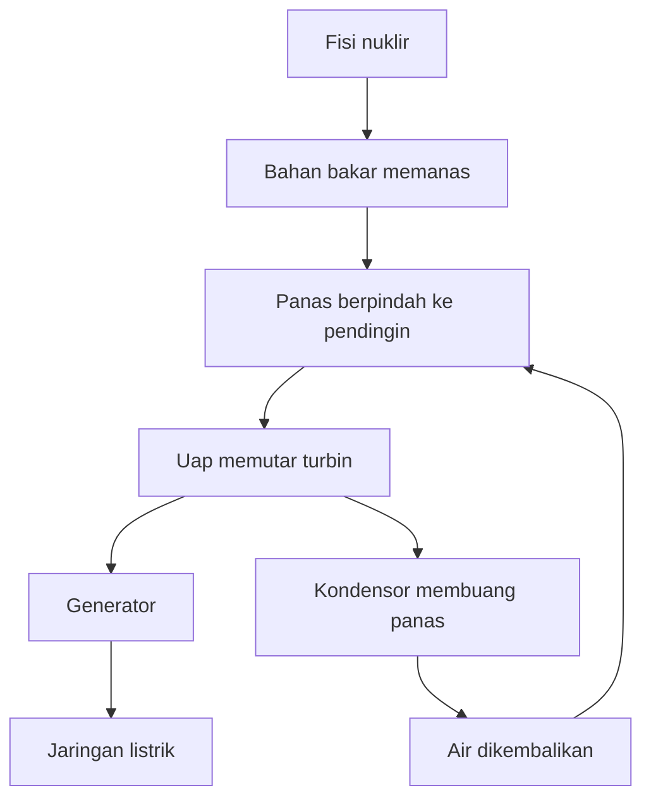
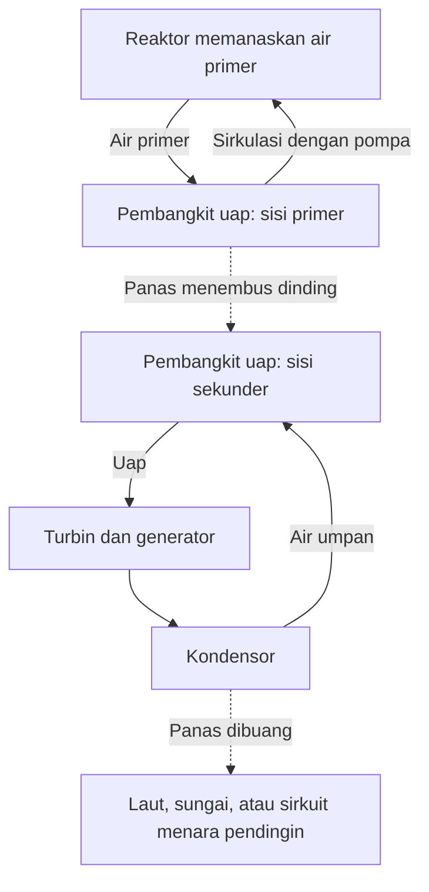

## 1. Di ujung prosesnya ada generator yang berputar

Istilah energi nuklir mungkin mengingatkan kita pada mesin yang mengambil listrik langsung dari atom. Namun, pada sebagian besar pembangkit yang umum digunakan, perangkat penghasil listrik adalah generator yang terhubung ke turbin. Reaktor menghasilkan panas, panas menghasilkan uap, lalu uap memutar turbin.

Alur besar ini juga digunakan oleh pembangkit uap berbahan bakar batu bara atau gas alam. Perbedaannya terletak pada sumber panas: terutama reaksi kimia pada pembangkit fosil dan perubahan inti atom pada pembangkit nuklir. Di antara fisi dan generator terdapat air yang bersirkulasi, pembangkit uap, pipa, turbin, dan kondensor.

Mengikuti alur tersebut membantu menjelaskan keunggulan sekaligus tantangannya. Sedikit bahan bakar dapat menyediakan panas yang besar, tetapi bahan bakar dapat mengalami panas berlebih jika panas itu tidak dikeluarkan. Bahkan setelah reaksi berantai dihentikan, zat radioaktif yang sudah terbentuk tetap menghasilkan panas. **Menghentikan reaktor tidak sama dengan membuat pembangkit cukup dingin.**

Artikel ini berfokus pada **reaktor air ringan**, yang banyak digunakan untuk pembangkitan komersial. Diagram menjelaskan fungsi, bukan rancangan perpipaan atau prosedur pengoperasian. Fusi menggabungkan inti ringan dan berbeda dari fisi yang dibahas di sini. [Pengantar reaktor dari Departemen Energi AS][doe-reactor]

## 2. Membakar bahan bakar berbeda dari mengubah inti atom

Materi tersusun dari atom. Di pusat atom terdapat inti berisi proton dan neutron, dengan elektron di sekitarnya. Ketika batu bara terbakar, ikatan antara atom seperti karbon dan oksigen berubah. Reaksi kimia ini terutama melibatkan elektron; inti karbon tidak berubah menjadi unsur lain.

Dalam fisi, inti berat terbelah menjadi dua inti yang relatif lebih ringan serta produk lainnya. Energi dilepaskan karena susunan inti sebelum dan sesudah reaksi memiliki energi yang berbeda. Energi yang diperlukan untuk memisahkan inti menjadi proton dan neutron individual disebut energi ikat.

Mengapa susunan yang terikat lebih kuat justru melepaskan energi? Bayangkan benda jatuh dari rak tinggi. Ketika berpindah ke keadaan berenergi lebih rendah, selisih energinya dilepaskan. Memecahkan sesuatu tidak otomatis menghasilkan energi. Ada pula reaksi yang memerlukan masukan energi.

Energi ikat per nukleon umumnya meningkat dari inti sangat ringan menuju inti bermassa menengah, dengan nilai besar di sekitar besi dan nikel. Karena itu, reaksi tertentu dapat melepaskan energi melalui pembelahan inti berat maupun penggabungan inti ringan. [ATOMICA: struktur inti][binding]

Hubungan selisih massa dan energi adalah:

$$
E=\Delta m c^2
$$

$\Delta m$ adalah selisih massa diam dan $c$ adalah kecepatan cahaya. Ini tidak berarti seluruh bahan bakar lenyap menjadi listrik. Fragmen dan neutron tetap ada; selisih tersebut muncul sebagai energi kinetik dan radiasi. Pembangkit juga tidak dapat mengubah seluruh panas yang dihasilkan menjadi listrik.

## 3. Energi fisi mula-mula memanaskan bahan bakar

Uranium-235 merupakan salah satu isotop fisil yang digunakan dalam reaktor air ringan. Setelah menyerap neutron, intinya dapat memasuki keadaan tereksitasi lalu membelah, menghasilkan fragmen, neutron, dan radiasi gamma. Kombinasi fragmennya beragam; dua unsur yang sama tidak selalu muncul pada setiap kejadian.

Sebagian besar energi dibawa oleh fragmen yang bergerak cepat. Fragmen bertumbukan dengan materi sekitarnya, melambat, dan memanaskan bahan bakar. Panas kemudian melewati kelongsong bahan bakar menuju pendingin. Dari reaksi inti hingga stopkontak rumah, energi berubah bentuk berkali-kali.

Untuk perkiraan teknik, sekitar 200 MeV panas per fisi merupakan nilai yang berguna. Neutrino membawa sebagian energi keluar, sementara penangkapan neutron juga menyumbang energi. Perhitungan terperinci bergantung pada isotop dan batas sistem yang digunakan. [ATOMICA: reaksi fisi][fission]

Satu elektronvolt setara dengan sekitar $1{,}602\times10^{-19}$ J, sehingga 200 MeV kira-kira $3{,}20\times10^{-11}$ J. Nilai satu kejadian terlihat kecil, tetapi jumlah atom dalam materi sehari-hari sangat besar.

$$
\dot N\approx\frac{P_{\mathrm{th}}}{E_f}
$$

$P_{\mathrm{th}}$ adalah daya termal, $E_f$ panas per fisi, dan $\dot N$ jumlah fisi per detik. Membagi 3 miliar watt dengan energi tersebut memberikan sekitar $9{,}4\times10^{19}$ fisi per detik. Ini menunjukkan skala, bukan perhitungan rinci bahan bakar reaktor.

Daya besar dari sedikit bahan bakar berarti energi per satuan massanya tinggi. Bukan berarti setiap fisi merupakan ledakan makroskopis. Agar reaksi mikroskopis tersebut berlangsung stabil, reaksi berantai perlu dikendalikan.

## 4. Kritis berarti reaksi berantai berada dalam keseimbangan

Neutron dari satu fisi dapat memicu fisi lain, yang kembali melepaskan neutron. Inilah reaksi berantai. Tidak semua neutron ikut melanjutkannya: sebagian terserap tanpa menghasilkan fisi dan sebagian keluar dari teras reaktor.

**Faktor multiplikasi efektif**, $k_{\mathrm{eff}}$, menyatakan keseimbangan ini. Secara konseptual, faktor tersebut menunjukkan perubahan populasi neutron dari satu generasi ke generasi berikutnya.

| Keadaan | Kondisi | Kecenderungan umum |
|---|---|---|
| Subkritis | $k_{\mathrm{eff}}<1$ | Rantai menyusut jika sumber eksternal diabaikan |
| Kritis | $k_{\mathrm{eff}}=1$ | Generasi berikutnya seimbang |
| Superkritis | $k_{\mathrm{eff}}>1$ | Rantai cenderung berkembang |

Berbeda dari makna gawat dalam percakapan sehari-hari, kekritisan reaktor bukan dengan sendirinya kecelakaan. Reaktor yang beroperasi pada daya tetap menyeimbangkan produksi dan kehilangan neutron. Kekritisan juga tidak menentukan besar daya: reaktor dapat kritis pada daya rendah maupun tinggi.

Model generasi yang sengaja disederhanakan adalah:

$$
N_g=N_0\left(k_{\mathrm{eff}}\right)^g
$$

Setelah 100 generasi, perbandingan populasi akhir terhadap awal kira-kira 0,366 untuk 0,99; 1 untuk 1,00; dan 2,70 untuk 1,01. Perbedaan kecil dapat terakumulasi. Namun, persamaan ini tidak mencakup waktu generasi, neutron kasip, perubahan suhu, atau perangkat kendali. **Persamaan ini tidak dapat memprediksi berapa detik perubahan daya nyata berlangsung.**

## 5. Moderator, penyerap, dan pendingin melakukan pekerjaan berbeda

Mengetahui bahwa reaktor berisi air dan batang belum cukup jika fungsinya tertukar. Memperlambat neutron, menyerap neutron, dan memindahkan panas merupakan tugas yang berbeda.

**Moderator** menurunkan energi neutron. Neutron hasil fisi bergerak cepat; dalam reaktor air ringan, tumbukan dengan inti dalam air memperlambatnya. Desain memanfaatkan peluang fisi uranium-235 yang lebih tinggi pada wilayah energi neutron rendah.

**Penyerap kendali** menangkap neutron sehingga mengurangi jumlah yang tersedia untuk melanjutkan rantai. Batang kendali menjalankan fungsi ini. Memperlambat neutron berbeda dari mengeluarkannya dari reaksi berantai. Mengatakan bahwa batang kendali hanya memperlambat neutron akan mencampuradukkan kedua fungsi.

**Pendingin** mengangkut panas dari bahan bakar. Air menjadi moderator sekaligus pendingin pada reaktor air ringan, tetapi kombinasi itu tidak berlaku untuk semua reaktor. Jenis lain dapat menggunakan grafit sebagai moderator dan gas sebagai pendingin. [Materi pendidikan NRC][nrc-reactors]

| Fungsi | Besaran atau proses yang dipengaruhi | Contoh pada reaktor air ringan |
|---|---|---|
| Moderasi | Energi neutron | Air |
| Penyerapan dan pengendalian reaksi | Neutron yang tersedia untuk rantai | Batang kendali dan penyerap lainnya |
| Pendinginan dan pengangkutan panas | Suhu bahan bakar dan sistem | Air yang bersirkulasi |
| Pengungkungan | Perpindahan zat radioaktif | Kelongsong, batas tekanan, dan pengungkung |

Karena air memiliki dua tugas, suhu dan kerapatannya memengaruhi pendinginan serta perilaku neutron. Fisika nuklir terhubung erat dengan perpindahan panas dan aliran fluida.

## 6. Neutron kasip dan umpan balik suhu memberi waktu untuk kendali

Sebagian besar neutron fisi dilepaskan segera. Sebagian kecil muncul kemudian setelah peluruhan radioaktif produk fisi. **Neutron kasip**, atau neutron tertunda, sangat memengaruhi skala waktu perilaku reaktor meskipun jumlahnya kecil.

Rantai yang dapat bertahan dan berkembang cepat hanya dengan neutron serentak berbeda dari rantai yang membutuhkan neutron kasip untuk mencapai keseimbangan. Perbedaan ini penting dalam kendali normal. Manusia dan mesin tidak menghentikan fisi satu per satu; mereka mengatur keseimbangan neutron secara keseluruhan. [IAEA: fisika nuklir dan teori reaktor][reactor-theory]

Sejumlah efek fisik menurunkan reaktivitas saat suhu naik. Efek Doppler mengubah penyerapan neutron pada uranium-238 dan isotop lainnya ketika bahan bakar memanas, sehingga memberikan umpan balik negatif yang penting dalam desain teras. [ATOMICA: desain teras PWR][core-design]

Namun, tidak tepat menyimpulkan bahwa setiap kenaikan suhu selalu membuat reaktor berhenti dengan aman. Dampak kerapatan moderator, fraksi uap, dan kondisi bahan bakar bergantung pada desain dan keadaan operasi. Umpan balik fisik dipadukan dengan instrumentasi, sistem kendali, serta perangkat penghentian.

Produk fisi juga menimbulkan ketergantungan pada riwayat operasi. Xenon-135, misalnya, menyerap neutron dengan kuat dan jumlahnya dipengaruhi daya sebelumnya. Mengubah daya bukan sekadar memutar pengatur api: operasi sebelumnya juga penting, selain suhu dan daya saat ini.

## 7. PWR: air bertekanan memanaskan sirkuit air terpisah

Reaktor air bertekanan, atau PWR, mempertahankan pendingin primer pada tekanan tinggi agar tidak mendidih secara massal ketika menerima panas di teras. Air panas memasuki pembangkit uap dan memindahkan panas melintasi dinding logam ke air dalam sirkuit sekunder.

Uap sekunder menuju turbin, sedangkan air primer kembali ke reaktor. Dalam keadaan normal, panas berpindah tanpa kedua aliran air bercampur. Mengirim air reaktor langsung ke turbin bukan susunan dasar PWR.

Susunan ini memisahkan pendingin primer yang berpotensi radioaktif dari sirkuit turbin. Meski demikian, tabung pembangkit uap membentuk batas penting dan memerlukan pemeriksaan. Memisahkan sirkuit tidak menghapus pemeliharaan; pemisahan menciptakan batas yang keutuhannya harus dijaga.

Perangkat penekan mengatur tekanan primer, sementara pompa mengedarkan pendingin. Instalasi nyata juga memiliki sistem pendukung untuk mengukur dan mempertahankan tekanan, suhu, serta jumlah air. [DOE: cara kerja PWR][pwr]

## 8. BWR: uap dihasilkan di dalam reaktor

Reaktor air didih, atau BWR, sengaja mendidihkan air di dalam reaktor. Tetesan cairan dipisahkan dari uap sebelum uap memasuki turbin. Setelah melakukan kerja, uap dikondensasikan dan dikembalikan sebagai air umpan.

Berbeda dari PWR, uap yang berasal dari air yang melewati teras mencapai sirkuit turbin, sehingga bagian itu juga memerlukan pengendalian radiologis. Siklus dasar tidak menggunakan pembangkit uap terpisah seperti pada PWR untuk memindahkan panas antara sirkuit primer dan sekunder. [NRC: reaktor air didih][bwr]

| Aspek | PWR | BWR |
|---|---|---|
| Lokasi utama pembentukan uap | Sisi sekunder pembangkit uap | Di dalam reaktor |
| Air di teras | Tekanan tinggi menekan pendidihan massal | Pendidihan dimanfaatkan |
| Fluida ke turbin | Uap sekunder | Uap yang dihasilkan reaktor |
| Susunan utama | Sirkuit dipisahkan pembangkit uap | Hubungan uap langsung antara reaktor dan turbin |
| Kebutuhan bersama | Pendinginan, penghentian, pengungkungan, pembuangan panas | Pendinginan, penghentian, pengungkungan, pembuangan panas |

Keduanya menggunakan air, tetapi sistemnya berbeda. Kesederhanaan yang terlihat tidak menentukan keselamatan atau biaya. Perbandingan harus mencakup fungsi saat kecelakaan, akses pemeriksaan, bahan, dan kondisi operasi.

## 9. Mengapa seluruh panas tidak bisa menjadi listrik?

Turbin uap mengubah pemuaian uap panas bertekanan menjadi putaran. Generator mengubah putaran itu menjadi listrik melalui induksi elektromagnetik. Kondensor kemudian mendinginkan uap menjadi air. Penurunan volume yang besar membantu mempertahankan tekanan rendah di keluaran turbin dan memudahkan pemompaan kembali fluida kerja.

Pendinginan bukan aksesori untuk menyembunyikan ketidakefisienan. Mesin kalor siklik harus menerima panas dari sumber panas dan membuang sebagiannya ke tempat bersuhu lebih rendah. Bahkan mesin ideal tidak dapat mengubah seluruh panas menjadi kerja ketika beroperasi antara suhu-suhu yang terbatas.

$$
\eta_{\mathrm{Carnot}}=1-\frac{T_c}{T_h}
$$

Suhu yang digunakan adalah suhu mutlak dalam kelvin, bukan Celsius. Dengan asumsi sisi panas 570 K dan sisi dingin 300 K, batas idealnya sekitar 47%. Penukar panas nyata, gesekan, kondisi uap, turbin, dan generator menurunkan efisiensi lebih lanjut. Contoh dua suhu ini menyederhanakan siklus nyata yang memiliki rentang suhu.

Perkiraan efisiensi pembangkitan reaktor air ringan adalah sekitar sepertiga. Artinya bukan hanya sepertiga fisi yang terjadi, melainkan sepertiga panas menjadi listrik. Suhu lebih tinggi dapat menaikkan efisiensi, tetapi bahan, korosi, tekanan, dan batas bahan bakar menjadi kendala. [ATOMICA: panas buangan pembangkit nuklir][thermal]

Pembangkit hipotetis dengan daya termal 3.000 MW dan efisiensi 33% menghasilkan daya listrik 990 MW serta membuang sekitar 2.010 MW sebagai panas.

$$
P_e=\eta P_{\mathrm{th}},\qquad
P_{\mathrm{out}}=P_{\mathrm{th}}-P_e
$$

Neraca sederhana ini belum memisahkan konsumsi daya peralatan bantu. Pelaporan nyata membedakan keluaran generator dari listrik bersih yang dikirim setelah pompa dan peralatan lain menggunakan bagiannya. Sistem pendinginan besar menangani sisa panas tersebut. Pembangkit pesisir dapat membuang panas ke laut; pembangkit pedalaman dapat memakai sungai atau menara pendingin. Kepulan putih menara pendingin biasanya merupakan tetesan air yang terlihat, dan penampilannya saja tidak menunjukkan besarnya pelepasan radioaktif.

## 10. Panas peluruhan tetap ada setelah reaktor dihentikan

Batang kendali dan langkah penghentian lainnya sangat mengurangi panas dari reaksi berantai. Namun, banyak isotop radioaktif hasil operasi masih berada di teras. Peluruhannya melepaskan energi, sehingga **panas peluruhan terus muncul setelah penghentian**.

Analogi mematikan pemanas listrik tidak lengkap. Reaktor menyimpan panas dan masih menghasilkan panas baru setelahnya. Menunggu saja tidak cukup: jalur pembuangan panas yang berfungsi harus tetap tersedia. [IAEA: prinsip dasar keselamatan nuklir][safety-basics]

Untuk satu isotop radioaktif, jumlah atom tersisa mengikuti:

$$
N(t)=N(0)\,2^{-t/T_{1/2}}
$$

$T_{1/2}$ adalah waktu paruhnya. Isotop berumur pendek berkurang cepat, sedangkan yang berumur panjang berkurang lambat. Bahan bakar bekas mengandung banyak isotop dan rantai peluruhan. Satu waktu paruh tidak dapat mewakili seluruh panas peluruhan reaktor. Daya sebelumnya, lama operasi, dan komposisi bahan bakar juga berpengaruh.

Sebagai gambaran skala, 1% dari 3.000 MW masih sebesar 30 MW. Ini bukan pernyataan tentang panas peluruhan pada waktu tertentu setelah penghentian. Contoh tersebut menunjukkan bahwa sebagian kecil dari daya besar tetap dapat berarti. Persentase kecil tidak boleh disamakan dengan nol.

Penghentian, pendinginan, catu daya, dan pengukuran saling terkait. Pendinginan tetap diperlukan; pompa dan katup mungkin dibutuhkan, sedangkan instrumen memperlihatkan kondisinya. Persiapan menghadapi kecelakaan harus mempertahankan rangkaian fungsi tersebut.

## 11. Keselamatan berarti menghentikan, mendinginkan, dan mengungkung

Keselamatan tidak dapat dijelaskan dengan satu dinding tebal. Keselamatan menggabungkan kemampuan menekan reaksi, membuang panas, dan mencegah zat radioaktif keluar.

Pelet bahan bakar menahan sebagian produk radioaktif, sementara kelongsong memisahkan bahan bakar dari pendingin. Batas tekanan dan pengungkung memberikan penghalang tambahan. Tidak semua zat tertahan dengan cara yang sama, dan suhu serta tekanan kecelakaan dapat mengubah penghalang tersebut. Menghitung jumlah dinding tidak membuktikan kebocoran mustahil terjadi.

**Redundansi** menyediakan cadangan untuk kegagalan peralatan individual. Namun, beberapa unit di ruangan dan ketinggian yang sama bisa terendam banjir bersamaan. **Keragaman**, dengan prinsip atau pasokan berbeda, dan **kemandirian**, termasuk pemisahan fisik, juga penting. Menambah cadangan identik tidak menghilangkan kegagalan akibat penyebab bersama.

| Fungsi | Akibat jika hilang | Pertimbangan desain |
|---|---|---|
| Menghentikan reaksi | Produksi panas tidak cukup ditekan | Metode penghentian, pengukuran, tindakan andal |
| Mendinginkan bahan bakar | Bahan bakar dan struktur terlalu panas serta dapat rusak | Jalur pembuangan panas, air, daya, waktu yang tersedia |
| Mengungkung material | Zat radioaktif berpindah atau keluar | Keutuhan penghalang, tekanan, pengelolaan kebocoran |
| Mengetahui kondisi pembangkit | Pengambilan keputusan sulit | Instrumen andal, daya, komunikasi, pelatihan |

Keselamatan pasif menggunakan gravitasi atau sirkulasi alamiah untuk mengurangi ketergantungan pada peralatan bertenaga. Pasif bukan berarti tanpa syarat atau tanpa batas waktu. Jumlah air, perbedaan tekanan, keadaan katup, dan ketersediaan tempat pembuangan panas tetap menentukan.

Setelah Fukushima Daiichi, NRC memperkuat upaya mempertahankan fungsi keselamatan ketika pasokan listrik terpasang tidak tersedia serta pemantauan kolam bahan bakar bekas. Pelajaran yang lebih luas adalah bahwa satu kejadian eksternal dapat merusak daya, pendinginan, dan instrumentasi sekaligus. [NRC: pelajaran dari Fukushima][fukushima]

## 12. Dari penemuan fisika menjadi pembangkit

Penemuan fisi, pembuktian reaksi berantai berkelanjutan, pembangkitan listrik, dan pengiriman listrik ke jaringan merupakan tonggak yang berbeda.

Setelah hasil eksperimen Hahn dan Strassmann pada akhir 1938, Meitner dan Frisch menjelaskan proses tersebut sebagai pembelahan inti. Hal ini memperlihatkan kemungkinan memperoleh energi inti yang besar. Namun, menunjukkan adanya reaksi berbeda dari memanfaatkannya secara andal. [American Physical Society: penemuan dan penafsiran][discovery]

Pada 2 Desember 1942, tim Fermi mencapai reaksi berantai terkendali yang dapat mempertahankan diri di Chicago Pile-1. Fasilitas ini bukan pembangkit komersial. Percobaan tersebut membuktikan kemampuan fisik penting dalam penelitian yang erat terkait program militer masa perang; penggunaan sipil kemudian tidak menghapus konteks itu. [Argonne: CP-1][cp1]

Pada 1951, EBR-I di Amerika Serikat menghasilkan listrik dan menyalakan lampu. Pada 1954, reaktor Obninsk di Uni Soviet memasok listrik ke jaringan. Pengetahuan dari reaktor demonstrasi dan reaktor kapal, pembuatan material, mesin uap, serta pengembangan regulasi kemudian mendukung pembangkitan komersial. [Idaho National Laboratory: EBR-I][ebr], [Catatan sejarah IAEA][iaea-history]

| Tahap | Pertanyaan utama | Kemampuan yang dibutuhkan |
|---|---|---|
| Memahami reaksi | Mengapa energi dilepaskan? | Fisika inti dan pengukuran |
| Mempertahankan rantai | Bisakah reaksi berlanjut secara terkendali? | Keseimbangan neutron, kendali, perisai |
| Mendemonstrasikan listrik | Bisakah panas menggerakkan mesin dan generator? | Pendingin, penukar panas, turbin |
| Operasi komersial | Bisakah pasokan andal bertahan bertahun-tahun? | Material, pemeliharaan, bahan bakar, organisasi operasi |
| Tanggung jawab jangka panjang | Bisakah seluruh daur hidup dikelola? | Regulasi, limbah, biaya, kesepakatan masyarakat |

Energi nuklir bukan konsekuensi otomatis dari penemuan menarik. Menjaga material tetap utuh serta mengelola pemeliharaan, penghentian, dan masa operasi panjang membutuhkan rekayasa yang jauh melampaui sekadar menghasilkan reaksi.

## 13. Bahan bakar tidak dimasukkan dalam bentuk bijih

Bahan bakar melalui penambangan, pengolahan, penyesuaian komposisi isotop bila diperlukan, pembuatan, penggunaan, dan pengelolaan setelah digunakan. Inilah daur bahan bakar. Kata daur tidak selalu berarti semuanya kembali ke awal: kebijakan dapat memilih pembuangan langsung atau pemulihan sebagian material untuk digunakan kembali.

Uranium alam terutama berisi uranium-238, dengan sekitar 0,7% uranium-235. Bahan bakar reaktor air ringan umumnya meningkatkan bagian uranium-235 menjadi beberapa persen. Uranium dioksida biasanya dibuat menjadi pelet kecil melalui sintering, lalu dimasukkan ke kelongsong logam. Banyak batang bahan bakar membentuk satu perangkat bahan bakar. [IAEA: dasar tenaga nuklir][fuel-basics]

Selama operasi, isotop fisil dikonsumsi, produk fisi menumpuk, dan penyerapan neutron menghasilkan isotop lain. Prosesnya lebih rumit daripada sekadar memakai uranium-235 awal sampai habis.

Penggantian bahan bakar tidak menunggu seluruh uranium lenyap. Kemampuan mempertahankan reaksi, akumulasi penyerap neutron, keutuhan material, dan distribusi daya teras juga menentukan. Material yang tersisa belum tentu dapat terus digunakan secara aman dan ekonomis dalam susunan yang sama.

Mutu pembuatan penting karena panas harus melewati pelet, celah, kelongsong, dan pendingin. Bila suatu bagian memindahkan panas kurang baik, suhu internal berubah meskipun dayanya sama. Ilmu material dan perpindahan panas mendukung desain bahan bakar bersama fisika nuklir. [DOE: daur bahan bakar][fuel-cycle]

## 14. Bahan bakar bekas: penyimpanan bukan pembuangan akhir

Bahan bakar yang baru dikeluarkan dari reaktor memancarkan radiasi dan menghasilkan panas peluruhan. Penyimpanan dalam air mula-mula menyediakan pendinginan dan perisai radiasi. Bahan bakar yang memenuhi persyaratan dapat kemudian dipindah ke penyimpanan kering. Waktu dan syaratnya bergantung pada bahan bakar serta fasilitas.

Air membuang panas dan melemahkan radiasi. Pada penyimpanan kering, wadah dan struktur mengungkung serta menjadi perisai sambil memungkinkan panas keluar. Memindahkan bahan bakar dari air tidak berarti radioaktivitasnya sudah hilang.

**Penyimpanan umumnya mengandaikan pengelolaan berkelanjutan dan kemungkinan pengambilan kembali; pembuangan akhir bertujuan mengisolasi dalam jangka panjang.** Pemrosesan ulang tetap menyisakan material yang tidak diinginkan dan limbah proses. Penggunaan ulang tidak menghapus kebutuhan pengelolaan limbah. [IAEA: penyimpanan bahan bakar bekas][spent-fuel]

Limbah radioaktif bukan satu bahan seragam. Limbah pemeliharaan, material pembongkaran, dan limbah terkait bahan bakar berbeda dalam isotop, aktivitas, panas, serta volume. Pengelolaan yang tepat bergantung pada kandungan dan jalur perpindahannya menuju manusia atau lingkungan, bukan hanya label radioaktif.

Pembuangan geologis menggabungkan bentuk limbah, wadah, bahan penghalang buatan, dan geologi untuk membatasi perpindahan. Rentang waktu panjang memerlukan eksperimen, observasi, pemahaman air tanah, serta pemodelan. Pemilihan lokasi, pemantauan, tanggung jawab, dan dialog dengan masyarakat setempat juga penting.

Menunda pengelolaan masa depan mengaburkan biaya dan manfaat. Evaluasi harus melampaui biaya bahan bakar selama pembangkitan dan mencakup material yang dikeluarkan serta masa setelah pembangkit ditutup.

## 15. Bedakan daya, energi, dan biaya

Kapasitas 1 juta kW menyatakan daya pada suatu saat. kWh menyatakan energi yang diberikan selama suatu jangka waktu. Mencampur keduanya akan mencampur ukuran pembangkit dengan sumbangan nyatanya.

Pembangkit hipotetis berkapasitas 1 GW dengan faktor kapasitas tahunan 90% menghasilkan sekitar 7,884 TWh:

$$
E_{\mathrm{year}}=P_{\mathrm{rated}}\times8760\,\mathrm{h}\times CF
$$

$CF$ adalah faktor kapasitas, bukan sekadar keandalan. Penggantian bahan bakar, inspeksi, pengurangan karena permintaan, dan penghentian oleh regulator turut memengaruhinya. Nilai 90% adalah contoh, bukan jaminan untuk negara atau pembangkit tertentu.

Bahan bakar nuklir memiliki kerapatan energi tinggi dan reaktornya tidak membakar bahan bakar fosil. Nuklir merupakan sumber listrik rendah karbon, tetapi penambangan, pengolahan, pembangunan, dan dekomisioning membuat emisi daur hidupnya tidak nol. Perbandingan membutuhkan batas penilaian yang konsisten. [IPCC AR6: sistem energi][ipcc]

Waktu pembangunan dan investasi awal penting secara ekonomi. Keterlambatan memengaruhi pembiayaan serta biaya konstruksi. Memperpanjang operasi pembangkit yang sudah ada berbeda secara ekonomi dari membangun yang baru.

Pada tingkat jaringan, perubahan permintaan, pembangkit lain, transmisi, penyimpanan, dan cadangan juga penting. Pernyataan bahwa daya nuklir tidak bisa berubah maupun bahwa daya nuklir selalu bebas mengikuti permintaan sama-sama terlalu sederhana. Fleksibilitas teknis berbeda dari operasi praktis setelah pengelolaan bahan bakar, pemeliharaan, dan ekonomi dipertimbangkan.

## 16. Apa yang ingin diubah reaktor kecil dan maju?

Reaktor modular kecil, atau SMR, berusaha mengubah produksi, konstruksi, atau penerapan melalui unit lebih kecil dan pendekatan modular. SMR bukan satu teknologi reaksi nuklir: konsepnya mencakup reaktor air ringan maupun pendingin dan teras lainnya. [IAEA: pengertian SMR][smr]

Unit kecil mungkin lebih mudah dibuat di pabrik dan memerlukan modal lebih rendah per unit. Sebaliknya, sebagian keuntungan skala besar dapat hilang. Manfaat produksi berulang bergantung pada pesanan nyata, standardisasi desain, regulasi, serta rantai pasok.

Desain lain bertujuan menyediakan panas industri bersuhu tinggi, menggunakan neutron cepat, atau memakai pendingin berbeda. Tujuannya mencakup pemanfaatan panas yang lebih luas, penggunaan sumber daya, karakteristik limbah, fungsi keselamatan, dan metode pembangunan. Perbaikan satu unsur tidak otomatis menyelesaikan unsur lainnya.

Saat membaca tentang reaktor maju, bedakan konsep, fasilitas uji, pembangkit demonstrasi, dan operasi komersial. Rencana tidak sama dengan sistem yang terbukti melalui operasi panjang. Menilai potensinya berarti memeriksa capaian nyata dan hal yang masih harus dibuktikan.

## 17. Lima pertanyaan ketika membaca berita nuklir

Sebelum menyimpulkan, pastikan apa yang sebenarnya diukur.

1. **Daya yang mana?** Daya termal reaktor, keluaran generator, dan daya bersih ke jaringan berbeda.
2. **Dalam keadaan apa?** Operasi, baru berhenti, berhenti lama, dan setelah bahan bakar dikeluarkan memiliki beban panas serta kebutuhan peralatan berbeda.
3. **Batas sistemnya di mana?** Teras, sirkuit primer, gedung, tapak, dan lingkungan melibatkan zat serta proses berbeda.
4. **Besaran apa?** Bq mengukur aktivitas; Gy mengukur dosis serap, yaitu energi per satuan massa; Sv digunakan untuk menilai dampak radiasi. Angkanya tidak dapat dibandingkan langsung. [NRC: mengukur radiasi][radiation]
5. **Periode dan biaya apa saja?** Hasil berubah menurut masuk atau tidaknya pasokan bahan bakar, konstruksi, penutupan, dan limbah.

Penilaian kesehatan juga bergantung pada jenis radiasi, jalur paparan, durasi, dan kondisi pengukuran. Di sini kita membedakan besaran, bukan menyimpulkan kondisi kesehatan seseorang dari angka yang berdiri sendiri.

Fisika fisi menyediakan panas. Rekayasa menjadikannya sumber daya yang berguna dengan memindahkan panas, menghasilkan listrik, dan mempertahankan kendali sesudahnya. **Tanyakan bukan hanya apakah panas bisa dihasilkan, tetapi ke mana panas mengalir, apa yang terjadi jika jalurnya gagal, dan siapa yang mengelola material setelahnya.** Itulah cara yang jelas untuk memahami tenaga nuklir.

## Sumber dan cakupan ilustrasi

Perhitungan merupakan perkiraan pendidikan dengan asumsi yang dinyatakan, bukan penilaian kinerja atau margin keselamatan pembangkit. Gambar sampul adalah ilustrasi konseptual buatan AI; dimensi, pipa, dan warnanya bukan gambar teknik.

- [DOE: dasar reaktor][doe-reactor], [PWR][pwr], [fisi][doe-fission], [daur bahan bakar][fuel-cycle]
- [ATOMICA: struktur inti][binding], [fisi][fission], [teras PWR][core-design], [panas buangan][thermal] (bahasa Jepang)
- [NRC: pendidikan][nrc-reactors], [BWR][bwr], [pelajaran Fukushima][fukushima], [besaran radiasi][radiation]
- [IAEA: teori reaktor][reactor-theory], [keselamatan][safety-basics], [sejarah][iaea-history], [bahan bakar][fuel-basics], [penyimpanan][spent-fuel], [SMR][smr]
- [Argonne: CP-1][cp1], [Idaho National Laboratory: EBR-I][ebr], [APS: penemuan fisi][discovery]
- [IPCC: AR6 Kelompok Kerja III, Bab 6][ipcc]

[doe-reactor]: https://www.energy.gov/ne/articles/nuclear-101-how-does-nuclear-reactor-work
[binding]: https://atomica.jaea.go.jp/data/detail/dat_detail_03-06-03-01.html
[fission]: https://atomica.jaea.go.jp/data/detail/dat_detail_03-06-03-04.html
[nrc-reactors]: https://www.nrc.gov/education-regulatory-research/the-student-corner/unit-3-nuclear-reactorsenergy-generation
[reactor-theory]: https://gnssn.iaea.org/main/bptc/BPTC%20Module%20Documents/Module01%20Nuclear%20physics%20and%20reactor%20theory.pdf
[core-design]: https://atomica.jaea.go.jp/data/detail/dat_detail_02-04-02-01.html
[pwr]: https://www.energy.gov/ne/articles/infographic-how-does-pressurized-water-reactor-work
[bwr]: https://www.nrc.gov/reactors/power/bwrs
[thermal]: https://atomica.jaea.go.jp/data/detail/dat_detail_01-04-03-02.html
[safety-basics]: https://gnssn.iaea.org/main/bptc/BPTC%20Module%20Documents/Module03%20Basic%20principles%20of%20nuclear%20safety.pdf
[fukushima]: https://www.nrc.gov/regulations-legislation/fact-sheets-brochures/backgrounder-on-nrc-response-to-lessons-learned-from-fukushima
[doe-fission]: https://www.energy.gov/science/doe-explainsnuclear-fission
[cp1]: https://www.ne.anl.gov/About/cp1-pioneers/
[ebr]: https://inl.gov/ebr/
[iaea-history]: https://www-pub.iaea.org/MTCD/Publications/PDF/Pub1032_web.pdf
[fuel-basics]: https://nucleus-qa.iaea.org/sites/graphiteknowledgebase/wiki/Guide_to_Graphite/Fundamentals%20of%20Nuclear%20Power.aspx
[fuel-cycle]: https://www.energy.gov/ne/nuclear-fuel-cycle
[spent-fuel]: https://nucleus-apps.iaea.org/nss-oui/Content/Index?CollectionId=m_f7375b40-3d77-4ea5-a2e3-77090916bc67__8_0&type=PublishedCollection
[ipcc]: https://www.ipcc.ch/report/ar6/wg3/chapter/chapter-6/
[smr]: https://www.iaea.org/newscenter/news/what-are-small-modular-reactors-smrs
[discovery]: https://journals.aps.org/prl/50years/timeline
[radiation]: https://www.nrc.gov/facilities-safety/radiation-protection/radiation-and-its-health-effects/measuring-radiation
